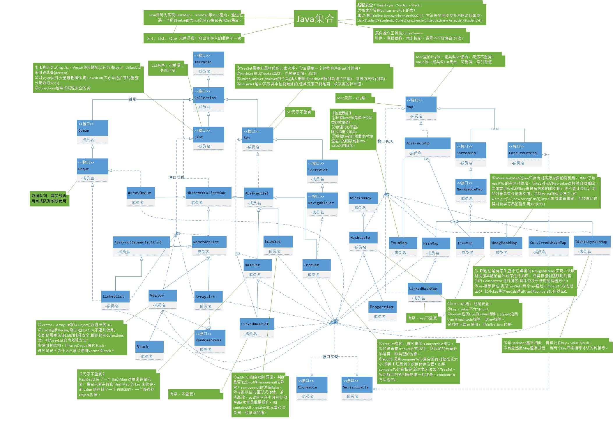

## Java集合体系详解
[参考博客--Java集合详解](https://www.cnblogs.com/chenglc/p/8073049.html)
### 常见数据结构
数据结构定义：数据结构就是组织数据的方式。
**栈**：先进先出
**数组**：用来存储同一种类型元素的容器。特点，在存储中是连续的，查询快，增删慢。
**链表**：把一些结点通过链子连接起来的数据结构。每个结点由地址域或者数值域组成。特点，增删快，查询慢。

###Java常用集合
#### 概述
- Collection和Map，是集合框架的根接口
- Collection的子接口：
    - Set下实现类：HashSet、LinkedHashSet、TreeSet(Set的子接口SortedSet，他的实现类为TreeSet)
    - List下实现类：ArrayList、LinkedList、Vector
- Map下有HashTable、HashMap、LinkedHashMap、TreeMap
- Collection下还有Queue接口，有PriorityQueue类

#### List集合
有序列表，允许存放重复的元素；
**实现类**：
ArrayList：数组实现，查询快，增删慢，轻量级；（线程不安全。）
LinkedList：双向链表实现，增删快，查询慢（线程不安全）
Vector：数组实现，重量级。（线程安全，使用少）

**ArrayList**
底层是Object数组，所以ArrayList具有数组的查询速度快的优点以及增删速度慢的缺点。
而在LinkedList的底层是一种双向循环链表。在此链表上每一个数据节点都由三部分组成：前指针（指向前面的节点的位置），数据，后指针（指向后面的节点的位置）。最后一个节点的后指针指向第一个节点的前指针，形成一个循环。
双向循环链表的查询效率低但是增删效率高。
ArrayList和LinkedList在用法上没有区别，但是在功能上还是有区别的。

**LinkedList**
LinkedList是采用双向循环链表实现的。利用LinkedList实现栈(stack)、队列(queue)、双向队列(double-ended queue )。它具有方法addFirst()、addLast()、getFirst()、getLast()、removeFirst()、removeLast()等

经常用在增删操作较多而查询操作较少的情况下：队列和堆栈。
队列：先进先出的数据结构。
栈：后进先出的数据结构。
注意，在使用栈的时候，一定不能提供非最后一个元素出栈的方法。

**Vector**
（与ArrayList相似，区别是Vector是重量级的组件，使用使消耗的资源比较多。）
在考虑并发的时候使用Vector（保证线程安全）。
不考虑并发场景使用ArrayList（不保证线程安全）。

**ArrayList自动扩充机制**
实现机制：ArrayList.ensureCapacity(int minCapacity)
首先得到当前elementData　属性的长度oldCapacity。
然后通过判断oldCapacity和minCapacity参数谁大来决定是否需要扩容, 如果minCapacity大于
oldCapacity，那么我们就对当前的List对象进行扩容。
扩容的的策略为：取(oldCapacity * 3)/2 + 1和minCapacity之间更大的那个。然后使用数组拷贝的方法，把以前存放的数据转移到新的数组对象中，如果minCapacity不大于oldCapacity那么就不进行扩容。

**用LinkedList实现队列**
队列(Queue)是限定所有的插入只能在表的一端进行，而所有的删除都在表的另一端进行的线性表。
表中允许插入的一端称为队尾(Rear)，允许删除的一端称为队头(Front)。
队列的操作是按先进先出(FIFO)的原则进行的。
队列的物理存储可以用顺序存储结构，也可以用链式存储结构。建议使用LinkedList（链式存储结构）。

**List常用方法**：
void add(int index, Object element) ：添加对象element到位置index上
boolean addAll(int index, Collection collection) ：在index位置后添加容器collection中所有的元素
Object get(int index) ：取出下标为index的位置的元素
int indexOf(Object element) ：查找对象element 在List中第一次出现的位置
int lastIndexOf(Object element) ：查找对象element 在List中最后出现的位置
Object remove(int index) ：删除index位置上的元素 
ListIterator listIterator(int startIndex) ：返回一个ListIterator 跌代器，开始位置为startIndex 
List subList(int fromIndex, int toIndex) ：返回一个子列表List ,元素存放为从 fromIndex 到toIndex之前的一个元素

#### Set集合
扩展Collection接口，无序集合，不允许存放重复的元素；允许使用null元素。
