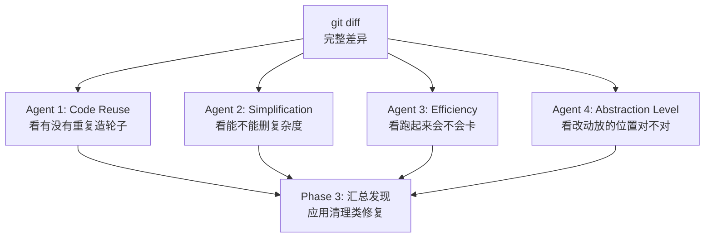

说实话，Claude Code 里有些命令我用了一次就离不开了，但问身边朋友知道的人反而不多。这个系列文章就来聊聊这些被严重低估的命令——`/simplify`、`/code-review`、`/review`、`/loop`、`/batch`、`/run`、`/verify`。

这些命令你知道有就行了，不用硬背。打个斜杠 `/` 就出来了，比你吭哧吭哧打字快多了。

> **版本说明**：本文基于 2026 年 6 月 Claude Code 官方 Commands 文档和当前客户端行为整理。Claude Code 命令更新很快，最终以 `/help`、`/` 命令列表和官方 Commands 页面为准。

## 先理清 Claude Code 的命令体系

Claude Code 里 `/` 开头的东西，来源有两层：

- **Commands（硬编码命令）**——`/clear`、`/compact`、`/model`、`/usage`、`/help`、`/review`、`/diff`、`/context`、`/permissions` 等。逻辑写死在 CLI 代码里，直接与终端交互，通常不需要额外 Prompt 工作流。
- **Bundled Skills（捆绑技能）**——`/simplify`、`/batch`、`/debug`、`/loop`、`/run`、`/verify`、`/code-review`、`/claude-api`。本质是基于 Prompt 的能力：调用时，Claude 会载入特定的 Markdown 指令集到上下文，然后调动子代理（Sub-agents）执行多步工作流。

> **注意**：`/review` 是内置 PR review 命令，不是 bundled skill；本地 diff 正确性审查优先看 `/code-review`。深度云端审查现在推荐用 `/code-review ultra`，`/ultrareview` 仍作为别名保留。

下面详细介绍这几个实用的内置能力。

## /simplify：代码简化与重构

`/simplify` 做的事很具体：审查当前改动里有没有可以清理的地方，然后尽量直接应用修复。它现在是 Claude Code 官方 bundled skill，定位是 **cleanup-only review**，不是 correctness bug 审查。

这点要特别注意：从 Claude Code v2.1.154 开始，`/simplify` 不再负责找逻辑 Bug。它主要看复用、简化、效率和抽象层级是否合适；如果你想找“代码有没有写错”，应该用 `/code-review`。

### 工作机制：三步走

**第一步：确定审查范围。** 通常围绕最近变更文件工作；不带参数时，它跑 `git diff` 拿增量变更；如果工作区没有未提交的修改，它会自动审查最近一次 commit。指定具体类名时（比如 `/simplify MarketDataService`），它会读取整个文件做全量审查。具体范围以当前 Claude Code 版本行为为准。

**第二步：并行启动四个审查 Agent。** 不是串行地逐条检查，而是同时派出四个“审查员”，各自带着不同的视角去读同一份 diff：



四个 Agent 各管一摊：

- **Code Reuse Agent**：看你的代码是不是在重复造轮子。比如你手写了一个 `requireNonBlank()`，它会在项目里搜一圈，发现已经有一个 `InputValidator.requireNonBlank()` 做了同样的事。
- **Simplification Agent**：看代码能不能更简单。比如两个方法长得几乎一样、条件分支绕来绕去、临时状态可以删掉，它会尝试把复杂度压下去。
- **Efficiency Agent**：看代码跑起来会不会有性能问题。比如循环里反复创建同一对象，单线程场景非要用 `ConcurrentHashMap`、该用缓存的结果每次都重新算。
- **Abstraction Level Agent**：看这次改动是不是放在了合适的层级。比如业务规则写进 Controller、通用校验散落在多个 Service、底层工具类反过来依赖上层业务对象，这类位置不对的问题会被它盯上。

**第三步：汇总并修复。** 四个 Agent 各自报告发现，Claude Code 会自动判断哪些是真问题、哪些是误报，然后应用它认为安全的清理类修复。

> **风险提示**：`/simplify` 会应用修复，但它不是 Bug 捕捉器。涉及事务、安全、并发、资金链路的改动，先用 `/code-review` 或 `/security-review` 做正确性审查，再看 diff、跑测试。

### 指定关注方向

也可以给它指定关注方向：

```bash
/simplify duplicate helpers
/simplify SQL performance
/simplify unnecessary abstraction
/simplify MarketDataService
```

在你已经知道哪块大概有清理空间、想让 AI 帮你精确定位的时候，这个功能很实用。

### 旧版本案例：Spring 事务失效

下面这个案例来自早期 `/simplify` 行为，当时它会更积极地查 correctness bug。按现在的官方定位，这类问题更应该交给 `/code-review` 或 `/security-review`，再用 `/simplify` 做清理和重构。

有一次我写了一个用户认证模块，自测通过就准备提交了。习惯性地先跑了一遍审查命令，它直接帮我找到了 6 个潜在问题，经过确认，确实都是实际存在的问题。


最值得说的是一个 **Spring 事务失效** 的问题。多个审查视角独立捕获到了同一个 Bug。

问题代码是这样的——`WatchlistService` 里，外层方法获取 Redis 分布式锁做 double-check，内部调一个 `protected` 方法执行数据库写入：

```java
public void initializeDefaultWatchlist(Long userId) {
    // Redis 分布式锁 + double-check（幂等）
    // ...
    doInitializeDefaultWatchlist(userId);  // 同一类内部调用
    // ...
}

@Transactional(rollbackFor = Exception.class)
protected void doInitializeDefaultWatchlist(Long userId) {
    groupService.save(defaultGroup);        // INSERT 分组
    stockService.saveBatch(initialStocks);  // INSERT 5 只股票
}
```

代码结构看起来合理：外层管锁和幂等，内层管事务。但 `@Transactional` 写在这实际上**完全不起作用**——因为 Spring AOP 基于动态代理，同一个类内部的直接调用会绕过代理，注解根本不会被拦截到。

这意味着如果 `saveBatch` 中途抛异常，`save` 已经提交的分组记录不会回滚，数据库里会出现一个没有股票的空壳分组。

> **前提条件**：在 Spring 默认代理式 AOP 下，同类内部直接调用会绕过代理，`@Transactional` 不会生效；如果使用 AspectJ weaving 或通过代理对象调用，结论不同。

- **Quality / correctness 视角** 标记了自调用导致 `@Transactional` 失效，评为高严重性。
- **Efficiency Agent** 排除了锁 TTL 不足的可能，精准定位事务失效是根因。
- **Code Reuse Agent** 确认手写的分布式锁没有可复用替代，实现合理。

当时给出的修复方案是把声明式事务换成**编程式事务**，用 `TransactionTemplate` 直接控制事务边界。其他修复方式包括：把事务方法移动到另一个 Spring Bean、通过代理对象调用、调整事务边界到外层 public 方法。

```java
@RequiredArgsConstructor
public class WatchlistService {

    private final TransactionTemplate transactionTemplate;

    private void doInitializeDefaultWatchlist(Long userId) {
        transactionTemplate.executeWithoutResult(status -> {
            groupService.save(defaultGroup);
            stockService.saveBatch(initialStocks);
        });
    }
}
```


这次扫描还发现了另外 5 个问题，涵盖代码复用、安全性和效率：

| 发现                                                                                       | Agent                | 修复方式                                              |
| ------------------------------------------------------------------------------------------ | -------------------- | ----------------------------------------------------- |
| 两个 Controller 各自定义了 `requireNonBlank()`，和已有的 `InputValidator` 重复             | Reuse                | 删除私有方法，改用 `InputValidator.requireNonBlank()` |
| 异常处理器的 regex 每次 `replaceAll` 都重新编译，且字符类不含 `+/=`，base64 token 会漏脱敏 | Quality + Efficiency | 提取为 `static final Pattern`，扩展字符类覆盖 base64  |
| 用 `ConcurrentHashMap` + `@Scheduled` 手动清理 30 秒过期的 Ticket                          | Efficiency           | 替换为项目已有的 Caffeine 缓存（自带 TTL 淘汰）       |
| `@Bean` 方法里的局部 `Map` 用了 `ConcurrentHashMap`                                        | Efficiency           | 改为 `HashMap`（单线程填充，不需要并发安全）          |
| 注释笔误："兖底" 应为 "兜底"                                                               | Quality              | 修正                                                  |

最终结果：5 个文件修改，净减少 38 行代码，修复 6 个问题，编译一次通过。

### 旧版本案例：指定模块审查

`/simplify` 还可以指定具体的类或模块做审查：


```bash
/simplify MarketDataService
```

我之前对项目的行情数据服务 `MarketDataService`（约 570 行）跑过一次专项审查。这个类聚合多个数据源，提供 Caffeine 本地缓存 + Redis 分布式缓存 + 熔断降级。当时的审查找到了 8 个问题，其中有两个高严重性的 correctness bug。按现在的命令定位，这类问题应该优先交给 `/code-review`。

**Bug：`year` 周期被静默降级为 `month`。** `normalizePeriod` 方法里有一个 switch：

```java
case "year", "yearly", "y" -> "month";  // Bug！应该是 "year"
```

其他周期都正确映射（`day → "day"`、`week → "week"`、`month → "month"`），唯独 `year` 被映射到了 `month`。调用方请求年度 K 线，实际拿到的是月度 K 线，没有任何报错或提示。

### 适合的场景

**适合的：**

- 提交 PR 前的清理——尤其是涉及多文件重构的变更，让 4 个 cleanup Agent 并行扫一遍，成本很低但收益可能很高。
- 重构后的质量检查——刚做完一次大范围代码整理，用来确认没有引入新的设计问题。
- Code Review 之后的清理工具——先用 `/code-review` 确认逻辑正确，再用 `/simplify` 删掉冗余和重复。

**不太适合的：**

- 全项目代码审计——不带参数时基于 `git diff` 工作，只审查增量变更。
- 风格统一——花括号放哪一行，用 tab 还是空格，那是 formatter 的活。
- 正确性 / 安全审计——这类问题优先用 `/code-review`、`/security-review` 和 SAST 工具。

**与传统工具的核心差异：** 传统规则型工具默认更擅长发现通用代码味道；`/simplify` 的优势在于它能结合项目上下文做清理建议，比如复用现有 helper、降低局部复杂度、把代码挪回合适的抽象层级。

## /code-review 和 /review：代码审查

> **前置说明**：`/code-review` 是 bundled skill，主要审查当前 diff 的 correctness bug 和 cleanup 机会，并支持 `--fix`。`/review` 是内置 PR review 命令，更适合审查一个具体 Pull Request。深度云端审查现在优先使用 `/code-review ultra`，`/ultrareview` 仍作为别名保留；安全审查使用 `/security-review`。

`/code-review` 和 `/simplify` 定位完全不同：`/simplify` 是自动清理工，主要做 cleanup；`/code-review` 是资深审查员，重点看代码有没有写错。

简单说，`/simplify` 关注**复用、简化、效率和抽象层级**；`/code-review` 关注**正确性、边界条件和潜在 Bug**。需要审查 PR 时，再用 `/review` 指定 PR。

### 工作机制

执行 `/code-review` 时，Claude Code 会做三件事：

**第一步：拿到变更。** 它先跑 `git diff` 拿增量变更，或者根据你指定的 PR 读取远程变更。

**第二步：并行分析。** Claude Code 并行审查变更，结合置信度过滤来减少误报。

**第三步：输出分级报告。** 最后你会拿到一份分级的问题清单（Critical / High / Medium / Low），每个问题带具体行号、原因和修复建议。

### 怎么用

```bash
/code-review high    # 只看高严重性问题
/code-review --fix   # 审查并自动修复部分问题
/code-review ultra   # 云端深度审查
```

如果要审查具体 PR，用 `/review`：

```bash
/review              # 审查当前分支对应 PR，或本地 PR 语境
/review 123          # 审查指定 PR
```

文件级审查建议写成自然语言：比如“review src/auth/login.service.ts”。

审查完发现问题后，你可以直接说"修复所有 Critical 问题"，Claude 会根据审查建议自动改。

### /code-review、/review、/security-review 怎么选

| 命令                 | 适合场景                                   | 重点                            |
| -------------------- | ------------------------------------------ | ------------------------------- |
| `/code-review`       | 当前 diff / 本地变更审查                   | 正确性、边界条件、潜在 Bug      |
| `/review`            | 指定 Pull Request 审查                     | PR 级问题和合并前检查           |
| `/security-review`   | 登录、支付、权限、上传、Webhook 等敏感模块 | 注入、鉴权、数据泄露、权限绕过  |
| `/code-review ultra` | 重要 PR 上线前，想做更深一层审查           | 云端沙箱、多 Agent、深度 Review |

我的建议：本地 diff 先用 `/code-review`，具体 PR 用 `/review`，涉及安全边界的改动额外跑 `/security-review`，核心链路或大版本上线前再考虑 `/code-review ultra`。

### /code-review ultra：云端深度审查

`/code-review ultra` 会在云端沙箱里跑一次更重的、多 Agent 协作的代码审查，主要用来在 PR 合并前兜底发现隐藏较深的 Bug。旧命令 `/ultrareview` 仍然保留为别名，但当前官方更推荐 `/code-review ultra`。

```bash
/code-review ultra        # 深度审查当前 diff / PR 语境
/code-review ultra 123    # 深度审查指定目标（具体支持以 /help 为准）
```

它和日常 `/code-review` 的核心区别在于：**审查在云端沙箱执行**，不依赖本地环境，多个 Agent 从不同角度并行分析同一个 PR。代价是耗时更长、消耗更多 Token。

不过需要注意，官方把它标成 research preview，功能和价格都可能变化，以当前官方文档和本地 `/help` 为准。

### /code-review 和 /simplify 怎么选

|        | `/simplify`                  | `/code-review`                         |
| ------ | ---------------------------- | -------------------------------------- |
| 目标   | 消除技术债、提升可读性       | 确保正确性、发现 Bug                   |
| 做什么 | 等效变换（重构）             | 逻辑诊断（分析）                       |
| 结果   | 直接改代码                   | 列出问题和建议                         |
| 关注点 | 嵌套过深、变量命名、冗余逻辑 | 安全漏洞、性能瓶颈、边界条件、逻辑错误 |

选 `/simplify`：代码能跑但涉及可复用性、代码质量或效率问题、刚写完原型想快速重构、想删掉冗余代码省 Token。

选 `/code-review`：不确定代码有没有 Bug、上线前做最后把关、涉及安全或资金的关键模块、想看资深工程师会对你的代码提什么意见。

**最推荐的用法是先 `/code-review` 后 `/simplify`——先确保逻辑正确，再清理代码。**

### 实战案例

有一次我写了一个用户认证模块，自测通过就准备提交了。顺手跑了一遍 `/code-review`，它标出了三个问题：

**Critical：密码重置接口没做速率限制。** 攻击者可以无限次调用重置接口轰炸用户邮箱。这个我自己测试的时候根本想不到——测试环境只有我一个用户，哪来的速率限制需求。

**High：Token 过期时间从配置读取但没兜底。** 配置项没设的话，过期时间会变成 0，意味着 Token 一生成就过期。`/code-review` 建议加一个 `Math.max(config.tokenExpiry, 3600)` 做保底。

**Medium：日志里把 userId 明文打印了。** 虽然不算敏感信息，但在合规要求严格的场景下还是脱敏比较好。

三个问题，两个和安全性相关。如果不跑 `/code-review`，前两个问题直接上生产。

### /loop 使用提醒

**它不替你做决定。** 和 `/simplify` 不同，`/code-review` 默认不改代码，只给建议；如果你明确传 `--fix`，它才会尝试应用部分修复。涉及安全的关键代码，这种“先看再动”的模式更让人放心。

**它依赖 CLAUDE.md。** 如果你没有在 `CLAUDE.md` 里写规范，`/code-review` 就只能做通用审查。把项目的编码规范、技术选型偏好、安全要求写进去，输出质量会高很多。

**它不是 SonarQube。** SonarQube 基于规则匹配，`/code-review` 能结合上下文推理框架语义，比如 Spring 代理、事务边界、权限链路这些规则型工具不一定能直接看懂的地方。

## /loop：定时任务与自主迭代

这是 Claude Code 之父认为最强大的两个命令之一，他多次分享推荐。


`/loop` 可以帮你定时跑任务，也可以帮你反复试错直到把活干完。

### 解决了什么问题

日常开发里有两类事特别烦人：

- 第一类是需要反复做的事。比如每隔半小时检查一下有没有新的 PR 需要处理、每天早上跑一遍测试看看有没有挂掉的。这些事不难，但总忘。
- 第二类是需要反复试错的事。比如修复一个牵扯多个模块的 Bug，把整个项目从 CommonJS 迁移到 ESM。这种任务的特点是：一次做不完，中间会出错，出错了要改，改完再验证。

`/loop` 把这两类事都接过去了。

### 三种调度方案怎么选

Claude Code 不止 `/loop` 这一种定时机制，它实际上有三套调度方案：

|                  | **Cloud 任务**     | **Desktop 任务** | **/loop**                                                                                                     |
| ---------------- | ------------------ | ---------------- | ------------------------------------------------------------------------------------------------------------- |
| 运行位置         | Anthropic 云端     | 你的机器         | 你的机器                                                                                                      |
| 需要开机吗       | 不需要             | 需要             | 需要                                                                                                          |
| 需要打开会话吗   | 不需要             | 不需要           | **需要**                                                                                                      |
| 重启后还在吗     | 在                 | 在               | 会话级；关闭期间不会执行；使用 `--resume` / `--continue` 恢复同一会话时，7 天内未过期的 recurring task 可恢复 |
| 能访问本地文件吗 | 不能（重新 clone） | 能               | 能                                                                                                            |
| MCP 服务器       | 每个任务单独配置   | 配置文件和连接器 | 继承当前会话                                                                                                  |
| 最小间隔         | 1 小时             | 1 分钟           | 1 分钟                                                                                                        |

一句话选型：**要可靠、不想管机器 → Cloud 任务；要读本地文件 → Desktop 任务；临时轮询、快速用一下 → `/loop`。**

### 两种工作模式

**模式一：定时调度（Cron 模式）**

告诉它"干什么"和"隔多久干一次"，到点它自己跑：

```bash
/loop 30m /code-review         # 每 30 分钟跑一次代码审查
/loop 1h "跑一遍单元测试，看看有没有失败的"  # 每小时检查测试
/loop 5m "检查 GitHub 上开放的 PR 状态"    # 每 5 分钟看 PR 动态
```

间隔写法有三种：

| 写法        | 示例                               | 效果                                                                                                          |
| ----------- | ---------------------------------- | ------------------------------------------------------------------------------------------------------------- |
| 间隔在前    | `/loop 30m 检查构建状态`           | 每 30 分钟                                                                                                    |
| "every"在后 | `/loop 检查构建状态 every 2 hours` | 每 2 小时                                                                                                     |
| 不写间隔    | `/loop 检查构建状态`               | Claude 动态选择下一次执行间隔（通常 1 分钟到 1 小时）；Bedrock/Vertex AI/Microsoft Foundry 场景下固定 10 分钟 |

**模式二：自主迭代（Agentic Loop）**

这个模式下 `/loop` 不再是定时器，而是"自动试错引擎"。你给它一个目标，它自己规划、执行、验证、修正，循环往复。它适合把"执行—观察—修正—再执行"这类循环交给 Claude，但要写清完成标准、最大尝试次数和停止条件：

```bash
/loop "修复 auth 模块里所有失败的单元测试，直到全部通过"
/loop "把 src/legacy 下所有组件迁移到 Tailwind CSS，确保页面渲染正常"
/loop "实现支付宝支付模块，补上单元测试，确保全部通过"
```

普通模式下 Claude 写完代码就交给你了，报错你得自己贴回去。`/loop` 模式下，它自己读报错、自己改、自己重跑测试，全程不用你盯着。

### 五个实际场景

**1. 自动监控 PR 状态。** 每 5 分钟拉一次开放的 PR，检查有没有冲突、能不能安全合并、生成摘要。

```bash
/loop 5m "用 gh 命令检查开放 PR 的状态，标记有冲突的和可以安全合并的"
```

**2. 自动测试看门狗。** 定时跑测试，发现了失败的测试就尝试修。多人协作的项目里特别实用——别人合进来的代码可能悄悄搞挂了你的模块。

```bash
/loop 2h "运行测试套件，发现失败的就修复"
```

**3. 定时同步项目文档。** 改了代码忘了改文档，这是开发者最常犯的错。每 2 小时让 `/loop` 扫一遍代码变更，自动把改动同步到用户文档里。

```bash
/loop 2h "检查最近的代码变更，更新对应的公开文档"
```

**4. 大规模技术迁移。** 比如把整个项目从 CommonJS 迁到 ESM，几十个文件，中间一定会有报错。`/loop` 能自己处理这些错误，一个文件一个文件地改过去。

```bash
/loop "把项目里所有 CommonJS 的 require/module.exports 改成 ESM 的 import/export，确保测试全部通过"
```

**5. 批量拉起自动化任务。** 可以写一个自定义命令文件，把所有定时任务列在里面。项目启动时跑一条命令就能把所有自动化任务一起拉起来。

### 怎么管理任务

直接用自然语言跟 Claude 说就行：

```bash
我现在有哪些定时任务？
停掉那个检查部署的任务
```

底层靠三个工具干活：

| 工具         | 干什么                                                |
| ------------ | ----------------------------------------------------- |
| `CronCreate` | 创建任务，接收 cron 表达式、要执行的 prompt、是否循环 |
| `CronList`   | 列出所有在跑的任务，显示 ID、调度时间、prompt         |
| `CronDelete` | 按 ID 删任务                                          |

### 运行机制细节

**空闲时才触发。** 调度器每秒检查一次有没有到期任务，但只在 Claude 空闲时才触发。如果你正在跟它对话，任务会排队等当前这轮结束再跑。

**有抖动机制。** 防止所有用户任务在同一时刻砸向 API。循环任务最多延迟周期的 10%，上限 15 分钟。若任务间隔小于 1 小时，最多延迟半个 interval。需要精确触发的话，建议避开 `:00` 和 `:30`。

**任务有保质期。** 循环任务创建 **7 天后**自动过期，会最后执行一次然后自行删除。需要更长周期的，用 Cloud 或 Desktop 的定时任务。

### 注意事项

- **Token 消耗不低。** 特别是自主迭代模式，指令尽量具体，完成标准要明确。
- **只在当前会话有效。** 关掉终端或退出 Claude Code，关闭期间不会执行，也不会补跑。它不是 CI/CD 的替代品。
- **建议加上限。** 目标一直达不到它会一直跑。在指令里加一句"最多尝试 10 次"之类的约束。
- **写清停止条件。** 包括最多尝试次数和验收标准（测试全部通过/CI green/无 lint error）。
- **失败时先汇报。** 限制写操作，避免无限修改。涉及关键路径的改动建议先 commit 再跑 `/loop`，方便回滚。
- **7 天限制。** 循环任务创建 7 天后自动过期，dynamic loop 也适用此限制。需要更长周期用 Routines 或 Desktop scheduled tasks。

## /debug：Claude Code 自己出问题时先跑它

`/debug` 不是帮你 debug 业务代码，而是帮你排查 Claude Code 会话本身的问题。

比如 MCP 连接异常、工具调用失败、命令卡住、权限规则没生效、插件加载异常，这类问题别急着重启，先跑：

```bash
/debug MCP 连接一直失败
/debug 为什么工具调用被拒绝
/debug Claude Code 卡住不动
```

它会开启当前会话的 debug log，并结合日志分析问题。

> **注意**：如果你不是用 `claude --debug` 启动的，`/debug` 只能从执行之后开始捕获日志，之前的错误可能看不到。

## /run 和 /verify：跑起来看看改对了没

这两个是 Claude Code v2.1.145+ 提供的 bundled skills，解决一个很常见的问题：改完代码不确定效果对不对。

### /run：启动应用并观察

```bash
/run
```

它会尝试启动当前项目，观察改动是否真的生效。比如你刚改了登录逻辑，`/run` 会把服务拉起来，你可以直接测试。

如果项目结构比较复杂，Claude 可能猜不对启动方式。这时候可以先用 `/run-skill-generator` 记录一次正确的启动流程，后面 `/run` 就会按这个流程来。

### /verify：构建或运行来验证改动

```bash
/verify
```

它比 `/run` 轻量，主要做构建和运行验证，确认改动是否符合预期。适合改完代码后快速检查有没有编译错误或明显运行时问题。

### /run-skill-generator：记录项目的启动方式

```bash
/run-skill-generator
```

普通 Node、Python、Java 项目，Claude 通常能从 README、`package.json`、`Makefile` 里推断启动方式。复杂项目就别赌它猜对，让 `/run-skill-generator` 跑一次，把正确的启动流程记下来。后面 `/run` 和 `/verify` 就不用再猜了。

## /batch：多任务并行编排

`/batch` 的核心本质是多任务并行编排器，它的强大之处在于它能将一个复杂的"大需求"**自动拆解并并行执行**。

- **任务拆解 (Task Decomposition)：** 当你说一个大任务或者多条需求的时候，Claude 并没有胡乱开始，而是将其逻辑拆分成独立的 **Unit（工作单元）**。
- **并行工作 (Parallel Workers)：** Claude 会同时启动多个后台 Agent，分别处理不同的功能模块。
- **独立工作区 (Independent Worktrees)：** 为了防止多个 Agent 同时修改代码导致冲突，Claude 为每个 Worker 创建了独立的 **Git Worktree**。这意味着它们在物理隔离的环境中修改代码，互不干扰。

**使用方法很简单**：

```bash
/batch  1、移除自选股界面，直接通过分析界面来管理，每一行股票的最右侧展示选项，支持删除和分组。
  2、自选股提取一个组件、K线展示和讨论室都单独提取一个组件出来。
  3、优化提示词管理，例如支持删除和重命名。
  4、历史记录目前支持10条记录，这块的设计优化一下。
```

Claude 收到后会先给出拆分计划（通常 5～30 个 unit），经确认后在隔离 worktree 中并行执行，每个单元通常产出独立 PR。


每个 Worker 完成后，主进程会检查每个单元的改动，最终产出多个独立 PR（而非合并成一个大的 PR）。

> ⚠️ **风险提示**：`/batch` 适合边界清晰、模块相对独立的大任务；不适合强耦合核心链路一次性大改。共享文件（如 package.json、路由表、公共类型、数据库迁移脚本）容易冲突。使用前建议先 commit 干净工作区。


**你可以理解为：** 你请了三个外包程序员（Worker）为三个不同的房间干活，现在项目经理（Main Agent）发现那三个房间的门锁有点问题，于是他亲自去每个房间把写好的代码拷贝出来，最后交到你手里。

## 几个容易被忽略的辅助命令

上面几个命令负责干活，但真正用顺手之后，你还会频繁用到这些辅助命令。

| 命令               | 作用                      | 我一般什么时候用                     |
| ------------------ | ------------------------- | ------------------------------------ |
| `/diff`            | 查看 Claude 到底改了什么  | 每次 `/simplify`、`/batch` 后必看    |
| `/context`         | 查看上下文占用            | 长任务开始变慢、变飘时先看           |
| `/compact`         | 总结并压缩上下文          | 长会话继续推进前用                   |
| `/debug`           | 排查 Claude Code 会话问题 | MCP、工具调用、权限异常时用          |
| `/run`             | 启动应用并观察改动效果    | 改完代码想快速看效果                 |
| `/verify`          | 构建或运行来验证改动      | 改完代码快速检查编译和运行时问题     |
| `/permissions`     | 管理工具权限              | 跑 `/loop`、`/batch` 前先检查        |
| `/statusline`      | 配置状态栏                | 想常驻看模型、目录、上下文、成本时用 |
| `/usage` / `/cost` | 查看用量和成本            | 长任务前后看消耗                     |

### 别忽略上下文管理：/context 和 /compact

长任务跑久了，Claude Code 不一定是"能力变差"，很多时候是上下文被塞得太满了。

先看：

```bash
/context
```

它会展示当前上下文使用情况，告诉你是不是工具输出、历史对话、规则文件把窗口挤爆了。

如果任务已经聊了很久，但还想继续推进，可以用：

```bash
/compact 只保留当前重构目标、已完成改动、剩余 TODO、关键约束
```

`/compact` 会总结当前会话，释放一部分上下文。大任务中途做一次 compact，但一定要给它明确的保留范围，不要只裸跑 `/compact`。

### 别把权限全放开：/permissions 要会用

Claude Code 能读文件、改文件、跑命令，能力很强，但权限不能无脑全开。

建议先跑：

```bash
/permissions
```

把高风险命令设成 ask 或 deny，比如删除文件、执行部署脚本、操作生产数据库、推送远程分支这类动作。尤其是你要跑 `/loop` 或 `/batch` 时，更应该先收紧权限。

让 AI 自动干活可以，但别让它自动闯祸。

### 让用户养成"看 diff 再信 AI"的习惯

Claude 改完代码后，不要只看它的总结，直接跑：

```bash
/diff
```

它会打开交互式 diff viewer，看当前工作区到底被改了哪些文件、哪些行。尤其是 `/simplify`、`/batch` 这类会直接动代码的命令，跑完之后先看 diff，再决定要不要继续。

## 真正高频的不是命令本身，而是组合

上面讲了 `/simplify`、`/code-review`、`/review`、`/loop`、`/batch`，但真正用顺手之后，你会发现这些命令是可以组合成一个完整工作流的：

- `/batch` 负责拆任务
- `/loop` 负责反复执行和验证
- `/simplify` 负责清理技术债
- `/code-review` 负责正确性把关
- `/review` 负责 PR 审查
- `/security-review` 负责安全兜底
- `/verify` 负责快速验证改动
- `/run` 负责启动应用看效果
- `/diff` 负责人工验货
- `/context` + `/compact` 负责上下文续命

一个更稳的工作流是这样的：

1. `/context` 先看上下文是否健康
2. `/permissions` 检查权限设置是否合理
3. `/batch` 把大需求拆成多个独立任务
4. `/loop` 处理需要反复验证的复杂任务
5. `/simplify` 清理冗余代码和技术债
6. `/code-review` 做正确性审查
7. 涉及登录、支付、权限、上传、Webhook 等敏感模块，再跑 `/security-review`
8. 如果已经有 PR，再用 `/review` 做 PR 级审查
9. `/verify` 快速验证改动是否有编译或运行时问题
10. `/diff` 人工确认改动
11. 最后跑测试、提交 PR

这一套走下来，能显著减少机械操作，但关键节点仍要看计划、看 diff、跑测试、做最终 review。

## 非交互模式：脚本和 CI 里用 Claude Code

Claude Code 不一定要在终端里交互使用，也可以跑单条命令然后退出。

### `claude -p`：非交互模式

适合脚本和 CI：

```bash
claude -p "summarize this diff" --output-format json
```

`-p` 接收一段 prompt，执行完直接输出结果。配合 `--output-format json` 可以拿到结构化输出，方便脚本解析。

### `--bare`：跳过自动加载

如果只是跑一个很轻的任务，不需要自动发现 Hooks、Skills、MCP、Auto Memory 和 `CLAUDE.md`，可以加 `--bare`：

```bash
claude --bare -p "explain this function"
```

`--bare` 启动更快，但也意味着少了很多项目上下文。适合一次性分析，不适合复杂代码修改。

### `--teleport`：网页端会话拉回本地

```bash
claude --teleport
```

如果你在 Claude Code on the web 上开了任务，后来发现需要本地仓库、命令行或更完整的开发环境，`--teleport` 可以把网页会话拉回本地终端继续。

## 附录：Claude Code 接入国内模型

Claude Code 强在它的工具链和执行力，但 Claude 官方模型太贵，加上现在 Claude 太容易封号。我们可以使用国内的 MiniMax 或 GLM 作为它的底层大模型。它们都采用了标准的 **OpenAI 兼容接口**，接入过程非常丝滑。

### 1. 获取 API Key

- MiniMax 开放平台：[https://platform.minimaxi.com/user-center/basic-information/interface-key](https://platform.minimaxi.com/user-center/basic-information/interface-key)
- GLM 开放平台：[https://www.bigmodel.cn/usercenter/proj-mgmt/apikeys](https://www.bigmodel.cn/usercenter/proj-mgmt/apikeys)


### 2. 推荐使用 CC Switch

强烈推荐安装 **CC Switch**，这是一个专门管理 Claude Code 模型切换的小工具，支持管理 Skills、MCP 和提示词。

项目地址：[https://github.com/farion1231/cc-switch](https://github.com/farion1231/cc-switch)


启动 CC Switch，点击右上角 **"+"** ，选择预设的 MiniMax/GLM 供应商，填写 API Key，选择模型，添加即可。


### 3. 验证是否生效

在任意目录下输入 `claude` 命令即可启动 Claude Code，选择 **信任此文件夹 (Trust This Folder)**。


### 4. 接入验证清单

MiniMax / GLM 接入不是"能对话"就算成功，Claude Code 的关键是工具调用。建议验证以下核心功能：

- [ ] 是否能稳定 stream 输出
- [ ] 是否能调用 Bash / Read / Edit / Write
- [ ] 是否能跑 subagent
- [ ] 是否能处理长上下文和压缩
- [ ] 是否支持 MCP 工具调用
- [ ] 是否能完成真实项目的「改代码 → 跑测试 → 修复」闭环

## 总结

讲了这么多，最后把全文提到的命令串一遍。命令记不住没关系，知道有这么个东西、需要时打个 `/` 翻出来用就行。

**直接干活的命令（会动代码或执行任务）：**

- `/simplify`：4 个 cleanup Agent 并行审查当前改动，重点找复用、简化、效率和抽象层级问题，并尝试应用清理类修复。v2.1.154 之后不负责找 correctness bug。
- `/batch`：把一个大需求自动拆成多个工作单元，开多个后台 Worker 在隔离 worktree 里并行干。适合边界清晰的多模块大改。
- `/loop`：既能定时调度（每隔多久跑一次），也能自主试错（给个目标让它反复"执行—验证—修正"直到达成）。
- `/run`：把应用启动起来，看改动是不是真生效。
- `/verify`：比 `/run` 更轻量，主要做构建和运行验证，快速确认有没有编译或运行时问题。

**专门找问题的命令（默认先给建议）：**

- `/code-review`：日常 diff / 本地变更审查的主力，关注正确性、边界条件和潜在 Bug，支持 `--fix` 直接修一部分。
- `/review`：PR 审查命令，适合对当前分支对应 PR 或指定 PR 做本地 review。
- `/security-review`：登录、支付、权限、上传、Webhook 这类敏感模块的安全兜底，盯注入、鉴权、数据泄露、权限绕过。
- `/code-review ultra`：云端沙箱里的深度多 Agent 审查，适合核心 PR 合并前兜底；`/ultrareview` 目前仍作为别名保留。

**控制会话和看状态的辅助命令：**

- `/diff`：看 Claude 到底改了哪些文件哪些行，`/simplify`、`/batch` 跑完必看一眼。
- `/context`：看上下文占用，长任务变慢、变飘时先查它。
- `/compact`：总结并压缩上下文，长会话继续推进前用。
- `/permissions`：管理工具权限，跑 `/loop`、`/batch` 前先收紧。
- `/debug`：排查 Claude Code 会话本身的毛病（MCP 连接、工具调用、权限异常）。
- `/statusline`：配置状态栏，常驻看模型、目录、上下文、成本。
- `/usage`、`/cost`：查看用量和成本。
- `/run-skill-generator`：给复杂项目记录正确的启动方式，让 `/run` 不用瞎猜。

**脚本和 CI 里的非交互用法：**

- `claude -p`：跑单条 prompt 后直接退出，配 `--output-format json` 能拿到结构化输出方便解析。
- `--bare`：跳过自动加载、启动更快，适合一次性轻量分析。
- `--teleport`：把网页端会话拉回本地终端续接。

最后几个高频习惯记牢就够了：

- **干活类命令会直接动代码，跑完一定先看 `/diff`，别只信它的总结。**
- **审查习惯是先 `/code-review` 后 `/simplify`，先保证逻辑正确再清理代码。**
- **跑 `/loop`、`/batch` 这种自动化前，先用 `/permissions` 收紧权限——让 AI 自动干活可以，别让它自动闯祸。**
- **长任务变慢多半不是能力变差，而是上下文被塞满了，先看 `/context` 再 `/compact` 续命。**

## 参考资料

- [Claude Code commands](https://code.claude.com/docs/en/commands)
- [Claude Code CLI reference](https://code.claude.com/docs/en/cli-reference)
- [Best practices for Claude Code](https://code.claude.com/docs/en/best-practices)
- [Configure permissions](https://code.claude.com/docs/en/permissions)
- [Extend Claude with skills](https://code.claude.com/docs/en/skills)
- [Automate with hooks](https://code.claude.com/docs/en/hooks)
