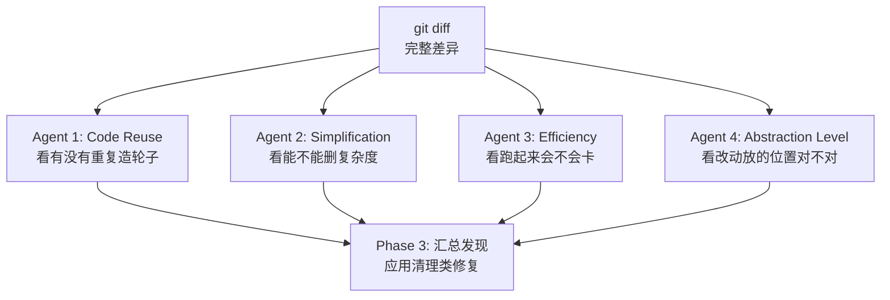

你好，我是小 G。Claude Code 里其实有不少好用的命令，例如代码审查、代码简化、定时任务，但我发现很多每天经常用的朋友并不知道，也不知道如何用。

很多朋友认为用了 Cluade Code 直接对话就够了，不需要了解这些命令。但站在我用了这么久的角度来看，你了解一下肯定还是更好的。

当然了，了解不是说得死记硬背这些命令。你知道大概有这个东西就足够了！真需要用的时候，直接输入 `/`，再从命令列表里选即可。

> **版本说明**：本文按 Claude Code v2.1.218（2026-07-25）的官方文档和客户端行为整理。命令更新很快，最终以 `/help`、`/` 命令列表和官方 Commands 页面为准。

## `/` 菜单里不只有内置命令

在 Claude Code 中输入 `/`，看到的是当前环境里所有可以直接调用的入口。除了 Claude Code 自带的内置命令，这里还会列出 Bundled Skills、用户自己编写的 Skills，以及插件和 MCP Server 提供的命令。具体能看到哪些条目，还会受版本、平台、套餐和当前环境影响。

[官方 Commands 文档](https://code.claude.com/docs/en/commands)把大多数内置命令描述为“行为直接写在 CLI 中”的命令，例如 `/clear`、`/compact`、`/model`、`/diff`、`/context` 和 `/permissions`。[Bundled Skills](https://code.claude.com/docs/en/slash-commands#bundled-skills) 则基于 Prompt 工作：Claude 会加载对应指令，再调用工具或组织子代理完成任务。`/simplify`、`/batch`、`/debug`、`/loop`、`/run`、`/verify`、`/code-review` 和 `/claude-api` 都属于这一类。官方命令表会在这类条目后标注 `Skill`；少数会并行调度多个子代理并在后台运行的能力则标注为 `Workflow`。

`/review` 是内置命令，用来对 GitHub Pull Request 做一次快速、只读的单轮审查；不带参数时会先列出可选的 Open PR。要检查当前 diff 的正确性问题和清理机会，使用 `/code-review`；要对 PR 做可调节强度的多 Agent 审查，可以执行 `/code-review <level> <PR 编号>`。需要云端深度审查时使用 `/code-review ultra`，`/ultrareview` 目前是它的别名。

## /simplify：代码简化与重构

一份改动已经能正常运行，但里面可能留着重复 helper、绕得过深的分支，或者放错层级的业务逻辑。这时再跑 `/simplify`。它会检查当前改动，并尝试应用清理类修复。

从 Claude Code v2.1.154 开始，官方把 `/simplify` 定位为 **cleanup-only review**。复用、简化、效率和抽象层级归它处理；逻辑 Bug 交给 `/code-review`。

### 它怎样处理一份改动

不带参数时，`/simplify` 通常从 `git diff` 读取增量变更。工作区没有未提交修改时，它会转而检查最近一次 commit。也可以指定类名，例如 `/simplify MarketDataService`，让它把注意力放到整个文件。具体取值范围仍以当前版本的客户端行为为准。

拿到改动后，四个 Agent 会并行读取同一份 diff：


```mermaid
flowchart TB
    Diff["git diff<br/>完整差异"] --> A1["Agent 1: Code Reuse<br/>看有没有重复造轮子"]
    Diff --> A2["Agent 2: Simplification<br/>看能不能删复杂度"]
    Diff --> A3["Agent 3: Efficiency<br/>看跑起来会不会卡"]
    Diff --> A4["Agent 4: Abstraction Level<br/>看改动放的位置对不对"]
    A1 --> Fix["Phase 3: 汇总发现<br/>应用清理类修复"]
    A2 --> Fix
    A3 --> Fix
    A4 --> Fix
```

Code Reuse Agent 会先在项目里寻找现成实现。比如新写的 `requireNonBlank()` 与 `InputValidator.requireNonBlank()` 重复，它会建议复用后者。Simplification Agent 处理相似方法、冗余临时状态和过深分支；Efficiency Agent 会留意循环内重复创建对象、无必要的并发容器和重复计算。

Abstraction Level Agent 关注代码放置位置。业务规则进入 Controller、通用校验散落在多个 Service、底层工具反向依赖业务对象，都属于这一类。四份结果返回后，Claude Code 会过滤误报并应用它判断为安全的清理。

> **风险提示**：`/simplify` 会改代码，却不负责保证业务正确。事务、安全、并发和资金链路先跑 `/code-review` 或 `/security-review`，之后仍要检查 diff 并执行测试。

### 指定关注方向

参数里可以直接写关注方向：

```bash
/simplify duplicate helpers
/simplify SQL performance
/simplify unnecessary abstraction
/simplify MarketDataService
```

已经知道问题大致落在哪个文件或哪类代码味道时，带参数比裸跑更容易得到有针对性的结果。

### 案例：Spring 事务失效

这个案例来自早期 `/simplify` 行为，当时它会更积极地查 correctness bug。按现在的官方定位，这类问题更应该交给 `/code-review` 或 `/security-review`，再用 `/simplify` 做清理和重构。

有一次我写了一个用户认证模块，自测通过就准备提交了。习惯性地先跑了一遍审查命令，它直接帮我找到了 6 个潜在问题，经过确认，确实都是实际存在的问题。


其中一个问题落在 **Spring 事务失效** 上，多个审查视角都指向了同一处代码。

`WatchlistService` 的外层方法先获取 Redis 分布式锁并做 double-check，再调用一个 `protected` 方法写数据库：

```java
public void initializeDefaultWatchlist(Long userId) {
    // Redis 分布式锁 + double-check（幂等）
    // ...
    doInitializeDefaultWatchlist(userId);  // 同一类内部调用
    // ...
}

@Transactional(rollbackFor = Exception.class)
protected void doInitializeDefaultWatchlist(Long userId) {
    groupService.save(defaultGroup);        // INSERT 分组
    stockService.saveBatch(initialStocks);  // INSERT 5 只股票
}
```

`@Transactional` 放在这个方法上没有解决事务问题。Spring 默认采用代理式 AOP，同一个类内部直接调用 `doInitializeDefaultWatchlist()` 会绕过代理，事务拦截器收不到这次调用。

如果 `saveBatch` 中途抛出异常，`save` 已经写入的分组记录不会回滚，数据库里会留下一个没有股票的分组。

> **前提条件**：在 Spring 默认代理式 AOP 下，同类内部直接调用会绕过代理，`@Transactional` 不会生效；如果使用 AspectJ weaving 或通过代理对象调用，结论不同。

- **Quality / correctness 视角** 标记了自调用导致 `@Transactional` 失效，评为高严重性。
- **Efficiency Agent** 排除了锁 TTL 不足的可能，把问题收敛到事务失效。
- **Code Reuse Agent** 确认手写的分布式锁没有可复用替代，实现合理。

当时给出的修复方案是把声明式事务换成**编程式事务**，用 `TransactionTemplate` 直接控制事务边界。其他修复方式包括：把事务方法移动到另一个 Spring Bean、通过代理对象调用、调整事务边界到外层 public 方法。

```java
@RequiredArgsConstructor
public class WatchlistService {

    private final TransactionTemplate transactionTemplate;

    private void doInitializeDefaultWatchlist(Long userId) {
        transactionTemplate.executeWithoutResult(status -> {
            groupService.save(defaultGroup);
            stockService.saveBatch(initialStocks);
        });
    }
}
```


这次扫描还发现了另外 5 个问题，涵盖代码复用、安全性和效率：

| 发现                                                                                       | Agent                | 修复方式                                              |
| ------------------------------------------------------------------------------------------ | -------------------- | ----------------------------------------------------- |
| 两个 Controller 各自定义了 `requireNonBlank()`，和已有的 `InputValidator` 重复             | Reuse                | 删除私有方法，改用 `InputValidator.requireNonBlank()` |
| 异常处理器的 regex 每次 `replaceAll` 都重新编译，且字符类不含 `+/=`，base64 token 会漏脱敏 | Quality + Efficiency | 提取为 `static final Pattern`，扩展字符类覆盖 base64  |
| 用 `ConcurrentHashMap` + `@Scheduled` 手动清理 30 秒过期的 Ticket                          | Efficiency           | 替换为项目已有的 Caffeine 缓存（自带 TTL 淘汰）       |
| `@Bean` 方法里的局部 `Map` 用了 `ConcurrentHashMap`                                        | Efficiency           | 改为 `HashMap`（单线程填充，不需要并发安全）          |
| 注释笔误：“兖底” 应为 “兜底”                                                               | Quality              | 修正                                                  |

最终结果：5 个文件修改，净减少 38 行代码，修复 6 个问题，编译一次通过。

### 案例：指定模块审查

`/simplify` 还可以指定具体的类或模块做审查：


```bash
/simplify MarketDataService
```

我之前对项目的行情数据服务 `MarketDataService`（约 570 行）跑过一次专项审查。这个类聚合多个数据源，提供 Caffeine 本地缓存 + Redis 分布式缓存 + 熔断降级。当时的审查找到了 8 个问题，其中有两个高严重性的 correctness bug。按现在的命令定位，这类问题应该优先交给 `/code-review`。

**Bug：`year` 周期被静默降级为 `month`。** `normalizePeriod` 方法里有一个 switch：

```java
case "year", "yearly", "y" -> "month";  // Bug！应该是 "year"
```

其他周期都正确映射（`day → "day"`、`week → "week"`、`month → "month"`），唯独 `year` 被映射到了 `month`。调用方请求年度 K 线，实际拿到的是月度 K 线，没有任何报错或提示。

### 什么时候用 `/simplify`

提交 PR 前，或者刚完成一轮多文件重构，可以先用 `/code-review` 检查逻辑，再让 `/simplify` 清理重复实现和局部复杂度。它会结合项目现有代码给建议，例如改用已有 helper，或者把误放在 Controller 的业务逻辑移回 Service。

它不适合代替全项目审计。裸跑时主要检查当前增量；代码风格交给 formatter，正确性和安全问题则交给 `/code-review`、`/security-review` 与 SAST 工具。

## /code-review 和 /review：代码审查

本地工作区有一份尚未提交的 diff，先用 `/code-review` 查正确性、边界条件和潜在 Bug。已经提交为 Pull Request，则用 `/review` 选择或指定 PR。涉及登录、支付、权限和上传等敏感模块时，还需要 `/security-review`。

`/simplify` 解决的是另一类问题：代码逻辑已经确认可用，还想继续清理重复、低效实现和抽象层级。常见顺序是先 `/code-review`，再 `/simplify`。

### `/code-review` 如何产出报告

`/code-review` 先读取 `git diff` 或指定 PR 的变更，再并行分析并按置信度过滤结果。报告按 Critical、High、Medium、Low 分级，每条问题会指向具体行号，并附原因和修复建议。默认情况下它只报告；传入 `--fix` 后，才会尝试修改其中一部分问题。

### 怎么用

```bash
/code-review high    # 只看高严重性问题
/code-review --fix   # 审查并自动修复部分问题
/code-review ultra   # 云端深度审查
```

如果要审查具体 PR，用 `/review`：

```bash
/review              # 列出当前仓库的 Open PR，供你选择
/review 123          # 审查指定 PR
```

文件级审查建议写成自然语言：比如“review src/auth/login.service.ts”。

报告出来后，可以继续输入“修复所有 Critical 问题”，让 Claude 按审查结果修改。

### /code-review、/review、/security-review 怎么选

- 当前 diff 或本地变更：`/code-review`
- 已经创建的 Pull Request：`/review 123`
- 登录、支付、权限、上传、Webhook 等敏感模块：`/security-review`
- 核心 PR 合并前需要更重的云端审查：`/code-review ultra`

### /code-review ultra：云端深度审查

`/code-review ultra` 把审查放到云端沙箱中，由多个 Agent 分析同一个 PR。它适合核心 PR 合并前再加一轮检查。旧命令 `/ultrareview` 仍然保留为别名，但当前官方更推荐 `/code-review ultra`。

```bash
/code-review ultra        # 深度审查当前 diff / PR 语境
/code-review ultra 123    # 深度审查指定目标（具体支持以 /help 为准）
```

云端执行不依赖本地环境，代价是等待时间和 Token 消耗都会增加。官方目前仍将其标记为 research preview，功能与价格以官方文档和本地 `/help` 为准。

### `/code-review` 和 `/simplify` 怎么排顺序

对一份还不敢确认正确的改动，先跑 `/code-review`。等逻辑错误、边界条件和安全问题处理完，再用 `/simplify` 删除冗余代码。若只是刚写完原型，已经有测试证明行为没变，也可以直接让 `/simplify` 做一轮清理。

### 实战案例

有一次我写了一个用户认证模块，自测通过就准备提交了。顺手跑了一遍 `/code-review`，它标出了三个问题：

**Critical：密码重置接口没做速率限制。** 攻击者可以无限次调用重置接口轰炸用户邮箱。这个我自己测试的时候根本想不到——测试环境只有我一个用户，哪来的速率限制需求。

**High：Token 过期时间从配置读取但没兜底。** 配置项没设的话，过期时间会变成 0，意味着 Token 一生成就过期。`/code-review` 建议加一个 `Math.max(config.tokenExpiry, 3600)` 做保底。

**Medium：日志里把 userId 明文打印了。** 虽然不算敏感信息，但在合规要求严格的场景下还是脱敏比较好。

三个问题里有两个与安全性有关。单靠我当时的自测，密码重置频率和空配置这两种情况都没有覆盖到。

### 不要用它替代静态检查

`/code-review` 默认只给建议，明确传入 `--fix` 才会改代码。它还会读取 `CLAUDE.md`：项目的编码规范、技术选型和安全要求写得越具体，审查时可用的项目约束就越多。

SonarQube 这类工具按规则稳定扫描，`/code-review` 则会结合上下文分析 Spring 代理、事务边界和权限链路。两者覆盖的问题不同，不能相互替代。

## `/loop` 与 `/goal`：定时重复和完成条件

Boris Cherny 曾多次分享 `/loop` 的用法。


每隔半小时检查一次 PR，关注的是触发时间，用 `/loop`。现在开始修复失败测试，并持续做到全部通过，关注的是验收条件，用 `/goal`。

`/loop` 创建当前会话中的重复任务；`/goal` 会立即开始工作，围绕完成条件连续规划、执行和验证。把迁移任务错交给 `/loop`，容易得到一个周期性运行、却没有明确停止点的任务。

### 三种调度方案怎么选

当前可用的调度入口有 Cloud 任务、Desktop 任务和 `/loop`：

|                  | **Cloud 任务**     | **Desktop 任务** | **/loop**                                                                                                     |
| ---------------- | ------------------ | ---------------- | ------------------------------------------------------------------------------------------------------------- |
| 运行位置         | Anthropic 云端     | 你的机器         | 你的机器                                                                                                      |
| 需要开机吗       | 不需要             | 需要             | 需要                                                                                                          |
| 需要存活会话吗   | 不需要             | 不需要           | **需要，可保持前台或交给 supervisor 后台托管**                                                                |
| 重启后还在吗     | 在                 | 在               | 会话级；关闭期间不会执行；使用 `--resume` / `--continue` 恢复同一会话时，7 天内未过期的 recurring task 可恢复 |
| 能访问本地文件吗 | 不能（重新 clone） | 能               | 能                                                                                                            |
| MCP 服务器       | 每个任务单独配置   | 配置文件和连接器 | 继承当前会话                                                                                                  |
| 最小间隔         | 1 小时             | 1 分钟           | 1 分钟                                                                                                        |

机器不能保持在线时，选 Cloud 任务。本地文件和 MCP 配置必须参与时，Desktop 任务更合适。`/loop` 留给当前会话里的临时轮询，不适合要求长期可靠执行的任务。

### `/loop`：按间隔重复执行

Prompt 里写清执行内容和间隔：

```bash
/loop 30m "审查当前 diff，列出正确性问题"       # 每 30 分钟执行一次审查 Prompt
/loop 1h "跑一遍单元测试，看看有没有失败的"  # 每小时检查测试
/loop 5m "检查 GitHub 上开放的 PR 状态"    # 每 5 分钟看 PR 动态
```

不要写 `/loop 30m /code-review`。`/code-review` 禁止由模型调用，进入 recurring task 后只会被当成普通文本。需要定时审查时，直接描述要检查的内容，或者改用该环境允许调用的工具。

间隔既可以放在前面，如 `/loop 30m 检查构建状态`；也可以写在 Prompt 后面，如 `/loop 检查构建状态 every 2 hours`。省略间隔后，Claude 会动态选择下一次执行时间，通常落在 1 分钟到 1 小时之间；Bedrock、Vertex AI、Microsoft Foundry 场景固定为 10 分钟。

### `/goal`：持续工作到验收条件满足

需要“现在开始，持续修到测试通过”时使用 `/goal`。它会围绕完成条件持续规划、执行和验证；仍要写清停止条件、权限边界以及哪些情况必须停下来请人确认：

```bash
/goal "修复 auth 模块里所有失败的单元测试，直到全部通过；涉及生产配置时停止并询问"
/goal "把 src/legacy 下组件迁移到 Tailwind CSS，以现有视觉回归测试通过为完成条件"
/goal "完成 ESM 迁移，以构建和测试全部通过为完成条件"
```

可执行的验收标准决定了 `/goal` 何时结束。付款、部署、删除数据、修改生产配置等高风险动作不能混进默认授权，应在 Prompt 中写明“停止并询问”。

### 放到实际任务里

PR 状态、测试结果、文档同步都适合按时间检查。定时任务最好先保持只读，发现问题后汇报：

```bash
/loop 5m "用 gh 命令检查开放 PR 的状态，标记有冲突的和可以安全合并的"
/loop 2h "运行测试套件，汇报新增失败及相关提交，不修改代码"
/loop 2h "检查最近的代码变更，更新对应的公开文档"
```

发现测试失败后，如果希望 Claude 立刻修复，再单独启动 `/goal`。大规模技术迁移也按同样方式处理，把构建和测试结果写成结束条件：

```bash
/goal "把项目里所有 CommonJS 的 require/module.exports 改成 ESM 的 import/export，以构建和测试全部通过为完成条件"
```

项目里有多项固定检查时，可以把 `/loop` 命令收进自定义命令文件，启动项目后统一创建。

### 怎么管理任务

任务创建后，可以直接用自然语言查询和停止：

```bash
我现在有哪些定时任务？
停掉那个检查部署的任务
```

底层对应三个工具：

| 工具         | 干什么                                                |
| ------------ | ----------------------------------------------------- |
| `CronCreate` | 创建任务，接收 cron 表达式、要执行的 prompt、是否循环 |
| `CronList`   | 列出所有在跑的任务，显示 ID、调度时间、prompt         |
| `CronDelete` | 按 ID 删任务                                          |

### 运行限制

调度器每秒检查到期任务，但 Claude 忙于当前对话时不会立刻执行，任务会排队。Recurring Task 还有 jitter：当前最多延迟 30 分钟；间隔小于 1 小时时，延迟上限为半个 interval。要求精确到分钟的调度不要交给 `/loop`。

循环任务创建 7 天后自动过期，并在删除前执行最后一次。它依赖当前 Session；Session 由 supervisor 托管时，关闭终端后仍能继续，否则关闭期间不会执行，也不会补跑。使用 `--resume` 或 `--continue` 恢复同一会话时，尚未过期的任务可以恢复。

高频 `/loop` 和长时间 `/goal` 都会持续消耗 Token。关键路径先提交一份可回滚的版本，定时检查默认只汇报；`/goal` 还要写明验收标准、审批动作和无法继续时的退出方式。需要长期可靠运行时，改用 Cloud 或 Desktop Scheduled Tasks，不要把 `/loop` 当成 CI/CD。

## /debug：排查 Claude Code 运行时问题

MCP Server 连不上、Hook 没有触发、工具调用被拒绝，这些问题通常出在 Claude Code 的配置或当前会话。先用对应命令查看实际状态：`/mcp` 检查连接和授权，`/hooks` 查看已经载入的 Hook，`/permissions` 查看生效的权限规则及其来源。状态信息仍解释不了问题时，再运行 `/debug`。

`/debug` 是一个 Bundled Skill。它会为当前会话启用调试日志，读取日志和相关设置路径，再根据你提供的描述分析原因：

```bash
/debug MCP Server 显示已连接，但没有可用工具
/debug 为什么这个工具调用被权限规则拒绝
/debug Hook 为什么没有触发
```

调试日志默认不会提前开启。如果启动 Claude Code 时没有传入 `--debug`，执行 `/debug` 后需要把问题再复现一次，它才能从新日志里找原因；执行前已经发生的错误不会被补记。MCP 初始化这类发生在启动阶段的问题，可以退出后用 `claude --debug "mcp"` 重新启动，拿到更完整的日志。

`/debug` 解决的是 Claude Code 自身的运行和配置问题。业务代码的 Bug 仍然要用项目的调试器、应用日志和测试排查。

## /run 和 /verify：把改动跑起来

Claude Code v2.1.145+ 提供了 `/run` 和 `/verify` 两个 Bundled Skills。前者启动应用并观察结果，后者侧重构建与运行检查。

### /run：启动应用并观察

```bash
/run
```

`/run` 会尝试识别项目的启动方式并拉起应用。改完登录逻辑后，可以让它启动服务，再检查登录流程是否按预期工作。

### /verify：构建或运行来验证改动

```bash
/verify
```

`/verify` 不要求完整走一遍交互流程，主要执行构建和运行检查，适合先排除编译错误与明显的运行时问题。

### /run-skill-generator：记录项目的启动方式

```bash
/run-skill-generator
```

Claude 通常会从 README、`package.json`、`Makefile` 等文件推断启动方式。多模块项目、特殊环境变量或自定义启动脚本容易让它判断错误。先运行一次 `/run-skill-generator`，确认并记录正确流程，后续 `/run` 和 `/verify` 会复用这份配置。

## /batch：多任务并行编排

`/batch` 适合一次交付多项、彼此相对独立的改动。这组需求同时涉及页面、组件、提示词管理和历史记录：

```bash
/batch  1、移除自选股界面，直接通过分析界面来管理，每一行股票的最右侧展示选项，支持删除和分组。
  2、自选股提取一个组件、K线展示和讨论室都单独提取一个组件出来。
  3、优化提示词管理，例如支持删除和重命名。
  4、历史记录目前支持10条记录，这块的设计优化一下。
```

Claude 会先把需求拆成多个 Unit（工作单元），通常为 5～30 个，等你确认计划后再启动后台 Worker。每个 Worker 使用独立的 Git Worktree，分别修改对应模块，避免多个 Agent 直接写同一个工作区。


Worker 完成后，主进程会逐个检查改动，每个单元通常对应一个独立 PR。

> **风险提示**：`/batch` 适合边界清晰、模块相对独立的大任务；不适合强耦合核心链路一次性大改。共享文件（如 package.json、路由表、公共类型、数据库迁移脚本）容易冲突。使用前建议先 commit 干净工作区。


## 执行前后的辅助命令

`/context`、`/permissions` 和 `/diff` 分别回答三个问题：当前上下文还剩多少，Claude 被允许执行哪些操作，它刚才实际修改了什么。

### 长会话先看 /context

长任务开始遗漏约束或重复读取文件时，先检查上下文占用：

```bash
/context
```

`/context` 会列出工具输出、历史对话和规则文件占用的空间。如果当前会话仍值得继续，再带着保留要求执行 `/compact`：

```bash
/compact 只保留当前重构目标、已完成改动、剩余 TODO、关键约束
```

裸跑 `/compact` 容易把仍在使用的约束一起压缩。示例中明确保留重构目标、已完成改动、剩余 TODO 和关键约束，后续更容易接着做。

### 自动化任务前先收紧 /permissions

`/loop`、`/goal` 和 `/batch` 会让 Claude 在较长时间内持续执行。开始前运行：

```bash
/permissions
```

这个交互界面会列出当前生效的权限规则，以及每条规则来自哪个配置文件。规则分为三类：

- `allow`：匹配后直接执行，不再询问。
- `ask`：每次匹配时都请求确认。
- `deny`：直接阻止操作。

规则按照 `deny → ask → allow` 的顺序匹配，`deny` 的优先级最高。构建、测试等确定且低风险的操作可以按需加入 `allow`；推送远程分支、执行部署脚本等动作更适合设为 `ask`；生产数据库写入和任务范围外的破坏性操作则应设为 `deny`。

权限由 Claude Code 客户端执行，不依赖模型是否记得你的要求。因此，“不要部署”这类 Prompt 只能作为行为提醒；必须禁止的操作，应落实为 `deny` 规则或 PreToolUse Hook。

### 改完先看 /diff

Claude 的文字总结可能漏掉顺手修改的文件。执行：

```bash
/diff
```

交互式 diff viewer 会展示工作区里真实变化的文件和行。`/simplify`、`/batch` 跑完后，以这里的改动为准，再决定保留、继续修改还是回滚。

另外，`/statusline` 可以把模型、目录、上下文和成本常驻显示在状态栏；长任务前后用 `/usage` 或 `/cost` 查看消耗即可。

## 按任务规模组合命令

普通功能改动不需要把所有命令跑一遍。先用 `/code-review` 检查当前 diff；确认逻辑后执行 `/simplify`；接着用 `/verify` 跑构建和必要的运行检查，最后通过 `/diff` 人工确认。

多模块需求才考虑 `/batch`。开始前检查 `/permissions`，各个 Worker 完成后分别审查；敏感模块追加 `/security-review`，形成 PR 后再用 `/review` 做合并前检查。

`/loop` 和 `/goal` 也不属于固定流水线。前者只处理周期性检查，后者处理有明确验收条件的连续任务。会话变长时再看 `/context`，必要时带保留范围执行 `/compact`。

## 非交互模式：脚本和 CI 里用 Claude Code

脚本和 CI 通常只需要执行一次 Prompt，拿到结果后退出，不必保持交互会话。

### `claude -p`：非交互模式

```bash
claude -p "summarize this diff" --output-format json
```

`-p` 接收 Prompt 并在执行后直接输出结果。加上 `--output-format json`，脚本可以直接解析结构化响应。

### `--bare`：跳过自动加载

一次性分析不依赖 Hooks、Skills、MCP、Auto Memory 和 `CLAUDE.md` 时，可以加 `--bare`：

```bash
claude --bare -p "explain this function"
```

`--bare` 少了自动加载过程，启动更快，同时也拿不到这些项目上下文，不适合复杂代码修改。

### `--teleport`：网页端会话拉回本地

```bash
claude --teleport
```

Claude Code on the web 中的任务需要访问本地仓库或命令行时，可以用 `--teleport` 把网页会话接到本地终端继续处理。

## 附录：Claude Code 接入第三方模型

部分服务商提供 Anthropic API 兼容端点，Claude Code 因而可以连接 MiniMax、GLM 等第三方模型。这里要求的是 Anthropic API 兼容性，工具调用、流式响应和长上下文等能力还要逐项验证。接入前还需确认服务条款、数据处理位置与密钥保存方式，来源不明的代理不要使用。

### 1. 获取 API Key

- MiniMax 开放平台：[https://platform.minimaxi.com/user-center/basic-information/interface-key](https://platform.minimaxi.com/user-center/basic-information/interface-key)
- GLM 开放平台：[https://www.bigmodel.cn/usercenter/proj-mgmt/apikeys](https://www.bigmodel.cn/usercenter/proj-mgmt/apikeys)


### 2. 使用供应商配置工具

**CC Switch** 是一个社区配置管理工具，可以管理 Claude Code 供应商配置、Skills、MCP 和提示词。是否采用取决于团队对第三方工具、密钥存储和代理日志的安全要求。

项目地址：[https://github.com/farion1231/cc-switch](https://github.com/farion1231/cc-switch)


启动 CC Switch，点击右上角的 `+`，选择预设的 MiniMax/GLM 供应商，填写 API Key 和模型后添加。


### 3. 验证是否生效

在任意目录下输入 `claude` 命令即可启动 Claude Code，选择**信任此文件夹（Trust This Folder）**。


### 4. 接入验证清单

对话成功只能证明基础请求可用。Claude Code 还依赖工具调用和多步执行，建议在测试仓库逐项验证：

- [ ] 是否能稳定 stream 输出
- [ ] 是否能调用 Bash / Read / Edit / Write
- [ ] 是否能跑 subagent
- [ ] 是否能处理长上下文和压缩
- [ ] 是否支持 MCP 工具调用
- [ ] 是否能完成真实项目的“改代码 → 跑测试 → 修复”闭环

## 几组命令怎么选

`/code-review` 检查当前 diff，`/review` 检查已经创建的 PR。逻辑确认后仍有重复和复杂代码，再运行 `/simplify`。

`/loop` 按时间间隔触发，`/goal` 围绕验收条件持续执行。前者适合定时检查，后者适合修复失败测试或完成技术迁移。

`/run` 用来启动应用并观察实际行为，`/verify` 先做构建和运行检查。复杂项目先让 `/run-skill-generator` 记录正确的启动方式。

`/batch`、`/simplify`、`/goal` 都可能带来较大范围的修改。执行前检查 `/permissions`，执行后看 `/diff`、跑测试。会话过长时，先用 `/context` 找出占用来源，再决定是否执行 `/compact`。

## 参考资料

- [Claude Code commands](https://code.claude.com/docs/en/commands)
- [Claude Code CLI reference](https://code.claude.com/docs/en/cli-usage)
- [Debug your configuration](https://code.claude.com/docs/en/debug-your-config)
- [Best practices for Claude Code](https://code.claude.com/docs/en/best-practices)
- [Configure permissions](https://code.claude.com/docs/en/permissions)
- [Extend Claude with skills](https://code.claude.com/docs/en/skills)
- [Automate with hooks](https://code.claude.com/docs/en/hooks)
