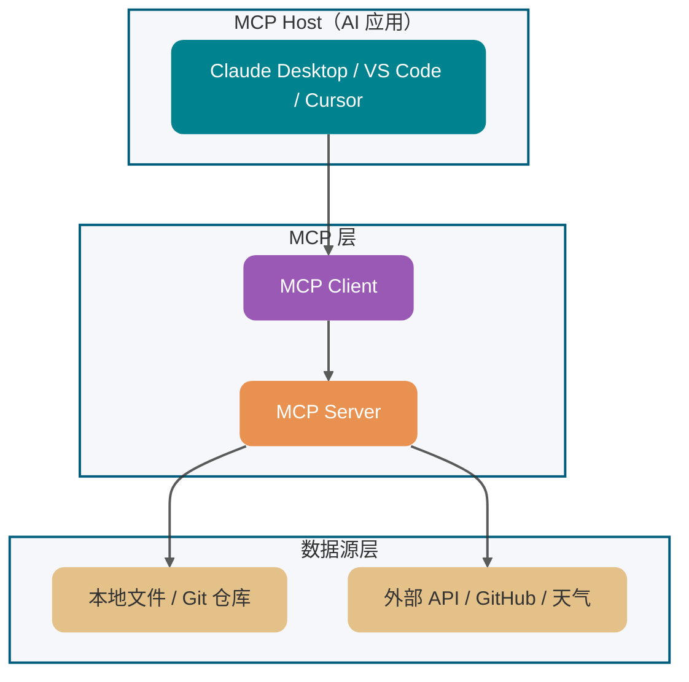
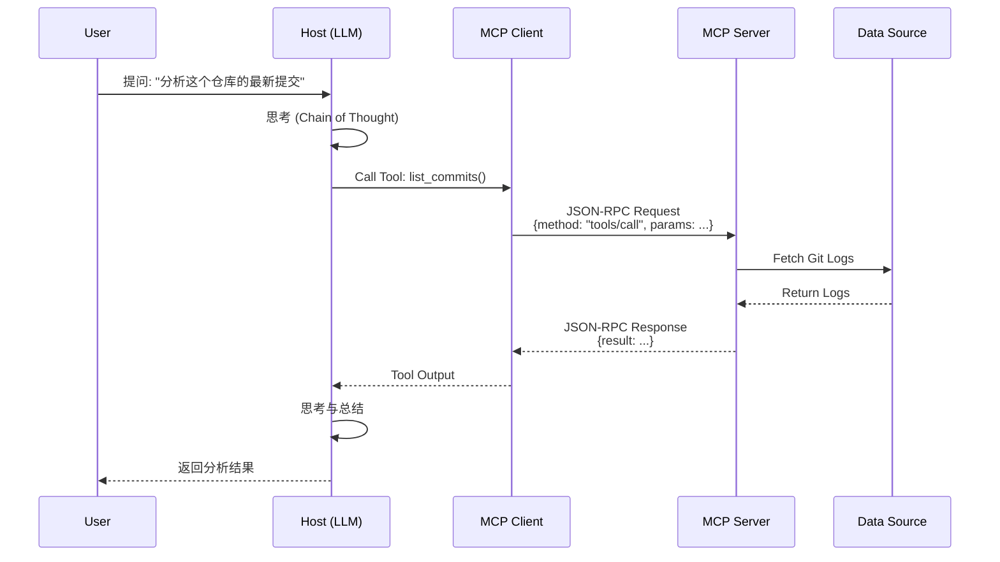

做 LLM 应用开发，最麻烦的通常不是换模型——各家 SDK 已经把模型 API 封装得比较成熟。真正耗精力的是工具接入：想让 AI 调 GitHub API、读本地文件、查 MySQL，往往要为 Claude、GPT、DeepSeek 等不同宿主分别写适配代码。接口一改，多套代码都要同步维护。

这篇文章会把 MCP 拆开讲清楚。全文接近 3000 字，主要看这几块：

1. MCP 到底解决什么问题，和 Function Calling、Agent Skills 的边界在哪
2. MCP 的四层分层架构：应用层、客户端、服务端、传输层各自卡什么位置
3. JSON-RPC 2.0 通信机制和 stdio、SSE 两种传输方式的选型
4. 生产级 MCP Server 开发的实战经验和常见坑

## MCP 基础概念

### 什么是 MCP？解决了什么问题？

MCP（Model Context Protocol）是 Anthropic 在 2024 年底推出的开放协议，常见比喻是 **AI 领域的 USB-C**。它要解决的问题很直接：工具开发者只写一个 MCP Server，支持 MCP 的 AI 应用就能复用这套能力，不必为每个宿主重复造轮子。

MCP 通过 JSON-RPC 2.0 统一了 LLM 与外部数据源/工具的通信规范，支持：

- **Resources**：只读数据流，比如本地文件、数据库里的历史记录
- **Tools**：可执行动作，Python 脚本、Slack 消息、SQL 查询都能封装
- **Prompts**：预设指令集，“重构这段代码”、“生成周报”这类模板
- **Sampling**：让 Server 反过来请求 Host 端的 LLM 做推理生成


### 为什么需要这个协议？

在 MCP 出现之前，接入一个工具的工作量是这么算的：**工具数 × LLM 数量**。GitHub + GitLab + Jira + 文件系统，再乘以 GPT + Claude + DeepSeek，光是适配层代码就够写一个团了。

LLM 本身的短板也加剧了这个问题：

- **精确计算**：复杂数值计算容易出错，需要交给确定性工具
- **实时信息**：训练数据有截止日期，问昨天天气它能胡编
- **系统交互**：没法直接读写文件、连数据库
- **定制化操作**：特定业务逻辑塞不进 prompt 里

MCP 解决的就是这个碎片化问题。打个不严谨的比方：就像 USB-C 统一了充电口，你一根线走天下，不用再囤一抽屉转接头。

> 打个比方：HTTP 统一了网页传输，MCP 统一的是 AI 与外部工具/数据源的交互方式。没有这层标准，每接一个新工具都要适配一遍各家 API，规模一上来成本根本扛不住。

## MCP 和 Function Calling、Agent 的区别

这是经常被问到的问题，简单说两句：

**Function Calling** 是 LLM 的推理层能力，把自然语言意图映射成结构化工具调用。不同厂商叫法不一样——OpenAI 叫 Function Calling，Anthropic 叫 Tool Use——但干的事一样：让模型输出“该调哪个工具、传什么参数”。

**MCP** 是应用层的网络通信协议，定义的是“工具怎么接入、怎么被发现、怎么被调用”。它解决的是工具开发者和 AI 应用之间的对接问题。

**Agent** 则是更高层的系统概念，说的是“怎么让 AI 自动完成一个多步骤任务”，规划、记忆、工具调用都算 Agent 的范畴。

关系大概是：Agent 在执行任务时可能触发工具调用；宿主程序拿到模型生成的 tool call 后，可以把这次调用路由到本地函数，也可以路由到 MCP Server；MCP Server 再去连接各种后端服务。层级不同，解决的问题也不同，不是谁取代谁。

| 场景                   | 用什么           | 理由                       |
| ---------------------- | ---------------- | -------------------------- |
| 让 Claude 读取本地文件 | MCP              | 需要标准化接口，跨平台复用 |
| 让 GPT 查天气          | Function Calling | 模型原生能力，简单直接     |
| 自动分析代码并修复 Bug | Agent            | 需要多步规划、决策、反思   |

## 架构与工作流程

### 核心组件有哪些？

MCP 分四层，每层管一件事：



- **MCP Host**：运行 AI 应用的地方，Claude Desktop、Cursor、VS Code 的 AI 插件都算
- **MCP Client**：Host 内部组件，和 MCP Server 建立 1:1 连接，转发请求
- **MCP Server**：开发者写的部分，暴露 Resources、Tools 等能力
- **Data Source**：实际的数据和后端服务，文件系统、数据库、外部 API

一个 Host 可以管理多个 Client，每个 Client 对应一个 Server。Client 和 Server 之间通过 JSON-RPC 通信，不绑定具体实现。

> 新手常踩的坑：以为 Host 直接连 Server。实际上 Host 内部会为每个配置的 Server 创建独立的 Client 实例，Server 之间互不影响。

### 完整工作流程是什么样的？

用“分析这个仓库的最新提交”这个场景走一遍：



流程大概是：用户提问 → LLM 决定需要外部能力 → 通过 Client 发请求 → Server 调后端服务 → 结果返回 → LLM 整合输出。七个步骤，但实际开发中你主要在写 Server 端的业务逻辑，Client 和 Host 都是现成的。

## 通信协议与传输方式

### 为什么选 JSON-RPC 2.0？

MCP 用的是 JSON-RPC 2.0，选它的原因挺实在的：

- **轻量**：不用像 gRPC 那样定义 Protobuf、生成桩代码，接入成本低
- **传输无关**：stdio、HTTP、WebSocket 都能跑
- **易调试**：纯文本格式，日志里直接看
- **生态成熟**：几乎所有语言都有现成的 JSON-RPC 库

代价是 JSON-RPC 没有强类型约束，MCP 得在应用层用 JSON Schema 做结构化声明和运行时校验。不算什么大问题，写 Server 的时候多一步定义而已。

消息格式长这样：

```json
// 请求
{
  "jsonrpc": "2.0",
  "method": "tools/call",
  "params": {
    "name": "read_file",
    "arguments": { "path": "/path/to/file.txt" }
  },
  "id": 1
}

// 响应
{
  "jsonrpc": "2.0",
  "id": 1,
  "result": {
    "content": [{ "type": "text", "text": "文件内容..." }]
  },
  "error": null
}
```

和 RESTful 对比：JSON-RPC 更偏“操作”而不是“资源”，没有 HTTP 状态码、缓存那套东西，天然适合内部通信和工具调用。

### 如何传输？

**stdio（标准输入/输出）**

适合本地进程间通信。Host 启动 MCP Server 作为子进程，通过 stdin/stdout 通信。

优点是极度轻量、无网络开销。缺点也明显：Server 通常以本地子进程运行，权限边界需要额外设计。若使用第三方 Server，建议通过 Docker、cgroups、namespace、源码审计等方式做隔离和限制。

Claude Desktop 默认用这种方式，VS Code 的 AI 插件也是。

**Streamable HTTP（推荐用于生产）**

2025 年 3 月正式引入，取代了之前的 HTTP+SSE。核心变化：

- 原来是两个端点（`/sse` 持久连接 + `/sse/messages` 发消息），现在合并成一个（`/mcp`）
- 原来是连接建立时校验一次认证，现在每条请求都能独立鉴权
- 原来跟负载均衡器八字不合，现在天然兼容标准 HTTP 基础设施

```http
// 请求发到同一个端点
POST /mcp
Authorization: Bearer xxx

// 响应可能是普通 JSON（简单请求）
// 也可能是 SSE 流（需要推送）
```

选型建议：本地开发用 stdio，省事；远程部署、生产环境用 Streamable HTTP，安全性、可扩展性都更好。


## 开发 MCP Server 的实战经验

### 工具设计原则

工具粒度直接决定 LLM 能不能选对工具。设计得好，模型选得准；设计得差，模型不知道该调哪个，或者一次调用想干三件事。

反面典型：

- `execute_sql(sql)` —— 什么都能干，但也意味着 LLM 可以执行任意 SQL
- `file_operation(op, path, data)` —— 一个工具干三种事，边界模糊

正确姿势是单一职责、语义明确：

- `get_user_by_id(id)` / `list_active_orders()`
- `read_file(path)` / `write_file(path, content)`

工具名称用动词+名词：`get_`、`list_`、`create_`、`update_`、`delete_`。参数类型要明确，用 JSON Schema 定义好，方便 LLM 理解和验证。

### 大文件处理

MCP 的 Resources 能力可以一次性加载大量文本，一不小心就会出问题：

**分块 (Chunking)**：文件太大就拆成小 chunk 加载，单块建议不超过 100KB。

**按需加载**：不要一股脑全加载，给 LLM 提供元数据，让它自己决定要不要加载完整内容。

**内存保护**：限制单条资源大小上限（比如 < 10MB），超出时返回元数据而非全文，防止 OOM 导致 Server 被 Kill。

**Token 控制**：MCP Server 是模型无感知的，别硬编码特定模型的 Tokenizer。限制绝对字符长度（比如 < 1MB）就好，Context Window 截断交给 Host 端处理。

### 安全防护

- **路径遍历**：验证文件路径，禁止 `../` 逃逸
- **SQL 注入**：用参数化查询，禁止字符串拼接 SQL
- **敏感信息**：返回数据做脱敏处理
- **资源滥用**：配置限速、配额和熔断策略

### 调试工具

[MCP Inspector](https://modelcontextprotocol.io/docs/tools/inspector) 是官方提供的调试工具，可以模拟 Host 发请求：

```bash
npx @modelcontextprotocol/inspector node my-server.js
```

本地测试阶段很实用。另外日志要记录完整的 JSON-RPC 请求和响应，方便出问题的时候排查。

### 快速上手示例

用官方 Python SDK 写一个简化版天气 MCP Server：

```python
from mcp.server.fastmcp import FastMCP

mcp = FastMCP("weather-server")

@mcp.tool()
def get_weather(city: str) -> str:
    """获取指定城市的天气信息"""
    # 实际业务逻辑
    return f"{city} 今天晴天，温度 25°C"

@mcp.resource("weather://forecast")
def weather_forecast() -> str:
    """返回未来一周天气预报"""
    return "未来七天天气预报..."

if __name__ == "__main__":
    mcp.run()
```

在 Claude Desktop 配置：

```json
{
  "mcpServers": {
    "weather-server": {
      "command": "uv",
      "args": ["run", "--with", "mcp", "/path/to/weather_server.py"]
    }
  }
}
```

> 生产环境注意：不要依赖全局 `python` 环境是否安装了 `mcp`。可以使用虚拟环境中的解释器，或用 `uv run --with mcp ...` 这类方式显式声明依赖。如果 Claude Desktop 启动失败，查看 `mcp.log` 排查。

## 总结

MCP 生态还在快速演进。协议本身也在迭代，比如从 HTTP+SSE 升级到 Streamable HTTP，能力在不断丰富。

目前的状态：

- **官方 SDK**：TypeScript 为主，Python SDK 也在完善，Java 那边主要是 Spring AI 社区在跟进
- **社区生态**：Awesome MCP Servers 收集了大量开源实现，文件系统、数据库、GitHub API 各种 Server 都有
- **客户端支持**：Claude Desktop、Cursor、VS Code 等主流工具都在支持

MCP 做的事说白了就是把“各自适配”变成“统一接口”，解决 AI 应用开发里的基础设施碎片化问题。RESTful API 统一了 Web 服务的接口风格，MCP 想统一的是 AI 应用与外部工具/数据源的接入方式。

上手最快的路径就是写一个最简单的 MCP Server，边做边理解协议细节。协议还在演进，但核心概念已经稳定了，先跑起来比先研究透更重要。

**核心要点**：

- MCP = AI 领域的 USB-C，一次开发多处复用
- 四大能力：Resources、Tools、Prompts、Sampling
- 四层架构：Host → Client → Server → Data Source
- 传输方式：stdio（本地）vs Streamable HTTP（远程）
- 开发重点：工具粒度、大文件处理、安全防护
