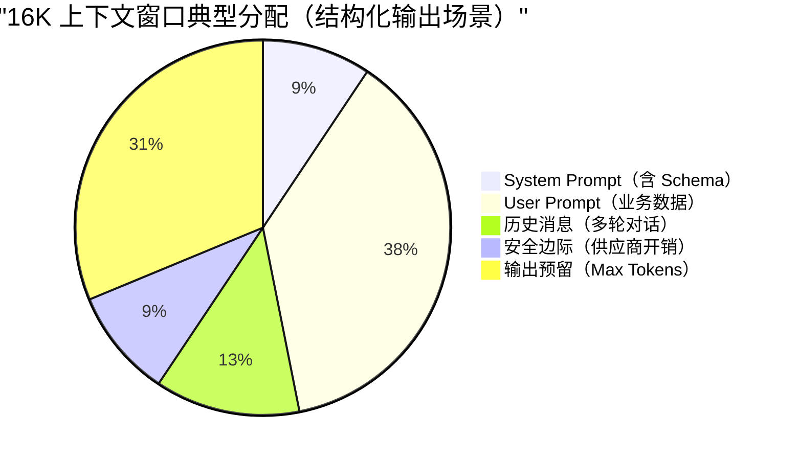

在这之前，我已经围绕 AI 应用开发写了 7 篇深度解析文章，拆解了从 RAG 向量检索、Agent 工作流到 MCP 协议等知识点：

1. [7 道 AI 编程相关的开放性面试问题](https://mp.weixin.qq.com/s/AkBNmyrcmZsgkSzvJNmO7g)
2. [万字详解 Agent Skills：是什么？怎么用？和 Prompt、MCP 有什么区别？ ](https://mp.weixin.qq.com/s/5iaTBH12VTH55jYwo4wmwA)
3. [万字详解 RAG 基础概念](https://mp.weixin.qq.com/s/Y9vwNndTUWMpFxHeLbTUlg)
4. [万字详解 RAG 向量索引算法和向量数据库](https://mp.weixin.qq.com/s/Y9vwNndTUWMpFxHeLbTUlg)
5. [一文搞懂 AI Agent 核心概念：Agent Loop、Context Engineering、Tools 注册](https://mp.weixin.qq.com/s/h3fiJJPjpBPJWY69u9_2DQ)
6. [万字详解 Agent 核心方式： ReAct、Reflection、A2A、Agentic Workflows](https://mp.weixin.qq.com/s/fHZgHmQ0ZkPMcKvagqRtwA)
7. [万字拆解 MCP，附带工程实践](https://mp.weixin.qq.com/s/O2KNaNXT4ohwwjyrU-gK6A)

但在探讨这些复杂架构的过程中，我发现一个非常普遍的现象：很多开发者在构建 Agent 工作流或调优 RAG 检索时，往往会在最底层的 LLM 参数上踩坑。比如，为什么明明设置了温度为 0，结构化输出还是偶尔崩溃？为什么往模型里塞了长文档后，它好像失忆了，忽略了 System Prompt 里的关键指令？

万丈高楼平地起。如果不搞懂底层 LLM 吞吐数据的基本原理，再高级的设计模式在生产环境中也会变得脆弱不堪。

因此，有了这篇基础扫盲文章。我们将暂时放下顶层的架构设计，回到一切的起点。大模型没有魔法，底层只有纯粹的数学与工程。接下来，我们将扒开 LLM 的黑盒，把日常调用 API 时遇到的 Token、上下文窗口、Temperature 等高频词汇，还原为清晰、可控的工程概念。理解了大模型到底在做什么，你才能真正掌控它。

希望这篇基础扫盲能够对你有帮助！

## 大模型（LLM）到底在做什么

### 一句话理解大模型

当你在输入法里打“今天天气真”，它会自动建议“好”——大模型做的事情本质上一样，只不过它看的不是前面几个字，而是前面几千甚至几十万个字，且每次只“补”一个 Token（文本碎片），然后把刚补的内容也加入上下文，再预测下一个，如此循环，直到生成完整回答。

这个过程叫做**自回归生成（Autoregressive Generation）**。

理解了这一点，后面所有概念都有了根基：

- **Token**：模型每一步“补”的那个文本碎片，就是一个 Token。
- **上下文窗口**：模型在“补”之前能看到的最大文本量。
- **Temperature / Top-p**：模型在多个候选碎片中“选哪个”的策略。
- **Max Tokens**：你允许模型最多“补”多少步。

有了这个心智模型，我们再逐一展开。

### 全局概念地图

在深入每个概念之前，先看一张完整的调用流程图，帮你在 30 秒内建立全局认知：

```
用户输入
  ↓
[Tokenizer] → Token 序列
  ↓
塞入上下文窗口（System Prompt + User Prompt + 历史 + RAG 片段）
  ↓                                              ↑
模型推理（自注意力机制）                    [Embedding + 向量检索]
  ↓                                         从知识库召回相关片段
logits → [Temperature/Top-p/Top-k] → 采样出下一个 Token
  ↓
重复直到 EOS 或 Max Tokens
  ↓
结构化输出解析 & 校验
  ↓
业务消费
```

后续每个小节都能在这张图上找到对应位置。

### Token：模型的“阅读单位”

你可以把 Token 理解为“模型的阅读单位”。我们人类读中文是一个字一个字地看，读英文是一个词一个词地看；但模型既不按字、也不按词——它用一套自己的“拆字规则”（叫 Tokenizer）把文本切成大小不等的碎片，每个碎片就是一个 Token。

**为什么不直接按字或按词切？** 因为模型需要在“词表大小”和“序列长度”之间取平衡：

- 如果每个汉字都是一个 Token，词表小、但序列长（模型要“补”更多步）；
- 如果每个词都是一个 Token，序列短、但词表会爆炸（中文词组太多了）。

所以实际使用的是一种折中方案——**子词切分算法**（如 BPE、Unigram），它会把高频词保留为整体，把低频词拆成更小的片段。

> **💡 一个直觉**：你可以把 Token 想象成乐高积木——常用的“积木块”比较大（比如“你好”可能是一个 Token），不常用的词会被拆成更小的基础块拼起来。

**Token 不是“一个字”或“一个词”的严格等价物**：

- 英文可能一个单词被拆成多个 Token；
- 中文可能一个词被拆成多个 Token，也可能多个字合并成一个 Token（取决于词频与词表）。

因此，工程上通常只用 **经验估算** 做容量规划，而用 **实际 API 返回的 usage**（若供应商提供）做精确计费与监控。

**经验估算（仅用于粗略规划）**：

- 英文：1 Token 大约对应 3~4 个字符（与文本类型相关）。
- 中文：1 Token 常见在 1~2 个汉字上下波动（与混排比例强相关）。

以 DeepSeek 官方数据为例：1 个英文字符约消耗 0.3 Token，1 个中文字符约消耗 0.6 Token。换算过来，1 个 Token 约等于 3.3 个英文字符或 1.7 个中文字符，与上述经验值吻合。

**💡 成本趋势提示**：Token 成本与编码器（Tokenizer）版本强相关。早期模型（如 GPT-3.5）中文压缩率较低（约 1 字 1.5~2 Token）。GPT-4o 使用 o200k_base Tokenizer（词表约 20 万），相比前代 cl100k_base 对中文的压缩率有进一步提升；Qwen2.5 词表约 15 万，对中文常用词同样有优化。实测数据因文本类型而异：新闻类文本约 1.5 字/Token，技术文档约 1.2 字/Token。“趋近 1 字 1 Token”仅适用于高频词汇，不建议作为成本估算基准。**在做成本预算时，请务必查阅当前模型版本的官方 Tokenizer 演示，勿沿用旧模型经验。**

Token 划分的精细度会直接影响模型的理解能力。特别是在中文处理时，分词歧义（同一字符序列的多种切分方式）和生僻字/低频专业术语的切分粒度，会直接影响模型的语义理解效果。

**Token 化过程示例**：

- 原文：`你好，我是 Guide。`
- 切分：`[你好]` `[，]` `[我是]` `[Guide]` `[。]`
- 统计：原文 12 字符 → Token 数 5 个 → 压缩比约 2.4 倍


> **⚠️ 注意**：实际的 Token 切分由模型供应商的 Tokenizer 实现，不同供应商对相同文本可能产生不同的 Token 序列。生产环境中应使用对应供应商的 Tokenizer 工具进行精确计数。

**特殊 Token**：除了文本内容对应的 Token，模型内部还会使用一些特殊标记，这些也会计入 Token 总数：

| 特殊 Token                   | 用途                            | 示例           |
| ---------------------------- | ------------------------------- | -------------- |
| BOS（Beginning of Sequence） | 标记序列开始                    | `<s>`          |
| EOS（End of Sequence）       | 标记序列结束                    | `</s>`         |
| PAD（Padding）               | 批处理时填充短序列              | `<pad>`        |
| 工具调用标记                 | Function Calling 场景的边界标记 | `<tool_call/>` |

这些特殊 Token 通常对用户不可见，但会占用上下文窗口。在精确计数时，建议使用官方 Tokenizer 工具而非手动估算。

### 多模态 Token：图片也会消耗 Token

GPT-4o、Claude 3.5、Gemini 等模型已支持图片输入。**图片不是“零成本”的**——它会被转换成一批 Token，同样占用上下文窗口。

**粗略估算规则**：

| 模型       | 图片 Token 计算方式                           | 一张 1024×1024 图片约等于                                |
| ---------- | --------------------------------------------- | -------------------------------------------------------- |
| GPT-4o     | 按分辨率 + 细节模式                           | 低细节 ~85 tokens，高细节 ~1105~765 tokens（取决于裁剪） |
| Claude 3.5 | 固定 ~5 tokens（缩略图）或 ~85 tokens（全图） | 取决于图片模式                                           |
| Gemini     | 按分辨率计算                                  | ~258 tokens（标准）                                      |

**工程启示**：

- 做多模态 RAG 时，要把图片 Token 也纳入预算
- 批量处理图片时，注意首字延迟（TTFT）会显著增加
- 如果只需要 OCR，考虑先用专门的 OCR 服务提取文字，再以纯文本形式送入模型

### 上下文窗口（Context Window）

**上下文窗口**（或称“上下文长度”）是 LLM 的**“工作记忆”（Working Memory）**。它决定了模型在任何时刻可以处理或“记住”的文本量（以 Token 为单位）。

- **对话连续性**：它决定了模型能进行多长的多轮对话而不遗忘早期细节。
- **单次处理能力**：它决定了模型一次性能够处理的最大文档、代码库或数据样本的大小。

“模型支持 128K/200K/1M”指的是 **一次调用**里能放进模型的总 Token 上限。**大多数模型的上下文窗口包含输入与输出的总和**，但部分供应商（如 Google Gemini）对输入和输出分别设限，请查阅具体 API 文档。此外，上下文窗口往往被隐形成本占用：


- **System Prompt**：调节模型行为的系统指令（通常对用户隐藏，但占用窗口）。
- **User Prompt**：业务数据与指令。
- **多轮对话历史**：过往的消息记录。
- **RAG 检索片段**：从外部知识库检索到的补充信息。
- **工具调用 Schema**：函数定义与参数结构。
- **格式开销**：特殊字符、换行符、Markdown 标记等。
- **模型生成的输出 Token**：**（关键）** 输出也占用上下文窗口。

因此，你真正能塞进 Prompt 的“有效业务内容”往往远小于标称上限。

**⚠️ 注意输出硬限制**：上下文窗口（Context Window）≠ 最大生成长度。许多模型支持 128K 甚至 1M 输入，但单次输出上限因 API 而异：OpenAI Chat Completions API 使用 `max_tokens` 参数（GPT-4o 最大 16K 输出），部分新模型支持 `max_completion_tokens`（如 o1 系列），DeepSeek V3 最大输出 8K。使用前需查阅具体模型的 API 文档。

**思维链模式的多轮对话处理**：在多轮对话场景中，思维链模型（如 DeepSeek-R1）的 `reasoning_content`（思考过程）通常**不会**被自动包含在下一轮对话的上下文中。只有 `content`（最终回答）会参与后续对话。这意味着：

- 你无需为思考过程额外占用上下文窗口。
- 但如果后续对话需要参考之前的推理过程，需要手动将 `reasoning_content` 拼接到消息历史中。
- 部分供应商的 SDK 会自动处理这一差异，建议查阅具体文档确认行为。

### 上下文窗口为什么会有上限？

上下文窗口并非越大越好，它受限于 Transformer 架构的**自注意力机制（Self-Attention）**：

- **计算成本平方级增长**：计算需求与序列长度呈平方级关系（O(N²)）。输入 Token 翻倍，处理能力需求可能变为 4 倍。这意味着**更长的上下文 = 更高的成本 + 更慢的推理速度**。
- **推理延迟增加**：随着上下文变长，模型生成每个新 Token 时需要关注的所有历史 Token 变多，导致输出速度逐渐变慢（尤其是首字延迟 TTFT 会显著增加）。
- **安全风险增加**：更长的上下文意味着更大的攻击面，模型可能更容易受到对抗性提示“越狱”攻击的影响。

**工程优化手段**：实践中，FlashAttention（IO-aware 精确注意力）、GQA/MQA（分组/多查询注意力）、Sliding Window Attention（如 Mistral）、Ring Attention 等技术已显著降低长上下文的实际计算和显存开销。但 O(N²) 的理论复杂度仍是上限扩展的根本瓶颈。

### 上下文溢出的真实表现

当上下文接近上限或内容过长时，常见现象包括：

- **模型忽略早期约束**：System Prompt 里要求“必须输出 JSON”，但因距离生成点太远，注意力不足导致被忽略。**缓解策略**：将关键约束在 User Prompt 末尾重复强调，或使用 Structured Outputs 的 Strict Mode 从解码层面强制约束。
- **“中间丢失”现象（Lost in the Middle）**（Liu et al., 2023）：即使在 1M 窗口模型中，模型对**开头和结尾**的信息最敏感，对**中间部分**的信息召回率显著下降。
- **回答漂移**：前半段还围绕问题，后半段开始总结/扩写/跑题。
- **RAG 失效**：检索文档过多，关键信息被稀释；或被截断导致证据链断裂。
- **成本与延迟激增**：1M 上下文会导致首字延迟（TTFT）显著增加，且 Token 成本呈线性增长。

在本项目里，你能看到两个典型的“上下文控制”手段：

- **智能截断**：不要简单粗暴地截断字符串。例如把简历内容做 **摘要提取** 或 **关键信息抽取**，避免把长文本原封不动塞进评估 prompt。
- **分批处理和二次汇总**：长面试评估按 batch 分段评估，再做二次汇总，避免单次调用 Token 过大。

即使拥有 1M 窗口，也建议设置 **软性预算上限**（如 128K）。除非必要，否则不要全量输入，以平衡成本、延迟与准确性。

### 计费差异：输入 Token ≠ 输出 Token

大多数供应商对**输入 Token**和**输出 Token**采用不同的计费标准，通常输出价格是输入的 **2~4 倍**：

| 模型              | 输入价格（/1M Tokens） | 输出价格（/1M Tokens） | 输出/输入比 |
| ----------------- | ---------------------- | ---------------------- | ----------- |
| GPT-4o            | \$2.50                 | \$10.00                | 4x          |
| Claude 3.5 Sonnet | \$3.00                 | \$15.00                | 5x          |
| DeepSeek V3       | ¥0.5                   | ¥2.0                   | 4x          |
| DeepSeek-R1       | ¥4.0                   | ¥16.0                  | 4x          |

**工程启示**：

- 长 Prompt + 短输出 = 更经济的调用方式
- RAG 场景要控制检索片段数量，避免输入 Token 激增
- 思维链模型的 reasoning tokens 通常按输出价格计费，成本更高

### Prompt Caching：重复前缀的成本救星

当你的请求中存在**大量重复的固定前缀**（如 System Prompt、长 RAG Context），可以用 **Prompt Caching**（提示词缓存）显著降低成本。

**原理**：供应商会缓存你请求中“可复用的前缀部分”。下次请求如果前缀相同，这部分就不重新计费，只收“缓存读取”的费用（通常是正常价格的 10%~50%）。

**典型适用场景**：

- 多轮对话（System Prompt + 历史 Message 不变）
- RAG 应用（检索片段重复率高）
- 批量评估（同一份 System Prompt，不同的简历/文章）

**各供应商支持情况**：

| 供应商    | 功能名称        | 缓存时长   | 缓存命中折扣   |
| --------- | --------------- | ---------- | -------------- |
| OpenAI    | Prompt Caching  | 5~10 分钟  | 输入价格约 50% |
| Anthropic | Prompt Caching  | 5 分钟     | 输入价格约 10% |
| DeepSeek  | Context Caching | 10~30 分钟 | 输入价格约 25% |

**工程建议**：

1. 把**不变的内容放前面**（System Prompt、工具定义、RAG Context），把**变化的内容放后面**（User Prompt）
2. 监控 `cache_read_tokens` 和 `cache_creation_tokens` 指标，验证缓存命中率
3. 批量任务尽量在缓存时间窗口内完成

即使拥有 1M 窗口，也建议设置 **软性预算上限**（如 128K）。除非必要，否则不要全量输入，以平衡成本、延迟与准确性。

### 一次调用的 Token 预算怎么做

把“上下文窗口”当成一个固定容量的桶，下图展示了一个典型调用的 Token 预算分配：



> 此分配仅为示意，实际比例需根据业务场景动态调整。

最实用的预算方式是：

**window ≥ input_tokens + max_output_tokens**

对于思维链模型，公式应调整为：

**window ≥ input_tokens + reasoning_tokens + max_output_tokens**

其中 `reasoning_tokens`（思考链 Token 数）难以精确预估，建议按 `max_output_tokens` 的 2~3 倍预留。

其中 `input_tokens` 至少包含：

- system prompt（含 schema / 工具定义）
- user prompt（含变量替换后的实际文本）
- 历史消息（如果你做多轮对话）
- RAG context（如果你拼进来了）

工程上建议你反过来做预算（因为输出经常更可控）：

1. 先定 `max_output_tokens`（结构化输出通常不需要很长）
2. 再为输入预留安全边际（例如再留 10%~20% 给“供应商额外开销”：工具调用包装、隐藏 tokens、编码差异等）
3. 超预算时，用可解释的策略“减输入”而不是“赌模型会自我约束”：
   - 优先减少 RAG 的 Top-K 或做片段去重
   - 对长字段做摘要/截断（如简历、长回答）
   - 多段任务拆成多次调用（分批评估、两阶段生成）

## 解码（Decoding）与采样参数

### 先理解“选词”过程

模型每一步会给词表中的**每个**候选 Token 打一个分数（内部叫 **logits**），分数越高说明模型越觉得这个词应该出现在这里。

举个例子，假设模型正在补全“今天天气真\_\_”，它可能给出这样的分数：

| 候选 Token | 原始分数（logit） |
| ---------- | ----------------- |
| 好         | 5.0               |
| 不错       | 3.2               |
| 棒         | 2.1               |
| 糟糕       | 0.5               |
| 紫色       | -8.0              |

但原始分数不是概率——需要经过一次数学变换（**softmax**）才能变成“每个候选被选中的概率”。变换后大致是：

| 候选 Token | 概率 |
| ---------- | ---- |
| 好         | 62%  |
| 不错       | 20%  |
| 棒         | 10%  |
| 糟糕       | 5%   |
| 紫色       | ≈ 0% |

最后，模型按这个概率分布“抽签”（采样），决定输出哪个 Token。

**解码参数**（Temperature、Top-p、Top-k 等）就是在这个**“打分 → 概率 → 抽签”**的过程中施加控制。它们的作用可以这样理解：

- **Temperature**：调整概率分布的“形状”——让高分选项更突出，或者让各选项更均匀
- **Top-p / Top-k**：直接砍掉不靠谱的候选项，缩小“抽签池”
- **Penalty 系列**：对已经出现过的词降分，防止“复读机”

下面逐一展开。

### Temperature：控制模型的“冒险程度”


Temperature 的工作原理很简单：在 softmax 之前，先把所有分数**除以**温度值 T。

**p(t) = softmax(z_t / T)**

- (T ≈ 1)：保持原始分布。
- (T < 1)：分布更尖锐，更倾向选择高概率 Token（更“稳”、更少发散）。
- (T > 1)：分布更平坦，低概率 Token 更容易被采样到（更“灵感”、也更容易偏离约束）。

那除以 T 之后会发生什么？还是用“今天天气真\_\_”的例子：

- **T = 0.2（低温）——“保守模式”**：分数差距被放大（都除以 0.2，等于乘以 5），原本就领先的“好”概率飙升到 ~98%，几乎每次都选它。
- **T = 1.0（默认温度）**：保持原始分布不变，“好”62%、“不错”20%...按正常概率采样。
- **T = 1.5（高温）——“冒险模式”**：分数差距被缩小（都除以 1.5），“好”概率降到 ~35%，“棒”、“不错”甚至“糟糕”都有更大机会被选中。

一句话总结：**温度越低，输出越确定、越“稳”；温度越高，输出越随机、越“野”。**

**工程建议（经验值，非硬规则）**：

| 场景                         | 推荐温度   | 说明                               |
| ---------------------------- | ---------- | ---------------------------------- |
| 结构化提取 / JSON 输出       | 0 ~ 0.3    | 配合严格 schema + 解析失败重试策略 |
| 评估 / 分析 / 代码评审       | 0.4 ~ 0.8  | 平衡确定性与表达多样性             |
| 创作类内容（文案、头脑风暴） | 0.8 ~ 1.2+ | 增加多样性，但要承担格式一致性风险 |

> **追求确定性？** 若需单元测试幂等或结果复现，仅设 `Temperature=0` 不够（GPU 浮点误差仍可能导致非确定性）。建议同时配置 **`seed` 参数**（如 OpenAI/DeepSeek 支持）。固定 seed + 低温可最大程度减少波动。
>
> 需注意即使配置 `seed`，以下情况仍可能导致结果不一致：
>
> - 模型版本更新（底层权重变化）
> - 跨区域调用（不同集群可能部署不同版本）
> - Top-p 采样（即使 T=0，若 Top-p<1 仍有随机性）
>
> 建议在 CI/CD 中仅将 LLM 调用用于冒烟测试，核心逻辑仍依赖 Mock。

### Top-p（Nucleus Sampling）与 Top-k：缩小“抽签池”

Temperature 调整的是概率分布的形状，但不管怎么调，词表里所有 Token 理论上都有被选中的可能（哪怕概率极低）。Top-p 和 Top-k 则更直接——**把不靠谱的候选直接踢出抽签池**。

还是用“今天天气真\_\_”的例子：

| 候选 Token | 概率 | 累计概率 |
| ---------- | ---- | -------- |
| 好         | 62%  | 62%      |
| 不错       | 20%  | 82%      |
| 棒         | 10%  | 92%      |
| 糟糕       | 5%   | 97%      |
| 紫色       | ≈0%  | ≈100%    |

- **Top-k = 3**：只保留概率最高的 3 个候选（好、不错、棒），在这 3 个里重新分配概率后采样。“糟糕”和“紫色”直接出局。
- **Top-p = 0.9**：从高到低累加概率，保留累计刚好达到 90% 的最小集合。这里“好 + 不错 + 棒 = 92% ≥ 90%”，所以保留这 3 个。如果某个场景下头部更集中（比如第一名就占了 95%），Top-p 会自动只保留 1 个——这就是它比 Top-k 更灵活的地方。

**两者的区别**：Top-k 固定保留 k 个，不管概率分布长什么样；Top-p 根据概率自适应调整候选数量。实践中 **Top-p 更常用**，因为它能自动适应不同的概率分布。

**常见组合**：

| 组合                | 效果                             | 适用场景               |
| ------------------- | -------------------------------- | ---------------------- |
| T=0（贪婪解码）     | 永远选最高分，完全确定           | 结构化输出、可复现场景 |
| 低温 + Top-p=0.9    | 相对稳定，但允许措辞上有些变化   | 分析报告、摘要         |
| 中高温 + Top-p=0.95 | 多样性较高，但排除了极端离谱选项 | 创意写作、对话         |

> ⚠️ 注意：贪婪解码虽然最稳定，但可能更容易陷入重复循环（比如反复输出同一段话）。

### Max Tokens / Stop Sequences：控制输出何时停止

工程上需要意识到两点：

- **Max Tokens 是硬上限**：到上限会被**强制截断**——模型正写到一半也会被“掐断”。常见后果：JSON 缺右括号、列表缺最后几项、句子写了一半。
- **Stop Sequences（停止词）是软切断**：你可以指定一些字符串（如 `"\n\n"` 或 `"```"`），模型生成到这些内容时会自动停止。但如果 stop 设计不当，可能提前截断关键字段。

因此，结构化输出场景要把“截断风险”当成一类失败路径来设计缓解策略。

**思维链模式的 Token 计算差异**：对于支持思维链的模型（如 DeepSeek-R1），`max_tokens` 的值通常**包含思考过程 + 最终回答**两部分。例如设置 `max_tokens=8192`，模型可能在思考链上消耗 5000 tokens，最终回答只剩 3192 tokens 的预算。因此，思维链场景需要为思考过程预留更大的 buffer。不同供应商的默认值和上限差异较大：DeepSeek-R1 默认 32K、最大 64K；OpenAI o1 系列的输出上限也高于普通模型。使用前务必查阅具体模型的 API 文档。

### Repetition / Presence / Frequency Penalty：防止“复读机”

你可能遇到过模型反复输出同一句话，或者在长回答里不断重复相同的观点。Penalty 参数就是用来缓解这类问题的，它们在解码时**降低已出现 Token 的分数**：

| 参数               | 作用                                | 通俗理解                 |
| ------------------ | ----------------------------------- | ------------------------ |
| Repetition Penalty | 降低所有已出现 Token 的概率         | “说过的词，再说就扣分”   |
| Presence Penalty   | 只要 Token 出现过就扣分（不看次数） | “鼓励聊新话题”           |
| Frequency Penalty  | Token 出现次数越多扣分越重          | “同一个词说了三遍？重罚” |

**⚠️ 工程陷阱**：

- **结构化输出别乱加 Penalty**：JSON 里字段名（如 `"name"`、`"score"`）需要反复出现，加了 Repetition Penalty 可能把必须出现的字段名也“惩罚掉”，导致输出残缺。
- **RAG 问答别加 Presence Penalty**：它会鼓励模型“说点新东西”，反而降低对检索内容的忠实度（faithfulness），增加幻觉风险。

**保守建议**：如果你不确定这些参数的精确语义（不同供应商定义可能不同），建议保持默认值。用 **低温 + 更强 Prompt 约束 + 更短输出** 来获得稳定性，比调 Penalty 更可控。

### 思维链模式的参数限制

部分模型（如 DeepSeek-R1、OpenAI o1）支持“思维链模式”（Thinking Mode），在生成最终回答前会先输出一段内部推理过程。这类模型有特殊的参数约束：

**不支持的采样参数**：思维链模式下，以下参数通常被忽略：

- `temperature`、`top_p`：采样控制参数
- `presence_penalty`、`frequency_penalty`：惩罚参数

**原因**：思维链模式的设计目标是让模型“自由思考”，采用模型内部固定的采样策略（具体实现因供应商而异），用户传入的采样参数会被忽略。

**工程建议**：

- 调用思维链模型时，不要依赖上述参数控制输出风格
- 若需要更稳定的输出格式，应通过 Prompt 约束而非采样参数
- 关注模型返回的 `reasoning_content` 字段（思考过程）与 `content` 字段（最终回答）的区别

### 流式输出（Streaming）

默认情况下，API 会等模型生成完所有内容后一次性返回。流式输出则是**边生成边返回**——模型每生成一个（或几个）Token，就立刻推送给客户端，用户更早看到内容开始出现。

**核心价值**：改善用户体验，降低首字延迟（TTFT，Time-To-First-Token）。

**常见误解澄清**：

- ❌ “流式输出更快”——总耗时（E2E latency）不一定下降，模型生成的总 Token 量相同
- ❌ “流式输出更省钱”——Token 计费不变，仍然受限流/配额影响
- ⚠️ 如果你需要结构化输出（如 JSON），流式场景要考虑“半成品 JSON”在前端/网关层的处理——拿到的可能是 `{"name": "张`，你需要等流结束后再解析，或使用流式 JSON 解析器

### Logprobs（对数概率）

部分 API（如 OpenAI）支持返回每个生成 Token 的**对数概率**（logprobs），可以理解为模型对该 Token 的“确信程度”：logprob 越接近 0，模型越确信；值越小（如 -5.0），说明模型越“犹豫”。

**工程应用场景**：

- **置信度评估**：提取“金额: 1000”时，若对应 Token 的 logprob 很低，说明模型不太确定，可能需要人工复核。
- **异常检测**：监控生产环境中模型输出的平均 logprob，若突然下降可能提示 Prompt 漂移或输入数据异常。
- **多候选对比**：获取 Top-N 候选 Token 及其概率，用于纠错或二次排序。

**注意事项**：logprobs 会增加响应体积，且并非所有供应商都支持。使用前请查阅 API 文档。

### 参数速查表

最后整理一张速查表，方便你根据场景快速选择参数组合：

| 场景                | Temperature | Top-p | Penalty  | 其他建议                     |
| ------------------- | ----------- | ----- | -------- | ---------------------------- |
| JSON / 结构化输出   | 0 ~ 0.3     | 1.0   | 保持默认 | 配合 Strict Mode + 重试策略  |
| 代码评审 / 技术分析 | 0.4 ~ 0.7   | 0.9   | 保持默认 | 结合 CoT Prompt              |
| 多轮对话            | 0.6 ~ 0.8   | 0.9   | 适度开启 | 控制历史消息长度             |
| 创意写作 / 头脑风暴 | 0.8 ~ 1.2   | 0.95  | 按需开启 | 接受输出多样性，做好后处理   |
| 思维链模型          | —（不支持） | —     | —        | 通过 Prompt 控制，非采样参数 |

## 总结

当我们把大模型作为一个核心组件接入业务系统时，第一步就是要抛弃拟人化的业务直觉，建立起工程师的客观视角。回顾这篇扫盲内容，核心其实就是处理好三个维度的工程权衡：

1. **Token 是成本与性能的物理标尺**：它不仅决定了你的计费账单和推理延迟，更决定了模型对文本的理解粒度。做容量规划时，必须按 Token 算账，而不是按字数算账。
2. **上下文窗口是极其稀缺的资源**：哪怕模型宣称支持 1M 上下文，也不意味着可以毫无节制地堆砌数据。为 Prompt、RAG 检索片段、历史对话和输出预留做好严格的 Token 预算分配，是走向生产环境的必修课。
3. **采样参数是业务场景的调音台**：如果追求稳定的 JSON 输出，就果断压低 Temperature 并配合严格的 Schema；如果需要创意与头脑风暴，再适度放开 Temperature 和 Top-p。不要迷信默认参数，要根据业务的容错率来定制。

打好这层参数与原理的地基，再去回顾我们之前讲过的 Agent 编排、RAG 检索或是 MCP 工具调用，你会发现那些高阶架构的本质，无非是在更好地调度这些底层 Token，更精准地管理这个上下文窗口。
