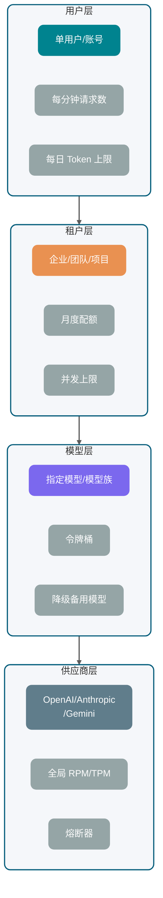
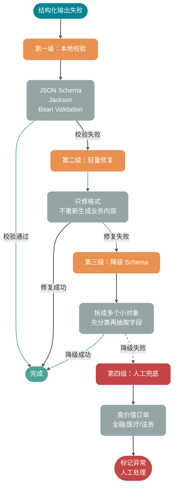

很多 AI 应用的第一个版本都很“顺”：本地调通一个大模型 API，页面上能看到回答，Demo 就算跑起来了。

但一上生产，麻烦马上变得具体：

- 用户等了 8 秒还看不到第一个字，以为系统卡死，直接刷新页面。
- 模型返回了一半 JSON，前端解析失败，后端日志里只有一串残缺的 `{"answer": "根因是`。
- 供应商偶发 429，你的服务开始疯狂重试，越重试越被限流。
- 用户点了取消，浏览器断开了，但后端还在消耗 Token。
- 同一个业务请求因为重试执行了两次，落库、扣费、发通知全重复了。

Guide 见过太多这样的事故。真正难的并非”怎么发一个 HTTP 请求给模型”，难点在于**如何把大模型 API 当成一个不稳定、昂贵、受配额约束的外部依赖来治理**。

本文覆盖：

1. **完整链路**：一次 AI 请求从业务入口、Prompt 组装、模型网关、供应商 API 到流式响应、解析、落库、观测是怎么跑起来的。
2. **流式输出**：Streaming 为什么能降低 TTFT，SSE、WebSocket、HTTP chunked 分别适合什么场景，后端如何处理取消、超时、断流和重连。
3. **重试与幂等**：哪些错误可以重试，哪些不能，指数退避、抖动、幂等 Key、请求去重和重复响应怎么设计。
4. **限流与配额**：用户级、租户级、模型级、供应商级限流怎么分层，Token 预算、429 处理、排队、降级和熔断怎么落地。
5. **结构化返回**：JSON Mode、JSON Schema、Structured Outputs 和 Function Calling 的工程价值，以及失败兜底策略。

上文默认你理解 Token、上下文窗口、Temperature、Top-p 等基础概念。如果还有疑问，建议先看[《万字拆解 LLM 运行机制》](./llm-operation-mechanism.md)和[《大模型提示词工程实践指南》](../agent/prompt-engineering.md)。

说明：OpenAI、Anthropic、Gemini 等供应商能力和参数变化较快，生产系统应从控制台、响应头或配置中心动态管理，而非依赖文档里的静态数字。

## 一次生产级 LLM 调用包含哪些阶段？

很多人排查大模型调用问题时，只盯着供应商返回了什么。这个视角太窄。

一次生产级 LLM 调用，本质上是一条跨业务系统、上下文系统、模型网关、外部供应商和前端展示层的链路。任何一段没有治理好，最后都会表现成“模型不稳定”。


拆开看，一次请求通常包含 8 个阶段：

1. **业务请求进入**：校验用户身份、租户、套餐、功能权限、请求大小。
2. **上下文组装**：拼 System Prompt、用户输入、历史消息、RAG 证据、工具 Schema、输出格式约束。
3. **Token 预算预估**：估算输入 Token，预留输出 Token，决定是否裁剪历史、压缩上下文或换小模型。
4. **模型网关路由**：选择模型、供应商、区域、超时参数、重试策略、限流桶。
5. **供应商 API 调用**：同步返回或流式返回，可能经过 SSE、WebSocket 或普通 HTTP 响应体。
6. **响应解析**：处理 delta、finish reason、tool call、usage、拒答、结构化 JSON、异常中断。
7. **状态回写**：保存完整回答、增量片段、Token 用量、调用成本、失败原因和业务状态。
8. **观测与告警**：记录 traceId、providerRequestId、TTFT、总耗时、重试次数、429 次数、解析失败率。

很多团队栽的最多的一件事：**把模型网关当成透明代理**。它不是代理，它是 AI 应用的稳定性控制面。

如果没有网关，每个业务系统都会自己处理 API Key、超时、重试、限流、日志、供应商切换。短期看省事，长期一定变成事故放大器。Guide 的建议是：哪怕第一版很轻，也要把模型调用收口到一个统一的 `LLMGateway`。

## 同步返回和流式返回有什么区别？

默认的同步调用很好理解：后端发起请求，模型生成完全部内容后，一次性返回完整结果。

流式输出则是边生成边返回。模型每产生一段文本或一个事件，供应商就通过长连接把增量推给调用方。OpenAI 官方文档把 HTTP streaming 放在 SSE 场景下描述；Anthropic Messages API 也支持通过 SSE 增量返回事件；Gemini API 同样提供标准、流式和实时相关接口。具体字段和模型能力会变，**以官方文档最新展示为准**。

**为什么 Streaming 能降低 TTFT？**

TTFT（Time To First Token）指从请求发出到收到第一个可展示 Token 的时间。

同步返回时，用户要等模型生成完整答案。例如模型要生成 800 个 Token，后端必须等这 800 个 Token 都完成才把结果返回。

流式返回时，用户只要等模型开始生成第一个片段，就能看到内容逐步出现。

流式输出不是性能魔法。它没有让模型少算 Token，也不会天然省钱。它只是把等待过程拆成了可感知的进度，让用户觉得系统“活着”。

| 对比项       | 同步返回                   | 流式返回                             |
| ------------ | -------------------------- | ------------------------------------ |
| 首字延迟     | 高，需要等完整结果         | 低，收到第一个片段即可展示           |
| 端到端总耗时 | 取决于完整生成时间         | 通常仍取决于完整生成时间             |
| 前端体验     | 像提交表单后等待结果       | 像聊天软件逐字出现                   |
| 后端实现     | 简单，拿到完整字符串再处理 | 复杂，需要处理增量事件、取消、断流   |
| 结构化解析   | 简单，完整 JSON 一次解析   | 需要缓存完整内容，或使用增量解析器   |
| 适合场景     | 短文本、后台任务、严格事务 | 聊天、写作、报告生成、长回答         |
| 不适合场景   | 用户强交互的长回答         | 强事务、必须一次性校验完整结果的链路 |

Guide 的经验：面向用户展示的长文本默认用流式，后台批处理和强结构化任务默认用同步。

## ⭐️ SSE、WebSocket 和 HTTP chunked 这三种流式协议怎么选

流式输出有几种常见承载方式，别把它们混成一个东西。

| 方式         | 核心特点                                                                     | 适合场景                               | 边界                                                        |
| ------------ | ---------------------------------------------------------------------------- | -------------------------------------- | ----------------------------------------------------------- |
| SSE          | 浏览器原生 `EventSource`，服务端到客户端单向推送，格式是 `text/event-stream` | 文本聊天、模型增量输出、状态通知       | 单向通信；复杂双向控制需要额外 HTTP 请求                    |
| WebSocket    | 双向长连接，客户端和服务端都能随时发消息                                     | 实时语音、多人协作、需要频繁取消或插话 | 连接管理更复杂，网关、鉴权、心跳都要自己管好                |
| HTTP chunked | HTTP/1.1 的分块传输机制，响应体分块发送                                      | 后端到后端流式代理、低层传输           | 它是传输机制，不是应用事件协议；HTTP/2 之后有自己的流式机制 |

SSE 的优势是简单。浏览器端几行代码就能接收事件，服务端按 `data:` 一段段写出去即可。MDN 对 EventSource 的描述也强调了它和 WebSocket 的区别：SSE 是服务端到客户端的单向数据流。

WebSocket 适合更实时、更复杂的交互。比如语音 Agent 里，客户端要不断上传音频，服务端要不断返回 ASR、LLM、TTS 状态，还要支持用户中途打断。这种场景用 WebSocket 更自然。

HTTP chunked 更底层。很多服务端框架在没有 `Content-Length` 的情况下会用分块响应，它能实现“边写边发”，但不会帮你定义事件类型、重连语义、消息边界。业务层仍然要自己设计协议。

### SSE 协议的事件边界

SSE 在传输层仍是 HTTP，但**应用层是一份 UTF-8 纯文本协议**。每个事件由若干行字段组成，事件之间必须用**空行**结束，也就是连续两个换行符 `\n\n`。

常用字段如下：

| 字段    | 作用                                           |
| ------- | ---------------------------------------------- |
| `data`  | 业务载荷；允许多行 `data:`，客户端会按规范拼接 |
| `event` | 自定义事件名；浏览器默认事件类型是 `message`   |
| `id`    | 事件序号；配合浏览器重连语义可做断点提示       |
| `retry` | 建议的重连间隔（毫秒）                         |

**`\n\n` 是事件分隔符**。只要在“本应属于同一段模型增量”的字符串里出现了“裸的换行”，就有可能被客户端解析成“上一个事件已结束、下一个事件开始”。这是很多团队在 Demo 里没问题、一上对话界面加 Markdown 或列表就炸裂的根因。

Guide 在[《SpringAI 智能面试平台+RAG 知识库》](https://javaguide.cn/zhuanlan/interview-guide.html)的知识库问答里用的就是 SSE：模型一边生成，浏览器一边打字机展示；链路不长，但协议细节一个不落下。

### Spring Boot + Spring AI 的 SSE 写法

Java 侧常见做法是 **`Content-Type: text/event-stream`**，再用响应式流往外推。Spring 提供了 `ServerSentEvent<T>`，避免手写 `data:` 和 `\n\n` 拼串出错：

```java
@GetMapping(value = "/chat/stream", produces = MediaType.TEXT_EVENT_STREAM_VALUE)
public Flux<ServerSentEvent<String>> stream() {
    return Flux.interval(Duration.ofMillis(500))
        .map(seq -> ServerSentEvent.<String>builder()
            .id(Long.toString(seq))
            .event("token")
            .data("片段-" + seq)
            .retry(Duration.ofSeconds(3))
            .build());
}
```

和大模型对接时，增量源头通常是 SDK 或框架暴露的流式接口。以 Spring AI 为例，`ChatClient` 侧启用流式后拿到 `Flux<String>`，再映射成 SSE 推给前端：

```java
Flux<String> tokens = chatClient.prompt()
    .system(systemPrompt)
    .user(userPrompt)
    .stream()
    .content();
```

工程上要心里有数：WebMVC + `Flux` 只是在 Controller 出口用了响应式类型做 SSE，底层仍是 Servlet 容器。线程池、连接数和超时仍要按「长请求」来治理；Java 21 虚拟线程可以把「占着一个平台线程傻等」的成本降下来，这对动辄数十秒的生成链路很实用。

### 模型正文换行导致的 SSE 截断

假设你把某个 token 或片段直接塞进 `data:`，而片段里含有真实的换行符 `\n`。协议眼里这就是「字段结束 / 新字段开始」，前端事件边界立刻错位。

血泪教训：别指望「模型不太会输出换行」——列表、代码块、道歉话术一来，线上必现。

一条务实的做法是在应用层约定转义，例如在出站前把 `\n`、`\r` 转成字面量 `\\n`、`\\r`，前端收到后再还原：

```java
.map(chunk -> ServerSentEvent.<String>builder()
    .data(chunk.replace("\n", "\\n").replace("\r", "\\r"))
    .build())
```

```typescript
const text = chunk.replace(/\\n/g, "\n").replace(/\\r/g, "\r");
```

更「协议原生」的做法也能做：把一行正文拆成多行 `data:`，由客户端按规范拼回一行内的 `\n`。选型核心是：团队要在服务端和前端固定同一种语义，并把单元测试覆盖到「含换行、含 CR、含空行」的片段。

### Nginx 与网关的流式配置

只要前面挂了 Nginx 或其它响应缓冲型网关，`text/event-stream` 可能被攒够一整块才下发，用户侧的 TTFT 体感瞬间回到同步接口。

最小改动通常是：

```nginx
location /api/ {
    proxy_pass http://backend;
    proxy_buffering off;
    proxy_cache off;
    proxy_read_timeout 300s;
    proxy_set_header Connection "";
    add_header Cache-Control no-cache;
}
```

再配合 `proxy_read_timeout`（或等价配置）把「长生成」守住，否则链路会在沉默超时处被中间件切断。

### 流式异常的四类场景

流式链路最容易出问题的地方，往往不是“怎么开始”，而是“怎么结束”。

**第一类：用户取消。**

用户关闭页面、点击停止生成、切换会话，都应该触发取消。后端要同时取消：

- 到供应商 API 的请求。
- 正在解析的响应流。
- 后续 TTS、工具调用、落库任务。
- 还没提交的增量缓存。

血泪教训：不要只在前端停止展示。前端停了，后端还在生成，账单照样跑。

**第二类：超时。**

超时至少分三层：

- 连接超时：连不上供应商。
- TTFT 超时：连接上了，但迟迟没有第一个事件。
- 总时长超时：一直有输出，但超过业务可接受时间。

三者要分开记录。TTFT 超时通常指向模型排队、上下文过长或供应商抖动；总时长超时可能只是用户让模型写太长。

**第三类：断流。**

断流时不要轻易把半截内容当成成功。正确做法是记录 `finish_reason` 或最后事件状态，如果没有正常结束标记，就把本次调用标记为 `INTERRUPTED`，前端展示“已中断，可重新生成”，而不是悄悄落成完整答案。

**第四类：重连。**

SSE 的 `EventSource` 有自动重连能力，但大模型输出不是普通新闻推送。重连后是否能从断点续传，取决于你的服务端是否保存了事件序号、增量片段和供应商调用状态。多数情况下，供应商侧流已经断掉，无法真正从 Token 级别续上。

更稳的做法是：

- 服务端为每个流式响应生成 `messageId` 和递增 `sequence`。
- 已发送片段写入短期缓存。
- 前端重连时先补发已缓存片段。
- 如果供应商流已结束或失效，提示用户重新生成，而不是假装无缝续写。

## 哪些错误能重试，哪些不能重试？

重试是后端工程师最熟悉也最容易滥用的能力。

大模型 API 的重试有两个特殊点：

1. **请求贵**：失败请求也可能消耗配额，甚至已经消耗了部分 Token。
2. **输出非确定**：即使 Prompt 一样，第二次返回也可能和第一次不同。

### 错误类型对照表

| 类型             | 示例                                | 是否建议重试 | 处理方式                                   |
| ---------------- | ----------------------------------- | ------------ | ------------------------------------------ |
| 网络瞬断         | 连接重置、DNS 抖动、读超时          | 可以         | 指数退避 + 抖动，限制最大次数              |
| 供应商 5xx       | 500、502、503、504                  | 可以         | 短暂重试，超过阈值切换模型或降级           |
| 供应商过载       | Anthropic 529、类似 overloaded 错误 | 可以         | 慢重试，必要时熔断该供应商                 |
| 429 限流         | RPM、TPM、RPD、并发限制超出         | 谨慎         | 优先看 `Retry-After` 和限流头，排队或降级  |
| 流式中断         | 未收到正常结束事件                  | 视场景       | 用户可见任务不自动重试，后台任务可幂等重试 |
| 400 参数错误     | Schema 不合法、字段缺失、上下文超限 | 不建议       | 修请求，不要重试同一 payload               |
| 401/403 鉴权错误 | API Key 无效、权限不足              | 不建议       | 告警并停用对应 Key                         |
| 安全拒答         | 内容策略拒绝                        | 不建议       | 进入业务拒答流程                           |
| 解析失败         | JSON 不完整、字段类型错误           | 可有限重试   | 带失败原因二次修复，最多 1-2 次            |

OpenAI 官方限流文档建议对 rate limit error 使用随机指数退避，同时提醒失败请求也会计入每分钟限制；Anthropic 官方错误文档中明确列出了 429 rate limit、500 api error、504 timeout、529 overloaded 等错误类型。这里的结论不是某一家供应商专属，而是外部模型依赖的通用治理思路。

### 指数退避和抖动

指数退避的核心是：第 1 次失败等一小会儿，第 2 次失败等更久，第 3 次再更久，直到达到最大等待时间或最大重试次数。

抖动（Jitter）的核心是：不要让所有请求在同一时间点一起重试。否则系统刚从限流里恢复，马上又被同一批重试打爆。

一个实用公式：

```text
sleep = min(maxDelay, baseDelay * 2^retryCount) + random(0, jitter)
```

生产里别忘了加两条硬约束：

- **最大重试次数**：通常 2-3 次足够，别无限重试。
- **总体截止时间**：用户请求有整体 SLA，例如 15 秒，到点就失败，不要因为重试拖成 1 分钟。

### 幂等 Key 和去重机制

只要有重试，就必须讨论幂等。

幂等 Key 可以由业务生成，例如：

```text
tenantId:userId:conversationId:messageId:attemptGroup
```

服务端拿到请求后，先查这个 Key 是否已经存在：

- 如果已经成功，直接返回历史结果。
- 如果正在生成，返回同一个流式任务的订阅地址。
- 如果失败且允许重试，创建新的 attempt，但仍然挂在同一个业务消息下。
- 如果失败但不可重试，直接返回失败原因。

这能避免两个坑：

1. 用户狂点“重新发送”，后端创建多个模型调用。
2. 网关超时后自动重试，第一次其实已经成功落库，第二次又写了一条重复消息。

### 响应重复的处理

重试后的响应可能重复、冲突或部分重叠。

对聊天类应用，建议把一次用户消息下的多次模型调用区分为：

- `message_id`：业务消息 ID，对用户可见。
- `attempt_id`：模型调用尝试 ID，对系统可见。
- `provider_request_id`：供应商请求 ID，用于排查。
- `stream_sequence`：增量片段序号，用于去重和补发。

落库时，只允许一个 attempt 成为 `final`。其他 attempt 保留为诊断记录，不参与用户上下文。这样既能排查问题，又不会污染下一轮 Prompt。

## ⭐️ 为什么要限流？如何限流？

很多团队的限流意识，是从收到第一个 429 开始的。

这已经晚了。等供应商把你拦住，说明你的系统里根本没有容量管理。供应商的 429 是最后一道墙——如果你把它当容量规划工具用，迟早会在流量尖峰时被连续打脸。

### 限流的四层架构

| 层级     | 限制对象                     | 核心目的                     | 常见策略                       |
| -------- | ---------------------------- | ---------------------------- | ------------------------------ |
| 用户级   | 单个用户或账号               | 防止滥用、误操作、脚本刷接口 | 每分钟请求数、每日 Token 上限  |
| 租户级   | 企业、团队、项目             | 控制套餐成本和公平性         | 月度配额、并发上限、优先级队列 |
| 模型级   | 某个模型或模型族             | 避免热门模型被打满           | 模型维度令牌桶、降级到备用模型 |
| 供应商级 | OpenAI、Anthropic、Gemini 等 | 保护外部依赖和 API Key       | 全局 RPM、TPM、并发、熔断      |



Gemini 官方限流文档把限流维度拆成 RPM、输入 TPM、RPD，并说明限制按项目而不是单个 API Key 应用；OpenAI 官方文档也展示了请求数、Token 数、剩余额度等 rate limit header。具体数值和模型关系变化很快，生产系统不要把文档里的静态数字写死，要从控制台、响应头或配置中心动态管理。

### 为什么 Token 预算比请求数更重要

传统 API 限流通常按 QPS。大模型 API 只按 QPS 不够。

两个请求的成本可能差很多：

- 请求 A：输入 500 Token，输出 100 Token。
- 请求 B：输入 80K Token，输出 8K Token。

它们都是 1 次请求，但对模型推理、供应商配额和账单的压力完全不是一个量级。

所以限流至少要同时看：

- **RPM**：每分钟请求数。
- **TPM**：每分钟 Token 数。
- **并发数**：正在生成的请求数量。
- **上下文大小**：单请求输入 Token。
- **最大输出**：`max_tokens` 或类似参数。
- **日/月预算**：租户或用户总成本。

Guide 的建议是：**先扣预算，再发请求**。

请求进入网关后，先估算 `input_tokens + reserved_output_tokens`，在用户、租户、模型、供应商几个桶里尝试扣减。扣不到就不要发给供应商，直接排队、降级或拒绝。

### 常见限流策略对比

| 策略       | 适合场景               | 优点                     | 缺点                      |
| ---------- | ---------------------- | ------------------------ | ------------------------- |
| 固定窗口   | 简单后台任务、管理接口 | 实现简单，容易统计       | 窗口边界容易突刺          |
| 滑动窗口   | 用户级请求限制         | 边界更平滑               | 实现和存储成本更高        |
| 令牌桶     | 模型调用、Token 预算   | 支持一定突发，工程上常用 | 参数需要调优              |
| 漏桶       | 严格平滑出流量         | 输出稳定，适合保护供应商 | 突发体验差                |
| 并发信号量 | 流式生成、长任务       | 能限制同时占用连接       | 不控制单个请求 Token 成本 |
| 优先级队列 | 多租户、多套餐         | 能保护高优先级请求       | 需要处理饥饿和超时        |

生产里通常不是选一个，而是组合：

- 用户级：滑动窗口 + 日 Token 上限。
- 租户级：令牌桶 + 月度预算
- 模型级：令牌桶 + 并发信号量
- 供应商级：全局令牌桶 + 熔断器
- 流式请求：并发信号量 + 总时长限制

关于限流算法的详细介绍，可以参考这篇文章：[服务限流详解](https://javaguide.cn/high-availability/limit-request.html)。

### 收到 429 应该怎么处理

HTTP 429 表示请求过多。后端处理 429 时，建议按这个顺序：

1. **读取 `Retry-After` 或供应商 rate limit header**：有明确恢复时间就尊重它。
2. **标记限流维度**：是请求数打满，还是 Token 打满，还是日配额耗尽。
3. **短请求可排队**：例如后台摘要任务可以进延迟队列。
4. **用户交互请求少重试**：用户等不起时，直接提示稍后再试或切换轻量模型。
5. **供应商连续 429 时熔断**：不要让所有请求继续撞墙。

一个典型降级链路：

```text
优先模型可用 -> 正常调用
优先模型 429 -> 切备用同级模型
备用模型也限流 -> 切轻量模型并缩短输出
仍不可用 -> 排队或返回"当前请求繁忙"
```

这里要避免一个误区：降级不是偷偷变差。如果轻量模型会影响答案质量，要在业务层明确标记，例如“当前为快速模式，复杂问题建议稍后重试”。

## 为什么要结构化返回？

很多业务一开始这样写 Prompt：

```text
请分析用户问题，输出 JSON，字段包括 intent、confidence、answer。
```

然后后端直接 `JSON.parse()`。

这在 Demo 阶段很常见，但生产环境会遇到各种边缘情况：

- 模型在 JSON 前加了一句“好的，以下是结果”。
- 字段缺失。
- 枚举值乱写。
- 数字返回成字符串。
- 流式返回时只拿到半个对象。
- 安全拒答时压根不是业务 Schema。

所以结构化返回的核心不只是“看起来像 JSON”，更关键的是**让模型输出能被程序稳定消费**。

### JSON Mode、JSON Schema 和 Structured Output 的区别

| 方式                        | 约束强度 | 工程价值                      | 风险                           |
| --------------------------- | -------- | ----------------------------- | ------------------------------ |
| 普通自然语言                | 几乎没有 | 适合展示型回答                | 不适合程序解析                 |
| Prompt 要求 JSON            | 弱       | 简单、跨模型                  | 容易混入解释文本或缺字段       |
| JSON Mode                   | 中       | 通常能保证语法是 JSON         | 不一定符合业务字段 Schema      |
| JSON Schema                 | 强       | 明确字段、类型、必填、枚举    | 不同供应商支持子集不同         |
| Structured Outputs          | 更强     | 供应商在解码或 SDK 层增强约束 | 受模型、SDK、Schema 子集限制   |
| Function Calling / Tool Use | 面向动作 | 适合让模型选择工具和参数      | 不是最终自然语言答案的万能替代 |

OpenAI 官方 Structured Outputs 文档强调可以让输出遵循开发者提供的 JSON Schema，并提供 `strict` 相关配置；Gemini 官方文档说明 structured output 使用 `response_format` 和 JSON Schema，且支持的是 JSON Schema 的子集；Anthropic 官方文档也提供 Structured Outputs 和 Strict tool use，二者解决的问题并不完全一样。具体模型、字段、Schema 子集变化较快，仍然以官方文档最新展示为准。

### 普通 JSON 和结构化输出的工程差异

普通自然语言返回像“人写给人看的说明”，结构化返回像“服务写给服务的接口”。

举个意图识别场景：

```json
{
  "intent": "refund_request",
  "confidence": 0.86,
  "entities": {
    "order_id": "202605080001",
    "reason": "商品破损"
  },
  "need_human_review": false
}
```

有了 Schema，后端可以做这些事：

- `intent` 只能是有限枚举。
- `confidence` 必须是数字。
- `order_id` 可以为空，但类型必须稳定。
- `need_human_review` 必须存在。
- 解析失败时可以进入修复或人工兜底流程。

这就是结构化返回的价值：**把“模型生成”变成“可校验的数据契约”**。

### 结构化输出失败后如何兜底

结构化输出仍然可能失败。失败不一定是供应商能力问题，也可能是 Schema 太复杂、上下文冲突、输出被截断、安全策略拒答。

建议兜底分四级：

1. **本地校验**：用 JSON Schema、Jackson、Bean Validation 校验字段和类型。
2. **轻量修复**：只让模型修复格式，不重新生成业务内容。
3. **降级 Schema**：复杂对象拆成多个小对象，或先分类再抽取字段。
4. **人工或规则兜底**：高价值订单、金融、医疗、法务场景不要完全依赖自动修复。



一个实用原则：结构化返回失败时，不要把原始自然语言硬塞给下游系统。能展示给用户，不代表能被程序执行。

## Java 后端怎么落地 LLM 调用？

下面给一个简化版 Java 伪代码，重点不是绑定某个 SDK，而是展示工程结构：网关统一处理 Token 预算、限流、重试、流式解析、幂等和观测。

```java
public interface LLMClient {
    LLMResponse chat(LLMRequest request);

    void stream(LLMRequest request, StreamHandler handler);
}

public interface StreamHandler {
    void onStart(String messageId);

    void onDelta(String messageId, long sequence, String delta);

    void onComplete(String messageId, LLMUsage usage);

    void onError(String messageId, Throwable error);
}

public final class LLMGateway {
    private final LLMClient client;
    private final RateLimiter rateLimiter;
    private final IdempotencyStore idempotencyStore;
    private final TokenEstimator tokenEstimator;
    private final Observation observation;

    public LLMGateway(
            LLMClient client,
            RateLimiter rateLimiter,
            IdempotencyStore idempotencyStore,
            TokenEstimator tokenEstimator,
            Observation observation) {
        this.client = client;
        this.rateLimiter = rateLimiter;
        this.idempotencyStore = idempotencyStore;
        this.tokenEstimator = tokenEstimator;
        this.observation = observation;
    }

    public LLMResponse chatWithRetry(BusinessCommand command) {
        String idemKey = command.idempotencyKey();
        IdempotencyRecord existed = idempotencyStore.find(idemKey);
        if (existed != null && existed.isSuccess()) {
            return existed.toResponse();
        }

        LLMRequest request = buildRequest(command);
        TokenBudget budget = tokenEstimator.estimate(request);
        rateLimiter.acquire(command.tenantId(), request.model(), budget);

        RetryPolicy retryPolicy = RetryPolicy.defaultPolicy();
        Throwable lastError = null;

        for (int attempt = 0; attempt <= retryPolicy.maxRetries(); attempt++) {
            String attemptId = idemKey + ":attempt:" + attempt;
            long startNanos = System.nanoTime();

            try {
                idempotencyStore.markRunning(idemKey, attemptId);
                LLMResponse response = client.chat(request.withAttemptId(attemptId));

                ParsedAnswer parsed = parseAndValidate(response.content(), command.schema());
                idempotencyStore.markSuccess(idemKey, attemptId, response, parsed);
                observation.recordSuccess(request, response.usage(), startNanos, attempt);
                return response;
            } catch (LLMException ex) {
                lastError = ex;
                observation.recordFailure(request, ex, startNanos, attempt);

                if (!retryPolicy.canRetry(ex, attempt)) {
                    idempotencyStore.markFailed(idemKey, attemptId, ex);
                    throw ex;
                }

                sleep(retryPolicy.nextDelay(ex, attempt));
            }
        }

        throw new LLMException("LLM request failed after retries", lastError);
    }

    public void stream(BusinessCommand command, StreamHandler downstream) {
        String idemKey = command.idempotencyKey();
        LLMRequest request = buildRequest(command).enableStream();
        TokenBudget budget = tokenEstimator.estimate(request);
        rateLimiter.acquire(command.tenantId(), request.model(), budget);

        String messageId = command.messageId();
        StreamBuffer buffer = new StreamBuffer(messageId);
        idempotencyStore.markRunning(idemKey, messageId);

        client.stream(request, new StreamHandler() {
            @Override
            public void onStart(String ignored) {
                downstream.onStart(messageId);
            }

            @Override
            public void onDelta(String ignored, long sequence, String delta) {
                if (buffer.seen(sequence)) {
                    return;
                }
                buffer.append(sequence, delta);
                idempotencyStore.appendDelta(messageId, sequence, delta);
                downstream.onDelta(messageId, sequence, delta);
            }

            @Override
            public void onComplete(String ignored, LLMUsage usage) {
                String fullText = buffer.fullText();
                ParsedAnswer parsed = parseAndValidate(fullText, command.schema());
                idempotencyStore.markSuccess(idemKey, messageId, fullText, parsed, usage);
                downstream.onComplete(messageId, usage);
            }

            @Override
            public void onError(String ignored, Throwable error) {
                idempotencyStore.markInterrupted(idemKey, messageId, buffer.fullText(), error);
                downstream.onError(messageId, error);
            }
        });
    }

    private LLMRequest buildRequest(BusinessCommand command) {
        return LLMRequest.builder()
                .model(command.model())
                .systemPrompt(command.systemPrompt())
                .userPrompt(command.userPrompt())
                .context(command.context())
                .responseSchema(command.schema())
                .timeout(command.timeout())
                .metadata("tenantId", command.tenantId())
                .metadata("messageId", command.messageId())
                .build();
    }

    private ParsedAnswer parseAndValidate(String content, JsonSchema schema) {
        try {
            return ParsedAnswer.fromJson(content, schema);
        } catch (Exception ex) {
            throw new NonRetryableLLMException("Structured output validation failed", ex);
        }
    }

    private void sleep(Duration duration) {
        try {
            Thread.sleep(duration.toMillis());
        } catch (InterruptedException ex) {
            Thread.currentThread().interrupt();
            throw new LLMException("Retry sleep interrupted", ex);
        }
    }
}
```

这段代码有几个关键点：

- **业务入口不直接调用供应商 SDK**，统一走 `LLMGateway`。
- **先估算 Token 并扣限流桶**，避免发出去才发现没额度。
- **幂等记录包住整次业务消息**，attempt 只是系统内部重试。
- **同步和流式分开处理**，流式要记录 `sequence`，避免重连补发时重复。
- **结构化解析在落库前做**，失败就进入失败状态，而不是污染业务数据。

真实项目里还要补充：

- API Key 池和供应商路由。
- 模型优先级和降级策略。
- Prompt 版本号。
- 响应内容安全审查。
- usage 成本计算。
- traceId 和 providerRequestId 对齐。
- 流式取消信号向供应商请求传播。
- SSE 出站契约：换行与事件边界的处理方式要与前端一致，网关关闭缓冲并放宽读超时。

## 没有指标就没有稳定性

AI 应用的观测不能只记录“调用成功/失败”。

至少要记录这些指标：

| 指标                | 含义                | 用途                              |
| ------------------- | ------------------- | --------------------------------- |
| TTFT                | 首个 Token 返回时间 | 判断排队、上下文过长、供应商抖动  |
| E2E Latency         | 端到端完成时间      | 判断用户体验和 SLA                |
| Input Tokens        | 输入 Token          | 成本分析、上下文膨胀排查          |
| Output Tokens       | 输出 Token          | 成本分析、异常长回答排查          |
| Retry Count         | 重试次数            | 识别供应商不稳定或策略过激        |
| 429 Rate            | 限流比例            | 判断配额和限流桶是否合理          |
| Parse Failure Rate  | 结构化解析失败率    | 判断 Schema、Prompt、模型适配问题 |
| Cancel Rate         | 用户取消比例        | 判断响应太慢或生成太长            |
| Provider Error Rate | 供应商错误率        | 路由、降级、熔断依据              |

日志里建议带上这些字段：

```text
trace_id
tenant_id
user_id
conversation_id
message_id
attempt_id
model
provider
prompt_version
input_tokens
output_tokens
ttft_ms
latency_ms
retry_count
finish_reason
error_type
provider_request_id
```

没有这些字段，线上排查会非常痛苦。用户说“刚才 AI 没返回”，你连是哪家供应商、哪个模型、哪次 attempt、有没有收到第一个 delta 都查不到。

## 面试问题

### 1. 大模型 API 调用的完整链路是什么

一次调用从业务请求进入开始，先做用户、租户、权限和参数校验；然后组装 System Prompt、用户输入、历史消息、RAG 证据、工具定义和输出 Schema；接着估算 Token 预算，经过模型网关做路由、限流、超时、重试和供应商选择；供应商返回同步结果或流式事件后，后端解析增量、校验结构化输出、落库状态和 usage；最后把 TTFT、总耗时、错误码、重试次数、Token 成本写入观测系统。

核心点是：**LLM 调用不能只看作一个 HTTP 请求，它是一条需要治理的生产链路**。

### 2. Streaming 为什么能改善体验

Streaming 让模型边生成边返回，用户可以更早看到第一个 Token，因此降低 TTFT。它不保证总生成时间变短，也不天然减少 Token 成本。后端需要额外处理取消、超时、断流、重连、半成品 JSON 和增量落库。

### 3. SSE 和 WebSocket 怎么选

如果只是服务端向浏览器推模型文本，SSE 更简单，天然适合单向增量输出；落地时别忘了 **`text/event-stream` 对换行与事件边界敏感**，以及反向代理缓冲会把「流式」攒成「批量」。如果客户端也要频繁向服务端发数据，例如语音流、实时控制、多人协作、插话打断，WebSocket 更适合。HTTP chunked 更偏底层传输机制，业务层仍要自己定义消息边界和事件类型。

### 4. 哪些大模型 API 错误可以重试

网络瞬断、连接重置、部分 5xx、504、供应商过载通常可以有限重试；429 要结合 `Retry-After`、限流头、排队和降级处理；400 参数错误、401/403 鉴权错误、内容安全拒答通常不能重试。结构化解析失败可以做 1-2 次格式修复，但不要无限重试。

### 5. 为什么大模型调用必须做幂等

因为重试、用户重复点击、网关超时都会让同一个业务请求被执行多次。没有幂等 Key，就可能重复落库、重复扣费、重复发通知。正确做法是用业务消息 ID 生成幂等 Key，把多次模型调用 attempt 挂在同一条业务消息下，只允许一个 attempt 成为最终结果。

### 6. 限流为什么不能只按 QPS

因为大模型 API 的成本和压力主要由 Token 决定。一个 500 Token 请求和一个 80K Token 请求都是 1 次请求，但资源消耗差异很大。生产限流要同时看 RPM、TPM、并发数、上下文大小、最大输出和租户预算。

### 7. JSON Mode 和 Structured Outputs 有什么区别

JSON Mode 更关注“输出是合法 JSON”，但不一定符合你的业务 Schema。Structured Outputs 或 JSON Schema 约束更强，可以要求字段、类型、必填项、枚举等结构。Function Calling 或 Tool Use 更适合让模型产出工具调用参数。不同供应商支持的 Schema 子集不同，落地前要查官方文档并写兼容层。

### 8. 流式结构化返回怎么处理

不要一边收到 delta 一边直接 `JSON.parse()` 完整对象。更稳的做法是：增量阶段只展示文本或记录片段，等收到正常结束事件后拼成完整内容，再做 Schema 校验。若供应商支持结构化流式事件或 SDK accumulator，可以使用官方累积器；否则自己维护 buffer、sequence 和结束状态。

## 总结

收束一下这篇文章的几个工程判断：

- **模型网关是稳定性入口**。路由、限流、重试、幂等、观测全在这里收口。没有网关的团队，每个业务模块各自处理 API Key 和重试逻辑，短期省事，长期一定出事故。
- **Streaming 降低的是 TTFT，不是总成本**。它改善用户体感，但取消、超时、断流、重连和半成品 JSON 解析全是新问题。SSE 还要额外盯住事件边界、换行转义与 Nginx 缓冲——Guide 在项目里因为 `proxy_buffering` 没关，流式愣是变成了批量。
- **重试必须和幂等绑定**。能重试的错误有限，不能让重试制造重复业务结果。用户狂点"重新发送"，后端如果没有幂等 Key 拦着，Token 账单和落库记录都会翻倍。
- **限流不能只按 QPS**。一个 500 Token 请求和一个 80K Token 请求对供应商的压力差两个量级，必须同时看请求数、Token 数、并发和预算。
- **结构化返回是数据契约**。JSON Schema、Structured Outputs、Tool Use 解决的是"让下游系统能稳定消费模型输出"，而不是"让输出看起来像 JSON"。
- **没有观测就没有稳定性**。TTFT、usage、attempt、providerRequestId、parse failure rate——线上排查时少任何一个字段，都会让你多花几倍时间定位问题。

大模型 API 调用，本质上是接入一个聪明但昂贵、偶尔排队、会被限流、输出还需要校验的外部系统。把这套工程治理做到位，AI 应用才算真正从 Demo 走向生产。

## 参考资料

- [OpenAI Streaming API responses](https://developers.openai.com/api/docs/guides/streaming-responses)
- [OpenAI Structured model outputs](https://developers.openai.com/api/docs/guides/structured-outputs)
- [OpenAI Rate limits](https://developers.openai.com/api/docs/guides/rate-limits)
- [Anthropic Streaming Messages](https://platform.claude.com/docs/en/build-with-claude/streaming)
- [Anthropic Errors](https://platform.claude.com/docs/en/api/errors)
- [Anthropic Structured outputs](https://platform.claude.com/docs/en/build-with-claude/structured-outputs)
- [Gemini Structured outputs](https://ai.google.dev/gemini-api/docs/structured-output)
- [Gemini Rate limits](https://ai.google.dev/gemini-api/docs/rate-limits)
- [MDN Using server-sent events](https://developer.mozilla.org/en-US/docs/Web/API/Server-sent_events/Using_server-sent_events)
- [MDN EventSource](https://developer.mozilla.org/en-US/docs/Web/API/EventSource)
- [Spring `ServerSentEvent` Javadoc](https://docs.spring.io/spring-framework/docs/current/javadoc-api/org/springframework/http/codec/ServerSentEvent.html)
- [MDN 429 Too Many Requests](https://developer.mozilla.org/en-US/docs/Web/HTTP/Reference/Status/429)
- [MDN Transfer-Encoding](https://developer.mozilla.org/en-US/docs/Web/HTTP/Reference/Headers/Transfer-Encoding)
