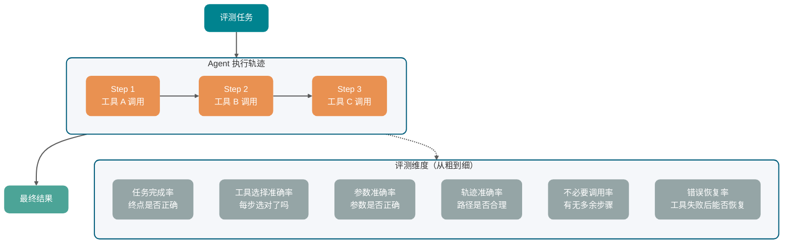
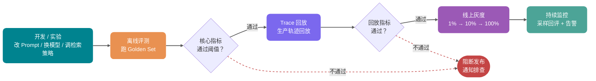

有个做智能客服的团队，花了三个月把 RAG 知识库从向量检索升级到混合检索，再加了一层 Reranker。上线前，工程师在本地测了几十条问题，感觉效果好了不少，于是就推了上线。

一周后，业务方反馈：“有些问题感觉还不如以前准。”

这句话最麻烦的地方，不是“效果变差了”，而是没人知道它到底有没有变差。旧版本质量是什么水平？新版本是哪类问题退步了？业务方说的“不如以前准”，是真退步，还是用户预期变高了？一查才发现，历史质量数据几乎没有。

很多 AI 应用早期都是这样：靠体感上线，靠体感判断好坏，靠体感决定改完之后是不是进步了。

这就像在黑盒里飞行。

这篇文章讲 AI 应用评测的完整闭环，主要包括：为什么公开 benchmark 替代不了自己的评测集；Golden Set 怎么构建；人工评测、规则评测、LLM-as-Judge 分别适合什么场景；LLM-as-Judge 的偏差和可靠用法；RAG、Agent、结构化输出、成本延迟、安全分别看哪些指标；以及离线评测、Trace 回放、线上灰度和 CI 自动回归怎么串起来。

说明一下：RAGAS、TruLens、LangSmith、Langfuse 等评测框架都在持续演进，生产系统要以官方文档最新说明为准。本文重点讲评测方法论和指标设计，不做工具横向测评，也不引用未经验证的 benchmark 数字。

## 为什么公开 benchmark 不够用？

很多团队选模型的方式很直接：打开某个评测榜单，找分数最高的，接进来用。

这个方法可以做粗筛，但用它判断“模型能不能做好我的业务”，经常靠不住。

公开 benchmark 优化的，不一定是你的数据分布。它通常使用固定数据集和固定任务类型，这些数据集上的排名，不一定能推断到真实用户行为。比如一个中文电商客服应用，用户问题高度集中在退换货流程、快递时效、促销规则、商品参数比较这些场景。选模型时只看英文推理榜，参考价值就很有限。

还有一个更隐蔽的问题：benchmark 数据通常比较干净，但生产数据不干净。真实用户输入里会有错别字、口语缩写、图文混排、多语言夹杂、前后矛盾的描述。模型在干净测试集上的表现，和它在真实脏数据里的表现，可能差很多。

业务里的失败模式也很特定。公开评测衡量的是平均能力，但业务真正敏感的往往不是平均分。

比如：

- 合同审查 AI：最重要的失败是漏掉高风险条款，不是平均流畅度低了 5%。
- 智能客服：最重要的失败是把退款流程说错，不是 BLEU 分数低了 0.03。
- 代码 Agent：最重要的失败是执行了危险命令，不是代码生成平均准确率低了几个点。

这类高权重失败，在通用 benchmark 里基本看不出来。

所以公开榜单可以用来排除明显不合适的模型，但决定一个模型能不能上你的业务，还是要靠自己的评测集。

## Golden Set 怎么构建？

Golden Set 是用来衡量 AI 应用质量的标准测试集。它的重点不是“样本很多”，而是每条样本都有明确输入，以及判断输出好坏的标准。

这个标准不一定是唯一正确答案。它可以是参考答案、评分维度、验证规则，也可以是一段人工判断说明。只要能让后续评测有一致标准，就有价值。

### 数据从哪来？

**第一类来源是生产日志分层采样。**

如果系统已经上线，生产日志通常是最有价值的数据源。采样时不要只取高频问题，因为高频问题往往是比较好处理的。真正容易出问题的，常常藏在低频、边缘和异常输入里。

建议重点看几类样本：用户点了“不满意”的，出现补充追问的，最后转人工的，以及那些看起来“差点失败”的边缘案例。

我遇到过一次，我们只从正常对话流里采样构建 Golden Set，结果漏掉了一类占生产流量 8% 的图文混排查询。这类查询的失败率比平均值高 3 倍，但在 Golden Set 里完全没有覆盖。后面连续两个版本所谓的“质量提升”，其实都是假提升。

**第二类来源是人工构造。**

新功能还没上线，或者某些高风险场景很少在日志里出现，就需要人工构造样本。

人工构造时至少覆盖三类：

- 正常路径样本：常见、结果清晰、能代表主要功能。
- 边缘样本：信息不完整、有歧义、跨场景混合。
- 对抗样本：故意让模型犯错，比如领域外问题、越权请求、Prompt 注入尝试。

**第三类来源是失败案例回填。**

上线后遇到的真实失败案例，是 Golden Set 最珍贵的补充来源。每次处理用户投诉时，都应该顺手问一句：这个案例能不能加进评测集？

失败案例回填能让 Golden Set 持续覆盖真实的模型软肋，而不是停留在最初构造时的主观想象里。

如果系统还没上线，也可以用合成数据做冷启动。比如先从知识库文档中生成一批问题、参考答案和难例，再由人工抽样审核后加入候选集。RAGAS 这类工具提供了测试集生成能力，适合帮你快速铺出第一版覆盖面。

但合成数据只能当辅助。它很容易继承生成模型自己的偏好，覆盖不到真实用户的脏输入和奇怪问法。真正用于发布门禁的 Golden Set，最终还是要被生产日志、失败案例和人工审核不断校准。

### 多少条够用？

这个问题没有绝对答案，但可以有工程上的起点。

少于 50 条的 Golden Set，统计方差会很大。模型输出的一点随机波动，就可能让你误判质量变化方向。

50 到 200 条，通常可以作为很多场景的起点。它能覆盖主要功能路径，跑一次评测的成本也还可控，结论基本有参考价值。随着业务扩展，再逐步扩大到 500 条以上。

不过，比总量更重要的是分布。200 条全是同一类问题，不如 100 条覆盖 10 类场景。

### 分层比总量更关键

| 分层       | 典型内容               | 建议占比 |
| ---------- | ---------------------- | -------- |
| 正常路径   | 高频、清晰的主流场景   | 50%      |
| 边缘场景   | 信息缺失、多义、跨领域 | 25%      |
| 对抗样本   | 模型容易犯错的特殊输入 | 15%      |
| 高权重失败 | 业务定义的关键失败类型 | 10%      |

“高权重失败”很容易被忽略，但往往是业务方最在意的。比如合规场景里漏识别风险条款，医疗场景里给出错误用药建议，即使它只占整体评测集的 10%，出一次问题也很严重。

### Golden Set 不是一次性资产

产品会迭代，用户会变化，原来的 Golden Set 也会过期。建议建立三个机制：

- 每季度审视一次：检查有没有新的常见场景没覆盖，也删除过时样本。
- 失败案例自动入库：线上出现新失败模式，经人工确认后加入评测集。
- 版本化管理：Golden Set 要有版本号，并和模型版本、Prompt 版本一起记录。没有版本号，跨版本对比没有意义。

## 三种评测方法

有了 Golden Set，下一步是选择评测方法。人工评测、规则评测、LLM-as-Judge 各有适用场景，实践里通常不是三选一，而是组合使用。

| 方法         | 准确性                 | 速度 | 成本 | 典型评测内容                                          | 典型使用场景                                                   |
| ------------ | ---------------------- | ---- | ---- | ----------------------------------------------------- | -------------------------------------------------------------- |
| 人工评测     | 最高                   | 慢   | 高   | 复杂语义判断、边界样本仲裁、业务风险判断              | Golden Set 初始标注、高风险场景最终校验、LLM-as-Judge 校准基准 |
| 规则评测     | 高（规则可描述范围内） | 最快 | 低   | JSON 格式、字段完整性、枚举值、数值边界、引用是否存在 | 格式校验、枚举字段、引用检查、数值边界                         |
| LLM-as-Judge | 中（受偏差影响）       | 快   | 中   | 答案相关性、事实忠实度、完整性、连贯性、语气是否合适  | 语义相关性、答案连贯性、事实忠实度、多维度综合打分             |

比较稳的组合是：规则评测做快速筛选，LLM-as-Judge 做语义判断，人工评测做标定和校验。它们不是竞争关系，而是不同层次的防线。

还有一条更重的路线：训练或微调专用 Judge。ARES 的思路就是先用合成数据训练轻量级 Judge，再用少量人工标注样本做 PPI（Prediction-Powered Inference）校准。它适合评测量很大、领域比较稳定、直接调用强模型做 Judge 成本太高的 RAG 系统。对大多数团队来说，可以先从通用 LLM-as-Judge 起步；当评测成本和一致性成为瓶颈，再考虑专用 Judge。

### 评测工具怎么选？

工具不要一上来就全接。先看你要解决的是哪类问题：

| 工具      | 更适合的环节               | 典型用途                                                                   |
| --------- | -------------------------- | -------------------------------------------------------------------------- |
| RAGAS     | RAG 指标评测               | Faithfulness、Response Relevancy、Context Precision、Context Recall 等指标 |
| TruLens   | RAG/LLM 应用观测与反馈函数 | Groundedness、Context Relevance、Answer Relevance 等质量反馈               |
| LangSmith | LangChain 应用开发闭环     | Dataset、Trace、实验对比、回归评测                                         |
| Langfuse  | 生产 Trace 和评分分析      | Trace 采样、人工评分、LLM-as-Judge、Score Analytics                        |

我的建议是：先把自己的 Golden Set、评分标准和版本记录跑通，再接工具。否则工具面板再漂亮，也只是把不稳定的评测流程可视化了一遍。

## LLM-as-Judge 怎么用才可靠？

LLM-as-Judge 的思路很简单：用一个通常更强的语言模型，去评判另一个模型的输出好不好。

它的优势是能评开放式回答，不需要把规则写死，成本也比人工低很多。但它有几个已知偏差，不处理的话，评测结果会失真。

### 两种模式

**Reference-based（有参考答案）**

评判时提供标准答案，让 Judge 模型比较生成答案和参考答案之间的差距。

```text
参考答案：退款申请应在收货后 7 天内提交，超期不受理。
模型回答：您需要在收货 7 天内提出退款申请，否则无法受理。

请对以下维度打分（1-5 分）：
- 事实准确性：模型回答与参考答案的事实是否一致？
- 完整性：参考答案中的关键信息是否都在模型回答中体现？
- 措辞清晰度：模型回答是否清楚易懂？
```

**Reference-free（无参考答案）**

不提供标准答案，直接让 Judge 评判回答本身的质量。它常用于创意写作、分析推理，或者参考答案本身很难确定的场景。

### 四类常见偏差与局限

**位置偏差（Position Bias）**

当你同时展示两个答案，让 Judge 选择哪个更好时，它可能偏向第一个或第二个答案，不一定完全基于质量判断。不同模型的倾向还不一样。

处理方式也简单：做两次评判，交换 A/B 顺序，取两次一致的结论；或者让 Judge 一次只评一个答案，不做直接对比。

**冗长偏差（Verbosity Bias）**

Judge 模型容易认为更长的答案质量更高，即使长度来自废话和重复。

处理方式是在 Judge Prompt 里明确写清楚：不考虑长度，只看信息质量。同时要在验证集上确认这条规则真的起作用。

**自我强化偏差（Self-Enhancement Bias）**

如果 Judge 模型和被评判模型来自同一家，甚至是同一个模型，可能会出现对同源输出更宽容的倾向。

这里要说得谨慎一点。MT-Bench 论文观察到 GPT-4 和 Claude-v1 对自己的输出有一定胜率偏好，但 GPT-3.5 没有同样表现；论文也明确说，因为数据量和差异有限，不能直接断定这是稳定的系统性偏差。

工程上可以保守处理：重要评测节点用不同厂商或不同模型族做交叉验证，再加入人工抽样复核。这样不是因为“同厂商一定不可信”，而是为了降低单一 Judge 偏好的影响。

**有限推理能力（Limited Reasoning Ability）**

LLM Judge 不等于验证器。评判数学、代码、SQL、复杂逻辑推理这类输出时，它可能被被评答案里的错误推导带偏，即使 Judge 自己单独解题时能做对。

这类场景最好使用 Reference-guided Judge：给 Judge 明确的参考答案、单元测试结果、SQL 执行结果或关键推理步骤，让它围绕可验证证据评分。MT-Bench 也提到，chain-of-thought judge 和 reference-guided judge 能缓解数学和推理题上的评分局限。换句话说，主观质量可以交给 Judge，客观正确性要尽量给它证据。

### Judge Prompt 怎么写？

很多 LLM-as-Judge 失败，不是模型不行，而是 Prompt 写得太含糊。Judge 不知道评分标准，只能凭感觉打分，最后每个答案都差不多，分数没有区分度。

一个比较实用的 Judge Prompt 模板：

```text
你是一个严格的评测员，负责评判 AI 助手的回答质量。

【用户问题】
{question}

【参考资料】（检索到的上下文，如果有）
{context}

【参考答案】（如果有，用于校准事实、数值、代码或推理正确性）
{reference_answer}

【AI 回答】
{answer}

请先按以下评估步骤检查回答，但最终只输出 JSON，不要展开完整推理过程：

Step 1：识别用户问题中的关键要求。
Step 2：对照参考资料和参考答案，检查回答中的事实断言是否有依据。
Step 3：判断回答是否直接回应问题，有没有遗漏关键要点。
Step 4：分别给每个维度打分。

请严格按照以下标准评判，每个维度独立打分，分值为 1-5 的整数：

1. 事实忠实度（Faithfulness）
   5 分：回答中所有事实断言均可在参考资料中找到依据
   3 分：大部分有依据，存在少量无法核实的推断
   1 分：包含与参考资料矛盾或无依据的事实断言

2. 答案相关性（Answer Relevance）
   5 分：直接回答了用户问题，没有不相关内容
   3 分：基本回答了问题，但有部分偏题
   1 分：未能回答用户实际问题

3. 完整性（Completeness）
   5 分：覆盖了回答这个问题所需的全部关键要点
   3 分：覆盖了主要要点，但遗漏了部分重要细节
   1 分：严重缺失关键信息

请按以下 JSON 格式输出，不要添加额外解释：
{"faithfulness": <分值>, "relevance": <分值>, "completeness": <分值>, "reasoning": "<一句话说明评分依据>"}
```

打分维度和说明越具体，Judge 的判断就越稳定，不同 Judge 之间的一致性也会更高。

G-Eval 的经验也可以借鉴：先让 Judge 按评估步骤检查，再用结构化表单输出分数，通常比“直接给分”更稳。这里的重点不是让模型写很长的推理链，而是把评估路径拆清楚。对于复杂、多约束、需要事实核验的任务，评估步骤很有价值；对于很简单的格式校验，或者你使用的是本身会进行内部推理的推理模型，显式步骤可能只是增加 token 成本。

## RAG 应用怎么评测？

RAG 的问题定位特别依赖分段评测。很多人看到最终答案质量差，第一反应是改 Prompt，改半天没效果，最后才发现是检索在拖后腿。

RAG 评测必须拆成两段：检索评测和生成评测。

```mermaid
flowchart LR
    Query["用户查询"]:::client
    Retrieval["检索层\n向量检索 / 混合检索"]:::business
    Context["检索结果\n候选段落"]:::external
    Generation["生成层\n模型 + Prompt"]:::gateway
    Answer["最终回答"]:::success

    Query --> Retrieval --> Context --> Generation --> Answer

    subgraph rMetrics["检索指标"]
        direction TB
        R1["Recall@k"]:::info
        R2["Hit Rate@k"]:::info
        R3["MRR"]:::info
        R4["Context Precision / Recall"]:::info
    end

    subgraph gMetrics["生成指标"]
        direction TB
        G1["Faithfulness（事实忠实度）"]:::info
        G2["Answer Relevance（答案相关性）"]:::info
        G3["Context Usage（上下文使用度）"]:::info
        G4["Noise Sensitivity（噪声敏感度）"]:::info
    end

    Retrieval -.-> rMetrics
    Generation -.-> gMetrics

    classDef client fill:#00838F,color:#FFFFFF,stroke:none,rx:10,ry:10
    classDef business fill:#E99151,color:#FFFFFF,stroke:none,rx:10,ry:10
    classDef gateway fill:#7B68EE,color:#FFFFFF,stroke:none,rx:10,ry:10
    classDef external fill:#607D8B,color:#FFFFFF,stroke:none,rx:10,ry:10
    classDef success fill:#4CA497,color:#FFFFFF,stroke:none,rx:10,ry:10
    classDef info fill:#95A5A6,color:#FFFFFF,stroke:none,rx:10,ry:10
    linkStyle default stroke-width:2px,stroke:#333333,opacity:0.8
    linkStyle 4,5 stroke-dasharray:5 5,opacity:0.8

    style rMetrics fill:#F5F7FA,stroke:#005D7B,stroke-width:2px,rx:10,ry:10
    style gMetrics fill:#F5F7FA,stroke:#005D7B,stroke-width:2px,rx:10,ry:10
```



### 检索指标

**Recall@k** 看前 k 个检索结果里，有多少比例的相关文档被召回。

```text
Recall@k = 被召回的相关文档数 / 总相关文档数
```

这个指标对“漏掉关键知识”很敏感。知识库问答里，Recall@3 或 Recall@5 是很常用的检索评测指标。

**Hit Rate@k** 看前 k 个结果里有没有至少一条相关文档。每条样本给 0 或 1，再取平均。

它适合快速评估，不关心有多少相关文档被召回，只关心有没有相关内容进入上下文。计算简单，也比较好解释。

**MRR（Mean Reciprocal Rank）** 看第一条相关文档排在第几位。排得越靠前，MRR 越高。

如果你的生成模型明显更依赖 Top 位置的文档，MRR 会更能反映检索质量。

| 指标              | 关注点                           | 适合场景                                     |
| ----------------- | -------------------------------- | -------------------------------------------- |
| Recall@k          | 召回覆盖率                       | 关键信息不能漏的场景，比如合规、法律、医疗   |
| Hit Rate@k        | 是否命中                         | 快速评估和阶段验证                           |
| MRR               | 相关结果排名                     | 模型重度依赖 Top-1 结果的场景                |
| Precision@k       | 精准率                           | 上下文 Token 预算紧张、需要高精准输入的场景  |
| Context Precision | 相关上下文是否排在前面           | 没有完整文档 ID 标注，但有问题、答案和上下文 |
| Context Recall    | 参考答案中的信息是否被上下文覆盖 | 标注文档级相关性太贵，但可以提供参考答案     |

前四个传统 IR 指标通常需要标注相关文档 ID。也就是说，每条问题要标注“哪些文档是这个问题的正确答案来源”，才能判断检索到底有没有命中。这也是 Golden Set 里最花时间的部分。

如果文档级标注成本太高，可以用 RAGAS 这类基于 LLM 的检索指标做起步方案。Context Precision 关注与答案相关的上下文是否排在更靠前的位置；Context Recall 关注参考答案中的声明，有多少能被检索上下文支持。它们不要求你为每个问题精确标出所有相关文档 ID，但会依赖 LLM 判断，所以仍然要做人工抽样校验。

还有一个容易混淆的点：RAGAS v0.1 里曾有 Context Utilization，它本质上是 Context Precision 的无参考答案版本，评的是“相关上下文在检索结果里的排序”，不是“生成模型有没有用好上下文”。如果你想评后者，建议换一个自定义名称，比如下面的 Context Usage。

### 生成指标

生成评测通常用 LLM-as-Judge，重点看下面几个维度。

**Faithfulness（事实忠实度）**

看模型回答里有没有超出检索结果范围的捏造。

这是 RAG 应用最重要的生成指标之一。如果回答里的事实都能从检索内容里找到依据，Faithfulness 就高；如果模型开始补充检索结果里没有的内容，Faithfulness 就低。RAGAS 也是类似思路：判断答案中的每个陈述能不能从上下文中推导出来。

**Answer Relevance / Response Relevancy（答案相关性）**

看回答有没有切中用户的问题。

它和 Faithfulness 不一样。一个回答可以完全忠实于检索内容，但没有回答用户真正问的问题。比如用户问“怎么退款”，模型只是转述了一段退货政策原文，没有提炼操作流程，这种就是相关性不足。

**Context Usage（上下文使用度，自定义指标）**

看检索到的内容有没有被有效利用。

这个指标可以反向诊断另一个问题：检索质量不错，但模型没用好检索结果。可能是上下文太长导致模型忽略中间内容，也可能是检索内容在 Prompt 里的位置不合理。关于 Lost-in-the-Middle 现象，可以看 [《万字拆解 LLM 运行机制》](./llm-operation-mechanism.md)。

注意，这里故意不用 Context Utilization 这个名字，避免和 RAGAS 历史版本里的同名指标混淆。这里评的是生成层有没有使用上下文，不是检索层的排序质量。

**Noise Sensitivity（噪声敏感度）**

看检索结果里混入不相关 chunk 时，回答质量会不会明显下降。

真实 RAG 系统很少只拿到“干净上下文”。只要 Top-k 稍微放大一点，就很容易混进半相关甚至无关内容。Noise Sensitivity 高，说明模型容易被噪声带偏；这时不一定要先换模型，可能更应该调分块、Reranker、上下文排序，或者在 Prompt 里强化“只使用相关资料”的约束。

### RAG 评测的两个常见陷阱

**陷阱一：用检索结果直接当标准答案。**

有人为了省标注成本，把检索到的文档直接当标准答案，再评估生成回答和这个“标准答案”的相似度。

这会混淆检索质量和生成质量。检索结果只是候选，不等于正确答案。这样算出来的分数，本质上是在评测“模型有没有复述检索结果”，不是在评测“模型有没有回答对问题”。

**陷阱二：只评最终答案，不分段。**

如果只看最终答案质量，你分不清问题来自检索还是生成。检索差和生成差，最终表现都可能是“回答不准”，但优化方向完全不同。分段评测不是可选项，是定位问题的基本前提。

## Agent 应用怎么评测？

Agent 评测比 RAG 更难。原因很简单：Agent 任务通常是多步骤的，最终结果不一定能反映中间过程是否正确。

一个任务最终完成了，但 Agent 可能走了一条错误路径，只是碰巧也到达终点。如果只看结果，下次换一个稍有变化的任务，同一个 Agent 可能直接挂掉，你也不知道为什么。



### 任务完成率

这是最直接的指标。把任务拆成若干可验证的完成标准，然后逐一检查。

比如“帮我发一封会议邀请邮件给团队”，完成标准可以是：

- 收件人包含团队成员列表中的所有人。
- 邮件主题包含“会议”相关关键词。
- 邮件正文包含会议时间和地点。
- 邮件已发送成功，工具调用返回成功状态。

```text
任务完成率 = 通过所有完成标准的任务数 / 总任务数
```

### 工具调用准确率

这是更细的指标，通常要拆开看：

- 工具选择准确率：Agent 有没有调用正确工具，有没有用错工具。
- 参数准确率：调用工具时，生成的参数是否正确。
- 不必要调用率：Agent 调用了哪些完全没必要的工具。

不必要调用率高，说明 Agent 在“瞎忙”。这不仅浪费成本，还会引入额外失败风险。

### 轨迹准确率

轨迹准确率比任务完成率更严格。它会把 Agent 实际执行的每一步工具调用和参数，与专家参考轨迹对比，计算实际轨迹和参考轨迹的相似度。

这需要预先标注：对这个任务，理想 Agent 应该怎么一步步做。成本确实高，但适合对行为路径有严格要求的场景，比如代码执行 Agent、财务操作 Agent、需要严格审计的场景。

### 错误恢复率

工具调用不一定成功。工具返回错误时，Agent 能不能识别问题、换一种方式重试，或者向用户说明情况？

```text
错误恢复率 = 工具失败后任务仍然完成的次数 / 工具失败总次数
```

这个指标反映 Agent 的鲁棒性。脆弱的 Agent，工具失败一次就蒙了；工程化做得好的 Agent，能从工具失败里恢复。关于工具调用失败设计，可以参考 [《大模型结构化输出详解》](./structured-output-function-calling.md) 中的工具调用安全章节。

## 结构化输出怎么评测？

结构化输出的评测相对机械，很适合用规则自动化，不一定需要 LLM-as-Judge。

主要看三层。

**格式合法率**：输出是不是合法 JSON？用 `JSON.parse()` 就能检测，不需要人工。

**Schema 通过率**：合法 JSON 里，有多少通过了你定义的 JSON Schema 校验？它主要检查字段完整性、类型、枚举范围。

**字段语义准确率**：通过 Schema 校验的输出里，核心业务字段值是否语义正确？比如分类字段有没有选对类别，置信度分值是否在合理范围内。

我的建议是拆到字段级评测，不要只看整体通过率。一个对象有 10 个字段，9 个字段正确，1 个字段错误。如果错的是关键字段，整体通过率再好看也没用。

## 完整评测指标体系

把上面各类指标汇总起来，可以得到一张参考表：

| 维度       | 指标                                  | 计算方式                      | 适用场景                        |
| ---------- | ------------------------------------- | ----------------------------- | ------------------------------- |
| 检索质量   | Recall@k                              | 相关文档召回比例              | RAG 知识库                      |
|            | Hit Rate@k                            | 是否至少命中一条              | RAG 快速验证                    |
|            | MRR                                   | 第一条相关结果的排名          | 强依赖 Top-1 的 RAG             |
|            | Precision@k                           | 结果精准率                    | Token 预算紧张场景              |
|            | Context Precision                     | 相关上下文是否排在前面        | RAGAS 类 LLM 检索评测           |
|            | Context Recall                        | 参考答案是否被上下文覆盖      | 缺少文档 ID 标注的早期 RAG 评测 |
| 生成质量   | Faithfulness                          | 答案是否忠于上下文            | RAG、事实型问答                 |
|            | Answer Relevance / Response Relevancy | 答案是否回答了问题            | 通用问答、客服                  |
|            | Completeness                          | 答案是否覆盖关键要点          | 政策解读、合规问答              |
|            | Context Usage                         | 生成是否有效使用检索上下文    | 检索好但回答仍不好的 RAG 诊断   |
|            | Noise Sensitivity                     | 噪声上下文是否干扰回答        | Top-k 较大、上下文混杂的 RAG    |
| 工具调用   | 工具选择准确率                        | 正确工具 / 总调用次数         | Agent                           |
|            | 参数准确率                            | 正确参数 / 总参数数           | Agent                           |
|            | 不必要调用率                          | 多余调用 / 总调用次数         | Agent 效率优化                  |
|            | 任务完成率                            | 完成任务 / 总任务数           | Agent E2E                       |
|            | 错误恢复率                            | 工具失败后完成 / 工具失败总数 | Agent 鲁棒性                    |
| 格式合规   | JSON 格式合法率                       | 合法 JSON / 总输出数          | 结构化输出                      |
|            | Schema 通过率                         | 通过校验 / 合法 JSON 数       | 结构化输出                      |
|            | 枚举准确率                            | 正确枚举 / 含枚举字段总数     | 分类、状态输出                  |
| 成本与延迟 | TTFT                                  | 首 Token 返回时间             | 流式输出体验                    |
|            | E2E Latency                           | 端到端完成时间                | 整体性能                        |
|            | Input / Output Tokens                 | Token 用量                    | 成本控制                        |
|            | 重试率                                | 重试次数 / 总请求数           | 稳定性诊断                      |
| 安全与合规 | 拒答率                                | 安全拒答 / 总请求数           | 内容安全                        |
|            | 幻觉率                                | 含幻觉输出 / 总输出           | 事实型问答                      |
|            | 格式遵循率                            | 遵守格式约束 / 总输出         | Prompt 质量                     |

不用一开始就把这些指标全跑起来。先根据应用类型选最关键的 3 到 5 个，保证这几个可信，再逐步扩展。

## 离线评测 → Trace 回放 → 线上灰度

单有 Golden Set 还不够。评测要形成闭环：开发阶段发现问题，发布前阻断回归，上线后持续监控。



### 离线评测

每次改 Prompt、换模型、调检索策略，上线前都应该跑一次 Golden Set，对比新旧版本核心指标。

这里有两个关键点。

第一，比的是相对变化，不只是绝对分数。比如 Faithfulness 从 0.82 降到 0.79，算不算回归？要提前定义阈值。

第二，评测结果要和变更内容一起记录。下次遇到类似问题，才能快速知道历史上发生过什么，而不是重新猜一遍。

### Trace 回放

Golden Set 覆盖不了所有生产场景。Trace 回放的思路是：从生产系统采样真实请求，包含原始输入和完整上下文，用新版本模型或 Prompt 重跑一遍，对比输出差异。

Trace 回放要求系统记录足够完整的上下文，比如检索到的文档、工具调用结果、当时的 Prompt 版本。如果这些信息没记录下来，所谓“回放”就只是用新 Prompt 处理旧问题，不是真正复现当时的执行环境。

关于 Trace 记录结构，可以参考 [《大模型 API 调用工程实践》](./llm-api-engineering.md) 中的观测章节，里面有更完整的日志字段设计。

### 线上灰度

灰度是最后一道门。新版本先接少量真实流量，再比较灰度组和对照组指标。

灰度阶段要解决一个实际问题：怎么评判灰度组输出？

- 结构化输出任务，可以用规则自动评测。
- 开放式回答，可以对灰度流量做 LLM-as-Judge 采样评测，每天跑一批。
- 用户真实反馈，比如满意率、追问率、转人工率，可以作为辅助指标。

一个比较实用的灰度阈值是：核心质量指标相对对照组下降超过 3%，就暂停扩量并排查原因。这个阈值不是银弹，具体还要看业务风险和样本量。

### 持续监控

灰度通过后，评测也不能停。生产数据分布会变，用户行为会变，知识库内容会更新，模型供应商也可能静默升级底层版本。

建议每天对生产流量做 3% 到 5% 的采样评测，核心指标连续 3 天下跌时触发告警。

## 接入 CI 的自动化回归

把离线评测接入 CI，是从“记得测”变成“必须测”的关键一步。

### 阈值怎么定？

**绝对阈值**：某个指标不能低于固定值。比如 Faithfulness 不得低于 0.75。它适合质量底线明确的场景。

**相对阈值**：相比上一个稳定版本，指标下降不能超过一定比例。比如任务完成率相比 baseline 下降不得超过 5%。它适合质量还在快速演进的早期阶段，不会把绝对分数锁得太死。

两者可以组合使用：绝对阈值守底线，相对阈值防退步。

### 速度和覆盖度怎么平衡？

CI 里跑 500 条 LLM-as-Judge 评测，可能要 10 到 30 分钟。太慢的话，开发者就会想办法绕过 CI。

实践里可以分层：

- 核心 Golden Set（50 条以内）：每次 PR 都跑，用规则和快速 LLM-as-Judge，尽量 3 分钟以内出结果。
- 完整 Golden Set（200 条以上）：合并到主分支时跑，或者每天定时跑。
- Trace 回放（1000 条以上）：每周跑，或者重大发布前跑，可以并发加速。

### Java 后端评测记录结构

```java
// 评测运行记录
public record EvalRecord(
        String evalId,            // 本次评测运行 ID
        String promptVersion,     // Prompt 版本，关联 Prompt 仓库
        String modelId,           // 模型 ID，例如 gpt-4o-2024-08-06
        String datasetVersion,    // Golden Set 版本号
        String inputHash,         // 输入 hash，方便跨版本对比同一条用例
        String rawInput,          // 原始输入
        String referenceOutput,   // 参考答案（如果有）
        String actualOutput,      // 模型实际输出
        Map<String, Double> scores,    // 各维度分数，key 为维度名
        String judgeModel,        // LLM-as-Judge 使用的模型
        String judgeReasoning,    // Judge 的评分依据（便于复核）
        Instant evaluatedAt,      // 评测时间
        String gitCommit          // 对应的代码提交 SHA
) {}

// 评测运行汇总
public record EvalRunSummary(
        String runId,
        String promptVersion,
        String modelId,
        String datasetVersion,
        int totalCases,
        Map<String, Double> avgScores,       // 各维度平均分
        Map<String, Double> passRates,       // 各维度通过率（超过阈值的比例）
        Map<String, Double> baselineScores,  // 上一稳定版本的分数，用于对比
        boolean passedRegression,            // 是否通过回归检测
        List<String> regressionDetails,      // 退步的维度和幅度
        Instant startedAt,
        Instant completedAt
) {}
```

这个结构能支持几件事：

- 版本对比：相同 `inputHash` 的不同 `promptVersion` 可以直接对比。
- 指标趋势：按 `evaluatedAt` 统计各维度变化，画出质量趋势图。
- 回归定位：某个 `gitCommit` 引入了哪些指标下降，可以按维度排查。

## 面试问题

### 1. 为什么不能只靠公开 benchmark 评估 AI 应用质量？

公开 benchmark 使用干净的通用数据，而业务数据有自己的领域分布和关键失败模式。benchmark 衡量平均能力，业务往往对特定失败更敏感。另外 benchmark 也可能被模型过拟合，不能准确反映真实业务场景。更稳的做法是用公开 benchmark 做粗筛，再用自己的 Golden Set 做业务验证。

### 2. Golden Set 应该怎么构建？

来源通常有三类：生产日志分层采样，尤其关注有负反馈信号的请求；人工构造，覆盖正常路径、边缘场景和对抗样本；上线后失败案例回填。系统冷启动时可以用合成数据辅助铺覆盖面，但要人工抽样审核，不能替代真实日志和失败案例。规模可以从 50 到 200 条起步，按正常路径 50%、边缘场景 25%、对抗样本 15%、高权重失败 10% 分层。Golden Set 要版本化管理，每季度审视一次覆盖度。

### 3. LLM-as-Judge 有哪些主要偏差，怎么缓解？

主要有四类问题：位置偏差，模型偏向某个展示位置的答案；冗长偏差，模型容易认为更长答案更好；自我强化偏差，同源模型可能对自己的输出更宽容，但论文证据并不充分；有限推理能力，Judge 在数学、代码、SQL 和复杂逻辑题上可能被错误答案带偏。缓解方式包括：A/B 对比时交换顺序取一致结论；Prompt 里明确说明不考虑长度；重要节点使用不同模型交叉验证；对客观正确性任务提供参考答案、测试结果或执行结果；定期用人工抽样校准评分标准。

### 4. RAG 评测为什么必须分检索和生成两段？

检索质量差和生成质量差，最终表现可能都是答案不好，但修复方向完全不同。检索差要改分块策略、向量库、混合检索权重；生成差要改 Prompt、模型或上下文注入方式。只看 E2E 结果，很难定位问题来自哪里，优化容易跑偏。

### 5. Agent 评测为什么比 RAG 更复杂？

Agent 是多步骤任务，最终结果成功不代表中间路径正确。它可能通过错误路径碰巧完成任务，但换一个稍有变化的任务就失败。因此 Agent 评测除了任务完成率，还要看工具选择准确率、参数准确率、不必要调用率和轨迹评测，才能定位具体哪一步出了问题。

### 6. 离线评测、Trace 回放、线上灰度分别解决什么问题？

离线评测用 Golden Set 在发布前做快速回归，发现明显质量退步。Trace 回放用真实生产轨迹重跑，发现离线测试集覆盖不到的场景问题。线上灰度用小流量接受真实用户验证，发现数据分布变化和边缘场景问题。三者覆盖阶段不同，不能互相替代。

### 7. CI 里的评测如何平衡速度和覆盖度？

可以分层设计。每次 PR 跑 50 条以内的核心 Golden Set，控制在 3 分钟以内，用规则和快速 LLM-as-Judge。完整 Golden Set 在合并主分支或每天定时跑。Trace 回放每周或发布前跑，可以并发加速。在核心指标上设置绝对底线和相对 baseline，超过阈值就阻断发布。

### 8. 如果 LLM-as-Judge 和人工评测结果不一致怎么办？

先分析不一致样本，找出 Judge 在哪类情况下偏差最大。常见原因是 Judge Prompt 里的评分维度不够清楚，导致它对边界样本的判断和人工不一致。修复方式是用这些不一致样本重新校准 Judge Prompt 的打分说明，直到在这类样本上和人工判断的一致率达到可接受水平，通常目标是 80% 以上。

## 总结

没有自己的评测集，就很难有上线信心。公开 benchmark 可以做粗筛，但替代不了基于自己业务数据的评测。靠体感判断 AI 应用质量，是最容易踩的坑之一。

Golden Set 的价值在分布，不只在总量。边缘样本、对抗样本和业务高权重失败类型，往往决定你有没有足够信心上线。200 条覆盖 10 类场景，通常比 500 条同类问题更有用。

LLM-as-Judge 可以把评测规模做起来，但偏差一定要管。Prompt 写得越具体，偏差越可控；复杂评测要给 Judge 明确步骤，客观正确性任务要给参考答案或可验证证据，人工抽样校准不能省。

RAG 和 Agent 都要分段评测。检索问题用检索指标，生成问题用生成指标；RAGAS 这类 LLM 指标可以降低早期标注成本，但需要人工抽样校验。Agent 要看工具调用和执行轨迹。不分段，优化方向很容易跑偏。

最后，评测要形成闭环。离线 Golden Set 阻断回归，Trace 回放覆盖真实场景，线上灰度验证真实用户，CI 保证每次变更都经过评测。Prompt 版本、模型版本、数据集版本和评测分数也要对齐记录，否则历史数据只是一堆孤立数字。

AI 应用不是上线那一刻才需要评测，而是从第一次改 Prompt、第一次换模型、第一次调检索参数开始，就应该进入评测体系。

## 参考资料

- [RAGAS 官方文档](https://docs.ragas.io/)
- [RAGAS 可用指标列表](https://docs.ragas.io/en/latest/concepts/metrics/available_metrics/)
- [RAGAS Context Utilization 文档](https://docs.ragas.io/en/v0.1.21/concepts/metrics/context_utilization.html)
- [TruLens 官方文档](https://www.trulens.org/)
- [LangSmith 评测功能文档](https://docs.smith.langchain.com/)
- [Langfuse Evaluation Scores 文档](https://langfuse.com/docs/evaluation/scores/overview)
- [MT-Bench 论文：Judging LLM-as-a-Judge with MT-Bench and Chatbot Arena](https://arxiv.org/abs/2306.05685)
- [ARES 论文：An Automated Evaluation Framework for Retrieval-Augmented Generation Systems](https://arxiv.org/abs/2311.09476)
- [OpenAI Evals 框架](https://github.com/openai/evals)
- [G-Eval 论文：NLG Evaluation using GPT-4 with Better Human Alignment](https://arxiv.org/abs/2303.16634)
