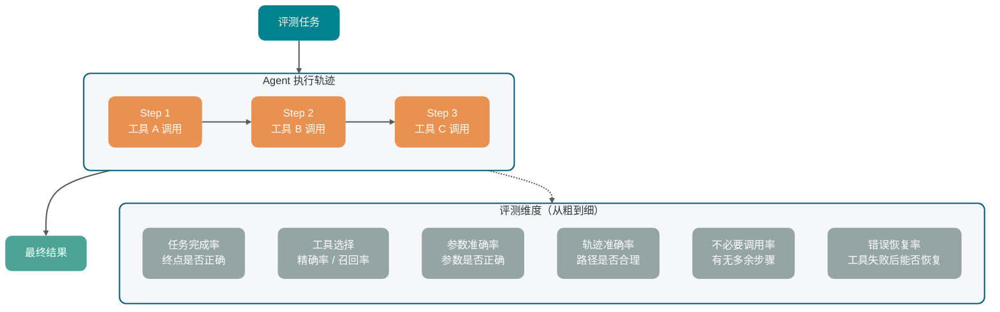
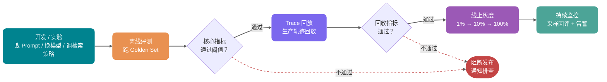

客服 RAG 升级混合检索和 Reranker 后，最容易出现的上线判断是：本地挑几十条问题跑一遍，答案比旧版顺，就觉得可以放量。

如果放量一周后业务方只反馈“有些问题感觉还不如以前准”，排查会立即卡住。

这时需要回看同一批场景的历史结果：旧版本在退换货、物流查询、商品参数对比上的命中率分别是多少，新版本又是从哪一类问题开始退步的。没有这份基线，“不如以前准”既可能是质量回退，也可能只是用户预期变化；排查最终只能回到原始对话里逐条翻找。

模型选择、Prompt 调整、检索优化和灰度发布会因此失去共同的比较口径。评测集的作用，就是把这些改动放到同一把尺子下比较。

RAGAS、TruLens、LangSmith、Langfuse 等框架仍在持续演进，生产接入应以各自的最新官方文档为准。本文只讨论评测方法和指标设计，不做工具横向测评，也不引用未经验证的 benchmark 数字。

## 为什么公开 benchmark 不够用？

公开 benchmark 可以先用来筛掉明显不合适的模型，比如中文能力弱、上下文窗口不够、工具调用能力达不到业务要求的候选项。

但把榜单分数直接当上线依据，就会漏掉业务里的关键问题。

榜单的任务和数据集是固定的，排名不能直接代替业务验证。电商客服里常见的是退换货、快递时效、促销规则和商品参数比较；英文推理题的高分无法说明模型会按这些业务规则作答。

真实请求还会带来错别字、口语缩写、截图、多语言和前后矛盾等输入。干净测试集上的表现，往往覆盖不到这些情况。

上线前尤其要单独检查少数不能出错的路径：合同审查漏掉高风险条款会影响签署判断，客服答错退款流程会让用户按错路径提交材料，代码 Agent 执行危险命令则会影响仓库和运行环境。此类失败即使占比很低，也可能被平均分掩盖；通用 benchmark 通常不会把它们凸显出来。

公开榜单可以排除明显不合适的模型。一个模型能不能接进自己的业务，还是要靠自己的评测集来判断。

## 一条评测用例里有什么？

一条评测用例要落到可验证的问题上：给定一个输入，系统应该完成什么，完成标准是什么。

单轮问答场景比较简单。输入是一段用户问题，输出是一段模型回答，评分器检查它是否准确、完整、相关。

Agent 场景会复杂很多。它可能多轮思考、调用工具、修改外部状态，最后还会留下完整执行过程。几个对象会反复出现：

| 概念               | 含义                                                 | 例子                                             |
| ------------------ | ---------------------------------------------------- | ------------------------------------------------ |
| Task               | 一条评测任务，包含输入和成功标准                     | “修复空密码绕过登录校验的问题”                   |
| Trial              | 同一条任务的一次运行                                 | 同一个 Agent 对同一条任务跑第 3 次               |
| Grader             | 对输出或过程打分的评分器                             | 单元测试、JSON Schema、LLM-as-Judge、人工复核    |
| Transcript / Trace | 一次运行的完整记录                                   | 用户输入、模型回复、工具调用、参数、返回值、耗时 |
| Outcome            | 任务结束后的真实状态                                 | 代码测试通过、退款单创建成功、数据库状态更新     |
| Eval Harness       | 负责跑任务、记录过程、调用评分器、汇总结果的工程骨架 | 本地脚本、评测平台、Claude Code 搭出来的评测流程 |

排查问题时，这几个对象最好分开看。

比如一个客服 Agent 最后回复“退款已经处理”，这只是 Transcript 里的最终回复。要看的 Outcome 是退款单有没有创建、状态有没有更新、金额有没有算对。如果只评最终文本，很容易把“说得像成功了”误判成“真的成功了”。

再比如一个 Coding Agent 最后测试通过了，也不代表过程完全没问题。它可能反复试错十几次，或者顺手改了不该改的文件。Trace 会让失败样本不只留下一个分数，还留下工具选择、参数构造、上下文理解和评分器规则的证据。

## Golden Set 怎么构建？

Golden Set 可以理解成 AI 应用自己的标准测试集。它不是靠数量堆起来的，关键是每条样本都要有明确输入，以及判断输出好坏的标准。

这个标准不一定是唯一正确答案。它可以是参考答案、评分维度、验证规则，也可以是一段人工判断说明。只要后续评测能按同一个口径执行，它就有价值。

### 数据从哪来？

**生产日志分层采样。**

系统已经上线时，生产日志通常是最有价值的数据源。采样时不要只取高频问题，因为高频问题往往已经被产品和 Prompt 优化过。低频、边缘和异常输入更容易暴露系统短板。

建议重点看几类样本：用户点了“不满意”的，出现补充追问的，最后转人工的，以及那些看起来“差点失败”的边缘案例。

如果只从正常对话流里采样，Golden Set 很容易漏掉图文混排、跨意图追问、用户描述前后矛盾这类样本。后续版本看起来通过率提高了，实际上可能只是“测试集里没有那类问题”。

**人工构造。**

新功能尚未产生日志时，退款越权、Prompt 注入等风险又很少自然出现，测试集缺失的部分要由人工写入。

人工构造时不要只写“正常问题”。第一版样本里至少要有这三类：

- 把“7 天内未拆封能否退货”这类问题收进正常路径，答案口径明确，适合先校验主流程。
- 用户只说“东西坏了”时，订单、时间和故障细节都缺失，预期行为应是先追问。
- 另外准备绕过退款规则和要求代码 Agent 执行越权命令的请求，检查系统的对抗处理。

**失败案例回填。**

每次处理用户投诉，都值得判断这个案例能否转成评测用例。经确认的失败样本回填后，Golden Set 才会随模型暴露出的薄弱点更新，而不会停在最初的主观设想上。

冷启动可以把知识库文档作为种子，生成问题、参考答案和难例。经人工抽样审核后，这些内容再进入候选集；RAGAS 等工具可以承担生成环节。

这类样本只负责补足初始覆盖面，不能直接用作发布门禁。生成的问题通常较规整，错别字、截图描述、前后矛盾和非常规追问仍需通过日志、失败案例和人工审核补上。

### 无法穷举 Case，怎么扩展覆盖？

真实请求和上下文组合不可能穷举。扩展测试集时，应从已经确认的任务出发，改变那些可能影响结果的条件：

- 输入扰动：增加错别字、口语缩写、语序变化、多语言表达和缺失信息。
- 上下文扰动：调整无关材料的位置，加入过期信息或冲突信息，改变历史对话长度。
- 工具扰动：模拟超时、限流、空结果、字段缺失、部分成功和第三方接口返回格式变化。
- 状态扰动：改变权限、订单状态、文件残留、缓存命中和时间条件，观察 Agent 是否仍能按规则处理。

这类方法可以按蜕变测试（Metamorphic Testing）的思路来写断言：不必为每个变体都准备一段唯一答案，而是规定输入变化前后应该保持什么关系。比如，加入一段无关上下文不应改变最终结论；缺少订单号时应先追问；权限被撤销后必须停止写操作；同一个任务改成同义问法，最终 Outcome 应保持一致。

扩展出来的样本还要留一部分作为保留集，不参与 Prompt 调整、示例选择和规则调参。否则团队会逐渐记住已有 Case，却不知道系统对新表达、新上下文和新故障是否仍然有效。

### 多少条够用？

这个问题没有固定答案，可以先按工程阶段定一个起点。

第一版可以先用 20 到 50 条真实任务验证评测流程。这一数量只是启动用的工程样本，无法支持统计结论；需要发布门禁时，再根据风险、基线方差和最小可接受差异计算样本量。无论规模多大，“什么算完成”都要先写成可重复执行的检查项。

第一版 eval 可以先纳入真实失败样本、手工测试样本和高风险路径，不必等待数据集完全成型；Anthropic 的 Agent eval 实践也采用这一思路。

用于发布门禁的样本，先要覆盖主要功能路径和高风险场景。之后按分层结果观察基线方差和可接受误差，再计算需要多少条；离开具体业务，50、200、500 都只是数字，不能直接当门槛。

样本分布往往比总量更先决定评测能否发现问题。200 条同类问题不如 100 条覆盖 10 类场景。

Agent 场景还要看 Trial 数量。同一条任务跑一次成功，不代表稳定可用。客服、支付、退款、合规这类场景，更适合对关键任务重复运行多次，观察“至少一次成功”和“连续成功”的差异。前者反映能力上限，后者更接近生产稳定性。

### 分层比总量更关键

| 分层       | 典型内容               | 取样原则                                   |
| ---------- | ---------------------- | ------------------------------------------ |
| 正常路径   | 高频、清晰的主流场景   | 按真实流量分布取样，保证主要功能都有覆盖   |
| 边缘场景   | 信息缺失、多义、跨领域 | 对历史失败和容易混淆的输入提高采样权重     |
| 对抗样本   | 模型容易犯错的特殊输入 | 按攻击面和权限风险设计，不依赖自然流量出现 |
| 高权重失败 | 业务定义的关键失败类型 | 单独设置门禁，不能被大量正常样本的均值稀释 |

高权重失败样本数量可以少，发布门禁里要单独看。合规场景漏识别风险条款、医疗场景给出错误用药建议，即使在总评测集中占比不高，也可能足以暂停发布。

### Golden Set 不是一次性资产

产品会迭代，用户会变化，原来的 Golden Set 也会过期。维护时可以直接盯三件事：

- 覆盖度复查：每季度看一遍新场景、过期规则和已经失效的样本。
- 失败样本回流：线上出现新失败模式，经人工确认后加入评测集。
- 版本记录：Golden Set、模型版本、Prompt 版本一起保存，否则跨版本对比会失真。

## 三种评测方法

Golden Set 准备好之后，要决定谁来评分。人工评测、规则评测、LLM-as-Judge 不是替代关系，更多时候是分工关系。


| 方法         | 准确性                     | 速度 | 成本 | 典型评测内容                                          | 典型使用场景                                                   |
| ------------ | -------------------------- | ---- | ---- | ----------------------------------------------------- | -------------------------------------------------------------- |
| 人工评测     | 高（依赖标注规范与一致性） | 慢   | 高   | 复杂语义判断、边界样本仲裁、业务风险判断              | Golden Set 初始标注、高风险场景最终校验、LLM-as-Judge 校准基准 |
| 规则评测     | 高（规则可描述范围内）     | 最快 | 低   | JSON 格式、字段完整性、枚举值、数值边界、引用是否存在 | 格式校验、枚举字段、引用检查、数值边界                         |
| LLM-as-Judge | 中（受偏差影响）           | 快   | 中   | 答案相关性、事实忠实度、完整性、连贯性、语气是否合适  | 语义相关性、答案连贯性、事实忠实度、多维度综合打分             |

格式、枚举、引用缺失这类硬错误，先交给规则评测拦住。开放式语义判断再交给 LLM-as-Judge，高风险样本和边界样本保留人工复核，用来校准 Judge 的口径。

能写成明确验收条件的问题，优先做是/否判断，而且一次只检查一个条件。例如“是否先完成身份校验”“引用是否支持这条事实”“是否修改了范围外文件”。这类结果比一个含义模糊的 82 分更容易进入发布门禁，也更方便定位失败原因。

分数适合保留给连贯性、表达质量、完整度这类连续维度，但每个分档都要有可观察的锚点。高风险条件不能被平均分抵消：退款结果错误时，即使语气、完整性和用户体验得分都很高，这条任务仍应判定失败。

生产排查不能只留下一个总分。每条结果至少应能回答“是否通过、错在哪里、判断有多确定”：

- `pass/fail`：这条样本是否通过。
- `score`：某个维度的分值，方便版本对比。
- `reason`：一句简短判定依据，方便人工复核。
- `category`：问题现象分类，比如格式错误、事实错误、工具未调用、过度承诺。
- `confidence`：评分器对自己判断的置信信号，低置信样本可以进入人工复核。这个值不等于真实正确概率，使用前要拿人工标注集校准。

这样筛 Badcase 时可以先按现象定位候选模块，不必从头阅读每条失败记录。

ARES 的做法是先用合成数据训练轻量级 Judge，再结合一小批域内人工标注，通过 PPI（Prediction-Powered Inference）估计 RAG 系统质量的置信区间。当评测量较大、持续调用强模型的成本已经限制评测规模时，这是一条可选路线。它仍需要域内语料、少量示例和人工验证集，不是零标注方案。

多数团队先使用通用 LLM-as-Judge 即可；只有成本或一致性成为持续瓶颈时，再为特定领域训练 Judge。

## 评测工具怎么选？

工具不要一上来就全接。先看你要解决的是哪类问题：

| 工具      | 更适合的环节               | 典型用途                                                                   |
| --------- | -------------------------- | -------------------------------------------------------------------------- |
| RAGAS     | RAG 指标评测               | Faithfulness、Response Relevancy、Context Precision、Context Recall 等指标 |
| TruLens   | RAG/LLM 应用观测与反馈函数 | Groundedness、Context Relevance、Answer Relevance 等质量反馈               |
| LangSmith | LLM / Agent 开发与生产闭环 | Dataset、Trace、离线实验、线上评测、回归测试                               |
| Langfuse  | 生产 Trace 和评分分析      | Trace 采样、人工评分、LLM-as-Judge、Score Analytics                        |

先把 Golden Set、评分标准和版本记录固定下来，再接入平台跑批和展示。否则 RAGAS、LangSmith 或 Langfuse 的面板只会把尚未稳定的评测流程原样呈现出来。

## LLM-as-Judge 怎么用才可靠？

LLM-as-Judge 就是让一个通常更强的模型去评判另一个模型的输出。

它适合评开放式回答，不需要把所有规则写成 if/else，成本也比人工低很多。问题在于，Judge 模型也会有偏差，不能把它当成绝对裁判。

### 两种模式

**Reference-based（有参考答案）**

有参考答案时，Judge 的任务会收窄很多。它要对照标准答案核查事实、边界条件和遗漏项，而不是只凭回答是否顺口来给分。

```text
参考答案：退款申请应在收货后 7 天内提交，超期不受理。
模型回答：您需要在收货 7 天内提出退款申请，否则无法受理。

请对以下维度打分（1-5 分）：
- 事实准确性：模型回答与参考答案的事实是否一致？
- 完整性：参考答案中的关键信息是否都在模型回答中体现？
- 措辞清晰度：模型回答是否清楚易懂？
```

**Reference-free（无参考答案）**

Reference-free 不拿标准答案做对照，Judge 只能依据用户问题、上下文约束和评分标准判断回答是否合格。创意写作、分析类问题，或者参考答案无法收敛到唯一版本时会用这种方式；事实型业务问答最好尽量补上资料、规则或人工判定口径。

### 四类常见偏差与局限

**位置偏差（Position Bias）**

A/B 对比里，答案的展示顺序也会影响 Judge。两个答案质量接近时，有些模型会更容易选第一个，有些模型会偏向后出现的那个。

处理方式是做两次评判，交换 A/B 顺序，取两次一致的结论；或者让 Judge 一次只评一个答案，不做直接对比。

**冗长偏差（Verbosity Bias）**

Judge 模型容易把更长的答案判得更好，即使长度来自废话和重复。

可以把两类答案直接放进校准集：一条反复粘贴政策原文，另一条只保留时间、条件和例外。Judge 若仍偏向前者，说明 Prompt 里的“避免冗长”没有实际约束力。

**自我强化偏差（Self-Enhancement Bias）**

如果 Judge 模型和被评判模型来自同一家，甚至是同一个模型，可能会对同源输出更宽容。

MT-Bench 的实验中，GPT-4 和 Claude-v1 对自身输出表现出一定胜率偏好，GPT-3.5 则没有相同结果。论文同时指出数据量和差异有限，不能据此认定存在稳定的系统性偏差。

重要评测节点可以交叉使用不同厂商或模型族的 Judge，并保留人工抽样复核，避免结论依赖单一模型偏好。

**有限推理能力（Limited Reasoning Ability）**

数学、代码、SQL 和复杂逻辑推理的正确性不能只交给 LLM Judge。被评答案中的错误推导可能影响它的判断，即使该模型单独解题时能够得到正确结果。

这类场景最好使用 Reference-guided Judge：给 Judge 明确的参考答案、单元测试结果、SQL 执行结果或关键推理步骤，让它围绕可验证证据评分。MT-Bench 也提到，chain-of-thought judge 和 reference-guided judge 能缓解数学和推理题上的评分局限。主观质量可以交给 Judge，客观正确性要尽量给它证据。

### Judge Prompt 怎么写？

很多 LLM-as-Judge 失败，问题出在 Prompt 写得太含糊。Judge 不知道评分标准，只能凭感觉打分，最后每个答案都差不多，分数拉不开。

一个比较实用的 Judge Prompt 模板：

```text
你是一个严格的评测员，负责评判 AI 助手的回答质量。

【用户问题】
{question}

【参考资料】（检索到的上下文，如果有）
{context}

【参考答案】（如果有，用于校准事实、数值、代码或推理正确性）
{reference_answer}

【AI 回答】
{answer}

评分前先完成这些检查，但最终只输出 JSON，不要展开完整推理过程：

- 提取用户问题里的硬性要求和隐含约束。
- 对照参考资料和参考答案，检查回答中的事实断言是否有依据。
- 检查回答是否覆盖关键要点，有没有混入无关内容。
- 按下面三个维度分别给 1-5 的整数分。

请严格按照以下标准评判，每个维度独立打分，分值为 1-5 的整数：

1. 事实忠实度（Faithfulness）
   5 分：回答中所有事实断言均可在参考资料中找到依据
   3 分：大部分有依据，存在少量无法核实的推断
   1 分：包含与参考资料矛盾或无依据的事实断言

2. 答案相关性（Answer Relevance）
   5 分：直接回答了用户问题，没有不相关内容
   3 分：基本回答了问题，但有部分偏题
   1 分：未能回答用户实际问题

3. 完整性（Completeness）
   5 分：覆盖了回答这个问题所需的全部关键要点
   3 分：覆盖了主要要点，但遗漏了部分重要细节
   1 分：严重缺失关键信息

请按以下 JSON 格式输出，不要添加额外解释：
{"faithfulness": <分值>, "relevance": <分值>, "completeness": <分值>, "reasoning": "<一句话说明评分依据>"}
```

清晰的维度、分档标准和反例通常有助于减少 Judge 凭感觉打分。是否真的更稳定，仍要用人工校准集检查一致率、分维度误差和边界样本，不能只看 Prompt 是否写得足够长。

如果 Judge 缺少足够证据，最好允许它输出 `Unknown` 或 `needs_human_review`，不要逼它硬判。尤其是财务、法律、医疗、赔付、账号安全这类场景，低置信样本进入人工复核，比让 Judge 编一个看似确定的结论更可靠。

G-Eval 把 chain-of-thought 与 form-filling 结合起来完成 NLG 评测。工程实现可以借鉴它先生成评估步骤、再按结构化表单打分的思路；对外保存评分时，保留分数和简短依据即可，不必把完整推理过程写进结果。

复杂、多约束、需要事实核验的任务适合这样做。简单格式校验，或者本身会进行内部推理的推理模型，显式步骤可能只是增加 token 成本。

## RAG 应用怎么评测？

RAG 出问题时，最终表现常常只有一句“答案不准”。但修复入口取决于问题发生在哪一段：关键资料没有被召回，改 Prompt 很难救；资料已经进了上下文，模型却没用上，继续调向量库也解决不了。

所以 RAG 评测通常先拆两张账：检索层看相关内容有没有进上下文，生成层看模型有没有基于这些内容回答。


```mermaid
flowchart LR
    Query["用户查询"]:::client
    Retrieval["检索层\n向量检索 / 混合检索"]:::business
    Context["检索结果\n候选段落"]:::external
    Generation["生成层\n模型 + Prompt"]:::gateway
    Answer["最终回答"]:::success

    Query --> Retrieval --> Context --> Generation --> Answer

    subgraph rMetrics["检索指标"]
        direction TB
        R1["Recall@k"]:::info
        R2["Hit Rate@k"]:::info
        R3["MRR"]:::info
        R4["Context Precision / Recall"]:::info
    end

    subgraph gMetrics["生成指标"]
        direction TB
        G1["Faithfulness（事实忠实度）"]:::info
        G2["Answer Relevance（答案相关性）"]:::info
        G3["Context Usage（上下文使用度）"]:::info
        G4["Noise Sensitivity（噪声敏感度）"]:::info
    end

    Retrieval -.-> rMetrics
    Generation -.-> gMetrics

    classDef client fill:#00838F,color:#FFFFFF,stroke:none,rx:10,ry:10
    classDef business fill:#E99151,color:#FFFFFF,stroke:none,rx:10,ry:10
    classDef gateway fill:#7B68EE,color:#FFFFFF,stroke:none,rx:10,ry:10
    classDef external fill:#607D8B,color:#FFFFFF,stroke:none,rx:10,ry:10
    classDef success fill:#4CA497,color:#FFFFFF,stroke:none,rx:10,ry:10
    classDef info fill:#95A5A6,color:#FFFFFF,stroke:none,rx:10,ry:10
    linkStyle default stroke-width:2px,stroke:#333333,opacity:0.8
    linkStyle 4,5 stroke-dasharray:5 5,opacity:0.8

    style rMetrics fill:#F5F7FA,stroke:#005D7B,stroke-width:2px,rx:10,ry:10
    style gMetrics fill:#F5F7FA,stroke:#005D7B,stroke-width:2px,rx:10,ry:10
```

### 检索指标

**Recall@k** 看前 k 个检索结果里，有多少比例的相关文档被召回。

```text
Recall@k = 被召回的相关文档数 / 总相关文档数
```

这个指标对“漏掉关键知识”很敏感。知识库问答里经常会看 Recall@3 或 Recall@5。

**Hit Rate@k** 看前 k 个结果里有没有至少一条相关文档。每条样本给 0 或 1，再取平均。

它适合快速评估，不关心有多少相关文档被召回，只关心有没有相关内容进入上下文。计算简单，也好解释。

**MRR（Mean Reciprocal Rank）** 看第一条相关文档排在第几位。排得越靠前，MRR 越高。

如果生成模型明显更依赖 Top 位置的文档，MRR 更能反映检索质量。

| 指标              | 关注点                           | 适合场景                                     |
| ----------------- | -------------------------------- | -------------------------------------------- |
| Recall@k          | 召回覆盖率                       | 关键信息不能漏的场景，比如合规、法律、医疗   |
| Hit Rate@k        | 是否命中                         | 快速评估和阶段验证                           |
| MRR               | 相关结果排名                     | 模型重度依赖 Top-1 结果的场景                |
| Precision@k       | 精准率                           | 上下文 Token 预算紧张、需要高精准输入的场景  |
| Context Precision | 相关上下文是否排在前面           | 没有完整文档 ID 标注，但有参考答案或生成回答 |
| Context Recall    | 参考答案中的信息是否被上下文覆盖 | 标注文档级相关性太贵，但可以提供参考答案     |

前四个传统 IR 指标通常需要标注相关文档 ID。也就是说，每条问题要标出“哪些文档是这个问题的正确答案来源”，才能判断检索有没有命中。这也是 Golden Set 里最花时间的部分。

文档级标注成本太高时，可以先用 RAGAS 这类基于 LLM 的检索指标起步。Context Precision 关注相关上下文是否排在更靠前的位置：有参考答案时可据此判断 chunk 相关性，无参考答案的变体则会拿生成回答作比较。Context Recall 关注参考答案中的声明，有多少能被检索上下文支持。它们不要求你为每个问题精确标出所有相关文档 ID，但会依赖 LLM 判断；无参考答案的 Context Precision 还可能把生成回答自身的遗漏带进评分，因此仍要做人工抽样校验。

RAGAS 文档里也有 Context Utilization。它在没有参考答案时，把每个检索 chunk 与生成回答比较，再按 Context Precision 的方式计算排序分数；因此它仍不是“回答使用了多少上下文信息”的直接度量。如果要评后者，建议换一个自定义名称，比如这里的 Context Usage，避免把两个口径混在一起。

### 生成指标

生成层主要看回答是否忠于上下文、是否答到问题、有没有被噪声带偏。

**Faithfulness（事实忠实度）**

它检查模型回答里有没有超出检索结果范围的捏造。回答里的事实都能从检索内容里找到依据，Faithfulness 就高；模型开始补充检索结果里没有的内容，Faithfulness 就低。RAGAS 也是类似思路：判断答案中的每个陈述能不能从上下文中推导出来。

**回答有没有接住问题**

这一项看回答有没有接住用户真正问的事。用户问“怎么退款”，模型只贴一段退货政策原文，即使原文完全来自检索结果，也没有把申请入口、时限、材料和下一步动作整理出来，相关性就不够。

**上下文材料有没有被用上（自定义指标）**

这一项不看召回结果本身是否相关，而是看已经放进 Prompt 的材料有没有被回答用上。比如退款政策已经出现在 Top-3，回答仍然只给一句“请联系客服”，问题就可能在上下文排序、Prompt 注入方式，或者模型忽略中间内容。关于 Lost-in-the-Middle 现象，可以看 [《LLM 运行机制：Token、上下文窗口与采样参数怎么影响输出》](./llm-operation-mechanism.md)。

这里故意不用 Context Utilization 这个名字，避免和 RAGAS 的同名指标混淆。本文讨论的是生成层是否充分使用已有上下文，不评检索结果的排序。

**噪声上下文会不会带偏回答**

把 Top-k 调大后，候选上下文常会混进半相关甚至无关的 chunk。RAGAS 的 Noise Sensitivity 会检查回答中的错误声明，并判断这些错误是否可归因于相关或无关的检索上下文；分数在 0 到 1 之间，越低越好。分数偏高时，先检查分块、Reranker 和上下文排序；如果资料已排到前面，再考虑 Prompt 是否缺少“只使用相关资料”的约束。

### RAG 评测的两个常见陷阱

**陷阱一：用检索结果直接当标准答案。**

有人为了省标注成本，把检索到的文档直接当标准答案，再评估生成回答和这个“标准答案”的相似度。

这会混淆检索质量和生成质量。检索结果只是候选，不等于正确答案。这样算出来的分数，更像是在评“模型有没有复述检索结果”，很难判断模型有没有答对。

**陷阱二：只评最终答案，不分段。**

只看最终答案质量时，很难分清问题来自检索还是生成。检索差和生成差，最终表现都可能是“回答不准”，但优化方向完全不同。分段评测是定位问题的基本前提。

## Agent 应用怎么评测？

Agent 评测比 RAG 更难。RAG 通常还能拆成“检索”和“生成”两段，Agent 会在多轮里调用工具、修改状态、读取反馈、继续决策。前一步的小错，可能在后面被放大。

指标设计前要先确认 Agent 在完成哪类任务。对话型和任务执行型 Agent 可以共用一部分指标，但发布门槛不会相同：

| Agent 类型       | 主要结果                                   | 优先检查的内容                                             |
| ---------------- | ------------------------------------------ | ---------------------------------------------------------- |
| 对话 / 信息型    | 给出答案、解释、检索结果或建议             | 事实正确、证据是否支持、时效性、拒答、表达和用户反馈       |
| 任务执行型       | 发信、退款、改代码、写数据库等外部状态变化 | Outcome、权限、工具与参数、关键步骤、错误恢复和副作用      |
| 对话与执行混合型 | 先通过多轮对话补齐信息，再调用工具完成任务 | 信息收集是否充分、执行前确认、最终状态、结果说明和可追溯性 |

不要先拿一组抽象维度往所有 Agent 上套。更稳妥的做法是从“什么东西能被观察和验证”出发，再把正确性、鲁棒性、安全性等质量要求落到对应层：

| 检查层     | 要验证的对象                             | 常用证据或指标                                             |
| ---------- | ---------------------------------------- | ---------------------------------------------------------- |
| 最终状态   | 任务结束后，答案或外部状态是否正确       | 任务完成率、事实断言、数据库状态、测试结果                 |
| 决策与执行 | 工具、参数和不可省略的业务动作是否合理   | 工具选择、参数准确率、关键步骤断言、不必要调用率           |
| 运行稳定性 | 换一种表达、遇到故障或重复运行时能否稳住 | 错误恢复率、多次 Trial、延迟、Token、环境与 Harness 错误率 |
| 交互与边界 | 是否守住权限和风险边界，并把结果讲清楚   | 越权操作、危险动作确认、拒答、说明清晰度、转人工           |

这是一种便于落地的工程拆法，不是行业统一分类。实际项目可以继续拆分，例如把权限、隐私和内容安全分别设成硬门禁；也可以把交互质量交给单独的用户研究。关键不在于维度名称对不对，而在于每一项是否有证据、阈值和失败后的处理动作。

评 Agent 时，要把 Outcome 和 Transcript 分开看。

Outcome 是最后状态，比如订单有没有退款成功、代码测试有没有通过、文件有没有按要求改好。Transcript 是完整过程，比如它调用了哪些工具、传了什么参数、工具返回了什么、总共跑了几轮。

测试通过的 Coding Agent 也可能改了无关文件；回复“已经退款”的客服 Agent 可能跳过了身份校验；数据分析 Agent 即使产出图表，也可能把金额字段读成件数。这些问题都藏在过程里，最终答案无法单独反映。

退款、转账、删库和发邮件会改变外部状态，评分时要核对关键步骤。查询和整理类任务则先看 outcome 是否满足要求，失败后再从 transcript 找原因。

参考轨迹只标出不可省略的动作，不把每一步的调用顺序写死。结果有效、权限合规且状态未被误改的运行，可以采用不同路径完成。


```mermaid
flowchart TB
    Task["评测任务"]:::client

    subgraph agent["Agent 执行轨迹"]
        direction LR
        Step1["Step 1\n工具 A 调用"]:::business
        Step2["Step 2\n工具 B 调用"]:::business
        Step3["Step 3\n工具 C 调用"]:::business
        Step1 --> Step2 --> Step3
    end

    Result["最终结果"]:::success

    subgraph metrics["评测维度（从粗到细）"]
        direction TB
        M1["任务完成率\n终点是否正确"]:::info
        M2["工具选择\n精确率 / 召回率"]:::info
        M3["参数准确率\n参数是否正确"]:::info
        M4["轨迹准确率\n路径是否合理"]:::info
        M5["不必要调用率\n有无多余步骤"]:::info
        M6["错误恢复率\n工具失败后能否恢复"]:::info
    end

    Task --> agent --> Result
    agent -.-> metrics

    classDef client fill:#00838F,color:#FFFFFF,stroke:none,rx:10,ry:10
    classDef business fill:#E99151,color:#FFFFFF,stroke:none,rx:10,ry:10
    classDef success fill:#4CA497,color:#FFFFFF,stroke:none,rx:10,ry:10
    classDef info fill:#95A5A6,color:#FFFFFF,stroke:none,rx:10,ry:10
    linkStyle default stroke-width:2px,stroke:#333333,opacity:0.8

    style agent fill:#F5F7FA,stroke:#005D7B,stroke-width:2px,rx:10,ry:10
    style metrics fill:#F5F7FA,stroke:#005D7B,stroke-width:2px,rx:10,ry:10
```

### 任务完成率

任务完成率先看终点。把任务拆成若干可验证的完成标准，然后逐一检查。

比如“帮我发一封会议邀请邮件给团队”，完成标准可以是：

- 收件人包含团队成员列表中的所有人。
- 邮件主题包含“会议”相关关键词。
- 邮件正文包含会议时间和地点。
- 邮件已发送成功，工具调用返回成功状态。

```text
任务完成率 = 通过所有完成标准的任务数 / 总任务数
```

### 工具调用指标

“正确工具调用数 / 总调用数”只反映已发生调用里的精确率，无法发现本应调用工具却完全没调用的漏召回。标注集需要同时写出必要工具集合，再分别计算：

- 工具选择精确率：实际调用中有多少是必要且正确的。
- 工具选择召回率：标注的必要工具中有多少被调用。
- 工具集合完全匹配率：一条任务选择的工具集合是否与期望集合一致。
- 参数准确率：调用工具时，生成的参数是否正确。
- 不必要调用率：Agent 调用了哪些完全没必要的工具。

不必要调用率高，通常意味着 Agent 在没有新信息的情况下继续查工具。多查一次不只是多花 token，也可能碰到限流、脏数据或权限边界，最后把本来简单的任务拖复杂。

### 轨迹准确率

轨迹准确率会检查 Agent 实际执行的工具和参数，和专家标注的关键路径差多少。

标注关键路径时要控制粒度。退款 Agent 可以要求“校验身份 -> 查订单 -> 判断政策 -> 调退款工具”，但没必要规定每一步的自然语言措辞；标得太细，容易把有效路径误判成失败。

对代码执行、财务操作、账号权限、隐私数据、需要审计的业务动作，可以严格检查关键路径。比如退款 Agent 必须先校验身份，再查询订单，再判断政策，最后才能调用退款工具。

研究、写作、代码理解这类开放任务，可以把轨迹评测当诊断工具使用。只要结果可靠、没有越权、没有危险动作，就允许 Agent 用不同路径完成任务。

### 错误恢复率

工具调用不一定成功。工具返回错误时，Agent 能不能识别问题、换一种方式重试，或者向用户说明情况，也要单独评。

```text
错误恢复率 = 工具失败后进入预定义恢复结果的次数 / 工具失败总次数
```

工具失败后，下一步动作决定这条样本怎么记分。预定义的恢复结果可以是补齐参数后完成任务、换一种方式重试成功，也可以是在高风险操作前安全停止并转人工。不同结果应分开计数，不能把“任务完成”和“安全退出”混成同一种成功。

如果工具一报错它就原地结束，这类样本应该单独进回归集。工具调用失败的处理细节，可以继续看 [结构化输出与 Function Calling](./structured-output-function-calling.md) 里的安全章节。

### 多次运行一致性

Agent 输出有随机性，同一条任务跑一次通过，不代表它稳定可用。生产场景尤其要看多次运行结果。

同一条任务重复跑时，可以分开记录两个数：

- 至少一次成功率（pass@k）：k 次里至少有一次成功，说明模型具备完成能力。
- 连续成功率（pass^k）：k 次全部成功，才更接近客服、支付、退款、合规这类场景需要的稳定性。

如果各次运行近似独立、单次成功率都稳定在 90%，连续 5 次都成功的概率约为 59%。真实运行还可能受任务难度、环境和模型版本影响，因此应直接重复 Trial 估计 pass@k 与 pass^k，并报告样本量。支付、退款、合规这类高风险业务不能只看“跑几次总能成”，要把连续成功率作为稳定性指标。

### 时间和外部环境一直变化，怎么评？

一种实用做法是先看评测目的。如果只是比较 Prompt、模型或工具路由的改动，评测需要可复现；如果产品能力就是获取最新信息，评测又必须接触变化中的真实环境。这两类结果要分开记录。

| 评测轨道     | 环境处理方式                                     | 主要用途                                      |
| ------------ | ------------------------------------------------ | --------------------------------------------- |
| 固定快照回归 | 冻结检索语料、工具返回、数据库初始状态和目标时间 | 比较代码、Prompt、模型、RAG 和 Agent 编排改动 |
| 实时能力探针 | 访问当前 Web、API 和第三方系统                   | 检查信息时效、工具兼容性和真实环境适应能力    |

固定快照回归里的题目要明确“以某个时间点和某份环境快照为准”，避免使用没有时间参照的“今天发生了什么”。搜索结果、网页正文、接口响应、知识库索引、时区和数据库种子都要跟评测记录绑定。后续即使原网页更新或删除，也能说明当时的 Agent 看到了什么，避免把内容变化误判成模型回归。

实时 Web Search 不能长期使用一份静态答案评分。每次 Trial 至少要记录：

- 任务目标时间、执行时间和时区。
- 搜索查询、访问 URL、抓取时间，以及来源标注的发布时间或更新时间。
- Agent 实际读到的正文快照或内容哈希，不能只保存之后可能变化的 URL。
- 每条关键事实对应的引证，以及来源是否真的支持这条事实。
- 业务对证据时效和来源范围的要求，例如是否只接受官方公告、数据允许滞后多久。

这时的 `ground_truth` 更适合写成“目标时间 + 必须满足的事实断言 + 来源要求”，而不是一段永久不变的标准答案。结构化实时数据可以用同一时间点的权威 API 或数据库状态作校验。开放 Web 往往没有唯一 Oracle，另一条检索链路最多只能产出候选证据，不能因为它独立运行就自动成为标准答案。评分器要逐条核对事实、来源和冲突处理；高风险结论或证据不足的样本交给人工复核，不能逼 Judge 猜一个答案。

评分时先检查答案是否在目标时间点成立，再看证据是否足够新、引证是否支持结论、来源是否满足业务要求，以及遇到来源冲突时有没有说明不确定性。证据“多久算过期”没有统一数字：天气、航班、价格和软件版本的可接受时效完全不同，应由任务定义 `max_age` 或有效时间段。

实时探针失败时，还要区分四种结果：事实已经变化，记为内容漂移；外部 API 超时或网页结构改变，记为工具或环境失败；评测脚本没有保存完整输入，记为 Harness 失败；同样证据下 Agent 仍然判断错误，才记为 Agent 失败。固定快照分数和实时探针分数不应混成一个总分，前者回答“这次改动有没有回归”，后者回答“系统现在还能不能处理真实世界”。

### Skill 怎么单独评？

代码审查、PR 总结、TDD、数据分析、退款处理这类能力封装成 Skill 后，需要单独测。退款任务失败时，排查入口至少有四个：Skill 是否触发、订单状态分支是否走对、退款工具参数是否传对、最后回复有没有说明失败原因。

Skill 用例可以按四类设计：

| 用例类型     | 主要检查什么                               | 例子                                   |
| ------------ | ------------------------------------------ | -------------------------------------- |
| 触发用例     | 该触发时有没有触发，不该触发时有没有误触发 | 用户只是闲聊时，不应该启动退款 Skill   |
| 核心逻辑用例 | 主要分支和高风险分支有没有走对             | 已发货退款必须先查订单状态             |
| 产物质量用例 | 输出是否满足业务格式和质量要求             | PR 总结是否覆盖改动点、风险和测试      |
| 异常容错用例 | 输入缺失、工具失败、边界条件下能否稳住     | 订单查询失败时，是否停止退款并说明原因 |

Skill 的输出也要贴着用途看。`grilling` 这类需求澄清 Skill，要检查它有没有追问关键分支、有没有过早进入实现、有没有把模糊需求收敛成可执行计划；只给出一句答复，并不能说明这个 Skill 合格。

## 评测 Harness 怎么搭？

评测方法最后都要落到 Harness 上。

Eval Harness 负责把一批任务跑起来：准备输入、调用被测系统、记录 Trace、执行 Grader、汇总报告、保存结果。没有 Harness，评测很容易退回到“我手动试了几条，感觉还行”。


一个最小可用的 Harness 至少要做四件事：

1. 读取评测集：每条样本有输入、参考答案或成功标准。
2. 调用被测系统：模型、Agent、RAG 服务或某个业务接口。
3. 执行评分器：规则、LLM-as-Judge、人工路由都可以接进来。
4. 保存结果：包括分数、通过状态、失败原因、Trace、模型版本、Prompt 版本、代码提交。

Agent 场景还要特别注意环境隔离。每个 Trial 最好从干净状态启动，避免上一次运行留下的文件、缓存、数据库记录影响下一次评测。Coding Agent 尤其明显，工作区里残留了上一次的修改，后面的分数就不再可信。

团队还没有完整评测平台时，可以先用 Claude Code / Codex 这类 Coding Agent 搭一个轻量版 Harness。

可以按这个流程起步：

1. 把被测 Agent 的 Prompt、工具说明、业务规则放进上下文。
2. 让 Claude Code 先产出评测方案：维度、指标、阈值、样本分布、错误分类。
3. 准备小规模 Golden Set，把输入和 `ground_truth` 放成统一 JSON 或表格。
4. 生成评测脚本或评测 Agent Prompt，保证每条样本都能被同一套流程处理。
5. 跑批后让它分析结果，输出指标变化、主要 badcase、疑似根因和修复建议。

这套方法主要解决评测工程启动成本高的问题。人仍然要负责业务口径、Golden Set 标注、关键阈值和最终决策。Claude Code 更适合做方案草稿、脚本生成、结果分析和跨版本对比。

这几条规则要落到评测脚本或评分 Prompt 里，别留给模型临场生成：

- 评分读取被测 Agent 的真实输出，不能只根据输入推测结果。
- 分数、通过状态和原因落到结构化 JSON，后续统计才可复现。
- 工具参数的构造规则写入 Prompt，避免评分器临场猜测。
- 调试时保留过程记录；批量运行只保存最终评分 JSON，减少截断。
- 改动评测 Prompt 或规则后，先用少量样本人工核对，排除评测系统自身的问题。

## 结构化输出怎么评测？

结构化输出的评测相对机械，适合先用规则自动化，不一定需要 LLM-as-Judge。

常见检查分三层。

1. **格式合法率**：输出是不是合法 JSON？用 `JSON.parse()` 就能检测，不需要人工。
2. **Schema 通过率**：合法 JSON 里，有多少通过了你定义的 JSON Schema 校验？它主要检查字段完整性、类型、枚举范围。
3. **字段语义准确率**：Schema 只管类型和范围，业务字段还要看值是否选对。比如分类字段有没有落到正确类别，置信度分值是否在合理区间。

结构化输出最好拆到字段级评测，不要只看整体通过率。一个对象有 10 个字段，9 个字段正确，1 个字段错误；如果错的是关键字段，整体通过率再好看也没用。

## 完整评测指标体系

上面提到的指标，可以先汇总成一张参考表：

其中“动态信息”这一组是本文为了落地实时 Web 评测整理的自定义口径，并非 RAGAS 等框架里的统一指标。真正接入报表前，还要写清楚每项的分母、来源优先级、允许缺失值和人工仲裁规则。

| 维度         | 指标                                  | 计算方式                                        | 适用场景                         |
| ------------ | ------------------------------------- | ----------------------------------------------- | -------------------------------- |
| 检索质量     | Recall@k                              | 相关文档召回比例                                | RAG 知识库                       |
|              | Hit Rate@k                            | 是否至少命中一条                                | RAG 快速验证                     |
|              | MRR                                   | 第一条相关结果的排名                            | 强依赖 Top-1 的 RAG              |
|              | Precision@k                           | 结果精准率                                      | Token 预算紧张场景               |
|              | Context Precision                     | 相关上下文是否排在前面                          | RAGAS 类 LLM 检索评测            |
|              | Context Recall                        | 参考答案是否被上下文覆盖                        | 缺少文档 ID 标注的早期 RAG 评测  |
| 生成质量     | Faithfulness                          | 答案是否忠于上下文                              | RAG、事实型问答                  |
|              | Answer Relevance / Response Relevancy | 答案是否回答了问题                              | 通用问答、客服                   |
|              | Completeness                          | 答案是否覆盖关键要点                            | 政策解读、合规问答               |
|              | Context Usage                         | 生成是否有效使用检索上下文                      | 检索好但回答仍不好的 RAG 诊断    |
|              | Noise Sensitivity                     | 错误声明受检索上下文影响的比例（越低越好）      | Top-k 较大、上下文混杂的 RAG     |
| 动态信息     | 目标时点事实正确率（自定义）          | 事实在任务目标时间点是否成立                    | Web Search、行情、新闻、版本查询 |
|              | 证据时效合格率（自定义）              | 引证是否满足任务定义的有效时间段                | 强时效信息检索                   |
|              | 引证支持率（自定义）                  | 引证是否支持对应的事实声明                      | 带来源回答、研究型 Agent         |
|              | 必要来源覆盖率（自定义）              | 关键结论是否覆盖任务要求的必要来源              | 多来源核验、合规研究             |
| 工具调用     | 工具选择精确率                        | 必要且正确的工具调用 / 总工具调用数             | Agent                            |
|              | 工具选择召回率                        | 已覆盖的必要工具调用 / 标注的必要工具调用数     | Agent                            |
|              | 工具集合完全匹配率                    | 选择工具集合与期望集合完全一致的任务 / 总任务数 | Agent                            |
|              | 参数准确率                            | 正确参数 / 总参数数                             | Agent                            |
|              | 不必要调用率                          | 多余调用 / 总调用次数                           | Agent 效率优化                   |
|              | 任务完成率                            | 完成任务 / 总任务数                             | Agent E2E                        |
|              | 错误恢复率                            | 进入预定义恢复结果 / 工具失败总数               | Agent 鲁棒性                     |
| Agent 稳定性 | 至少一次成功率（pass@k）              | k 次运行中至少成功 1 次的比例                   | 观察能力上限                     |
|              | 连续成功率（pass^k）                  | k 次运行全部成功的比例                          | 高风险生产任务                   |
|              | 平均轮次 / 工具次数                   | 总轮次或工具调用数均值                          | 成本、效率和过度探索诊断         |
| Skill 质量   | 触发召回率                            | 正确触发 / 应触发样本数                         | Skill 路由                       |
|              | 误触发率                              | 错误触发 / 不应触发样本数                       | Skill 路由                       |
|              | 产物合格率                            | 合格产物 / 总产物数                             | PR 总结、报告生成、代码审查      |
|              | 异常稳态率                            | 异常输入下安全收敛的比例                        | 工具失败、缺参、越权请求         |
| 格式合规     | JSON 格式合法率                       | 合法 JSON / 总输出数                            | 结构化输出                       |
|              | Schema 通过率                         | 通过校验 / 合法 JSON 数                         | 结构化输出                       |
|              | 枚举准确率                            | 正确枚举 / 含枚举字段总数                       | 分类、状态输出                   |
| 成本与延迟   | TTFT                                  | 首 token 等待时间                               | 流式输出体验                     |
|              | E2E Latency                           | 从请求到最终结果的耗时                          | 整体性能                         |
|              | Input / Output Tokens                 | 输入和输出 token 数                             | 成本控制                         |
|              | 重试率                                | 触发重试的请求比例                              | 稳定性诊断                       |
| 安全与合规   | 违规请求拦截召回率                    | 被拦截的应拒答样本 / 应拒答样本数               | 内容安全                         |
|              | 正常请求误拒率                        | 被错误拒绝的正常样本 / 正常样本数               | 内容安全                         |
|              | 越权操作率                            | 未授权或超范围操作 / 总操作次数                 | 任务执行型 Agent                 |
|              | 幻觉率                                | 无依据事实断言的比例                            | 事实型问答                       |
|              | 格式遵循率                            | 满足格式约束的输出比例                          | Prompt 质量                      |
| 用户体验     | 满意反馈率                            | 正向反馈 / 有效反馈数                           | 客服、助手类应用                 |
|              | 追问率                                | 需要再次澄清或纠正的会话 / 总会话数             | 对话型 Agent                     |
|              | 转人工率                              | 转人工会话 / 总会话数                           | 客服 Agent，需结合转人工策略解读 |

满意反馈、追问和转人工都是代理指标，不能脱离场景直接判断高低。必要的澄清会增加追问，风险场景及时转人工也可能是正确行为；这些指标要和任务完成率、失败分类及会话抽样一起看。

客服 RAG 的第一版评测可以只跟踪 Recall@k、Faithfulness、Answer Relevance、延迟和转人工/满意反馈；Agent 则从任务完成率、关键工具调用、错误恢复和成本开始。指标先少而可解释，才知道每次波动来自检索、模型还是运行环境。

## 离线评测 → Trace 回放 → 线上灰度

只有 Golden Set 还不够。评测需要覆盖三个阶段：开发阶段发现问题，发布前阻断回归，上线后持续监控。


```mermaid
flowchart LR
    Dev["开发 / 实验\n改 Prompt / 换模型 / 调检索策略"]:::client

    Offline["离线评测\n跑 Golden Set"]:::business
    Gate1{核心指标\n通过阈值？}

    Replay["Trace 回放\n生产轨迹回放"]:::gateway
    Gate2{回放指标\n通过？}

    Gray["线上灰度\n1% → 10% → 100%"]:::infra
    Monitor["持续监控\n采样回评 + 告警"]:::success

    Fail(["阻断发布\n通知排查"]):::danger

    Dev --> Offline --> Gate1
    Gate1 -->|通过| Replay
    Gate1 -->|不通过| Fail
    Replay --> Gate2
    Gate2 -->|通过| Gray
    Gate2 -->|不通过| Fail
    Gray --> Monitor

    classDef client fill:#00838F,color:#FFFFFF,stroke:none,rx:10,ry:10
    classDef business fill:#E99151,color:#FFFFFF,stroke:none,rx:10,ry:10
    classDef gateway fill:#7B68EE,color:#FFFFFF,stroke:none,rx:10,ry:10
    classDef infra fill:#9B59B6,color:#FFFFFF,stroke:none,rx:10,ry:10
    classDef success fill:#4CA497,color:#FFFFFF,stroke:none,rx:10,ry:10
    classDef danger fill:#C44545,color:#FFFFFF,stroke:none,rx:10,ry:10
    linkStyle default stroke-width:2px,stroke:#333333,opacity:0.8
    linkStyle 3,6 stroke:#C44545,stroke-width:2px,stroke-dasharray:5 5
```

### 离线评测

上线前固定同一版 Golden Set，把新结果和上一个稳定版本放在同一张表里。Prompt、模型、检索策略的改动，也要和这次评测记录绑定。

这里要提前定义两件事：Faithfulness 从 0.82 降到 0.79，算不算回归；评测结果要和哪次 Prompt、模型、检索策略变更绑定。否则下次遇到类似问题，又要重新猜一遍历史原因。

### Trace 回放

Golden Set 覆盖不了所有生产场景。Trace 回放会从生产系统采样真实请求，带上原始输入和完整上下文，用新版本模型或 Prompt 重跑一遍，再对比输出差异。

Trace 回放要求系统记录足够完整的上下文，比如检索到的文档、工具调用结果、当时的 Prompt 版本。如果这些信息没记录下来，所谓“回放”就只是用新 Prompt 处理旧问题，无法复现当时的执行环境。

涉及 Web Search 或实时 API 时，只保存 URL 和请求参数还不够。网页正文、接口响应、抓取时间和内容哈希也要保存；否则页面更新之后，旧 Trace 无法说明当时的答案究竟依据了哪版信息。

关于 Trace 记录结构，可以参考 [《大模型 API 调用工程实践》](./llm-api-engineering.md) 中的观测章节，里面有更完整的日志字段设计。

### 线上灰度

灰度接在发布前的最后一段。新版本先接少量真实流量，再比较灰度组和对照组指标。

灰度阶段要先解决一个实际问题：怎么评判灰度组输出？

- 结构化输出任务，可以用规则自动评测。
- 开放式回答，可以对灰度流量做 LLM-as-Judge 采样评测，每天跑一批。
- 用户真实反馈，比如满意率、追问率、转人工率，可以作为辅助指标。

灰度门槛要在实验前写进发布规则，但不存在通用的“下降 3% 就暂停”。先根据历史方差、可接受损失和业务风险确定非劣效界值，再估算所需样本量；分析时同时看效应量与置信区间。样本不足时应延长实验或保持当前流量，不能靠收紧一个固定百分比弥补统计不确定性。

### 持续监控

灰度通过后，评测也不能停。生产数据分布会变，用户行为会变，知识库内容会更新，模型供应商也可能静默升级底层版本。

回评采样率取决于日流量、Judge 成本、场景风险和希望检测的最小回归幅度。低频高风险场景可以全量评规则指标，并对语义质量做分层抽样；高流量低风险场景再按预算采样。告警条件应基于历史基线、置信区间或控制图设置，避免把“连续 3 天”写成所有业务都适用的规则。

固定快照回归和实时能力探针要同时保留。只有实时探针下降，先检查外部数据、工具协议和来源变化；两条轨道一起下降，再优先排查模型、Prompt、检索或 Agent 编排的共同改动。

### Badcase 分析和样本回流

问题样本要覆盖发布前后的整个周期。回归跑批失败只是一个入口；线上告警、质检记录、客服工单以及用户明确给出的负面信号，同样可以触发建档。样本进入系统后，不再按来源各维护一套表格，而是统一补齐证据、分类、复现、根因和回归字段。

评测报告只告诉你“通过率下降了”，价值有限。能推动修复的 badcase 分析，至少要说明这条样本为什么失败，责任模块是谁，修复动作是什么，修完之后怎么防止回归。

badcase 可以按一张记录表来处理。字段不用多，但要能支持复盘：

1. 证据字段：输入、输出、Trace、工具调用、检索结果、Prompt 版本、模型版本、环境快照和错误日志。
2. 现象字段：事实错误、答非所问、工具未调用、参数错误、过度承诺、格式错误等。
3. 定位字段：候选责任层、复现结果、对照实验和排除依据，不能只写一个猜测。
4. 根因字段：主根因、伴随因素、责任模块、问题枚举、置信度和修复建议。
5. 回流字段：负责人、修复动作、回归用例 ID 和验证运行 ID，把高风险、可复现、期望行为明确的样本沉淀到 Golden Set 或回归集。

常见现象可以先映射到候选层，再用 Trace 和对照实验缩小范围：

| 现象                             | 优先检查的层                                    | 需要的证据                                        |
| -------------------------------- | ----------------------------------------------- | ------------------------------------------------- |
| 关键资料没有进入上下文           | 文档解析、索引、检索、Reranker                  | 候选文档、分数、过滤条件、索引版本                |
| 资料正确，但回答仍然出现事实错误 | Prompt、上下文编排、生成模型                    | 实际 Prompt、上下文位置、模型版本、同证据重跑结果 |
| 应调用工具却没有调用             | 意图识别、Skill 路由、工具描述、Agent 规划      | 路由分数、工具 Schema、Transcript                 |
| 工具选对，但参数或调用顺序错误   | Agent 规划、参数生成、业务约束                  | 实际参数、必需参数、关键步骤断言                  |
| 工具返回成功，但外部状态没有变化 | 工具适配器、第三方系统、事务、幂等和结果核验    | API 响应、数据库状态、审计日志、幂等键            |
| 同一快照下多次 Trial 差异很大    | 模型采样、并发、共享状态、缓存和环境隔离        | 随机参数、Trial 初始状态、缓存键、并发日志        |
| 同一时间大量 Case 一起失败       | 外部服务、网络、配额、模型供应商或 Eval Harness | 状态码、超时、配额、Harness 日志、对照服务        |
| Judge 与人工长期分歧             | Rubric、Judge Prompt、Judge 模型或标注规范      | 人工校准集、分维度混淆矩阵、低置信样本            |

定位时先复现原始快照，再一次只替换一个变量：保留相同证据换模型、保留相同模型换检索结果、绕过 Agent 直接调用工具、固定被测输出只替换 Grader。这样得到的差异才能说明问题来自模型、第三方系统、架构、代码还是评分器。无法复现的外部超时和页面变化也要单独记录，不能为了让报表完整就归到“模型问题”。

一次线上失败处理完之后，它应该变成后续版本的自动回归用例，而不是只存在某个群聊截图里。

## 接入 CI 的自动化回归

把离线评测接入 CI，才能从“记得测”变成“必须测”。

CI 里要区分两类评测。

能力集应保留那些目前还做不稳的任务，用来追踪模型、Prompt 或工具设计是否真正改善，因此初始通过率不必很高。

回归集放进 CI 后，要求此前已通过的任务继续稳定通过。能力集中的样本如果长期稳定、又具有业务价值，就把它迁入回归集，按发布门禁处理。

### 阈值怎么定？

**绝对阈值**：将质量底线直接写入发布规则。例如，Faithfulness 低于 0.75 的结果不通过。

**相对阈值**：相比上一个稳定版本，指标下降不能超过一定比例。比如任务完成率相比 baseline 下降不得超过 5%。它适合质量还在快速演进的早期阶段，不会把绝对分数锁得太死。

两者可以组合使用：绝对阈值守底线，相对阈值防退步。

### 速度和覆盖度怎么平衡？

CI 里跑 500 条 LLM-as-Judge 评测，可能要 10 到 30 分钟。太慢的话，开发者就会想办法绕过 CI。

PR 阶段只运行能在团队等待预算内完成的核心回归集，评分器优先选择规则检查和经过校准的自动评分器。完整 Golden Set 可以放到主分支或定时任务，生产 Trace 回放则按数据量和风险安排。各层的样本数量与耗时要结合调用延迟、配额和统计功效反推，不能直接照搬 50、200 或 1000 条这类固定数字。

Agent 评测的运行环境也要被版本化。Trial 之间复用工作区、缓存或临时数据库时，残留文件、接口超时、并发资源不足、评分脚本变更都可能把分数带偏；报告里要把这类 harness error 和模型失败分开记录。

### Java 后端评测记录结构

```java
// 评测运行记录
public record EvalRecord(
        String evalId,            // 本次评测运行 ID
        String taskId,            // 评测任务 ID
        String trialId,           // 同一任务的第几次运行
        String promptVersion,     // Prompt 版本，关联 Prompt 仓库
        String modelId,           // 模型 ID，例如 gpt-4o-2024-08-06
        String datasetVersion,    // Golden Set 版本号
        Instant taskAsOf,         // 动态任务要求以哪个时间点为准
        String timezone,          // 任务时区，避免“今天”等相对时间歧义
        String environmentVersion, // 数据库种子、索引、工具 Mock 等环境版本
        String evidenceSnapshotUri, // 网页、检索结果和工具响应的快照地址
        String inputHash,         // 输入 hash，方便跨版本对比同一条用例
        String rawInput,          // 原始输入
        String referenceOutput,   // 参考答案（如果有）
        String actualOutput,      // 模型实际输出
        String transcriptUri,     // Trace / Transcript 存储地址
        String outcomeStatus,     // 最终状态，例如 SUCCESS、FAILED、PARTIAL
        Map<String, Double> scores,    // 各维度分数，key 为维度名
        String judgeModel,        // LLM-as-Judge 使用的模型
        String graderVersion,     // 评分器或 Judge Prompt 版本
        String judgeReasoning,    // Judge 的评分依据（便于复核）
        String errorCategory,     // 失败现象分类，便于 badcase 聚类
        String rootCauseLayer,    // DATA、MODEL、AGENT、TOOL、ENV、GRADER 等根因层
        Double confidence,        // 经校准的置信信号，低置信样本进入人工复核
        Instant evaluatedAt,      // 评测时间
        String gitCommit          // 对应的代码提交 SHA
) {}

// 评测运行汇总
public record EvalRunSummary(
        String runId,
        String promptVersion,
        String modelId,
        String datasetVersion,
        int totalCases,
        Map<String, Double> avgScores,       // 各维度平均分
        Map<String, Double> passRates,       // 各维度通过率（超过阈值的比例）
        Map<String, Double> baselineScores,  // 上一稳定版本的分数，用于对比
        boolean passedRegression,            // 是否通过回归检测
        List<String> regressionDetails,      // 退步的维度和幅度
        Instant startedAt,
        Instant completedAt
) {}
```

这些字段主要服务三类查询：

- 查版本：用同一个 `inputHash` 对比不同 `promptVersion` 的结果。
- 查趋势：按 `evaluatedAt` 统计各维度分数，画质量趋势图。
- 查回归：某个 `gitCommit` 之后哪些指标下降，再按维度排查。

## 面试问题

### 1. 为什么不能只靠公开 benchmark 评估 AI 应用质量？

公开 benchmark 多用干净的通用数据，业务系统面对的是另一套分布：领域术语、脏输入、权限规则和少数高风险失败。榜单分数适合粗筛模型，不能直接替代上线前的业务 Golden Set。

### 2. Golden Set 应该怎么构建？

样本可以从三处来。生产日志里优先看“不满意”、追问、转人工这类请求；人工构造负责补正常路径、边缘场景和对抗样本；线上失败案例确认后要回流。冷启动可以先用几十条真实失败样本或手工测试样本把流程跑起来，发布门禁的样本量再根据场景分层、历史方差和最小可接受差异估算，并保留版本记录。

### 3. LLM-as-Judge 有哪些主要偏差，怎么缓解？

位置偏差可以通过交换 A/B 顺序检查；冗长偏差要在 Prompt 和验证样本里一起约束；同源模型互评时，最好引入不同模型族或人工抽样复核。数学、代码、SQL 这类客观正确性任务，不要让 Judge 只凭文本感觉打分，要给参考答案、测试结果或执行结果。

### 4. RAG 评测为什么必须分检索和生成两段？

用户问“怎么退款”却答错时，先看退货政策有没有被召回；没有召回，就查分块、向量库、混合检索权重和 Reranker。政策已经进了上下文，回答仍然没给申请入口、时限和材料，再去看 Prompt、模型和上下文注入方式。只看 E2E 分数，很难知道该改哪一层。

### 5. Agent 评测为什么比 RAG 更复杂？

Agent 会连续决策和调用工具，终点成功不代表过程可靠。退款、发信、改代码这类任务，要检查它选了什么工具、参数怎么填、失败后有没有恢复、Trace 里有没有越权或多余动作。研究和代码理解这类开放任务，则主要用 Trace 做诊断，避免把有效解法误判成失败。

### 6. 离线评测、Trace 回放、线上灰度分别解决什么问题？

已知问题先在 Golden Set 中回归；真实生产轨迹通过 Trace 回放补充离线样本的盲区；新版本上线后再用小流量灰度观察用户反馈和数据分布。三类证据出现的阶段不同，不能互相替换。

### 7. CI 里的评测如何平衡速度和覆盖度？

PR 只跑核心回归集；完整 Golden Set 留给主分支或定时任务；Trace 回放放在重大发布前。每层的样本量要由等待预算、调用配额和希望发现的最小回归幅度反推。发布时同时检查绝对底线、相对 baseline 和置信区间，避免只凭一个阈值阻断或放行。

### 8. 如果 LLM-as-Judge 和人工评测结果不一致怎么办？

把人工与 Judge 结论不同的样本单独收集。若人工因“事实正确但流程缺一步”只给 3 分，Judge 却因语气完整给出高分，说明评分维度还不够细。

这类边界样本应进入校准集。二分类任务可查看 Cohen's kappa、精确率和召回率；有序评分可使用加权 kappa。判断 Judge 是否可用时，不能只看一个未考虑类别基线的“80% 一致率”。

### 9. Agent eval 里的 task、trial、grader、transcript 分别是什么？

先为 Task 固定输入和成功标准；同一个 Task 的每次执行都是一个 Trial。Agent 存在随机性，关键任务通常要运行多次。Grader 负责评分，可以是规则、LLM-as-Judge 或人工；每次运行的模型回复、工具调用、参数、返回值和中间结果记入 Transcript（Trace）。评 Agent 时，Outcome 用于确认最终状态，Transcript 用来定位过程问题。

### 10. Skill 应该怎么单独评测？

Skill 的用例应从可能出错的环节切入：

- 路由：该启动时能启动，闲聊等无关请求保持静默。
- 主流程：覆盖正常路径和高风险分支。
- 交付物：检查输出的格式、字段和业务要求。
- 异常处理：输入缺参、工具失败或越权请求时是否安全收敛。

端到端任务只显示失败结果；拆开这些环节，才能区分问题发生在路由、流程还是产物。

### 11. 评测 Harness 在 AI 应用里负责什么？

Eval Harness 把评测集、被测系统、Trace、评分器、报告和版本信息接成可重复运行的流程。对 Agent 而言，每个 Trial 还要隔离环境，避免缓存、文件残留和接口超时污染分数。早期可以用 Claude Code / Codex 搭轻量 Harness，协助生成评测方案、脚本、评测 Agent Prompt 和跑批分析；业务口径、Golden Set 标注和最终发布决策仍要由人确认。

### 12. 时间和 Web Search 结果一直变化，怎么评？

用两条轨道分开回答。固定快照回归冻结目标时间、网页正文、工具响应、知识库索引和初始状态，用于判断 Prompt、模型或代码改动有没有回归。实时能力探针访问当前 Web 和 API，按运行时重新检查事实、证据时效、引证支持和来源要求，用于发现内容漂移与工具兼容问题。

两类结果不能混成一个分数。报告要保存任务时间、时区、URL、抓取时间、正文快照或内容哈希；失败时再区分内容变化、工具或环境故障、Harness 缺陷和 Agent 判断错误。

### 13. 出现 Badcase 后，怎么区分模型、第三方系统、架构和代码问题？

先保存能够复现问题的输入、Trace、外部状态和环境快照，再按现象确定候选层。关键资料没召回先查数据和检索；证据正确但回答错误再查 Prompt 与模型；工具调用返回成功但状态未变化要查适配器、第三方接口、事务和结果核验；大量 Case 同时超时则先查环境、配额和 Harness。

定位时一次只替换一个变量，并保留其他条件不变。修复后把原始 Case、根因层、修复动作和验证运行 ID 一起回填到回归集，才算完成闭环。

## 评测记录怎样才能用于下一次发布

每份报告都应绑定数据集、Prompt、模型、检索配置、评分器、代码版本、目标时间和环境快照。RAG 的检索与生成分开计分；Agent 同时保存 Outcome 和 Trace；安全评测同时报告违规请求漏拦截与正常请求误拒；动态信息任务还要保存当时实际读取的证据。

灰度结论还要附样本量、效应量和不确定性。线上失败经人工确认后回流到回归集，下一次发布才能直接验证同类问题有没有再次出现。

## 参考资料

### 官方文档与论文

- [RAGAS 官方文档](https://docs.ragas.io/)
- [RAGAS 可用指标列表](https://docs.ragas.io/en/latest/concepts/metrics/available_metrics/)
- [RAGAS Context Precision 文档](https://docs.ragas.io/en/latest/concepts/metrics/available_metrics/context_precision/)
- [RAGAS Context Recall 文档](https://docs.ragas.io/en/latest/concepts/metrics/available_metrics/context_recall/)
- [RAGAS Noise Sensitivity 文档](https://docs.ragas.io/en/latest/concepts/metrics/available_metrics/noise_sensitivity/)
- [RAGAS v0.1 Context Utilization 文档](https://docs.ragas.io/en/v0.1.21/concepts/metrics/context_utilization.html)
- [TruLens 官方文档](https://www.trulens.org/)
- [LangSmith 评测功能文档](https://docs.langchain.com/langsmith/evaluation)
- [Langfuse Evaluation 文档](https://langfuse.com/docs/evaluation/overview)
- [MT-Bench 论文：Judging LLM-as-a-Judge with MT-Bench and Chatbot Arena](https://arxiv.org/abs/2306.05685)
- [ARES 论文：An Automated Evaluation Framework for Retrieval-Augmented Generation Systems](https://arxiv.org/abs/2311.09476)
- [OpenAI Evals 框架](https://github.com/openai/evals)
- [OpenAI：Evaluation best practices](https://platform.openai.com/api/docs/guides/evaluation-best-practices)
- [G-Eval 论文：NLG Evaluation using GPT-4 with Better Human Alignment](https://arxiv.org/abs/2303.16634)
- [Anthropic：Demystifying evals for AI agents](https://www.anthropic.com/engineering/demystifying-evals-for-ai-agents)
- [WebArena 论文：A Realistic Web Environment for Building Autonomous Agents](https://arxiv.org/abs/2307.13854)

### 工程实践参考

- [阿里技术：Agent 评测：方法论与体系设计](https://mp.weixin.qq.com/s/7a2L-GatYYwI6s1uK9mTjA)
- [阿里云开发者：基于顶级 Agent（Claude Code）的 Harness 工程搭建式业务 Agent 评测方案](https://mp.weixin.qq.com/s/n9zkbKTi3Q1j-L2vgmO1Vw)
