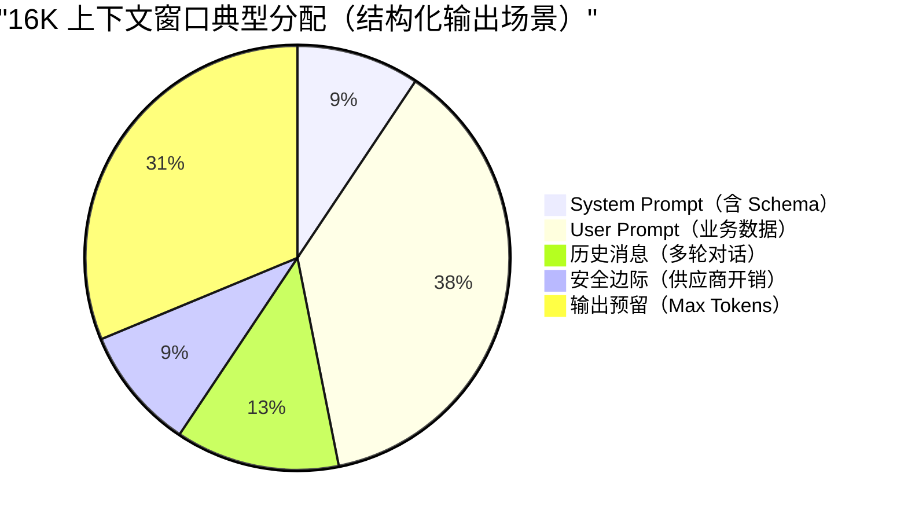

温度已经设为 0，结构化输出仍可能解析失败；上下文塞满文档后，模型也可能漏掉中间位置的关键约束。这些现象需要从 Token 切分、上下文容量和解码策略分别排查。

排查这些问题，要先看一次调用由哪些 Token 组成，再核对上下文预算以及 Temperature、Top-p、Top-k 等解码参数。文中的 Token 数和参数范围只用于解释机制，实际计费与能力上限仍以目标模型的 API 文档和响应 `usage` 为准。

## Token 和上下文为什么决定成本与效果？

当你在输入法里打“今天天气真”，它会自动建议“好”。大模型同样在预测后续内容，只不过它参考的是前面几千甚至几十万个字。每次生成一个 Token（文本碎片），再把它加入上下文并预测下一个，直到回答结束。

这个过程叫做**自回归生成（Autoregressive Generation）**。

自回归生成把后面的几个概念串在了一起：

- **Token**：模型每一步“补”的文本碎片。
- **上下文窗口**：一次调用里模型可处理的总 Token 上限，系统提示词、历史消息、当前输入和输出预算都会占用。
- **Temperature / Top-p**：模型选哪个候选碎片的策略。
- **Max Tokens**：允许模型最多“补”多少步。

Tokenizer 接到文本后，会把它拆成大小不等的片段。比如 `你好，我是小 G。` 可以得到这样一组示意结果：

- 原文：`你好，我是小 G。`
- 切分：`[你好]` `[，]` `[我是]` `[小 G]` `[。]`
- 统计：原文 9 字符 → Token 数 5 个 → 压缩比约 1.8 倍


这组切分只用于说明过程。实际结果取决于目标模型的 Tokenizer，同一段文本换一个供应商或模型版本，Token 序列就可能改变。OpenAI 也提供了可直接查看切分结果的 [Tokenizer 工具](https://platform.openai.com/tokenizer)。

如果固定按字切，词表比较小，序列却会变长；固定按词切可以缩短序列，但中文词组数量会让词表快速膨胀。BPE、Unigram 等**子词切分算法**在两者之间取舍：高频片段尽量作为整体保留，低频词继续拆小。因此，Token 和字、词都没有固定的一一对应关系。英文单词可能占多个 Token；中文也可能一词多 Token，或多字合成一个 Token。

容量规划可以先用经验值估算：英文 1 Token 大约对应 3~4 个字符；中文通常在 1~2 个汉字之间，混排内容还会继续波动。DeepSeek 官方数据给出的换算是 1 个英文字符约消耗 0.3 Token、1 个中文字符约消耗 0.6 Token，也就是每个 Token 约为 3.3 个英文字符或 1.7 个中文字符。

Tokenizer 版本也会改变换算结果。早期模型（如 GPT-3.5）的中文压缩率较低，约为 1 字 1.5~2 Token；GPT-4o 使用词表约 20 万的 o200k_base Tokenizer，Qwen2.5 词表约 15 万。现有实测中，新闻类文本约为 1.5 字/Token，技术文档约为 1.2 字/Token，但这些数字不适合直接用于结算。

“趋近 1 字 1 Token”只可能出现在部分高频词上。预算阶段可以用经验值留出余量，计费与监控则读取 API 返回的 `usage`。中文歧义、生僻字和低频专业术语被切成什么粒度，也会影响模型对文本的处理效果。

**特殊 Token**：除了文本内容对应的 Token，模型内部还会使用一些特殊标记，这些也会计入 Token 总数：

| 特殊 Token                   | 用途                  | 示例           |
| ---------------------------- | --------------------- | -------------- |
| BOS（Beginning of Sequence） | 标记序列开始          | `<s>`          |
| EOS（End of Sequence）       | 标记序列结束          | `</s>`         |
| PAD（Padding）               | 批处理时填充短序列    | `<pad>`        |
| 工具调用标记                 | Function Calling 边界 | `<tool_call/>` |

这些特殊 Token 通常对用户不可见，但会占用上下文窗口。精确计数时建议使用官方 Tokenizer 工具而非手动估算。

### 多模态输入的 Token 开销

支持视觉输入的模型会把图片转换为内部表示，并按各自规则折算输入 Token。这个数不能只根据“有一张图”估算：

- OpenAI 视觉模型会结合模型、图片尺寸和 `detail` 模式计费。以采用 512 像素分块规则的模型为例，低细节使用固定基础额度；高细节还会按缩放后的分块数量增加 Token。
- Anthropic 按缩放后的图片像素数估算，官方给出的近似公式是 `tokens ≈ width × height / 750`。一张没有被缩放的 1024×1024 图片约为 1398 Tokens，并非固定的 5 或 85 Tokens。
- Gemini 对较小图片和较大图片使用不同的分块规则。官方文档中的 258 Tokens 有尺寸条件，不能直接套到任意 1024×1024 图片上。

模型版本会改变图片计费规则。上线前应使用供应商提供的 Token 计算接口或官方公式，并分别覆盖缩略图、截图、长图和多图请求。可参考 [OpenAI 图片与视觉输入](https://developers.openai.com/api/docs/guides/images-vision)、[Anthropic Vision](https://platform.claude.com/docs/en/build-with-claude/vision) 和 [Gemini Token 计算](https://ai.google.dev/gemini-api/docs/tokens)。

图片进入多模态 RAG 后，这笔开销会同时影响预算和延迟：

- 图片 Token 要和文本 Token 一起计入单次调用预算。
- 批量图片会拉长首字延迟（TTFT），需要单独压测。
- 任务只需要 OCR 结果时，可以先提取文字，再把纯文本送入模型。

### 上下文窗口的容量边界

模型标注的 128K、200K 或 1M，指一次调用能够容纳的 Token 上限。窗口越大，单次可传入的文档和对话历史越多，但这部分容量还要分给系统提示词、工具定义和模型输出。大多数模型将输入与输出合并计算，部分供应商（如 Google Gemini）则分别设置输入和输出上限。


- **固定内容**：System Prompt、工具调用 Schema 和格式标记。
- **本次输入**：User Prompt、历史消息与 RAG 检索片段。
- **生成预算**：模型即将生成的输出 Token。

标称窗口减掉这些内容，剩下的才是业务数据实际可用的空间。

注意：上下文窗口（Context Window）≠ 最大生成长度。许多模型支持 128K 甚至 1M 上下文，但单次输出上限因模型和 API 而异；参数名也可能是 `max_tokens`、`max_completion_tokens` 或 `max_output_tokens`。不要根据供应商名称推断上限，调用前读取目标模型的能力页。

推理模型的多轮消息格式需要按供应商区分：

- [DeepSeek 思考模式](https://api-docs.deepseek.com/guides/thinking_mode)会分别返回 `reasoning_content` 和最终 `content`。没有工具调用时，上一轮 `reasoning_content` 无需参与下一轮上下文，即使传入也会被忽略；发生工具调用时，当前轮的 `reasoning_content` 必须随工具结果回传，直到该轮完成。
- [OpenAI 推理模型](https://developers.openai.com/api/docs/guides/reasoning)不向应用暴露原始 chain-of-thought。Responses API 可以通过 `previous_response_id` 延续上下文，或者按 API 要求回传 reasoning item；应用能拿到的是可选的推理摘要，而不是内部推理原文。

推理 Token 虽然不一定出现在下一轮消息文本里，但本轮仍会消耗生成预算，并可能计入输出 Token 和上下文限制。不要据此得出“推理过程不占窗口或不计费”的通用结论。

### 长上下文背后的计算约束

Transformer 的**自注意力机制（Self-Attention）**会为长上下文带来三类开销：

- 计算成本平方级增长：计算需求与序列长度呈平方级关系（O(N²)）。输入 Token 翻倍，处理能力需求可能变为 4 倍。
- 推理延迟增加：上下文变长后，模型生成每个新 Token 时需要关注的历史 Token 变多，首字延迟 TTFT 会显著增加。
- 安全风险增加：更长的上下文意味着更大的攻击面。

FlashAttention、GQA/MQA、Sliding Window Attention、Ring Attention 等技术可以减少计算量或显存占用，但没有让所有长上下文都变成线性成本，O(N²) 仍是标准自注意力需要面对的理论复杂度。

### 上下文溢出的真实表现

System Prompt 明明要求“必须输出 JSON”，模型却漏掉这条约束，是上下文过长时最容易观察到的现象之一。回答还可能在后半段偏题，或者因为 RAG 片段太多而抓不住真正相关的证据。

信息放进窗口也不等于模型能同等利用每个位置。“中间丢失”描述的就是模型更容易利用开头和结尾、对中间内容召回较弱的情况。窗口扩到 1M 也不能自动消除这个问题。

长上下文还有可以直接监控的代价：输入 Token 随内容量增加，账单随之增长；预填充耗时和 TTFT 也会变长。出现这些信号时，应先检查检索片段数量、历史消息裁剪和关键信息位置，而不是继续把窗口塞满。

### 输入 Token 与输出 Token 的计费差异

多数供应商会分别计算输入、缓存输入和输出 Token，推理模型还可能单列 reasoning tokens。输出单价经常高于输入单价，但不存在稳定的“2~4 倍”行业比例：模型版本、批处理、缓存命中和服务等级都会改变价格。

价格表更新频繁，不适合固化在原理文章里。成本核算应读取供应商当前价格页，并在网关中保存 `model_version`、各类 `usage` 和实际账单单价。

成本核算要分别记录输入、缓存输入、输出以及供应商返回的 reasoning tokens。RAG 先控制检索片段数量，避免无关内容推高输入 Token；输出和推理过程则用生成上限约束。由于 reasoning tokens 经常计入输出侧费用，推理模型还要单独看这部分用量。

### Prompt Caching 的省钱逻辑

批量评测经常重复发送同一份 System Prompt，只替换末尾的样本；多轮对话也会重复携带一段固定历史。这类请求可以利用 **Prompt Caching** 复用前缀。后续请求满足模型、前缀长度、内容和有效期等条件时，命中部分会按缓存输入计费，并减少一部分预填充计算。

固定前缀较长、重复率较高的任务更容易受益：

- 多轮对话（System Prompt + 历史 Message 不变）。
- RAG 应用（检索片段重复率高）。
- 批量评估（同一份 System Prompt，不同的简历/文章）。

OpenAI Prompt Caching、Anthropic Prompt Caching 和 DeepSeek Context Caching 的触发门槛、缓存寿命与价格并不相同，有些还区分自动缓存、显式缓存和延长缓存。配置前查当前官方文档，不要把缓存时长和折扣写死在业务代码里。

请求内容的排列会直接影响缓存命中：

1. 把不变的内容放前面（System Prompt、工具定义、RAG Context），把变化的内容放后面（User Prompt）。
2. 按供应商响应字段监控缓存读取和缓存写入 Token，验证缓存命中率。
3. 批量任务尽量在缓存时间窗口内完成。

### 一次调用的 Token 预算公式

把“上下文窗口”当成一个固定容量的桶，下图展示了一个典型调用的 Token 预算分配：



图中的数值只用于示意。普通生成模型先检查这个关系是否成立：

**window ≥ input_tokens + max_output_tokens**

推理模型要按目标 API 的参数定义单独计算。有些 API 的 `max_output_tokens` 或 `max_completion_tokens` 已经同时包含推理 Token 和可见回答，此时再加一次 `reasoning_tokens` 会重复；另一些 API 会分别限制思考过程和最终回答。上线前可以用返回的 `usage` 反推一次真实调用的组成，再校准预算公式。

其中 `input_tokens` 至少包含：

- system prompt（含 schema / 工具定义）
- user prompt（含变量替换后的实际文本）
- 历史消息（多轮对话时）
- RAG context（如果拼进来了）

结构化任务的输出长度通常更容易控制，可以先确定 `max_output_tokens`，再给输入留出 10%~20% 的安全余量。预算仍然不够时，按顺序减少 RAG Top-K、合并重复片段、摘要或截断长字段；一轮塞不下的任务再拆成分批评估或两阶段生成。

## 采样参数如何影响输出稳定性？

### 从 logits 到概率采样

模型每一步会给词表中**每个**候选 Token 打一个分数（内部叫 **logits**），分数越高说明模型越觉得这个词应该出现在这里。

举个例子，假设模型正在补全“今天天气真\_\_”，它可能给出这样的分数：

| 候选 Token | 原始分数（logit） |
| ---------- | ----------------- |
| 好         | 5.0               |
| 不错       | 3.2               |
| 棒         | 2.1               |
| 糟糕       | 0.5               |
| 紫色       | -8.0              |

原始分数还不是概率，需要经过 **softmax** 才能得到候选 Token 的概率分布。变换后大致是：

| 候选 Token | 概率     |
| ---------- | -------- |
| 好         | 81.21%   |
| 不错       | 13.42%   |
| 棒         | 4.47%    |
| 糟糕       | 0.90%    |
| 紫色       | 约 0.00% |

得到概率分布后，模型再通过采样决定输出哪个 Token。

解码参数（Temperature、Top-p、Top-k 等）就是在这个“打分 → 概率 → 抽签”的过程中施加控制：

- Temperature：调整概率分布的“形状”，让高分选项更突出，或者让各选项更均匀。
- Top-p / Top-k：直接砍掉不靠谱的候选项，缩小“抽签池”。
- Penalty 系列：对已经出现过的词降分，防止“复读机”。

### Temperature 的“冒险程度”


Temperature 的工作原理很简单：在 softmax 之前，先把所有分数**除以**温度值 T。

**p(t) = softmax(z_t / T)**

把前面的“今天天气真\_\_”代入公式，可以看到温度怎样改变同一组 logits：

| 温度    | 概率分布的变化                      | 示例结果                                     |
| ------- | ----------------------------------- | -------------------------------------------- |
| T = 0.2 | 分布变尖，高概率 Token 更集中       | “好”约 99.99%                                |
| T = 1.0 | 保持原始分布                        | “好”约 81.21%，“不错”约 13.42%               |
| T = 1.5 | 分布变平，低概率 Token 获得更多机会 | “好”约 66.85%，“不错”约 20.14%，“棒”约 9.67% |

温度越低，输出越确定；温度越高，输出越随机。

工程建议（经验值，非硬规则）：

| 场景                         | 推荐温度   | 说明                               |
| ---------------------------- | ---------- | ---------------------------------- |
| 结构化提取 / JSON 输出       | 0 ~ 0.3    | 配合严格 schema + 解析失败重试策略 |
| 评估 / 分析 / 代码评审       | 0.4 ~ 0.8  | 平衡确定性与表达多样性             |
| 创作类内容（文案、头脑风暴） | 0.8 ~ 1.2+ | 增加多样性，但要承担格式一致性风险 |

如果目标 API 支持 `seed`，可以把它和固定模型版本、固定 Prompt 及固定采样参数一起保存。`seed` 通常只提供尽力而为的可复现性，不保证逐字一致；DeepSeek 当前 API 参数也没有公开 `seed`。

以下情况仍可能导致结果不一致：

- 模型版本更新（底层权重变化）。
- 跨区域调用（不同集群可能部署不同版本）。
- 服务端解码实现、并行计算和后端配置发生变化。

CI/CD 可以把真实 LLM 调用留给冒烟测试；需要稳定复现的逻辑测试仍然使用 Mock。

### Top-p 与 Top-k 的“抽签池”

Temperature 调整概率分布的形状。Top-p 和 Top-k 会截断候选集合，把尾部候选排除在采样范围之外。

还是用“今天天气真\_\_”的例子：

| 候选 Token | 概率     | 累计概率 |
| ---------- | -------- | -------- |
| 好         | 81.21%   | 81.21%   |
| 不错       | 13.42%   | 94.63%   |
| 棒         | 4.47%    | 99.10%   |
| 糟糕       | 0.90%    | 约 100%  |
| 紫色       | 约 0.00% | 100%     |

`Top-k = 3` 固定保留概率最高的“好、不错、棒”，其余候选不再参与采样。`Top-p = 0.9` 则从高到低累加，当前示例中“好 + 不错”已经达到 94.63%，候选集只保留这两个；如果第一名自身超过 90%，就只留下一个。

Top-k 控制固定数量，Top-p 控制累计概率，所以 Top-p 的候选数量会随分布变化。与 Temperature 组合后，常见行为如下：

| 组合                      | 效果                                           | 适用场景                 |
| ------------------------- | ---------------------------------------------- | ------------------------ |
| T=0（通常按贪婪解码处理） | 每步选最高分，结果仍受模型版本和服务端实现影响 | 结构化输出、低随机性场景 |
| 低温 + Top-p=0.9          | 相对稳定，但允许措辞上有些变化                 | 分析报告、摘要           |
| 中高温 + Top-p=0.95       | 多样性较高，但排除了极端离谱选项               | 创意写作、对话           |

注意：贪婪解码虽然最稳定，但可能更容易陷入重复循环。

### 停止条件与截断风险

生成达到 Max Tokens 后会直接停止，哪怕 JSON 还缺右括号、列表还有项目没写完。服务端收到 `finish_reason=length` 时，应把结果标记为截断，不能交给下游继续执行。

Stop Sequences 会在模型生成指定字符串时提前结束，例如 `"\n\n"` 或 `"```"`。停止词如果与业务文本重合，同样会截断关键字段。结构化输出需要分别覆盖达到生成上限和误触停止词这两条失败路径。

推理模型还要确认生成上限是否同时覆盖推理过程与最终回答。部分 API 共用一个生成预算，推理 Token 用得越多，可见回答剩余空间就越少；另一些 API 通过 `reasoning_effort` 等参数间接控制推理量。发现 `finish_reason=length` 时，要把推理 Token 和最终回答一起纳入排查。

### Penalty 与复读问题

可能遇到过模型反复输出同一句话，或者在长回答里不断重复相同观点。Penalty 参数用来缓解这类问题，它们在解码时**降低已出现 Token 的分数**：

| 参数               | 作用                                | 通俗理解                 |
| ------------------ | ----------------------------------- | ------------------------ |
| Repetition Penalty | 降低所有已出现 Token 的概率         | “说过的词，再说就扣分”   |
| Presence Penalty   | 只要 Token 出现过就扣分（不看次数） | “鼓励聊新话题”           |
| Frequency Penalty  | Token 出现次数越多扣分越重          | “同一个词说了三遍？重罚” |

JSON 对象可能反复出现 `"name"`、`"score"` 等字段名，Repetition Penalty 过高会连这些必要重复一起降分，结果可能缺字段。RAG 问答使用 Presence Penalty 时，模型会更倾向引入没有出现在检索内容里的新词，也会削弱回答对证据的忠实度。

不同供应商对 Penalty 的定义并不完全一致。没有明确调参依据时，保留默认值，再用输出长度、Prompt 约束和 Schema 控制结构，排查路径会更清楚。

### 思维链模式的参数限制

推理模型的参数支持范围由具体 API 决定，不能把 DeepSeek 思考模式和 OpenAI 推理模型概括成同一种行为。

- DeepSeek V4 思考模式会返回 `reasoning_content` 与最终 `content`，并明确列出不支持或不会生效的采样参数。
- OpenAI 不返回原始内部推理过程。Responses API 可以返回推理 item 和可选摘要；不同推理模型对 `temperature`、`top_p` 等参数的支持也可能不同。

调用前应按模型能力表过滤不支持的参数。结构稳定性仍要依赖 Structured Outputs、服务端校验和失败处理，不能只调 Temperature。

### 流式输出与首字延迟

同步接口要等完整内容生成后再返回；流式接口生成一个或几个 Token 就会推送增量，因此用户更早看到第一个 Token，首字延迟（TTFT，Time-To-First-Token）也更低。这里容易混淆的是首字延迟、总耗时和费用：

- 流式输出不一定降低总耗时（E2E latency），模型生成的总 Token 量没有因此减少。
- 流式输出不会自动省钱，Token 计费不变，仍然受限流和配额影响。
- 如果需要结构化输出（如 JSON），流式场景要考虑“半成品 JSON”在前端/网关层的处理。

### Logprobs 与置信度排查

部分 API（如 OpenAI）支持返回每个生成 Token 的**对数概率**（logprobs），可以理解为模型对该 Token 的“确信程度”。logprob 越接近 0，模型越确信；值越小（如 -5.0），说明模型越“犹豫”。

工程应用场景：

- **置信度评估**：提取“金额: 1000”时，若对应 Token 的 logprob 很低，说明模型不太确定，可能需要人工复核。
- **异常检测**：监控生产环境中模型输出的平均 logprob，若突然下降可能提示 Prompt 漂移或输入数据异常。
- **多候选对比**：获取 Top-N 候选 Token 及其概率，用于纠错或二次排序。

注意事项：logprobs 会增加响应体积，且并非所有供应商都支持。使用前请查阅 API 文档。

### 采样参数配置建议

| 场景                | Temperature | Top-p      | Penalty    | 其他建议                       |
| ------------------- | ----------- | ---------- | ---------- | ------------------------------ |
| JSON / 结构化输出   | 0 ~ 0.3     | 1.0        | 保持默认   | 配合 Strict Mode + 重试策略    |
| 代码评审 / 技术分析 | 0.4 ~ 0.7   | 0.9        | 保持默认   | 结合 CoT Prompt                |
| 多轮对话            | 0.6 ~ 0.8   | 0.9        | 适度开启   | 控制历史消息长度               |
| 创意写作 / 头脑风暴 | 0.8 ~ 1.2   | 0.95       | 按需开启   | 接受输出多样性，做好后处理     |
| 推理模型            | 查模型文档  | 查模型文档 | 查模型文档 | 过滤不支持参数，保留服务端校验 |

## 落地时保留哪些数据

容量规划按 Token 做，计费与告警以 API 返回的 `usage` 为准。每次调用至少保存模型版本、输入 Token、缓存 Token、推理 Token（如果供应商返回）、输出 Token、上下文裁剪策略和采样参数。

长上下文只提高可容纳的信息量，不保证模型能同等利用每个位置。结构化任务还要配合 Schema 和服务端校验；需要复现实验时，则固定模型版本、Prompt、输入与解码参数，并接受供应商服务仍可能带来的小幅非确定性。
