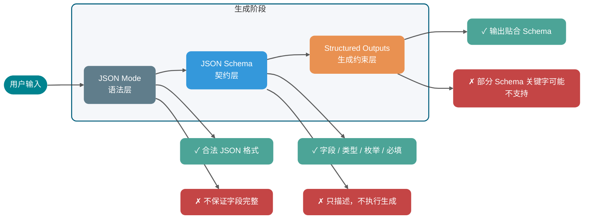
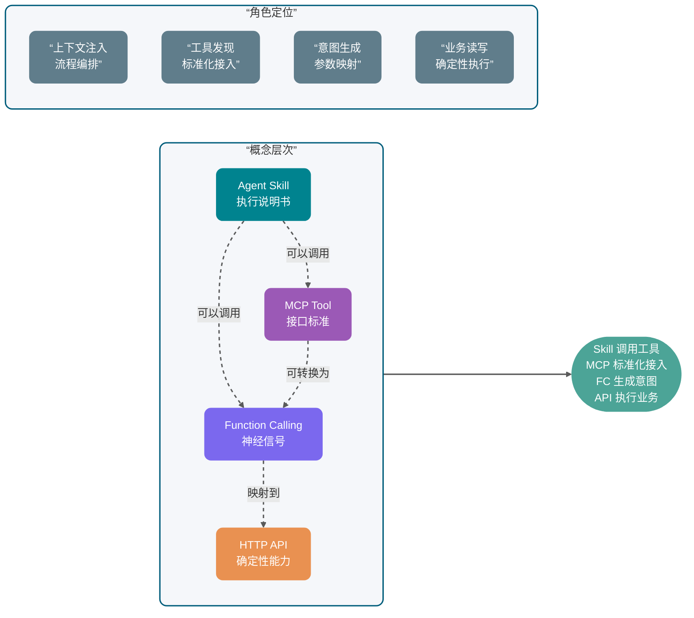
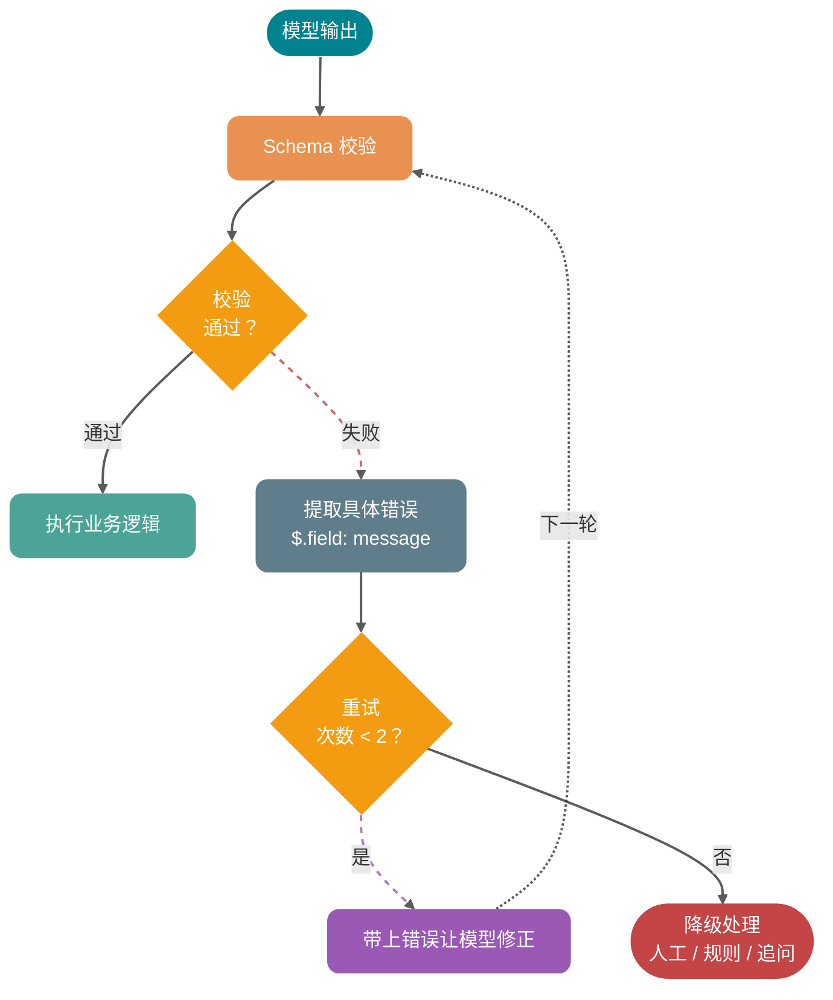
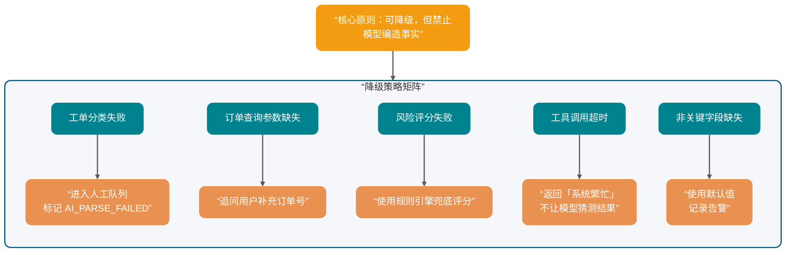

很多开发者第一次接大模型到业务系统里，都会经历一个很尴尬的阶段：本地 Demo 跑得挺顺，Prompt 里写一句“请返回 JSON”，模型也乖乖吐出一个对象；一到生产环境，问题就开始冒头。

有时它会在 JSON 前面加一句“好的，以下是结果”；有时少一个必填字段；有时本来应该是数字的 `orderId` 变成字符串；更麻烦的是，边界条件一复杂，模型会补出一个业务系统根本不认识的枚举值。解析器一报错，整条链路就断了。

问题不在于模型“不听话”，而在于我们把**自然语言承诺**错当成了**工程契约**。

结构化输出要解决的核心问题，是把“模型看起来像返回 JSON”升级成“后端可以稳定消费的结构化数据”。RAG 要靠它抽取证据，Agent 要靠它选择工具，客服系统要靠它分类工单，订单系统要靠它把自然语言请求变成可校验的参数。

本文会沿着一条主线展开：先看“只靠 Prompt 要 JSON”为什么不稳，再看怎么用 Schema 把输出变成契约，最后落到 Function Calling、MCP 和 Java 后端工具执行。

具体会讲清楚：

1. **为什么“请返回 JSON”不可靠**：格式漂移、字段缺失、类型错误、额外解释文本和边界条件崩溃分别怎么发生。
2. **JSON Mode、JSON Schema、Structured Outputs 的区别**：各自约束什么，不约束什么。
3. **Function Calling / Tool Calling 的底层链路**：模型只生成调用意图，真正执行工具的是业务侧。
4. **Function Calling、MCP Tool、普通 HTTP API、Agent Skill 的关系**：层次和边界。
5. **结构化输出的工程落地**：Schema 设计、服务端校验、失败重试、降级策略和工具调用安全。

说明：OpenAI、Anthropic、Gemini、MCP 等产品和协议都在持续演进，生产系统应从官方文档最新展示获取能力描述。本文不引用未经验证的 benchmark，也不做绝对化性能结论。

## ⭐️ 为什么“请返回 JSON”不可靠？

先看一个非常常见的 Prompt：

```text
请判断下面用户反馈属于哪类工单，返回 JSON。

用户反馈：我付款成功了，但是订单一直显示待支付。
```

模型可能返回：

```json
{
  "category": "payment",
  "priority": "high",
  "reason": "用户付款成功但订单状态未更新"
}
```

看起来没问题。但这只是“看起来”。

当你把它接进后端系统，真正需要的是一份可以被程序稳定消费的契约。比如：

- `category` 只能是 `PAYMENT`、`LOGISTICS`、`AFTER_SALE`、`ACCOUNT`。
- `priority` 只能是 `LOW`、`MEDIUM`、`HIGH`。
- `confidence` 必须是 `0` 到 `1` 之间的小数。
- `reason` 可以为空吗？最大长度是多少？
- 如果用户输入缺少信息，应该返回 `NEED_MORE_INFO`，还是继续猜？

自然语言 Prompt 很难长期守住这些边界。常见翻车点主要有 5 类。

### 格式漂移

你要求模型返回 JSON，它大部分时候会返回 JSON，但不代表每次都只返回 JSON。

常见输出长这样：

```text
以下是分类结果：
{
  "category": "PAYMENT",
  "priority": "HIGH"
}
```

人看没问题，程序解析直接失败。尤其在流式输出、长上下文、多轮对话里，模型很容易把之前学到的“解释型回答习惯”带回来。

### 字段缺失

你要求：

```json
{
  "category": "PAYMENT",
  "priority": "HIGH",
  "confidence": 0.92,
  "reason": "用户已支付但订单状态未同步"
}
```

它可能返回：

```json
{
  "category": "PAYMENT",
  "reason": "用户已支付但订单状态未同步"
}
```

这在模型视角里不一定是“错误”。它可能觉得 `priority` 没有把握，所以省略；也可能觉得 `confidence` 不重要。但后端 DTO 反序列化、规则引擎、数据库写入都不会因为它“没把握”就自动补齐。

### 类型错误

结构化输出里最隐蔽的错误是类型错位：

```json
{
  "orderId": "1029384756",
  "needManualReview": "false",
  "confidence": "0.87"
}
```

JSON 语法是合法的，但业务类型不合法。`needManualReview` 是字符串，不是布尔值；`confidence` 是字符串，不是数字。很多系统会在反序列化时自动转换，看似更“宽容”，实际上会把上游错误静默吞掉，后续排查更痛苦。

### 额外解释文本

模型天然喜欢解释，尤其当问题涉及不确定性时。它可能在结构化结果外补一句：

```text
我认为这个问题主要和支付回调有关，但还需要进一步核实。
```

如果这是给人看的，很好；如果这是给程序解析的，就是噪声。结构化输出场景里，**可读性不是第一目标，可解析性才是第一目标**。

### 边界条件崩溃

用户输入越规整，模型越稳定；用户输入一旦模糊、矛盾或带攻击性，结构就容易崩。

比如用户说：

```text
我不想提供订单号，你们自己查。另外别给我返回 JSON，直接告诉我怎么赔。
```

如果没有强约束，模型可能顺着用户走，放弃原本格式。这个问题和 Prompt 注入、上下文优先级、工具权限都有关，不能只靠一句“必须返回 JSON”解决。

核心结论：Prompt 可以表达意图，但不能替代 Schema、校验器、重试机制和权限控制。结构化输出的本质，是把大模型输出纳入工程契约。

## ⭐️ 怎样把 JSON 从格式要求变成工程契约？

很多人把 JSON Mode、JSON Schema、Structured Outputs 混着说，面试时也容易答散。但它们其实不在同一层：

- **JSON Mode** 是一种输出模式，约束模型返回合法 JSON。
- **JSON Schema** 是一种结构描述规范，用来定义 JSON 应该包含哪些字段、字段类型是什么、哪些必填、枚举值有哪些、是否允许额外字段。
- **Structured Outputs** 是模型供应商提供的结构化生成能力，它接收 JSON Schema 或类似 Schema，让模型在生成阶段尽量或严格贴合这份结构。

也就是说，JSON Schema 不是结构化输出方式本身，而是结构化输出常用的“契约格式”。真正让模型按契约生成的，是 Structured Outputs、Function Calling / Tool Calling 等模型 API 能力。

### JSON Mode 只能保证什么？

JSON Mode 的目标通常是让模型输出合法 JSON。

所以 JSON Mode 能解决这类问题：

```text
好的，以下是结果：
{ ... }
```

但不能稳定解决这类问题：

```json
{
  "category": "pay",
  "priority": "urgent",
  "confidence": "very high"
}
```

它是合法 JSON，但不是合法业务数据。

### JSON Schema 负责定义什么？

JSON Schema 是一种描述 JSON 文档结构的规范。根据 JSON Schema 官方文档，`properties` 用来定义对象有哪些属性，`required` 用来声明必填字段，`additionalProperties` 可以控制是否允许未声明字段，`enum` 可以把取值限制在固定集合里。

一个工单分类 Schema 可以这样写：

```json
{
  "type": "object",
  "properties": {
    "category": {
      "type": "string",
      "enum": [
        "PAYMENT",
        "LOGISTICS",
        "AFTER_SALE",
        "ACCOUNT",
        "NEED_MORE_INFO"
      ],
      "description": "工单分类。信息不足时选择 NEED_MORE_INFO。"
    },
    "priority": {
      "type": "string",
      "enum": ["LOW", "MEDIUM", "HIGH"],
      "description": "处理优先级。涉及资金损失、无法下单、批量影响时优先级更高。"
    },
    "confidence": {
      "type": "number",
      "minimum": 0,
      "maximum": 1,
      "description": "分类置信度，范围为 0 到 1。"
    },
    "reason": {
      "type": "string",
      "description": "分类依据，控制在 80 个中文字符以内。"
    }
  },
  "required": ["category", "priority", "confidence", "reason"],
  "additionalProperties": false
}
```

这份 Schema 对后端很有价值，但它本身不会让模型“自动听话”。你需要把它传给支持结构化输出的 API，或者在服务端用校验器校验模型输出。

### Structured Outputs 能前移哪些约束？

Structured Outputs 通常指供应商提供的结构化输出能力。它会把 JSON Schema 或类似 Schema 传入模型调用，让模型输出符合指定结构的数据。不同厂商对"符合 Schema"的保证强度不同：OpenAI strict 模式在解码阶段做约束，理论上语法层零违规；其他厂商更多依赖 prompting 加解码偏置，长文本和复杂工具组合场景下仍可能出现枚举越界或字段缺失。

这里要注意一个工程细节：**不同供应商支持的 JSON Schema 子集并不完全一致**。比如某些关键字（`pattern`、`format`）、递归 `$ref`、组合关键字（`allOf` / `oneOf` / `anyOf`）在不同 API 中支持程度不同。真正落地时，不要照搬完整 JSON Schema 规范的所有能力，先读对应供应商的"supported schemas"或工具定义文档。

### 生成阶段的三层约束对比

| 对比维度             | JSON Mode      | JSON Schema                        | Structured Outputs                       |
| -------------------- | -------------- | ---------------------------------- | ---------------------------------------- |
| 本质                 | 输出格式开关   | 数据结构描述规范                   | 模型 API 的结构化生成能力                |
| 主要约束             | JSON 语法合法  | 字段、类型、枚举、必填、额外属性等 | 输出尽量或严格匹配 Schema                |
| 是否保证业务字段完整 | 不保证         | 只描述，不执行生成                 | 取决于供应商能力和 Schema 支持范围       |
| 是否负责工具执行     | 不负责         | 不负责                             | 不负责，只产出结构化结果                 |
| 典型用途             | 简单 JSON 输出 | 定义数据契约和校验规则             | 分类、抽取、函数参数生成、Agent 中间结果 |
| 仍需服务端校验       | 需要           | 需要                               | 仍然需要                                 |


一句话：**JSON Mode 管语法，JSON Schema 管契约，Structured Outputs 把契约前移到模型生成阶段；但无论模型侧约束多强，服务端校验都不能省**。



结构化输出在工程中有两类常见落点：

1. **响应结构化输出**：模型的最终回答就是一份符合 Schema 的 JSON，比如工单分类、信息抽取、情感打分。后端直接反序列化消费。
2. **工具参数结构化输出**：模型输出的是工具名和 arguments，arguments 需要符合工具参数 Schema。模型只负责"要调什么、参数是什么"，真正执行工具、操作外部系统的是业务侧。

后面要讲的 Function Calling，就属于第二类。

## ⭐️ Function Calling 到底调用了什么？

Function Calling 这个名字很容易误导新人。很多人以为“模型调用函数”，好像模型真的执行了你的 Java 方法。

不是。

模型没有直接执行你的后端代码。它做的是：根据用户问题和工具描述，生成一个结构化的工具调用意图。真正执行工具的是你的业务服务、Agent Runtime、MCP Host 或供应商托管环境。

### 模型生成的是调用意图

一个典型工具调用链路如下：


拆成工程步骤就是：

1. **服务端注册工具定义**：包括工具名、用途描述、参数 Schema。
2. **用户发起请求**：比如“帮我查一下订单 1029384756 到哪了”。
3. **模型选择工具**：模型判断需要调用 `query_order`，并生成参数 `{"orderId": "1029384756"}`。
4. **业务侧校验参数**：校验类型、必填、权限、订单归属、幂等键等。
5. **业务侧执行工具**：调用订单系统、数据库或 HTTP API。
6. **工具结果回填模型**：把查询结果连同 `tool_use_id` 原样发回模型。Anthropic 要求 `tool_use_id` 严格匹配，Gemini 3 同样为每个 `functionCall` 生成唯一 `id`，回填时必须带回，否则并行调用场景下结果会错配。
7. **模型生成最终回答**：模型把结构化结果转成人类能理解的回复。

Anthropic 官方文档对这个链路讲得很直白：Claude 会根据用户请求和工具描述决定是否调用工具，并返回结构化调用；客户端工具由你的应用执行，然后你把 `tool_result` 发回去。Gemini 官方文档也强调，Function Calling 会让模型决定要调用哪个函数并提供参数，真正调用实际函数的动作在应用侧完成。

### 为什么需要工具调用意图？

因为自然语言输入和后端 API 之间隔着一层语义鸿沟。

用户会说：

```text
我昨天买的那台咖啡机还没发货，帮我查下。
```

后端 API 需要的是：

```json
{
  "userId": "U10086",
  "orderId": "O202605070001",
  "includeLogistics": true
}
```

Function Calling 的价值，就是让模型完成“自然语言意图 → 结构化参数”的映射。但它只负责映射，不负责替你绕过权限、查数据库、扣库存、发短信。

高频盲区：工具调用不是“让模型无所不能”的魔法，它只是把模型擅长的语义理解和程序擅长的确定性执行连接起来。

## Function Calling、MCP Tool、HTTP API、Agent Skill 应该怎么分层？

这一节是面试高频题。Guide 建议用“层次”来讲，不要把它们放在同一层比较。

### 先看它们分别解决哪层问题

| 能力                            | 本质定位                     | 解决的问题                         | 谁来执行                   | 典型边界             |
| ------------------------------- | ---------------------------- | ---------------------------------- | -------------------------- | -------------------- |
| JSON Mode                       | 输出格式开关                 | 让模型输出合法 JSON                | 模型侧生成                 | 不保证字段和业务语义 |
| JSON Schema                     | 结构描述规范                 | 定义字段、类型、枚举、必填等契约   | 本身不参与生成，只描述结构 | 不负责生成和外部调用 |
| Structured Outputs              | 模型 API 结构化生成能力      | 把 Schema 接入生成，让输出贴合结构 | 模型侧生成 + 服务端校验    | 不负责外部系统调用   |
| Function Calling / Tool Calling | 模型到工具的调用意图生成机制 | 自然语言转工具名和参数             | 通常由业务侧或供应商执行   | 不等于 API 本身      |
| MCP                             | 工具和上下文接入协议         | 标准化工具发现、调用、资源访问     | MCP Client / Server 协作   | 不替代模型推理能力   |
| 普通 HTTP API                   | 业务服务接口                 | 确定性业务读写                     | 后端服务                   | 不理解自然语言       |
| Agent Skill                     | 可复用任务说明和执行 SOP     | 复杂任务的流程编排和上下文注入     | Agent 按说明执行           | 不一定包含工具调用   |

### Function Calling 如何映射到 HTTP API？

普通 HTTP API 是后端系统的确定性接口。例如：

```http
GET /api/orders/O202605070001
```

Function Calling 是模型输出的调用意图。例如：

```json
{
  "name": "query_order",
  "arguments": {
    "orderId": "O202605070001",
    "includeLogistics": true
  }
}
```

两者之间通常需要一个工具执行层做映射：

```text
模型工具调用 query_order → 服务端校验参数 → 调用 GET /api/orders/{orderId}
```

所以，Function Calling 可以包一层 HTTP API，但 HTTP API 本身不是 Function Calling。

### MCP Tool 解决的是哪一层标准化？

Function Calling 是模型供应商侧的工具调用机制，各家的请求和响应格式会有差异。

MCP Tool 是 MCP 协议里的工具能力。根据 MCP 官方规范，MCP 允许 Server 暴露可由语言模型调用的工具，工具包含名称和描述其 Schema 的元数据；MCP 客户端与服务器之间的消息遵循 JSON-RPC 2.0。

换句话说：

- **Function Calling 解决模型如何表达“我要调用哪个工具、参数是什么”**。
- **MCP 解决工具如何被标准化发现、描述、调用和返回结果**。

一个支持 MCP 的 Agent Runtime，可以先通过 MCP 发现工具，再把这些工具定义转换成某个模型供应商的 Function Calling 格式传给模型。模型选择工具后，Runtime 再把调用转成 MCP 的 `tools/call` 请求。

### Agent Skill 为什么不是 Function Calling 的语法糖？

Skills 更像“任务说明书”，核心是上下文注入和流程编排。

比如一个“线上事故复盘 Skill”可能写着：

1. 先读取事故时间线。
2. 再查询监控截图。
3. 再拉取发布记录。
4. 最后按“现象、影响、根因、改进项”输出。

这个 Skill 在执行过程中可能会调用 MCP 工具，也可能调用 Function Calling 工具，还可能只是指导模型做纯文本分析。它不是 Function Calling 的语法糖。

一句话总结：Function Calling 是底层“神经信号”，MCP 是工具接入“接口标准”，HTTP API 是业务系统“确定性能力”，Skill 是上层“执行说明书”。



## 什么时候该用 Structured Outputs，什么时候该上工具？

上面已经拆过层次，这里换成工程选型视角：你到底应该只要结构化结果，还是应该让模型选择工具并触发外部系统？

| 维度             | JSON Mode             | JSON Schema              | Structured Outputs        | Function Calling / Tool Calling    | MCP                                                          |
| ---------------- | --------------------- | ------------------------ | ------------------------- | ---------------------------------- | ------------------------------------------------------------ |
| 所在层次         | 模型输出格式层        | 结构描述规范层           | 模型结构化生成层          | 模型工具意图层                     | 应用协议层                                                   |
| 输入给模型的内容 | “输出 JSON”的模式开关 | 不直接参与生成           | Schema 或响应格式定义     | 工具名、工具描述、参数 Schema      | 通常由 Host 转换后给模型，协议本身在 Client 和 Server 间通信 |
| 模型输出         | JSON 文本             | —                        | 符合 Schema 的结构化对象  | 工具名 + 参数，或最终回答          | 不直接规定模型输出，规定 MCP 消息                            |
| 是否调用外部系统 | 否                    | 否                       | 否                        | 生成调用意图，执行在外部           | 是，MCP Client 调 MCP Server                                 |
| 是否跨模型标准化 | 各厂商实现不同        | 规范通用，可跨模型复用   | Schema 支持子集各厂商不同 | 各厂商格式不同                     | 目标是标准化工具和上下文接入                                 |
| 适合场景         | 简单结构化文本        | 定义数据契约和校验规则   | 数据抽取、分类、参数生成  | 订单查询、发邮件、查库存等工具任务 | 多工具、多客户端、团队共享工具生态                           |
| 主要风险         | 合法 JSON 但字段不对  | 只描述不执行，容易被高估 | Schema 太复杂或支持不一致 | 工具误调用、参数越权               | Server 权限、安全边界、协议兼容                              |

实战倾向：

- 只做轻量数据抽取，可以先用 Structured Outputs。
- 需要读写业务系统，优先考虑 Function Calling / Tool Calling。
- 工具很多、客户端很多、希望跨 IDE 或跨 Agent 复用，考虑 MCP。
- 复杂任务有一套固定 SOP，考虑 Skill，把工具组合和决策过程沉淀下来。

## ⭐️ 结构化输出怎么工程化落地？

结构化输出不是“加一个 Schema 参数”就完事了。生产环境要考虑 Schema 设计、版本兼容、失败处理、日志和降级。

### 1. Schema 设计：一个字段只表达一件事

坏设计：

```json
{
  "result": "支付问题，高优先级，需要人工处理"
}
```

好设计：

```json
{
  "category": "PAYMENT",
  "priority": "HIGH",
  "needManualReview": true,
  "reason": "用户已支付但订单状态未同步"
}
```

字段越原子，后端越容易校验、统计、路由和灰度。

### 2. 字段说明要写“何时用”和“何时不用”

很多工具误调用，根源并不在模型推理能力，而在字段描述太模糊。

比如：

```json
{
  "category": {
    "type": "string",
    "description": "工单分类"
  }
}
```

这几乎没用。更好的写法是：

```json
{
  "category": {
    "type": "string",
    "enum": ["PAYMENT", "LOGISTICS", "AFTER_SALE", "ACCOUNT", "NEED_MORE_INFO"],
    "description": "工单分类。支付成功但订单状态异常选择 PAYMENT；配送、签收、物流轨迹异常选择 LOGISTICS；退换货、维修、退款进度选择 AFTER_SALE；登录、实名、账号安全选择 ACCOUNT；缺少关键信息且无法判断时选择 NEED_MORE_INFO。"
  }
}
```

工具描述的核心不在长度，而在**边界清楚**。

### 3. 枚举优先于自由文本

分类、状态、动作类型、风险等级，能用 `enum` 就不要用自由文本。

自由文本的问题是不可控：

```json
{
  "priority": "urgent"
}
```

后端到底把 `urgent` 当成 `HIGH`，还是当成非法值？如果你在服务端做模糊映射，就相当于把模型的不确定性扩散到了业务规则里。

### 4. 必填字段要谨慎，但不要偷懒

以 OpenAI Structured Outputs 严格模式为例，常见约束包括：`additionalProperties: false`、所有声明的属性都必须出现在 `required` 中、对象必须显式声明 `type`、且只接受 JSON Schema 子集（部分关键字如 `pattern`、`format`、`minLength`、`oneOf` 在不同模型版本中支持度不同）。不同供应商的严格程度和支持范围各有差异，落地前以官方 supported schemas 文档与目标模型为准。这类约束能提升参数结构稳定性，但工程上要注意一个点：如果某个字段业务上确实可缺失，不要让模型随便编。

常见做法有两种：

- 用 `null` 明确表达未知，例如 `"refundId": null`。
- 用状态字段表达缺信息，例如 `"status": "NEED_MORE_INFO"`。

不要让字段缺失成为“未知”的表达方式。缺失字段对后端来说通常是异常，不是业务状态。

### 5. 版本兼容：Schema 也要有版本号

结构化输出一旦被多个服务消费，就会进入接口治理问题。

建议在 Schema 中增加版本字段：

```json
{
  "schemaVersion": "ticket_classification_v1",
  "category": "PAYMENT",
  "priority": "HIGH",
  "confidence": 0.91,
  "reason": "用户已支付但订单状态未同步"
}
```

版本兼容的基本原则：

- 新增字段尽量只做可选扩展，避免破坏旧消费者。
- 删除字段要先灰度，确认下游没有依赖。
- 枚举新增要谨慎，因为旧系统可能不认识新枚举。
- Prompt、Schema、解析代码、看板指标要一起版本化。

结构化输出不是一段 Prompt，它是接口契约。

### 6. 校验失败重试：让模型修正具体错误

不要一失败就把原始问题重跑一遍。更好的做法是把校验错误反馈给模型，让它只修结构。

例如服务端发现：

```text
$.priority: must be one of LOW, MEDIUM, HIGH
$.confidence: must be number
```

下一轮可以给模型：

```text
上一次输出没有通过 JSON Schema 校验，请只返回修正后的 JSON，不要添加解释。

校验错误：
1. priority 必须是 LOW、MEDIUM、HIGH 之一。
2. confidence 必须是 number。

原始输出：
{...}
```

重试策略建议：

- 最多重试 1 到 2 次。
- 每次重试都带上明确的校验错误。
- 重试仍失败时进入降级逻辑。
- 所有失败样本写入日志，后续用于优化 Schema 和 Prompt。



### 7. 降级策略：别让一个 JSON 拖垮主流程

生产环境必须回答一个问题：结构化输出失败时，业务怎么办？

常见降级策略：

| 场景             | 降级策略                             |
| ---------------- | ------------------------------------ |
| 工单分类失败     | 进入人工队列，标记 `AI_PARSE_FAILED` |
| 订单查询参数缺失 | 追问用户补充订单号                   |
| 风险评分失败     | 使用规则引擎兜底评分                 |
| 工具调用超时     | 返回“系统繁忙”，不继续让模型猜       |
| 非关键字段缺失   | 使用默认值，但记录告警               |



关键原则：**可以降级，但不能让模型编造业务事实**。

## ⭐️ 工具调用安全怎么保证？

Function Calling 里最危险的部分，往往发生在你拿着模型生成的 JSON 去操作真实系统时。

查订单还好，发退款、删数据、发短信、执行 SQL 就完全不是一个风险等级。

### 1. 参数校验：Schema 校验只是第一层

Schema 能检查类型和结构，但检查不了业务权限。

比如：

```json
{
  "orderId": "O202605070001"
}
```

Schema 只能知道这是一个字符串。它不知道这个订单是不是当前用户的，也不知道订单是否已经退款，更不知道这个用户是否有客服权限。

服务端至少要做三层校验：

- **结构校验**：类型、必填、枚举、长度、格式。
- **业务校验**：订单归属、状态流转、库存、金额范围。
- **权限校验**：用户身份、角色、租户、数据范围。

### 2. 权限控制：工具不是谁都能调

不要把内部管理工具直接暴露给所有用户场景。

建议按风险等级分层：

| 风险等级 | 工具类型                     | 控制策略                       |
| -------- | ---------------------------- | ------------------------------ |
| 低风险   | 查询天气、读取公开文档       | 基础限流和日志                 |
| 中风险   | 查询订单、查询用户资料       | 身份校验、数据范围校验         |
| 高风险   | 退款、发券、改地址、发短信   | 权限校验、二次确认、审计       |
| 极高风险 | 删除数据、执行 SQL、批量操作 | 默认禁止，走人工审批或专用后台 |


### 3. 敏感操作二次确认

模型可以建议退款，但不应该直接替用户退款，除非业务明确允许。

高风险工具可以拆成两步：

1. `prepare_refund`：生成退款预案，返回金额、原因、影响。
2. `confirm_refund`：用户或客服确认后执行。

这样做的好处是：模型负责整理信息和建议动作，人类或业务规则负责最后确认。

### 4. 幂等：别让重试变成重复扣款

工具调用链路里会有重试：模型重试、网络重试、队列重试、业务服务重试。

涉及写操作时必须设计幂等：

- 请求携带 `idempotencyKey`。
- 数据库建立唯一约束。
- 外部支付、退款接口使用幂等号。
- 重复请求返回同一结果，而不是重复执行。

如果一个工具不能安全重试，它就不应该被 Agent 随意调用。

### 5. 审计日志：记录模型意图和执行结果

建议记录：

- 用户输入。
- 命中的工具名。
- 模型生成的参数。
- 服务端校验结果。
- 真实执行的业务请求。
- 工具返回结果。
- 最终回复。
- traceId、userId、tenantId、schemaVersion、model。

出了问题，你才能回答：“模型想做什么？服务端允许了什么？业务系统实际做了什么？”

### 6. 超时和重试：工具失败要短路

工具超时后，不要让模型继续基于空结果编回答。

建议：

- 查询类工具设置较短超时。
- 写操作谨慎重试，必须配幂等。
- 外部依赖失败时返回明确错误码。
- 模型拿到工具错误后，只能解释“当前无法完成”，不能猜测结果。

## Java 后端示例：把订单查询做成可校验工具

下面用一个订单查询工具做完整示例。场景是：用户用自然语言询问订单状态，模型通过 Function Calling 生成 `query_order` 工具调用，Java 服务端校验参数后分发到订单服务。

### 工具参数 JSON Schema

```json
{
  "$schema": "https://json-schema.org/draft/2020-12/schema",
  "type": "object",
  "properties": {
    "schemaVersion": {
      "type": "string",
      "const": "query_order_v1",
      "description": "工具参数版本，当前固定为 query_order_v1。"
    },
    "orderId": {
      "type": "string",
      "pattern": "^O[0-9]{12,20}$",
      "description": "订单号，以大写字母 O 开头，后面跟 12 到 20 位数字。"
    },
    "includeLogistics": {
      "type": "boolean",
      "description": "是否需要返回物流信息。用户询问发货、配送、签收、快递时为 true。"
    },
    "idempotencyKey": {
      "type": "string",
      "minLength": 16,
      "maxLength": 80,
      "description": "本次工具调用的幂等键，由服务端或 Agent Runtime 生成。"
    }
  },
  "required": [
    "schemaVersion",
    "orderId",
    "includeLogistics",
    "idempotencyKey"
  ],
  "additionalProperties": false
}
```

这个 Schema 有几个刻意设计：

- `schemaVersion` 固定为当前版本号（如 `query_order_v1`），后续兼容升级有据可依。
- `orderId` 用 `pattern` 做基础格式约束。
- `includeLogistics` 用布尔值，避免模型输出 `"yes"`、`"需要"` 这类自由文本。
- `idempotencyKey` 为后续写操作预留，本示例是只读查询，不做幂等存储；真正涉及退款、扣库存等写操作时，需要配合 Redis SETNX 或唯一索引做去重。
- `additionalProperties: false` 防止模型偷偷塞入服务端不认识的字段。

### Java 服务端校验与分发

下面示例使用 Jackson 解析 JSON，使用 JSON Schema Validator 做结构校验。真实项目中，依赖版本建议跟随项目 BOM 或安全扫描结果统一管理。

```java
package cn.javaguide.ai.tool;

import com.fasterxml.jackson.databind.JsonNode;
import com.fasterxml.jackson.databind.ObjectMapper;
import com.networknt.schema.JsonSchema;
import com.networknt.schema.JsonSchemaFactory;
import com.networknt.schema.SpecVersion;
import com.networknt.schema.ValidationMessage;

import java.math.BigDecimal;
import java.time.Instant;
import java.util.Map;
import java.util.Set;

public class ToolCallDispatcher {

    private static final ObjectMapper OBJECT_MAPPER = new ObjectMapper();

    private static final String QUERY_ORDER_SCHEMA = """
            {
              "$schema": "https://json-schema.org/draft/2020-12/schema",
              "type": "object",
              "properties": {
                "schemaVersion": {
                  "type": "string",
                  "const": "query_order_v1"
                },
                "orderId": {
                  "type": "string",
                  "pattern": "^O[0-9]{12,20}$"
                },
                "includeLogistics": {
                  "type": "boolean"
                },
                "idempotencyKey": {
                  "type": "string",
                  "minLength": 16,
                  "maxLength": 80
                }
              },
              "required": ["schemaVersion", "orderId", "includeLogistics", "idempotencyKey"],
              "additionalProperties": false
            }
            """;

    private final JsonSchema queryOrderSchema;
    private final OrderService orderService;
    private final PermissionService permissionService;
    private final AuditLogService auditLogService;

    public ToolCallDispatcher(
            OrderService orderService,
            PermissionService permissionService,
            AuditLogService auditLogService
    ) {
        JsonSchemaFactory factory = JsonSchemaFactory.getInstance(SpecVersion.VersionFlag.V202012);
        this.queryOrderSchema = factory.getSchema(QUERY_ORDER_SCHEMA);
        this.orderService = orderService;
        this.permissionService = permissionService;
        this.auditLogService = auditLogService;
    }

    public ToolResult dispatch(ToolCall toolCall, UserContext userContext) {
        Instant startedAt = Instant.now();

        try {
            ToolResult result = switch (toolCall.name()) {
                case "query_order" -> handleQueryOrder(toolCall.argumentsJson(), userContext);
                default -> ToolResult.failed("UNSUPPORTED_TOOL", "不支持的工具：" + toolCall.name());
            };

            auditLogService.record(new AuditEvent(
                    userContext.userId(),
                    toolCall.name(),
                    toolCall.argumentsJson(),
                    result.code(),
                    result.success(),
                    startedAt
            ));
            return result;
        } catch (Exception ex) {
            auditLogService.record(new AuditEvent(
                    userContext.userId(),
                    toolCall.name(),
                    toolCall.argumentsJson(),
                    ex.getClass().getSimpleName(),
                    false,
                    startedAt
            ));
            return ToolResult.failed("TOOL_EXECUTION_FAILED", "工具执行失败，请稍后重试。");
        }
    }

    private ToolResult handleQueryOrder(String argumentsJson, UserContext userContext) throws Exception {
        JsonNode arguments = OBJECT_MAPPER.readTree(argumentsJson);

        Set<ValidationMessage> errors = queryOrderSchema.validate(arguments);
        if (!errors.isEmpty()) {
            return ToolResult.failed("INVALID_ARGUMENTS", formatValidationErrors(errors));
        }

        QueryOrderArgs args = OBJECT_MAPPER.treeToValue(arguments, QueryOrderArgs.class);

        if (!permissionService.canReadOrder(userContext.userId(), args.orderId())) {
            return ToolResult.failed("FORBIDDEN", "当前用户无权查询该订单。");
        }

        OrderView order = orderService.queryOrder(args.orderId(), args.includeLogistics());
        if (order == null) {
            return ToolResult.failed("ORDER_NOT_FOUND", "未查询到该订单。");
        }

        return ToolResult.success(Map.of(
                "orderId", order.orderId(),
                "status", order.status(),
                "amount", order.amount(),
                "paidAt", order.paidAt(),
                "logistics", order.logistics()
        ));
    }

    private String formatValidationErrors(Set<ValidationMessage> errors) {
        return errors.stream()
                .map(ValidationMessage::getMessage)
                .sorted()
                .reduce((left, right) -> left + "；" + right)
                .orElse("参数不符合 Schema。");
    }

    // callId 用于回填模型：Anthropic 的 tool_use_id / Gemini 的 functionCall.id 必须原样带回
    public record ToolCall(String callId, String name, String argumentsJson) {
    }

    public record QueryOrderArgs(
            String schemaVersion,
            String orderId,
            boolean includeLogistics,
            String idempotencyKey
    ) {
    }

    public record UserContext(String userId, String tenantId) {
    }

    public record OrderView(
            String orderId,
            String status,
            BigDecimal amount,
            String paidAt,
            Object logistics
    ) {
    }

    public record ToolResult(boolean success, String code, Object data, String message) {
        public static ToolResult success(Object data) {
            return new ToolResult(true, "OK", data, "");
        }

        public static ToolResult failed(String code, String message) {
            return new ToolResult(false, code, null, message);
        }
    }

    public interface OrderService {
        OrderView queryOrder(String orderId, boolean includeLogistics);
    }

    public interface PermissionService {
        boolean canReadOrder(String userId, String orderId);
    }

    public interface AuditLogService {
        void record(AuditEvent event);
    }

    public record AuditEvent(
            String userId,
            String toolName,
            String argumentsJson,
            String resultCode,
            boolean success,
            Instant startedAt
    ) {}
}
```

这段代码重点不在某个库的用法，而在后端工具执行层的基本姿势：

1. **先按工具名分发**，未知工具直接拒绝。
2. **先做 JSON Schema 校验**，再反序列化成业务参数。
3. **再做权限校验**，确认当前用户能访问该订单。
4. **工具返回结构化结果**，让模型基于事实生成回答。
5. **全链路审计**，把模型意图、参数和执行结果都记下来。

如果你把模型输出的参数直接传给订单服务，等于把业务系统的入口暴露给一个概率模型。

## 上线前应该检查哪些工程细节？

结构化输出上线前，Guide 建议按下面这份清单过一遍。

### Schema 层

- 字段是否足够原子？
- 枚举是否覆盖“信息不足”“无需操作”等状态？
- `required` 是否明确？
- `additionalProperties` 是否关闭？
- 字段描述是否说明了使用边界？
- 是否有 `schemaVersion`？

### 模型调用层

- 是否使用供应商原生 Structured Outputs 或严格工具调用能力？
- 是否控制输出长度，避免 JSON 被截断？
- 是否避免在结构化输出任务里使用过高的采样随机性？
- 是否为校验失败设计重试 Prompt？

### 服务端执行层

- 是否做 Schema 校验？
- 是否做业务校验和权限校验？
- 写操作是否幂等？
- 高风险操作是否二次确认？
- 工具超时后是否短路？
- 是否有审计日志和 traceId？

### 降级层

- 解析失败是否进入人工队列或规则兜底？
- 工具失败时是否禁止模型编造结果？
- 是否统计失败率、错误类型和高频非法枚举？
- 是否能根据失败样本反推 Schema 和 Prompt 的改进点？

## 常见误区

### 误区 1：Temperature 设为 0 就一定稳定

低 Temperature 在 OpenAI、Claude 系列上是常见做法，但不能替代 Schema。上下文过长、指令冲突、输出截断、工具描述模糊时，结构化输出仍然会失败。另外要注意，不同模型对 Temperature 的建议不同——例如 Gemini 3 系列官方建议保持默认 `temperature=1.0`，下调反而可能导致循环或推理退化。跨厂商使用时按目标模型文档调整。

### 误区 2：用了 Structured Outputs 就不用校验

不行。供应商能力降低的是生成阶段出错概率，不代表服务端可以放弃边界。你仍然需要防御非法参数、越权访问、重放请求和业务状态冲突。

### 误区 3：Schema 越复杂越好

复杂 Schema 会增加模型理解和供应商兼容成本。实践中建议从稳定字段开始，少用复杂组合关键字，把核心字段、枚举、必填和额外字段限制先做好。

### 误区 4：工具越多 Agent 越强

工具越多，模型选择空间越大，误调用概率也会上升。工具设计要小而清晰，大而全的工具最容易让 Agent 犯迷糊。

### 误区 5：Function Calling 可以绕过业务权限

Function Calling 只是参数生成机制。权限控制必须在服务端，不能藏在 Prompt 里。Prompt 里的“不要越权查询”只能算提醒，不能算安全边界。

## 面试问题

### 1. 为什么只写“请返回 JSON”不可靠

因为这只是自然语言约束，不是工程契约。模型可能输出额外解释文本、漏字段、类型错误、生成未知枚举，或者在复杂上下文里忘记格式要求。生产环境要结合 JSON Schema、原生 Structured Outputs、服务端校验、失败重试和降级策略。

### 2. JSON Mode 和 Structured Outputs 有什么区别

JSON Mode 主要保证输出是合法 JSON，不保证符合业务 Schema。Structured Outputs 会把 Schema 接入生成链路，让输出按供应商支持范围贴合字段、类型、枚举、必填等约束。即使用了 Structured Outputs，服务端仍要校验。

### 3. JSON Schema 在大模型应用里解决什么问题

它把“输出应该长什么样”变成可校验的数据契约。常用能力包括 `properties`、`required`、`enum`、`additionalProperties`、`pattern`、`minimum`、`maximum` 等。它既能给模型提供结构化约束，也能给服务端做兜底校验。

### 4. Function Calling 的完整链路是什么

服务端先注册工具定义，模型根据用户请求生成工具名和参数，业务侧校验参数并执行真实工具，再把工具结果回填给模型，模型基于结果生成最终回答。模型不直接执行函数，执行权在业务侧或供应商托管工具侧。

### 5. Function Calling 和 MCP 有什么区别

Function Calling 是模型侧的工具调用意图生成机制，重点是“自然语言如何变成工具名和参数”。MCP 是应用层协议，重点是“工具如何被标准化发现、描述、调用和返回结果”。MCP 可以承载工具生态，Function Calling 可以作为模型选择 MCP 工具时的底层能力之一。

### 6. MCP Tool 和普通 HTTP API 有什么关系

HTTP API 是业务服务接口，通常面向程序调用；MCP Tool 是暴露给 AI Host 的标准化工具能力，可以在内部再调用 HTTP API、数据库或本地脚本。MCP 解决接入标准化，HTTP API 解决具体业务能力。

### 7. Agent Skill 和 Function Calling 是一回事吗

不是。Skill 是可复用的任务说明和执行 SOP，核心是上下文注入和流程编排。Function Calling 是底层工具调用机制。一个 Skill 可以指导 Agent 调用多个 Function Calling 工具或 MCP 工具，也可以完全不调用工具。

### 8. 结构化输出失败后怎么处理

先用服务端校验器拿到具体错误，再把错误反馈给模型做有限重试。重试仍失败时进入降级：人工队列、规则引擎兜底、追问用户补信息或返回明确失败。不要让模型在没有事实依据时继续编答案。

### 9. 工具调用为什么必须做安全治理

因为工具调用会操作真实系统。参数合法不代表业务合法，模型生成的 `orderId` 也不代表当前用户有权访问。必须做参数校验、权限控制、敏感操作二次确认、幂等、审计日志、超时和重试控制。

### 10. 面试里怎么一句话概括结构化输出

结构化输出的本质，是把大模型从“生成给人看的文本”收敛成“生成给程序消费的数据契约”；Function Calling 则是在这个契约之上，把自然语言意图转换成可校验、可执行、可审计的工具调用。

## 总结

1. **“请返回 JSON”只是提示，不是契约**。它挡不住格式漂移、字段缺失、类型错误和边界条件崩溃。
2. **JSON Mode、JSON Schema、Structured Outputs 分别在不同层次工作**：语法、契约、生成约束，不能混为一谈。
3. **Function Calling 不执行函数**。模型生成的是工具调用意图，执行、校验、权限和审计都在业务侧。
4. **MCP 和 Function Calling 不冲突**。MCP 标准化工具接入，Function Calling 帮模型选择工具并生成参数。
5. **服务端校验永远不能省**。Schema 校验、业务校验、权限校验、幂等和审计日志，是结构化输出进入生产环境的底线。
6. **结构化输出是上下文工程的一部分**。它决定模型输出能否进入后续链路，也决定 Agent 能不能稳定调用工具。

## 参考

- [OpenAI Structured Outputs 官方文档](https://platform.openai.com/docs/guides/structured-outputs)
- [OpenAI Function Calling 官方文档](https://platform.openai.com/docs/guides/function-calling)
- [Anthropic Tool Use 官方文档](https://platform.claude.com/docs/en/agents-and-tools/tool-use/overview)
- [Gemini Structured Outputs 官方文档](https://ai.google.dev/gemini-api/docs/structured-output)
- [Gemini Function Calling 官方文档](https://ai.google.dev/gemini-api/docs/function-calling)
- [MCP Basic Protocol 官方规范](https://modelcontextprotocol.io/specification/2025-06-18/basic)
- [MCP Tools 官方规范](https://modelcontextprotocol.io/specification/2025-06-18/server/tools)
- [JSON Schema Object 参考](https://json-schema.org/understanding-json-schema/reference/object)
- [JSON Schema Enum 参考](https://json-schema.org/understanding-json-schema/reference/enum)
