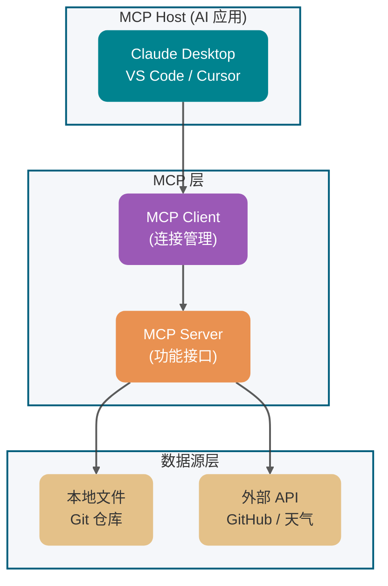
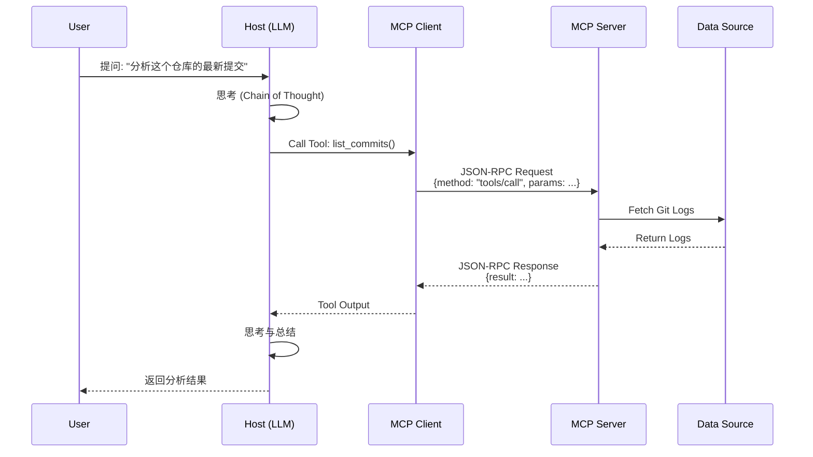

在 LLM 应用开发从“单体调用”向“复杂 Agent”演进的当下，开发者最头疼的其实不是换模型——框架早把不同模型的 API 差异给封装好了。**真正让人抓狂的是工具接入的碎片化**：每次想让 AI 用上 GitHub、本地文件或者 MySQL，就得为 Claude、GPT、DeepSeek 分别写一套适配代码。改一个工具接口，得同步维护好几套代码，又烦又容易出错。

**MCP (Model Context Protocol)** 的出现，就是要终结这种混乱。它被形象地称为 **“AI 领域的 USB-C 接口”**，通过统一的通信协议，让工具开发者**一次开发 MCP Server**，之后所有支持 MCP 的 AI 应用都能直接复用，真正实现模型与外部数据源、工具的高效解耦。

今天 Guide 就来分享几道 MCP 基础概念相关的问题，希望对大家有帮助。本文接近 1.6w 字，建议收藏，通过本文你讲搞懂：

1. ⭐ 什么是 MCP？它解决了什么核心问题？
2. ⭐ MCP、Function Calling 和 Agent 有什么区别与联系？
3. MCP v1.0 的四大核心能力是什么？
4. ⭐ MCP 的四层分层架构是如何运行的？
5. 为什么 MCP 选择了 JSON-RPC 2.0 而非 RESTful？
6. ⭐️ MCP 支持哪些传输方式？
7. ⭐ 生产环境下开发 MCP Server 有哪些必知的最佳实践？

## MCP 基础概念

### ⭐️ 什么是 MCP？它解决了什么问题？

**MCP (Model Context Protocol)** 是 Anthropic 于 2024 年提出的开放协议，被誉为 **"AI 领域的 USB-C 接口标准"**。它通过 JSON-RPC 2.0 统一了 LLM 与外部数据源/工具的通信规范，解决了 AI 应用开发中的**复杂性和碎片化**问题。

它允许 AI 接入数据源（如本地文件、数据库）、工具（如搜索引擎、计算器）以及工作流（如特定提示词），使其能够获取关键信息并执行具体任务。


在 MCP 出现之前，开发者为不同 LLM（OpenAI GPT、Claude、文心一言等）和不同后端系统集成工具时，需要编写大量**定制化的适配代码**。这导致了：

- **重复工作**：同一功能需要为每个 LLM 重新实现。
- **高昂维护成本**：API 变更需要多处同步修改。
- **生态碎片化**：缺乏统一的工具接口标准。

MCP 通过定义**统一的通信协议**，让一次开发的工具可以跨多个 LLM 平台使用，就像 USB-C 接口让不同设备可以通用充电线一样。

> 🌈 **拓展一下**：
>
> MCP 的核心价值在于**解耦和标准化**。就像 HTTP 统一了网页传输、RESTful API 统一了服务接口一样，MCP 统一了 AI 与外部世界的交互方式。这种标准化对于 AI 应用的规模化落地至关重要。

### MCP 的四大核心能力是什么？

MCP v1.0 定义了四种核心能力类型，覆盖了 LLM 与外部交互的主要场景：

| **能力**               | **核心作用**                                                                                                                                                             | **实际场景举例**                                                                                                                                          | **失败路径与边界**                                                                              |
| ---------------------- | ------------------------------------------------------------------------------------------------------------------------------------------------------------------------ | --------------------------------------------------------------------------------------------------------------------------------------------------------- | ----------------------------------------------------------------------------------------------- |
| **Resources (资源)**   | **只读数据流**。让模型能像读取本地文件一样读取外部数据。                                                                                                                 | 自动读取 GitHub Repo 里的文档、数据库中的历史记录                                                                                                         | 文件不存在返回 JSON-RPC 错误码 `-32004`；大文件需实现 **Chunking** 分块加载（建议单块 < 100KB） |
| **Tools (工具)**       | **可执行动作**。模型可以主动触发的代码或 API。                                                                                                                           | 自动运行一段 Python 脚本、在 Slack 发送一条消息、执行 SQL                                                                                                 | **必须幂等设计**：防重试风暴；超时需配置退避策略（Backoff），建议 **P99 延迟 < 200ms**          |
| **Prompts (提示模板)** | **预设指令集**。服务器提供给模型的"标准化操作指南"。                                                                                                                     | "重构这段代码"、"生成周报"等特定业务场景的 Prompt 模板                                                                                                    | 模板渲染失败需返回清晰错误信息                                                                  |
| **Sampling (采样)**    | **让 MCP Server 能够请求 Host 端的 LLM 进行推理生成**。这打破了单向数据流，允许 Server 在获取数据后，利用 Host 强大的 LLM 能力进行总结、理解或生成，再将结果返回给用户。 | 日志分析：Server 读取几万行日志后，请求 Host 的 LLM 总结错误模式和根因。代码审查：代码分析工具提取代码片段，请求 Host 的 LLM 进行语义分析和生成优化建议。 | 超时需退避重试；**P99 协议握手延迟 < 500ms**（注：不包含 LLM 生成耗时）；用户拒绝时需优雅降级   |

> **工程提示**：Tools 的幂等性设计至关重要。由于网络抖动或 LLM 推理不确定性，同一 Tool 可能被重复调用。建议通过唯一请求 ID（idempotency-key）或业务层面的去重机制（如数据库唯一索引）保证幂等。

### 为什么需要 MCP？

#### 1. 弥补 LLM 天然短板

LLM 在以下方面存在局限：

| 短板           | 说明                        | MCP 的解决方案                |
| -------------- | --------------------------- | ----------------------------- |
| **精确计算**   | LLM 不擅长数值计算          | 通过 Tools 调用计算器或 Excel |
| **实时信息**   | 训练数据有截止日期          | 通过 Resources 获取最新数据   |
| **系统交互**   | 无法直接操作本地文件/数据库 | 通过 Tools 桥接系统 API       |
| **定制化操作** | 难以执行特定业务逻辑        | 通过 Tools 封装业务能力       |

#### 2. 简化集成复杂度

**传统方式**：

```
每个 LLM → 各自的 Function Calling 格式 → 定制化适配代码 → 外部系统
```

**使用 MCP 后**：

```
多个 LLM → 统一的 MCP 协议 → 一次开发的 MCP Server → 外部系统
```

#### 3. 扩展 AI 应用边界

MCP 让 LLM 能够：

- 📁 访问本地文件系统，构建个人知识库
- 🗄️ 查询和操作数据库（MySQL、ES、Redis）
- 🌐 调用外部 API（天气、地图、GitHub）
- 🤖 控制浏览器和自动化工具
- 📊 执行数据分析和可视化

### ⭐️ MCP、Function Calling 和 Agent 有什么区别？

这是面试中的高频问题，需要从**定位、层次、关系**三个维度回答：

| 对比维度     | **MCP v1.0**                          | **Function Calling**                                                  | **Agent**      |
| ------------ | ------------------------------------- | --------------------------------------------------------------------- | -------------- |
| **定位**     | **协议标准**                          | **调用机制**                                                          | **系统概念**   |
| **本质**     | 应用层网络协议（JSON-RPC 2.0）        | LLM推理层能力（NL→JSON映射）                                          | 任务执行系统   |
| **状态模型** | 有状态（持久连接，支持能力发现+执行） | 隐状态（多轮对话中保持上下文，如 OpenAI GPT-4o 的 tool_call_id 跟踪） | 可松可紧       |
| **提出方**   | Anthropic (2024)                      | 各模型厂商（OpenAI、Anthropic等）                                     | 学术界/工业界  |
| **耦合度**   | 松耦合（跨平台）                      | 紧耦合（依赖特定模型）                                                | 可松可紧       |
| **实现方式** | 统一的 JSON-RPC                       | 各厂商私有格式                                                        | 多种技术组合   |
| **应用场景** | 工具集成标准化                        | 单次/多次函数调用                                                     | 复杂任务自动化 |

**关系图解：**


**典型场景举例：**

| 场景                        | 使用方案             | 说明                         |
| --------------------------- | -------------------- | ---------------------------- |
| 让 Claude 读取本地文件      | **MCP**              | 需要标准化接口，可跨平台复用 |
| 调用 OpenAI 的 weather_tool | **Function Calling** | 模型原生能力，简单直接       |
| 自动化分析代码并修复 Bug    | **Agent**            | 需要多步规划和决策           |
| 构建团队共享的知识库工具    | **MCP**              | 一次开发，多处使用           |

> 🐛 **常见误区**：
>
> 误区："MCP 会取代 Function Calling"
>
> 纠正：**Function Calling 属于 LLM 的推理层能力**（将自然语言映射为结构化 JSON）。在 OpenAI GPT-4o 等模型中，它通过 `tool_call_id` 在多轮对话中保持**隐状态**，并非严格无状态；而 **MCP 是应用层的网络通信协议**（基于 JSON-RPC 2.0），提供**标准化的跨平台能力发现（Discovery）和执行（Execution）**。两者是不同层次、不同维度的协作关系：MCP 解决"如何跨平台标准化接入工具"，Function Calling 解决"模型如何将自然语言转化为结构化调用"。

## MCP 架构

### ⭐️ MCP 的架构包含哪些核心组件？

MCP 采用**分层架构设计**，包含四个核心组件：



**组件详解：**

| 组件            | 定位        | 职责                                            | 代表产品                                     | 失败路径与性能指标                                                                                                            |
| --------------- | ----------- | ----------------------------------------------- | -------------------------------------------- | ----------------------------------------------------------------------------------------------------------------------------- |
| **MCP Host**    | 用户交互层  | 运行 AI 应用，托管 LLM，管理 MCP Client         | Claude Desktop v1.0、VS Code (Cline)、Cursor | Server 崩溃时需自动重连；建议支持 50+ 并发 Server 连接                                                                        |
| **MCP Client**  | 连接管理层  | 与 MCP Server 建立 1:1 连接，转发 JSON-RPC 请求 | 集成在 Host 内部                             | **失败路径**：断连时需指数退避重连（初始 1s，最大 60s）；**性能指标**：连接建立 P99 < 100ms                                   |
| **MCP Server**  | 能力暴露层  | 实现 MCP 协议，暴露 Resources/Tools 等能力      | 开发者使用 SDK 开发                          | **失败路径**：资源不存在返回 `-32004`，权限不足返回 `-32003`；**性能指标**：Tool 调用 P99 < 200ms，Resources 加载 P99 < 500ms |
| **Data Source** | 数据/服务层 | 提供实际数据或执行操作                          | 文件系统、数据库、外部 API                   | 需实现连接池和熔断，防止级联故障                                                                                              |

**重要特性：**

1. **一对多关系**：一个 Host 可以管理多个 Client，每个 Client 对应一个 Server
2. **解耦设计**：Client 和 Server 通过 JSON-RPC 通信，不依赖具体实现
3. **多实例支持**：可以同时连接多个不同功能的 MCP Server

> 🐛 **常见误区**：
>
> 很多开发者认为 Host 直接连接 Server。实际上，Host 内部会为每个配置的 Server 创建独立的 Client 实例。这种设计使得不同 Server 之间的连接互不影响。

### ⭐️ 请描述 MCP 的完整工作流程

MCP 的工作流程可以分为 **7 个步骤**：



**步骤详解：**

| 步骤               | 描述                                 | 关键点                         |
| ------------------ | ------------------------------------ | ------------------------------ |
| **1. 用户请求**    | 用户通过 Host 发送问题               | Host 首先接收用户输入          |
| **2. LLM 推理**    | Host 内部的 LLM 判断是否需要外部能力 | 使用 Chain of Thought 进行思考 |
| **3. 工具调用**    | LLM 决定调用哪个 Tool                | 通过 Client 发起调用           |
| **4. 协议转换**    | Client 将调用转换为 JSON-RPC 请求    | 标准化的消息格式               |
| **5. Server 处理** | MCP Server 解析请求并访问数据源      | 业务逻辑的真正执行者           |
| **6. 数据返回**    | 结果沿原路返回给 LLM                 | JSON-RPC Response              |
| **7. 最终生成**    | LLM 结合工具结果生成最终回复         | 用户体验的核心环节             |

### MCP 使用什么通信协议？

#### JSON-RPC 2.0

MCP 采用 **JSON-RPC 2.0** 作为应用层通信协议，原因如下：

| 优势         | 说明                                                                                                                                                                                                                         |
| ------------ | ---------------------------------------------------------------------------------------------------------------------------------------------------------------------------------------------------------------------------- |
| **轻量级**   | 相比 gRPC，JSON-RPC 无需通过 Protobuf 进行额外的跨语言编译和桩代码生成，降低了接入阻力。但作为 Trade-off，JSON-RPC 缺乏原生的强类型约束，MCP 必须在应用层强依赖 JSON Schema 对 Tool 的入参进行严格的结构化声明与运行时校验。 |
| **传输无关** | 可以运行在 stdio、HTTP、WebSocket 等多种传输层之上                                                                                                                                                                           |
| **易调试**   | 纯文本格式，便于人工阅读和调试                                                                                                                                                                                               |
| **广泛支持** | 几乎所有编程语言都有成熟的 JSON-RPC 库                                                                                                                                                                                       |

**JSON-RPC 消息格式：**

```json
// 请求
{
  "jsonrpc": "2.0",
  "method": "tools/call",
  "params": {
    "name": "read_file",
    "arguments": { "path": "/path/to/file.txt" }
  },
  "id": 1
}

// 响应
{
  "jsonrpc": "2.0",
  "id": 1,
  "result": {
    "content": [
      {
        "type": "text",
        "text": "文件内容..."
      }
    ]
  },
  "error": null  // error 和 result 互斥
}
```

#### JSON-RPC vs HTTP

| 对比维度     | HTTP (RESTful)               | JSON-RPC                   |
| ------------ | ---------------------------- | -------------------------- |
| **语义模型** | 面向资源 (Resource-Oriented) | 面向操作 (Action-Oriented) |
| **调用方式** | GET/POST/PUT/DELETE + URI    | method 名 + 参数           |
| **数据格式** | 灵活 (JSON/XML/HTML)         | 严格 JSON                  |
| **功能特性** | 丰富 (状态码/缓存/重定向)    | 极简 (仅 RPC 规范)         |
| **适用场景** | 公开 API、Web 服务           | 内部通信、工具调用         |

> 🌈 **拓展阅读**：
>
> - [JSON-RPC 2.0 官方规范](https://www.jsonrpc.org/specification)
> - [A gRPC transport for the Model Context Protocol](https://cloud.google.com/blog/products/networking/grpc-as-a-native-transport-for-mcp)

### ⭐️ MCP 支持哪些传输方式？

#### stdio（标准输入/输出）

| 特性         | 说明                                                    |
| ------------ | ------------------------------------------------------- |
| **适用场景** | 本地进程间通信 (IPC)                                    |
| **实现方式** | Host 启动 MCP Server 作为子进程，通过 stdin/stdout 通信 |
| **优势**     | 极度轻量，无网络开销，启动快                            |
| **典型应用** | Claude Desktop、本地 IDE 插件                           |

**安全提示**：stdio 模式下 MCP Server 与 Host 同权限，恶意 Server 可读取任意文件。生产环境必须采用以下防护措施：

- **系统级隔离**：引入基于 **cgroups** 与 **namespace** 的沙箱（如 Docker/gVisor），建议限制 **CPU < 10%** 配额、内存 < 512MB，防止资源耗尽。
- **进程管理**：配置子进程的 **SIGTERM/SIGKILL** 优雅退出钩子，防止僵尸进程和文件描述符泄漏。
- **源码审计**：审阅社区 Server 的源代码，只使用可信来源的 Server；建议建立沙箱突破审计日志。
- **网络限制**：沙箱内禁止出站网络连接，防范数据外泄。

**HTTP/SSE 模式增强安全**：

- **认证机制**：添加 OAuth 2.0 或 API Key 认证。
- **传输加密**：强制 TLS 1.3，防止中间人攻击。
- **访问控制**：基于 RBAC 限制 Resources 和 Tools 的访问权限。

#### HTTP/SSE（Server-Sent Events）

| 特性         | 说明                             |
| ------------ | -------------------------------- |
| **适用场景** | 远程部署、独立服务               |
| **实现方式** | HTTP POST 发送请求，SSE 推送响应 |
| **优势**     | 易穿透防火墙，支持流式推送       |
| **典型应用** | Web 应用、团队共享的 MCP 服务    |

**选型决策**：


#### 传输层异常与背压分析（生产级考量）

| 风险类型                 | stdio 模式                                                            | HTTP/SSE 模式            | 工程防御手段                                               |
| ------------------------ | --------------------------------------------------------------------- | ------------------------ | ---------------------------------------------------------- |
| **子进程僵死**           | 高：Server 异常退出时，Host 可能未正确回收子进程，产生 Zombie Process | 低：无子进程概念         | 配置 `SIGCHLD` 信号处理器 + `waitpid` 兜底回收             |
| **文件描述符泄漏**       | 高：stdin/stdout 管道未关闭会导致 FD Leak，最终耗尽系统资源           | 中：长连接未及时释放     | 设置 FD 上限（`ulimit -n`），实现连接池健康检查            |
| **长连接中断**           | 中：Server 崩溃导致管道断裂                                           | 高：网络抖动触发重连风暴 | 指数退避重试 + 熔断机制（Circuit Breaker）                 |
| **背压（Backpressure）** | 缺失：stdio 无流量控制机制                                            | 部分：SSE 可控制推送速率 | 实现滑动窗口限流，超出缓冲区时返回 `429 Too Many Requests` |

## 工程实践

### 开发 MCP Server 时有哪些最佳实践？

#### 1. 工具粒度设计 (Tool Granularity)

**原则：单一职责，语义明确**

| 反面示例                         | 正面示例                                                   |
| -------------------------------- | ---------------------------------------------------------- |
| `execute_sql(sql)`               | `get_user_by_id(id)` / `list_active_orders()`              |
| `file_operation(op, path, data)` | `read_file(path)` / `write_file(path, content)`            |
| `database(action, params)`       | `query_userByEmail(email)` / `updateUserProfile(id, data)` |

**设计建议**：

- 工具名称使用**动词+名词**形式：`get_`、`list_`、`create_`、`update_`、`delete_`。
- 参数类型要**明确且可验证**：使用 JSON Schema 定义`。
- 避免过度抽象：不要把多个操作塞进一个工具`。

#### 2. Context Window 管理

MCP 的 Resources 能力可能一次性加载大量文本，导致：

| 问题           | 后果                                     | 解决方案                                                                                                                                                                                                                         |
| -------------- | ---------------------------------------- | -------------------------------------------------------------------------------------------------------------------------------------------------------------------------------------------------------------------------------- |
| 上下文溢出     | LLM 无法处理完整内容                     | 实现**分块 (Chunking)** 逻辑                                                                                                                                                                                                     |
| 中间丢失       | LLM 忽略上下文中间的内容                 | 提供**摘要 (Summarization)**                                                                                                                                                                                                     |
| 成本过高       | Token 消耗过大                           | 实现**按需加载**和**增量同步**                                                                                                                                                                                                   |
| **OOM 风险**   | **内存溢出导致 Server 被 Kill**          | **严格限制单条资源大小（如 < 10MB），超出时返回元数据而非全文**                                                                                                                                                                  |
| **Token 爆炸** | **超出上下文窗口触发截断，丢失关键信息** | **限制绝对字符长度（如 < 1MB）、返回分页元数据，或依赖 Host 端的 Context Window 截断机制**。**注意：**由于 MCP Server 是模型无感知的，严禁硬编码特定模型的 Tokenizer（如 `tiktoken`）进行预计算，否则接入其他 LLM 平台时会失效。 |

#### 3. 错误处理与用户体验

| 错误类型           | 处理方式                   |
| ------------------ | -------------------------- |
| **参数验证失败**   | 返回清晰的错误提示和建议   |
| **权限不足**       | 说明所需权限和申请方式     |
| **服务暂时不可用** | 提供重试机制和预计恢复时间 |
| **部分失败**       | 明确哪些操作成功、哪些失败 |

#### 4. 安全防护

| 风险             | 防护措施                     |
| ---------------- | ---------------------------- |
| **路径遍历攻击** | 验证文件路径，限制访问目录   |
| **SQL 注入**     | 使用参数化查询，禁止拼接 SQL |
| **敏感信息泄露** | 脱敏处理，避免返回完整凭证   |
| **资源滥用**     | 实现速率限制和配额管理       |

#### 5. 调试与监控

**推荐工具**：

- [**MCP Inspector**](https://modelcontextprotocol.io/docs/tools/inspector)：官方调试工具，可模拟 Host 发送请求

  ```bash
  npx @modelcontextprotocol/inspector node my-server.js
  ```

- **日志记录**：记录所有 JSON-RPC 请求和响应
- **性能监控**：跟踪响应时间、错误率、Token 消耗
- **健康检查**：实现 `/health` 端点用于监控

### 如何开发一个自定义的 MCP 服务器？

**开发流程：**

```
1. 选择 SDK
   ├─ TypeScript (官方首选)
   ├─ Python
   └─ Java (Spring AI)

2. 定义能力
   ├─ Resources: 暴露哪些数据？
   ├─ Tools: 提供哪些功能？
   └─ Prompts: 有哪些常用操作模板？

3. 实现业务逻辑
   └─ 连接数据源/服务，实现具体功能

4. 本地测试
   └─ 使用 MCP Inspector 验证

5. 部署配置
   └─ 在 Host 中配置 Server 启动命令
```

**快速示例 (Python SDK)：**

```python
from mcp.server import Server
from mcp.types import Tool, TextContent

# 创建 Server 实例
server = Server("my-mcp-server")

# 定义 Tool
@server.tool()
async def get_weather(city: str) -> str:
    """获取指定城市的天气信息"""
    # 实际业务逻辑
    return f"{city} 今天晴天，温度 25°C"

# 定义 Resource
@server.resource("weather://forecast")
async def weather_forecast() -> str:
    """返回未来一周天气预报"""
    return "未来七天天气预报..."

# 启动 Server
if __name__ == "__main__":
    server.run()
```

**配置示例 (Claude Desktop)：**

```json
{
  "mcpServers": {
    "my-server": {
      "command": "python",
      "args": ["/path/to/my_server.py"],
      "env": {
        "API_KEY": "your-api-key"
      }
    }
  }
}
```

> ⚠️ **工程提示**：在生产环境中，Python MCP Server 依赖 `mcp` SDK，直接使用全局 `python` 命令会因依赖缺失而启动失败。请使用虚拟环境中的 Python 解释器路径（如 `/path/to/venv/bin/python`），或推荐使用现代化包管理器（如 `uvx` 或 `npx`），例如：
>
> ```json
> {
>   "command": "uvx",
>   "args": ["--from", "mcp", "python", "/path/to/my_server.py"]
> }
> ```
>
> 启动失败时，可查看 Claude Desktop 的 `mcp.log` 排查问题。

## 总结

MCP (Model Context Protocol) 是 Anthropic 于 2024 年提出的开放协议，被誉为 **"AI 领域的 USB-C 接口标准"**。它通过 JSON-RPC 2.0 统一了 LLM 与外部数据源/工具的通信规范，解决了 AI 应用开发中的复杂性和碎片化问题。

**1. 四大核心能力**
| 能力 | 作用 |
|-----|------|
| **Resources** | 只读数据流，让模型读取外部数据 |
| **Tools** | 可执行动作，模型可主动触发的代码/API |
| **Prompts** | 预设指令集，标准化操作指南 |
| **Sampling** | 让 Server 能够请求 Host 的 LLM 进行推理生成，在获取数据后利用 LLM 能力进行总结、理解或生成 |

**2. 架构设计**
采用分层架构，包含 **Host → Client → Server → Data Source** 四个核心组件，一对多连接，模型无感知。

**3. 关键区别**

- **MCP** vs **Function Calling**：MCP 是应用层网络协议，Function Calling 是 LLM 推理层能力
- **MCP** vs **Agent**：MCP 是协议标准，Agent 是任务执行系统

**4. 工程实践**

- 工具粒度：单一职责，语义明确
- Context Window 管理：分块加载、按需同步、严格限制资源大小
- 安全防护：路径遍历防御、SQL 注入防护、沙箱隔离

**5. 生产级考量**

- stdio 模式：轻量但同权限，需沙箱隔离
- HTTP/SSE 模式：支持远程部署，需认证和加密
- 失败路径：指数退避重试、熔断机制、连接池管理

MCP 的核心价值在于**"一次开发，跨多 LLM 平台使用"**的解耦设计，为 AI 应用的规模化落地提供了标准化的基础设施。

## 拓展阅读

### 官方资源

- [MCP 官方文档](https://modelcontextprotocol.io/)
- [MCP GitHub 仓库](https://github.com/modelcontextprotocol)
- [MCP Inspector 调试工具](https://github.com/modelcontextprotocol/inspector)

### 社区资源

- [Awesome MCP Servers](https://github.com/punkpeye/awesome-mcp-servers)
- [MCP 官方 SDK](https://github.com/modelcontextprotocol/servers)

### 推荐文章

1. [从原理到示例：Java开发玩转MCP - 阿里云开发者](https://mp.weixin.qq.com/s/TYoJ9mQL8tgT7HjTQiSdlw)
2. [MCP 实践：基于 MCP 架构实现知识库答疑系统 - 阿里云开发者](https://mp.weixin.qq.com/s/ETmbEAE7lNligcM_A_GF8A)
3. [从零开始教你打造一个MCP客户端](https://mp.weixin.qq.com/s/zYgQEpdUC5C6WSpMXY8cxw)
