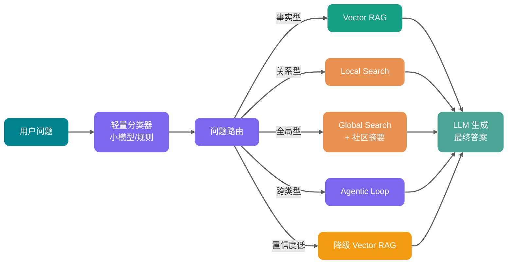

第一次做企业知识库问答时，通常会经历一个很相似的阶段：文档切块、Embedding、向量库、Top-K 检索、把片段塞给大模型。

Demo 很顺，领导问几个制度类问题也能回答。然后业务同事突然问：

> “这几个部门过去半年反复提到的风险点是什么？它们之间有什么关联？”

向量 RAG 就开始力不从心了。

它可能找到几个相似片段，却很难把“部门”“风险”“项目”“供应商”“时间线”这些对象串成一张关系网。更麻烦的是，答案往往来自多份文档的组合推理，而不是某一个 Chunk 里现成的一句话。

这就是 GraphRAG 要解决的问题。

下面 Guide 会把 GraphRAG 的核心概念和工程实践拆开讲清楚，重点放在它和传统向量 RAG 到底差在哪、什么时候该上、什么时候别碰。

全文接近 1w 字，建议先收藏。主要覆盖：

1. RAG 和 GraphRAG 的区别；
2. 知识图谱里的实体关系和社区发现；
3. 全局检索和局部检索各适合什么问题；
4. GraphRAG 的工程落地路线和成本、以及它真正难落地的地方。

## 什么是 RAG？


RAG（Retrieval-Augmented Generation，检索增强生成）就是把信息检索和生成式大语言模型结合起来的框架。

它的核心思想是：在让 LLM 回答问题或生成文本之前，先从数据库、文档集合、企业知识库等外部知识源中检索相关上下文，再把“原始问题 + 检索上下文”一起交给 LLM。这样可以让模型回答得更准确、更及时，也更符合特定领域知识。

传统 RAG 的检索对象通常是 Chunk，也就是一个个文本片段。它很适合回答“答案就在某几个片段里”的问题，比如制度问答、API 文档问答、知识库局部事实查询。

## 什么是 GraphRAG？


GraphRAG（Graph-based Retrieval-Augmented Generation）可以理解为：**在传统向量检索之外引入知识图谱，把文档中的实体、关系和结构化上下文显式建模。检索时除了召回相似片段，还会沿着图关系收集证据，再交给大模型生成答案。**

注意，GraphRAG 的重点不是“用了图数据库”，而是**检索对象变了**。

传统向量 RAG 检索的是 Chunk，也就是一个个文本片段。GraphRAG 检索的是一张“知识关系网”里的节点、边、路径、社区摘要，再结合原始文本证据回答问题。

打个比方：

- **向量 RAG** 像在图书馆里按语义找几页相似内容。
- **GraphRAG** 像先整理出人物关系图、事件时间线和主题目录，再沿着关系线索找证据。

向量 RAG 擅长判断“这段话和我的问题像不像”，GraphRAG 更擅长理解“这些对象之间到底怎么连起来”。

## 传统向量 RAG 有什么局限性？


向量 RAG 的底层逻辑很直接：

1. 把文档切成 Chunk。
2. 用 Embedding 模型把 Chunk 转成向量。
3. 用户提问时，把问题也转成向量。
4. 按相似度召回 Top-K Chunk。
5. 把 Chunk 塞给 LLM 生成答案。

这套方案在“局部事实问答”里很好用。比如：

- “退款流程是什么？”
- “某个 API 的限流规则是多少？”
- “Spring AI 里怎么配置向量数据库？”

因为答案大概率藏在某几个局部片段里，只要召回足够准，模型就能整理出结果。

但复杂知识问答的问题是：**答案往往不在一个片段里，而在片段之间的关系里。**

### 1. Chunk 是信息孤岛

切块是向量 RAG 的必要工程手段，但它天然会打断上下文。

一份文档里，第一章定义了某个系统，第三章写了负责人，第五章提到它依赖的数据库，第七章记录了最近一次事故。切成 Chunk 之后，这些信息分散在不同文本块里。

向量检索只能判断“哪个文本块和问题最像”，却不知道这些文本块在业务上属于同一个对象。

这就是向量 RAG 的典型盲点：**语义相似不等于关系完整。**

### 2. 向量相似度不擅长多跳推理

假设用户问：

> “A 系统的负责人最近参与过哪些和支付链路相关的故障复盘？”

这个问题至少包含几层跳转：

1. 找到 A 系统。
2. 找到 A 系统负责人。
3. 找到这个负责人参与过的故障复盘。
4. 过滤出和支付链路相关的复盘。

向量 RAG 可能召回“A 系统说明”或“支付故障复盘”，但它不天然具备沿着“系统 -> 负责人 -> 复盘 -> 链路”这条关系链路扩展证据的能力。

### 3. 全局性问题很难靠 Top-K 片段回答

还有一类问题更麻烦：

- “这批客户投诉主要集中在哪几类问题？”
- “过去一年公司知识库里反复出现的架构风险是什么？”
- “这几份报告背后共同指向的战略主题是什么？”

这类问题不是找“最相似的几段话”，而是要对整个语料做聚合、归纳和主题分析。Top-K 检索只能看到局部窗口，容易出现两种失败：

- 召回片段太少，看不到整体模式。
- 召回片段太多，Token 成本和噪声一起爆炸。

很多人这时会把 Top-K 从 5 调到 20，再加 rerank，再加查询改写。短期能缓解，但底层问题还在：**你仍然在用片段相似度解决结构推理问题。**

## GraphRAG 和传统向量 RAG 的本质区别


| 维度     | 传统向量 RAG                 | GraphRAG                               |
| -------- | ---------------------------- | -------------------------------------- |
| 检索对象 | 文本 Chunk                   | 实体、关系、路径、社区摘要、原文片段   |
| 核心能力 | 语义相似度召回               | 关系推理、图遍历、全局主题聚合         |
| 数据结构 | 向量索引为主                 | 知识图谱 + 向量索引 + 全文索引         |
| 适合问题 | 局部事实问答、文档片段解释   | 多跳关系问答、跨文档归纳、复杂业务分析 |
| 可解释性 | 主要依赖引用片段             | 可以展示节点、关系、路径和来源         |
| 构建成本 | 中等，重点是切块和 Embedding | 高，重点是抽取、消歧、建模、评测       |
| 查询延迟 | 通常较低                     | 取决于图遍历、社区摘要和 LLM 调用次数  |
| 维护成本 | 更新 Chunk 和向量即可        | 还要维护实体、关系、社区和摘要         |
| 最大风险 | 召回片段不完整               | 图谱构建错误导致系统性误导             |

Guide 的实战建议是：**不要为了追新技术一上来就 GraphRAG。先用向量 RAG 做基线，把失败案例收集出来；只有当失败集中在关系、多跳、全局归纳这些问题上时，再引入图结构。**

补充一张数量级参考（实际数值与语料规模、实体密度、配置强相关）：

| 成本维度            | 向量 RAG       | GraphRAG（参考值）                                          |
| ------------------- | -------------- | ----------------------------------------------------------- |
| **索引 Token 消耗** | Embedding 为主 | 约为向量 RAG 的 **5-20 倍**（与社区层级数、实体密度强相关） |
| **存储开销**        | 向量索引       | Vector + Graph + Full-text 三套索引，约 **1.5-3 倍**        |
| **查询延迟**        | 通常较低       | 局部图检索 ×1.2-2；全局检索（社区摘要聚合）可达 **5-10 倍** |
| **维护频率**        | 可近实时更新   | 图谱增量更新通常每日/每周批处理                             |

如果面试官问“GraphRAG 和普通 RAG 有什么区别”，可以这样答：

> 普通向量 RAG 主要检索文本 Chunk，适合局部事实问答；GraphRAG 会把文档中的实体、关系和主题结构显式建模成知识图谱，查询时不仅可以按语义找片段，还可以沿着图关系做多跳检索，或者利用社区摘要回答全局问题。它的优势是关系推理、全局归纳和可解释性更好，代价是构建成本、实体消歧、关系抽取、增量更新和权限控制都更复杂。

如果继续追问“什么时候不用 GraphRAG”，可以补一句：

> 如果问题主要是简单文档问答，或者数据量小、关系不复杂，向量 RAG 加混合检索和 rerank 往往更划算。GraphRAG 应该用在向量 RAG 的 badcase 已经明确指向多跳关系、跨文档归纳和结构化约束的场景。

## GraphRAG 的核心概念

理解 GraphRAG，先把几个关键词拆开。


### 知识图谱：把知识变成可遍历的关系网

**知识图谱（Knowledge Graph）** 本质上是一种用“节点 + 边”表达知识的结构。

- **节点（Node）**：表示实体或概念，比如用户、系统、订单、故障、供应商、政策条款。
- **边（Edge）**：表示实体之间的关系，比如负责、依赖、影响、属于、导致、引用。
- **属性（Property）**：挂在节点或边上的补充信息，比如时间、版本、置信度、来源文档。

举个例子：

```text
用户服务 --依赖--> Redis 集群
Redis 集群 --发生过--> 连接池耗尽事故
连接池耗尽事故 --影响--> 下单接口
张三 --负责--> 用户服务
```

这几行关系放在图里之后，系统就能回答：

> “张三负责的系统最近有哪些影响下单链路的风险？”

向量 RAG 看到的是几段文字；知识图谱看到的是对象与对象之间的连接。

### 实体：GraphRAG 的最小业务对象

**实体（Entity）** 是图谱里的核心节点。

在 GraphRAG 里，实体不一定是传统知识图谱里非常严格的“人名、地点、组织”。它也可以是：

- 一个业务系统，比如“订单中心”
- 一个技术组件，比如“Kafka 消费组”
- 一个规范条款，比如“数据脱敏要求”
- 一个风险主题，比如“权限绕过”
- 一个项目事件，比如“支付链路压测”

实体抽取得好不好，直接决定 GraphRAG 的上限。抽得太粗，图谱没有细节；抽得太碎，图谱里到处都是重复节点和噪声。

这一步很像做领域建模。工程实践中的几个要点：

- **用 JSON Schema 强约束抽取格式**：避免自由文本解析，降低后处理成本。
- **Few-shot 示例要覆盖正例、反例和边界例**：告诉 LLM 什么不该抽。
- **设置最大实体数上限**：防止 LLM 在长文本中过度抽取。
- **每个实体强制要求 `source_text_span` 字段**：用于溯源和人工校验。

### 关系：GraphRAG 真正比向量 RAG 多出来的东西

**关系（Relationship）** 是 GraphRAG 的灵魂。

向量 RAG 可以告诉你“订单中心”和“支付故障”在语义上相近，但它不会天然告诉你二者之间是“依赖”“影响”“导致”还是“只是同时出现”。

GraphRAG 会尝试把关系显式化：

```text
订单中心 --调用--> 支付网关
支付网关 --依赖--> 风控服务
风控服务 --导致过--> 交易超时
```

有了关系，检索就不只是“相似度排序”，而是可以沿着路径扩展：

- 从一个实体找邻居。
- 从一类关系找上下游。
- 从一个事故找影响范围。
- 从一个主题找相关社区。

这也是 GraphRAG 能处理多跳问题的关键。

### 社区发现：从一堆节点里找主题群

**社区发现（Community Detection）** 是图算法里的常见任务，目标是把图里连接更紧密的一组节点聚成一个社区。

在 GraphRAG 里，社区可以理解为“语料中自然形成的主题群”。比如一批文档里反复出现这些节点：

```text
支付网关、风控服务、交易超时、限流策略、灰度发布、告警升级
```

它们之间关系密集，很可能构成“支付稳定性”社区。

一种常见 GraphRAG 做法是：先从文本中抽取实体、关系和关键声明，再用 Leiden 等**社区发现（Community Detection）**算法构建层级社区，最后为每个社区生成摘要。常见算法包括 Leiden、Louvain 等。这样查询全局问题时，不必把所有原始文档都塞给 LLM，而是先看更高层的社区摘要。

### 全局检索和局部检索

GraphRAG 里经常会看到两个词：**全局检索（Global Search）** 和 **局部检索（Local Search）**。

它们对应两类完全不同的问题。

**局部检索** 适合回答围绕具体实体的问题：

- “订单中心依赖哪些服务？”
- “某个供应商影响了哪些项目？”
- “某个故障的上下游链路是什么？”

它的典型流程是：先定位实体，再沿着实体邻居、关系路径、相关原文片段扩展上下文。

**全局检索** 适合回答跨语料的整体性问题：

- “这批报告里反复出现的风险主题是什么？”
- “客服投诉主要聚成哪几类？”
- “研发文档里最常见的架构瓶颈是什么？”

它的典型流程是：先利用社区摘要或主题摘要做聚合，再让 LLM 进行归纳和排序。

一句话区分：

- **局部检索是从一个点往外扩。**
- **全局检索是先看整张图的主题结构。**

**DRIFT Search**：局部检索的增强版，从实体邻居扩展时同时引入社区摘要作为附加上下文，平衡精确性和全局视野。当你的问题既有实体焦点又需要跨社区关联时，DRIFT 比纯局部检索更有优势。

| 检索模式      | 适用场景              | 核心机制                  |
| ------------- | --------------------- | ------------------------- |
| Basic Search  | 普通事实查询          | 标准 Top-K 向量检索       |
| Local Search  | 围绕特定实体的问答    | 从实体邻居和关联概念扩展  |
| DRIFT Search  | 实体焦点 + 跨社区关联 | 局部扩展 + 社区摘要上下文 |
| Global Search | 全局主题归纳          | 社区摘要 Map-Reduce       |

## GraphRAG 的构建和查询流程

### 构建阶段：从文档到图谱

下面这张图展示 GraphRAG 的核心链路：


GraphRAG 的构建阶段通常包含这些步骤：

| 步骤     | 做什么                                       | 关键风险                                 |
| -------- | -------------------------------------------- | ---------------------------------------- |
| 文档解析 | 从 PDF、网页、Markdown、数据库记录中提取文本 | OCR 错误、表格丢结构、文档版本混乱       |
| 文本切分 | 把长文档切成 TextUnit 或 Chunk               | 切分太碎会丢关系，切分太大会增加抽取成本 |
| 实体抽取 | 识别文档里的系统、人、组织、概念、事件       | 同名实体、别名、缩写、噪声实体           |
| 关系抽取 | 识别实体之间的依赖、包含、影响、因果等关系   | 关系方向错、关系类型泛化、置信度不足     |
| 图谱归一 | 合并重复实体，补充属性和来源                 | 实体消歧成本高，需要人工规则和评测       |
| 社区发现 | 找出连接密集的主题群                         | 图太稀或太脏时社区质量会下降             |
| 摘要生成 | 为社区、实体、关系生成摘要                   | LLM 摘要可能丢约束或引入幻觉             |
| 索引入库 | 写入图数据库、向量库、全文索引               | 增量更新和权限过滤复杂                   |

这也是 GraphRAG 落地成本高的根本原因：它把“检索前处理”从简单的文本切块，升级成了一个知识建模和数据治理工程。

### 查询阶段：先判断问题类型

GraphRAG 的查询阶段最关键的一步是**查询路由**。

用户问的问题不同，检索方式也不同：

| 问题类型 | 更适合的检索方式     | 示例                                     |
| -------- | -------------------- | ---------------------------------------- |
| 局部事实 | 向量检索或局部图检索 | “某个接口的超时时间是多少？”             |
| 实体关系 | 局部图检索           | “订单中心依赖哪些服务？”                 |
| 多跳推理 | 图遍历 + 向量补证据  | “某负责人参与过哪些影响支付链路的事故？” |
| 全局归纳 | 社区摘要 + 全局检索  | “这批报告的主要风险主题是什么？”         |
| 精确过滤 | 图查询或结构化查询   | “2025 年 Q4 哪些项目依赖供应商 A？”      |

下面这张图展示问题类型到检索模式的映射：


一个成熟系统不会把所有问题都扔给 GraphRAG。很多简单问题，用向量检索更便宜、更快、更稳。

## GraphRAG 适合什么场景？不适合什么场景？

GraphRAG 最适合“关系比文本相似度更重要”的场景。

它不是向量 RAG 的默认升级包，而是一套更重的数据治理和检索架构。判断要不要上 GraphRAG，核心不是“技术新不新”，而是看问题失败的原因是不是集中在关系、路径、全局主题和跨文档归纳上。

适合上 GraphRAG 的典型场景有这些：

- **企业知识库的复杂问答**：问题需要跨部门、跨制度、跨项目复盘串联信息，比如“这个流程涉及哪些部门？每个部门承担什么职责？”“某条制度和哪些历史制度冲突？”。
- **IT 架构和故障影响分析**：服务、接口、数据库、消息队列、负责人、告警、事故之间天然有依赖关系，比如“Redis 集群异常会影响哪些核心接口？”“哪些系统同时依赖一个高风险组件？”。
- **金融、风控、合规、供应链**：这些领域更关心对象之间的关系，而不是文本片段是否相似，比如客户和账户、企业和实控人、供应商和项目、合同条款和监管规则之间的关系。
- **跨文档主题归纳**：当你要分析访谈记录、调研报告、客服工单、事故复盘的整体模式时，社区摘要可以先把语料聚成主题群，再让 LLM 做全局归纳。

不适合上 GraphRAG 的情况也很明确：

- **数据量小、问题简单**：如果知识库只有几十篇文档，问题基本都是“某个规则是什么”，向量 RAG 加混合检索和 rerank 往往更划算。
- **文档质量太差**：如果源文档主语缺失、版本混乱、术语不统一、表格解析错误严重，抽出来的图谱也会很脏。向量 RAG 的错误通常是“找错几段文本”，GraphRAG 的错误可能是“整张关系网方向错了”。
- **实时性要求极高**：实体关系抽取、社区发现、摘要生成都会增加更新成本。如果数据必须秒级可见，就要谨慎评估增量图更新和摘要刷新成本。
- **团队缺少图建模和评测能力**：GraphRAG 需要持续回答“哪些实体值得建模、关系类型怎么设计、实体如何消歧、图谱错误怎么评测、权限过滤放在哪里”等问题。如果没人负责这些问题，它很容易变成昂贵但不可控的黑盒。

一句话总结：如果失败原因只是“没搜到那段话”，先优化检索；如果失败原因是“搜到了很多话，但系统不理解它们之间的关系”，再考虑 GraphRAG。

## Neo4j GraphRAG 适合解决什么问题？

GraphRAG 不是只有一种实现方式。更准确地说，它是一类“把图结构引入检索增强”的工程路线。相比离线生成一套大而全的图谱摘要，Neo4j GraphRAG 更偏“以图数据库为中心的在线检索架构”，适合把 LLM 接到企业已有关系网络上。

它的核心思路是：把知识图谱放在 Neo4j 这样的图数据库里，同时结合向量索引、全文索引和 Cypher 查询。查询时可以先通过向量检索找到起点节点，再沿着图关系扩展邻居、路径和上下游证据。

典型模式是：

1. 用户问题先做 Embedding 或关键词检索。
2. 在图中找到相关实体或文档节点作为起点。
3. 用 Cypher 沿着关系遍历，找到邻居节点、路径和属性。
4. 把路径、节点属性、原文片段组装成上下文。
5. 让 LLM 基于这些结构化证据回答。

Neo4j 官方提供了 `neo4j-graphrag` Python 包，包含知识图谱构建、向量索引、GraphRAG 生成流程和多种 retriever。它不是只能做“向量召回 + 图遍历”，而是可以按问题类型选择不同检索模式。

| 检索模式                                    | 做法                                                              | 适合问题                                           |
| ------------------------------------------- | ----------------------------------------------------------------- | -------------------------------------------------- |
| **VectorRetriever**                         | 基于 Neo4j 向量索引做相似度检索，返回匹配节点和分数               | 普通语义检索、找候选实体                           |
| **VectorCypherRetriever**                   | 先向量检索命中节点，再执行 Cypher 查询扩展上下文                  | “找到相似文档后，把相关实体、路径、属性一起带回来” |
| **HybridRetriever / HybridCypherRetriever** | 结合向量索引和全文索引，必要时再用 Cypher 补图上下文              | 关键词和语义都重要的企业知识库                     |
| **Text2Cypher**                             | LLM 根据图 Schema 生成 Cypher，查询结果再交给 LLM 组织答案        | 精确结构化过滤、多条件查询、报表类问答             |
| **ToolsRetriever**                          | 把多个 retriever 包装成工具，让 LLM 按问题意图选择                | 复杂问题路由、多检索器组合                         |
| **外部向量库 + Neo4j**                      | 向量存在 Weaviate、Pinecone、Qdrant 等系统里，再映射回 Neo4j 节点 | 已有向量基础设施，不想把全部向量迁入 Neo4j         |

其中最有工程价值的是 **VectorCypherRetriever** 和 **Text2Cypher**。

VectorCypherRetriever 的优势是稳：向量检索只负责找起点，真正的上下文由可控的 Cypher 查询补齐。比如命中“支付网关”节点后，再沿着 `[:DEPENDS_ON]`、`[:AFFECTS]`、`[:OWNER]` 这些关系取上下游、影响范围和负责人，结果更容易解释。

Text2Cypher 的优势是准：它可以把“2025 年 Q4 哪些高优先级项目依赖供应商 A？”这类问题转成结构化查询。但这类模式一定要控制边界，至少要做 Schema 白名单、查询校验、只读权限、结果数量限制和超时控制。高风险场景里，更推荐先用查询模板或语义层工具，而不是完全放开 LLM 自由写 Cypher。

比如金融风控、供应链、IT 资产管理、权限治理、故障影响分析，这些领域里的对象关系本来就很重要。Neo4j GraphRAG 的优势是：**让 LLM 接入已有业务关系，而不是每次都从文本里临时猜关系。**

## 还有哪些 GraphRAG 相关实现？

除了 Neo4j，还有几条常见路线值得了解。

| 实现路线                          | 核心思路                                                                                                | 适合情况                                                                 |
| --------------------------------- | ------------------------------------------------------------------------------------------------------- | ------------------------------------------------------------------------ |
| **LangChain + Neo4j**             | 用 `Neo4jGraph` 连接 Neo4j，用 `GraphCypherQAChain` 等组件把自然语言转成 Cypher，再基于查询结果生成答案 | 已经在用 LangChain / LangGraph，希望快速把图数据库接入 Agent 或 RAG 链路 |
| **LlamaIndex PropertyGraphIndex** | 通过 `kg_extractors` 从文档 Chunk 中抽取实体和关系，构建可查询的属性图索引                              | 文档 ingestion、索引和查询本来就在 LlamaIndex 体系里                     |
| **FalkorDB GraphRAG SDK**         | 基于支持 OpenCypher、全文索引、向量相似度和范围索引的图数据库做 GraphRAG                                | 想尝试 Neo4j 之外的图数据库，或者更关注低延迟、多租户图查询              |
| **轻量自研图谱 + 向量库**         | 用业务表或边表保存少量核心实体关系，向量库只负责召回候选文本，再用关系表补上下文                        | 第一版验证 GraphRAG 是否有价值，不想一开始就引入完整图数据库             |

这些路线的差异不在“谁更高级”，而在你要把复杂度放在哪里。

如果你已经有稳定的业务图谱、明确的实体关系和较强的结构化查询需求，Neo4j GraphRAG 是最自然的主线。如果你的工程栈已经押在 LangChain 或 LlamaIndex 上，优先复用它们的图检索组件会更省集成成本。如果只是想验证“关系扩展是否能改善答案”，轻量自研图谱反而更适合第一版。

## GraphRAG 真正难落地在哪里？

GraphRAG 最容易被低估的地方，不是图数据库本身，而是“把一堆文本变成可用关系网”之后，还要长期维护它。

普通向量 RAG 的核心工作是解析文档、切 Chunk、写向量、做召回。GraphRAG 多出来的是一整套关系工程：实体要抽得准，关系方向不能错，图谱要能更新，权限不能泄露，效果还要能评测。

### 1. 实体容易抽重、抽错、抽太碎

同一个实体可能有多个名字：

```text
订单中心、订单服务、order-service、OMS
```

它们到底是不是同一个实体？什么时候合并，什么时候拆开？

这件事不能全靠 LLM 猜。生产里通常要配：

- 术语词典
- 别名表
- 规则匹配
- 人工校验
- 置信度阈值
- 评测集

实体消歧做不好，图谱会变成一堆重复节点，检索路径也会断。

### 2. 关系方向一错，答案就会系统性跑偏

关系比实体更容易出错。

“A 依赖 B”和“B 依赖 A”只差一个方向，但工程含义完全相反。因果关系、影响关系、包含关系也很容易被 LLM 抽错。

生产环境里，建议给关系加上这些字段：

| 字段                       | 作用                            |
| -------------------------- | ------------------------------- |
| `source_doc_id`            | 追溯来源文档                    |
| `source_span`              | 追溯原文位置                    |
| `confidence`               | 记录抽取置信度                  |
| `relation_type`            | 控制关系类型                    |
| `updated_at`               | 支持增量更新                    |
| `extraction_model_version` | LLM 升级后做差量重抽和 A/B 对比 |

没有来源追溯的图谱，不建议直接用于高风险问答。

### 3. 社区摘要不是免费的

以社区摘要为核心的 GraphRAG 方案，强项是全局归纳，但摘要不是免费的。

构建阶段需要 LLM 调用：

- 抽取实体和关系。
- 生成实体描述。
- 生成社区摘要。
- 后续版本更新时刷新相关摘要。

如果语料很大，索引成本可能明显高于普通向量 RAG。建议先用小语料验证收益，再决定是否引入多层社区摘要和全局检索。

### 4. 更新一篇文档，可能牵动一片图

普通向量 RAG 更新一篇文档，通常是删除旧 Chunk，再写入新 Chunk 和向量。

GraphRAG 更新一篇文档，可能影响：

- 实体节点
- 关系边
- 社区划分
- 社区摘要
- 实体摘要
- 向量索引
- 权限索引

如果每次都全量重建，成本高；如果做增量更新，工程复杂度高。

这也是 GraphRAG 比普通 RAG 更像数据工程的地方：它不是只维护索引，而是在维护一个会持续变化的知识结构。

### 5. 权限过滤不能只看文档级别

企业知识库绕不开权限。

向量 RAG 里，常见做法是在检索前或检索时做元数据过滤。GraphRAG 里还要考虑：

- 用户能看某个节点，但能不能看它的邻居？
- 用户能看某条边，但能不能看边连接的另一个实体？
- 社区摘要里是否混入了无权限文档的信息？
- 全局摘要会不会泄露敏感主题？

特别是社区摘要，它可能由多份文档共同生成。如果其中一部分文档对当前用户不可见，摘要就可能变成隐性泄露点。应对策略：

- **社区摘要按权限分组生成**：每个权限组独立生成摘要，查询时只返回用户有权限的社区摘要。
- **摘要溯源字段保留所有源文档 ID**：查询时校验用户权限与源文档 ID 的交集，过滤无权限的证据。
- **高敏感语料不参与社区聚合**：单独走局部检索通道，避免跨文档泄露。

## 你会如何在项目中落地 GraphRAG?

Guide 不建议一开始就上完整 GraphRAG。更稳的路径是分阶段演进。

### 阶段一：先做好向量 RAG 基线

先把基础能力做扎实：

- 文档解析稳定。
- Chunk 策略可评测。
- 向量检索 + BM25 混合检索。
- rerank 可插拔。
- 引用来源可追溯。
- 权限过滤可靠。

如果这些都没做好，上 GraphRAG 只会把问题复杂化。

### 阶段二：收集关系型失败案例

不要凭感觉判断是否需要 GraphRAG。建议把 RAG 的 Badcase 分类：

| Badcase 类型           | 是否适合 GraphRAG            |
| ---------------------- | ---------------------------- |
| 单纯没召回关键词       | 先优化 BM25 和 query rewrite |
| Chunk 切分不合理       | 先优化 Chunking              |
| 需要跨实体关系推理     | 适合引入图结构               |
| 需要全局主题归纳       | 适合引入社区摘要             |
| 需要精确过滤和权限约束 | 适合结合结构化查询           |

只有当 badcase 明确集中在关系和全局归纳上，GraphRAG 才有性价比。

### 阶段三：从轻量图谱开始

第一版不一定要做完整知识图谱。

可以先做一个轻量版：

- 只抽取核心实体，比如系统、接口、负责人、事故、制度条款。
- 只保留少量高价值关系，比如依赖、负责、影响、属于、引用。
- 图谱只用于检索扩展，不直接用于最终事实判断。
- 每条关系都保留原文证据。

这样能用较低成本验证 GraphRAG 是否真的改善业务指标。

### 阶段四：再引入社区发现和全局检索

当语料规模变大，且全局性问题增多，再考虑社区发现和社区摘要。

这个阶段要重点评测：

- 社区划分是否符合业务直觉。
- 社区摘要是否遗漏关键约束。
- 全局回答是否有稳定引用。
- 不同权限用户看到的摘要是否安全。

如果评测跟不上，不要把全局检索开放给高风险场景。

### 阶段五：引入 Hybrid RAG 路由（可选的终极形态）

阶段四之后，成熟系统通常不是纯 GraphRAG，而是按问题类型动态路由的混合架构：



关键设计点：入口分类器要可解释、降级策略要明确、路由日志要可回溯。

## GraphRAG 评测怎么落地？

全文反复强调“评测闭环”重要性，但具体怎么评？推荐三个层次：

### 检索层指标

- **实体召回率 / 关系召回率**：评测检索结果是否覆盖了回答所需的实体和关系
- **社区一致性**：社区划分是否符合业务直觉，可用人工抽检

### 生成层指标

- **Faithfulness（忠实度）**：生成回答是否忠实于检索到的上下文，推荐用 RAGAS 框架
- **Answer Relevance（答案相关性）**、**Context Precision（上下文精确度）**

### 业务层指标

- **用户采纳率、转人工率、引用点击率**：最终业务效果
- **回归测试集**：建议每周新增 20-50 条业务真实问题，长期累积到千条级

## 与其他 RAG 增强路线的对比

GraphRAG 不是唯一的 RAG 增强路线，了解横向坐标有助于做技术选型：

| 方案                                   | 解决的问题            | 未解决的问题 |
| -------------------------------------- | --------------------- | ------------ |
| **多向量（ColBERT/Late Interaction）** | Chunk 内细粒度匹配    | 关系问题     |
| **HyDE / Query Rewriting**             | query 与 doc 表述差异 | 多跳推理     |
| **Self-RAG / Corrective RAG**          | 答案可信度            | 检索结构     |
| **GraphRAG**                           | 关系 + 全局归纳       | 成本最高     |

GraphRAG 是目前唯一系统性解决“关系推理 + 全局归纳”的方案，但代价也最高。

<!-- @include: @rag-project.snippet.md -->

## 总结

GraphRAG 的价值不在于听起来高级，而在于它补上了传统向量 RAG 的一个结构性短板：**向量检索擅长找相似片段，但不擅长理解片段之间的关系。**

GraphRAG 把检索对象从文本 Chunk 扩展到了实体、关系、路径、社区摘要。它适合多跳推理、影响分析、归因分析和复杂业务问答，但代价是数据治理成本更高。Neo4j GraphRAG 适合已有业务关系的场景；LangChain/LlamaIndex 等适合现有技术栈集成。选哪条路线，看你的技术栈、图模型复杂度和运维能力。

最后给一个非常务实的判断标准：如果你的 RAG 失败原因只是“没搜到那段话”，先优化检索；如果失败原因是“搜到了很多话，但系统不理解它们之间的关系”，再考虑 GraphRAG。

## 参考资料

- [Neo4j：What Is GraphRAG?](https://neo4j.com/blog/genai/what-is-graphrag/)
- [Neo4j GraphRAG Python Package](https://neo4j.com/docs/neo4j-graphrag-python/current/)
- [Neo4j GraphRAG RAG User Guide](https://neo4j.com/docs/neo4j-graphrag-python/current/user_guide_rag.html)
- [LangChain Neo4j Integration](https://docs.langchain.com/oss/python/integrations/graphs/neo4j_cypher)
- [LlamaIndex PropertyGraphIndex](https://developers.llamaindex.ai/python/framework/module_guides/indexing/lpg_index_guide/)
- [FalkorDB Docs](https://docs.falkordb.com/)
- [GraphRAG：从 RAG 到 GraphRAG 的企业知识检索实践](https://juejin.cn/post/7618261670406438964)
- [RAGAS 评测框架](https://docs.ragas.io/)
