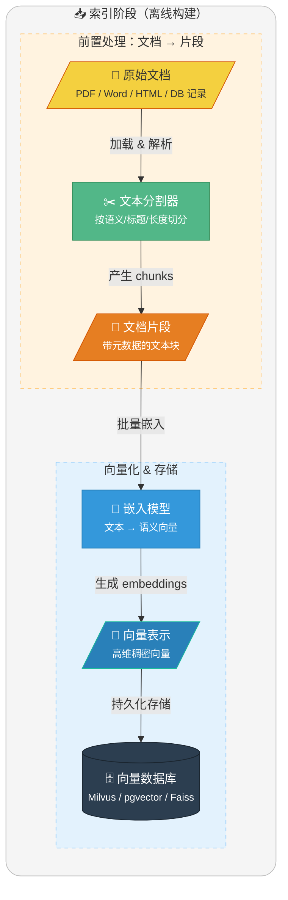
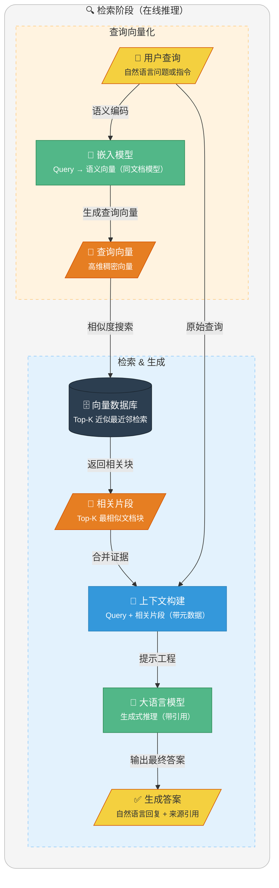

<!-- @include: @article-header.snippet.md -->

去年面字节的时候，面试官问我：“你们项目里的知识库问答是怎么做的？” 我说：“直接调 OpenAI 的 API，把文档塞进去让模型自己读。”

空气突然安静了三秒。我看到面试官的眉头皱了一下，才意识到事情不对——当时我们项目的文档有 20 多万字，每次请求都超 Token 上限，而且模型根本记不住上周刚更新的接口文档。

面试被挂后才懂：这叫“裸调 LLM”，而正确的做法应该是 RAG。

段子归段子，RAG（检索增强生成）确实是当下 LLM 应用开发的核心技术栈，也是面试中的高频考点。今天 Guide 分享几道 RAG 基础概念相关的面试题，希望对大家有帮助：

1. ⭐️ 什么是 RAG？
2. ⭐️ 为什么需要 RAG？
3. RAG 的常见用途有哪些？
4. ⭐️ 既然这些场景这么好，为什么有些企业还是宁愿用传统搜索而不是 RAG？
5. RAG 工作原理
6. RAG 与传统搜索引擎的区别是什么？
7. ⭐️ RAG 的核心优势和局限性分别是什么？

## ⭐️ 什么是 RAG？

**RAG (Retrieval-Augmented Generation，检索增强生成)** 是一种将强大的**信息检索 (Information Retrieval, IR)** 技术与**生成式大语言模型 (LLM)** 相结合的框架。

RAG 的核心思想是：在让 LLM 回答问题或生成文本之前，先从一个大规模的知识库（如数据库、文档集合）中检索出相关的上下文信息，然后将这些信息与原始问题一并提供给 LLM，从而“增强”其生成能力，使其能够产出更准确、更具时效性、更符合特定领域知识的回答。

## ⭐️ 为什么需要 RAG？

尽管 LLM 本身拥有海量的知识，但它依然面临三个核心挑战，而 RAG 正是解决这些挑战的有效方案：

**1. 解决知识时效性问题（对抗“知识截止”）**

预训练的 LLM 的知识被固化在其 **训练数据的截止时间点（Knowledge Cutoff）**。例如，GPT-4 的知识库可能截止于 2023 年 12 月。对于此后发生的新事件、新知识，LLM 无法直接给出准确答案。RAG 通过 **动态检索外部知识源**，为 LLM 提供“实时”的知识补充，从而克服了知识过时的问题。

**2. 打通私有数据访问（支撑企业级应用）**

出于数据安全和商业机密的考虑，企业内部的 **私有数据**（如产品文档、内部知识库、客户数据等）无法被公开的 LLM 直接访问。RAG 技术能够安全地连接这些私有数据源，在用户提问时，仅将与问题相关的片段信息提取出来提供给 LLM，使其能够在 **不泄露全部数据** 的前提下，基于企业自身的知识进行回答，实现真正可用的企业级智能应用。

**3. 提升回答的准确性与可追溯性（对抗“模型幻觉”）**

LLM 有时会产生 **“幻觉（Hallucination）”** ，即编造不符合事实的信息。RAG 通过提供明确的、有据可查的参考文本，强制 LLM 的回答 **基于检索到的事实**，大大降低了幻觉的发生率。同时，由于可以展示引用的原文，使得答案的 **来源可追溯、可验证**，增强了系统的可靠性和用户的信任度。

## RAG 的常见用途有哪些？

RAG（检索增强生成）最适合用在 **“答案依赖外部资料、且资料会变化/很长”** 的场景：先从知识库检索相关内容，再让大模型基于检索结果生成回答，从而减少胡编、提升可追溯性。

下面列举几个最常见的场景：

- **客服机器人**：基于产品知识库做问答、排障、流程引导；例：“如何退换货/开发票？”“某型号设备报错码怎么处理？”
- **研发/运维 Copilot**：检索代码库、接口文档、告警手册，辅助定位问题与生成修复建议。
- **医疗助手**：检索指南/药品说明/院内规范后生成辅助建议（不做最终诊断）；例：“某药禁忌是什么？”“依据指南解释检查指标含义”。
- **法律咨询**：基于法规条文/案例/合同模板检索，生成条款解释与风险提示；例：“违约金如何计算？”“不可抗力条款怎么写更稳妥？”
- **教育辅导**：从教材/讲义/题库检索知识点，生成讲解与例题步骤；例：“这道题对应哪个公式？怎么推导？”
- **企业内部助手**：连接制度、SOP、会议纪要、技术文档做检索/总结/对比；例：“某流程最新版本是什么？”“对比两份方案差异并给结论”。
- **其他**：投研/合规/审计（报告/披露/内控）；销售/方案支持（产品手册/标书模板、生成方案并标注出处）。

## ⭐️ 既然这些场景这么好，为什么有些企业还是宁愿用传统搜索而不是 RAG？

因为 RAG 存在推理成本和响应延迟的问题。在某些纯粹为了“找文件”而非“总结答案”的简单场景，传统搜索依然具备极致的效率优势。

下面简单对比一下二者：

| 维度          | 传统搜索（搜索框）                       | RAG（检索+生成）                                 |
| ------------- | ---------------------------------------- | ------------------------------------------------ |
| 用户目标      | 找到文档/页面/附件                       | 直接得到可读答案/总结/对比结论                   |
| 延迟与成本    | 极低、易扩展                             | 更高（检索+LLM 推理）                            |
| 可控性/可审计 | 强：给原文链接                           | 弱一些：可能误解/总结偏差，需要引用与评测        |
| 风险          | 低（主要是召回排序）                     | 更高（幻觉、引用错误、越权泄露）                 |
| 数据治理      | 相对成熟（ACL、字段过滤）                | 更复杂（检索过滤+上下文脱敏+日志）               |
| 适用场景      | 编号/标题/关键词检索、找模板、找制度原文 | 客服解答、技术排障、制度解读、跨文档总结对比     |
| 最佳实践      | ES/BM25 + 权限过滤                       | 混合检索 + 重排 + 引用溯源 + 权限过滤 + 评测闭环 |

## RAG 工作原理

RAG 过程分为两个不同阶段：**索引**和**检索**。

在索引阶段，文档会进行预处理，以便在检索阶段实现高效搜索。该阶段通常包括以下步骤：

1. **输入文档**：文档是需要被处理的内容来源，可能是文本文件、PDF、网页、数据库记录等。
2. **清理文档**：对文档进行去噪处理，移除无用内容（如 HTML 标签、特殊字符）。
3. **增强文档**：利用附加数据和元数据（如时间戳、分类标签）为文档片段提供更多上下文信息。
4. **文档拆分（Chunking）**：通过文本分割器（Text Splitter）将文档拆分为较小的文本片段（Segments），严格适配嵌入模型和生成模型的上下文窗口限制（Context Window）。
5. **向量化表示 (Embedding Generation)**：通过嵌入模型（如 OpenAI text-embedding-3 或 Hugging Face 上的开源模型）将文本片段映射为语义向量表示（Document Embedding，也就是高维稠密向量）。
6. **存储到向量数据库**：将生成的嵌入向量、原始内容及其对应的元数据存入向量存储库（如 Milvus, Faiss 或 pgvector）。

索引过程通常是离线完成的，例如通过定时任务（如每周末更新文档）进行重新索引。对于动态需求，例如用户上传文档的场景，索引可以在线完成，并集成到主应用程序中。

**索引阶段的简化流程图如下**：

检索通常在线进行的，当用户提交一个问题时，系统会使用已索引的文档来回答问题。该阶段通常包括以下步骤：

1. **接收请求：** 接收用户的自然语言查询（Query），例如一个问题或任务描述。在某些进阶场景中，系统会先对原始查询进行改写或扩充，以提高后续检索的覆盖率。
2. **查询向量化：** 使用嵌入模型（Embedding Model）将用户查询转换为语义向量表示（Query Embedding，也就是高维稠密向量），以捕捉查询的语义信息。
3. **信息检索 (R)：** 在嵌入存储（Embedding Store）中，通过语义相似性搜索找到与查询向量最相关的文档片段（Relevant Segments）。
4. **生成增强 (A)：** 将检索到的相关片段和原始查询作为上下文输入给 LLM，并使用合适的提示词引导 LLM 基于检索到的信息回答问题。
5. **输出生成 (G)：** 向用户输出自然语言回复，并附带相关的参考资料链接。
6. **结果反馈（可选）：** 如果用户对生成的结果不满意，可以允许用户提供反馈，通过调整提示词或检索方式优化生成效果。在某些实现中，支持多轮交互，进一步完善回答。

**检索阶段的简化流程图如下**：

## RAG 与传统搜索引擎的区别是什么？

RAG 与传统搜索引擎虽然都涉及信息获取，但它们在**检索机制、信息处理和交付形式**上有本质区别：

1. **检索机制：**
   - **传统搜索**主要依赖**倒排索引与词汇匹配**（如 BM25、TF-IDF），对关键词的字面形式依赖强。虽然现代搜索引擎也引入了语义理解（如 BERT），但核心仍是基于词汇统计的相关性计算。
   - **RAG** 通常采用**向量语义搜索**，能够识别同义词和深层语境，解决语义鸿沟问题。
2. **处理逻辑：**
   - **传统搜索**本质是**相关性排序器**，将候选文档按相关性得分排序后直接呈现给用户。每个结果相对独立，不进行跨文档的信息融合。
   - **RAG** 的本质是 **信息综合器**，它会将检索到的多个知识碎片（Chunks）喂给 LLM，由模型进行逻辑归纳和跨文档的信息整合。
3. **结果交付：**
   - **传统搜索**提供候选文档列表（线索），需要用户二次阅读过滤；
   - **RAG** 提供的是答案，能直接回答复杂指令，并通过引文标注（Citations）兼顾了信息的来源可追溯性。
4. **时效性与数据范围：** 传统搜索更依赖大规模爬虫和全网索引；RAG 则常用于**私有知识库或垂直领域**，能低成本地让 LLM 获得实时或特定领域的知识补充，无需频繁微调模型。

## ⭐️ RAG 的核心优势和局限性分别是什么？

RAG 的核心优势和局限性可以从**知识管理、工程落地和性能指标**三个维度来分析：

**核心优势：**

1. **知识时效性与低维护成本：** 相比微调，RAG 无需重新训练模型。只需更新向量数据库或知识库，模型就能立即获取最新信息，非常适合处理新闻、法规、产品文档等频繁变动的数据。这种即插即用的特性使得知识更新的成本从数千美元降低到几乎为零。
2. **显著降低幻觉并提供引文追溯：** RAG 将模型从“基于参数化记忆生成”转变为“基于检索证据生成”。每个回答都有明确的信息来源，提供了关键的**可解释性和可验证性**。这对金融合规、医疗诊断、法律咨询等对准确性要求极高的场景尤为关键。
3. **数据安全与细粒度权限控制：** 可以在检索层实现精准的**多租户隔离和访问控制（ACL）**，确保用户只能检索其权限范围内的数据。相比将敏感数据通过微调“烧入”模型参数（存在数据泄露风险），RAG 的架构天然支持数据隔离和合规要求。
4. **领域适应性强：** 无需针对特定领域重新训练模型，只需构建领域知识库即可快速适配垂直场景，如企业内部知识管理、专业技术支持等。

**局限性与工程挑战：**

1. **严重的检索依赖性：** 遵循 GIGO（Garbage In, Garbage Out）原则。如果输入的信息质量不好，即便下游模型再强，也很难输出正确的结果。这个在 RAG 系统里体现得尤为明显。比如说，如果检索阶段的 embedding 表达不准确，或者分块策略不合理，导致召回的内容跟问题无关，那无论上下游用什么大模型，最终生成的答案也不会靠谱。
2. **上下文窗口与推理噪声：** 虽然 Context Window 已经卷到了百万级（如 Claude 4.6 Opus 的 1M 上限），但这并不意味着我们可以“暴力喂养”。注入过多无关片段（Noisy Chunks）会造成**注意力稀释**，干扰模型的逻辑推理，且带来**不必要的 Token 开销**。
3. **首字延迟（TTFT）增加：** 完整链路包括“查询改写 -> 向量化 -> 相似度检索 -> 重排序（Rerank）-> 上下文构建 -> LLM 生成”，每个环节都增加延迟。
4. **工程复杂度：** 需要维护向量数据库、处理文档更新的增量索引、优化检索策略等，相比纯 LLM 应用复杂度大幅提升。
5. **长文本 Token 成本：** 虽然省去了训练费，但单次请求携带大量上下文会导致推理成本（Input Tokens）显著高于普通对话。

## ⭐️ 更多 RAG 高频面试题

上面的内容摘自我的[星球](https://javaguide.cn/about-the-author/zhishixingqiu-two-years.html)实战项目教程： [《SpringAI 智能面试平台+RAG 知识库》](https://javaguide.cn/zhuanlan/interview-guide.html)。内容安排如下（已经更完，一共 13w+ 字）

Spring AI 和 RAG 面试题两篇加起来就接近 60 道题目，主打一个全面！

**项目地址** （欢迎 Star 鼓励）：

- Github：<https://github.com/Snailclimb/interview-guide>
- Gitee：<https://gitee.com/SnailClimb/interview-guide>

完整代码完全免费开源，没有 Pro 版本或者付费版！

## 总结

RAG（检索增强生成）是当下企业级 AI 应用最核心的技术栈之一。通过本文，我们系统梳理了 RAG 的核心知识：

**核心要点回顾**：

1. **RAG 是什么**：先从知识库检索相关内容，再让 LLM 基于检索结果生成回答，从而减少幻觉、提升可追溯性
2. **为什么需要 RAG**：解决 LLM 的知识时效性、私有数据访问、幻觉三大核心问题
3. **RAG vs 传统搜索**：RAG 是“信息综合器”，传统搜索是“相关性排序器”
4. **核心优势**：知识时效性、降低幻觉、数据安全、领域适应性强
5. **局限性**：检索依赖性、上下文窗口限制、工程复杂度、Token 成本

**面试高频问题**：

- 什么是 RAG？为什么需要 RAG？
- RAG 和传统搜索引擎有什么区别？
- RAG 的核心优势和局限性是什么？
- 什么场景适合用 RAG？什么场景不适合？

**学习建议**：

1. **理解原理**：不要只记住 RAG 的流程，要理解每一步为什么这样设计
2. **动手实践**：搭建一个简单的 RAG 系统，从文档切分到向量检索再到 LLM 生成
3. **关注优化**：RAG 的优化点很多（Chunking 策略、Embedding 选择、Rerank 等），每个点都值得深入研究

RAG 是连接 LLM 与企业知识的桥梁，理解它的工作原理和适用边界，比追逐最新框架更实在。
