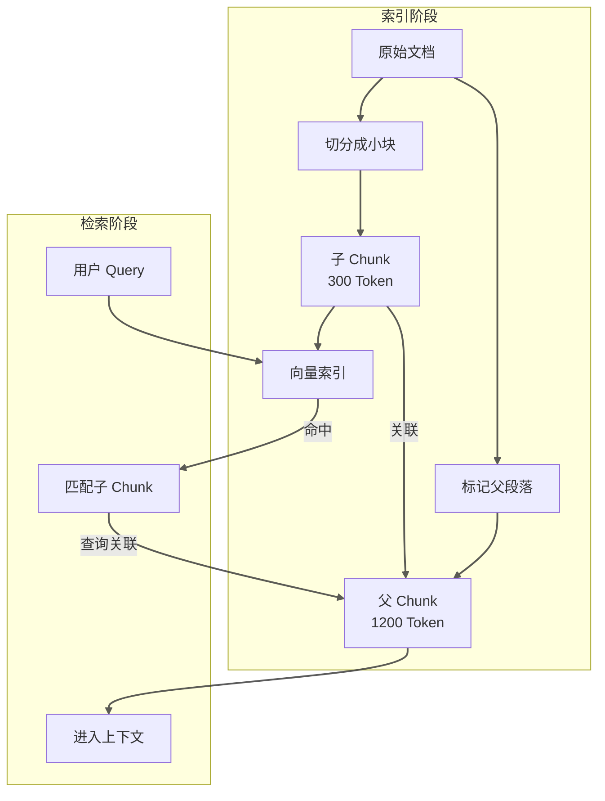
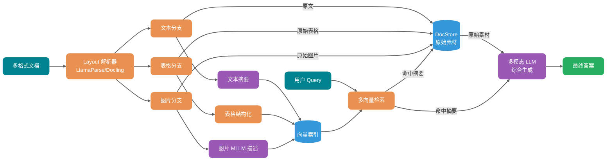

> **术语约定**：本文中 "Chunking" 与“切分”、"Embedding" 与“嵌入”、"Chunk" 与“块” 含义相同，统一使用中文表述以保持可读性。

很多团队第一次搭 RAG 系统时，都会经历一个特别有意思的阶段：买最贵的向量数据库、调最牛的 embedding 模型、上线之后发现答案还是一塌糊涂。

根因往往不在检索环节，而在更上游——文档根本没有被正确解析，切分的时候把表格列拆散了，Chunk 把条件和结论切成两半，页眉页脚被当成正文入了索引。

换句话说：**RAG 的瓶颈通常不在检索层，而在文档进入索引之前的那段管线。**

这个问题在 PDF 多栏布局、Word 标题层级、Excel 字段关联、扫描件 OCR 等场景下尤其突出。很多团队以为换了更强的 embedding 模型就能解决，实际上只是让错误表达得更稳定而已。

这篇文章就把这条管线从头到尾拆开来看。接近 1w 字，建议收藏，主要覆盖这几块：

1. 文档从上传到入库的完整链路和每个环节的坑；
2. 各种 Chunking 策略的适用场景和实测数据；
3. 语义丢失为什么发生以及怎么应对；
4. 表格和多栏这类结构丢失问题；
5. 分层校验怎么做；
6. 图片表格图表怎么变成可检索内容。

## 文档从上传到入库要经过哪些环节？

在说具体策略之前，先把链路画清楚。文档从上传到进入向量库，中间要经过至少六个环节：


这张图里有个容易忽略的点：质量校验不应该只发生在入库之后。在 Chunking 阶段做完采样校验，能提前发现问题，避免把低质量数据大批量写入向量库。

> 注：本图简化展示了 Chunking 阶段的校验，完整的分层校验策略见后文“如何设计分层校验策略”章节，涵盖格式校验、解析校验和 Chunking 校验三层。

每个环节的核心风险：

| 环节        | 典型问题                           | 最终影响                   |
| ----------- | ---------------------------------- | -------------------------- |
| 文件上传    | 格式伪造、大小超限、编码混乱       | 解析器崩溃或静默失败       |
| 格式校验    | 扩展名和实际 MIME 类型不符         | 选错解析器                 |
| Layout 解析 | PDF 多栏、表格合并单元格、页眉页脚 | 结构丢失、上下文错位       |
| 清洗去噪    | 乱码、特殊字符、重复空行、目录残留 | 噪声入索引、Embedding 失真 |
| Chunking    | 语义截断、上下文断裂、块太大或太小 | 召回不准、答案残缺         |
| Metadata    | 没保存来源、页码、版本、权限       | 无法过滤、无法引用         |
| 入库        | 向量维度不一致、Token 超限         | 检索失败、索引损坏         |

很多团队把精力放在换哪个 embedding 模型上面，但实际上如果数据在这一步就已经坏掉了，换模型只会让损坏更稳定。

## 如何选择合适的 Chunking 策略？


### 固定长度切分：够用但不完美

最朴素的做法是按字符数或 Token 数硬切。比如每 1000 个 Token 切一块，相邻块之间重叠 200 Token。

这种方式实现简单、行为可预测，在短文档和 FAQ 类场景下效果不差。但它的硬伤也很明显：它不懂什么是段落、什么是表格、什么是代码块。

在实际测试中，固定 512-token 切分与递归切分的差距其实很小——大约只有 2 个百分点。对于快速验证 RAG 可行性的场景，这个差距可能不值得引入额外的复杂度。

举个例子，一段政策文档里写着：

> “除以下情况外，均可申请七天无理由退货：（一）定制商品；（二）鲜活易腐商品；（三）在线下载的数字化商品...”

如果这个列表刚好跨在 1000 Token 的边界上，前一块可能只有“除以下情况外，均可申请七天无理由退货”，后一块只有“（一）定制商品...”。单独看哪个都不完整，模型很容易断章取义。

所以固定长度只适合当基线用，不适合当终点。

### 递归字符切分：保留层级结构

递归切分（Recursive Character Splitting）的思路很直觉：先按换行符把段落拆开，段落太大就按句号切，句子还是太长就按空格切，逐层往下，直到每个块都小于目标大小。说白了就是在模拟人读书的方式——先看章节，再看段落，再看句子。

你的文档如果有标题但不一定每级都有内容，或者段落长短不一，这种不规则结构用递归切分就很合适。技术博客、产品手册、研究报告都属于这个类型。

LangChain 的 `RecursiveCharacterTextSplitter` 是这种思路的典型实现。对于 Python 代码这类结构化内容，使用约 100 Token 的块大小和约 15 Token 的重叠，能在上下文精度和召回率之间取得不错的平衡。注意：此参数针对代码文档优化，通用文本文档建议使用 400-512 Token。

### 语义切分：按意义分，但有代价

语义切分走得更远：不按字符或层级切，而是用 embedding 模型判断句子之间的语义相似度，把意思相近的句子聚成一组。

但 Guide 踩过这个坑——语义切分特别容易产生超小块。某次评测中，语义切分产生的片段平均只有 43 Token，这么小的块上下文严重不足，拿去检索基本就是废的。

还有个成本问题：它需要额外的 embedding 调用来计算句子相似度，文档量一大，账单就很可观。实际测试下来，语义切分的性能对阈值和最小块大小参数极为敏感。设置合理的 min_chunk_size（如 200-400 Token）可以避免超小片段问题，调优后效果会好很多。

### 按文档结构切：天然语义边界

如果你的文档本身有清晰的结构，按结构切反而是最靠谱的。NVIDIA 做过一组测试，Page-Level Chunking（按页面切分）在金融报告和法律文档上表现最好，平均准确率达到 0.648，方差也最低。道理很简单：当页面边界本身就是文档作者设定的语义边界时，不要强行拆散它。

不过别盲目迷信页面级切分。这个优势相对于 Token 切分其实只有 0.3-4.5 个百分点，而且在 FinanceBench 数据集上，1024-token 切分反而比页面级更优（0.579 vs 0.566）。NVIDIA 测试的文档类型（金融报告、法律文档）是分页本身就携带语义的场景——如果你的 PDF 是 Word 随便导出的那种，页面级切分不会带来额外收益。另外，查询类型也影响最优策略：事实型查询适合 256-512 Token 的小块，分析型查询适合 1024+ Token 或页面级切分。

不同文档类型对应的推荐切分方式，Guide 整理了一张表供参考：

| 文档类型 | 推荐切分方式                  | 实现工具                          |
| -------- | ----------------------------- | --------------------------------- |
| Markdown | 按标题层级（H1/H2/H3）切      | `MarkdownHeaderTextSplitter`      |
| HTML     | 按标签层级切（h1~h6、p、div） | `HTMLHeaderTextSplitter`          |
| PDF      | 按页或章节切                  | `chunk_by_title`、`chunk_by_page` |
| 代码     | 按函数、类、包切              | `PythonCodeTextSplitter`          |
| 论文     | 按章节、段落、表格切          | Layout-aware Parser               |

### Parent-Child Chunk：召回和上下文的折中

做 RAG 的人迟早会遇到一个矛盾：小块召回准但上下文残缺，大块保留完整但召回噪声大。你想召回精确就得切小块，但切小了模型只看到局部，回答就容易断章取义。

Parent-Child Chunk 就是解决这个矛盾的。具体做法是先把文档切成 300 Token 左右的小块用于向量检索，然后每个小块都挂载到一个 1200 Token 的父段落上。检索时先命中小块，再把对应父段落放入上下文。这样既保证了召回精度，又保留了必要的上下文。



这种模式在长文档、教程、政策解读、故障手册等场景下效果明显。缺点是索引存储量会增加（每个子 Chunk 都要关联父 Chunk），检索时多一次关联查询。

### 重叠控制：边界问题的解法

不管用哪种切分策略，块边界都是个麻烦。连续两页讲的是同一件事，上一页结尾和下一页开头被页码硬切开了，检索时两块都缺一半。

重叠（Overlap）是应对这个问题的标准手段，但重叠也不是越大越好。太小了边界处语义断裂，太大了重复内容过多，浪费向量空间还增加检索噪声。Guide 的经验是把它当成一个需要手动调的参数，而不是一个固定值。

有实际测试表明，按逻辑主题边界对齐的自适应切分可以取得不错的效果——准确率达到 87%，而固定大小基线为 50%，差距在统计上显著（p = 0.001）。但这种自适应方案实现复杂，不是所有团队都有精力做。

比较务实的经验值如下：通用文本用 512 Token 的块大小加 50-100 Token 的重叠，基本够用；代码文档别硬套 Token 数，按函数和类的边界切更靠谱；法规合同按条、款、项结构切，优先保留法律效力单元；表格密集的文档，表格单独作为一块，绝不能跨块切分。

## 什么是语义丢失，为什么会发生？


语义丢失是 RAG 系统里一个容易被忽视但影响巨大的问题。简单说就是：原始文档里的关键信息，在解析、清洗、切分、入库的过程中被削弱或丢失了。

### 语义丢失的典型场景

**第一种：结构截断。** 一个完整的业务逻辑被拆到两个 Chunk 里。第一个 Chunk 讲“申请条件”，第二个 Chunk 讲“审批流程”，但中间那个关键条件“如果满足 X，则需要额外提供 Y 材料”被切在边界上，成了两个 Chunk 都有的“残缺信息”。

**第二种：上下文蒸发。** Chunk 只保留了文本内容，但丢失了它在文档里的位置信息。模型读到“在过去三年中...”时不知道这是在讲“某供应商的风险评估”还是“某客户的历史交易”，因为这些背景在切分时被丢了。

**第三种：表格结构破坏。** 一个多行多列的表格被解析成混乱的文本，列与列之间的语义关系（谁是主键、谁是从属、谁是数值）完全丢失。

**第四种：专有名词变形。** 文档里写的是“SSO 单点登录”，切分后变成了“SSO 单点...”，embedding 时专有名词被截断，检索时根本匹配不到。

### 语义丢失的本质

说到底，语义丢失就是切分破坏了原始文本的上下文依赖关系，而 Embedding 模型只能看到切分后的局部窗口。

Transformer 的注意力机制虽然能处理长距离依赖，但每个 Token 最终只能“看到”它所在 Chunk 内的上下文。如果关键信息跨越了 Chunk 边界，模型就没有足够的信息来正确理解它。

这也解释了为什么 Page-Level Chunking 在某些场景下反而比精细切分效果更好——当页面本身就是语义单元时，按页面切反而保留了更多的原始上下文。

### 应对策略

最直接的做法是增加语义入口。不要只索引正文，给每个 Chunk 生成摘要和问题变体一起入索引。用户问“钱怎么退”，文档写的是“退款申请路径”，这两个表达不在同一个语义空间，但都指向同一个答案。给 Chunk 生成多角度的摘要或问题，就能显著增加命中概率。

另一个被低估的手段是保留层级元数据。在 Metadata 里记录章节路径、父子标题、段落编号等信息，检索时可以按层级过滤，生成时也能补回上下文。这块成本低但收益大，很多团队却忽略了。

如果预算允许，可以试试 Late Chunking。这是一种比较新的做法：先把完整文档通过 Transformer 编码一次，让每个 Token 的 embedding 都包含全文注意力，然后再在 embedding 空间做切分和池化。好处是每个 Chunk 的向量都保留了完整的文档上下文，缺点是计算成本高，适合文档量不大但对精度要求极高的场景。

还有一种思路是用另一个 LLM 来分析文档结构，让它告诉你该怎么切（Contextual Chunking）。这种方式成本也高，但对复杂文档结构（比如嵌套表格、混合图文）的处理能力确实更强。

## 如何处理结构丢失问题？


结构丢失是语义丢失的一个子集，但它的场景更具体，影响也更直接。

### PDF 多栏布局

PDF 是最麻烦的格式之一。很多 PDF 的正文是双栏甚至多栏排版的，但底层文本流可能是混乱的——第一栏的第三段后面可能跟着第三栏的第一段，解析时如果按物理顺序读，就会得到一堆乱码。Guide 踩过不少坑：有一次处理一份双栏的技术白皮书，解析出来的文本顺序完全错乱，把左栏的结论拼到了右栏的论据前面，检索出来的答案牛头不对马嘴。

最靠谱的做法是用 Layout-Aware Parser，这类解析器会识别文本的物理位置（x、y 坐标）、字体大小、段落间距，从而推断出真实的阅读顺序。LlamaParse、Docling、Marker-PDF 都支持这个能力。

对于特别重要的文档，Guide 建议做一轮多版本解析对比——同一个 PDF 用两种解析器跑一遍，检查输出的一致性。如果两份输出差异很大，说明解析结果不可靠，应该降级处理或标记为需要人工审核。这个方法虽然费点时间，但能避免把乱序文本悄悄塞进知识库。

还有一个容易翻车的场景：财务报表里的合并单元格。跨列的表头、跨行的数值项，如果只按文本流解析，结构会完全乱掉。这类文档别硬撑，直接上专门的表格提取工具（如 Docling 的 TableFormer 模块）。

### Word 标题层级

Word 文档的结构通常靠标题样式体现（Heading 1、Heading 2、正文）。但很多文档的标题样式被滥用——有人用加大字体的普通段落当标题，有人把正文套成了 Heading 3。Guide 见过一个更离谱的：整篇文档全用 Heading 1，解析出来层级信息完全没法用。

如果直接按纯文本切分，标题层级会全部丢失。所以必须用 `python-docx` 读取文档的样式信息，按样式层级重建文档树，然后按标题层级切分，保证每个 Chunk 都知道自己属于哪个章节。切分之后把章节路径写入 Metadata，供检索和生成时使用。

```python
# 读取 Word 文档并保留标题层级
from docx import Document

def extract_sections(doc_path):
    """
    按 Word 文档标题层级提取章节内容
    """
    doc = Document(doc_path)
    current_heading = None
    current_content = []

    for para in doc.paragraphs:
        if para.style.name.startswith("Heading"):
            # 保存上一个标题下的内容
            if current_heading and current_content:
                yield {
                    "heading": current_heading,
                    "content": "\n".join(current_content),
                }
            current_heading = para.text
            current_content = []
        else:
            if para.text.strip():
                current_content.append(para.text)

    # 处理最后一个章节
    if current_heading and current_content:
        yield {
            "heading": current_heading,
            "content": "\n".join(current_content),
        }
```

### Excel 字段关联

Excel 表格是结构化数据，但它的结构往往藏在单元格的合并、颜色、公式里，而不是文本本身。

一个常见的错误是把 Excel 当作文本文件来处理——按行读取，每个单元格独立入索引。这样做会丢失列与列之间的关联关系。

正确的做法取决于 Excel 的用途：

- 数据表格（财务报表、统计报表）：按行或按数据区域提取为结构化 JSON，每行作为一条记录。
- 配置表格（参数表、映射表）：把表头和值配对提取，保留字段名。
- 混合文档（既有说明文字又有表格）：文字部分按段落处理，表格部分按结构化数据处理。

### 扫描件的 OCR 质量

扫描件的处理更复杂。纸质文档通过 OCR 转成数字文本，质量取决于扫描分辨率、字体、纸张背景等多个因素。Guide 的实战经验是：只要涉及扫描件，就一定要预期 OCR 会出错。

最常见的坑有三个。字符错识别，数字 0 和字母 O 混淆、中文繁简体混淆，这在产品编号和身份证号里特别要命。行错位，表格线识别不准导致行列错位，财务报表一旦错位整张表就废了。段落合并，不同段落的文本被合成一段，上下文全乱。

所以引擎选择很关键。一定要用支持神经网络的 OCR 引擎（如 Tesseract 4.x+、Google Document AI、AWS Textract），传统的光学字符识别基本可以淘汰了。对于关键文档，Guide 会启用双 OCR 引擎交叉校验——两个引擎的结果对不上的地方，基本就是识别错误的。另外，对数值密集型文档（如财务报表）还得增加一层数值一致性校验，比如列求和是否对得上总计。

## 如何设计分层校验策略？


不是所有文档都能成功解析，也不是所有解析结果都能用。RAG 管线必须有降级处理机制，否则低质量数据会污染整个知识库。

### 校验分层

Guide 建议把校验拆成三道关卡，每道管不同的事。

先是格式校验。文件上传后立刻检查扩展名、MIME 类型、文件大小。这一层解决的是“恶意上传”和“参数错误”问题，拦截成本最低，效果最快。

```java
public class DocumentValidationException extends RuntimeException {
    private final ValidationErrorType errorType;
    private final String fileName;
    private final Object rejectedValue;

    public enum ValidationErrorType {
        FILE_TOO_LARGE,           // 文件大小超限
        UNSUPPORTED_FORMAT,       // 不支持的格式
        MIME_TYPE_MISMATCH,       // 扩展名与实际类型不符
        CORRUPTED_FILE,           // 文件损坏
        EMPTY_FILE,               // 空文件
        ENCODING_ERROR            // 编码错误
    }
}
```

接下来是解析校验。解析完成后检查是否成功提取了内容、内容长度是否在合理范围内、是否有明显的乱码。

```java
public class ParseResultValidator {

    public ValidationResult validate(DocumentParseResult parseResult) {
        List<String> errors = new ArrayList<>();

        // 空内容检查
        if (parseResult.getContent().isEmpty()) {
            errors.add("解析结果为空");
        }

        // 乱码率检查
        double garbledRate = calculateGarbledRate(parseResult.getContent());
        if (garbledRate > 0.05) {  // 超过 5% 乱码
            errors.add("乱码率过高: " + String.format("%.2f%%", garbledRate * 100));
        }

        // 内容长度异常检查
        int contentLength = parseResult.getContent().length();
        if (contentLength < 100) {
            errors.add("内容过短，可能解析失败");
        }
        if (contentLength > 10_000_000) {  // 超过 10MB 文本
            errors.add("内容过长，需要分片处理");
        }

        // 结构完整性检查（如果有结构信息）
        if (parseResult.hasStructure()) {
            validateStructure(parseResult.getStructure())
                .forEach(errors::add);
        }

        return new ValidationResult(errors);
    }
}
```

最后一道是 Chunking 校验。切分完成后抽样检查 Chunk 质量：块大小分布是否合理、边界是否在合理位置、是否有明显的截断问题。

```java
public class ChunkingQualityReport {
    private final int totalChunks;
    private final int totalCharacters;
    private final double averageChunkSize;
    private final int minChunkSize;
    private final int maxChunkSize;
    private final double chunkSizeStdDev;

    // 警告项
    private final List<String> warnings = new ArrayList<>();
    private final List<String> errors = new ArrayList<>();

    public boolean isAcceptable() {
        // Chunk 大小标准差过大说明分布不均匀
        if (chunkSizeStdDev > averageChunkSize * 0.5) {
            warnings.add("Chunk 大小分布不均匀，标准差过大");
        }

        // 最小块过小可能是切分异常
        if (minChunkSize < 50) {
            errors.add("存在过小的 Chunk，可能切分异常");
        }

        // 最大块过大可能截断失败
        if (maxChunkSize > 5000) {
            warnings.add("存在过大的 Chunk，可能超出模型上下文");
        }

        return errors.isEmpty();
    }
}
```

### 降级处理策略

| 校验失败类型  | 处理策略                                  |
| ------------- | ----------------------------------------- |
| 空文件        | 拒绝入库，记录异常日志，通知上传者        |
| 格式不支持    | 拒绝入库，建议转换格式                    |
| 解析失败      | 进入人工处理队列，或使用备用解析器重试    |
| 乱码率高      | 尝试 OCR 或格式转换，仍失败则降级为纯文本 |
| Chunking 异常 | 改用固定长度切分作为兜底方案              |
| 部分解析成功  | 提取可解析部分入库，对不可解析部分打标签  |

降级不是放弃，而是让尽可能多的有效数据进入知识库。一份 100 页的 PDF，解析失败 10 页，总比全部拒绝强。

## 如何处理多模态内容？

传统 RAG 只处理文本，但真实世界的文档里还有大量图片、表格、图表。如果这些内容被忽略，知识库就是不完整的。

### 图片内容：三种处理路径

图片在文档里的作用有两类：信息载体（截图、流程图、照片）和装饰性内容（页眉、logo、水印）。处理策略完全不同。

一种做法是用 CLIP 向量化 + 原始图片回传。用 CLIP 模型把图片转成向量，和文本向量一起存入向量库。检索时如果命中图片向量，就从对象存储里拉取原始图片，编码成 base64 塞给多模态 LLM（如 GPT-4o）做理解。好处是图片和文本在同一个语义空间里检索，坏处是 CLIP 擅长自然图片，对截图和图表的理解能力有限。Guide 实测下来，企业文档里大量截图和仪表盘，CLIP 基本搞不定。

另一种思路是用 MLLM 描述 + 文本检索。不用 CLIP 向量化图片，而是用多模态大模型（如 GPT-4o、Qwen-VL）生成图片的文本描述，把描述文本和原始图片一起存储。检索时直接匹配文本，命中后再用原始图片做生成增强。这套方案更实用——很多企业文档里的图片是截图、流程图、仪表盘，CLIP 很难理解，但 MLLM 能生成准确的描述。

还有个更工程化的方案是多向量索引（Multi-Vector Retriever），这是 LangChain 主推的做法：先用 MLLM 生成图片的结构化摘要（如"This is a flowchart showing the order processing pipeline..."），摘要入文本向量索引，原图存在 docstore 里。检索时先命中摘要，再通过 doc_id 关联拉取原图，把原图 base64 编码后一起塞给多模态 LLM 生成。

```python
# LangChain 多向量检索示例
from langchain.retrievers import MultiVectorRetriever
from langchain.storage import InMemoryByteStore

# 摘要向量存储
vectorstore = Chroma(collection_name="summaries", embedding_function=OpenAIEmbeddings())

# 原始文档存储
docstore = InMemoryByteStore()

retriever = MultiVectorRetriever(
    vectorstore=vectorstore,
    byte_store=docstore,
    id_key="doc_id",
    search_kwargs={"k": 5}
)
# 注意：InMemoryByteStore 仅用于演示，生产环境应替换为持久化存储（如 Redis、MongoDB、S3 等）
```

### 表格内容：结构化抽取是核心

表格是 RAG 里的老大难问题。传统 PDF 解析会把表格转成混乱的文本，列与列之间的关系完全丢失。

最基础的做法是表格解析 + Markdown 化。用专门的表格解析工具（LlamaParse、Docling、TableFormer）提取表格结构，转成 Markdown 表格格式。Markdown 表格至少保留了行列关系，LLM 能更好地理解。

```markdown
| 产品名称 | Q1 销量 | Q2 销量 | 环比增长 |
| -------- | ------- | ------- | -------- |
| 手机 A   | 10,000  | 12,000  | +20%     |
| 手机 B   | 8,000   | 7,500   | -6.25%   |
```

如果表格是数值型的（比如财务报表），转成结构化 JSON 格式更利于数值检索和计算。可以用自然语言查询表格内容："Which product had the highest growth in Q2?"

```json
{
  "table_name": "Sales Quarterly Report",
  "headers": ["Product", "Q1 Sales", "Q2 Sales", "Growth Rate"],
  "rows": [
    { "product": "Phone A", "q1": 10000, "q2": 12000, "growth": "20%" },
    { "product": "Phone B", "q1": 8000, "q2": 7500, "growth": "-6.25%" }
  ]
}
```

更进一步的思路是上下文感知的表格描述。普通的表格描述是"This is a table showing sales data..."，但这种描述丢失了表格的业务背景。上下文感知的方式是先识别表格所在的章节和主题，再用这些背景信息丰富表格描述。Guide 的经验是，表格描述的质量直接决定检索命中率，值得花时间做好。

比如同样是销售数据表，在“华东区年度总结”章节下的描述应该是：

> “华东区 2024 年度各产品线销量汇总表，展示了手机 A 和手机 B 在 Q1/Q2 的销售数据及环比增长率，用于分析产品市场表现和制定下季度策略。”

两种描述的检索命中率差异很大。

### 图表内容：Caption 和上下文同样重要

图表（折线图、柱状图、饼图、流程图）比普通图片更复杂，因为它们往往有标题、坐标轴标签、图例等元信息。

处理图表的要点：

1. 提取完整的图表元信息。标题、坐标轴标签、图例、单位、数据来源，少了这些信息模型很难理解图表在说什么。
2. 生成描述性 caption。不是"Revenue chart"，而是“折线图展示 2020-2024 年公司季度营收趋势，Q4 2024 营收达到峰值 12.5 亿元”。
3. 识别图表与其他内容的关系。图表通常是为说明某个论点服务的，它的上文和下图往往包含关键解读。

### 完整的多模态 RAG 链路



这套链路的思路是：摘要用于检索，原文用于生成。向量索引里存的是结构化摘要（或描述），而原始的多模态内容存在 docstore 里，检索命中的时候再取出来交给多模态 LLM 综合。

## 如何从零搭建文档处理管线？


如果你要从零搭一套企业级 RAG 的文档处理管线，Guide 的建议是分步走，别想着一步到位。

先把文本类文档（Markdown、HTML、TXT）走通，让它能稳定跑完解析、切分、索引、入库全流程。这一步重点验证：解析器能否正确提取标题层级、Chunk 大小分布是否符合预期、Metadata 是否完整。文本链路不稳就急着上 PDF，后面全是坑。

文本稳了之后再攻坚 PDF。PDF 是企业文档的主力格式，表格、图表、多栏是重灾区。建议引入 Layout-Aware Parser（LlamaParse 或 Docling），先在少量文档上验证表格和图片提取质量，再逐步扩大覆盖范围。Guide 的血泪教训：千万别拿全量 PDF 直接上生产，先拿 10 份样本跑通再说。

当文本链路稳定后，再引入图片和表格的多模态处理。优先级看业务场景——如果文档里图片和表格占比高（比如财务报告、产品手册），就要优先做；如果主要是文字类文档，可以延后。

最后一步是质量闭环，也是最容易被砍掉的环节。在入库前增加抽样质检：用一批真实用户 Query 定期跑召回，对比解析前后的内容保真度，持续迭代解析器和切分策略。没有质检的管线上生产，等于给知识库喂垃圾。

## 总结

RAG 文档处理不是一个“调参数”的问题，而是一个系统工程。每个环节都有自己独特的挑战：

- 解析层：要理解文档结构，Layout-Aware 是基础能力。
- 清洗层：要去噪但不丢信息，乱码和重复内容是主要敌人。
- Chunking 层：要找到语义完整性和召回精度的平衡点，没有万能值，只有场景适配。
- Metadata 层：要保存足够多的上下文信息，来源、版本、权限、层级路径都是检索和生成的硬约束。
- 多模态层：图片和表格是信息的重要载体，不能简单跳过，需要专门的抽取和描述策略。

最后记住一句话：**RAG 的上限由数据质量决定，下限由检索策略决定**。把数据处理管线做到位，比换一百个 embedding 模型都管用。

## 参考资料

- [Databricks: Mastering Chunking Strategies for RAG](https://community.databricks.com/t5/technical-blog/the-ultimate-guide-to-chunking-strategies-for-rag-applications/ba-p/113089)
- [Firecrawl: Best Chunking Strategies for RAG in 2026](https://www.firecrawl.dev/blog/best-chunking-strategies-rag)
- [Premiere AI: RAG Chunking Strategies 2026 Benchmark Guide](https://blog.premai.io/rag-chunking-strategies-the-2026-benchmark-guide/)
- [Weaviate: Chunking Strategies to Improve LLM RAG Pipeline Performance](https://weaviate.io/blog/chunking-strategies-for-rag)
- [Omdena: Document Parsing for RAG - A Complete Guide for 2026](https://www.omdena.com/blog/document-parsing-for-rag)
- [DataCamp: Multimodal RAG - A Hands-On Guide](https://www.datacamp.com/tutorial/multimodal-rag)
- [LangChain: Multi-Vector Retriever for RAG on Tables, Text, and Images](https://www.langchain.com/blog/semi-structured-multi-modal-rag)
- [Procycons: PDF Data Extraction Benchmark 2025](https://procycons.com/en/blogs/pdf-data-extraction-benchmark/)
- [LlamaIndex: Mastering PDF Parsing](https://www.llamaindex.ai/blog/mastering-pdfs-extracting-sections-headings-paragraphs-and-tables-with-cutting-edge-parser-faea18870125)
