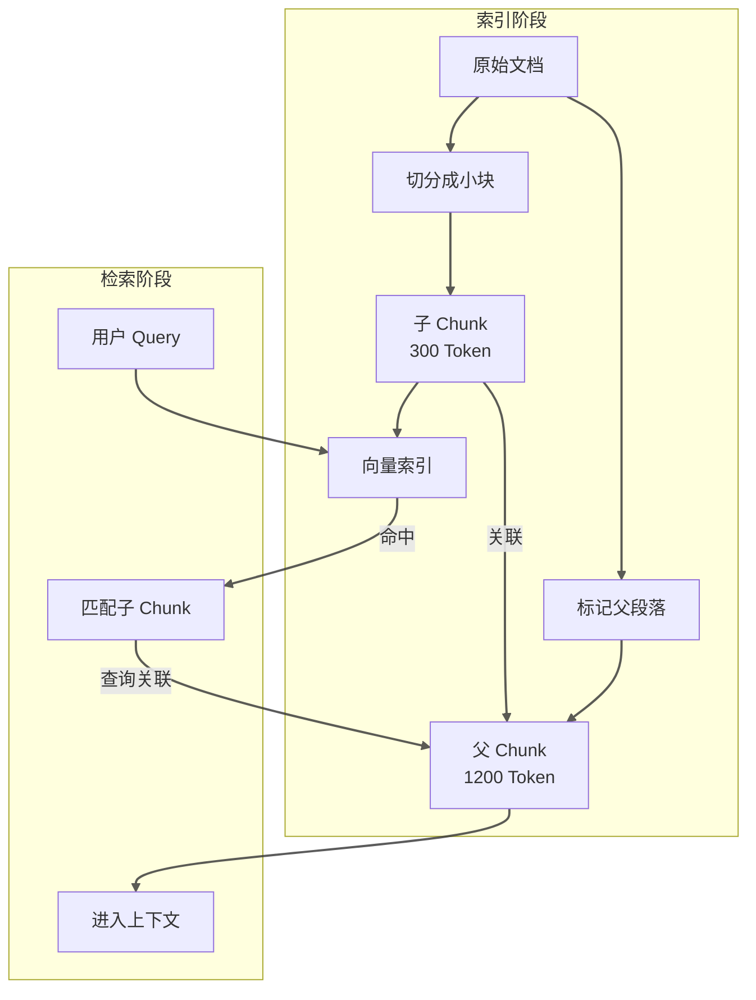
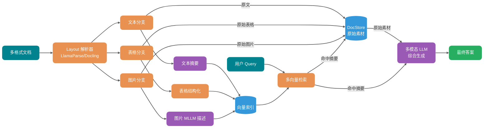

RAG 检索前要先把 PDF、Word、Excel 或扫描件转换成可检索内容。多栏 PDF 的阅读顺序、表格的行列关系、标题层级和 OCR 错误如果在这一步处理错了，后续更换 Embedding 模型或向量数据库也无法恢复丢失的信息。

本文会依次说明文档上传、解析、切分、校验和多模态入库的做法与限制。

> **术语约定**：本文中 "Chunking" 与“切分”、"Embedding" 与“嵌入”、"Chunk" 与“块” 含义相同，统一使用中文表述以保持可读性。

## 文档从上传到入库要经过哪些环节？

在说具体策略之前，先把链路画清楚。文档从上传到进入向量库，中间要经过至少六个环节：


这张图里有个容易忽略的点：质量校验不应该只发生在入库之后。在 Chunking 阶段做完采样校验，能提前发现问题，避免把低质量数据大批量写入向量库。

> 注：本图简化展示了 Chunking 阶段的校验，完整的分层校验策略见后文“如何设计分层校验策略”章节，涵盖格式校验、解析校验和 Chunking 校验三层。

每个环节的核心风险：

| 环节        | 典型问题                           | 最终影响                   |
| ----------- | ---------------------------------- | -------------------------- |
| 文件上传    | 格式伪造、大小超限、编码混乱       | 解析器崩溃或静默失败       |
| 格式校验    | 扩展名和实际 MIME 类型不符         | 选错解析器                 |
| Layout 解析 | PDF 多栏、表格合并单元格、页眉页脚 | 结构丢失、上下文错位       |
| 清洗去噪    | 乱码、特殊字符、重复空行、目录残留 | 噪声入索引、Embedding 失真 |
| Chunking    | 语义截断、上下文断裂、块太大或太小 | 召回不准、答案残缺         |
| Metadata    | 没保存来源、页码、版本、权限       | 无法过滤、无法引用         |
| 入库        | 向量维度不一致、Token 超限         | 检索失败、索引损坏         |

Embedding 模型和向量库只能处理输入给它们的内容。多栏 PDF 的阅读顺序错乱、表格列关系丢失或 OCR 错字一旦进入索引，后续检索无法从向量中还原原始结构。

## 如何选择合适的 Chunking 策略？


### 固定长度切分：够用但不完美

固定长度切分只需要设定块大小和重叠量。例如，每 1000 个 Token 切一块，相邻块之间重叠 200 Token。

这种方式实现简单、行为可预测，在短文档和 FAQ 类场景下效果不差。但它的硬伤也很明显：它不懂什么是段落、什么是表格、什么是代码块。

把固定长度切分作为评测基线后，才能判断递归切分带来的收益是否覆盖额外复杂度。比较时应固定文档集和问题集，同时观察召回率、上下文完整性和索引成本；其他知识库上的百分点差异不能直接套用。

举个例子，一段政策文档里写着：

> “除以下情况外，均可申请七天无理由退货：（一）定制商品；（二）鲜活易腐商品；（三）在线下载的数字化商品...”

如果这个列表刚好跨在 1000 Token 的边界上，前一块可能只有“除以下情况外，均可申请七天无理由退货”，后一块只有“（一）定制商品...”。单独看哪个都不完整，模型很容易断章取义。

这类边界问题正是固定长度方案需要与其他策略对比的原因。

### 递归字符切分：保留层级结构

递归切分（Recursive Character Splitting）按一组优先级分隔符逐层尝试：先保留段落，段落仍超长再按句子处理，最后才使用空格等更细的边界。这样产生的块仍受目标大小约束，但会优先保留章节、段落和句子的边界。

标题层级不完整、段落长度差异明显的文档可以纳入这类方案的评测范围，例如技术博客、产品手册和研究报告。是否采用仍取决于它在当前问题集上的结果。

LangChain 的 `RecursiveCharacterTextSplitter` 是这种思路的典型实现。对于 Python 代码这类结构化内容，使用约 100 Token 的块大小和约 15 Token 的重叠，能在上下文精度和召回率之间取得不错的平衡。注意：此参数针对代码文档优化，通用文本文档建议使用 400-512 Token。

### 语义切分：按意义分，但有代价

语义切分先计算句子或段落之间的相似度，再把连续、相近的内容归入同一块，而不是直接遵循字符数或标题边界。

它需要额外生成句子或段落的 Embedding。没有最小块约束时，某些主题转折处只会留下一个或两个句子的块，检索命中后仍不足以支持回答。

阈值与 `min_chunk_size` 会改变块大小分布。可从 200-400 Token 的候选范围开始，随后检查最小值、均值、分位数和过小块占比，并由本地评测确定参数。

### 按文档结构切：天然语义边界

金融报告、法律文档等材料中，页面往往对应一个可阅读的版式单元。NVIDIA 的一组测试中，Page-Level Chunking（按页面切分）在这两类文档上的平均准确率为 0.648，方差也最低；这说明页面边界可以作为待验证的切分边界。

不过别盲目迷信页面级切分。这个优势相对于 Token 切分其实只有 0.3-4.5 个百分点，而且在 FinanceBench 数据集上，1024-token 切分反而比页面级更优（0.579 vs 0.566）。NVIDIA 测试的文档类型（金融报告、法律文档）是分页本身就携带语义的场景——如果你的 PDF 是 Word 随便导出的那种，页面级切分不会带来额外收益。另外，查询类型也影响最优策略：事实型查询适合 256-512 Token 的小块，分析型查询适合 1024+ Token 或页面级切分。

下表列出不同文档类型可用于起步评测的切分方式：

| 文档类型 | 推荐切分方式                  | 实现工具                          |
| -------- | ----------------------------- | --------------------------------- |
| Markdown | 按标题层级（H1/H2/H3）切      | `MarkdownHeaderTextSplitter`      |
| HTML     | 按标签层级切（h1~h6、p、div） | `HTMLHeaderTextSplitter`          |
| PDF      | 按页或章节切                  | `chunk_by_title`、`chunk_by_page` |
| 代码     | 按函数、类、包切              | `PythonCodeTextSplitter`          |
| 论文     | 按章节、段落、表格切          | Layout-aware Parser               |

### Parent-Child Chunk：召回和上下文的折中

向量检索需要足够小的单元来区分相近主题，生成模型又需要更完整的上下文。Parent-Child Chunk 将这两个对象分开处理。

例如，可将约 300 Token 的子块写入向量索引，并记录它所属的约 1200 Token 父段落。查询先命中子块，再按关联读取父段落作为上下文。父子块的大小、关联查询的延迟和存储成本都需要与召回结果一起评估。


```mermaid
flowchart TB
    subgraph 索引阶段
        Doc[原始文档] --> Split[切分成小块]
        Doc --> Parent[标记父段落]
        Split --> ChildChunk[子 Chunk<br/>300 Token]
        Parent --> ParentChunk[父 Chunk<br/>1200 Token]
        ChildChunk --> VecIndex[向量索引]
        ChildChunk -->|关联| ParentChunk
    end

    subgraph 检索阶段
        Query[用户 Query] --> VecIndex
        VecIndex -->|命中| MatchedChild[匹配子 Chunk]
        MatchedChild -->|查询关联| ParentChunk
        ParentChunk --> Context[进入上下文]
    end

    linkStyle default stroke-width:2px,stroke:#333333,opacity:0.8
```

这种模式在长文档、教程、政策解读、故障手册等场景下效果明显。缺点是索引存储量会增加（每个子 Chunk 都要关联父 Chunk），检索时多一次关联查询。

### 重叠控制：边界问题的解法

不管用哪种切分策略，块边界都是个麻烦。连续两页讲的是同一件事，上一页结尾和下一页开头被页码硬切开了，检索时两块都缺一半。

重叠（Overlap）是应对这个问题的常用手段，但重叠也不是越大越好。太小了边界处语义断裂，太大了重复内容过多，浪费向量空间还增加检索噪声。它应当作为评测参数，而不是固定值。

一项针对 30 个隆鼻术后问题的研究报告称，自适应切分的回答准确率为 87%，固定大小切分为 50%（p = 0.001）。这个结果来自特定医疗问题、知识库和 Gemini 1.0 Pro，只能说明该实验中自适应切分更好，不能外推为通用 RAG 的预期收益。详见[原始研究](https://pubmed.ncbi.nlm.nih.gov/41301150/)。

通用文本可以从 512 Token、50-100 Token 重叠开始建立基线；代码优先按函数和类切分，法规合同按条、款、项保留法律效力单元，表格尽量保持完整。这里的数值是调参起点，不是生产默认值。

## 什么是语义丢失，为什么会发生？


语义丢失指原始文档中的关键信息在解析、清洗、切分或入库过程中被削弱或丢失。

### 语义丢失的典型场景

**第一种：结构截断。** 一个完整的业务逻辑被拆到两个 Chunk 里。第一个 Chunk 讲“申请条件”，第二个 Chunk 讲“审批流程”，但中间那个关键条件“如果满足 X，则需要额外提供 Y 材料”被切在边界上，成了两个 Chunk 都有的“残缺信息”。

**第二种：上下文蒸发。** Chunk 只保留了文本内容，但丢失了它在文档里的位置信息。模型读到“在过去三年中...”时不知道这是在讲“某供应商的风险评估”还是“某客户的历史交易”，因为这些背景在切分时被丢了。

**第三种：表格结构破坏。** 一个多行多列的表格被解析成混乱的文本，列与列之间的语义关系（谁是主键、谁是从属、谁是数值）完全丢失。

**第四种：专有名词变形。** 文档里写的是“SSO 单点登录”，切分后变成了“SSO 单点...”，embedding 时专有名词被截断，检索时根本匹配不到。

### 为什么会丢失语义

Embedding 请求只接收当前 Chunk。原文中跨段、跨页的条件、指代和表格关系若没有被保留到同一块或关联元数据中，向量表示就缺少这部分信息。

因此，页面本身构成语义单元时，按页切分可能优于更细的切分：它保留了同一页面内原本相互依赖的内容。这一判断仍应放到具体文档和查询类型中验证。

### 应对策略

一种做法是增加检索入口：除正文外，再为 Chunk 生成摘要或可能回答的问题。用户问“钱怎么退”，文档写的是“退款申请路径”，两段文本会被同一个 Embedding 模型映射到同一向量空间，但距离和排序未必足以让原文进入 Top-K。增加问题变体可能改善这类表达差异，收益仍需用评测集确认。

另一个被低估的手段是保留层级元数据。在 Metadata 里记录章节路径、父子标题、段落编号等信息，检索时可以按层级过滤，生成时也能补回上下文。这块成本低但收益大，很多团队却忽略了。

如果预算允许，可以试试 Late Chunking。这是一种比较新的做法：先把完整文档通过 Transformer 编码一次，让每个 Token 的 embedding 都包含全文注意力，然后再在 embedding 空间做切分和池化。好处是每个 Chunk 的向量都保留了完整的文档上下文，缺点是计算成本高，适合文档量不大但对精度要求极高的场景。

还有一种思路是用另一个 LLM 来分析文档结构，让它告诉你该怎么切（Contextual Chunking）。这种方式成本也高，但对复杂文档结构（比如嵌套表格、混合图文）的处理能力确实更强。

## 如何处理结构丢失问题？


结构丢失是语义丢失的一个子集，但它的场景更具体，影响也更直接。

### PDF 多栏布局

很多 PDF 使用双栏或多栏排版，但底层文本对象的存储顺序未必等于阅读顺序。解析器如果只按对象顺序提取，可能把左栏结论接到右栏论据前面，得到顺序错乱的文本。

这类文档可以评估 Layout-Aware Parser。解析器会结合文本的物理位置（x、y 坐标）、字体大小和段落间距推断阅读顺序，LlamaParse、Docling、Marker-PDF 都提供了相关能力。

高价值文档可以用两种解析器处理并比较输出。差异较大的页面应进入人工审核或降级流程；两份输出一致也不代表一定正确，仍要抽查阅读顺序、表格结构和页码引用。

还有一个容易翻车的场景：财务报表里的合并单元格。跨列的表头、跨行的数值项，如果只按文本流解析，结构会完全乱掉。这类文档别硬撑，直接上专门的表格提取工具（如 Docling 的 TableFormer 模块）。

### Word 标题层级

Word 文档的结构通常靠标题样式体现（Heading 1、Heading 2、正文），但样式未必可靠：有的文档用加大字体的普通段落当标题，有的把正文套成 Heading 3，甚至整篇都使用 Heading 1。解析时需要同时检查样式、字体和段落位置，不能只信样式名称。

如果直接按纯文本切分，标题层级会丢失。可以用 `python-docx` 或其他支持 Word 样式的解析器读取样式信息，按标题层级重建文档树。切分后把章节路径写入 Metadata，供检索和生成使用。

```python
# 读取 Word 文档并保留标题层级
from docx import Document

def extract_sections(doc_path):
    """
    按 Word 文档标题层级提取章节内容
    """
    doc = Document(doc_path)
    current_heading = None
    current_content = []

    for para in doc.paragraphs:
        if para.style.name.startswith("Heading"):
            # 保存上一个标题下的内容
            if current_heading and current_content:
                yield {
                    "heading": current_heading,
                    "content": "\n".join(current_content),
                }
            current_heading = para.text
            current_content = []
        else:
            if para.text.strip():
                current_content.append(para.text)

    # 处理最后一个章节
    if current_heading and current_content:
        yield {
            "heading": current_heading,
            "content": "\n".join(current_content),
        }
```

### Excel 字段关联

Excel 的字段关系可能由表头、合并单元格、颜色和公式共同表达，单独读取单元格并不能得到完整记录。

例如，把每个单元格独立写入索引，会切断字段名、数值和同一行记录之间的关联。应先确定数据区域与表头，再决定生成何种检索对象。

正确的做法取决于 Excel 的用途：

- 数据表格（财务报表、统计报表）：按行或按数据区域提取为结构化 JSON，每行作为一条记录。
- 配置表格（参数表、映射表）：把表头和值配对提取，保留字段名。
- 混合文档（既有说明文字又有表格）：文字部分按段落处理，表格部分按结构化数据处理。

### 扫描件的 OCR 质量

扫描件通过 OCR 转成数字文本，质量取决于扫描分辨率、字体、版面、语言和纸张背景。处理链路应默认 OCR 结果可能出错，并为关键字段设置校验。

OCR 结果需要分别检查字符、表格和段落三个层面。数字 0 与字母 O、繁简体等字符误识别会影响产品编号、身份证号等关键字段；表格线识别不准会使行列错位；不同段落被合并后，原有上下文也会消失。

OCR 引擎要按语言、版面类型、部署方式和实测准确率选择，Tesseract 4.x+、Google Document AI、AWS Textract 都可以作为候选。关键文档可使用双引擎对比：不一致的位置优先人工复核，但一致也不等于正确。数值密集型文档还要增加业务一致性校验，例如列求和能否对上总计、编号是否符合校验规则。

## 如何设计分层校验策略？


不是所有文档都能成功解析，也不是所有解析结果都能用。RAG 管线必须有降级处理机制，否则低质量数据会污染整个知识库。

### 校验分层

校验可以分成三道关卡，每道处理不同问题。

先是格式校验。文件上传后立刻检查扩展名、MIME 类型、文件大小。这一层解决的是“恶意上传”和“参数错误”问题，拦截成本最低，效果最快。

```java
public class DocumentValidationException extends RuntimeException {
    private final ValidationErrorType errorType;
    private final String fileName;
    private final Object rejectedValue;

    public enum ValidationErrorType {
        FILE_TOO_LARGE,           // 文件大小超限
        UNSUPPORTED_FORMAT,       // 不支持的格式
        MIME_TYPE_MISMATCH,       // 扩展名与实际类型不符
        CORRUPTED_FILE,           // 文件损坏
        EMPTY_FILE,               // 空文件
        ENCODING_ERROR            // 编码错误
    }
}
```

解析完成后，需要检查是否成功提取内容、内容长度是否处于合理范围，以及是否存在明显乱码。

```java
public class ParseResultValidator {

    public ValidationResult validate(DocumentParseResult parseResult) {
        List<String> errors = new ArrayList<>();

        // 空内容检查
        if (parseResult.getContent().isEmpty()) {
            errors.add("解析结果为空");
        }

        // 乱码率检查
        double garbledRate = calculateGarbledRate(parseResult.getContent());
        if (garbledRate > 0.05) {  // 超过 5% 乱码
            errors.add("乱码率过高: " + String.format("%.2f%%", garbledRate * 100));
        }

        // 内容长度异常检查
        int contentLength = parseResult.getContent().length();
        if (contentLength < 100) {
            errors.add("内容过短，可能解析失败");
        }
        if (contentLength > 10_000_000) {  // 超过 10MB 文本
            errors.add("内容过长，需要分片处理");
        }

        // 结构完整性检查（如果有结构信息）
        if (parseResult.hasStructure()) {
            validateStructure(parseResult.getStructure())
                .forEach(errors::add);
        }

        return new ValidationResult(errors);
    }
}
```

最后一道是 Chunking 校验。切分完成后抽样检查 Chunk 质量：块大小分布是否合理、边界是否在合理位置、是否有明显的截断问题。

```java
public class ChunkingQualityReport {
    private final int totalChunks;
    private final int totalCharacters;
    private final double averageChunkSize;
    private final int minChunkSize;
    private final int maxChunkSize;
    private final double chunkSizeStdDev;

    // 警告项
    private final List<String> warnings = new ArrayList<>();
    private final List<String> errors = new ArrayList<>();

    public boolean isAcceptable() {
        // Chunk 大小标准差过大说明分布不均匀
        if (chunkSizeStdDev > averageChunkSize * 0.5) {
            warnings.add("Chunk 大小分布不均匀，标准差过大");
        }

        // 最小块过小可能是切分异常
        if (minChunkSize < 50) {
            errors.add("存在过小的 Chunk，可能切分异常");
        }

        // 最大块过大可能截断失败
        if (maxChunkSize > 5000) {
            warnings.add("存在过大的 Chunk，可能超出模型上下文");
        }

        return errors.isEmpty();
    }
}
```

### 降级处理策略

| 校验失败类型  | 处理策略                                  |
| ------------- | ----------------------------------------- |
| 空文件        | 拒绝入库，记录异常日志，通知上传者        |
| 格式不支持    | 拒绝入库，建议转换格式                    |
| 解析失败      | 进入人工处理队列，或使用备用解析器重试    |
| 乱码率高      | 尝试 OCR 或格式转换，仍失败则降级为纯文本 |
| Chunking 异常 | 改用固定长度切分作为兜底方案              |
| 部分解析成功  | 提取可解析部分入库，对不可解析部分打标签  |

降级的目标是保留可确认正确的内容，而不是悄悄吞掉失败页面。一份 100 页的 PDF 如果有 10 页解析失败，可以只在业务允许不完整索引时接收其余页面，同时记录缺页范围、阻止系统对缺失部分作完整性承诺，并进入重试或人工复核；合同、法规等要求完整性的材料应暂缓发布。

## 如何处理多模态内容？

传统 RAG 只处理文本，但真实世界的文档里还有大量图片、表格、图表。如果这些内容被忽略，知识库就是不完整的。

### 图片内容：三种处理路径

图片在文档里的作用有两类：信息载体（截图、流程图、照片）和装饰性内容（页眉、logo、水印）。处理策略完全不同。

一种做法是用 CLIP 向量化 + 原始图片回传。用支持图文对齐的 CLIP 模型把图片转成向量，检索时命中图片向量后，再从对象存储拉取原图并交给多模态 LLM。CLIP 更擅长自然图片，对包含密集文字、坐标轴和复杂表格的截图或图表，需要单独评测。

另一种思路是用 MLLM 描述 + 文本检索。不用 CLIP 向量化图片，而是用多模态大模型生成图片的文本描述，把描述文本和原始图片一起存储。检索时匹配文本，命中后再用原始图片做生成增强。对截图、流程图和仪表盘，这种做法可能比通用 CLIP 表示包含更多文字和结构信息，但模型描述也可能漏字段或读错数值，需要抽样评测。

多向量索引（Multi-Vector Retriever）会先用 MLLM 生成图片的结构化摘要（如 "This is a flowchart showing the order processing pipeline..."），摘要进入文本向量索引，原图存入 docstore。检索时先命中摘要，再通过 `doc_id` 关联原图，交给多模态 LLM 生成。

```python
# LangChain 多向量检索示例
from langchain_classic.retrievers.multi_vector import MultiVectorRetriever
from langchain_core.stores import InMemoryByteStore

# 摘要向量存储
vectorstore = Chroma(collection_name="summaries", embedding_function=OpenAIEmbeddings())

# 原始文档存储
docstore = InMemoryByteStore()

retriever = MultiVectorRetriever(
    vectorstore=vectorstore,
    byte_store=docstore,
    id_key="doc_id",
    search_kwargs={"k": 5}
)
# 注意：InMemoryByteStore 仅用于演示，生产环境应替换为持久化存储（如 Redis、MongoDB、S3 等）
```

### 表格内容：结构化抽取是核心

表格是 RAG 里的老大难问题。传统 PDF 解析会把表格转成混乱的文本，列与列之间的关系完全丢失。

最基础的做法是表格解析 + Markdown 化。用专门的表格解析工具（LlamaParse、Docling、TableFormer）提取表格结构，转成 Markdown 表格格式。Markdown 表格至少保留了行列关系，LLM 能更好地理解。

```markdown
| 产品名称 | Q1 销量 | Q2 销量 | 环比增长 |
| -------- | ------- | ------- | -------- |
| 手机 A   | 10,000  | 12,000  | +20%     |
| 手机 B   | 8,000   | 7,500   | -6.25%   |
```

如果表格是数值型的（比如财务报表），转成结构化 JSON 格式更利于数值检索和计算。可以用自然语言查询表格内容："Which product had the highest growth in Q2?"

```json
{
  "table_name": "Sales Quarterly Report",
  "headers": ["Product", "Q1 Sales", "Q2 Sales", "Growth Rate"],
  "rows": [
    { "product": "Phone A", "q1": 10000, "q2": 12000, "growth": "20%" },
    { "product": "Phone B", "q1": 8000, "q2": 7500, "growth": "-6.25%" }
  ]
}
```

表格描述应包含所在章节、标题、单位和时间范围，使检索端能区分名称相同但业务范围不同的表格。是否保留这些字段，应通过检索评测确认，而不是只看描述是否更完整。

比如同样是销售数据表，在“华东区年度总结”章节下的描述应该是：

> “华东区 2024 年度各产品线销量汇总表，展示了手机 A 和手机 B 在 Q1/Q2 的销售数据及环比增长率，用于分析产品市场表现和制定下季度策略。”

哪种描述更适合当前知识库，需要在相同问题集上比较。

### 图表内容：Caption 和上下文同样重要

图表不能只按图片处理。标题、坐标轴、图例、单位、数据来源和所属章节共同限定了数据含义；缺少其中任何一项，都可能把同一组数值解释错。

Caption 应写清对象、时间范围、度量单位和可验证的图中信息。例如，“折线图展示 2020-2024 年公司季度营收趋势，Q4 2024 营收达到峰值 12.5 亿元”比 “Revenue chart” 多出了检索和生成所需的限定条件。图表附近的正文通常包含作者解读，也应保留关联关系。

### 完整的多模态 RAG 链路


```mermaid
flowchart LR
    %% ========== 配色声明 ==========
    classDef input fill:#00838F,color:#FFFFFF,stroke:none,rx:10,ry:10
    classDef process fill:#E99151,color:#FFFFFF,stroke:none,rx:10,ry:10
    classDef storage fill:#3498DB,color:#FFFFFF,stroke:none,rx:10,ry:10
    classDef llm fill:#9B59B6,color:#FFFFFF,stroke:none,rx:10,ry:10
    classDef success fill:#27AE60,color:#FFFFFF,stroke:none,rx:10,ry:10

    %% ========== 节点声明 ==========
    Doc[多格式文档]:::input
    Parser[Layout 解析器<br/>LlamaParse/Docling]:::process
    TextBranch[文本分支]:::process
    TableBranch[表格分支]:::process
    ImageBranch[图片分支]:::process

    TextSum[文本摘要]:::llm
    TableSum[表格结构化]:::process
    ImageSum[图片 MLLM 描述]:::llm

    VecIndex[(向量索引)]:::storage
    DocStore[(DocStore<br/>原始素材)]:::storage

    Query[用户 Query]:::input
    Retrieve[多向量检索]:::process
    Synthesize[多模态 LLM<br/>综合生成]:::llm
    Answer[最终答案]:::success

    Doc --> Parser
    Parser --> TextBranch
    Parser --> TableBranch
    Parser --> ImageBranch

    TextBranch --> TextSum --> VecIndex
    TextBranch -->|原文| DocStore
    TableBranch --> TableSum --> VecIndex
    TableBranch -->|原始表格| DocStore
    ImageBranch --> ImageSum --> VecIndex
    ImageBranch -->|原始图片| DocStore

    Query --> Retrieve
    VecIndex --> Retrieve
    Retrieve -->|命中摘要| DocStore
    DocStore -->|原始素材| Synthesize
    Retrieve -->|命中摘要| Synthesize
    Synthesize --> Answer

    linkStyle default stroke-width:2px,stroke:#333333,opacity:0.8
```

这套链路的思路是：摘要用于检索，原文用于生成。向量索引里存的是结构化摘要（或描述），而原始的多模态内容存在 docstore 里，检索命中的时候再取出来交给多模态 LLM 综合。

## 如何从零搭建文档处理管线？


格式覆盖范围可以按风险递增。先验证 Markdown、HTML、TXT 的解析、切分、索引和入库，再扩展到 PDF、多栏页面、表格和图像。每新增一种格式，都应检查标题层级、Chunk 大小分布和 Metadata 是否符合预期。

PDF 的表格、图表和多栏依赖 Layout-Aware Parser（如 LlamaParse 或 Docling）。验证样本要覆盖实际会出现的版式；样本数量取决于版式种类和出错风险，而不是某个固定数目。

图片和表格占比较高的材料（如财务报告、产品手册）需要尽早纳入多模态处理。以文本为主的知识库可以后置这部分工作，但入库前仍应抽样检查：用真实 Query 比较解析前后的内容保真度、召回结果和答案引用。

## 上线前检查

上线前至少抽查解析后的阅读顺序、表格行列、标题层级、页码引用和 OCR 关键字段；同时记录 Chunk 大小分布、来源、版本、权限与章节路径。解析器或切分策略变更后，应使用同一批问题重新评测召回和答案引用，不能只检查任务是否执行成功。

## 总结

验收时应确认解析结果仍可被追溯和正确理解：阅读顺序与表格结构没有损坏，Chunk 保留了回答所需的上下文，Metadata 可以定位来源、版本、权限和章节路径，图片与图表的关键信息没有被跳过。

这些检查应持续放在解析器、切分策略和模型版本变更之后。检索层的效果取决于它接收到的数据，而不是单靠更换 Embedding 模型补救。

## 参考资料

- [Databricks: Mastering Chunking Strategies for RAG](https://community.databricks.com/t5/technical-blog/the-ultimate-guide-to-chunking-strategies-for-rag-applications/ba-p/113089)
- [Firecrawl: Best Chunking Strategies for RAG in 2026](https://www.firecrawl.dev/blog/best-chunking-strategies-rag)
- [Premiere AI: RAG Chunking Strategies 2026 Benchmark Guide](https://blog.premai.io/rag-chunking-strategies-the-2026-benchmark-guide/)
- [Weaviate: Chunking Strategies to Improve LLM RAG Pipeline Performance](https://weaviate.io/blog/chunking-strategies-for-rag)
- [Omdena: Document Parsing for RAG - A Complete Guide for 2026](https://www.omdena.com/blog/document-parsing-for-rag)
- [DataCamp: Multimodal RAG - A Hands-On Guide](https://www.datacamp.com/tutorial/multimodal-rag)
- [LangChain: Multi-Vector Retriever for RAG on Tables, Text, and Images](https://www.langchain.com/blog/semi-structured-multi-modal-rag)
- [Procycons: PDF Data Extraction Benchmark 2025](https://procycons.com/en/blogs/pdf-data-extraction-benchmark/)
- [LlamaIndex: Mastering PDF Parsing](https://www.llamaindex.ai/blog/mastering-pdfs-extracting-sections-headings-paragraphs-and-tables-with-cutting-edge-parser-faea18870125)
