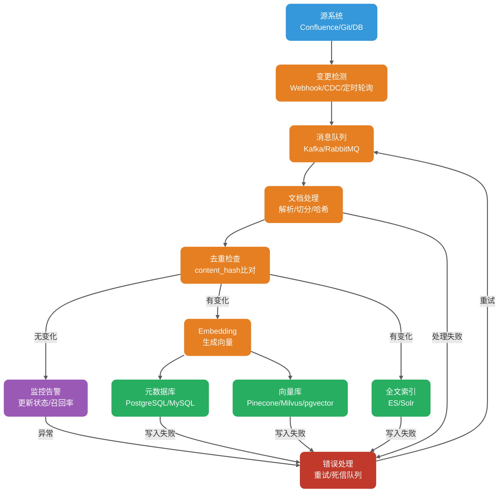
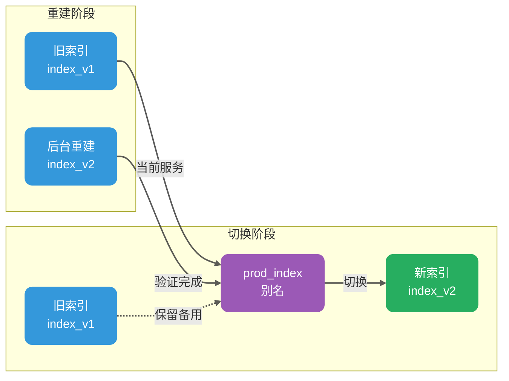

第一个企业知识库 RAG 系统上线后，很多团队都会碰到一个很真实的问题：文档明明更新了，回答还是老样子。

这时候先别急着怪 LLM。更常见的原因是知识库没有同步更新，或者更新链路只做了“写入新内容”，没有处理旧版本、权限、索引一致性这些细节。文档变更频繁之后，问题会更明显：每次都全量重建索引，成本和耗时扛不住；只更新变化部分，又怕漏掉旧块；只插入新向量，不清理旧版本，过期内容还会继续被召回；换了 Embedding 模型，历史数据到底要不要全部重索引，也绕不开。

这些问题背后，其实是 RAG 知识库的动态性、准确性、一致性、可回滚、可观测这几件事没有处理好。

这篇文章讲 RAG 知识库更新的工程实践，全文接近 8000 字。重点看几个问题：

1. 知识库更新到底要解决什么；
2. 为什么 Embedding 模型一致性是第一条硬规则；
3. 元数据怎么设计，才能支持增量更新和版本回滚；
4. 文档新增、修改、删除怎么同步到向量库和全文索引；
5. 增量更新和全量重建各适合什么场景；灰度发布、回滚和可观测性怎么落地；
6. 生产里最容易踩的几个坑。

## 知识库更新要解决哪些问题？

在讲具体方案之前，先把目标说清楚。

**知识库更新要解决的不是“怎么写一个同步任务”，而是更新之后，系统回答还能保持准、快、不越权，并且出了问题能定位、能恢复。**

动态性指的是，文档变了，索引要能跟上。这个“及时”不一定都是秒级，可能是分钟级，也可能是天级，取决于业务对实时性的要求。内部制度库也许一天同步一次就够，客服知识库和合规条款就可能需要更快。

准确性指的是，更新后召回的内容要和当前文档一致，不能文档已经改了，模型还在引用旧版本。这个问题一旦发生，用户感知会很明显。

一致性更麻烦。同一个文档有不同版本，向量库、元数据库、全文检索又是不同系统，任何一端漏写或延迟，都可能导致结果不一致。

可回滚是为了出故障时能快速切回上一个健康状态，而不是靠人工临时修数据。可观测则要求更新过程能监控，更新结果能评估，失败原因能追到具体环节。

这些目标看起来像常识，但很多项目只做了第一步“更新”，后面几步全靠运气。结果就是文档改了十版，回答还停在第一版；删了一篇敏感文档，过了几个月还能被召回出来。

## 为什么 Embedding 模型必须保持一致？

这一点要单独拎出来讲：索引时用的 Embedding 模型，必须和查询时用的模型一致。

Embedding 模型会把文本转成向量，不同模型的向量空间并不通用。同一句话用 OpenAI 的 `text-embedding-3-small` 编码，和用 sentence-transformers 的 `all-MiniLM-L6-v2` 编码，得到的向量没有可比性。如果索引用模型 A，查询用模型 B，就等于在两个不同空间里算相似度。

具体表现还要看向量维度。如果维度不同，通常无法放进同一个索引，很多向量库会直接拒绝插入或查询。如果维度相同但模型不同，相似度分数也不具备可比性，召回结果不能信。它不是简单的“随机”，而是整个排序基础已经坏了。

生产里最容易忽视的有两个场景。

**第一个是模型升级。** 业务方觉得新模型效果更好，想从 `text-embedding-3-small` 切到 `text-embedding-3-large`。这意味着历史数据必须重新编码、重新入索引。工程上可以用双索引并行和灰度切流降低风险，但重建这一步绕不过去。

**第二个是本地模型和 API 模型混用。** 测试环境用本地 sentence-transformers，生产环境用 OpenAI API。这种差异在团队协作里特别常见，测试看起来正常，上线后召回率直接腰斩。

比较稳的做法是把 Embedding 模型信息写进元数据，每次查询时都校验模型版本。不匹配时，要么拒绝查询，要么打警告日志并降级到更保守的召回策略。

| 字段                      | 说明     | 示例                     |
| ------------------------- | -------- | ------------------------ |
| `embedding_model`         | 模型名称 | `text-embedding-3-large` |
| `embedding_model_version` | 模型版本 | `2025-01-15`             |
| `embedding_dimension`     | 向量维度 | `3072`                   |

当 Embedding 模型需要升级时，建议按下面的流程走：

1. 在新索引中用新模型重建所有数据。
2. 新旧索引并行运行一段时间，对比召回率和回答质量。
3. 确认新索引稳定后，通过索引别名把流量切到新索引。
4. 保留旧索引一段时间，用于快速回滚。
5. 确认没有问题后，再删除旧索引。

这个思路和数据库蓝绿部署很像：不要原地改，先建一套新的，验证通过后再切。

## 如何设计支持更新的元数据体系？

好的元数据设计，是增量更新和回滚的前提。很多 RAG 系统跑着跑着会“失忆”，不是因为不知道文档内容，而是不知道这条向量对应哪个文档、哪个版本、什么时候入库、权限是什么。

每个 Chunk 至少应该带上这些元数据：

```json
{
  "doc_id": "doc-uuid-001",
  "chunk_id": "chunk-uuid-001",
  "content_hash": "sha256:abc123...",
  "version_id": 3,
  "chunk_strategy": "semantic",
  "chunk_size": 512,
  "chunk_overlap": 50,
  "source_id": "confluence-page-123",
  "source_type": "confluence",
  "title": "订单中心接口文档",
  "section_path": "技术文档 / 订单系统 / 接口规范",
  "page": 5,
  "tenant_id": "tenant-001",
  "acl": ["role:admin", "team:order-team"],
  "created_at": "2025-03-01T10:00:00Z",
  "updated_at": "2025-04-15T14:30:00Z",
  "embedding_model": "text-embedding-3-large",
  "embedding_model_version": "2025-01-15",
  "embedding_dimension": 3072,
  "is_deleted": false
}
```

切分策略也要版本化。切分方式、重叠率、解析方式一旦变化，影响不比 Embedding 模型小，也应该触发重建或双索引灰度。记录 `chunk_strategy`、`chunk_size`、`chunk_overlap` 这些字段，后面做评估和回滚才有依据。

`content_hash` 是增量更新的核心。它不是文件哈希，而是文档正文或 Chunk 内容的哈希。常见算法有几种：MD5 速度快，但有碰撞风险，适合对碰撞不敏感的场景；SHA-256 碰撞风险极低，更推荐生产使用；SimHash 适合判断内容是否大致相同，常用于网页去重，但不能精确定位具体变化点。

生产环境里，`content_hash` 主要用来判断“这段文本有没有变”。入库时计算哈希，和数据库里已有记录对比。如果一致，说明内容没变，可以跳过 Embedding；如果不一致，就要重新编码。

`version_id` 记录文档修改次数。每次文档更新，`version_id` 加一。它配合 `content_hash` 使用，可以追踪变更历史，也方便回滚。

`is_deleted` 是软删除标记，也是高频踩坑点。很多团队删除文档时，直接从向量库里删记录。问题是删除事件没有被保留下来，同一篇文档再次上传时，系统很难判断这是新文档，还是历史文档重新上传。加上 `is_deleted` 后，逻辑会清楚很多：收到删除事件时，把 `is_deleted` 设为 `true`；收到重新上传事件时，把它设回 `false`，并重新计算 `content_hash`；查询时默认只保留 `is_deleted = false` 的记录。

软删除不只是为了区分新旧文档，它还给审计、误删恢复、延迟物理删除、跨系统一致性留了缓冲窗口。

`tenant_id` 和 `acl` 是多租户和权限控制的基础。查询时优先在检索阶段做租户和粗粒度 ACL 预过滤，避免无权限文档占用 Top-K，影响召回质量。复杂权限，比如动态权限、跨租户继承，可以在返回引用前再做二次鉴权，防止越权引用。

## 新增、修改、删除文档如何同步？

文档从源系统到向量库，中间会经过多个环节。任何一环出问题，都会导致数据不一致。



这里要特别注意部分成功。向量库、元数据库、全文索引通常不在同一个事务域，一次写三端很可能出现部分成功。更稳的做法是以元数据库作为 source of truth，记录每个 Chunk 的索引状态，比如 `index_status = 'ready' / 'partial_failed'`。后台补偿任务定期重试失败端，再通过 reconciliation 扫描差异。

### 新增文档

新增是三类操作里最简单的。一般流程是：解析文档，提取正文、标题、层级结构；按既定策略切分 Chunk；计算每个 Chunk 的 `content_hash`；检查哈希是否已经存在；不存在时生成向量，并写入向量库、元数据库、全文索引。

幂等性很重要。新增操作必须能重复执行。即使消息队列重复投递同一条消息，或者 worker 崩溃重启后再次处理，也不应该产生重复记录。

### 修改文档

修改比新增复杂，关键问题是旧版本数据怎么办。

比较推荐的做法是软删除旧版本，再写入新版：

1. 根据 `doc_id` 查询元数据库，找到旧版本的 `chunk_id` 列表。
2. 把旧 Chunk 标记为 `is_deleted = true`，或者直接物理删除。
3. 写入新版本的 Chunk 和向量。

如果向量库支持基于主键的原子更新，比如 Milvus 的 upsert，可以直接覆盖同一主键记录。但要注意，upsert 只能覆盖同一主键实体。如果文档重新切分后 Chunk 数量或 `chunk_id` 变化，仍然要按 `doc_id + version_id` 清理旧版本残留。

如果不支持原子更新，就只能先删旧记录，再写新记录。两步之间会有一个很短的窗口，查询可能同时命中新旧内容。所以高风险业务要配合版本过滤或别名切换，避免用户看到混合结果。

一个很常见的坑是只写新向量，不删旧向量。

我见过不止一个项目这样出问题：文档改了 10 版，向量库里留下 10 个版本。用户查询时，最匹配的反而可能是第 3 版旧内容，模型就会基于过时信息回答。修改操作必须包含清理旧向量这一步，否则知识库会持续失真。

### 删除文档

删除可以分为软删除和物理删除。

软删除是把 `is_deleted` 标记设为 `true`。这是更推荐的做法，因为它保留了变更历史，支持误删恢复。

物理删除是从向量库、元数据库、全文索引中彻底移除记录。通常建议软删除后等待一段时间，比如 30 天，确认没有问题后再做物理删除。

软删除方便恢复和审计，但会增加存储成本和过滤开销。物理删除更彻底，适合合规删除、敏感数据删除，但恢复成本高。生产上更常见的是“软删除 + 延迟物理删除 + 删除审计日志”。如果是敏感文档，还要清理 rerank 缓存、LLM 上下文缓存等旁路缓存。

删除还有一个隐蔽问题：权限变更后的“幽灵数据”。比如一篇文档原本所有员工可见，后来改成“仅高管可见”。如果向量库里的旧 `acl` 没更新，普通员工查询时可能仍然召回这篇文档。正确做法是权限变更触发文档重新索引，确保元数据里的 `acl` 是最新的。如果向量库支持原子更新 ACL 字段，也可以不重建向量，只更新元数据。

## 增量更新和全量重建各适合什么场景？

生产环境里，这个问题很常见。我的经验是：增量更新负责日常变化，定期全量重建负责长期健康。

| 维度       | 增量更新             | 全量重建                                     |
| ---------- | -------------------- | -------------------------------------------- |
| 触发条件   | 文档变更事件         | 定时任务或手动触发                           |
| 覆盖范围   | 仅变化的文档         | 整个知识库                                   |
| 计算成本   | 低，只处理变化部分   | 高，需要处理全部数据                         |
| 更新延迟   | 低，可近实时         | 高，可能需要数小时                           |
| 数据一致性 | 依赖变更检测准确性   | 需基于源系统快照或版本时间戳保证与源系统一致 |
| 适用场景   | 日常变更、高频更新   | 模型升级、策略调整、故障恢复                 |
| 主要风险   | 变更漏检导致数据陈旧 | 重建期间服务不可用                           |

### 增量更新适合什么场景？

增量更新适合文档变更频率适中、对实时性有要求、知识库规模较大的场景。比如每天几十到几百次文档变更，业务能接受分钟级同步，全量重建成本又比较高。

增量更新依赖变更检测机制。常见方案有三种：

1. Webhook / 事件驱动：源系统，比如 Confluence、Git、数据库，主动提供变更通知，RAG 系统订阅并处理。延迟最低，但要求源系统支持。
2. CDC（Change Data Capture）：监听数据库 binlog 或变更日志，捕获数据变化。适合结构化数据源。
3. 定时轮询：按固定间隔，比如每 5 分钟扫描源系统，对比 `updated_at` 时间戳。实现简单，但有延迟，也会给源系统带来压力。

生产里更稳的是事件驱动 + 轮询兜底。事件驱动处理日常增量，轮询用来防漏检。中间加消息队列，比如 Kafka、RocketMQ，用来解耦源系统和 RAG 处理流程。

### 全量重建适合什么场景？

全量重建通常用于这几类情况：

- Embedding 模型升级。这是硬需求，绕不过去。
- Chunk 策略调整。比如从固定 500 Token 改成语义切分，历史数据也要按新策略重新切。
- 数据结构变更。比如新增或修改元数据字段。
- 严重故障恢复。增量链路长期失灵，数据已经明显陈旧。
- 定期健康维护。部分向量库在高频删除后会留下 tombstone 删除标记、索引碎片，甚至出现召回退化。具体表现和索引类型、产品实现有关，比如基于 HNSW + tombstone 清理机制的产品，最好查对应向量库文档确认。

全量重建最怕服务中断。比较稳的做法是索引别名切换：



步骤大致是：

1. 查询服务通过索引别名 `prod_index` 访问，旧索引是 `index_v1`。
2. 后台启动重建任务，构建新索引 `index_v2`。
3. 新索引验证通过后，把别名 `prod_index` 指向 `index_v2`。Milvus / Zilliz 的 alias 机制支持在 collection 间切换，其他向量库是否有同等能力要单独确认。
4. 保留旧索引 `index_v1` 一段时间，比如 7 天，用于快速回滚。
5. 确认没问题后，删除旧索引。

### 生产推荐的稳态策略

比较稳的组合是：实时增量 + 定期全量重建 + 事件驱动的紧急重建。

实时增量负责通过 Webhook 或 CDC 捕获变更事件，尽快更新向量库。定期全量重建负责清理残留数据、修正累积误差、确保数据完整性，可以按周或按月执行。紧急重建则用于模型升级、策略变更、大规模权限调整这类风险较高的变化。

这个组合不花哨，但能同时兼顾实时性和长期健康。

## 如何让更新链路稳定可靠？

### 幂等更新：消息队列的好搭档

消息队列天然会有重复投递。网络抖动、consumer 崩溃重启、offset 没提交，都可能导致同一条消息被重复消费。

幂等更新的重点是去重依据。比较可靠的是基于 `doc_id + content_hash` 或 `doc_id + version_id` 做唯一约束。但要注意，并发场景下，简单“先查再写”不够安全，两条相同或乱序消息同时到达时，仍然可能互相覆盖或重复写入。

更稳的做法有几种：

1. 依赖唯一约束：以 `doc_id + content_hash` 或 `doc_id + version_id` 建唯一索引，插入时让数据库拒绝重复。
2. 乐观锁 / 分布式锁：写入新版本前先拿锁，防止并发覆盖。
3. 事务 outbox：变更事件先写入 outbox 表，再由消费者幂等处理。

下面是基于唯一约束的示例：

```python
def process_document_change(event):
    doc_id = event['doc_id']
    content = event['content']
    version_id = event.get('version_id', 1)
    chunk_hash = compute_hash(content)

    # 基于 doc_id + chunk_hash 构造唯一 chunk_id（确定性）
    chunk_id = f"{doc_id}_{version_id}_{compute_hash(content[:100])}"

    # 尝试插入，利用数据库唯一约束幂等
    try:
        db.execute("""
            INSERT INTO chunks (doc_id, chunk_id, content_hash, version_id, is_deleted)
            VALUES (:doc_id, :chunk_id, :content_hash, :version_id, false)
            ON CONFLICT (doc_id, chunk_id) DO NOTHING
        """, {
            'doc_id': doc_id,
            'chunk_id': chunk_id,
            'content_hash': chunk_hash,
            'version_id': version_id
        })
        # 只有插入成功才继续处理（冲突说明内容未变）
        if db.rowcount == 0:
            logger.info(f"Doc {doc_id} already exists, skipping")
            return

        # 生成向量并写入
        embedding = embedding_model.encode(content)
        vector_db.upsert(doc_id, chunk_id, embedding, {
            'doc_id': doc_id,
            'content_hash': chunk_hash,
            'version_id': version_id,
            'updated_at': now()
        })
    except Exception as e:
        logger.error(f"Failed to process {doc_id}: {e}")
        raise
```

这段代码的重点是利用数据库唯一约束保证幂等，而不是先查再写。并发场景下，两条消息同时到达，数据库会拒绝重复插入，不会让应用层自己猜谁先谁后。

### 乱序事件处理

消息队列的投递顺序不一定总是符合预期。RAG 更新链路里，先收到 v3 再收到 v2 很常见。如果不处理乱序，旧版本就可能覆盖新版本。

通常要做几件事：

1. 每个文档事件携带 `source_version`、`updated_at` 或单调递增的 `revision`，用于判断新旧。
2. 写入前校验 `event.version >= current_version`，旧事件直接丢弃或写入审计日志。
3. 对同一 `doc_id` 做分区有序消费，比如 Kafka key 使用 `doc_id`，保证同一文档的消息落在同一 partition。
4. 对乱序丢弃做监控打点，方便发现源系统事件异常。

### 失败重试和死信队列

处理链路的任何环节都可能失败：网络抖动、API 限流、向量库暂时不可用、解析器异常，都会发生。

比较稳的策略是指数退避重试 + 死信队列兜底。

```python
def process_with_retry(event, max_retries=3):
    for attempt in range(max_retries):
        try:
            process_document_change(event)
            return  # 成功，直接返回
        except TransientError as e:
            wait_time = 2 ** attempt  # 指数退避：2s, 4s, 8s
            logger.warning(f"Attempt {attempt + 1} failed: {e}, retrying in {wait_time}s")
            time.sleep(wait_time)
        except PermanentError as e:
            # 永久性错误（如格式错误），不重试，直接打入死信队列
            logger.error(f"Permanent error, sending to DLQ: {e}")
            dlq.send(event, reason=str(e))
            return

    # 超过最大重试次数，打入死信队列并告警
    logger.error(f"Max retries exceeded for {event['doc_id']}")
    dlq.send(event, reason="max_retries_exceeded")
    alert.trigger(f"Document update failed after {max_retries} retries: {event['doc_id']}")
```

错误分类很重要。网络超时、API 限流这类瞬时错误可以重试；格式错误、字段缺失这类永久错误不应该反复重试，重试多少次都不会成功，只会浪费资源。

死信队列里的消息不能一直堆着。建议定期 Review，比如每周看一次，修复原因后再重新投递。

### 回滚机制：出问题时的应急通道

回滚不是后悔药，而是应急通道。好的回滚机制应该让操作者能快速切回上一个健康状态。

索引别名切换的回滚最简单。别名切换后，如果新索引有问题，把别名指回旧索引即可。前提是旧索引还没删。

模型升级的回滚，要在升级前记录旧模型的 `model_name` 和 `model_version`。如果新模型表现异常，就切回旧模型，同时触发基于旧模型的全量重建。

数据版本回滚可以利用 `updated_at` 和 `version_id` 字段。需要回滚到某个时间点时，从历史快照恢复。快照可以是向量库 snapshot，也可以放在独立对象存储里。

权限回滚要更谨慎。如果权限变更导致数据泄露，第一步不是慢慢修索引，而是立刻阻断影响范围：下线相关知识库或租户检索入口、禁用问题索引、强制引用前鉴权。只有无法界定影响面时，才考虑全局停服。

```python
def rollback_to_version(target_version_id):
    # 查询目标版本的快照
    snapshot = get_snapshot(version_id=target_version_id)
    if not snapshot:
        raise ValueError(f"No snapshot found for version {target_version_id}")

    # 停止服务
    service.set_status('maintenance')

    # 恢复快照
    vector_db.restore(snapshot)

    # 重启服务
    service.set_status('active')

    # 发送告警
    alert.trigger(f"System rolled back to version {target_version_id}")
```

### 灰度发布：新策略先小流量验证

知识库更新策略也要像 APP 发布一样灰度，不要一把梭。

常见灰度方式有几种：按文档数量灰度，比如先更新 10% 文档；按用户灰度，比如先让 5% 用户看到新索引结果；按问题类型灰度，比如先验证精确查询这类对索引变化更敏感的问题。

灰度期间要重点盯这些指标。下面的阈值只是示例，生产环境要基于历史基线、离线评估集和线上 A/B 结果校准，不能直接照抄。

| 指标                          | 含义                                 | 告警阈值   |
| ----------------------------- | ------------------------------------ | ---------- |
| `retrieval_hit_rate@10`       | 前 10 个召回结果中包含正确答案的比例 | 下降 > 5%  |
| `avg_answer_latency`          | 平均回答延迟                         | 上升 > 20% |
| `citation_accuracy`           | 引用准确性                           | 下降 > 3%  |
| `user_feedback_negative_rate` | 用户负面反馈率                       | 上升 > 2%  |

任何一个关键指标触发告警，都应该暂停灰度，先排查问题。别等全量上线后才发现召回质量掉了。

## 知识库更新有哪些常见坑？

### 坑一：只插入新向量，不删除旧向量

这是最常见的问题。文档被修改 5 次，向量库里留下 5 个版本。用户查询时召回旧版本，模型基于过时信息回答。

解决思路很简单，但必须做：修改文档时同步处理旧向量。可以在写入新向量前，先根据 `doc_id` 清理旧记录。

### 坑二：Embedding 模型混用

索引用模型 A，查询用模型 B，向量空间完全不兼容。

解决方式是把 `embedding_model` 和 `embedding_model_version` 作为必填元数据。查询前校验模型版本，不匹配就拒绝或降级。

### 坑三：Chunk 策略变了，但历史数据不重建

从固定长度切分改成语义切分，从 500 Token 改成 800 Token，只对新文档生效，历史数据还是旧策略。这会导致一个知识库里混着多套切分逻辑，召回评估也会变得很乱。

解决方式是 Chunk 策略变更触发全量重建。这不是增量能解决的问题。

### 坑四：文档删除后仍被召回

软删除没做好，或者删除逻辑只处理了向量库，没处理全文索引。

删除操作必须三端一致：向量库、元数据库、全文索引都要同步处理。更稳的做法是用 outbox pattern 记录变更事件，消费者幂等执行；再通过定期 reconciliation 对比源系统、元数据库、向量库、全文索引，修复漏删、漏写和乱序事件。

### 坑五：权限元数据不同步

文档权限从“公开”改成“仅管理员可见”，但向量库里的 `acl` 字段没更新。

权限变更必须触发文档重新索引。如果向量库支持原子更新 ACL 字段，可以只更新元数据而不重建向量，但前提是向量库有这个能力。

### 坑六：变更检测漏检

Webhook 漏发、CDC 延迟、轮询间隔太大，都会导致文档已经变了，但索引没变。

解决方式是事件驱动 + 轮询兜底。同时建立数据新鲜度监控，定期检查源系统和向量库里的 `updated_at`。如果源系统时间比索引时间新超过阈值，就触发告警，必要时自动重新索引。

## 如何保证知识库更新的可观测性？

知识库更新链路必须有监控，否则就是盲跑。文档有没有更新、哪一步失败、失败后有没有补偿，不能靠用户投诉来发现。

关键监控指标可以从这些开始：

| 指标                          | 说明                                   | 推荐告警阈值     |
| ----------------------------- | -------------------------------------- | ---------------- |
| `index_lag_seconds`           | 从文档变更到索引完成的时间             | > 5 分钟         |
| `failed_updates_total`        | 失败的更新操作累计数                   | > 0 持续 10 分钟 |
| `dlq_size`                    | 死信队列当前积压量                     | > 100            |
| `retrieval_hit_rate`          | 召回准确率                             | 环比下降 > 5%    |
| `stale_docs_count`            | 陈旧文档数量，源系统已更新但索引未更新 | > 10             |
| `source_to_queue_lag_seconds` | 源系统变更到事件入队延迟               | > 1 分钟         |
| `queue_to_index_lag_seconds`  | 事件入队到索引完成延迟                 | > 5 分钟         |
| `index_success_rate`          | 索引成功率                             | < 99%            |
| `partial_index_count`         | 部分写入成功但未完成的文档数           | > 0 持续 30 分钟 |
| `acl_mismatch_count`          | 源系统 ACL 与索引 ACL 不一致数量       | > 0              |

每次更新操作都应该记录审计日志，包括 `doc_id`、`change_type`（新增 / 修改 / 删除）、`timestamp`、`operator`（自动 / 手动）、`result`（成功 / 失败）、`error_message`。真正出问题时，这些字段能帮你快速定位是哪条记录、哪个环节、什么时候失败的。

## 总结

RAG 知识库更新不只是写一个定时任务重新索引。它涉及变更检测、数据一致性、幂等写入、版本控制、灰度发布、回滚机制和可观测性。

几个结论可以记住。

Embedding 模型一致性是硬规则。更换模型必须全量重建索引，不能偷懒。

元数据设计是增量更新的前提。`doc_id`、`content_hash`、`version_id`、`is_deleted` 这些字段，是幂等更新、版本追踪和回滚的基础。

删除操作必须三端一致。向量库、元数据库、全文索引都要同步处理，否则迟早会出现幽灵数据。

增量更新负责日常变化，全量重建负责周期性健康维护。两者配合起来，系统才不容易长期漂移。

索引别名切换是生产级灰度和回滚的常用做法。先建新索引，验证后切换，旧索引保留一段时间兜底。

幂等、重试、死信队列是更新链路可靠性的基本盘。可观测性则是最后一道防线：不知道更新有没有成功，就等于没更新。

RAG 知识库维护不是上线前做一次就结束，而是上线后才真正开始。

## 参考资料

- [How to Update RAG Knowledge Base Without Rebuilding Everything](https://particula.tech/blog/update-rag-knowledge-without-rebuilding)
- [RAG Knowledge Base Management: Updates & Refresh](https://apxml.com/courses/optimizing-rag-for-production/chapter-7-rag-scalability-reliability-maintainability/rag-knowledge-base-updates)
- [RAG in Practice: Versioning, Observability, and Evaluation in Production](https://pub.towardsai.net/rag-in-practice-exploring-versioning-observability-and-evaluation-in-production-systems-85dc28e1d9a8)
- [RAG in Production: Deployment Strategies & Practical Considerations](https://coralogix.com/ai-blog/rag-in-production-deployment-strategies-and-practical-considerations/)
- [23 RAG Pitfalls and How to Fix Them](https://www.nb-data.com/p/23-rag-pitfalls-and-how-to-fix-them)
- [Incremental Indexing Strategies for Large RAG Systems](https://medium.com/@vasanthancomrads/incremental-indexing-strategies-for-large-rag-systems-e3e5a9e2ced7)
- [RAG Series: Embedding Versioning with pgvector](https://www.dbi-services.com/blog/rag-series-embedding-versioning-with-pgvector-why-event-driven-architecture-is-a-precondition-to-ai-data-workflows/)
