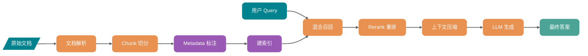
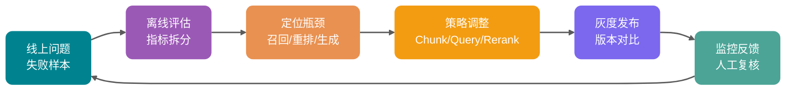
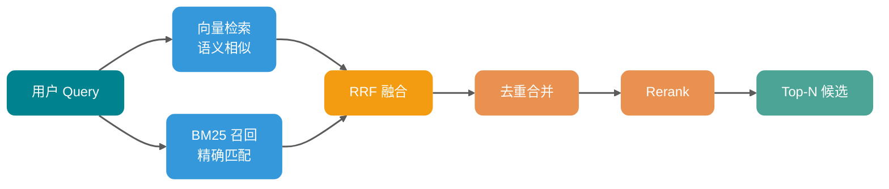
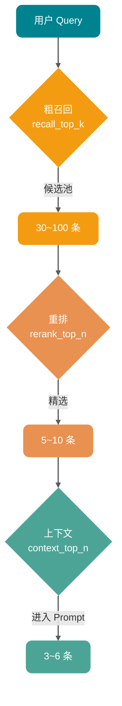
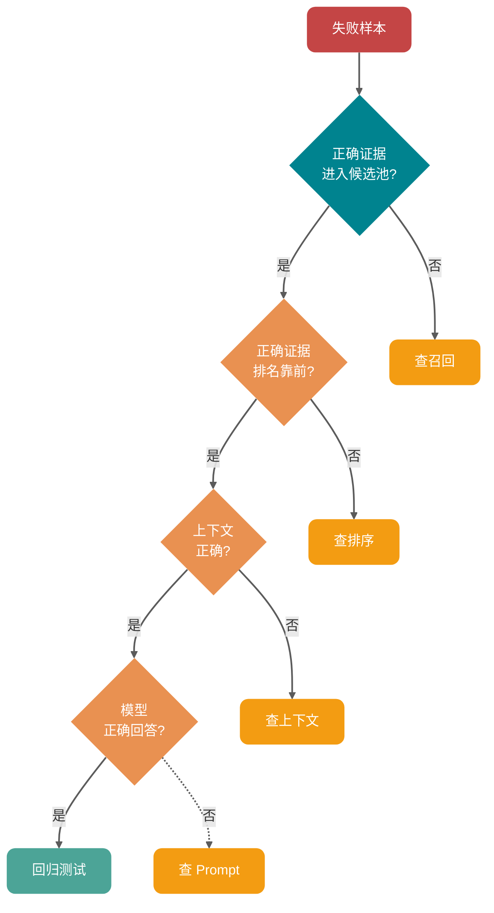

第一次做 RAG 时，很多人的体验都差不多：文档切了，向量库建了，Top-K 也调大了，模型还是一本正经地胡说八道。

更难受的是，问题可能出在文档解析、Chunk 切分、上下文质量等多个环节，而不是单纯的 embedding 或 Top-K 参数。

调一个企业知识库问答时，很容易陷入一个误区：一开始疯狂换 embedding 模型，结果线上错误率没明显下降。把失败样本拆开看才发现，60% 的问题根本不是向量相似度不够，而是 PDF 表格被解析坏了、Chunk 把条件和结论切开了、重排前的候选池里没有正确片段。

RAG 优化的第一条经验是：**它本质上是数据、切分、索引、召回、重排、上下文、生成、评估共同组成的系统工程，不是单点调参。**

这篇文章就把这条链路上每个环节的优化方法拆开来讲。接近 1.5w 字，建议收藏。主要内容：

1. 为什么 RAG 优化不能只盯着 embedding、Top-K 和大模型参数
2. Chunk、Metadata、Hybrid Search、Query Rewrite、Rerank、上下文压缩、答案评估各环节的作用
3. 生产环境里遇到 RAG 效果差时，应该按什么路径排查和收敛

## RAG 优化到底在优化什么？

先把心智模型摆正。

RAG 更像一条证据加工流水线：原始资料先被解析、清洗、切块、打标签、建索引；用户问题进来后，再经过查询理解、召回、重排、上下文构建，最后才交给 LLM 生成答案。

这条链路里任何一环出问题，都会传染到下游。

| 环节       | 典型问题                             | 最终表现                           |
| ---------- | ------------------------------------ | ---------------------------------- |
| 文档解析   | 表格错位、标题丢失、页码缺失         | 答案引用不准，关键条件丢失         |
| Chunk 切分 | 块太大、太小、语义边界被切断         | 召回噪声大，或者召回片段缺上下文   |
| Metadata   | 没有保存来源、时间、权限、章节       | 无法过滤，无法引用，容易越权       |
| 召回       | 只用向量检索，忽略关键词和结构化条件 | 错过错误码、SKU、版本号、专有名词  |
| 重排       | 直接把 Top-K 塞给模型                | 正确片段排在后面，模型看不到重点   |
| 上下文     | 不去重、不压缩、不排序               | Token 浪费，模型被噪声干扰         |
| 生成       | Prompt 没有限定证据边界              | 答案看起来流畅，但引用和事实对不上 |
| 评估       | 只看主观体验，不建测试集             | 改动靠感觉，线上反复回退           |

**RAG 优化的目标是提高最终答案的可用性、可追溯性和稳定性，而不是让每个环节看起来高级。**

一个粗暴但好用的判断标准：

- 用户问的问题，正确证据有没有被召回？
- 正确证据有没有排在足够靠前的位置？
- 放进上下文的内容是否足够少、足够准？
- 模型有没有严格基于证据回答？
- 每次改动有没有通过固定样本集验证？

这 5 个问题，比“用哪个向量库更好”重要得多。

## RAG 优化闭环

生产级 RAG 一定要有闭环。没有评估和回放，再多技巧都是玄学。

这张图的关键不是流程本身，而是两个字：**回放**。

每次调整 Chunk 大小、重写策略、Rerank 模型、Top-K 参数，都应该拿同一批问题跑一遍，比较 Context Recall、Context Precision、Faithfulness、Answer Relevancy、延迟和成本。

没有回放，就不知道变好了还是只是换了一种错法。

## 先做数据治理，再谈检索优化

很多 RAG 系统失败的原因是“被检索的数据一开始就不对”，而不是“检索不准”。

### 文档解析决定上限

PDF、Word、HTML、Markdown、数据库记录、工单日志，看起来都是文本，实际结构差异很大。尤其是 PDF 表格、图片、页眉页脚、脚注、跨页表格，如果只用普通文本抽取，常见结果是：

- 表格列关系丢失，价格、版本、条件混在一起。
- 页眉页脚被重复写入每个 Chunk，污染向量空间。
- 图片和流程图完全丢失，答案缺关键步骤。
- 标题层级消失，模型不知道一段话属于哪个章节。

对研发文档、政策文档、产品手册来说，**解析质量往往比换 embedding 模型更重要**。

一个实用建议：

| 文档类型        | 推荐处理方式                     | 核心目标       |
| --------------- | -------------------------------- | -------------- |
| Markdown / HTML | 保留标题层级、列表、代码块       | 不破坏天然结构 |
| PDF 文档        | 解析正文、表格、页码、图片说明   | 保住证据边界   |
| 表格型文档      | 转成结构化行记录或 Markdown 表格 | 保住字段关系   |
| 代码文档        | 按包、类、方法、注释分层         | 保住调用语义   |
| 工单/聊天记录   | 按会话、时间、角色切分           | 保住上下文顺序 |

如果数据源里有大量表格和图片，必要时可以引入 OCR 或多模态模型做结构化描述，但要注意成本和延迟。这里不要迷信“全都丢给视觉模型”，优先处理高价值文档和高频失败样本。

### Metadata 的作用

Metadata 不是给后台页面展示用的，它是检索的硬约束和答案的证据链。

至少建议为每个 Chunk 保存这些字段：

- `source_id`：原始文档 ID，便于回溯和去重。
- `source_type`：PDF、网页、工单、代码、数据库记录等。
- `title`：文档标题。
- `section_path`：章节路径，例如“退换货政策 / 售后范围 / 特殊商品”。
- `page`：页码或段落位置。
- `created_at` / `updated_at`：时间过滤和新旧版本判断。
- `tenant_id` / `acl`：多租户和权限控制。
- `business_tags`：产品线、语言、地区、版本、模块。

一个高频盲区是：**先向量检索，再做权限过滤**。

这很危险。假设向量库返回 Top-10，其中 8 条用户无权限，过滤后只剩 2 条，系统就会以为“只召回了 2 条相关内容”。更糟的是，如果过滤逻辑写错，还可能把越权内容塞进上下文。

更稳的做法是：**能预过滤就预过滤**。先用 Metadata 缩小检索范围，再做向量或混合检索。比如先限制 `tenant_id`、文档类型、版本范围、更新时间，再进入相似度计算。

## Chunk 策略：别把知识切碎了

Chunking 是 RAG 的地基。地基歪了，后面再重排也很难救。

### Chunk 大小没有万能值

很多教程喜欢给一个默认值：512、800、1000 Token。这个值只能当起点，不能当结论。

Chunk 太小，容易丢上下文。比如一句“以上情况不适用七天无理由退货”被切到下一块，前一块就会变成误导性证据。

Chunk 太大，又会把很多无关内容一起带进来。检索分数可能因为某一句话很相关而很高，但模型读到的是一整段混杂内容，信噪比反而下降。

Guide 的经验是：

- FAQ、短政策、接口说明：可以从 200 到 500 Token 起步。
- 技术文档、教程、方案文档：可以从 400 到 800 Token 起步。
- 法规、合同、金融政策：更关注条款完整性，优先按标题、条、款、项切。
- 代码类知识库：不要只按 Token 切，优先按文件、类、函数、注释块切。

真正的答案还是评估集给的。把 3 到 5 组 Chunk 参数建成不同索引，用同一批问题比较 Context Recall、Context Precision、答案正确率和平均上下文 Token。

### 语义切分适合稳定文档

语义切分的思路是：不机械按字符数截断，而是根据标题、段落、句子相似度或语义边界来切。

它适合这些场景：

- 文档主题混杂，一页里连续讲多个概念。
- 用户问题更偏概念型，而不是查某个字段。
- 知识库更新频率不高，可以接受较复杂的离线预处理。

它不适合这些场景：

- 文档频繁增量更新，每次重新聚类成本高。
- 文档结构本身已经很清晰，例如 Markdown 标题层级。
- 查询主要是精确查编号、字段、状态、配置项。

语义切分不一定越智能越好。如果你的知识库是接口文档，按 OpenAPI path、method、参数表切，通常比句子 embedding 聚类更可靠。

### Parent-Child Chunk 是很实用的折中

一个常用模式是：**小块负责召回，大块负责生成**。

比如把文档切成 300 Token 的子 Chunk 用于向量检索，但每个子 Chunk 都挂到一个 1200 Token 的父段落上。检索时先命中小块，再把对应父段落放入上下文。

好处很明显：

- 小块更容易精确命中问题。
- 父块保留必要上下文，减少断章取义。
- 比盲目扩大 Top-K 更可控。

适合长文档、教程、政策解读、故障手册等场景。

### 给 Chunk 增加语义入口

有些用户问题和文档原文的表达差异很大。用户问“钱怎么退”，文档写的是“退款申请路径”。这时可以在索引阶段增加额外表示：

- 给每个 Chunk 生成摘要，摘要和正文都入索引。
- 给每个 Chunk 生成可能回答的问题，用问题向量辅助召回。
- 给章节生成标题向量，让概念型问题先命中主题。
- 对代码或表格生成结构化描述，避免原文难以嵌入。

这类方法本质上是在给 Chunk 多开几个入口。代价是建库成本增加，所以建议优先用在高价值知识库，而不是全量无脑开启。

## 召回优化：不要只靠向量相似度

朴素 RAG 的召回通常是：把用户问题转 embedding，然后向量库 Top-K。这个方案能跑 demo，但生产里很快会遇到边界。

### Hybrid Search 是生产默认项

向量检索擅长语义相似，BM25 擅长精确词匹配。两者是互补关系，不是替代关系。

| 查询类型                  | 向量检索表现         | BM25 表现      | 建议               |
| ------------------------- | -------------------- | -------------- | ------------------ |
| “如何取消订阅”            | 能匹配“关闭自动续费” | 可能匹配不到   | 保留向量召回       |
| “错误码 E1027”            | 可能召回泛化故障     | 精确命中错误码 | 必须保留关键词召回 |
| “ABX-4421 型号参数”       | 容易找相似型号       | 精确命中 SKU   | 必须保留关键词召回 |
| “Java 线程池拒绝策略区别” | 语义理解较好         | 能匹配关键词   | 混合更稳           |
| “最新 v3.2 价格政策”      | 需要语义和时间条件   | 可匹配版本号   | Metadata + Hybrid  |

Hybrid Search 常见做法是两路召回后融合：

- 向量检索返回语义相似候选。
- BM25 或稀疏向量返回关键词候选。
- 用 RRF 或归一化加权分数合并。
- 对合并后的候选去重，再进入 Rerank。

Microsoft Azure AI Search、Google Vertex AI Vector Search、Weaviate 等官方文档都把 Hybrid Search 和 RRF 作为常见融合方式。RRF 的好处是不用强行比较 BM25 分数和向量余弦分数，按排名位置做融合，调参负担更低。

但别把 Hybrid Search 神化。

如果你的文档高度结构化、关键词很少，Hybrid 带来的增益可能有限；如果你的查询大量包含错误码、产品型号、配置项、专有名词，纯向量检索很容易翻车。

### Query Rewrite：先把问题变得可检索

用户的问题通常不是为检索系统写的。

他们会说：

- “这个报错咋整？”
- “钱能退吗？”
- “线上那个限流问题是不是又来了？”

这些问题对人来说有上下文，对检索系统来说却很模糊。Query Rewrite 的目标是：**不改变用户意图，把问题改写成更适合召回的表达**。

常见策略如下：

| 策略                | 适用场景                   | 例子                                                        |
| ------------------- | -------------------------- | ----------------------------------------------------------- |
| 规范化改写          | 口语化、缩写、上下文缺失   | “钱能退吗”改成“退款政策、退款条件、退款流程”                |
| Multi-Query         | 表达可能有多种说法         | 同时检索“取消订阅”“关闭自动续费”“停止会员计划”              |
| Query Decomposition | 问题包含多个子问题         | 把“对比 Stripe 和 Square 的手续费和争议处理”拆成 4 个子问题 |
| Step-back Query     | 问题太细，缺背景           | 先检索“订阅计费规则”，再回答具体取消问题                    |
| HyDE                | 查询太短，和文档形态差异大 | 先生成假设答案，再用假设答案向量检索真实文档                |
| Self-Query          | 问题里包含过滤条件         | 从“查 2025 年 Java 相关政策”提取年份和类别过滤              |

LangChain 的 MultiQueryRetriever、SelfQueryRetriever 等组件就是这类思路的工程化实现。

这里有个坑：**Query Rewrite 必须保留原始问题**。不要只用改写后的查询。工程上可以让原始 query 和改写 query 一起召回，然后融合结果。否则改写模型一旦理解错意图，后面召回全偏。

### Top-K 不是越大越好

盲目扩大 Top-K 是 RAG 调优里最常见的动作，也是最容易制造噪声的动作。

Top-K 变大，确实可能提高召回率。但它也会带来 3 个副作用：

- 候选变多，Rerank 延迟上升。
- 上下文变长，Token 成本上升。
- 无关内容变多，模型更容易被干扰。

更合理的做法是分层设置：

- `recall_top_k`：粗召回候选池，例如 30 到 100。
- `rerank_top_n`：重排后保留，例如 5 到 10。
- `context_top_n`：最终进入上下文，例如 3 到 6。

也就是说，Top-K 应该分阶段管理，而不是一个参数管到底。

## Rerank：把“相关”重新排成“可回答”

向量检索用的是双塔模型思路：query 和 document 分别编码，再算向量距离。它快，但不够细。

Rerank 通常使用 Cross-Encoder 或专用重排模型，把 query 和候选文档放在一起打分。它慢一些，但能更细粒度判断“这段文本是否真的能回答这个问题”。

### 为什么 Rerank 有用？

向量相似度更像“这两段话语义接近吗”，Rerank 更像“这段话能不能回答这个问题”。

举个例子：

用户问：“线程池为什么会触发拒绝策略？”

向量召回可能找出这些片段：

1. 线程池核心参数说明。
2. 拒绝策略枚举列表。
3. 队列满、线程数达到 maximumPoolSize 后触发拒绝策略的条件。
4. 线程池使用示例代码。

第 1、2 条语义很接近，但第 3 条才是答案核心。Rerank 的价值就是把第 3 条顶上来。

### Rerank 放在哪里？

推荐链路是：

1. Metadata 预过滤。
2. Hybrid Search 粗召回 30 到 100 条。
3. 去重和相邻片段合并。
4. Rerank 选出 5 到 10 条。
5. 上下文压缩后放入 Prompt。

如果候选池里没有正确答案，Rerank 也救不了。所以 Rerank 之前要先看 Context Recall。很多人直接上 reranker，发现没效果，根因是粗召回阶段就没把正确文档找出来。

### LLM Rerank 和专用 Reranker 怎么选？

| 方案                   | 优点                   | 缺点                             | 适用场景                     |
| ---------------------- | ---------------------- | -------------------------------- | ---------------------------- |
| Cross-Encoder Reranker | 相关性判断细，成本可控 | 需要选模型，可能有语言和领域偏差 | 通用生产链路                 |
| LLM 打分               | 可解释性强，规则灵活   | 慢、贵、稳定性受 Prompt 影响     | 小流量、高价值、复杂判断     |
| 规则重排               | 便宜、可控             | 只能处理明确规则                 | 时间、权限、版本、来源优先级 |
| 混合重排               | 灵活，适合复杂业务     | 工程复杂度高                     | 企业知识库、客服、合规场景   |

Guide 的建议：**默认用专用 reranker 做主链路，用规则补业务约束，用 LLM 打分做离线评估或高价值兜底。**

## 上下文工程：别把模型当垃圾桶

RAG 的最后一公里是上下文构建，而不是检索本身。

检索结果不是越多越好。LLM 的上下文窗口虽然越来越长，但注意力、延迟、成本和信噪比仍然是硬约束。无关上下文塞得越多，模型越容易出现以下问题：

- 抓错证据，把相似但不相关的段落当依据。
- 忽略中间位置的重要信息。
- 回答变长但不聚焦。
- 引用错来源。
- 成本和首字延迟明显上升。

**上下文工程的目标，是把有限 Token 留给最能回答问题的证据。**

### 上下文压缩

上下文压缩不是简单摘要，而是围绕当前 query 过滤证据。

常见方式有 3 种：

| 压缩方式     | 做法                       | 风险                 |
| ------------ | -------------------------- | -------------------- |
| 选择性抽取   | 只保留和问题相关的原句     | 可能漏掉隐含条件     |
| 查询相关摘要 | 把长片段压成围绕问题的摘要 | 可能引入改写偏差     |
| 结构化抽取   | 抽取字段、条件、结论、例外 | 依赖抽取 Schema 设计 |

LangChain 的 ContextualCompressionRetriever 就是“基础检索器 + 压缩器”的组合思路。实际落地时，可以先做便宜的规则过滤和去重，再对长片段做 LLM 压缩，避免每个 Chunk 都调用模型。

### 上下文排序也会影响答案

不要随便把检索结果按返回顺序拼接。

更合理的排序策略：

- 最相关证据放前面。
- 同一文档的相邻片段尽量保持原始顺序。
- 互相矛盾的片段标注更新时间和版本。
- 被引用的片段保留来源信息。
- 低置信度证据不要和高置信度证据混在一起。

如果问题需要跨文档对比，可以按“主题分组”组织上下文；如果问题需要按时间分析，可以按时间线组织上下文；如果问题是故障排查，可以按“现象、原因、处理步骤、注意事项”组织上下文。

这就是 Context Engineering 在 RAG 里的具体落点：**不仅决定检索什么，还决定检索结果以什么结构进入模型。**

### Prompt 要限制证据边界

RAG 生成 Prompt 至少要明确 4 条规则：

- 只基于给定上下文回答。
- 上下文不足时明确说无法判断。
- 每个关键结论尽量附来源。
- 不要把相似文档当成当前版本事实。

这几条看起来朴素，但很关键。很多幻觉不是模型不知道，而是 Prompt 没有告诉它“证据不足时可以拒答”。

## 评估：不做评估，优化就是玄学

RAG 评估要拆开看。只看最终答案分数，很难知道到底是哪一环坏了。

### 建一套最小评估集

不用一开始就搞几千条样本。先从 50 到 100 条高价值问题开始：

- 高频用户问题。
- 线上失败问题。
- 业务关键问题。
- 多跳推理问题。
- 精确匹配问题，例如错误码、版本号、SKU。
- 容易越权或过期的问题。
- 应该拒答的问题。

每条样本最好包含：

- `question`：用户原始问题。
- `golden_answer`：理想答案。
- `golden_context`：应该命中的证据片段或文档。
- `metadata_filter`：必要过滤条件。
- `answer_type`：事实问答、流程说明、对比、拒答、摘要等。

### 检索指标和生成指标分开

| 指标              | 衡量对象   | 说明                                  |
| ----------------- | ---------- | ------------------------------------- |
| Hit Rate@K        | 召回       | 正确证据是否出现在前 K 个结果里       |
| MRR               | 排序       | 第一个正确证据排得有多靠前            |
| Context Recall    | 召回完整性 | 回答所需证据是否被找全                |
| Context Precision | 上下文纯度 | 放入上下文的内容有多少是真的相关      |
| Faithfulness      | 生成忠实度 | 答案是否能被上下文支撑                |
| Answer Relevancy  | 回答相关性 | 答案是否真正回应用户问题              |
| Citation Accuracy | 引用准确性 | 引用位置是否支撑对应结论              |
| Latency / Cost    | 工程指标   | P95 延迟、Token、重排耗时、缓存命中率 |

RAGAS、DeepEval、LangSmith 等工具都支持围绕上下文相关性、忠实度、答案相关性做评估。RAGAS 文档里把 Context Precision、Context Recall、Faithfulness、Response Relevancy 等指标拆得比较清楚；DeepEval 也支持把检索和生成指标组合成端到端测试。

但要记住：**LLM-as-a-Judge 不是裁判真理，它只是辅助信号。**

上线前至少抽样人工复核一批结果，校准自动评估器是否偏向长答案、是否漏判引用错误、是否对中文领域术语不敏感。

### 每次改动都要版本化

建议记录这些版本：

- 文档解析器版本。
- Chunk 策略版本。
- Embedding 模型版本。
- 索引参数版本。
- Query Rewrite Prompt 版本。
- Rerank 模型版本。
- 生成 Prompt 版本。
- 评估集版本。

否则今天效果变好，明天一更新知识库又变差，你很难知道是哪一步引入了回归。

## 常见错误

### 错误一：只调 embedding

Embedding 很重要，但它不是全部。

如果 PDF 表格解析错了、Chunk 把条件切丢了、Metadata 没有过滤权限、召回候选里没有正确文档，换再贵的 embedding 模型也只是让错误更稳定。

正确做法：先用评估集判断是召回问题、排序问题、上下文问题还是生成问题，再决定要不要换 embedding。

### 错误二：不做评估

“我感觉好多了”不是指标。

RAG 的改动经常是局部变好、整体变差。比如 Top-K 变大后某些问题能答了，但另一些问题开始被噪声干扰。如果没有固定样本集，你只会记住变好的案例。

正确做法：建立最小评估集，至少覆盖高频问题、失败问题、精确匹配问题、拒答问题。

### 错误三：盲目扩大 Top-K

Top-K 变大不是免费的。

它会增加重排成本、Prompt Token、模型延迟，还会降低上下文信噪比。很多时候应该提高粗召回候选池，再用 Rerank 和压缩筛掉噪声，而不是把更多内容直接塞给模型。

正确做法：区分粗召回 Top-K、重排 Top-N、上下文 Top-N。

### 错误四：把无关上下文塞给模型

上下文窗口不是仓库，更不是垃圾桶。

无关上下文会稀释注意力，也会给模型制造错误依据。尤其是多个版本的政策、相似产品文档、相邻但无关段落混在一起时，模型很容易合成一个看似合理但事实错误的答案。

正确做法：去重、压缩、按证据强度排序，并明确版本和来源。

### 错误五：忽略拒答能力

RAG 不应该永远给答案。

当检索结果置信度低、证据互相矛盾、用户无权限访问关键文档时，系统应该拒答、追问或升级人工，而不是编一个流畅答案。

正确做法：在检索后增加证据质量判断，低置信度时触发重写查询、扩大范围、外部搜索或拒答。

## 一套可落地的排查路径

最后给一套 Guide 比较推荐的排查路径。线上 RAG 效果差时，不要一上来改 Prompt 或换模型，按下面顺序走。

### 第一步：把失败样本分类

先看 20 到 50 条失败问题，把它们分成几类：

- 完全没召回正确文档。
- 召回了正确文档，但排名靠后。
- 正确文档进入上下文，但答案没用上。
- 答案用了上下文，但理解错了。
- 引用了不存在或不相关来源。
- 应该拒答却强行回答。
- 权限、时间、版本过滤错误。

这一步的价值很高，因为每类问题对应的修复方向完全不同。

### 第二步：先看正确证据有没有进入候选池

如果粗召回 Top-50 里都没有正确证据，优先查：

- 文档是否入库。
- 文档解析是否正确。
- Chunk 是否切断关键事实。
- Metadata 过滤是否过严。
- Query 是否需要改写、分解或 HyDE。
- 是否需要 BM25 或 Hybrid Search。

这时不要先上 Rerank。候选池里没有答案，重排只是重新排列错误。

### 第三步：正确证据在候选池里但没进上下文

如果正确证据在 Top-50，但不在最终上下文，重点查：

- Rerank 模型是否适配语言和领域。
- Rerank 输入是否过长被截断。
- 分数融合是否让关键词结果被压下去。
- 相邻 Chunk 合并是否把噪声一起带入。
- `rerank_top_n` 是否过小。

这类问题通常通过重排、融合权重、候选池大小和去重策略解决。

### 第四步：上下文正确但答案错误

如果正确证据已经放进 Prompt，模型还是答错，重点查：

- Prompt 是否要求基于上下文回答。
- 上下文是否有互相冲突的版本。
- 证据是否在上下文中间位置被淹没。
- 问题是否需要多跳推理或对比表。
- 是否需要结构化输出和引用约束。
- 是否需要先压缩再生成。

这时才应该重点调 Prompt、上下文排序、压缩和生成模型。

### 第五步：建立回归测试

每修一个失败样本，就把它加入评估集。

RAG 系统最怕“修 A 坏 B”。只有失败样本持续沉淀，系统才会越调越稳。

## 生产调优建议

如果你要从零搭一套企业 RAG，Guide 建议按这个优先级落地：

1. 先做数据治理：保证文档解析、去噪、标题层级、页码、表格、Metadata 正确。
2. 建立最小评估集：先用 50 条真实问题跑通回放流程。
3. 调 Chunk 策略：对比固定长度、结构化切分、Parent-Child、语义切分。
4. 引入 Hybrid Search：向量召回负责语义，BM25 或稀疏向量负责精确词。
5. 加入 Query Rewrite：优先处理口语化、缩写、多意图和多跳问题。
6. 加 Rerank：粗召回扩大候选池，重排后只保留高质量证据。
7. 做上下文压缩：去重、裁剪、摘要、结构化抽取，控制 Token 和噪声。
8. 完善生成约束：证据不足就拒答，关键结论带引用。
9. 灰度和监控：按版本记录指标，持续收集失败样本。

这套路径不花哨，但能收敛。

## 要点回顾

RAG 优化不是“换一个更强 embedding 模型”这么简单。真正有效的调优，必须沿着完整链路拆：

- **数据决定上限**：解析、清洗、结构保留、Metadata 是地基。
- Chunk 决定召回粒度：不要迷信默认大小，要用评估集选参数。
- Hybrid Search 提升稳健性：向量负责语义，BM25 负责精确匹配。
- Query Rewrite 解决表达差异：改写、分解、HyDE、Self-Query 都是让问题更可检索。
- Rerank 决定证据顺序：粗召回要全，重排要准。
- 上下文工程决定信噪比：压缩、去重、排序、引用比盲目塞内容更重要。
- 评估决定能否持续优化：没有测试集、没有回放、没有指标，就只能靠感觉调参。

最后记住一句话：**RAG 的瓶颈通常不在某一个参数，而在证据从原始文档走到最终答案的整条路径上。**

## 参考资料

- [Production RAG: The Five Decisions Behind Every System That Works](https://www.bestblogs.dev/article/899eff0a)
- [RAG 优化字典：20 种 RAG 优化方法全解析](https://cloud.tencent.com/developer/article/2634637)
- [Weaviate Hybrid Search Documentation](https://docs.weaviate.io/weaviate/concepts/search/hybrid-search)
- [Microsoft Azure AI Search: Hybrid Search RRF](https://learn.microsoft.com/en-us/azure/search/hybrid-search-ranking)
- [Google Vertex AI Vector Search: Hybrid Search](https://docs.cloud.google.com/vertex-ai/docs/vector-search/about-hybrid-search)
- [Cohere Rerank Documentation](https://docs.cohere.com/docs/rerank-overview)
- [LangChain Retriever API Documentation](https://api.python.langchain.com/en/latest/langchain/retrievers.html)
- [RAGAS Metrics Documentation](https://docs.ragas.io/en/stable/concepts/metrics/available_metrics/context_precision/)
- [DeepEval RAG Evaluation Guide](https://deepeval.com/guides/guides-rag-evaluation)
