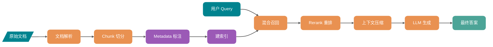
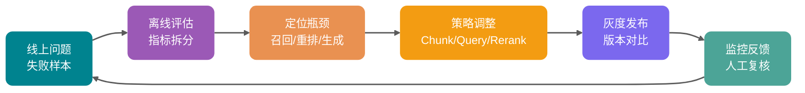
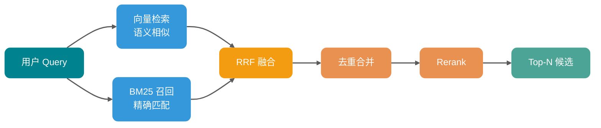
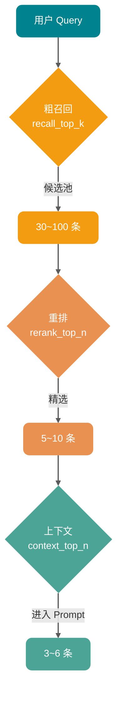
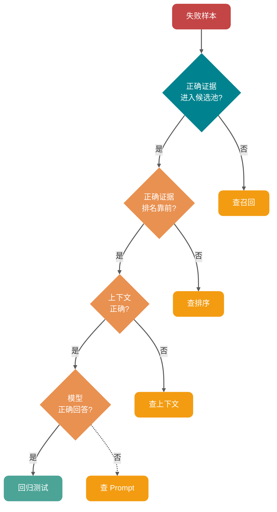

RAG 答错时，直接更换 Embedding 模型或扩大 Top-K 很难稳定解决问题。PDF 表格解析错误、Chunk 切断条件、权限过滤过晚、候选池缺少正确证据，都会让生成模型拿到错误上下文。

调优时要沿着文档、索引、召回、重排、上下文和生成逐段定位，再用固定评测集回放改动。

## RAG 优化到底在优化什么？

RAG 更像一条证据加工流水线：原始资料先被解析、清洗、切块、打标签、建索引；用户问题进来后，再经过查询理解、召回、重排、上下文构建，最后才交给 LLM 生成答案。

这条链路里任何一环出问题，都会传染到下游。

| 环节       | 典型问题                             | 最终表现                           |
| ---------- | ------------------------------------ | ---------------------------------- |
| 文档解析   | 表格错位、标题丢失、页码缺失         | 答案引用不准，关键条件丢失         |
| Chunk 切分 | 块太大、太小、语义边界被切断         | 召回噪声大，或者召回片段缺上下文   |
| Metadata   | 没有保存来源、时间、权限、章节       | 无法过滤，无法引用，容易越权       |
| 召回       | 只用向量检索，忽略关键词和结构化条件 | 错过错误码、SKU、版本号、专有名词  |
| 重排       | 直接把 Top-K 塞给模型                | 正确片段排在后面，模型看不到重点   |
| 上下文     | 不去重、不压缩、不排序               | Token 浪费，模型被噪声干扰         |
| 生成       | Prompt 没有限定证据边界              | 答案看起来流畅，但引用和事实对不上 |
| 评估       | 只看主观体验，不建测试集             | 改动靠感觉，线上反复回退           |

一次 RAG 调优是否有效，最终要落到答案的可用性、可追溯性、稳定性，以及为此付出的延迟和成本上。对每个失败样本，至少要留下五项检查结果：正确证据是否被召回、在候选中的排名、进入上下文的内容、回答是否受证据约束，以及改动能否在固定样本集上复现。缺少这些记录时，讨论向量库选型没有明确的判断依据。

```mermaid
flowchart LR
    %% ========== classDef 配色声明 ==========
    classDef client fill:#00838F,color:#FFFFFF,stroke:none,rx:10,ry:10
    classDef business fill:#E99151,color:#FFFFFF,stroke:none,rx:10,ry:10
    classDef infra fill:#9B59B6,color:#FFFFFF,stroke:none,rx:10,ry:10
    classDef success fill:#4CA497,color:#FFFFFF,stroke:none,rx:10,ry:10

    %% ========== 节点声明 ==========
    Doc[/原始文档/]:::client
    Parse[文档解析]:::business
    Chunk[Chunk 切分]:::business
    Meta[Metadata 标注]:::infra
    Index[建索引]:::infra
    Query[用户 Query]:::client
    Recall[混合召回]:::business
    Rerank[Rerank 重排]:::business
    Compress[上下文压缩]:::business
    LLM[LLM 生成]:::business
    Answer[最终答案]:::success

    %% ========== 连线 ==========
    Doc --> Parse --> Chunk --> Meta --> Index
    Query --> Recall
    Index --> Recall
    Recall --> Rerank --> Compress --> LLM --> Answer

    linkStyle default stroke-width:2px,stroke:#333333,opacity:0.8
```

## RAG 优化闭环

生产级 RAG 需要评估和回放。否则无法判断一次改动改善了哪些问题，又引入了哪些回归。

```mermaid
flowchart LR
    Q["线上问题<br/>失败样本"]:::client --> E["离线评估<br/>指标拆分"]:::infra
    E --> L["定位瓶颈<br/>召回/重排/生成"]:::business
    L --> T["策略调整<br/>Chunk/Query/Rerank"]:::warning
    T --> G["灰度发布<br/>版本对比"]:::gateway
    G --> M["监控反馈<br/>人工复核"]:::success
    M --> Q

    classDef gateway fill:#7B68EE,color:#FFFFFF,stroke:none,rx:10,ry:10
    classDef business fill:#E99151,color:#FFFFFF,stroke:none,rx:10,ry:10
    classDef infra fill:#9B59B6,color:#FFFFFF,stroke:none,rx:10,ry:10
    classDef client fill:#00838F,color:#FFFFFF,stroke:none,rx:10,ry:10
    classDef success fill:#4CA497,color:#FFFFFF,stroke:none,rx:10,ry:10
    classDef warning fill:#F39C12,color:#FFFFFF,stroke:none,rx:10,ry:10
    linkStyle default stroke-width:2px,stroke:#333333,opacity:0.8
```

每次调整 Chunk 大小、重写策略、Rerank 模型、Top-K 参数，都应该拿同一批问题跑一遍，比较 Context Recall、Context Precision、Faithfulness、Answer Relevancy、延迟和成本。

没有回放，就不知道变好了还是只是换了一种错法。

## 先做数据治理，再谈检索优化

检索前的数据如果已经解析错位或丢失结构，后面的召回和生成无法恢复原始证据。

### 文档解析决定上限

PDF、Word、HTML、Markdown、数据库记录、工单日志，看起来都是文本，实际结构差异很大。尤其是 PDF 表格、图片、页眉页脚、脚注、跨页表格，如果只用普通文本抽取，常见结果是：

- 表格列关系丢失，价格、版本、条件混在一起。
- 页眉页脚被重复写入每个 Chunk，污染向量空间。
- 图片和流程图完全丢失，答案缺关键步骤。
- 标题层级消失，模型不知道一段话属于哪个章节。

对研发文档、政策文档、产品手册来说，**解析质量往往比换 embedding 模型更重要**。

一个实用建议：

| 文档类型        | 推荐处理方式                     | 核心目标       |
| --------------- | -------------------------------- | -------------- |
| Markdown / HTML | 保留标题层级、列表、代码块       | 不破坏天然结构 |
| PDF 文档        | 解析正文、表格、页码、图片说明   | 保住证据边界   |
| 表格型文档      | 转成结构化行记录或 Markdown 表格 | 保住字段关系   |
| 代码文档        | 按包、类、方法、注释分层         | 保住调用语义   |
| 工单/聊天记录   | 按会话、时间、角色切分           | 保住上下文顺序 |

表格和图片占比高时，可以为命中率低的文档补 OCR 或多模态结构化描述。不要把全量文件直接交给视觉模型：先从高价值文档和高频失败样本开始，观察解析收益是否覆盖新增的处理成本和等待时间。

### Metadata 的作用

检索请求中的过滤条件和最终答案的来源信息，都依赖 Metadata。它既决定哪些 Chunk 可以进入候选池，也让结果能回到原文、页码和对应版本。

至少建议为每个 Chunk 保存这些字段：

- `source_id`：原始文档 ID，便于回溯和去重。
- `source_type`：PDF、网页、工单、代码、数据库记录等。
- `title`：文档标题。
- `section_path`：章节路径，例如“退换货政策 / 售后范围 / 特殊商品”。
- `page`：页码或段落位置。
- `created_at` / `updated_at`：时间过滤和新旧版本判断。
- `tenant_id` / `acl`：多租户和权限控制。
- `business_tags`：产品线、语言、地区、版本、模块。

权限过滤要在召回前参与查询。若向量库先返回 Top-10、其中 8 条无权访问，过滤后剩下的 2 条不能说明系统只找到了两条相关内容；权限条件一旦漏配，还会直接污染上下文。

因此，能由 Metadata 表达的范围应先收紧。例如先限定 `tenant_id`、文档类型、版本和更新时间，再计算向量相似度或执行混合检索。

## Chunk 策略：别把知识切碎了

Chunk 的边界决定召回单位能带走多少条件和结论。条件被切进相邻块后，即使后面使用重排，也只能在不完整的候选里做选择。

### Chunk 大小没有万能值

512、800、1000 Token 只能用来建立第一轮实验索引。对于“以上情况不适用七天无理由退货”这类带前置条件的句子，切得过细会只留下结论；切得过大时，一个相关句子又会把整段无关说明带进上下文。

第一轮可以从以下范围开始：

- FAQ、短政策、接口说明：可以从 200 到 500 Token 起步。
- 技术文档、教程、方案文档：可以从 400 到 800 Token 起步。
- 法规、合同、金融政策：更关注条款完整性，优先按标题、条、款、项切。
- 代码类知识库：不要只按 Token 切，优先按文件、类、函数、注释块切。

为这些候选参数分别建索引，用同一批问题比较 Context Recall、Context Precision、答案正确率和平均上下文 Token，再保留适合当前文档集合的一组。

### 语义切分适合稳定文档

语义切分会结合标题、段落和相邻句子的关系确定边界，不按固定字符数截断。文档主题混杂、问题偏概念查询且可接受较复杂离线处理时，通常可将它纳入实验：

- 文档主题混杂，一页里连续讲多个概念。
- 用户问题更偏概念型，而不是查某个字段。
- 知识库更新频率不高，可以接受较复杂的离线预处理。

这类切分也有明确的适用边界：

- 文档频繁增量更新时，变更文档需要重新计算句子或段落 Embedding，离线成本高于结构化切分。常见语义切分在单篇文档内部判断相邻内容，不要求每次重新聚类整个知识库。
- 文档结构本身已经很清晰，例如 Markdown 标题层级。
- 查询主要是精确查编号、字段、状态、配置项。

接口文档已有 OpenAPI path、method 和参数表时，应按这些结构切分。若改由句子 Embedding 判断边界，参数和返回条件可能被拆开。

### Parent-Child Chunk 是很实用的折中

Parent-Child Chunk 将召回粒度与阅读粒度分开处理。以 300 Token 的子 Chunk 建向量索引，并把它关联到 1200 Token 的父段落；命中子块后，再把父段落带入上下文。这样既能让问题命中细粒度表述，也能保留前置条件和相邻说明，而无需仅靠扩大 Top-K 补上下文。长文档、教程、政策解读和故障手册都可用这种关联关系。

### 给 Chunk 增加语义入口

“钱怎么退”和“退款申请路径”表达的是同一需求，但文本表面相似度未必足够。遇到这类差异时，可以在索引阶段为同一 Chunk 提供额外入口：

- 给每个 Chunk 生成摘要，摘要和正文都入索引。
- 给每个 Chunk 生成可能回答的问题，用问题向量辅助召回。
- 给章节生成标题向量，让概念型问题先命中主题。
- 对代码或表格生成结构化描述，避免原文难以嵌入。

摘要、问题和结构化描述都需要重新生成和维护。先在高价值文档或高频失败样本上验证这些入口能否补回遗漏的证据，再决定是否扩大范围。

## 召回优化：不要只靠向量相似度

将 Query 转为 Embedding 后取 Top-K 可以作为基线。错误码、型号和版本号这类精确词容易被近义但错误的内容挤掉，需要额外的关键词召回信号。

### Hybrid Search 适合哪些查询？

向量检索按语义接近程度找候选，BM25 按出现的词项匹配候选。两路结果在下表中的查询类型上各有覆盖范围。

| 查询类型                  | 向量检索表现         | BM25 表现      | 建议               |
| ------------------------- | -------------------- | -------------- | ------------------ |
| “如何取消订阅”            | 能匹配“关闭自动续费” | 可能匹配不到   | 保留向量召回       |
| “错误码 E1027”            | 可能召回泛化故障     | 精确命中错误码 | 必须保留关键词召回 |
| “ABX-4421 型号参数”       | 容易找相似型号       | 精确命中 SKU   | 必须保留关键词召回 |
| “Java 线程池拒绝策略区别” | 语义理解较好         | 能匹配关键词   | 混合更稳           |
| “最新 v3.2 价格政策”      | 需要语义和时间条件   | 可匹配版本号   | Metadata + Hybrid  |

```mermaid
flowchart LR
    %% ========== classDef 配色声明 ==========
    classDef client fill:#00838F,color:#FFFFFF,stroke:none,rx:10,ry:10
    classDef business fill:#E99151,color:#FFFFFF,stroke:none,rx:10,ry:10
    classDef cache fill:#3498DB,color:#FFFFFF,stroke:none,rx:10,ry:10
    classDef success fill:#4CA497,color:#FFFFFF,stroke:none,rx:10,ry:10
    classDef warning fill:#F39C12,color:#FFFFFF,stroke:none,rx:10,ry:10

    %% ========== 节点声明 ==========
    Query[用户 Query]:::client
    Vec[向量检索<br/>语义相似]:::cache
    BM25[BM25 召回<br/>精确匹配]:::cache
    RRF[RRF 融合]:::warning
    Dedupe[去重合并]:::business
    Rerank[Rerank]:::business
    Final[Top-N 候选]:::success

    %% ========== 连线 ==========
    Query --> Vec
    Query --> BM25
    Vec --> RRF
    BM25 --> RRF
    RRF --> Dedupe --> Rerank --> Final

    linkStyle default stroke-width:2px,stroke:#333333,opacity:0.8
```

实际链路会并行取语义候选和关键词候选，使用 RRF 或归一化加权合并，再对合并结果去重并交给 Rerank。Microsoft Azure AI Search、Google Vertex AI Vector Search、Weaviate 都将 Hybrid Search 和 RRF 作为常见方案。RRF 只依据候选名次融合，不必把 BM25 分数与向量余弦分数直接换算到同一尺度。

文档高度结构化且查询几乎不含关键词时，Hybrid 的增益可能不明显。相反，错误码、产品型号、配置项和专有名词占比较高的查询，需要保留关键词通道，避免相似但不包含精确实体的文档排到前面。

### Query Rewrite：先把问题变得可检索

用户输入往往缺少检索需要的对象、时间和范围。例如：

- “这个报错咋整？”
- “钱能退吗？”
- “线上那个限流问题是不是又来了？”

“这个报错咋整”没有说明报错码和服务，“钱能退吗”没有说明订单状态。Query Rewrite 要补出可检索的表达，但不能替用户改变问题的含义。

常见策略如下：

| 策略                | 适用场景                   | 例子                                                        |
| ------------------- | -------------------------- | ----------------------------------------------------------- |
| 规范化改写          | 口语化、缩写、上下文缺失   | “钱能退吗”改成“退款政策、退款条件、退款流程”                |
| Multi-Query         | 表达可能有多种说法         | 同时检索“取消订阅”“关闭自动续费”“停止会员计划”              |
| Query Decomposition | 问题包含多个子问题         | 把“对比 Stripe 和 Square 的手续费和争议处理”拆成 4 个子问题 |
| Step-back Query     | 问题太细，缺背景           | 先检索“订阅计费规则”，再回答具体取消问题                    |
| HyDE                | 查询太短，和文档形态差异大 | 先生成假设答案，再用假设答案向量检索真实文档                |
| Self-Query          | 问题里包含过滤条件         | 从“查 2025 年 Java 相关政策”提取年份和类别过滤              |

LangChain 的 MultiQueryRetriever、SelfQueryRetriever 等组件对这些策略做了封装。无论是否使用这些组件，原始 Query 都应和改写结果一起参与召回并融合：改写模型把“退款”错误理解为“取消订阅”时，原始 Query 仍能保留正确的召回入口。

### Top-K 不是越大越好

扩大 Top-K 会增加正确证据进入候选池的机会，也会同时拉高 Rerank 的输入量、Prompt Token 和噪声比例。候选池、重排结果和最终上下文应使用不同的上限：

- `recall_top_k`：粗召回候选池，例如 30 到 100。
- `rerank_top_n`：重排后保留，例如 5 到 10。
- `context_top_n`：最终进入上下文，例如 3 到 6。

```mermaid
flowchart TB
    %% ========== classDef 配色声明 ==========
    classDef client fill:#00838F,color:#FFFFFF,stroke:none,rx:10,ry:10
    classDef business fill:#E99151,color:#FFFFFF,stroke:none,rx:10,ry:10
    classDef warning fill:#F39C12,color:#FFFFFF,stroke:none,rx:10,ry:10
    classDef success fill:#4CA497,color:#FFFFFF,stroke:none,rx:10,ry:10

    %% ========== 节点声明 ==========
    Start[用户 Query]:::client
    Recall{粗召回<br/>recall_top_k}:::warning
    Rerank{重排<br/>rerank_top_n}:::business
    Context{上下文<br/>context_top_n}:::success
    Candidates["30~100 条"]:::warning
    TopN["5~10 条"]:::business
    Final["3~6 条"]:::success

    %% ========== 连线 ==========
    Start --> Recall
    Recall -->|候选池| Candidates
    Candidates --> Rerank
    Rerank -->|精选| TopN
    TopN --> Context
    Context -->|进入 Prompt| Final

    linkStyle default stroke-width:2px,stroke:#333333,opacity:0.8
```

`recall_top_k` 用于防止漏召回，`rerank_top_n` 用于控制精排成本，`context_top_n` 则由模型实际可阅读的证据量决定。三者应在同一评估集上一起调整。

## Rerank：把“相关”重新排成“可回答”

双塔检索会分别编码 Query 和文档，再计算向量距离，适合从大量文档中快速取候选。Cross-Encoder 或专用重排模型则把 Query 和候选文档一起编码，成本更高，但能判断候选是否包含回答所需的条件和结论。

### 为什么 Rerank 有用？

向量分数衡量的是表达是否接近；重排分数应服务于“这段内容能否回答当前问题”。

举个例子：

用户问：“线程池为什么会触发拒绝策略？”

向量召回可能找出这些片段：

1. 线程池核心参数说明。
2. 拒绝策略枚举列表。
3. 队列满、线程数达到 maximumPoolSize 后触发拒绝策略的条件。
4. 线程池使用示例代码。

第 1、2 条语义很接近，但第 3 条才是答案核心。Rerank 的价值就是把第 3 条顶上来。

### Rerank 放在哪里？

可将链路拆为五步：Metadata 预过滤，Hybrid Search 粗召回 30 到 100 条，去重并合并相邻片段，Rerank 选出 5 到 10 条，最后压缩后写入 Prompt。

Rerank 不会补回候选池中不存在的文档。先检查 Context Recall；如果粗召回没有正确片段，应回到解析、Chunk 和查询侧排查，而不是继续更换重排模型。

### LLM Rerank 和专用 Reranker 怎么选？

| 方案                   | 优点                     | 缺点                                             | 适用场景                     |
| ---------------------- | ------------------------ | ------------------------------------------------ | ---------------------------- |
| Cross-Encoder Reranker | 相关性判断细，成本可控   | 需要选模型，可能有语言和领域偏差                 | 通用生产链路                 |
| LLM 打分               | 可输出评分理由，规则灵活 | 慢、贵、稳定性受 Prompt 影响；理由不等于决策真相 | 小流量、高价值、复杂判断     |
| 规则重排               | 便宜、可控               | 只能处理明确规则                                 | 时间、权限、版本、来源优先级 |
| 混合重排               | 灵活，适合复杂业务       | 工程复杂度高                                     | 企业知识库、客服、合规场景   |

专用 Reranker 可以承担主链路的相关性判断，时间、权限和版本等确定条件交给规则处理；LLM 打分适合离线评估或低流量的复杂判断。选择模型时要在目标语言、领域数据、延迟和成本上分别对比。

## 上下文工程：别把模型当垃圾桶

召回完成后，还要决定哪些片段以何种顺序进入 Prompt。上下文窗口变大并不意味着可以忽略注意力、延迟、成本和信噪比；不相关的片段会占据模型阅读位置，并造成以下后果：

- 抓错证据，把相似但不相关的段落当依据。
- 忽略中间位置的重要信息。
- 回答变长但不聚焦。
- 引用错来源。
- 成本和首字延迟明显上升。

每个进入 Prompt 的片段都应能支撑当前问题中的一个结论、条件或例外。

### 上下文压缩

压缩操作围绕当前 Query 保留证据，而不是把所有候选统一摘要。常见选择如下：

| 压缩方式     | 做法                       | 风险                 |
| ------------ | -------------------------- | -------------------- |
| 选择性抽取   | 只保留和问题相关的原句     | 可能漏掉隐含条件     |
| 查询相关摘要 | 把长片段压成围绕问题的摘要 | 可能引入改写偏差     |
| 结构化抽取   | 抽取字段、条件、结论、例外 | 依赖抽取 Schema 设计 |

ContextualCompressionRetriever 体现了“基础检索器加压缩器”的组合。实践中可先按规则过滤和去重，再仅对较长片段调用 LLM 压缩，避免为每个 Chunk 付出模型调用成本。

### 上下文排序也会影响答案

返回顺序通常混合了召回通道、文档来源和版本，不能直接作为 Prompt 顺序。可按以下规则组织：

- 最相关证据放前面。
- 同一文档的相邻片段尽量保持原始顺序。
- 互相矛盾的片段标注更新时间和版本。
- 被引用的片段保留来源信息。
- 低置信度证据不要和高置信度证据混在一起。

跨文档对比可按主题分组，时间分析可按时间线排列，故障排查则可按“现象、原因、处理步骤、注意事项”组织。上下文工程处理的是这些证据在模型输入中的结构，而不仅是召回数量。

### Prompt 要限制证据边界

Prompt 至少应写清以下边界：

- 只基于给定上下文回答。
- 上下文不足时明确说无法判断。
- 每个关键结论尽量附来源。
- 不要把相似文档当成当前版本事实。

证据质量判断和引用校验仍需在 Prompt 外执行。提示词能表达“证据不足时拒答”，但无法独自验证模型是否遵守。

## 评估：分开定位检索和生成问题

RAG 评估要拆开看。只看最终答案分数，很难知道到底是哪一环坏了。

### 建一套最小评估集

不用一开始就搞几千条样本。先从 50 到 100 条高价值问题开始：

- 高频用户问题。
- 线上失败问题。
- 业务关键问题。
- 多跳推理问题。
- 精确匹配问题，例如错误码、版本号、SKU。
- 容易越权或过期的问题。
- 应该拒答的问题。

每条样本最好包含：

- `question`：用户原始问题。
- `golden_answer`：理想答案。
- `golden_context`：应该命中的证据片段或文档。
- `metadata_filter`：必要过滤条件。
- `answer_type`：事实问答、流程说明、对比、拒答、摘要等。

### 检索指标和生成指标分开

| 指标              | 衡量对象   | 说明                                  |
| ----------------- | ---------- | ------------------------------------- |
| Hit Rate@K        | 召回       | 正确证据是否出现在前 K 个结果里       |
| MRR               | 排序       | 第一个正确证据排得有多靠前            |
| Context Recall    | 召回完整性 | 回答所需证据是否被找全                |
| Context Precision | 上下文纯度 | 放入上下文的内容有多少是真的相关      |
| Faithfulness      | 生成忠实度 | 答案是否能被上下文支撑                |
| Answer Relevancy  | 回答相关性 | 答案是否真正回应用户问题              |
| Citation Accuracy | 引用准确性 | 引用位置是否支撑对应结论              |
| Latency / Cost    | 工程指标   | P95 延迟、Token、重排耗时、缓存命中率 |

RAGAS、DeepEval、LangSmith 等工具都支持围绕上下文相关性、忠实度、答案相关性做评估。RAGAS 文档里把 Context Precision、Context Recall、Faithfulness、Response Relevancy 等指标拆得比较清楚；DeepEval 也支持把检索和生成指标组合成端到端测试。

但要记住：**LLM-as-a-Judge 不是裁判真理，它只是辅助信号。**

上线前至少抽样人工复核一批结果，校准自动评估器是否偏向长答案、是否漏判引用错误、是否对中文领域术语不敏感。

### 每次改动都要版本化

一次评测结果必须能对应到以下版本信息：

- 文档解析器版本。
- Chunk 策略版本。
- Embedding 模型版本。
- 索引参数版本。
- Query Rewrite Prompt 版本。
- Rerank 模型版本。
- 生成 Prompt 版本。
- 评估集版本。

知识库更新后指标发生变化时，这些记录才能定位是解析、索引、检索还是生成侧引入了回归。

## 常见错误

### 只调 Embedding

PDF 表格解析错误、Chunk 丢掉前置条件、Metadata 未过滤权限，或者正确文档根本没有进入候选池时，Embedding 换得再好也无法补回缺失证据。应先在评估集上区分召回、排序、上下文和生成问题，再决定是否调整 Embedding。

### 不做评估

单个回答看起来更好，不能说明整体效果提高。Top-K 变大后，部分问题可能补回证据，另一些问题却被噪声干扰；没有固定样本集时，很难同时看到两种变化。最小评估集应覆盖高频、失败、精确匹配和拒答问题。

### 盲目扩大 Top-K

较大的 Top-K 会增加重排成本、Prompt Token 和模型延迟，并降低上下文信噪比。需要提高召回覆盖率时，可增大粗召回候选池，再由 Rerank 和压缩筛掉噪声；不要把新增候选直接拼进上下文。粗召回 Top-K、重排 Top-N 和上下文 Top-N 应分别记录和评估。

### 把无关上下文塞给模型

多个版本的政策、相似产品文档和相邻但无关的段落混在一起时，模型可能把它们组合成看似合理、实际错误的结论。写入 Prompt 前应去重、压缩、按证据强度排序，并保留版本和来源。

### 忽略拒答能力

检索结果置信度低、证据相互矛盾，或用户无权访问关键文档时，系统应拒答、追问或升级人工。可在检索后增加证据质量判断，根据结果触发查询改写、扩大范围、外部搜索或拒答。

## 一套可落地的排查路径

线上 RAG 效果下降时，排查记录应先确认正确证据是否进入候选池，再检查排名、上下文和最终回答。这样可以避免同时修改 Prompt、模型和检索参数。

```mermaid
flowchart TB
    %% ========== classDef 配色声明 ==========
    classDef client fill:#00838F,color:#FFFFFF,stroke:none,rx:10,ry:10
    classDef business fill:#E99151,color:#FFFFFF,stroke:none,rx:10,ry:10
    classDef danger fill:#C44545,color:#FFFFFF,stroke:none,rx:10,ry:10
    classDef success fill:#4CA497,color:#FFFFFF,stroke:none,rx:10,ry:10
    classDef warning fill:#F39C12,color:#FFFFFF,stroke:none,rx:10,ry:10

    %% ========== 节点声明 ==========
    Start[失败样本]:::danger
    Step1{正确证据<br/>进入候选池?}:::client
    Step2{正确证据<br/>排名靠前?}:::business
    Step3{上下文<br/>正确?}:::business
    Step4{模型<br/>正确回答?}:::business
    Step5[回归测试]:::success
    RecallFix[查召回]:::warning
    RerankFix[查排序]:::warning
    ContextFix[查上下文]:::warning
    PromptFix[查 Prompt]:::warning

    %% ========== 连线 ==========
    Start --> Step1
    Step1 -->|否| RecallFix
    Step1 -->|是| Step2
    Step2 -->|否| RerankFix
    Step2 -->|是| Step3
    Step3 -->|否| ContextFix
    Step3 -->|是| Step4
    Step4 -->|是| Step5
    Step4 -.->|否| PromptFix

    linkStyle default stroke-width:2px,stroke:#333333,opacity:0.8
```

### 第一步：把失败样本分类

先看 20 到 50 条失败问题，把它们分成几类：

- 完全没召回正确文档。
- 召回了正确文档，但排名靠后。
- 正确文档进入上下文，但答案没用上。
- 答案用了上下文，但理解错了。
- 引用了不存在或不相关来源。
- 应该拒答却强行回答。
- 权限、时间、版本过滤错误。

这一步的价值很高，因为每类问题对应的修复方向完全不同。

### 第二步：先看正确证据有没有进入候选池

粗召回 Top-50 未出现正确证据时，先检查：

- 文档是否入库。
- 文档解析是否正确。
- Chunk 是否切断关键事实。
- Metadata 过滤是否过严。
- Query 是否需要改写、分解或 HyDE。
- 是否需要 BM25 或 Hybrid Search。

此时继续调 Rerank 没有意义：候选池没有答案，重排只能改变错误结果的顺序。

### 第三步：正确证据在候选池里但没进上下文

正确证据已在 Top-50、却没有进入最终上下文时，检查：

- Rerank 模型是否适配语言和领域。
- Rerank 输入是否过长被截断。
- 分数融合是否让关键词结果被压下去。
- 相邻 Chunk 合并是否把噪声一起带入。
- `rerank_top_n` 是否过小。

这些信号分别指向重排模型、融合权重、候选池大小或去重策略。

### 第四步：上下文正确但答案错误

正确证据已写入 Prompt、模型仍然答错时，检查：

- Prompt 是否要求基于上下文回答。
- 上下文是否有互相冲突的版本。
- 证据是否在上下文中间位置被淹没。
- 问题是否需要多跳推理或对比表。
- 是否需要结构化输出和引用约束。
- 是否需要先压缩再生成。

确认前面三类问题已排除后，再调整 Prompt、上下文排序、压缩和生成模型。

### 第五步：建立回归测试

每修复一个失败样本，都应带上复现输入、期望证据和判定标准加入评估集。后续改动用它回放，才能发现某次修复是否引入了新回归。

## 从零落地的顺序

从零搭建企业 RAG 时，先保证文档解析、去噪、标题层级、页码、表格和 Metadata 可以被正确使用，并用覆盖高频、失败、精确匹配、权限与拒答场景的问题跑通评估回放。

有了基线后，再依次比较固定长度、结构化、Parent-Child 和语义 Chunk；用向量召回处理语义相近内容，用 BM25 或稀疏向量保留精确词；最后针对口语化、缩写、多意图和多跳问题增加 Query Rewrite。候选池扩大后，经 Rerank、去重、裁剪、摘要或结构化抽取，才形成受 Token 和噪声约束的上下文。

生成侧需处理证据不足时的拒答与关键结论引用。灰度期间按版本记录指标，持续收集失败样本。每一轮只改变少量变量，同时记录解析器、Chunk、Embedding、索引、Query Rewrite、Rerank 和 Prompt 的版本；回归集验证的离线收益还需要在灰度流量中继续观察。

## 总结

一次调优回放从解析和 Metadata 产生的可检索内容开始，经由 Chunk、Hybrid Search、Query Rewrite、Rerank 和上下文编排，最后检查模型实际读取的证据与答案。固定评估集和版本记录让每一环的改动都能被重复比较。

## 参考资料

- [Production RAG: The Five Decisions Behind Every System That Works](https://www.bestblogs.dev/article/899eff0a)
- [RAG 优化字典：20 种 RAG 优化方法全解析](https://cloud.tencent.com/developer/article/2634637)
- [Weaviate Hybrid Search Documentation](https://docs.weaviate.io/weaviate/concepts/search/hybrid-search)
- [Microsoft Azure AI Search: Hybrid Search RRF](https://learn.microsoft.com/en-us/azure/search/hybrid-search-ranking)
- [Google Vertex AI Vector Search: Hybrid Search](https://docs.cloud.google.com/vertex-ai/docs/vector-search/about-hybrid-search)
- [Cohere Rerank Documentation](https://docs.cohere.com/docs/rerank-overview)
- [LangChain Retriever API Documentation](https://api.python.langchain.com/en/latest/langchain/retrievers.html)
- [RAGAS Metrics Documentation](https://docs.ragas.io/en/stable/concepts/metrics/available_metrics/context_precision/)
- [DeepEval RAG Evaluation Guide](https://deepeval.com/guides/guides-rag-evaluation)
