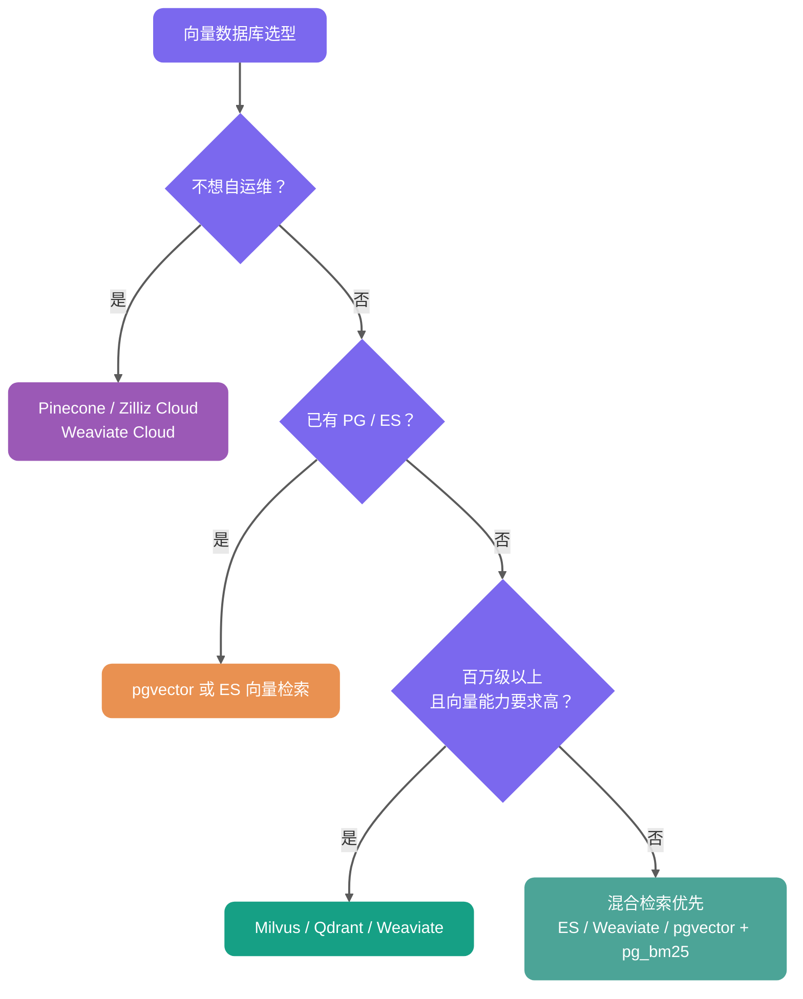

<!-- @include: @small-advertisement.snippet.md -->

前段时间面某大厂的时候，面试官问我：“你们 RAG 系统的向量检索怎么做的？”

我当时回答：“用 MySQL 存 Embedding，查询时遍历计算相似度。”

面试官的表情已经说明问题了。我们当时知识库有 50 多万条 Chunk，每次查询都要全表扫描，平均响应时间 3 秒以上。对一个问答系统来说，这个延迟基本等于劝退用户。

后来才意识到，这就是典型的暴力搜索。Demo 阶段能跑，生产环境根本扛不住。真正上线时，至少要考虑向量数据库和 ANN 索引。

向量存储和向量索引是大多数 RAG 应用绕不开的基础设施。数据规模、延迟要求、召回要求一上来，靠遍历计算相似度很快就会出问题。

这篇文章围绕几个面试高频问题展开：

1. RAG 为什么需要向量数据库；
2. Embedding 和向量检索是什么关系；
3. 余弦距离、内积、欧氏距离怎么选；
4. 向量索引算法是什么，常见算法有哪些；
5. 项目里为什么用 HNSW，HNSW 和 IVFFLAT 有什么区别；
6. 有哪些向量数据库，为什么选择 PostgreSQL + pgvector，为什么不直接用 MySQL 来做。

## Embedding 和向量检索是什么关系？

向量数据库并不是直接理解文本。它存储和检索的是 Embedding。

Embedding 的过程是：把一段文本交给 Embedding 模型，模型输出一个固定维度的稠密向量。可以粗略理解成“文本语义坐标”。两段文本语义越接近，它们在向量空间里的距离通常也越近。


RAG 的向量检索链路可以简化成这样：

```text
文档 Chunk -> Embedding 模型 -> 文档向量 -> 写入向量数据库
用户问题 -> Embedding 模型 -> 查询向量 -> 检索最相似的 Top-K 文档向量
```

基础概念可以看 [RAG 基础篇](./rag-basis.md)。本文重点放在后半段：这些向量怎么高效存储、索引和检索。

## RAG 场景为什么需要向量数据库？

RAG（Retrieval-Augmented Generation）的核心是语义检索。系统把文档和用户问题都转成高维向量，再找出最相似的 Top-K 片段，作为 LLM 的上下文。

所以 RAG 场景里真正要解决的，不只是“能不能存 Embedding”，而是能不能在大规模高维向量里，低延迟找出最相关的 Top-K。

传统关系型数据库可以存向量，也可以通过函数或 SQL 表达式计算相似度。但如果没有专门的向量索引，通常只能全表扫描，很难支撑生产级低延迟检索。当 Chunk 数量达到几十万、百万甚至更高时，就需要引入向量数据库、向量搜索引擎，或者 PostgreSQL + pgvector 这类带向量索引能力的数据库扩展。


### 高维向量相似度搜索

Embedding 通常是 768 到 3072 维的稠密向量。没有向量索引时，即使数据库能计算余弦相似度、内积或欧氏距离，也很难在大规模数据上快速完成 Top-K 检索。

暴力搜索就是遍历全表计算距离，复杂度是 O(n)。以 100 万条 1024 维向量为例，单次查询大约要做：

```text
1,000,000 × 1,024 次乘法运算
```

实际延迟很容易到秒级，具体取决于硬件和实现。对实时问答系统来说，秒级延迟基本不可接受。

ANN（Approximate Nearest Neighbor，近似最近邻）检索就是为了解这个问题。向量数据库通过图导航、空间划分、量化等方式减少距离计算次数，不再每次都把所有向量算一遍。

ANN 的价值不在于永远返回 100% 精确的最近邻，而是在召回率、延迟和资源消耗之间做工程取舍。在合适的索引参数和硬件条件下，ANN 通常能把百万级向量检索从秒级暴力扫描优化到几十毫秒甚至更低。不过具体效果必须拿业务数据、Top-K、过滤条件、并发和召回率目标来测，不能只看理论复杂度。

| 指标     | 暴力搜索       | ANN 索引检索                     |
| -------- | -------------- | -------------------------------- |
| 检索方式 | 全量计算距离   | 只搜索候选集                     |
| 召回率   | 理论 100%      | 取决于索引类型和参数             |
| 延迟     | 数据量越大越慢 | 通常低很多                       |
| 代价     | 计算开销高     | 需要构建索引，占用额外内存或磁盘 |

上表只是数量级描述。实际性能和硬件规格、并发负载、数据分布、过滤条件、Top-K、索引参数（如 `ef_search`、`nprobe`）都有关系。选型和调参时，建议参考 [ann-benchmarks.com](https://ann-benchmarks.com)，更重要的是在自己的业务环境里验证。

### 大规模数据承载能力

RAG 知识库动辄几十万到亿级 Chunk。向量数据库通常会提供持久化、增量更新、分片、索引构建等能力。传统数据库虽然也能把向量当字段存进去，但没有专门索引和扩展能力时，规模一上来就会吃力。

### 语义检索和关键词检索有什么不同？

关键词检索和向量语义搜索解决的是两类问题。

| 检索方式     | 原理                     | 局限性                                                |
| ------------ | ------------------------ | ----------------------------------------------------- |
| BM25 关键词  | 字面匹配，基于词频统计   | 遇到同义词或改写容易失效，比如“退货”和“退款流程”      |
| 向量语义搜索 | Embedding 捕获语义相似性 | 能处理同义词、上下文和隐含意图，但依赖 Embedding 质量 |

文档切分策略和 Embedding 模型共同决定语义召回的理论上限，向量数据库负责在可接受延迟内把这个上限兑现出来。

生产级 RAG 通常还需要几类能力：

- 元数据过滤，比如 `WHERE category='Java' AND version>='v2'`，和向量相似度联合查询。
- 混合检索（Hybrid Search），把向量、BM25 和 RRF 融合起来。
- 动态更新，支持增量写入。但高频更新和删除会让向量索引出现膨胀、无效数据累积、召回或延迟波动，需要结合 `VACUUM`、`REINDEX`、执行计划和业务评测集持续观察。
- 权限和多租户隔离，这是企业级 RAG 的基本要求。

## 向量相似度和距离度量怎么选？

向量数据库做的不是关键词匹配，而是计算查询向量和文档向量之间的距离或相似度。RAG 场景常见的是余弦距离、内积和欧氏距离。

以 pgvector 为例，三种常用写法如下：

| 度量方式                    | pgvector 运算符 | operator class      | 特点                                                               | 适合场景                   |
| --------------------------- | --------------- | ------------------- | ------------------------------------------------------------------ | -------------------------- |
| 欧氏距离（L2 Distance）     | `<->`           | `vector_l2_ops`     | 衡量向量空间中的绝对距离，值越小越相似                             | 模型或索引明确按 L2 优化   |
| 内积（Inner Product）       | `<#>`           | `vector_ip_ops`     | pgvector 返回负内积，值越小越相似                                  | 向量已归一化、追求计算效率 |
| 余弦距离（Cosine Distance） | `<=>`           | `vector_cosine_ops` | 对向量长度不敏感，值越小越相似；余弦相似度可用 `1 - distance` 计算 | 文本语义检索、RAG 最常用   |

面试里如果被问“为什么 RAG 常用余弦相似度”，可以这样答：文本语义检索更关心方向是否接近，而不是向量长度本身；余弦距离对长度不敏感，更适合判断语义相似。如果 Embedding 模型输出已经归一化，内积和余弦在排序上通常等价，内积计算会更直接。

具体用哪个，不要凭感觉选。要看 Embedding 模型是否归一化、官方推荐的 metric，以及向量库索引是否支持对应 operator class。

实践里最容易踩的坑是：查询运算符必须和索引 operator class 一致。比如索引用的是 `vector_cosine_ops`，查询也要用 `<=>`，否则 PostgreSQL 可能无法使用这个向量索引。

## 什么是向量索引算法？

向量索引算法要解决的是一个很朴素的问题：在海量高维向量中，怎么快速找到和查询向量最相似的几个。

没有索引时，只能把数据库里的所有向量都比较一遍，这就是暴力搜索。百万、亿级数据下，这个延迟不可接受。

向量索引的目标，是提前把数据组织好，让查询时可以跳过绝大部分不相关向量，只在一个小得多的候选集里做精确比较。

用生活化一点的比喻：

- 没有索引：在整个城市挨家挨户找一个人。
- 有索引：先定位城区，再定位街道，再定位楼栋。

实践里，向量索引算法大致可以分成两类。


多数时候我们谈向量索引，谈的是 ANN 算法。选对并调好 ANN 索引，直接影响 RAG 或向量搜索系统的性能和成本。调得好，性能提升可能是百倍甚至千倍；调不好，也可能召回掉得很难看。

### 精确最近邻（Exact Nearest Neighbor，ENN）

ENN 的目标是 100% 找到最相似的向量。KD-Tree、VP-Tree 这类传统空间树结构都属于这个方向。

问题在于，它们在低维空间里效果不错，比如 10 维以内。但 AI 领域的向量动辄几百上千维，很容易遇到维度灾难，最后退化得和暴力搜索差不多。

### 近似最近邻（Approximate Nearest Neighbor，ANN）

ANN 是现代向量检索的主流。它接受一个工程取舍：不保证 100% 找到绝对最近邻，而是以很高概率找到足够相似的结果，用一点召回损失换取几个数量级的速度提升。

常见 ANN 算法主要有三类：

- 基于图的算法，比如 HNSW。它把向量组织成多层网络图，查询时像导航一样在图上走。HNSW 通常能在查询速度和召回率之间取得比较好的平衡，是目前综合表现很强的一类算法。
- 基于量化的算法，比如 IVF-PQ。它通过聚类和压缩技术，把海量向量压缩成更小的数据，降低内存占用，更适合超大规模场景。
- 基于哈希的算法，比如 LSH。它通过特殊哈希函数，让相似向量有较大概率落入同一个桶，从而缩小搜索范围。

## 有哪些向量索引算法？

在 RAG 应用里，索引算法会直接影响召回率、响应延迟和资源消耗。

这里先区分两个层级：

| 层级             | 示例                        | 说明                               |
| ---------------- | --------------------------- | ---------------------------------- |
| 向量数据库       | Milvus、Qdrant、pgvector    | 负责向量存储、检索和管理的完整系统 |
| 其支持的索引算法 | HNSW、IVF-PQ、IVFFLAT、Flat | 决定检索性能与召回率的内部实现     |

主流索引算法可以先看这张表：

| 算法名称            | 原理机制                | 核心优势                      | 主要劣势                   | 更稳的适用描述                                                 |
| ------------------- | ----------------------- | ----------------------------- | -------------------------- | -------------------------------------------------------------- |
| Flat（暴力搜索）    | 遍历所有向量计算距离    | 100% 准确无损                 | 数据量大时查询很慢         | 小规模、低 QPS、离线评测、召回基准                             |
| HNSW（图索引）      | 分层导航的小世界图      | 查询快，召回率高              | 内存消耗大，构建耗时       | 中大规模、高召回、低延迟场景；百万级常见，千万级需重点评估内存 |
| IVFFLAT（倒排聚类） | 聚类 + 倒排索引桶       | 内存效率较好，构建较快        | 需前置训练，召回率略低     | 更关注内存和构建速度，可接受一定召回损失                       |
| IVF-PQ（乘积量化）  | 聚类 + 向量极致压缩     | 支持海量数据，开销低          | 精度损失较大               | 超大规模、内存敏感、可接受量化误差                             |
| IVF_RABITQ          | 聚类 + 随机旋转比特量化 | 内存占用低，召回率优于传统 PQ | 较新算法，生态支持仍在演进 | 超大规模、内存敏感、可接受量化误差                             |

关于 IVF_RABITQ 简单补一句。它是 2024 年提出的新一代量化算法，核心思路是 Random Rotation（随机旋转）+ Bit Quantization（比特量化）。相比传统 PQ 把向量切成子向量再分别聚类，RABITQ 会先对向量做随机旋转，让各维度分布更均匀，再把每个维度量化为 1 bit，只保留符号位。这样可以在保持较高召回率的同时显著压缩内存，并且距离计算可以用位运算加速。Milvus 2.6.x 中已经提供 `IVF_RABITQ` 索引类型。

## 你的项目使用的什么向量索引算法？

这里以 [《SpringAI 智能面试平台+RAG 知识库》](https://javaguide.cn/zhuanlan/interview-guide.html)项目为例。

项目里用的是 PostgreSQL 的 pgvector 扩展，并配置了 HNSW 索引。

为什么选 HNSW？因为在当前业务规模下，它在检索速度、召回率和工程复杂度之间比较均衡。

可以把 HNSW 理解成一个多层高速公路网络。


HNSW 的核心机制有三点。

第一是层次化构建。节点的最高层级由公式 `level = floor(-ln(random()) * mL)` 决定，其中 `mL` 是层级乘数。这会让越高层的节点数量指数级递减，形成类似金字塔的结构。

第二是贪心搜索。检索从顶层开始，每层都移动到距离查询点最近的邻居节点。

第三是由粗到精。上层负责快速定位语义区域，下层负责更精细地查找候选近邻。

这种查找方式能快速定位候选近邻，不需要像暴力搜索那样比较每个点。

HNSW 本质上是 ANN 算法，所以它追求的是速度和召回的平衡，不保证 100% 召回。但实践中可以通过参数调整把召回率做到比较高，是否足够要看业务评测集和最终答案质量。

HNSW 常见调优参数有三个：

- `m`：每个节点的最大连接数。`m` 越大，图越密，召回率越高，但构建时间和内存消耗也会上去。
- `ef_construction`：索引构建时的搜索范围。值越大，索引质量越好，但构建越慢。
- `ef_search`：查询时的搜索范围。这个运行时参数最重要，直接影响查询速度和召回率。

pgvector 的 HNSW 默认参数是 `m = 16`、`ef_construction = 64`、`ef_search = 40`。可以按下面这个方向调：

| 参数              | 常见范围 | 调大后的影响                             | 调优建议                                     |
| ----------------- | -------- | ---------------------------------------- | -------------------------------------------- |
| `m`               | 8-64     | 图更密，召回率更高，但内存和构建时间增加 | 先用默认值，召回不够再调到 24 或 32          |
| `ef_construction` | 64-256+  | 索引质量更好，但构建更慢                 | 离线构建能接受更慢时再调大                   |
| `ef_search`       | 40-200+  | 查询召回更高，但延迟增加                 | 最适合在线调参，用评测集找召回率和延迟平衡点 |

一个实用做法是先固定 `m` 和 `ef_construction` 建好索引，再通过会话参数调 `ef_search`：

```sql
SET hnsw.ef_search = 100;
```

然后用 `EXPLAIN ANALYZE` 确认是否命中索引，再用一批人工标注问题对比不同 `ef_search` 下的召回率、延迟和最终答案质量。`ef_search` 不需要无限调大，达到业务可接受召回后就该停下来，不然只是用延迟和 CPU 换一点很小的收益。

扩展性也要提前想。HNSW 很吃内存。如果未来数据规模增长到千万甚至亿级，或者写入吞吐要求更高，HNSW 的内存占用和构建成本可能会变成瓶颈。

这时可以考虑 IVFFLAT。IVFFLAT 基于倒排索引思想，把向量空间聚类成多个桶，从而缩小搜索范围。也可以引入 Milvus 这类专业向量数据库，它们在分布式和大规模场景下更成熟。

还有一个容易忽略的点：过滤条件。

pgvector 的 HNSW 索引遇到 `WHERE` 过滤条件时，要重点看执行计划。近似索引通常会先按向量距离找候选，再应用过滤条件。如果过滤条件很严格，最终结果可能少于 Top-K 预期，某些查询形态下甚至会退化成更慢的扫描。

比如查询“返回 10 条相似文档中 `category='Java'` 的记录”，如果候选集中只有 3 条满足条件，那就只能返回 3 条。

常见处理方式有几种：

1. 增大候选集：设置更大的 `ef_search` 或 `LIMIT`，让更多候选进入过滤阶段。
2. 预过滤（Pre-filtering）：先按元数据过滤，再做向量搜索，但可能导致索引失效，退化为暴力搜索。
3. 部分索引（Partial Index）：PostgreSQL 支持带条件的 HNSW 索引，比如 `CREATE INDEX ... WHERE category = 'Java'`，但需要为常见过滤条件创建独立索引。
4. 迭代索引扫描（Iterative Index Scan）：pgvector 0.8.0+ 支持过滤后结果不足时继续扫描更多索引，缓解“先 ANN 后过滤导致 Top-K 不足”的问题。但它仍然需要配合 `hnsw.max_scan_tuples`、`ivfflat.max_probes` 等参数控制成本。

## HNSW 索引和 IVFFLAT 索引有什么区别？

这两者的核心区别很简单：HNSW 靠图的连通性找邻居，IVFFLAT 靠聚类缩小搜索范围。

HNSW 会构建多层图结构。查询时像在高速公路上走，先在上层做大跨度跳跃，再到底层做局部精细搜索。它的优点是查询快，召回率通常较高且稳定；缺点是内存消耗大，除了原始向量，还要存大量节点连接关系，索引构建通常也更慢。

IVFFLAT 用 K-Means 把向量空间切成多个桶。查询时先找最近的几个桶，只在桶内做暴力搜索。它的优点是内存更友好，结构简单，构建通常更快；缺点是在相同召回目标下，查询性能和稳定性通常不如 HNSW。如果数据分布变化明显，还可能需要重新训练聚类中心。

| 特性       | HNSW（图索引）                                | IVFFLAT（倒排聚类）                      |
| ---------- | --------------------------------------------- | ---------------------------------------- |
| 底层原理   | 层次化小世界图结构                            | 聚类 + 倒排桶结构                        |
| 查询速度   | 通常更快，召回更稳定                          | 取决于 `lists` 和 `probes`               |
| 内存消耗   | 较高，原始向量 + 图连接指针                   | 通常低于 HNSW                            |
| 构建速度   | 较慢，需要逐个节点插入                        | 通常更快，但需要聚类训练                 |
| 数据动态性 | 增量添加方便，大量更新 / 删除后需观察索引健康 | 数据分布变化明显时可能需要重建索引       |
| 适用场景   | 中大规模、高召回、低延迟场景                  | 更关注内存和构建速度，可接受一定召回损失 |

怎么选？

追求低延迟和高召回，并且服务器内存足够，优先 HNSW。更关注内存、构建速度，能接受一定召回损失，并愿意调 `lists` / `probes`，可以考虑 IVFFLAT。

## 有哪些向量数据库？

向量数据库选型没有银弹，适合项目的才是好方案。

### 传统数据库扩展

代表方案包括 PostgreSQL + pgvector，以及 MongoDB Atlas Vector Search。

这类方案的优势是技术栈统一，不需要额外引入一套数据库系统；向量数据和业务数据可以在同一事务里管理；团队已有 SQL 经验可以复用；也方便把 SQL 过滤条件和向量搜索组合起来。

它适合项目初期或中小型项目。尤其是业务数据和向量数据需要强一致性、能在同一个事务里管理时，PostgreSQL + pgvector 的优势很明显。对已经在用 PostgreSQL 的团队来说，学习和运维成本都低。

### 搜索引擎演进

代表方案是 Elasticsearch 和 OpenSearch。

这类方案的优势是混合搜索能力强，可以把 BM25 关键词检索和向量语义搜索结合起来。它也保留了传统搜索引擎在长文本、分词、高亮、聚合分析上的优势，并且分布式架构成熟。

如果你的业务本来就依赖关键词检索，比如电商搜索、文档检索、复杂过滤和聚合分析，或者团队已经有 ES 技术栈，那么复用 ES / OpenSearch 的向量能力会比较自然。

### 原生专业向量数据库

代表方案包括 Milvus、Weaviate、Qdrant。

Milvus 功能比较全面，社区也大；Weaviate 内置 AI 模块，支持 GraphQL 查询，易用性不错；Qdrant 用 Rust 编写，内存效率高，过滤能力也比较强。

这类数据库专门为向量检索优化，通常支持多种索引算法，比如 HNSW、IVF、LSH 等，在分区、多租户、动态更新、距离度量方面也更专业。

当向量规模达到亿级甚至更高，或者对 QPS 和延迟要求很苛刻时，原生向量数据库通常会比 pgvector 更合适。代价也很明确：多一套系统，就多一套运维、监控、备份和学习成本。

### 云托管向量数据库服务

代表方案包括 Pinecone、Zilliz Cloud、Weaviate Cloud 等。

它们的优势是运维负担低，上线快，通常提供自动扩缩容和高可用 SLA。预算充足、团队不想自运维时，这类方案很有吸引力。

不过“托管”不等于不用管。索引参数、召回评测、权限隔离、成本监控还是要自己负责。

## 向量数据库怎么选？

可以先按下面这张图粗略判断：



更口语一点：

- 数据规模小于 100 万，团队已有 PostgreSQL，优先 pgvector。
- 数据规模小于 100 万，团队已有 Elasticsearch / OpenSearch，优先复用 ES 向量检索和 BM25 混合检索。
- 数据规模在百万到十亿级，并且需要专业向量能力，考虑 Milvus、Qdrant、Weaviate。
- 不想自运维，考虑 Pinecone、Zilliz Cloud、Weaviate Cloud。
- 强依赖混合检索，优先 ES / OpenSearch、Weaviate，或者 PostgreSQL + pgvector + pg_bm25 的组合。

## 你为什么选择 PostgreSQL + pgvector？

这里以 [《SpringAI 智能面试平台+RAG 知识库》](https://javaguide.cn/zhuanlan/interview-guide.html)项目为例。这个项目需要同时存结构化数据，比如简历、面试记录，也要存向量数据，也就是文档 Embedding。

方案对比如下：

| 方案                    | 优点                     | 缺点                       | 适用规模       |
| ----------------------- | ------------------------ | -------------------------- | -------------- |
| PostgreSQL + pgvector   | 一套数据库搞定，运维简单 | 百万级以上性能下降明显     | < 100 万向量   |
| PostgreSQL + Milvus     | 向量检索性能更好         | 多一个组件，运维复杂度增加 | 100 万 - 10 亿 |
| Pinecone / Zilliz Cloud | 全托管，低运维           | 成本高，数据在第三方       | 任意规模       |

选择 pgvector 的理由主要有几个。

第一，架构简单。不引入额外组件，部署和运维复杂度低。

第二，性能够用。HNSW 索引的速度和召回率能满足当前业务要求。

第三，事务一致性好。向量数据和业务数据在同一个数据库里，天然支持事务。

第四，SQL 查询方便。可以结合 `WHERE` 条件过滤，但要注意过滤条件可能影响向量索引命中，所以必须检查执行计划。

```sql
-- pgvector 余弦相似度搜索示例
-- <=> 是余弦距离运算符（0 = 完全相同，2 = 完全相反）
-- 余弦相似度 = 1 - 余弦距离
SELECT content, 1 - (embedding <=> $1) as cosine_similarity
FROM vector_store
WHERE metadata->>'category' = 'Java'
ORDER BY embedding <=> $1  -- 按距离升序，越小越相似
LIMIT 5;

-- ⚠️ 关键前提：查询时使用的距离运算符必须与创建 HNSW 索引时指定的
-- operator class（例如 vector_cosine_ops）严格保持一致，否则查询将
-- 无法命中索引，直接退化为全表扫描。
-- 验证方式：EXPLAIN ANALYZE 检查执行计划是否包含 Index Scan。
```

## pgvector 实践细节有哪些？

pgvector 的核心不是“能不能存向量”，而是索引、距离度量和查询语句必须配套。

### HNSW 索引创建示例

```sql
-- embedding 类型示例：vector(1536)
CREATE INDEX idx_document_embedding_hnsw
ON document_chunk
USING hnsw (embedding vector_cosine_ops)
WITH (m = 16, ef_construction = 64);
```

如果查询用的是 `<=>` 余弦距离，索引就要使用 `vector_cosine_ops`。如果查询用 `<->`，索引就要改成 `vector_l2_ops`。

### IVFFLAT 索引创建示例

```sql
CREATE INDEX idx_document_embedding_ivfflat
ON document_chunk
USING ivfflat (embedding vector_cosine_ops)
WITH (lists = 100);

-- 查询时控制扫描多少个聚类桶
SET ivfflat.probes = 10;
```

IVFFLAT 需要先有一定数据量再建索引，因为它要先聚类。`lists` 可以从 `rows / 1000` 到 `sqrt(rows)` 之间起步评估；`probes` 越大，召回率越高，查询也越慢。

### 索引维护

大量删除或更新后，向量索引可能出现膨胀、无效数据累积，甚至召回和延迟波动。可以在业务低峰期做 `VACUUM`、`REINDEX`，同时观察执行计划和业务评测集。

`VACUUM` 仍然重要，但它不是万能的召回率修复工具。向量索引的健康状况，要通过查询延迟、召回率评测和执行计划一起看。

每次调整距离运算符、operator class、过滤条件或索引参数后，都要用 `EXPLAIN ANALYZE` 检查是否命中索引。

### 版本特性

- pgvector 0.5+ 支持 HNSW 索引。
- pgvector 0.7+ 增加了 `halfvec`、`sparsevec`、`bit` 等类型和更多距离能力，适合进一步压缩存储或处理稀疏向量。
- pgvector 0.8.0+ 支持 iterative index scans，可以在过滤后结果不足时继续扫描更多索引，缓解 Top-K 不足问题。生产环境建议固定版本，升级前跑回归评测。

## 为什么不选择 MySQL 搭配向量数据库？

PostgreSQL 在这类场景里最大的优势，是扩展能力强。开发者可以在不改数据库内核的情况下，通过扩展补齐很多能力。

比如：

- AI 向量检索：pgvector 扩展，和 PostgreSQL 原生生态结合紧密，支持 ACID、JOIN、备份恢复和 SQL 过滤，适合中小规模、希望简化技术栈的 RAG 项目。
- 全文搜索：内置 `tsvector` 能满足基础需求，更高级的可以考虑 pg_bm25。
- 时序数据：TimescaleDB。
- 地理信息：PostGIS。

这种“一套 PG 承担多种基础能力”的模式，对中小规模项目很友好。先用 PostgreSQL 简化技术栈，等数据规模、QPS、多租户隔离要求继续上升，再拆出 Elasticsearch、Milvus、Qdrant、Weaviate 等专业组件，会更稳。

MySQL 这边要分版本看。MySQL 8.x 系列，包括 8.4 LTS，没有官方 `VECTOR` 数据类型。MySQL 9.x 已经引入 `VECTOR` 数据类型和相关函数，但从官方能力看，它更偏向向量存储和基础函数支持，还不是成熟的生产级 ANN 检索方案。

如果项目已经深度绑定 MySQL，可以继续用 MySQL 存业务数据，再搭配 pgvector、Milvus、Qdrant、Weaviate、Elasticsearch / OpenSearch 等外部向量检索组件。没必要为了 RAG 强行把所有东西塞进 MySQL。


关于 MySQL 和 PostgreSQL 的详细对比，可以参考我写的这篇文章：[MySQL vs PostgreSQL，如何选择？](https://mp.weixin.qq.com/s/APWD-PzTcTqGUuibAw7GGw)。

<!-- @include: @rag-project.snippet.md -->

## 总结

向量存储和向量索引是 RAG 系统绕不开的基础设施。选型选错了，后面很容易变成“检索慢、召回差、成本高”。

没有专门向量索引时，大规模高维向量 Top-K 检索通常只能全表扫描。ANN 索引通过牺牲一点精确性，在召回率、延迟和资源消耗之间做工程取舍。

主流索引算法里，Flat 是暴力搜索，适合小规模、低 QPS、离线评测和召回基准；HNSW 是图索引，查询快、召回高，但内存消耗大；IVFFLAT 是倒排聚类，内存更友好、构建较快，但需要调参并接受一定召回损失；IVF-PQ 通过乘积量化支持海量数据，但会带来精度损失。

HNSW 更适合低延迟和高召回，IVFFLAT 更适合内存和构建成本敏感的场景。数据库选型上，PostgreSQL + pgvector 适合中小规模，Milvus、Qdrant、Weaviate 更适合大规模或专业向量检索，Pinecone、Zilliz Cloud 适合低运维场景。

面试里常问这些：

- 什么是 Embedding？为什么需要把文本转成向量？
- RAG 场景为什么需要向量数据库？
- 余弦相似度和欧氏距离有什么区别？RAG 场景下用哪个？
- ANN 算法为什么可以接受不是 100% 精确的结果？
- 有哪些向量索引算法？各自优缺点是什么？
- HNSW 和 IVFFLAT 有什么区别？
- HNSW 的 `ef_search` 参数怎么调？调大和调小分别会怎样？
- 向量数据库和传统数据库最核心的区别是什么？
- 如果向量数据从 100 万增长到 1 亿，架构上需要做什么调整？
- pgvector 的 HNSW 索引在什么情况下会失效或退化为更慢的扫描？
- 为什么选择 PostgreSQL + pgvector？

动手时建议先把 HNSW 的图结构、IVF 的聚类原理理解清楚，再用 pgvector 或 Milvus 搭一个最小 Demo，比较不同索引参数下的召回率和延迟。`ef_search`、`nprobe` 这些参数不要凭感觉调，最好拿真实业务问题做评测。

向量数据库选型和索引调优，直接决定 RAG 系统能不能在生产环境站稳脚跟。选错了，就是检索慢、召回差、成本炸三连。
