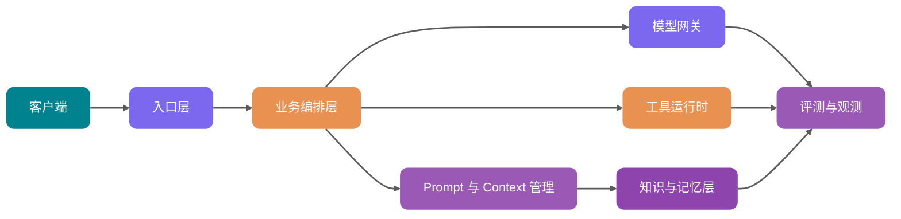

<!-- @include: @article-header.snippet.md -->

一个最小版 AI 应用很好搭：前端收一句用户问题，后端把问题和系统提示词拼到一起，调一次模型 API，页面上就能返回一段看起来还不错的答案。

Demo 演示到这里基本够了。

真实用户进来以后，问题会变得具体很多：用户问内部制度，检索层把他没有权限的文档也塞进上下文；运营改了一版 Prompt，昨天还能答对的问题今天开始跑偏；模型调用超时，浏览器一直等；月底看账单，只知道 Token 消耗涨了，却说不清花在哪个租户、哪个功能、哪个模型上；线上事故复盘时，只能从应用日志、向量库命中结果和模型返回里一点点拼当时发生了什么。

这篇文章讨论的是后面这部分：怎么把一个能跑通的 Prompt Demo，改造成能上线、能排查、能回滚、能控成本的生产级 AI 应用。

本文主要讲清楚 5 件事：

1. **Prompt Demo 和生产系统差距为什么巨大**：稳定性、权限、成本、观测、评测和数据治理分别卡在哪里。
2. **生产级 AI 应用应该怎么分层**：入口层、业务编排、模型网关、Prompt/Context、RAG、Memory、Tool、异步任务、评测观测如何协作。
3. **同步、流式、异步三种交互模式怎么选**：不要把所有请求都做成“等模型返回”。
4. **模型网关、工具权限、RAG 与 Memory 的关键设计**：让 AI 应用从“能跑”变成“可管”。
5. **Java 后端如何落地**：模块拆分、表设计、服务接口和面试回答思路。

这篇偏总览。里面不少点 JavaGuide 已经单独写过长文，文中会在对应位置附上延伸阅读，想继续深挖时可以顺着看。

## Demo 架构为什么扛不住生产流量

先看一个最常见的 Demo：

```text
前端输入问题 -> 后端拼 Prompt -> 调用模型 API -> 返回答案
```

这条链路能演示产品想法，但它缺了生产系统最关键的 6 件事。

| 维度     | Prompt Demo                | 生产级架构                                                   |
| -------- | -------------------------- | ------------------------------------------------------------ |
| 稳定性   | 单模型、单调用，失败就报错 | 多模型路由、重试、fallback、熔断、降级响应                   |
| 权限     | 默认用户能问什么就查什么   | 检索前权限过滤，工具调用按用户和租户鉴权                     |
| 成本     | 只看一次调用能不能成功     | Token 预算、模型分层、缓存、成本归因和限额                   |
| 可观测   | 记录用户问题和最终答案     | 记录 Prompt、检索片段、工具调用、模型输出、Token、延迟、错误 |
| 评测     | 靠人工试几条样例           | 固定评测集、线上抽样、LLM-as-Judge、人工复核闭环             |
| 数据治理 | 文档直接入库，日志随便存   | PII 脱敏、数据留存、审计、版本化、删除和授权链路             |

看到这里可能会有人觉得：这不就是给原来的接口多包几层吗？

没那么简单。AI 应用有一部分决策交给了概率模型，问题不一定能落到某一行代码上。传统后端里的 if-else 逻辑虽然也会出错，但排查时至少能沿着调用栈走；LLM 出错时，原因可能是 Prompt 版本、上下文顺序、检索噪声、工具描述、模型采样、权限过滤、输出解析中的任何一环。

生产级 AI 架构要把模型周边的输入、执行、输出和反馈都工程化，让每次回答都能追踪、回放、评测和治理。

如果你对大模型 API 的调用链还不熟，可以先看 [大模型 API 调用工程实践：流式输出、重试、限流与结构化返回](../llm-basis/llm-api-engineering.md)。如果是想补 Token、上下文窗口和采样参数这些基础，再看 [LLM 运行机制：Token、上下文窗口与采样参数怎么影响输出](../llm-basis/llm-operation-mechanism.md)。

## 生产级 AI 应用的标准分层架构

小 G 更推荐按职责拆层。不同公司命名会有差异，但生产系统里的边界大体一致。



### 入口层：把用户请求变成可治理的任务

入口层不能只当 Controller 用。它至少要做这些事：

- 认证鉴权：确认用户、租户、角色、数据范围。
- 请求标准化：把 Web、App、API、Webhook、定时任务统一成内部任务模型。
- 限流与防刷：按用户、租户、模型能力和业务场景限流。
- 幂等控制：异步任务、工具调用、支付类操作必须有幂等键。
- 敏感内容预处理：PII 脱敏、恶意输入检测、Prompt 注入初筛。

入口层最后应该产出结构化请求，而不是只把用户输入当成一段字符串往后传：

```java
public record AiRequest(
        String requestId,
        String tenantId,
        String userId,
        String sceneCode,
        String input,
        Map<String, Object> variables,
        PermissionScope permissionScope
) {
}
```

### 业务编排层：决定这次请求怎么跑

业务编排层负责决定这次请求怎么执行：

- 这次是普通问答、RAG 问答、Agent 多步任务，还是批处理任务？
- 需要哪些上下文：历史会话、用户画像、知识库、实时业务数据？
- 是否允许调用工具？哪些工具需要二次确认？
- 应该走同步、流式，还是异步？
- 输出要不要进入评测、人工审核或后处理？

这层别把所有逻辑都塞进一个“超级 Prompt”。能确定的规则用代码处理，无法穷举的语言理解再交给模型。边界清楚，系统才容易排查。

### 模型网关：把模型调用变成基础设施

模型网关负责统一接入 OpenAI、Anthropic、Google Gemini、私有化模型、Embedding 模型、Rerank 模型等能力。它隐藏不同 API 的差异，对上提供稳定接口。模型网关本身可以单独展开一篇，细节可以看 [大模型网关详解：多模型路由、Fallback、限流与成本控制](./llm-gateway.md)。


模型网关的核心能力包括：

- 多模型路由：按场景、成本、延迟、语言、上下文长度和成功率选择模型。
- fallback：主模型失败、超时、限额不足时切到备用模型。
- 限流与熔断：避免供应商异常拖垮业务线程池。
- Token 预算：估算输入输出 Token，超预算时压缩上下文或降级模型。
- 成本归因：按租户、用户、场景、Prompt 版本记录成本。
- 统一观测：记录模型请求、响应、错误、TTFT、总延迟、Token usage。

OpenAI、Anthropic、Google 等官方文档都在持续更新模型、工具、流式、评测和成本相关能力。涉及具体模型名、上下文窗口、价格、可用区域和工具支持时，建议在配置中心或模型注册表里维护，并标注“以官方文档最新展示为准”，不要写死在业务代码里。

### Prompt 与 Context 管理：不要把 Prompt 当代码里的字符串

Prompt 在生产环境里应该被当成一种可版本化配置，不能散落成代码里的多行字符串。

它至少需要支持：

- 模板版本：每次修改生成新版本，旧版本可回放。
- 变量注入：业务变量、用户输入、检索结果、工具结果分区注入。
- 灰度发布：按租户、用户比例、场景开关选择 Prompt 版本。
- 快速回滚：线上效果变差时能切回稳定版本。
- 审计记录：谁在什么时间改了什么，为什么改。
- 运行时绑定：每次请求记录使用的 Prompt 名称、版本和变量摘要。

一个很实用的规则：**Prompt 变更要像代码变更一样可追踪，但发布频率可以比代码更高**。

Langfuse 官方文档把 Prompt Management、Tracing、Evaluation 放在同一套 LLM 工程平台里，也是在解决这个问题：Prompt 不只影响生成文本，还会影响检索、工具调用、成本和评测结果。你可以不用 Langfuse，但这几类数据最好能在自己的系统里串起来。

Prompt 写法本身可以看 [大模型提示词工程（Prompt Engineering）是什么？提示词技巧有哪些？](../agent/prompt-engineering.md)。如果你关心的是“哪些信息该进上下文、进多少、什么时候压缩”，更适合看 [上下文工程（Context Engineering）是什么？和 Prompt Engineering 有什么区别？](../agent/context-engineering.md)。


### RAG、Memory、Tool：三类上下文不要混在一起

很多 AI 系统越做越乱，是因为把所有信息都叫“上下文”。

小 G 建议把它拆开：

| 类型   | 存什么                                       | 生命周期         | 核心风险                               |
| ------ | -------------------------------------------- | ---------------- | -------------------------------------- |
| RAG    | 企业文档、产品手册、制度、代码文档、工单知识 | 由知识库更新决定 | 检索不到、越权召回、过期文档、引用错配 |
| Memory | 用户偏好、历史决策、长期画像、任务经验       | 随用户和会话演化 | 错误记忆固化、隐私泄露、过时记忆干扰   |
| Tool   | 查询订单、创建工单、发邮件、改配置、查数据库 | 运行时按需调用   | 参数错误、权限越界、敏感操作误执行     |

三者底层都可能用向量检索、结构化存储和重排，但服务目标完全不同。RAG 提供共享知识源，Memory 提供个性化背景，Tool 连接真实业务系统。


**高频盲区：不要把 Memory 当成个人版 RAG 随便塞。** 记忆一旦写错，后续每轮都会被污染。生产环境里的 Memory 写入通常要异步执行，并经过 Schema 校验、置信度过滤、过期策略和人工审核入口。

RAG 的基础概念可以从 [万字详解 RAG 基础概念](../rag/rag-basis.md) 看起；文档如何解析、清洗和切 Chunk，可以看 [RAG 文档处理与切分策略](../rag/rag-document-processing.md)；检索效果调优看 [万字详解 RAG 优化：从召回、重排到上下文工程的系统调优](../rag/rag-optimization.md)。Memory 单独展开的话，可以看 [AI Agent 记忆系统：短期记忆、长期记忆与记忆演化机制](../agent/agent-memory.md)。

## 同步、流式、异步三种交互模式怎么选

AI 应用不是所有请求都适合 HTTP 同步等待。交互模式选错，用户体验和系统稳定性都会被拖垮。

| 模式     | 适合场景                                   | 优势                         | 风险                           | 后端设计要点                         |
| -------- | ------------------------------------------ | ---------------------------- | ------------------------------ | ------------------------------------ |
| 同步请求 | 短问答、分类、抽取、低延迟小任务           | 实现简单，调用链清晰         | 超时敏感，容易占满线程         | 设置短超时、快速失败、结果缓存       |
| 流式响应 | 聊天、长答案、代码生成、语音前置文本       | 首字体验好，用户感知等待更短 | 中途失败处理复杂，前端状态更多 | SSE/WebSocket、TTFT 监控、可取消生成 |
| 异步任务 | 报告生成、批量评测、长文档分析、多工具任务 | 可排队、可重试、可恢复       | 任务状态和通知链路复杂         | 任务表、队列、进度事件、幂等和补偿   |

可以先按这个经验阈值选：

- **能在 3 秒内稳定完成的任务**，优先同步。这个值不是标准答案，要结合网关、负载均衡和客户端超时一起定。
- **用户需要立刻看到模型开始输出的任务**，优先流式。
- **依赖长文档、多轮工具调用或批量处理的任务**，优先异步。

别为了“看起来像 ChatGPT”把所有接口都做成流式。比如标签分类、风险评分、路由决策这类内部调用，流式收益不大，反而会增加链路复杂度。

流式输出、重试、限流和结构化返回在 [大模型 API 调用工程实践](../llm-basis/llm-api-engineering.md) 里有更完整的工程拆解。如果场景是实时语音，还要考虑 VAD、ASR、TTS、打断和端到端延迟，可以继续看 [AI 语音技术详解：从 ASR、TTS 到实时语音 Agent 的工程化落地](./ai-voice.md)。

## Prompt 管理：从模板字符串到版本系统

生产级 Prompt 管理可以先按 5 个对象建模：

- `prompt_template`：Prompt 基本信息，例如名称、场景、类型、状态。
- `prompt_version`：具体内容、变量定义、模型参数、创建人、变更说明。
- `prompt_release`：某个版本发布到哪个环境、哪些租户、多少流量。
- `prompt_run`：每次调用绑定的 Prompt 版本、变量摘要和模型输出。
- `prompt_eval_result`：某个 Prompt 版本在评测集上的结果。

核心表可以这样设计：

| 表名                 | 关键字段                                                                                                        | 作用                       |
| -------------------- | --------------------------------------------------------------------------------------------------------------- | -------------------------- |
| `ai_prompt_template` | `id`、`tenant_id`、`name`、`scene_code`、`type`、`status`                                                       | 管理 Prompt 逻辑名称       |
| `ai_prompt_version`  | `id`、`template_id`、`version_no`、`content`、`variables_schema`、`model_config`、`created_by`、`change_reason` | 保存可回放的 Prompt 内容   |
| `ai_prompt_release`  | `id`、`template_id`、`version_id`、`env`、`traffic_ratio`、`tenant_scope`、`status`                             | 控制灰度和回滚             |
| `ai_prompt_run`      | `id`、`request_id`、`version_id`、`variables_hash`、`input_tokens`、`output_tokens`、`created_at`               | 连接线上请求与 Prompt 版本 |

变量注入时要避免两个坑：

1. **变量未经清洗直接拼接**：用户输入、工具结果、检索片段都可能携带注入指令。应该用明确的分区标签和转义策略隔离。
2. **Prompt 版本和代码版本脱节**：Prompt 里新增了变量，代码没传，线上直接生成空上下文。建议用 `variables_schema` 做运行时校验。

还有一个落库细节：`ai_prompt_run` 里通常只存变量摘要、Hash、Token 和关联 ID。完整用户输入、检索片段、工具返回如果包含 PII 或业务敏感信息，要按安全等级决定是否脱敏、加密、缩短留存周期，不能为了回放方便把所有明文都塞进表里。

一个最小接口示例：

```java
public interface PromptService {

    RenderedPrompt render(RenderPromptCommand command);

    PromptVersion publish(PublishPromptCommand command);

    void rollback(String templateId, String targetVersionId);
}
```

如果 Prompt 输出要被程序稳定解析，最好不要只靠“请返回 JSON”。结构化输出、JSON Schema、Function Calling 的工程细节可以看 [大模型结构化输出：从 JSON 契约到 Function Calling 落地](../llm-basis/structured-output-function-calling.md)。

## 模型网关：多模型路由、fallback 与成本控制

模型网关很容易被低估。很多团队一开始直接在业务代码里调用某个供应商 SDK，等到要换模型、做灰度、查成本时才发现处处耦合。

### 模型网关策略对比

| 策略         | 核心逻辑                               | 适合场景                         | 风险                             |
| ------------ | -------------------------------------- | -------------------------------- | -------------------------------- |
| 固定模型     | 某个场景固定调用一个模型               | 早期系统、低复杂度任务           | 成本和稳定性受单供应商影响       |
| 成本优先路由 | 默认走低成本模型，失败或低置信度再升级 | 分类、摘要、轻量问答             | 低成本模型误判会传导到下游       |
| 质量优先路由 | 高价值请求优先走高能力模型             | 法务、金融、医疗辅助、复杂 Agent | 成本高，需要预算控制             |
| 延迟优先路由 | 按 P95/P99 延迟和可用区选择模型        | 实时聊天、语音、在线客服         | 可能牺牲复杂推理质量             |
| 多模型投票   | 多模型并行生成，再由评审器选择         | 高风险内容、关键报告             | 成本和延迟都高                   |
| fallback 链  | 主模型失败后切备用模型                 | 大多数生产系统                   | 备用模型能力差异会影响输出一致性 |

### Token 预算怎么做

模型网关至少要在调用前做一次预算：

```text
预计输入 Token = System Prompt + 用户输入 + 历史消息 + RAG 片段 + Memory + Tool Schema
预计总 Token = 预计输入 Token + 最大输出 Token
```

如果超预算，别直接截断字符串。更稳的降级顺序是：

1. 删除低相关 RAG 片段。
2. 压缩早期历史消息。
3. 减少工具 Schema，只保留候选工具。
4. 降低最大输出长度。
5. 切换长上下文模型。
6. 拒绝执行并提示用户缩小范围。

这里的 Token 预算和上下文压缩，和前面提到的 Context Engineering 是同一类问题。更完整的上下文装配、按需加载和降级策略，可以看 [上下文工程（Context Engineering）是什么？和 Prompt Engineering 有什么区别？](../agent/context-engineering.md)。

OpenTelemetry 文档里的 GenAI registry 能看到 `gen_ai.request.model`、`gen_ai.response.model`、`gen_ai.usage.input_tokens`、`gen_ai.usage.output_tokens`、`gen_ai.response.time_to_first_chunk`、retrieval、tool 等字段。不过 OpenTelemetry 站内也提示 GenAI 语义约定已迁移到独立仓库，落地时不要只复制一篇旧文档里的字段名，最好锁定当前版本并做字段映射。无论你用 Langfuse、LangSmith，还是自建观测平台，都建议尽量向通用字段靠拢，后续迁移和统一监控会轻松很多。

## 工具调用与权限：让模型只提出动作，系统决定能不能做

Tool Calling 很容易让人产生错觉：模型返回了一个函数名和参数，系统执行就行。

这在生产环境很危险。

更稳的心智模型是：**模型只能提出“想调用什么工具”，真正执行前必须经过系统校验**。

工具运行时至少要包含 6 道关：

| 环节     | 作用                                                   |
| -------- | ------------------------------------------------------ |
| 工具注册 | 声明工具名称、描述、参数 Schema、权限标签、风险等级    |
| 工具检索 | 从大量工具中选出当前任务相关的少数工具，避免上下文膨胀 |
| 参数校验 | 用 JSON Schema 或强类型对象校验必填、格式、枚举、范围  |
| 权限校验 | 按用户、租户、角色、资源 ID 做后端鉴权                 |
| 二次确认 | 删除、支付、发送消息、改配置等敏感操作必须让用户确认   |
| 审计日志 | 记录模型建议、最终参数、执行人、执行结果和回滚信息     |

Anthropic、OpenAI 和 Google 的官方工具/函数调用文档都强调工具定义、参数结构和调用处理；Google 的文档还明确提醒，对会发送订单、更新数据库等有明显后果的函数调用，要在执行前让用户确认。落到工程里，再补一条硬规则：**别让模型替你做权限判断**。

即使供应商提供 server-side tool，业务侧也不能省掉自己的 ACL、审计和确认流。供应商负责把工具能力接进模型，业务系统负责判断这个用户、这个租户、这个资源在当前场景下能不能执行。

工具调用这块如果想从概念补起，可以先看 [大模型结构化输出：从 JSON 契约到 Function Calling 落地](../llm-basis/structured-output-function-calling.md)。如果你的工具要被多个模型、Agent 或 IDE 复用，再看 [什么是 Model Context Protocol（MCP）？和 Function Calling、Agent 什么关系？](../agent/mcp.md)。


工具接口可以这样定义：

```java
public interface AiTool {

    ToolDefinition definition();

    ToolResult execute(ToolExecutionContext context, Map<String, Object> arguments);
}
```

工具定义里要有风险等级：

```java
public enum ToolRiskLevel {
    READ_ONLY,
    WRITE_LOW_RISK,
    WRITE_HIGH_RISK
}
```

对于 `WRITE_HIGH_RISK`，编排层必须把工具调用转换成“待确认动作”，不能直接执行。


## RAG 与 Memory：共享知识和个性化记忆怎么协作

RAG 和 Memory 都会把外部信息塞进上下文，但它们的治理方式不同。

### 一次请求里的协作顺序

一次请求里的推荐顺序如下：

1. 入口层确认用户身份和权限范围。
2. Memory 服务在用户范围内检索偏好和长期事实。
3. RAG 服务在租户和资源权限范围内检索共享知识库。
4. Context 管理层对两类结果分别去重、过滤、压缩。
5. 编排层把 Memory 放进“用户背景”区域，把 RAG 放进“证据资料”区域。
6. 模型输出时要求区分“基于资料的事实”和“基于用户偏好的表达方式”。

这套顺序主要是为了避免上下文污染。具体项目也可以先查 RAG 再查 Memory，但权限范围必须先确定，不能把“先检索、后过滤”当成默认方案。

### 怎么避免上下文污染

| 污染类型        | 典型表现                             | 防护方式                                    |
| --------------- | ------------------------------------ | ------------------------------------------- |
| RAG 噪声污染    | 检索到无关文档，模型被带偏           | Hybrid Search、Rerank、Top-N 压缩、引用校验 |
| 权限污染        | 用户拿到无权访问的文档片段           | 检索前 ACL 过滤，租户隔离，审计召回结果     |
| Memory 错误固化 | 用户一次临时说法被当成长期偏好       | 写入置信度、过期时间、用户可编辑、人工复核  |
| 新旧事实冲突    | 旧版本制度和新版本制度同时进入上下文 | 版本字段、时间过滤、冲突检测                |
| Prompt 注入污染 | 文档里写着“忽略前面规则”             | 文档内容分区、指令优先级、注入检测          |

小 G 的经验是：RAG 和 Memory 的结果不要直接拼成一段“背景资料”。要给模型清晰标注来源、时间、权限和可信度。模型看到的上下文越有结构，越不容易把“用户偏好”“公司制度”“工具结果”混成一类信息。

知识库不是一次导入就结束。文档版本、增量同步、去重、回滚和全量重建都会影响线上答案，具体可以看 [RAG 知识库文档如何更新：增量更新、版本控制、去重与全量重建](../rag/rag-knowledge-update.md)。如果问题需要跨文档关系、实体关系和全局摘要，传统向量检索不一定够用，可以继续看 [万字详解 GraphRAG：为什么只靠向量检索撑不起复杂知识问答](../rag/graphrag.md)。

## 可观测与评测：没有回放，就没有优化

### Trace 应该记录什么

AI 应用排查问题时，最怕只看到最终答案。

一次完整请求至少要记录这些数据：

| 类别   | 建议记录                                                |
| ------ | ------------------------------------------------------- |
| Prompt | 模板名、版本、变量摘要、最终渲染后的消息结构            |
| 检索   | Query、召回片段、分数、来源、权限过滤结果、Rerank 排名  |
| Memory | 命中的记忆、记忆来源、更新时间、置信度                  |
| Tool   | 工具名称、参数、权限结果、执行耗时、返回摘要、错误      |
| 模型   | 供应商、模型名、采样参数、输入输出 Token、finish reason |
| 延迟   | 入口耗时、检索耗时、模型 TTFT、总耗时、工具耗时         |
| 成本   | 输入成本、输出成本、缓存命中、按租户和场景归因          |
| 结果   | 最终答案、结构化解析结果、用户反馈、评测分数            |

Langfuse、LangSmith、Google Vertex AI 和 OpenTelemetry 的官方文档里，都能看到 tracing、datasets、evaluators、token usage、latency 这类对象。工具可以不同，但你要抓的信号大体相同。

### 评测应该怎么做

评测体系可以单独成一条工程线。Golden Set 怎么建、RAG 和 Agent 指标怎么拆、LLM-as-Judge 怎么接入 CI，建议看 [AI 应用评测体系：从 Golden Set 构建到线上灰度闭环](../llm-basis/llm-evaluation.md)。

评测别只问“答案好不好”。更可控的做法是拆成链路指标。不同平台对指标的命名不完全一样，下面这组更适合当内部指标口径：

- **Context Recall**：正确证据有没有被召回。
- **Context Precision**：放进上下文的片段有多少是有用的。
- **Faithfulness**：答案是否忠于给定证据。
- **Answer Relevancy**：答案是否回应了用户问题。
- **Tool Success Rate**：工具调用是否成功完成。
- **Format Valid Rate**：结构化输出是否能被解析。
- **Cost per Success**：每次成功回答的平均成本。

LLM-as-Judge 可以用于自动评测，但不能当唯一裁判。它适合做大规模初筛、回归对比和线上抽样，关键业务仍要保留人工复核、规则校验和用户反馈。OpenAI、Google、Langfuse 这类平台的评测能力更新很快，甚至可能出现接口迁移或旧平台弃用，生产系统最好把“评测任务、评测样本、评测结果”沉淀在自己的数据模型里，外部平台作为执行器或看板接入。

一个实用闭环是：

```text
线上失败样本 -> 进入数据集 -> 固定版本回放 -> 定位 Prompt/RAG/Tool/模型问题 -> 灰度新策略 -> 对比指标 -> 再发布
```

没有回放，就只能靠感觉调 Prompt。靠感觉调出来的系统，线上很难稳住。

## 安全与合规：AI 应用的风险入口更多

AI 应用的安全面比传统 CRUD 系统更宽。因为用户输入、检索文档、工具返回、历史记忆都可能影响模型行为。

### 风险项要落到代码和流程里

| 风险             | 说明                                             | 处理建议                                 |
| ---------------- | ------------------------------------------------ | ---------------------------------------- |
| PII 泄露         | 日志、Prompt、评测集里包含手机号、身份证、邮箱等 | 入库前脱敏，敏感字段加密，最小化留存     |
| 权限绕过         | 检索或工具调用绕过业务 ACL                       | 检索前过滤，工具执行前二次鉴权           |
| Prompt 注入      | 用户或文档诱导模型忽略系统规则                   | 内容分区、指令优先级、注入检测、拒答策略 |
| 数据留存失控     | 模型请求和观测日志保存过久                       | 按租户和场景配置留存周期                 |
| 训练数据风险     | 把用户敏感数据用于微调或评测                     | 明确授权、脱敏、隔离、可删除             |
| 高风险动作误执行 | 模型误调用删除、支付、发信等工具                 | 风险分级、二次确认、审计和补偿           |

这里有个容易忽略的细节：**安全策略不能只写在 Prompt 里**。Prompt 可以提醒模型“不要泄露隐私”，但权限过滤、脱敏、审计、确认流必须由代码和基础设施强制执行。

### 第三方模型要单独管数据边界

如果请求会发往第三方模型，还要单独确认数据授权、区域、留存和训练使用策略。拿不准时，默认按最小化原则处理：能不发的字段不发，必须发的字段先脱敏或摘要化，并把留存周期写进配置和审计里。

Prompt 注入、上下文分区和工具权限其实是连在一起的，前面提到的 [Prompt Engineering](../agent/prompt-engineering.md)、[Context Engineering](../agent/context-engineering.md) 和 [MCP](../agent/mcp.md) 这几篇可以配合看。

## Java 后端落地建议

如果用 Java 做生产级 AI 应用，小 G 建议按“领域能力”拆模块，别按供应商 SDK 拆模块。

### 模块拆分

| 模块               | 职责                                             |
| ------------------ | ------------------------------------------------ |
| `ai-api`           | 对外 REST/SSE/WebSocket 接口，请求鉴权和协议适配 |
| `ai-orchestrator`  | 业务编排、交互模式选择、任务状态机               |
| `ai-prompt`        | Prompt 模板、版本、灰度、渲染、回滚              |
| `ai-context`       | 上下文组装、Token 预算、历史压缩、上下文分区     |
| `ai-gateway`       | 模型路由、fallback、限流、熔断、成本统计         |
| `ai-rag`           | 知识库检索、权限过滤、Rerank、引用管理           |
| `ai-memory`        | 用户记忆写入、检索、冲突处理、过期策略           |
| `ai-tool`          | 工具注册、参数校验、执行、二次确认、审计         |
| `ai-eval`          | 数据集、评测任务、LLM-as-Judge、人工反馈         |
| `ai-observability` | Trace、指标、日志、成本、告警                    |

### 核心表设计

这组表不要求第一版全部建完，它主要说明生产系统里哪些数据要有归属。第一版至少要把请求 Trace、模型调用、Prompt 版本、RAG 召回记录落下来，后面排查问题才有材料。

| 表名               | 建议关键字段                                                                                                                                               | 作用                                                     |
| ------------------ | ---------------------------------------------------------------------------------------------------------------------------------------------------------- | -------------------------------------------------------- |
| `ai_request_trace` | `id`、`request_id`、`tenant_id`、`user_id`、`scene_code`、`mode`、`status`、`total_latency_ms`、`error_code`、`created_at`                                 | 一次 AI 请求的主 Trace，记录用户、租户、场景、状态、耗时 |
| `ai_model_call`    | `id`、`request_id`、`provider`、`model_name`、`prompt_version_id`、`input_tokens`、`output_tokens`、`ttft_ms`、`latency_ms`、`finish_reason`、`error_code` | 模型调用明细，记录模型、参数、Token、TTFT、错误          |
| `ai_context_item`  | `id`、`request_id`、`source_type`、`source_id`、`content_hash`、`token_count`、`inject_position`、`sensitivity_level`                                      | 上下文条目，记录来源类型、来源 ID、Token、注入位置       |
| `ai_rag_chunk_hit` | `id`、`request_id`、`knowledge_base_id`、`doc_id`、`chunk_id`、`score`、`rank_no`、`acl_result`、`citation_url`                                            | RAG 召回明细，记录分数、排名、文档权限、引用信息         |
| `ai_memory_item`   | `id`、`tenant_id`、`user_id`、`memory_type`、`content`、`confidence`、`expires_at`、`status`、`updated_at`                                                 | 长期记忆条目，记录用户、内容、置信度、过期时间、状态     |
| `ai_tool_call`     | `id`、`request_id`、`tool_name`、`risk_level`、`arguments_hash`、`permission_result`、`confirm_status`、`execute_status`、`latency_ms`                     | 工具调用明细，记录工具、参数摘要、权限结果、执行结果     |
| `ai_eval_dataset`  | `id`、`name`、`scene_code`、`version_no`、`status`、`created_by`                                                                                           | 评测集元信息                                             |
| `ai_eval_case`     | `id`、`dataset_id`、`input`、`expected_behavior`、`tags`、`difficulty`、`status`                                                                           | 评测样本，包含输入、期望行为、标签                       |
| `ai_eval_run`      | `id`、`dataset_id`、`target_type`、`target_version`、`judge_config`、`status`、`started_at`、`finished_at`                                                 | 某次评测任务                                             |
| `ai_eval_result`   | `id`、`run_id`、`case_id`、`score`、`pass_status`、`judge_reason`、`error_code`                                                                            | 单条样本评测结果                                         |

表设计里有 3 个细节别省：

1. `request_id` 要贯穿 Prompt、RAG、Memory、Tool、Model Call 和 Eval，最好全链路唯一。
2. 大字段不要无脑进 MySQL。完整 Prompt、模型输出、工具返回可以放对象存储或日志系统，业务表里保留摘要、Hash、敏感级别和引用地址。
3. 运行时表要按 `tenant_id`、`scene_code`、`created_at`、`status` 设计索引和归档策略，否则观测表很快会变成新的性能瓶颈。

### 核心接口设计

```java
public interface ModelGateway {

    ModelResponse generate(ModelRequest request);

    Flux<ModelStreamEvent> stream(ModelRequest request);
}
```

如果项目没有用 WebFlux，`Flux<ModelStreamEvent>` 可以替换成 JDK `Flow.Publisher`、SSE emitter 或内部事件回调。重点是把“同步生成”和“流式事件”分成两个接口语义，不要让调用方猜返回值到底什么时候完整。

```java
public interface ContextAssembler {

    AssembledContext assemble(AiRequest request, ContextPolicy policy);
}
```

```java
public interface RagService {

    List<RagHit> retrieve(RagQuery query, PermissionScope permissionScope);
}
```

```java
public interface EvaluationService {

    EvalRunResult runDataset(EvalRunCommand command);
}
```

### 一个最小请求链路

```text
Controller
  -> RequestGuard 鉴权、限流、脱敏
  -> Orchestrator 选择同步/流式/异步
  -> ContextAssembler 拉取 RAG、Memory、历史
  -> PromptService 渲染模板版本
  -> ModelGateway 路由模型并记录 Token
  -> OutputParser 校验结构化输出
  -> TraceService 写入观测数据
```

如果你只做一个企业知识库问答，第一阶段可以先落地 `ai-api`、`ai-prompt`、`ai-gateway`、`ai-rag`、`ai-observability`。Memory、Tool、Eval 可以逐步补齐。但 Trace 和 Prompt 版本不要拖到后面，它们是后续排查问题的地基。

如果想从 Java 后端调用大模型 API 的细节入手，可以先看 [大模型 API 调用工程实践](../llm-basis/llm-api-engineering.md)；如果团队准备把模型调用统一成基础设施，建议把 [大模型网关详解](./llm-gateway.md) 单独读一遍。

## 面试怎么讲这套架构

面试官问“你怎么设计一个生产级 AI 应用”，别上来就说“我会用 LangChain”。

更稳的回答方式是：

1. 先讲 Demo 和生产差距：稳定性、权限、成本、观测、评测、数据治理。
2. 再讲分层：入口层、编排层、Prompt/Context、RAG/Memory/Tool、模型网关、异步任务、评测观测。
3. 讲关键链路：一次请求如何鉴权、检索、组装上下文、调用模型、校验输出、记录 Trace。
4. 讲治理能力：Prompt 版本、模型 fallback、Token 预算、工具权限、PII 脱敏。
5. 最后讲评测闭环：固定样本集、线上失败样本回放、LLM-as-Judge 和人工复核结合。

如果你是按面试路线复习，可以直接看 [AI 系统设计面试题总结](../interview-questions/ai-system-design-interview-questions.md)。RAG、Agent 和大模型基础也分别有 [RAG 面试题总结](../interview-questions/rag-interview-questions.md)、[AI Agent 面试题总结](../interview-questions/agent-interview-questions.md) 和 [大模型基础面试题总结](../interview-questions/llm-interview-questions.md)。

## 要点回顾

1. **Prompt Demo 只证明“能回答”，生产级架构要证明“长期可控地回答”**。
2. **模型网关是 AI 应用的模型调用控制面**，负责路由、fallback、限流、熔断、Token 预算和成本归因。
3. **Prompt 必须版本化**，支持变量校验、灰度、回滚和审计。
4. **RAG、Memory、Tool 要分开治理**，共享知识、个性化记忆和真实业务动作不能混成一团。
5. **可观测和评测决定系统能不能持续变好**，没有 Trace 和回放，优化基本靠猜。
6. **安全策略要靠代码强制执行**，Prompt 只能辅助，不能替代权限、脱敏、审计和二次确认。

## 高频面试问题

**1. Prompt Demo 到生产系统最大的差距是什么？**

差距在工程治理。Demo 关注模型能不能答，生产系统关注稳定性、权限隔离、成本控制、可观测、评测回放和数据合规。

**2. 为什么需要模型网关？**

模型网关把供应商差异、模型路由、fallback、限流、熔断、Token 预算、成本统计和观测统一起来，避免业务代码直接耦合某个模型 API。

**3. 同步、流式、异步怎么选？**

短小任务走同步，长答案和聊天走流式，报告生成、批量处理、多工具任务走异步。判断时重点看任务耗时、用户是否需要首字反馈、是否需要重试和恢复。

**4. Prompt 为什么要做版本管理？**

Prompt 会直接影响输出质量、工具调用、检索策略和成本。版本管理可以支持灰度、回滚、审计和离线评测回放。

**5. Tool Calling 的安全边界在哪里？**

模型只能提出工具调用意图，参数校验、权限校验、敏感操作确认和审计必须由后端系统完成。

**6. RAG 和 Memory 有什么区别？**

RAG 管共享知识源，例如企业文档和产品手册；Memory 管个性化长期事实，例如用户偏好和历史决策。二者可以协作，但要分区注入上下文，避免污染。

**7. AI 应用可观测要看哪些指标？**

至少看 Prompt 版本、检索命中、工具调用、模型输出、输入输出 Token、TTFT、总延迟、成功率、错误率、成本和评测分数。

**8. LLM-as-Judge 能不能替代人工评测？**

不能。它适合自动化回归、线上抽样和大规模初筛，但关键业务仍需要规则校验、人工复核和用户反馈闭环。

## 参考资料

JavaGuide 相关阅读：

- [AI 应用开发知识体系：大模型、Agent、RAG、MCP、Prompt 工程与系统设计](../README.md)
- [AI 系统设计专题：生产级架构、模型网关、评测治理与语音 Agent](./README.md)
- [大模型基础专题：运行机制、API 调用、结构化输出与评测](../llm-basis/README.md)
- [RAG 专题：文档处理、向量数据库、GraphRAG、检索优化与知识库更新](../rag/README.md)
- [AI Agent 专题：Agent Loop、Memory、Prompt、Context、MCP 与 Skills](../agent/README.md)

- [OpenAI API 官方文档](https://developers.openai.com/api/docs)
- [OpenAI Function Calling 官方文档](https://developers.openai.com/api/docs/guides/function-calling)
- [OpenAI Streaming 官方文档](https://developers.openai.com/api/docs/guides/streaming-responses)
- [OpenAI Evals 官方文档](https://developers.openai.com/api/docs/guides/evals)
- [OpenAI Agents SDK 观测与集成](https://developers.openai.com/api/docs/guides/agents/integrations-observability)
- [Anthropic Tool Use 官方文档](https://platform.claude.com/docs/en/agents-and-tools/tool-use/overview)
- [Anthropic Prompt Caching 官方文档](https://platform.claude.com/docs/en/build-with-claude/prompt-caching)
- [Google Gemini Function Calling 官方文档](https://docs.cloud.google.com/gemini-enterprise-agent-platform/models/tools/function-calling)
- [Google 生成式 AI 评测官方文档](https://docs.cloud.google.com/gemini-enterprise-agent-platform/models/evaluation-overview)
- [Google RAG Grounding 官方文档](https://docs.cloud.google.com/gemini-enterprise-agent-platform/models/grounding/ground-responses-using-rag)
- [Langfuse Observability 官方文档](https://langfuse.com/docs/observability/overview)
- [Langfuse Prompt Management 官方文档](https://langfuse.com/docs/prompt-management/overview)
- [LangSmith Evaluation 官方文档](https://docs.langchain.com/langsmith/evaluation)
- [OpenTelemetry GenAI 属性注册表](https://opentelemetry.io/docs/specs/semconv/registry/attributes/gen-ai/)
