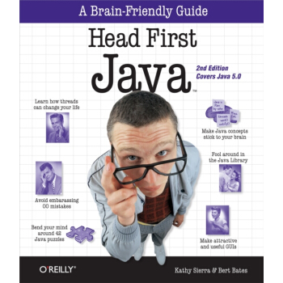
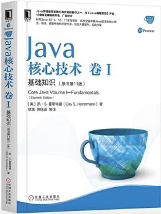
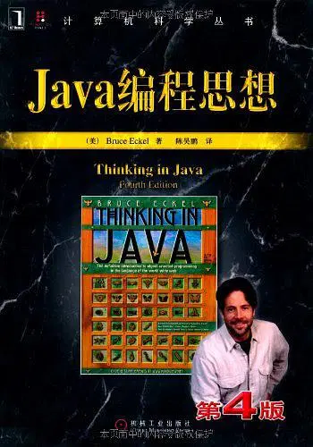
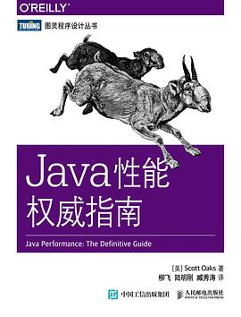
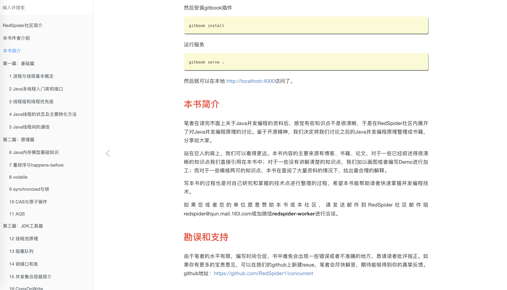
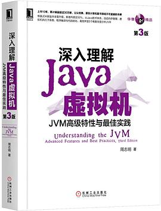
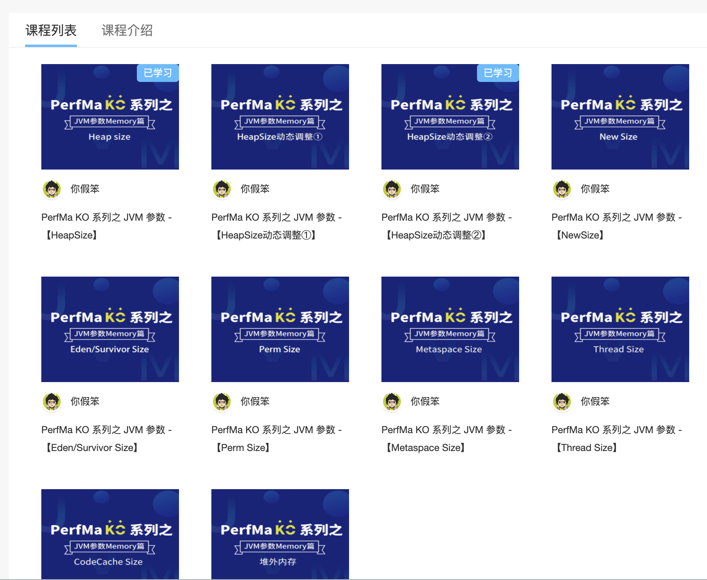
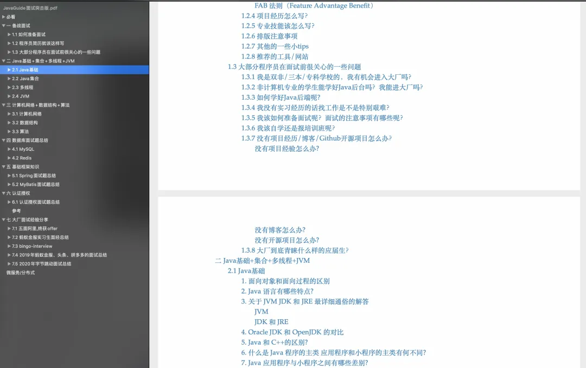

这篇文章推荐了大部分我所读过的优秀书籍，虽然部分可能没看完。答应我，一定要看到最后，看完之后应该不会再纠结要看什么书了。走起！！！

*这篇文章未涵盖计算机基础比如算法和数据结构、数据库、分布式、微服务方面的书籍，这个留在下一篇文章推荐。*

## Java基础

### 《Head First Java》

*Guide的 Java 启蒙书籍了。因为是我学习Java看的第一本书，所以，我对其有不一样的情感。*

*ps:我是当时学完了 C语言之后才开始学习 Java 的，刚开始看这本书感觉很轻松有趣，可以说是我学习编程初期最喜欢的一本书了。*

有些人说这本书不适合编程新手阅读？（问号脸）  我个人觉得还是很适合稍微有一点点经验的新手来阅读的，当然也适合我们用来温故 Java 知识点。

> ps:刚入门编程，最好的方式还是通过看视频来学习。

### 《Java 核心技术卷 1+卷 2》

*Guide拿来当做工具书的两本Java领域的好书！我当时在大学的时候就买了两本放在寝室，没事的时候就翻翻。*

建议有点 Java 基础之后再读，介绍的还是比较深入和全面的，非常推荐。

这两本书的内容很多，全看的话比较费时间，我一般也会用来巩固知识点或者当做工具书参考，是两本适合放在自己身边的好书。

### 《Java 编程思想 (第 4 版)》

*这本书Guide第一次看的时候还觉得有点枯燥，那时候还在上大二，看了 1/3就没看下去了。*

大部分人称之为Java领域的圣经（*感觉有点过了~~~*），但我不推荐初学者阅读，有点劝退的味道。稍微有点基础后阅读更好。

这本书到现在我也才看了一半左右，内容确实也比较多，而且稍微有点枯燥，但是比较权威。我一般也是拿来当做工具书参考。

### 《Java性能权威指南》

*希望能有更多这Java性能优化方面的好书！*

O'Reilly 家族书，性能调优的入门书，我个人觉得性能调优是每个 Java 从业者必备知识。

这本书介绍的实战内容很不错，尤其是 JVM 调优，缺点也比较明显，就是内容稍微有点老。市面上这种书很少。这本书不适合初学者，建议对 Java 语言已经比价掌握了再看。另外，阅读之前，最好先看看周志明大佬的《深入理解 Java 虚拟机》。

### 《Java 8实战》

*还没用上 Java 8 的可以反思一下了，还没用过 Lambda 也可以反思一下了。*

现在大部分公司至少都用到了 Java 8 , Java 8算是一个里程碑式的版本，提供了很多有用的新特性比如 Lambda、流式处理等等。

这本书是学习 Java 8 新特性很好的选择，它内容包括 Lambda、流和函数式编程等Java8新特性。实战系列的一贯风格让自己快速上手应用起来。

## 并发

### 《Java 并发编程之美》

*这本书还是非常适合我们用来学习 Java 多线程的。这本书的讲解非常通俗易懂，作者从并发编程基础到实战都是信手拈来。*

另外，这本书的作者加多自身也会经常在网上发布各种技术文章。这本书也是加多大佬这么多年在多线程领域的沉淀所得的结果吧！他书中的内容基本都是结合代码讲解，非常有说服力！

### 《实战 Java 高并发程序设计》

这个是我第二本要推荐的书籍，比较适合作为多线程入门/进阶书籍来看。这本书内容同样是理论结合实战，对于每个知识点的讲解也比较通俗易懂，整体结构也比较清。

### 《深入浅出 Java 多线程》

这本书是几位大厂（如阿里）的大佬开源的，Github 地址：[https://github.com/RedSpider1/concurrent](https://github.com/RedSpider1/concurrent)

几位作者为了写好《深入浅出 Java 多线程》这本书阅读了大量的 Java 多线程方面的书籍和博客，然后再加上他们的经验总结、Demo 实例、源码解析，最终才形成了这本书。

这本书的质量也是非常过硬！给作者们点个赞！这本书有统一的排版规则和语言风格、清晰的表达方式和逻辑。并且每篇文章初稿写完后，作者们就会互相审校，合并到主分支时所有成员会再次审校，最后再通篇修订了三遍。

### 《Java并发实现原理：JDK源码剖析》

这本书是去年也就是2020年新出的，所以，现在知道的人还不是很多。

这本书主要是对 Java Concurrent包中一些比较重要的源码进行了讲解，另外，像JMM、happen-before、CAS等等比较重要的并发知识这本书也都会一并介绍到。

不论是你想要深入研究 Java 并发，还是说要准备面试，你都可以看看这本书。

## JVM

JVM 这里就先只推荐一本书籍和一个关于 JVM 参数调优的免费教程（你假笨大佬将的）。

### 《深入理解Java虚拟机（第3版）》

*希望国内能有更多这样的优质书籍出现！加油！💪*

这本书就一句话形容：**国产书籍中的战斗机，实实在在的优秀！**

这本书的第三版去年年底已经出来了，新增了很多实在的内容比如ZGC等新一代GC的原理剖析。目前豆瓣上是 9.6 的高分，🐂不🐂我就不多说了！

不论是你面试还是你想要在 Java 领域学习的更深，你都离不开这本书籍。这本书不光要看，你还要多看几遍，都是干货，里面很多实战内容自己还最好实践一篇。

这里额外推荐一个你假笨大佬的[《JVM 参数【Memory篇】》](https://club.perfma.com/course/438755/list)教程，很厉害了！

## 面试

### 《JavaGuide面试突击版》

*谁看谁说好！哈哈！*

Guide自己开源的，涵盖了Java后端方面的大部分知识点比如 集合、JVM、多线程还有数据库MySQL等内容。

在我的公众号后台回复 ：“**面试突击**”即可免费获取。

