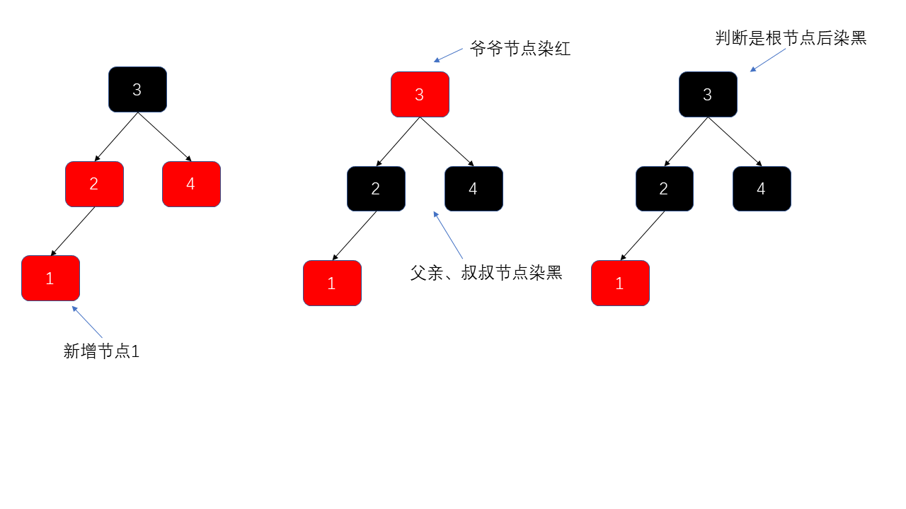
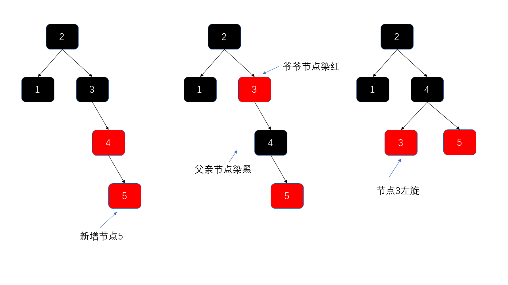
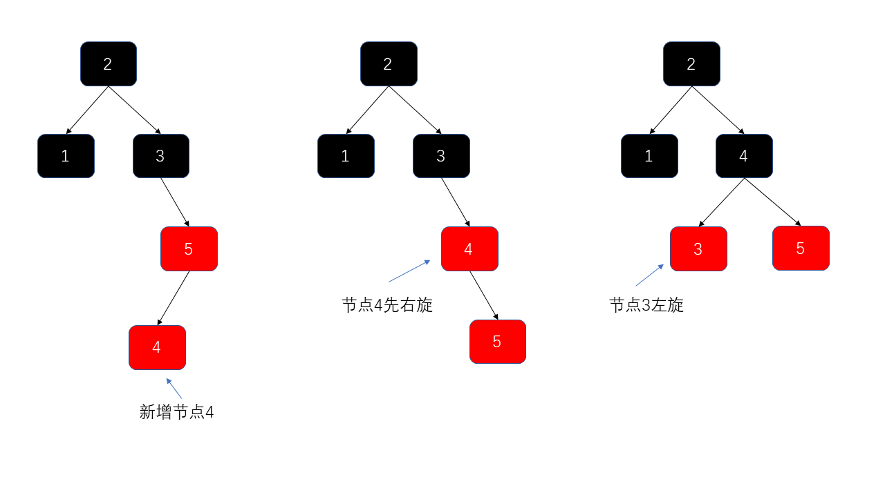
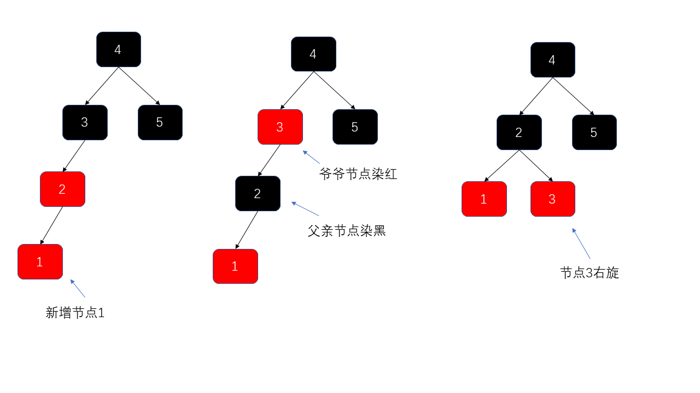
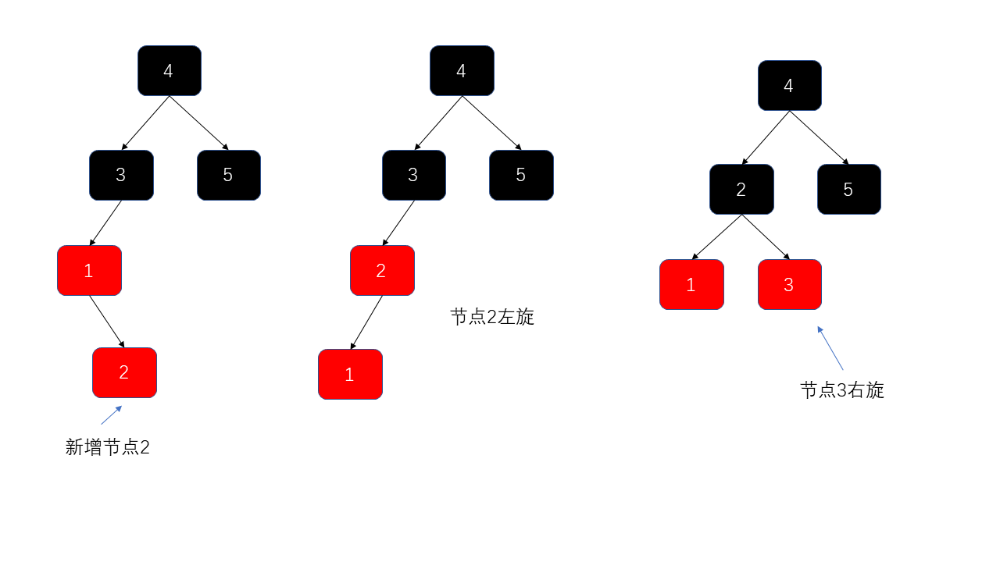

# 红黑树

## 红黑树数据结构

建立在 BST 二叉搜索树的基础上，AVL、2-3树、红黑树都是自平衡二叉树（统称B-树）。但相比于AVL树，高度平衡所带来的时间复杂度，红黑树对平衡的控制要宽松一些，红黑树只需要保证黑色节点平衡即可。

## **红黑树特点** 

1. 每个节点非红即黑；

   黑色决定平衡，红色不决定平衡。这对应了2-3树中一个节点内可以存放1~2个节点。

2. 根节点总是黑色的；

3. 每个叶子节点都是黑色的空节点（NIL 节点）；

   这里指的是红黑树都会有一个空的叶子节点，是红黑树自己的规则。

4. 如果节点是红色的，则它的子节点必须是黑色的（反之不一定）；

   通常这条规则也叫不会有连续的红色节点。一个节点最多临时会有3个节点，中间是黑色节点，左右是红色节点。

5. 从根节点到叶节点或空子节点的每条路径，必须包含相同数目的黑色节点（即相同的黑色高度）。

   每一层都只是有一个节点贡献了树高决定平衡性，也就是对应红黑树中的黑色节点。

## 红黑树结构实现

```java
public class Node {

    public Class<?> clazz;
    public Integer value;
    public Node parent;
    public Node left;
    public Node right;

    // AVL 树所需属性
    public int height;
    // 红黑树所需属性
    public Color color = Color.RED;
    
}
```

### 1.左倾染色



- 染色时根据当前节点的爷爷节点，找到当前节点的叔叔节点。
- 再把父节点染黑、叔叔节点染黑，爷爷节点染红。但爷爷节点染红是临时的，当平衡树高操作后会把根节点染黑。

### 2.右倾染色


### 3.左旋调衡

#### 3.1一次左旋



#### 3.2右旋+左旋



### 4.右旋调衡

#### 4.1一次右旋



#### 4.2左旋+右旋



**红黑树的应用**：TreeMap、TreeSet 以及 JDK1.8 的 HashMap 底层都用到了红黑树。

**为什么要用红黑树？** 简单来说红黑树就是为了解决二叉查找树的缺陷，因为二叉查找树在某些情况下会退化成一个线性结构。详细了解可以查看 [漫画：什么是红黑树？](https://juejin.im/post/5a27c6946fb9a04509096248#comment)（也介绍到了二叉查找树，非常推荐）

**相关阅读**：[《红黑树深入剖析及 Java 实现》](https://zhuanlan.zhihu.com/p/24367771)（美团点评技术团队）

<!-- @include: @article-footer.snippet.md -->
