# 树

树就是一种类似现实生活中的树的数据结构（倒置的树）。任何一颗非空树只有一个根节点。

一棵树具有以下特点：

1. 一棵树中的任意两个结点有且仅有唯一的一条路径连通。
2. 一棵树如果有 n 个结点，那么它一定恰好有 n-1 条边。
3. 一棵树不包含回路。

下图就是一颗树，并且是一颗二叉树。


如上图所示，通过上面这张图说明一下树中的常用概念：

- **节点** ：树中的每个元素都可以统称为节点。
- **根节点** ：顶层节点或者说没有父节点的节点。上图中 A 节点就是根节点。
- **父节点** ：若一个节点含有子节点，则这个节点称为其子节点的父节点。上图中的 B 节点是 D 节点、E 节点的父节点。
- **子节点** ：一个节点含有的子树的根节点称为该节点的子节点。上图中 D 节点、E 节点是 B 节点的子节点。
- **兄弟节点** ：具有相同父节点的节点互称为兄弟节点。上图中 D 节点、E 节点的共同父节点是 B 节点，故 D 和 E 为兄弟节点。
- **叶子节点** ：没有子节点的节点。上图中的 D、F、H、I 都是叶子节点。
- **节点的高度** ：该节点到叶子节点的最长路径所包含的边数。
- **节点的深度** ：根节点到该节点的路径所包含的边数
- **节点的层数** ：节点的深度+1。
- **树的高度** ：根节点的高度。

## 二叉树的分类

**二叉树**（Binary tree）是每个节点最多只有两个分支（即不存在分支度大于 2 的节点）的树结构。

**二叉树** 的分支通常被称作“**左子树**”或“**右子树**”。并且，**二叉树** 的分支具有左右次序，不能随意颠倒。

**二叉树** 的第 i 层至多拥有 `2^(i-1)` 个节点，深度为 k 的二叉树至多总共有 `2^k-1` 个节点

### 满二叉树

一个二叉树，如果每一个层的结点数都达到最大值，则这个二叉树就是 **满二叉树**。也就是说，如果一个二叉树的层数为 K，且结点总数是(2^k) -1 ，则它就是 **满二叉树**。如下图所示：

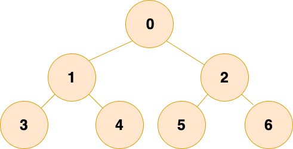

### 完全二叉树

除最后一层外，若其余层都是满的，并且最后一层或者是满的，或者是在右边缺少连续若干节点，则这个二叉树就是 **完全二叉树** 。

大家可以想象为一棵树从根结点开始扩展，扩展完左子节点才能开始扩展右子节点，每扩展完一层，才能继续扩展下一层。如下图所示：

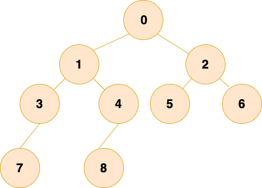

完全二叉树有一个很好的性质：**父结点和子节点的序号有着对应关系。**

细心的小伙伴可能发现了，当根节点的值为 1 的情况下，若父结点的序号是 i，那么左子节点的序号就是 2i，右子节点的序号是 2i+1。这个性质使得完全二叉树利用数组存储时可以极大地节省空间，以及利用序号找到某个节点的父结点和子节点，后续二叉树的存储会详细介绍。

### 平衡二叉树

**平衡二叉树** 是一棵二叉排序树，且具有以下性质：

1. 可以是一棵空树
2. 如果不是空树，它的左右两个子树的高度差的绝对值不超过 1，并且左右两个子树都是一棵平衡二叉树。

平衡二叉树的常用实现方法有 **红黑树**、**AVL 树**、**替罪羊树**、**加权平衡树**、**伸展树** 等。

在给大家展示平衡二叉树之前，先给大家看一棵树：

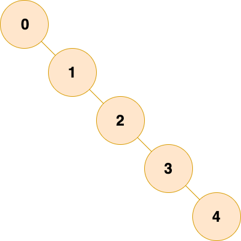

**你管这玩意儿叫树？？？**

没错，这玩意儿还真叫树，只不过这棵树已经退化为一个链表了，我们管它叫 **斜树**。

**如果这样，那我为啥不直接用链表呢?**

谁说不是呢？

二叉树相比于链表，由于父子节点以及兄弟节点之间往往具有某种特殊的关系，这种关系使得我们在树中对数据进行**搜索**和**修改**时，相对于链表更加快捷便利。

但是，如果二叉树退化为一个链表了，那么那么树所具有的优秀性质就难以表现出来，效率也会大打折，为了避免这样的情况，我们希望每个做 “家长”（父结点） 的，都 **一碗水端平**，分给左儿子和分给右儿子的尽可能一样多，相差最多不超过一层，如下图所示：

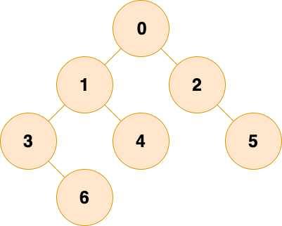

## 二叉树的存储

二叉树的存储主要分为 **链式存储** 和 **顺序存储** 两种：

### 链式存储

和链表类似，二叉树的链式存储依靠指针将各个节点串联起来，不需要连续的存储空间。

每个节点包括三个属性：

- 数据 data。data 不一定是单一的数据，根据不同情况，可以是多个具有不同类型的数据。
- 左节点指针 left
- 右节点指针 right。

可是 JAVA 没有指针啊！

那就直接引用对象呗（别问我对象哪里找）

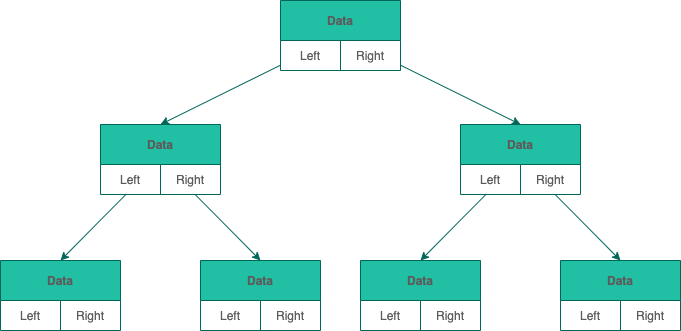

### 顺序存储

顺序存储就是利用数组进行存储，数组中的每一个位置仅存储节点的 data，不存储左右子节点的指针，子节点的索引通过数组下标完成。根结点的序号为 1，对于每个节点 Node，假设它存储在数组中下标为 i 的位置，那么它的左子节点就存储在 2 _ i 的位置，它的右子节点存储在下标为 2 _ i+1 的位置。

一棵完全二叉树的数组顺序存储如下图所示：

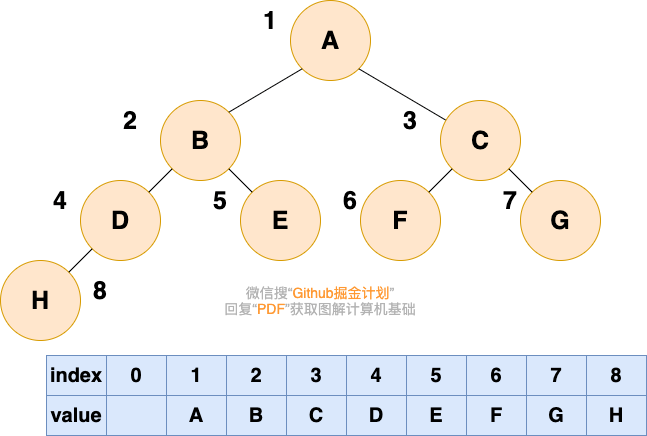

大家可以试着填写一下存储如下二叉树的数组，比较一下和完全二叉树的顺序存储有何区别：

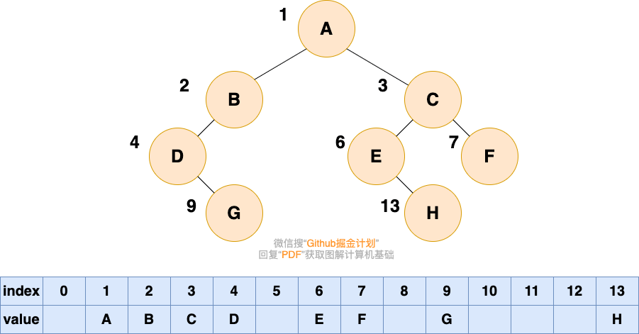

可以看到，如果我们要存储的二叉树不是完全二叉树，在数组中就会出现空隙，导致内存利用率降低

## 二叉树的遍历

### 先序遍历

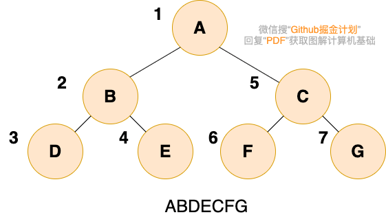

二叉树的先序遍历，就是先输出根结点，再遍历左子树，最后遍历右子树，遍历左子树和右子树的时候，同样遵循先序遍历的规则，也就是说，我们可以递归实现先序遍历。

代码如下：

```java
public void preOrder(TreeNode root){
	if(root == null){
		return;
	}
	system.out.println(root.data);
	preOrder(root.left);
	preOrder(root.right);
}
```

### 中序遍历

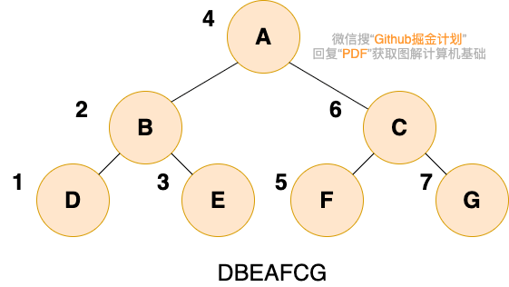

二叉树的中序遍历，就是先递归中序遍历左子树，再输出根结点的值，再递归中序遍历右子树，大家可以想象成一巴掌把树压扁，父结点被拍到了左子节点和右子节点的中间，如下图所示：

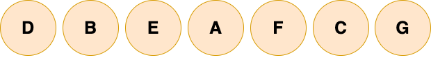

代码如下：

```java
public void inOrder(TreeNode root){
	if(root == null){
		return;
	}
	inOrder(root.left);
	system.out.println(root.data);
	inOrder(root.right);
}
```

### 后序遍历

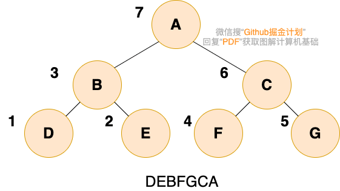

二叉树的后序遍历，就是先递归后序遍历左子树，再递归后序遍历右子树，最后输出根结点的值

代码如下：

```java
public void postOrder(TreeNode root){
	if(root == null){
		return;
	}
	postOrder(root.left);
	postOrder(root.right);
	system.out.println(root.data);
}
```