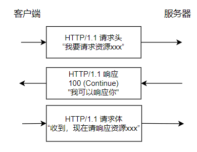

这篇文章会从下面几个维度来对比 HTTP 1.0 和 HTTP 1.1：

- 响应状态码
- 缓存处理
- 连接方式
- Host 头处理
- 带宽优化

## 响应状态码

HTTP/1.0 仅定义了 16 种状态码。HTTP/1.1 中新加入了大量的状态码，光是错误响应状态码就新增了 24 种。比如说，`100 (Continue)`——在请求大资源前的预热请求，`206 (Partial Content)`——范围请求的标识码，`409 (Conflict)`——请求与当前资源的规定冲突，`410 (Gone)`——资源已被永久转移，而且没有任何已知的转发地址。

## 缓存处理

缓存技术通过避免用户与源服务器的频繁交互，节约了大量的网络带宽，降低了用户接收信息的延迟。

### HTTP/1.0

HTTP/1.0 提供的缓存机制非常简单。服务器端使用`Expires`标签来标志（时间）一个响应体，在`Expires`标志时间内的请求，都会获得该响应体缓存。服务器端在初次返回给客户端的响应体中，有一个`Last-Modified`标签，该标签标记了被请求资源在服务器端的最后一次修改。在请求头中，使用`If-Modified-Since`标签，该标签标志一个时间，意为客户端向服务器进行问询：“该时间之后，我要请求的资源是否有被修改过？”通常情况下，请求头中的`If-Modified-Since`的值即为上一次获得该资源时，响应体中的`Last-Modified`的值。

如果服务器接收到了请求头，并判断`If-Modified-Since`时间后，资源确实没有修改过，则返回给客户端一个`304 not modified`响应头，表示”缓冲可用，你从浏览器里拿吧！”。

如果服务器判断`If-Modified-Since`时间后，资源被修改过，则返回给客户端一个`200 OK`的响应体，并附带全新的资源内容，表示”你要的我已经改过的，给你一份新的”。


### HTTP/1.1

HTTP/1.1 的缓存机制在 HTTP/1.0 的基础上，大大增加了灵活性和扩展性。基本工作原理和 HTTP/1.0 保持不变，而是增加了更多细致的特性。其中，请求头中最常见的特性就是`Cache-Control`，详见 MDN Web 文档 [Cache-Control](https://developer.mozilla.org/zh-CN/docs/Web/HTTP/Headers/Cache-Control).

## 连接方式

**HTTP/1.0 默认使用短连接** ，也就是说，客户端和服务器每进行一次 HTTP 操作，就建立一次连接，任务结束就中断连接。当客户端浏览器访问的某个 HTML 或其他类型的 Web 页中包含有其他的 Web 资源（如 JavaScript 文件、图像文件、CSS 文件等），每遇到这样一个 Web 资源，浏览器就会重新建立一个 TCP 连接，这样就会导致有大量的“握手报文”和“挥手报文”占用了带宽。

**为了解决 HTTP/1.0 存在的资源浪费的问题， HTTP/1.1 优化为默认长连接模式 。** 采用长连接模式的请求报文会通知服务端：“我向你请求连接，并且连接成功建立后，请不要关闭”。因此，该 TCP 连接将持续打开，为后续的客户端-服务端的数据交互服务。也就是说在使用长连接的情况下，当一个网页打开完成后，客户端和服务器之间用于传输 HTTP 数据的 TCP 连接不会关闭，客户端再次访问这个服务器时，会继续使用这一条已经建立的连接。

如果 TCP 连接一直保持的话也是对资源的浪费，因此，一些服务器软件（如 Apache）还会支持超时时间的时间。在超时时间之内没有新的请求达到，TCP 连接才会被关闭。

有必要说明的是，HTTP/1.0 仍提供了长连接选项，即在请求头中加入`Connection: Keep-alive`。同样的，在 HTTP/1.1 中，如果不希望使用长连接选项，也可以在请求头中加入`Connection: close`，这样会通知服务器端：“我不需要长连接，连接成功后即可关闭”。

**HTTP 协议的长连接和短连接，实质上是 TCP 协议的长连接和短连接。**

**实现长连接需要客户端和服务端都支持长连接。**

## Host 头处理

域名系统（DNS）允许多个主机名绑定到同一个 IP 地址上，但是 HTTP/1.0 并没有考虑这个问题，假设我们有一个资源 URL 是<http://example1.org/home.html，HTTP/1.0> 的请求报文中，将会请求的是`GET /home.html HTTP/1.0`.也就是不会加入主机名。这样的报文送到服务器端，服务器是理解不了客户端想请求的真正网址。

因此，HTTP/1.1 在请求头中加入了`Host`字段。加入`Host`字段的报文头部将会是:

```plain
GET /home.html HTTP/1.1
Host: example1.org
```

这样，服务器端就可以确定客户端想要请求的真正的网址了。

## 带宽优化

### 范围请求

HTTP/1.1 引入了范围请求（range request）机制，以避免带宽的浪费。当客户端想请求一个文件的一部分，或者需要继续下载一个已经下载了部分但被终止的文件，HTTP/1.1 可以在请求中加入`Range`头部，以请求（并只能请求字节型数据）数据的一部分。服务器端可以忽略`Range`头部，也可以返回若干`Range`响应。

`206 (Partial Content)` 状态码的主要作用是确保客户端和代理服务器能正确识别部分内容响应，避免将其误认为完整资源并错误地缓存。这对于正确处理范围请求和缓存管理非常重要。

一个典型的 HTTP/1.1 范围请求示例：

```bash
# 获取一个文件的前 1024 个字节
GET /z4d4kWk.jpg HTTP/1.1
Host: i.imgur.com
Range: bytes=0-1023
```

`206 Partial Content` 响应：

```bash

HTTP/1.1 206 Partial Content
Content-Range: bytes 0-1023/146515
Content-Length: 1024
…
（二进制内容）
```

简单解释一下 HTTP 范围响应头部中的字段：

- **`Content-Range` 头部**：指示返回数据在整个资源中的位置，包括起始和结束字节以及资源的总长度。例如，`Content-Range: bytes 0-1023/146515` 表示服务器端返回了第 0 到 1023 字节的数据（共 1024 字节），而整个资源的总长度是 146,515 字节。
- **`Content-Length` 头部**：指示此次响应中实际传输的字节数。例如，`Content-Length: 1024` 表示服务器端传输了 1024 字节的数据。

`Range` 请求头不仅可以请求单个字节范围，还可以一次性请求多个范围。这种方式被称为“多重范围请求”（multiple range requests）。

客户端想要获取资源的第 0 到 499 字节以及第 1000 到 1499 字节：

```bash
GET /path/to/resource HTTP/1.1
Host: example.com
Range: bytes=0-499,1000-1499
```

服务器端返回多个字节范围，每个范围的内容以分隔符分开：

```bash
HTTP/1.1 206 Partial Content
Content-Type: multipart/byteranges; boundary=3d6b6a416f9b5
Content-Length: 376

--3d6b6a416f9b5
Content-Type: application/octet-stream
Content-Range: bytes 0-99/2000

(第 0 到 99 字节的数据块)

--3d6b6a416f9b5
Content-Type: application/octet-stream
Content-Range: bytes 500-599/2000

(第 500 到 599 字节的数据块)

--3d6b6a416f9b5
Content-Type: application/octet-stream
Content-Range: bytes 1000-1099/2000

(第 1000 到 1099 字节的数据块)

--3d6b6a416f9b5--
```

### 状态码 100

HTTP/1.1 中新加入了状态码`100`。该状态码的使用场景为，存在某些较大的文件请求，服务器可能不愿意响应这种请求，此时状态码`100`可以作为指示请求是否会被正常响应，过程如下图：




然而在 HTTP/1.0 中，并没有`100 (Continue)`状态码，要想触发这一机制，可以发送一个`Expect`头部，其中包含一个`100-continue`的值。

### 压缩

许多格式的数据在传输时都会做预压缩处理。数据的压缩可以大幅优化带宽的利用。然而，HTTP/1.0 对数据压缩的选项提供的不多，不支持压缩细节的选择，也无法区分端到端（end-to-end）压缩或者是逐跳（hop-by-hop）压缩。

HTTP/1.1 则对内容编码（content-codings）和传输编码（transfer-codings）做了区分。内容编码总是端到端的，传输编码总是逐跳的。

HTTP/1.0 包含了`Content-Encoding`头部，对消息进行端到端编码。HTTP/1.1 加入了`Transfer-Encoding`头部，可以对消息进行逐跳传输编码。HTTP/1.1 还加入了`Accept-Encoding`头部，是客户端用来指示他能处理什么样的内容编码。

## 总结

1. **连接方式** : HTTP 1.0 为短连接，HTTP 1.1 支持长连接。
1. **状态响应码** : HTTP/1.1 中新加入了大量的状态码，光是错误响应状态码就新增了 24 种。比如说，`100 (Continue)`——在请求大资源前的预热请求，`206 (Partial Content)`——范围请求的标识码，`409 (Conflict)`——请求与当前资源的规定冲突，`410 (Gone)`——资源已被永久转移，而且没有任何已知的转发地址。
1. **缓存处理** : 在 HTTP1.0 中主要使用 header 里的 If-Modified-Since,Expires 来做为缓存判断的标准，HTTP1.1 则引入了更多的缓存控制策略例如 Entity tag，If-Unmodified-Since, If-Match, If-None-Match 等更多可供选择的缓存头来控制缓存策略。
1. **带宽优化及网络连接的使用** :HTTP1.0 中，存在一些浪费带宽的现象，例如客户端只是需要某个对象的一部分，而服务器却将整个对象送过来了，并且不支持断点续传功能，HTTP1.1 则在请求头引入了 range 头域，它允许只请求资源的某个部分，即返回码是 206（Partial Content），这样就方便了开发者自由的选择以便于充分利用带宽和连接。
1. **Host 头处理** : HTTP/1.1 在请求头中加入了`Host`字段。

## 参考资料

[Key differences between HTTP/1.0 and HTTP/1.1](http://www.ra.ethz.ch/cdstore/www8/data/2136/pdf/pd1.pdf)

<!-- @include: @article-footer.snippet.md -->
