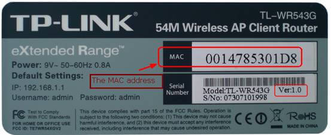

## 计算机网络基础

### OSI 和 TCP/IP 网络分层模型

**相关面试题** ：

- OSI 七层模型是什么？每一层的作用是什么？
- TCP/IP 四层模型是什么？每一层的作用是什么？
- 为什么网络要分层？

**参考答案** ：[OSI 和 TCP/IP 网络分层模型详解（基础）](./osi&tcp-ip-model.md)。

### 应用层有哪些常见的协议？

[应用层常见协议总结（应用层）](./application-layer-protocol.md) 

## TCP 与 UDP

###  TCP 与 UDP 的区别（重要）

1. **是否面向连接** ：UDP 在传送数据之前不需要先建立连接。而 TCP 提供面向连接的服务，在传送数据之前必须先建立连接，数据传送结束后要释放连接。
2. **是否是可靠传输**：远地主机在收到 UDP 报文后，不需要给出任何确认，并且不保证数据不丢失，不保证是否顺序到达。TCP 提供可靠的传输服务，TCP 在传递数据之前，会有三次握手来建立连接，而且在数据传递时，有确认、窗口、重传、拥塞控制机制。通过 TCP 连接传输的数据，无差错、不丢失、不重复、并且按序到达。
3. **是否有状态** ：这个和上面的“是否可靠传输”相对应。TCP 传输是有状态的，这个有状态说的是 TCP 会去记录自己发送消息的状态比如消息是否发送了、是否被接收了等等。为此 ，TCP 需要维持复杂的连接状态表。而 UDP 是无状态服务，简单来说就是不管发出去之后的事情了（**这很渣男！**）。
4. **传输效率** ：由于使用 TCP 进行传输的时候多了连接、确认、重传等机制，所以 TCP 的传输效率要比 UDP 低很多。
5. **传输形式** ： TCP 是面向字节流的，UDP 是面向报文的。
6. **首部开销** ：TCP 首部开销（20 ～ 60 字节）比 UDP 首部开销（8 字节）要大。
7. **是否提供广播或多播服务** ：TCP 只支持点对点通信，UDP 支持一对一、一对多、多对一、多对多；
8. ......

我把上面总结的内容通过表格形式展示出来了！确定不点个赞嘛？

|                        | TCP            | UDP        |
| ---------------------- | -------------- | ---------- |
| 是否面向连接           | 是             | 否         |
| 是否可靠               | 是             | 否         |
| 是否有状态             | 是             | 否         |
| 传输效率               | 较慢           | 较快       |
| 传输形式               | 字节流         | 数据报文段 |
| 首部开销               | 20 ～ 60 bytes | 8 bytes    |
| 是否提供广播或多播服务 | 否             | 是         |

###  什么时候选择 TCP,什么时候选 UDP?

- **UDP 一般用于即时通信**，比如： 语音、 视频 、直播等等。这些场景对传输数据的准确性要求不是特别高，比如你看视频即使少个一两帧，实际给人的感觉区别也不大。
- **TCP 用于对传输准确性要求特别高的场景**，比如文件传输、发送和接收邮件、远程登录等等。

###  HTTP 基于 TCP 还是 UDP？

**HTTP 协议是基于 TCP 协议的**，所以发送 HTTP 请求之前首先要建立 TCP 连接也就是要经历 3 次握手。

### 使用 TCP 的协议有哪些?使用 UDP 的协议有哪些?

**运行于 TCP 协议之上的协议** ：

1. **HTTP 协议** ：超文本传输协议（HTTP，HyperText Transfer Protocol)主要是为 Web 浏览器与 Web 服务器之间的通信而设计的。当我们使用浏览器浏览网页的时候，我们网页就是通过 HTTP 请求进行加载的。
2. **HTTPS 协议** ：更安全的超文本传输协议(HTTPS,Hypertext Transfer Protocol Secure)，身披 SSL 外衣的 HTTP 协议
3. **FTP 协议**：文件传输协议 FTP（File Transfer Protocol），提供文件传输服务，**基于 TCP** 实现可靠的传输。使用 FTP 传输文件的好处是可以屏蔽操作系统和文件存储方式。
4. **SMTP 协议**：简单邮件传输协议（SMTP，Simple Mail Transfer Protocol）的缩写，**基于 TCP 协议**，用来发送电子邮件。注意 ⚠️：接受邮件的协议不是 SMTP 而是 POP3 协议。
5. **POP3/IMAP 协议**： POP3 和 IMAP 两者都是负责邮件接收的协议。
6. **Telent 协议**：远程登陆协议，通过一个终端登陆到其他服务器。被一种称为 SSH 的非常安全的协议所取代。
7. **SSH 协议** : SSH（ Secure Shell）是目前较可靠，专为远程登录会话和其他网络服务提供安全性的协议。利用 SSH 协议可以有效防止远程管理过程中的信息泄露问题。SSH 建立在可靠的传输协议 TCP 之上。
8. ......

**运行于 UDP 协议之上的协议** ：

1. **DHCP 协议**：动态主机配置协议，动态配置 IP 地址
2. **DNS** ： **域名系统（DNS，Domain Name System）将人类可读的域名 (例如，www.baidu.com) 转换为机器可读的 IP 地址 (例如，220.181.38.148)。** 我们可以将其理解为专为互联网设计的电话薄。实际上 DNS 同时支持 UDP 和 TCP 协议。

### TCP 三次握手和四次挥手（非常重要）

**相关面试题** ：

- 为什么要三次握手?
- 第 2 次握手传回了ACK，为什么还要传回SYN？
- 为什么要四次挥手？
- 为什么不能把服务器发送的 ACK 和 FIN 合并起来，变成三次挥手？
- 如果第二次挥手时服务器的 ACK 没有送达客户端，会怎样？
- 为什么第四次挥手客户端需要等待 2\*MSL（报文段最长寿命）时间后才进入 CLOSED 状态？

**参考答案** ：[TCP 三次握手和四次挥手（传输层）](./tcp-connection-and-disconnection.md) 。

### TCP 如何保证传输的可靠性？（重要）

[TCP 传输可靠性保障（传输层）](./tcp-reliability-guarantee.md)

## HTTP

### 从输入URL 到页面展示到底发生了什么？（非常重要）

> 类似的问题：打开一个网页，整个过程会使用哪些协议？

图解（图片来源：《图解 HTTP》）：

> 上图有一个错误，请注意，是 OSPF 不是 OPSF。 OSPF（Open Shortest Path First，ospf）开放最短路径优先协议, 是由 Internet 工程任务组开发的路由选择协议

总体来说分为以下几个过程:

1. DNS 解析
2. TCP 连接
3. 发送 HTTP 请求
4. 服务器处理请求并返回 HTTP 报文
5. 浏览器解析渲染页面
6. 连接结束

具体可以参考下面这两篇文章：

- [从输入URL到页面加载发生了什么？](https://segmentfault.com/a/1190000006879700)
- [浏览器从输入网址到页面展示的过程](https://cloud.tencent.com/developer/article/1879758)

### HTTP 状态码有哪些？

HTTP 状态码用于描述 HTTP 请求的结果，比如2xx 就代表请求被成功处理。

关于 HTTP 状态码更详细的总结，可以看我写的这篇文章：[HTTP 常见状态码总结（应用层）](./http-status-codes.md)。

### HTTP 和 HTTPS 有什么区别？（重要）

- **端口号** ：HTTP 默认是 80，HTTPS 默认是 443。
- **URL 前缀** ：HTTP 的 URL 前缀是 `http://`，HTTPS 的 URL 前缀是 `https://`。
- **安全性和资源消耗** ： HTTP 协议运行在 TCP 之上，所有传输的内容都是明文，客户端和服务器端都无法验证对方的身份。HTTPS 是运行在 SSL/TLS 之上的 HTTP 协议，SSL/TLS 运行在 TCP 之上。所有传输的内容都经过加密，加密采用对称加密，但对称加密的密钥用服务器方的证书进行了非对称加密。所以说，HTTP 安全性没有 HTTPS 高，但是 HTTPS 比 HTTP 耗费更多服务器资源。

关于 HTTP 和 HTTPS 更详细的对比总结，可以看我写的这篇文章：[HTTP vs HTTPS（应用层）](./http&https.md) 。

### HTTP 1.0 和 HTTP 1.1 有什么区别？

- **连接方式** : HTTP 1.0 为短连接，HTTP 1.1 支持长连接。
- **状态响应码** : HTTP/1.1中新加入了大量的状态码，光是错误响应状态码就新增了24种。比如说，`100 (Continue)`——在请求大资源前的预热请求，`206 (Partial Content)`——范围请求的标识码，`409 (Conflict)`——请求与当前资源的规定冲突，`410 (Gone)`——资源已被永久转移，而且没有任何已知的转发地址。
- **缓存处理** : 在 HTTP1.0 中主要使用 header 里的 If-Modified-Since,Expires 来做为缓存判断的标准，HTTP1.1 则引入了更多的缓存控制策略例如 Entity tag，If-Unmodified-Since, If-Match, If-None-Match 等更多可供选择的缓存头来控制缓存策略。
- **带宽优化及网络连接的使用** :HTTP1.0 中，存在一些浪费带宽的现象，例如客户端只是需要某个对象的一部分，而服务器却将整个对象送过来了，并且不支持断点续传功能，HTTP1.1 则在请求头引入了 range 头域，它允许只请求资源的某个部分，即返回码是 206（Partial Content），这样就方便了开发者自由的选择以便于充分利用带宽和连接。
- **Host头处理** : HTTP/1.1在请求头中加入了`Host`字段。

关于 HTTP 1.0 和 HTTP 1.1 更详细的对比总结，可以看我写的这篇文章：[HTTP 1.0 vs HTTP 1.1（应用层）](./http1.0&http1.1.md) 。

### HTTP 是不保存状态的协议, 如何保存用户状态?

HTTP 是一种不保存状态，即无状态（stateless）协议。也就是说 HTTP 协议自身不对请求和响应之间的通信状态进行保存。那么我们保存用户状态呢？Session 机制的存在就是为了解决这个问题，Session 的主要作用就是通过服务端记录用户的状态。典型的场景是购物车，当你要添加商品到购物车的时候，系统不知道是哪个用户操作的，因为 HTTP 协议是无状态的。服务端给特定的用户创建特定的 Session 之后就可以标识这个用户并且跟踪这个用户了（一般情况下，服务器会在一定时间内保存这个 Session，过了时间限制，就会销毁这个 Session）。

在服务端保存 Session 的方法很多，最常用的就是内存和数据库(比如是使用内存数据库 redis 保存)。既然 Session 存放在服务器端，那么我们如何实现 Session 跟踪呢？大部分情况下，我们都是通过在 Cookie 中附加一个 Session ID 来方式来跟踪。

**Cookie 被禁用怎么办?**

最常用的就是利用 URL 重写把 Session ID 直接附加在 URL 路径的后面。

### URI 和 URL 的区别是什么?

* URI(Uniform Resource Identifier) 是统一资源标志符，可以唯一标识一个资源。
* URL(Uniform Resource Locator) 是统一资源定位符，可以提供该资源的路径。它是一种具体的 URI，即 URL 可以用来标识一个资源，而且还指明了如何 locate 这个资源。

URI 的作用像身份证号一样，URL 的作用更像家庭住址一样。URL 是一种具体的 URI，它不仅唯一标识资源，而且还提供了定位该资源的信息。

## ARP

### 什么是 Mac 地址？

MAC 地址的全称是 **媒体访问控制地址（Media Access Control Address）**。如果说，互联网中每一个资源都由 IP 地址唯一标识（IP 协议内容），那么一切网络设备都由 MAC 地址唯一标识。

可以理解为，MAC 地址是一个网络设备真正的身份证号，IP 地址只是一种不重复的定位方式（比如说住在某省某市某街道的张三，这种逻辑定位是 IP 地址，他的身份证号才是他的 MAC 地址），也可以理解为 MAC 地址是身份证号，IP 地址是邮政地址。MAC 地址也有一些别称，如 LAN 地址、物理地址、以太网地址等。

> 还有一点要知道的是，不仅仅是网络资源才有 IP 地址，网络设备也有 IP 地址，比如路由器。但从结构上说，路由器等网络设备的作用是组成一个网络，而且通常是内网，所以它们使用的 IP 地址通常是内网 IP，内网的设备在与内网以外的设备进行通信时，需要用到 NAT 协议。

MAC 地址的长度为 6 字节（48 比特），地址空间大小有 280 万亿之多（$2^{48}$），MAC 地址由 IEEE 统一管理与分配，理论上，一个网络设备中的网卡上的 MAC 地址是永久的。不同的网卡生产商从 IEEE 那里购买自己的 MAC 地址空间（MAC 的前 24 比特），也就是前 24 比特由 IEEE 统一管理，保证不会重复。而后 24 比特，由各家生产商自己管理，同样保证生产的两块网卡的 MAC 地址不会重复。

MAC 地址具有可携带性、永久性，身份证号永久地标识一个人的身份，不论他到哪里都不会改变。而 IP 地址不具有这些性质，当一台设备更换了网络，它的 IP 地址也就可能发生改变，也就是它在互联网中的定位发生了变化。

最后，记住，MAC 地址有一个特殊地址：FF-FF-FF-FF-FF-FF（全 1 地址），该地址表示广播地址。

### ARP 协议解决了什么问题地位如何？

ARP 协议，全称 **地址解析协议（Address Resolution Protocol）**，它解决的是网络层地址和链路层地址之间的转换问题。因为一个 IP 数据报在物理上传输的过程中，总是需要知道下一跳（物理上的下一个目的地）该去往何处，但 IP 地址属于逻辑地址，而 MAC 地址才是物理地址，ARP 协议解决了 IP 地址转 MAC 地址的一些问题。

### ARP 协议的工作原理？

[ARP 协议详解(网络层)](./arp.md)

## 复习建议

非常推荐大家看一下 《图解 HTTP》 这本书，这本书页数不多，但是内容很是充实，不管是用来系统的掌握网络方面的一些知识还是说纯粹为了应付面试都有很大帮助。下面的一些文章只是参考。大二学习这门课程的时候，我们使用的教材是 《计算机网络第七版》（谢希仁编著），不推荐大家看这本教材，书非常厚而且知识偏理论，不确定大家能不能心平气和的读完。
