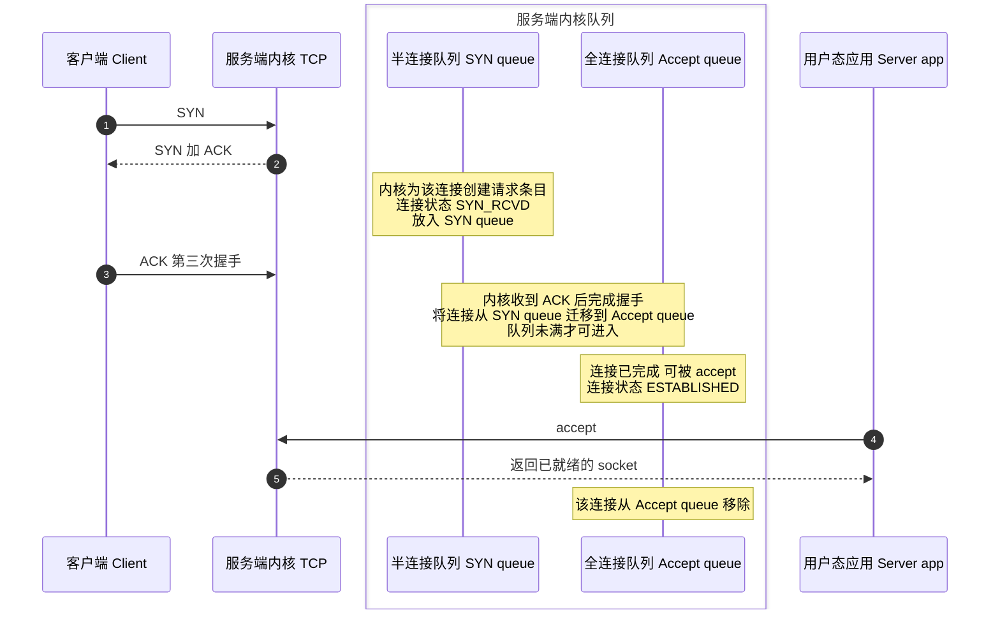
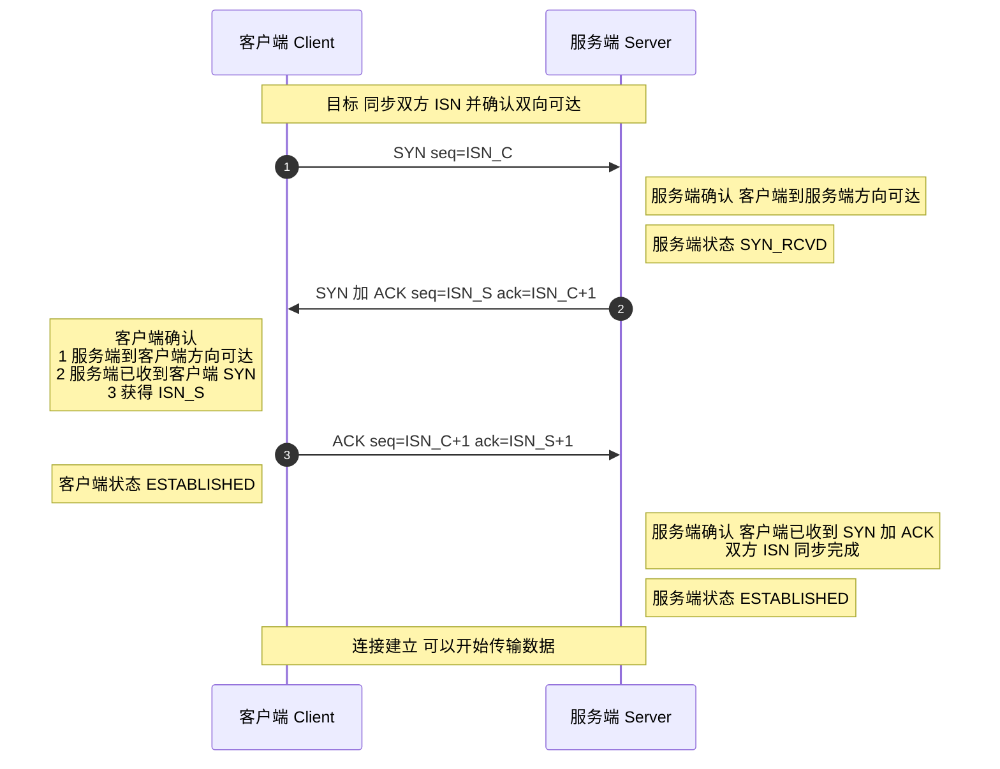
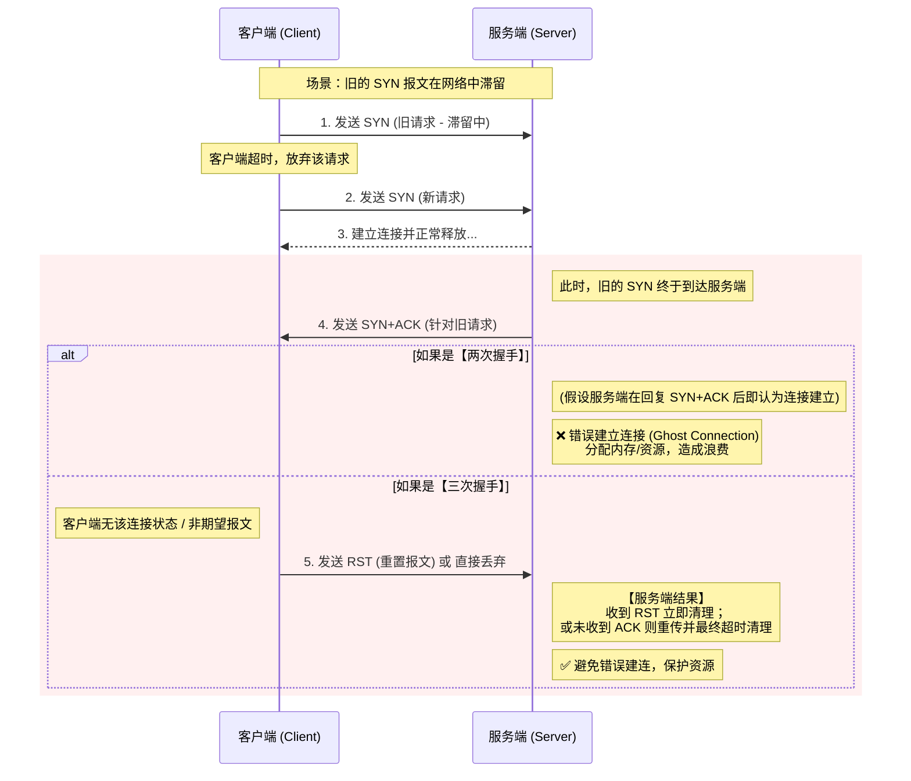
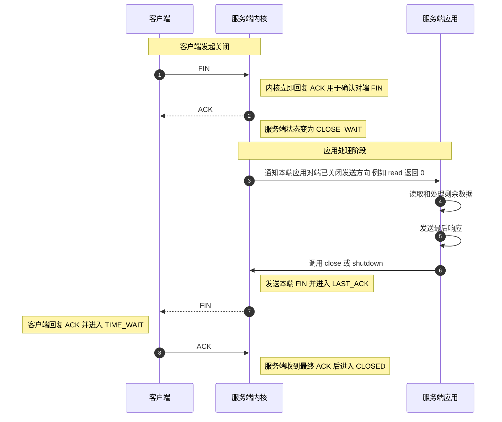

TCP（Transmission Control Protocol）是一种**面向连接**、**可靠**的传输层协议。所谓“可靠”，通常体现在：按序交付、差错检测、丢包重传、流量控制与拥塞控制等。为了在不可靠的网络之上建立一条逻辑可靠的端到端连接，TCP 在传输数据前必须先完成连接建立过程，即 **三次握手（Three-way Handshake）**。

## 建立连接-TCP 三次握手

建立一个 TCP 连接需要“三次握手”，缺一不可：

1. **第一次握手 (SYN)**: 客户端向服务端发送一个 SYN（Synchronize Sequence Numbers）报文段，其中包含一个由客户端随机生成的初始序列号（Initial Sequence Number, ISN），例如 seq=x。发送后，客户端进入 **SYN_SENT** 状态，等待服务端的确认。
2. **第二次握手 (SYN+ACK)**: 服务端收到 SYN 报文段后，如果同意建立连接，会向客户端回复一个确认报文段。该报文段包含两个关键信息：
   - **SYN**：服务端也需要同步自己的初始序列号，因此报文段中也包含一个由服务端随机生成的初始序列号，例如 seq=y。
   - **ACK** (Acknowledgement)：用于确认收到了客户端的请求。其确认号被设置为客户端初始序列号加一，即 ack=x+1。
   - 发送该报文段后，服务端进入 **SYN_RCVD** （也称 SYN_RECV）状态。
3. **第三次握手 (ACK)**: 客户端收到服务端的 SYN+ACK 报文段后，会向服务端发送一个最终的确认报文段。该报文段包含确认号 ack=y+1。发送后，客户端进入 **ESTABLISHED** 状态。服务端收到这个 ACK 报文段后，也进入 **ESTABLISHED** 状态。

至此，双方都确认了连接的建立，TCP 连接成功创建，可以开始进行双向数据传输。

### 什么是半连接队列和全连接队列？

在 TCP 三次握手过程中，服务端内核通常会用两个队列来管理连接请求（不同操作系统/内核版本实现细节可能略有差异，下面以常见 Linux 行为为例）：

1. **半连接队列**（也称 SYN Queue）：
   - 保存“握手未完成”的请求：服务端收到 SYN 并回 SYN+ACK 后，连接进入 SYN_RCVD，等待客户端最终 ACK。
   - 如果一直收不到 ACK，内核会按重传策略重发 SYN+ACK，最终超时清理。
   - 常见相关参数：`net.ipv4.tcp_max_syn_backlog`；在 SYN Flood 场景下可配合 `net.ipv4.tcp_syncookies`。
2. **全连接队列**（也称 Accept Queue）：
   - 保存“握手已完成但应用还没 accept”的连接：服务端收到最终 ACK 后连接变为 `ESTABLISHED`，并进入 全连接队列，等待应用层 `accept()` 取走。
   - 队列容量受 `listen(fd, backlog)` 与系统上限 `net.core.somaxconn` 共同影响；实践中常见有效上限近似为 `min(backlog, somaxconn)`（具体行为与内核版本相关）。

总结：

| 队列                       | 作用               | 状态        | 移出条件                |
| -------------------------- | ------------------ | ----------- | ----------------------- |
| 半连接队列（SYN Queue）    | 保存未完成握手连接 | SYN_RCVD    | 收到 ACK / 超时重传失败 |
| 全连接队列（Accept Queue） | 保存已完成握手连接 | ESTABLISHED | 被应用层 accept() 取出  |

当全连接队列满时，`net.ipv4.tcp_abort_on_overflow` 会影响处理策略：

- `0`（默认）：通常不会立刻让连接快速失败，给应用留缓冲时间（可能表现为客户端重试/超时）。
- `1`：直接对客户端回复 `RST`，让连接快速失败。

当半连接队列满时，如果开启了 `tcp_syncookies`，服务端可能不会为该连接在半连接队列中分配常规条目，而是计算并返回一个 **SYN Cookie**。只有当收到合法的最终 `ACK` 时，才“重建”必要的连接信息。这是抵御 **SYN Flood** 的核心手段之一。

### 为什么要三次握手?

TCP 三次握手的核心目的是为了在客户端和服务器之间建立一个**可靠的**、**全双工的**通信信道。这需要实现两个主要目标：

**1. 确认双方的收发能力，并同步初始序列号 (ISN)**

TCP 依赖序列号（SEQ）与确认号（ACK）保证数据**有序、无重复、可重传**。三次握手通过交换并确认双方的 ISN，使两端对“从哪一个序号开始收发数据”达成一致，同时让握手过程形成闭环，避免仅凭单向信息就进入已建立状态。

经过这三次交互，双方都确认了彼此的收发功能完好，并完成了初始序列号的同步，为后续可靠的数据传输奠定了基础。

三次握手能力确认速记：

1. C→S：SYN → S 确认：C 能发，S 能收（C→S 通）。
2. S→C：SYN+ACK → C 确认：S 能发，C 能收，且 S 已收到 C 的 SYN(对方 SEQ + 1)。
3. C→S：ACK → S 确认：C 已收到 S 的 SYN+ACK，握手闭环，连接建立。

**2. 防止已失效的连接请求被错误地建立**

设想一个场景：客户端发送的第一个连接请求（SYN1）因网络延迟而滞留，于是客户端重发了第二个请求（SYN2）并成功建立了连接，数据传输完毕后连接被释放。此时，延迟的 SYN1 才到达服务端。

- **如果是两次握手**：服务端收到这个失效的 SYN1 后，会误认为是一个新的连接请求，并立即分配资源、建立连接。但这将导致服务端单方面维持一个无效连接，白白浪费系统资源，因为客户端并不会有任何响应。
- **有了第三次握手**：服务端收到失效的 SYN1 并回复 SYN+ACK 后，会等待客户端的最终确认（ACK）。由于客户端当前并没有发起连接的意图，它会忽略这个 SYN+ACK 或者发送一个 RST (Reset) 报文。这样，服务端就无法收到第三次握手的 ACK，最终会超时关闭这个错误的连接，从而避免了资源浪费。

因此，三次握手是确保 TCP 连接可靠性的**最小且必需**的步骤。它不仅确认了双方的通信能力，更重要的是增加了一个最终确认环节，以防止网络中延迟、重复的历史请求对连接建立造成干扰。

### 第 2 次握手传回了 ACK，为什么还要传回 SYN？

第二次握手里的 ACK 是为了确认“服务端确实收到了客户端的 SYN”（即确认 C→S 的请求到达）。而同时携带 SYN 是为了把服务端自己的 ISN 也同步给客户端，并要求客户端对其进行确认（即建立并确认 S→C 方向的建立过程）。只有双方的 ISN 都同步完成，后续的可靠传输（按序、重传、去重）才有共同起点。

简言之：ACK 用于“我收到了你的 SYN”，SYN 用于“我也要发起我的同步，请你确认”。

> SYN 同步序列编号(Synchronize Sequence Numbers) 是 TCP/IP 建立连接时使用的握手信号。在客户机和服务端之间建立正常的 TCP 网络连接时，客户机首先发出一个 SYN 消息，服务端使用 SYN-ACK 应答表示接收到了这个消息，最后客户机再以 ACK(Acknowledgement）消息响应。这样在客户机和服务端之间才能建立起可靠的 TCP 连接，数据才可以在客户机和服务端之间传递。

### 三次握手过程中可以携带数据吗？

在 TCP 三次握手过程中，第三次握手是可以携带数据的(客户端发送完 ACK 确认包之后就进入 ESTABLISHED 状态了)，这一点在 RFC 793 文档中有提到。也就是说，一旦完成了前两次握手，TCP 协议允许数据在第三次握手时开始传输。

如果第三次握手的 ACK 确认包丢失，但是客户端已经开始发送携带数据的包，那么服务端在收到这个携带数据的包时，如果该包中包含了 ACK 标记，服务端会将其视为有效的第三次握手确认。这样，连接就被认为是建立的，服务端会处理该数据包，并继续正常的数据传输流程。

## 断开连接-TCP 四次挥手

断开一个 TCP 连接则需要“四次挥手”，缺一不可：

1. **第一次挥手 (FIN)**:当客户端（或任何一方）决定关闭连接时，它会向服务端发送一个 **FIN**（Finish）标志的报文段，表示自己已经没有数据要发送了。该报文段包含一个序列号 seq=u。发送后，客户端进入 **FIN-WAIT-1** 状态。
2. **第二次挥手 (ACK)**:服务端收到 FIN 报文段后，会立即回复一个 **ACK** 确认报文段。其确认号为 ack=u+1。发送后，服务端进入 **CLOSE-WAIT** 状态。客户端收到这个 ACK 后，进入 **FIN-WAIT-2** 状态。此时，TCP 连接处于**半关闭（Half-Close）**状态：客户端到服务端的发送通道已关闭，但服务端到客户端的发送通道仍然可以传输数据。
3. **第三次挥手 (FIN)**:当服务端确认所有待发送的数据都已发送完毕后，它也会向客户端发送一个 **FIN** 报文段，表示自己也准备关闭连接。该报文段同样包含一个序列号 seq=y。发送后，服务端进入 **LAST-ACK** 状态，等待客户端的最终确认。
4. **第四次挥手**:客户端收到服务端的 FIN 报文段后，会回复一个最终的 **ACK** 确认报文段，确认号为 ack=y+1。发送后，客户端进入 **TIME-WAIT** 状态。服务端在收到这个 ACK 后，立即进入 **CLOSED** 状态，完成连接关闭。客户端则会在 **TIME-WAIT** 状态下等待 **2MSL**（Maximum Segment Lifetime，报文段最大生存时间）后，才最终进入 **CLOSED** 状态。

四次挥手期间连接可能处于**半关闭（Half-Close）**：**先发送 FIN 的一方不再发送应用数据**，但**另一方仍可继续发送剩余数据**，直到它也发送 FIN 并完成后续 ACK。

### 为什么要四次挥手？

TCP 是全双工通信：两端的发送方向彼此独立。断开连接时，往往需要“我不发了”与“你也不发了”分别被对方确认，因此通常表现为四个报文段（FIN/ACK/FIN/ACK）。这也对应了现实世界的“双方分别确认挂断”的过程。

举个例子：A 和 B 打电话，通话即将结束后。

1. **第一次挥手**：A 说“我没啥要说的了”（A 发 FIN）
2. **第二次挥手**：B 回答“我知道了”，但是 B 可能还会有要说的话，A 不能要求 B 跟着自己的节奏结束通话（B 回 ACK，但可能还有话要说）
3. **第三次挥手**：于是 B 可能又巴拉巴拉说了一通，最后 B 说“我说完了”（B 发 FIN）
4. **第四次挥手**：A 回答“知道了”，这样通话才算结束（A 回 ACK）。

### 为什么不能把服务端发送的 ACK 和 FIN 合并起来，变成三次挥手？

关键原因是：**回复 ACK** 与 **发送 FIN** 的触发时机往往不同步。

- 当服务端收到客户端 FIN 时，内核协议栈会立即回 ACK，用于确认“我收到了你要关闭的请求”。此时服务端进入 CLOSE_WAIT，等待本端应用把剩余事情处理完。
- 只有当服务端应用处理完毕并调用 `close()/shutdown()` 后，内核才会发送本端的 FIN。
- 因此“内核自动回 ACK”和“应用决定发 FIN”在时间上是解耦的，通常无法合并。只有在服务端恰好也准备立即关闭时，才可能出现 FIN+ACK 合并在一个报文段中的情况。

### 如果第二次挥手时服务端的 ACK 没有送达客户端，会怎样？

- **客户端状态**：客户端发送第一次 `FIN` 后进入 **FIN_WAIT_1** 并启动重传计时器。
- **重传逻辑**：若在超时时间内未收到对端对该 `FIN` 的确认 `ACK`，客户端会重传 `FIN`。
- **服务端处理**：服务端若收到重复 `FIN`，通常会再次发送 `ACK`。如果由于网络问题 ACK 一直到不了，客户端在达到一定重试/超时阈值后可能报错或放弃（具体由实现与参数如 `tcp_retries2` 等影响）。

### 为什么第四次挥手客户端需要等待 2\*MSL（报文段最长寿命）时间后才进入 CLOSED 状态？

第四次挥手时，客户端发送给服务端的 ACK 有可能丢失，如果服务端因为某些原因而没有收到 ACK 的话，服务端就会重发 FIN，如果客户端在 2\*MSL 的时间内收到了 FIN，就会重新发送 ACK 并再次等待 2MSL，防止 Server 没有收到 ACK 而不断重发 FIN。

> **MSL(Maximum Segment Lifetime)** : 一个片段在网络中最大的存活时间，2MSL 就是一个发送和一个回复所需的最大时间。如果直到 2MSL，Client 都没有再次收到 FIN，那么 Client 推断 ACK 已经被成功接收，则结束 TCP 连接。

## 参考

- 《计算机网络（第 7 版）》
- 《图解 HTTP》
- TCP and UDP Tutorial：<https://www.9tut.com/tcp-and-udp-tutorial>
- 从一次线上问题说起，详解 TCP 半连接队列、全连接队列：<https://mp.weixin.qq.com/s/YpSlU1yaowTs-pF6R43hMw>

<!-- @include: @article-footer.snippet.md -->
