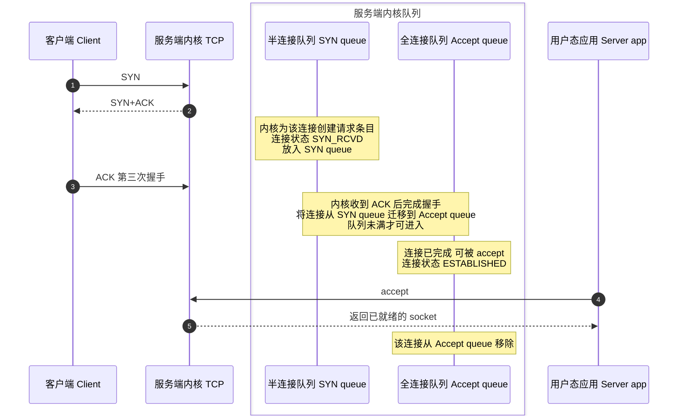
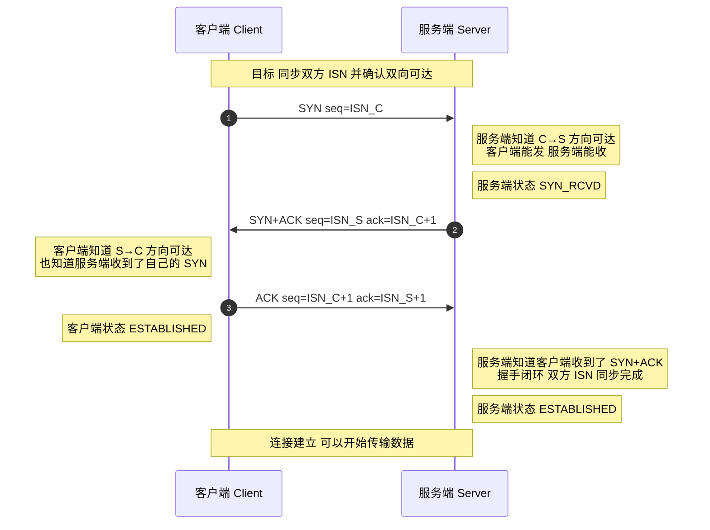
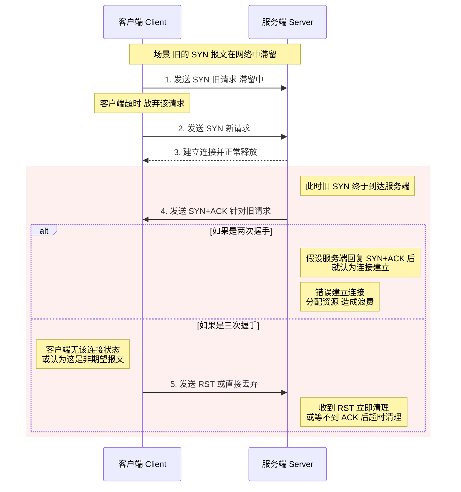
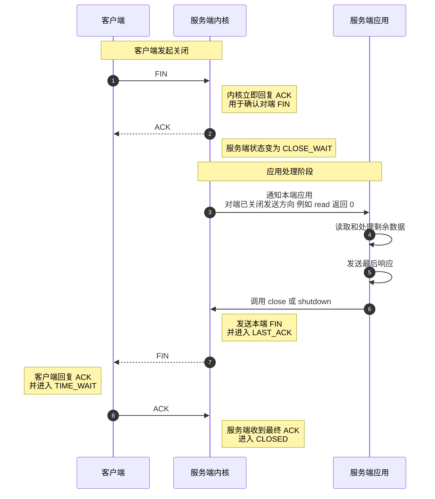
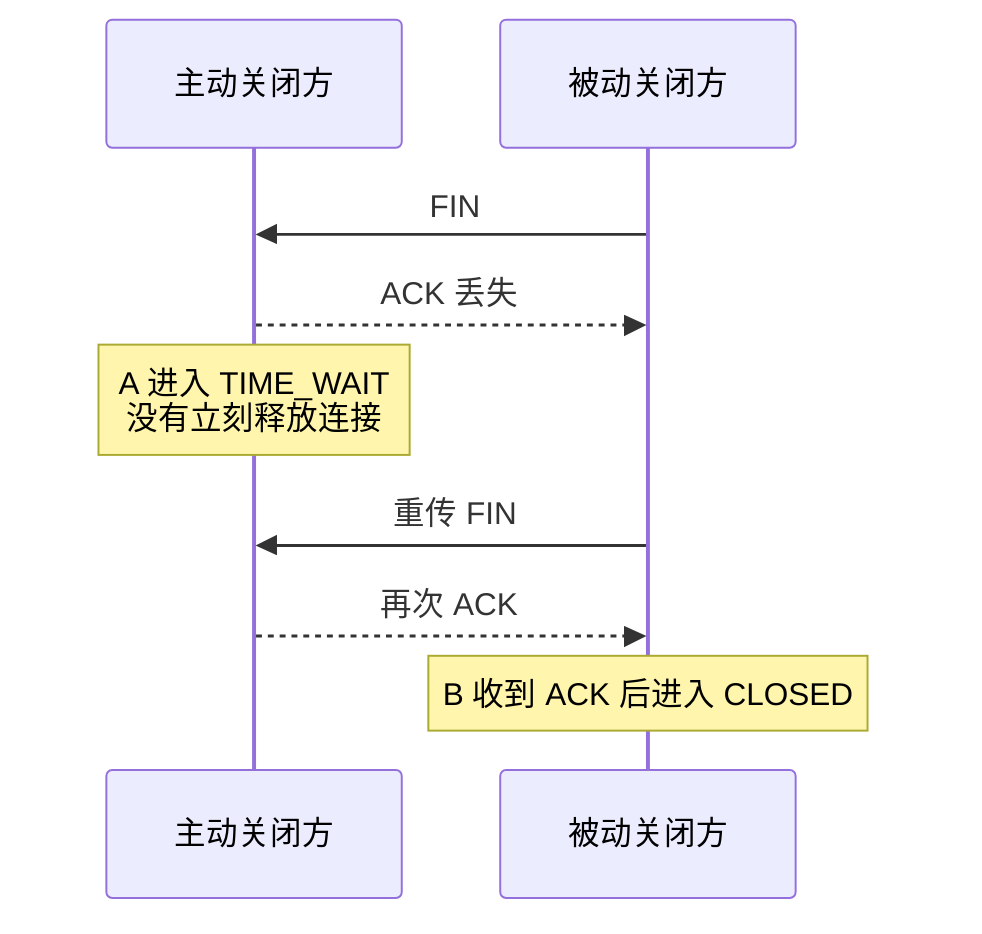

TCP（Transmission Control Protocol）是一种**面向连接**、**可靠**的传输层协议。这里的“可靠”，通常体现在按序交付、差错检测、丢包重传、流量控制和拥塞控制等方面。

TCP 连接的建立和释放，最常被问到的就是三次握手和四次挥手。它们看起来像固定流程，背后其实是在同步序列号、确认双方收发能力，并尽量安全地释放连接状态。

这篇文章主要回答几个问题：

1. TCP 三次握手每一步分别做了什么？
2. 为什么建立连接需要三次握手，而不是两次或四次？
3. TCP 四次挥手每一步分别做了什么？
4. `TIME_WAIT`、`CLOSE_WAIT`、半连接队列和全连接队列分别该怎么理解？

> **术语约定**：本文正文统一使用 `SYN_RCVD`、`TIME_WAIT` 这类下划线写法；RFC 中常写作 `SYN-RECEIVED`、`TIME-WAIT`，Linux `ss` 命令中常显示为 `syn-recv`、`time-wait`。它们指向的是同一类 TCP 状态，只是不同语境下的写法不同。

## 建立连接：TCP 三次握手

在最常见的“一端主动发起连接、一端被动监听”的场景下，TCP 连接通常通过三次握手建立：

1. **第一次握手（SYN）**：客户端向服务端发送一个 SYN（Synchronize Sequence Numbers）报文段，其中包含客户端生成的初始序列号（Initial Sequence Number，ISN），例如 `seq=x`。发送后，客户端进入 `SYN_SENT` 状态，等待服务端确认。
2. **第二次握手（SYN+ACK）**：服务端收到 SYN 后，如果同意建立连接，会回复一个 SYN+ACK 报文段。这个报文段包含两个关键信息：
   - **SYN**：服务端也需要同步自己的初始序列号，因此会携带服务端生成的 ISN，例如 `seq=y`。
   - **ACK**：用于确认收到客户端的 SYN，确认号设置为客户端初始序列号加一，即 `ack=x+1`。
   - 发送该报文段后，服务端进入 `SYN_RCVD` 状态。
3. **第三次握手（ACK）**：客户端收到服务端的 SYN+ACK 后，会向服务端发送最终确认报文段，确认号为 `ack=y+1`。发送后，客户端进入 `ESTABLISHED` 状态。服务端收到这个 ACK 后，也进入 `ESTABLISHED` 状态。

至此，双方完成初始序列号同步，并确认这条连接可以开始双向传输数据。

### 什么是半连接队列和全连接队列？

```mermaid
sequenceDiagram
  autonumber
  participant C as 客户端 Client
  participant K as 服务端内核 TCP
  box 服务端内核队列
    participant SQ as 半连接队列 SYN queue
    participant AQ as 全连接队列 Accept queue
  end
  participant App as 用户态应用 Server app

  C->>K: SYN
  K-->>C: SYN+ACK
  Note over SQ: 内核为该连接创建请求条目<br/>连接状态 SYN_RCVD<br/>放入 SYN queue

  C->>K: ACK 第三次握手
  Note over SQ,AQ: 内核收到 ACK 后完成握手<br/>将连接从 SYN queue 迁移到 Accept queue<br/>队列未满才可进入
  Note over AQ: 连接已完成 可被 accept<br/>连接状态 ESTABLISHED

  App->>K: accept
  K-->>App: 返回已就绪的 socket
  Note over AQ: 该连接从 Accept queue 移除
```

在 TCP 三次握手过程中，服务端内核通常会用两个队列来管理连接请求。下面以常见 Linux 行为为例，不同操作系统、内核版本、socket 选项和部署环境可能会有细节差异。

1. **半连接队列（SYN Queue）**：
   - 保存“握手未完成”的请求。服务端收到 SYN 并回复 SYN+ACK 后，连接进入 `SYN_RCVD`，等待客户端最终 ACK。
   - 如果一直收不到 ACK，内核会按重传策略重发 SYN+ACK，最终超时清理。
   - 常见相关参数包括 `net.ipv4.tcp_max_syn_backlog`。在 SYN Flood 场景下，还会涉及 `net.ipv4.tcp_syncookies`。
2. **全连接队列（Accept Queue）**：

   - 保存“握手已完成但应用还没有 accept”的连接。服务端收到最终 ACK 后，连接变为 `ESTABLISHED`，并进入全连接队列，等待应用层 `accept()` 取走。
   - 队列容量受 `listen(fd, backlog)` 和系统上限 `net.core.somaxconn` 共同影响。实践中常见有效上限可以近似理解为 `min(backlog, somaxconn)`，具体行为仍要看内核版本和应用配置。

   总结一下：

| 队列                       | 作用                                   | 状态          | 移出条件                 |
| -------------------------- | -------------------------------------- | ------------- | ------------------------ |
| 半连接队列（SYN Queue）    | 保存未完成握手的连接                   | `SYN_RCVD`    | 收到 ACK / 超时重传失败  |
| 全连接队列（Accept Queue） | 保存已完成握手、等待应用 accept 的连接 | `ESTABLISHED` | 被应用层 `accept()` 取出 |

当全连接队列满时，`net.ipv4.tcp_abort_on_overflow` 会影响处理策略：

- `0`（默认）：Linux 通常不会立即返回 RST，而可能丢弃第三次握手 ACK，使服务端继续停留在握手未完全完成的状态，并重传 SYN+ACK。客户端侧可能已经认为 `connect()` 成功，但首包发送后迟迟没有响应，最终表现为首包阻塞、读超时或重试。
- `1`：直接对客户端回复 `RST`，让连接快速失败。

排查时可以用 `ss -ltn` 看监听 socket。对于 `LISTEN` 状态，`Recv-Q` 通常表示当前 backlog 中等待应用 accept 的连接数，`Send-Q` 表示 socket backlog 上限。如果 `Recv-Q` 长时间接近 `Send-Q`，就要重点怀疑应用 accept 不及时、backlog 偏小、线程池卡住、GC 抖动或者短时间连接突刺。

当半连接队列满时，如果 `tcp_syncookies=1`，Linux 会在 SYN backlog 溢出时启用 SYN Cookie：服务端把必要信息编码进返回的 SYN+ACK 中，而不是为每个请求都保留完整的半连接状态。只有收到合法的最终 ACK 后，内核才会重建连接所需的信息。

但 SYN Cookie 是防护手段，不是扩容手段。它能缓解 SYN Flood 对半连接队列的冲击，但仍会消耗 CPU；如果攻击流量已经打满带宽，SYN Cookie 也无法从根本上恢复可用性。另外，SYN Cookie 模式下部分 TCP 扩展能力可能受限，在高延迟、高带宽链路下可能出现性能退化。`tcp_syncookies=2` 更偏测试用途，不建议作为生产环境默认配置。

### 为什么要三次握手？

TCP 三次握手主要做两件事：**同步双方的初始序列号**，并且**确认双方的收发路径是可用的**。真正的数据可靠交付，还要依赖后续传输过程中的确认、重传、窗口控制和拥塞控制。

#### 1. 确认双方收发能力，并同步初始序列号

```mermaid
sequenceDiagram
  autonumber
  participant C as 客户端 Client
  participant S as 服务端 Server

  Note over C,S: 目标 同步双方 ISN 并确认双向可达

  C->>S: SYN seq=ISN_C
  Note right of S: 服务端知道 C→S 方向可达<br/>客户端能发 服务端能收
  Note right of S: 服务端状态 SYN_RCVD

  S->>C: SYN+ACK seq=ISN_S ack=ISN_C+1
  Note left of C: 客户端知道 S→C 方向可达<br/>也知道服务端收到了自己的 SYN

  C->>S: ACK seq=ISN_C+1 ack=ISN_S+1
  Note left of C: 客户端状态 ESTABLISHED
  Note right of S: 服务端知道客户端收到了 SYN+ACK<br/>握手闭环 双方 ISN 同步完成
  Note right of S: 服务端状态 ESTABLISHED

  Note over C,S: 连接建立 可以开始传输数据
```

TCP 依赖序列号（SEQ）和确认号（ACK）来保证数据有序、去重和重传。三次握手通过交换并确认双方的 ISN，让两端对“从哪个序号开始收发数据”达成一致，同时避免只凭单向信息就进入已建立状态。

可以用下面这张表来记：

| 步骤 | 报文         | 能确认什么                                                             |
| ---- | ------------ | ---------------------------------------------------------------------- |
| 1    | C→S：SYN     | 服务端知道：客户端能发，服务端能收，C→S 方向可达                       |
| 2    | S→C：SYN+ACK | 客户端知道：服务端能发，客户端能收；同时确认服务端收到了自己的 SYN     |
| 3    | C→S：ACK     | 服务端知道：客户端收到了 SYN+ACK，S→C 方向也被服务端确认；至此握手闭环 |

注意，第 2 步之后只是客户端确认了双向可达，服务端还不知道客户端是否收到了 SYN+ACK。服务端只有收到第 3 次握手的 ACK 后，才真正确认这个闭环。

#### 2. 防止已失效的连接请求被错误建立

```mermaid
sequenceDiagram
    participant C as 客户端 Client
    participant S as 服务端 Server

    Note over C,S: 场景 旧的 SYN 报文在网络中滞留

    C->>S: 1. 发送 SYN 旧请求 滞留中
    Note over C: 客户端超时 放弃该请求

    C->>S: 2. 发送 SYN 新请求
    S-->>C: 3. 建立连接并正常释放

    rect rgb(255, 240, 240)
        Note right of S: 此时旧 SYN 终于到达服务端
        S->>C: 4. 发送 SYN+ACK 针对旧请求

        alt 如果是两次握手
            Note right of S: 假设服务端回复 SYN+ACK 后<br/>就认为连接建立
            Note right of S: 错误建立连接<br/>分配资源 造成浪费
        else 如果是三次握手
            Note left of C: 客户端无该连接状态<br/>或认为这是非期望报文
            C->>S: 5. 发送 RST 或直接丢弃
            Note right of S: 收到 RST 立即清理<br/>或等不到 ACK 后超时清理
        end
    end
```

设想一个场景：客户端发送的第一个连接请求 SYN1 因网络延迟而滞留。客户端超时后，重新发送 SYN2，并成功建立连接，数据传输完毕后连接也释放了。此时，延迟的 SYN1 才到达服务端。

- **如果是两次握手**：服务端收到这个失效的 SYN1 后，可能误认为这是一个新的连接请求，并立即分配资源、建立连接。但客户端已经没有这个连接意图，不会继续配合传输，服务端就会单方面维持一个无效连接。
- **有了第三次握手**：服务端收到失效的 SYN1 并回复 SYN+ACK 后，还要等待客户端最终 ACK。由于客户端当前没有这个连接状态，它可能直接丢弃，也可能发送 RST。服务端收不到合法 ACK，最终就会清理这个错误连接。

所以，三次握手不是“多发一次包而已”，它让连接建立过程形成闭环，避免网络中的延迟、重复历史请求干扰新的连接。

### 第 2 次握手已经传回 ACK，为什么还要传回 SYN？

第二次握手里的 ACK 是为了确认“服务端收到了客户端的 SYN”，也就是确认 C→S 方向的请求已经到达。

同时携带 SYN，是因为服务端也需要把自己的 ISN 同步给客户端，并要求客户端确认。只有双方的 ISN 都完成同步，后续可靠传输才有共同的序列号起点。

简言之：ACK 表示“我收到了你的 SYN”，SYN 表示“我也要同步我的初始序列号，请你确认”。

> SYN（Synchronize Sequence Numbers）是 TCP 建立连接时使用的同步信号。客户端先发送 SYN，服务端使用 SYN+ACK 应答，最后客户端再用 ACK 确认。这样双方才能完成初始序列号同步，建立一条可用于可靠数据传输的 TCP 连接。

### 三次握手过程中可以携带数据吗？

普通 TCP 中，第三次握手的 ACK 可以携带数据。RFC 9293 也允许连接同步阶段出现携带数据的报文，但接收端在确认数据有效前，不能把这部分数据交付给应用；通常需要等连接进入 `ESTABLISHED` 后，应用层才能读到这些数据。

如果第三次握手的 ACK 丢失，但客户端随后发送了一个携带数据且带 ACK 标志的报文，服务端收到后可以把它视为有效的第三次握手确认。连接被认为建立后，服务端再继续处理该数据。

需要注意，这和 TCP Fast Open（TFO）不是一回事。TFO 讨论的是第一次 SYN 就携带应用数据，需要客户端、服务端和系统配置共同支持，不是普通 TCP 默认行为。

## 断开连接：TCP 四次挥手

TCP 是全双工通信，两端的发送方向彼此独立。关闭连接时，通常需要两个方向分别完成“我不发了”和“我确认你不发了”的过程，所以逻辑上常被讲成“四次挥手”。

不过要注意：四次挥手说的是逻辑动作，不一定意味着抓包时总能看到 4 个独立报文段。在某些场景下，ACK 和 FIN 可以合并在同一个报文段里。

典型流程如下：

1. **第一次挥手（FIN）**：客户端，或者任意一方，决定关闭自己的发送方向时，会发送一个 FIN 报文段，表示自己已经没有数据要发送了。该报文段包含一个序列号，例如 `seq=u`。发送后，主动关闭方进入 `FIN_WAIT_1` 状态。
2. **第二次挥手（ACK）**：服务端收到 FIN 后，会回复 ACK，确认号为 `ack=u+1`。发送后，服务端进入 `CLOSE_WAIT` 状态。客户端收到 ACK 后，进入 `FIN_WAIT_2` 状态。此时连接处于**半关闭（Half-Close）**状态：客户端到服务端的发送方向已关闭，但服务端仍然可以继续向客户端发送剩余数据。
3. **第三次挥手（FIN）**：当服务端确认剩余数据都发送完毕后，也会发送 FIN，表示自己也准备关闭发送方向。该报文段同样包含一个序列号，例如 `seq=y`。发送后，服务端进入 `LAST_ACK` 状态，等待客户端最终确认。
4. **第四次挥手（ACK）**：客户端收到服务端的 FIN 后，回复最终 ACK，确认号为 `ack=y+1`。发送后，客户端进入 `TIME_WAIT` 状态。服务端收到这个 ACK 后进入 `CLOSED`。客户端则在 `TIME_WAIT` 状态等待 2MSL 后，最终进入 `CLOSED`。

> 注意区分：**半关闭（Half-Close）**指一个方向已经发送 FIN，另一个方向仍可继续发送数据；**半开连接（Half-Open Connection）**通常指一端崩溃、重启或状态丢失后，另一端仍以为连接存在。两者不是同一个概念。

TCP 连接建立与关闭的常见状态迁移路径如下。图中省略了同时打开、同时关闭、RST、CLOSING 等少见或异常分支。

### 为什么要四次挥手？

因为 TCP 是全双工的。A 不想发了，不代表 B 也立刻没有数据要发。

举个例子，A 和 B 打电话，通话即将结束：

1. A 说：“我没什么要说的了。”（A 发 FIN）
2. B 回答：“我知道了。”但 B 可能还有话要说。（B 回 ACK）
3. B 继续说完剩下的话，最后说：“我也说完了。”（B 发 FIN）
4. A 回答：“知道了。”（A 回 ACK）

这对应到 TCP 中，就是两个方向分别关闭、分别确认。

### 为什么不能把服务端发送的 ACK 和 FIN 合并起来，变成三次挥手？

```mermaid
sequenceDiagram
  autonumber
  participant C as 客户端
  participant K as 服务端内核
  participant A as 服务端应用

  Note over C,K: 客户端发起关闭
  C->>K: FIN
  Note right of K: 内核立即回复 ACK<br/>用于确认对端 FIN
  K-->>C: ACK
  Note right of K: 服务端状态变为 CLOSE_WAIT

  Note over K,A: 应用处理阶段
  K->>A: 通知本端应用<br/>对端已关闭发送方向 例如 read 返回 0
  A->>A: 读取和处理剩余数据
  A->>A: 发送最后响应
  A->>K: 调用 close 或 shutdown

  Note right of K: 发送本端 FIN<br/>并进入 LAST_ACK
  K-->>C: FIN
  Note left of C: 客户端回复 ACK<br/>并进入 TIME_WAIT
  C->>K: ACK
  Note right of K: 服务端收到最终 ACK<br/>进入 CLOSED
```

关键原因是：**回复 ACK** 和 **发送 FIN** 的触发时机通常不同。

- 当服务端收到客户端 FIN 时，内核协议栈会立即回复 ACK，确认“我收到了你要关闭发送方向的请求”。此时服务端进入 `CLOSE_WAIT`，等待本端应用处理剩余数据。
- 只有当服务端应用处理完毕，并调用 `close()` 或 `shutdown()` 后，内核才会发送本端 FIN。
- 因此，“内核自动回 ACK”和“应用决定发 FIN”在时间上是解耦的，通常无法合并。只有在服务端恰好也准备立即关闭时，才可能出现 FIN+ACK 合并在一个报文段中的情况。

### 如果第二次挥手时服务端的 ACK 没有送达客户端，会怎样？

客户端发送第一次 FIN 后进入 `FIN_WAIT_1`，并启动重传计时器。如果在超时时间内没有收到对端对 FIN 的确认 ACK，客户端会重传 FIN。

服务端如果收到重复 FIN，通常会再次发送 ACK。如果由于网络问题 ACK 一直无法送达，客户端在达到一定重试或超时阈值后，可能报错或放弃。具体行为受实现和参数影响，例如 Linux 中的 `tcp_retries2` 等。

### 为什么第四次挥手后要等待 2MSL？

第四次挥手时，主动关闭方发送给被动关闭方的最后一个 ACK 可能丢失。如果被动关闭方没有收到 ACK，就会重传 FIN。主动关闭方还在 `TIME_WAIT` 里，就能再次回复 ACK。

如果主动关闭方发完最后一个 ACK 后立刻进入 `CLOSED`，当对端重传 FIN 到达时，本端可能已经没有对应连接状态，只能回复 RST，导致对端看到异常关闭或连接被重置。

```mermaid
sequenceDiagram
  participant A as 主动关闭方
  participant B as 被动关闭方

  B->>A: FIN
  A-->>B: ACK 丢失
  Note over A: A 进入 TIME_WAIT<br/>没有立刻释放连接
  B->>A: 重传 FIN
  A-->>B: 再次 ACK
  Note over B: B 收到 ACK 后进入 CLOSED
```

**MSL（Maximum Segment Lifetime）** 是报文段在网络中的最大生存时间。2MSL 不是一次请求-响应的最大 RTT，而是一个保守等待窗口：既给最后 ACK 丢失后的 FIN 重传留出处理机会，也尽量保证旧连接中的延迟报文从网络中消失。

需要注意，RFC 里的 MSL 是协议层概念，具体系统实现可能不同。Linux 常见实现中，`TIME_WAIT` 保留时间通常是 60 秒。还有一个常见误区：`tcp_fin_timeout` 控制的是 orphaned connection 的 `FIN_WAIT_2` 超时，不是 `TIME_WAIT`。想缓解 `TIME_WAIT` 带来的端口压力，优先看连接复用、端口范围、主动关闭方和 `tcp_tw_reuse` 条件，而不是试图用 `tcp_fin_timeout` 缩短 `TIME_WAIT`。

## TIME_WAIT 常见问题：为什么要等、会不会出问题、能不能复用？

这部分内容已单独成文，详见 [TCP TIME_WAIT 详解：为什么要等、会不会出问题、能不能复用？](./tcp-time-wait.md)。

## 参考

- 《计算机网络（第 7 版）》
- 《图解 HTTP》
- TCP and UDP Tutorial：<https://www.9tut.com/tcp-and-udp-tutorial>
- 从一次线上问题说起，详解 TCP 半连接队列、全连接队列：<https://mp.weixin.qq.com/s/YpSlU1yaowTs-pF6R43hMw>
- RFC 9293: Transmission Control Protocol (TCP)：<https://www.rfc-editor.org/rfc/rfc9293>
- RFC 1337: TIME-WAIT Assassination Hazards in TCP：<https://www.rfc-editor.org/rfc/rfc1337>
- Linux 内核 ip-sysctl 文档：<https://www.kernel.org/doc/Documentation/networking/ip-sysctl.txt>
- SoByte - 为什么 TCP 需要 TIME_WAIT 状态：<https://www.sobyte.net/post/2022-10/tcp-time-wait/>

<!-- @include: @article-footer.snippet.md -->
