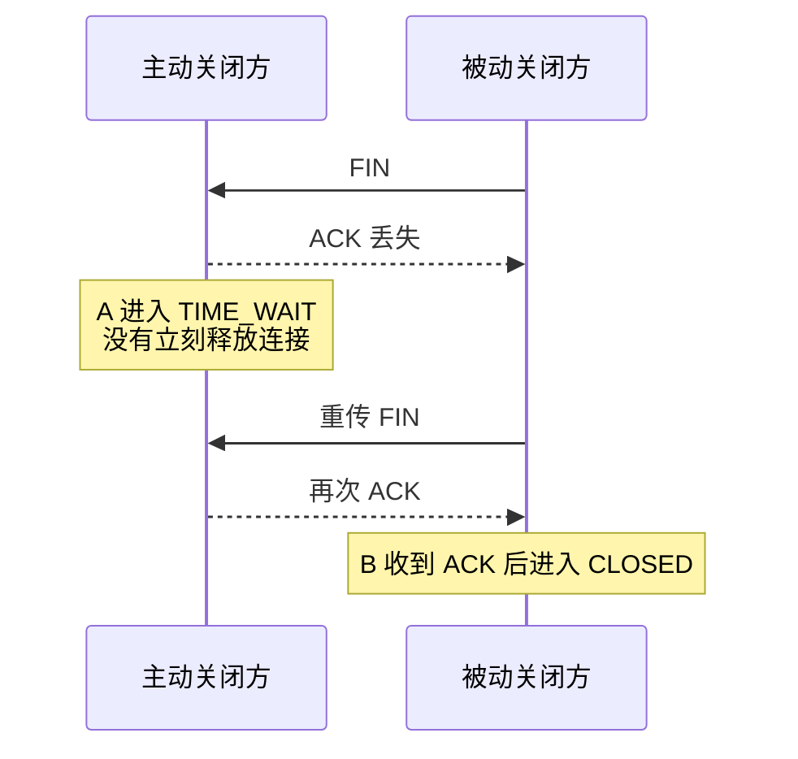

TCP 四次挥手的最后一步，主动关闭方发完 ACK 后不是立刻关闭，而是进入 `TIME_WAIT` 状态，默认要等上 60 秒。

这 60 秒经常被误解：有人觉得是浪费资源，有人想着用内核参数强行关掉，有人把 `CLOSE_WAIT` 和 `TIME_WAIT` 混着排查。

这篇文章回答线上最常见的几个问题：

1. `TIME_WAIT` 到底在等什么？
2. `TIME_WAIT` 大量堆积会不会真的出问题？
3. `tcp_tw_reuse` 能不能随便开？
4. `TIME_WAIT` 和 `CLOSE_WAIT` 怎么区分？

## TIME_WAIT 不只是“等一会儿再关”

ACK 都已经发出去了，为什么还要占着端口等几十秒？

主动关闭方发出最后一个 ACK 后，不会立刻释放连接，而是进入 `TIME_WAIT`。RFC 9293 的连接状态图里也能看到，`TIME_WAIT` 会在 2MSL 超时后删除 TCB，并进入 `CLOSED`。

这里要注意一个细节：不是“谁收到 FIN 谁就一定进入 TIME_WAIT”。被动关闭方收到 FIN 后，通常会先进入 `CLOSE_WAIT`，等待本端应用处理完剩余数据并调用 `close()` 或 `shutdown()`。更常见的情况是，主动关闭方收到对端最后的 FIN，并回复最后一个 ACK 后，进入 `TIME_WAIT`。

**谁主动关闭连接，谁就更容易进入 TIME_WAIT。** 比如客户端主动断开 HTTP 短连接，`TIME_WAIT` 往往出现在客户端；如果服务端主动断开连接，服务端也可能堆出大量 `TIME_WAIT`。

看起来像是多等了一会儿，实际上是在解决两个问题。

## 第一个原因：让最后一个 ACK 有补救机会

主动关闭方发送最后一个 ACK 后，如果这个 ACK 在网络中丢了，被动关闭方会以为自己的 FIN 没被确认，于是重发 FIN。主动关闭方还在 `TIME_WAIT` 里，就能再次回复 ACK；如果它已经进入 `CLOSED`，就可能回 RST，让对端感知为异常关闭或连接被重置。



**MSL（Maximum Segment Lifetime）** 是报文段在网络中的最大生存时间。2MSL 不是一次请求-响应的最大 RTT，而是一个保守等待窗口：既给最后 ACK 丢失后的 FIN 重传留出处理机会，也尽量保证旧连接中的延迟报文从网络中消失。

需要注意，RFC 里的 MSL 是协议层概念，具体系统实现可能不同。Linux 常见实现中，`TIME_WAIT` 保留时间通常是 60 秒。还有一个常见误区：`tcp_fin_timeout` 控制的是 orphaned connection 的 `FIN_WAIT_2` 超时，不是 `TIME_WAIT`。想缓解 `TIME_WAIT` 带来的端口压力，优先看连接复用、端口范围、主动关闭方和 `tcp_tw_reuse` 条件，而不是试图用 `tcp_fin_timeout` 缩短 `TIME_WAIT`。

## 第二个原因：别让旧连接的包混进新连接

TCP 连接靠四元组定位：源 IP、源端口、目的 IP、目的端口。如果旧连接刚关闭，立刻用同一个四元组建立新连接，旧连接里延迟到达的数据包可能刚好落在新连接接收窗口里，被当成新连接的数据处理。

举个例子：

```text
旧连接：client:50000 -> server:443
服务端发出的 SEQ=301 数据包在网络里绕了一圈，迟迟没到。

旧连接关闭后，客户端很快复用了同一个源端口：
新连接：client:50000 -> server:443

这时旧的 SEQ=301 抵达客户端。
如果它刚好落在新连接接收窗口里，就有可能被误收。
```

TCP 序列号空间是 0 到 2^32 - 1，会按模 2^32 回绕，所以不能只靠序列号永久区分新老报文。实际系统还有时间戳、PAWS（Protection Against Wrapped Sequences）、随机 ISN 等保护，但它们不是“完全替代 TIME_WAIT”的万能方案。RFC 1337 也讨论过旧重复报文导致的 TIME_WAIT 风险。

## 大量 TIME_WAIT 到底有没有问题？

`TIME_WAIT` 本身是正常状态。真正的问题通常出现在主动关闭方短时间内创建大量到同一个目标 IP + 目标端口的连接，导致本地临时端口被占住。

Linux 本地临时端口范围可通过 `net.ipv4.ip_local_port_range` 查看和调整。上游内核文档里的默认范围是 `32768 60999`，实际环境以本机输出为准：

```bash
cat /proc/sys/net/ipv4/ip_local_port_range
```

如果客户端短时间内反复连接同一个目标 IP + 目标端口，旧连接又都停在 `TIME_WAIT`，本地可用临时端口可能被占满，导致新连接无法分配源端口，常见报错如：

```text
Cannot assign requested address
```

可以按这个思路判断：

- **如果服务端上看到很多 TIME_WAIT**：先看是不是服务端主动关闭了连接，比如服务端主动断开短连接、网关主动关闭上游连接、连接池主动淘汰连接。
- **如果客户端或网关上看到很多 TIME_WAIT**：重点看是否存在短连接风暴、连接池未复用、HTTP keep-alive 没打开、上游频繁断连。

还可以做一个粗略估算：

```text
同一目标 IP:Port 的短连接上限 ≈ 可用临时端口数 / TIME_WAIT 保留时间
```

比如默认端口范围 `32768~60999`，大约 2.8 万个端口。如果 `TIME_WAIT` 保留约 60 秒，那么同一目标 IP:Port 上持续新建短连接的上限大约是数百 QPS 量级。实际结果还会受到连接复用、端口保留、NAT、内核策略和不同远端四元组复用规则影响，不能只看 `TIME_WAIT` 总数就下结论。

## 为什么不建议随便开 tcp_tw_reuse？

`tcp_tw_reuse` 允许在协议认为安全的条件下，为新的主动连接复用 `TIME_WAIT` socket。它看起来像是缓解端口压力的捷径，但这类参数改变的是 TCP 对旧连接报文的等待策略，不能当成通用开关。

这里要分三层看：

1. **它依赖时间戳等条件判断“新报文是否足够新”**。时间戳可以过滤一部分旧报文，但不是所有异常都能覆盖。RFC 1337 重点讨论过 `TIME_WAIT` 状态被旧 RST 等报文提前终止的风险。旧数据段如果落入新连接可接受窗口，可能造成新旧数据混淆；旧 ACK 的影响则依赖序列号、窗口和实现细节，不宜和旧 RST 直接并列成同一种断连风险。
2. **当前上游 Linux 文档中，`tcp_tw_reuse` 可取 0/1/2，默认值为 2**，表示仅允许 loopback 流量复用；`1` 才是全局开启。但旧版内核文档、发行版 man page 或历史资料可能仍写作“默认关闭”，实际机器必须以 `sysctl net.ipv4.tcp_tw_reuse` 为准。内核文档也明确提示，不要在没有专家建议或明确需求时修改。
3. **不要把 `tcp_tw_reuse` 和已经废弃的 `tcp_tw_recycle` 搞混**。`tcp_tw_recycle` 在 NAT 环境下会导致时间戳冲突，大量连接被异常丢弃，Linux 4.12 之后已经被移除。网上很多老文章仍然会建议同时打开 `tcp_tw_reuse` 和 `tcp_tw_recycle`，这类配置不要照搬。

一句话：`tcp_tw_reuse` 可以讨论，但必须结合 Linux 版本、是否 loopback、是否经过 NAT、是否启用时间戳、是否真的存在端口耗尽来判断。能在应用层解决的，优先在应用层解决。

## TIME_WAIT 和 CLOSE_WAIT：一个正常等待，一个更像应用没收尾

排查连接状态时，`CLOSE_WAIT` 通常比 `TIME_WAIT` 更值得警惕。

收到对端 FIN 后，本端内核会回 ACK，然后进入 `CLOSE_WAIT`，等待应用处理完剩余数据并调用 `close()` 或 `shutdown()`。在 Java 服务里，`CLOSE_WAIT` 堆积经常和连接没有正确关闭有关。比如手写 Socket、HTTP 客户端响应体没有 close、异常分支提前 return、连接池连接没有归还，都可能让内核已经 ACK 了对端 FIN，但应用迟迟不调用 close。

可以先按这个思路判断：

- **TIME_WAIT**：主动关闭方在等 2MSL，通常是协议设计的一部分。
- **CLOSE_WAIT**：被动关闭方已经知道对端不发了，但本端应用还没关闭 socket。大量堆积时，优先怀疑应用代码没释放连接、线程卡住、连接池归还异常、读写流程没有走到 finally。

| 状态       | 常见出现方 | 含义                                | 排查方向                                          |
| ---------- | ---------- | ----------------------------------- | ------------------------------------------------- |
| TIME_WAIT  | 主动关闭方 | 等最后 ACK 重传机会，也等旧报文消失 | 短连接、连接池、keep-alive、端口范围              |
| CLOSE_WAIT | 被动关闭方 | 对端已关闭，本端应用还没 close      | 代码是否释放 socket、线程是否卡住、连接池是否泄漏 |

## 排查时别只盯着数量，要先看谁在主动关闭


看到大量 `TIME_WAIT` 或 `CLOSE_WAIT`，可以先用下面几条命令定位方向：

`ss` 是 Linux 上 `iproute2` 提供的命令，macOS 默认没有。如果你的开发环境是 macOS，可以用 `netstat` 和 `lsof` 替代。

```bash
# Linux：查看各 TCP 状态数量
ss -ant | awk 'NR>1 {cnt[$1]++} END {for (s in cnt) print s, cnt[s]}'

# macOS：查看各 TCP 状态数量
netstat -anp tcp | awk '$1 ~ /^tcp/ {cnt[$NF]++} END {for (s in cnt) print s, cnt[s]}'

# Linux：查看 TIME-WAIT 主要集中在哪些目标
ss -ant state time-wait | awk 'NR>1 {print $5}' | sort | uniq -c | sort -nr | head

# macOS：查看 TIME-WAIT 主要集中在哪些远端
netstat -anp tcp | awk '$1 ~ /^tcp/ && $NF=="TIME_WAIT" {print $(NF-1)}' | sort | uniq -c | sort -nr | head

# Linux：查看 CLOSE-WAIT 对应哪个进程（需要 sudo 才能看到进程信息）
sudo ss -tanp state close-wait

# macOS：查看 CLOSE-WAIT 对应哪个进程
sudo lsof -nP -iTCP -sTCP:CLOSE_WAIT

# Linux：查看监听 socket 的 accept queue 情况
ss -ltn
```


命令背后的判断：

- **TIME_WAIT 集中在某个远端服务**：检查是否短连接太多、HTTP 连接复用没生效、连接池配置过小、连接池被频繁销毁，或者对端频繁主动断开。
- **CLOSE_WAIT 集中在某个本地进程**：优先查应用代码，尤其是异常分支有没有关闭响应体、socket 或连接对象。
- **LISTEN socket 的 Recv-Q 长时间接近 Send-Q**：重点排查 accept queue 堆积，看看应用 accept 是否及时、线程池是否卡住、backlog 配置是否过小。
- 如果是网关、代理、爬虫、压测客户端，`TIME_WAIT` 更常见；如果是 Java 服务端内部依赖调用泄漏，`CLOSE_WAIT` 更常见。

## 克制的优化建议

按优先级排查：

1. **优先减少不必要的短连接**：开启 HTTP keep-alive，复用连接池。
2. **确认谁在主动关闭连接**：服务端、客户端、网关、连接池都有可能成为主动关闭方。
3. **检查应用侧资源释放**：尤其是 HTTP 响应体、Socket、数据库连接、连接池连接归还。
4. **扩大本地端口范围**：在客户端短连接确实很高、且存在端口耗尽证据时，再考虑调整 `ip_local_port_range`。
5. **最后才看内核参数**：`tcp_tw_reuse`、`tcp_abort_on_overflow`、`tcp_syncookies` 都要结合 Linux 版本、业务连接模型、是否经过 NAT、是否被攻击、是否有真实观测数据来判断，不建议直接照抄网上配置。

`TIME_WAIT` 多，不一定是故障；`CLOSE_WAIT` 多，通常要先看代码。这两个状态看起来都像“连接没关干净”，但问题方向完全不同。

## 参考

- RFC 9293: Transmission Control Protocol（TCP）：<https://www.rfc-editor.org/rfc/rfc9293>
- RFC 1337: TIME-WAIT Assassination Hazards in TCP：<https://www.rfc-editor.org/rfc/rfc1337>
- Linux 内核 ip-sysctl 文档：<https://www.kernel.org/doc/Documentation/networking/ip-sysctl.txt>
- SoByte - 为什么 TCP 需要 TIME_WAIT 状态：<https://www.sobyte.net/post/2022-10/tcp-time-wait/>

<!-- @include: @article-footer.snippet.md -->
