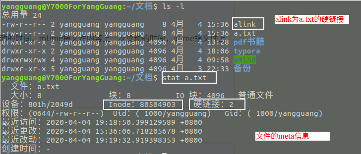
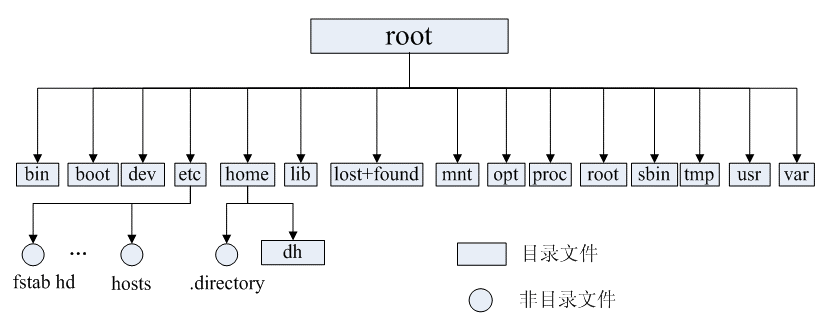
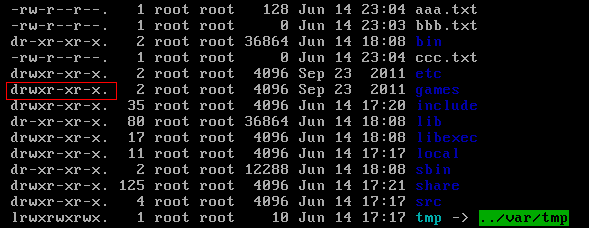
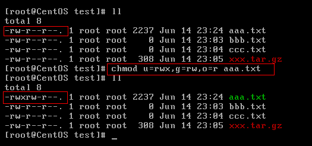

<!-- @include: @small-advertisement.snippet.md -->

简单介绍一下 Java 程序员必知的 Linux 的一些概念以及常见命令。

## 初探 Linux

### Linux 简介

通过以下三点可以概括 Linux 到底是什么：

- **类 Unix 系统**：Linux 是一种自由、开放源码的类似 Unix 的操作系统
- **Linux 本质是指 Linux 内核**：严格来讲，Linux 这个词本身只表示 Linux 内核，单独的 Linux 内核并不能成为一个可以正常工作的操作系统。所以，就有了各种 Linux 发行版。
- **Linux 之父(林纳斯·本纳第克特·托瓦兹 Linus Benedict Torvalds)**：一个编程领域的传奇式人物，真大佬！我辈崇拜敬仰之楷模。他是 **Linux 内核** 的最早作者，随后发起了这个开源项目，担任 Linux 内核的首要架构师。他还发起了 Git 这个开源项目，并为主要的开发者。


### Linux 诞生

1989 年，Linus Torvalds 进入芬兰陆军新地区旅，服 11 个月的国家义务兵役，军衔为少尉，主要服务于计算机部门，任务是弹道计算。服役期间，购买了安德鲁·斯图尔特·塔能鲍姆所著的教科书及 minix 源代码，开始研究操作系统。1990 年，他退伍后回到大学，开始接触 Unix。

> **Minix** 是一个迷你版本的类 Unix 操作系统，由塔能鲍姆教授为了教学之用而创作，采用微核心设计。它启发了 Linux 内核的创作。

1991 年，Linus Torvalds 开源了 Linux 内核。Linux 以一只可爱的企鹅作为标志，象征着敢作敢为、热爱生活。


### 常见的 Linux 发行版本


Linus Torvalds 开源的只是 Linux 内核，我们上面也提到了操作系统内核的作用。一些组织或厂商将 Linux 内核与各种软件和文档包装起来，并提供系统安装界面和系统配置、设定与管理工具，就构成了 Linux 的发行版本。

> 内核主要负责系统的内存管理，硬件设备的管理，文件系统的管理以及应用程序的管理。

Linux 的发行版本可以大体分为两类：

- **商业公司维护的发行版本**：比如 Red Hat 公司维护支持的 Red Hat Enterprise Linux (RHEL)。
- **社区组织维护的发行版本**：比如基于 Red Hat Enterprise Linux（RHEL）的 CentOS、基于 Debian 的 Ubuntu。

对于初学者学习 Linux ，推荐选择 CentOS，原因如下：

- CentOS 免费且开放源代码；
- CentOS 基于 RHEL，功能与 RHEL 高度一致，安全稳定、性能优秀。

## Linux 文件系统

### Linux 文件系统简介

在 Linux 操作系统中，一切被操作系统管理的资源，如网络接口卡、磁盘驱动器、打印机、输入输出设备、普通文件或目录等，都被视为文件。这是 Linux 系统中一个重要的概念，即"一切都是文件"。

这种概念源自 UNIX 哲学，即将所有资源都抽象为文件的方式来进行管理和访问。Linux 的文件系统也借鉴了 UNIX 文件系统的设计理念。这种设计使得 Linux 系统可以通过统一的文件接口来管理和操作不同类型的资源，从而实现了一种统一的文件操作方式。例如，可以使用类似于读写文件的方式来对待网络接口、磁盘驱动器、设备文件等，使得操作和管理这些资源更加统一和简便。

这种文件为中心的设计理念为 Linux 系统带来了灵活性和可扩展性，使得 Linux 成为一种强大的操作系统。同时，这也是 Linux 系统的一大特点，深受广大用户和开发者的喜欢和推崇。

### inode 介绍

inode 是 Linux/Unix 文件系统的基础。那 inode 到是什么?有什么作用呢?

通过以下五点可以概括 inode 到底是什么：

1. 硬盘的最小存储单位是扇区(Sector)，块(block)由多个扇区组成。文件数据存储在块中。块的最常见的大小是 4kb，约为 8 个连续的扇区组成（每个扇区存储 512 字节）。一个文件可能会占用多个 block，但是一个块只能存放一个文件。虽然，我们将文件存储在了块(block)中，但是我们还需要一个空间来存储文件的 **元信息 metadata**：如某个文件被分成几块、每一块在的地址、文件拥有者，创建时间，权限，大小等。这种 **存储文件元信息的区域就叫 inode**，译为索引节点：**i（index）+node**。 **每个文件都有一个唯一的 inode，存储文件的元信息。**
2. inode 是一种固定大小的数据结构，其大小在文件系统创建时就确定了，并且在文件的生命周期内保持不变。
3. inode 的访问速度非常快，因为系统可以直接通过 inode 号码定位到文件的元数据信息，无需遍历整个文件系统。
4. inode 的数量是有限的，每个文件系统只能包含固定数量的 inode。这意味着当文件系统中的 inode 用完时，无法再创建新的文件或目录，即使磁盘上还有可用空间。因此，在创建文件系统时，需要根据文件和目录的预期数量来合理分配 inode 的数量。
5. 可以使用 `stat` 命令可以查看文件的 inode 信息，包括文件的 inode 号、文件类型、权限、所有者、文件大小、修改时间。

简单来说：inode 就是用来维护某个文件被分成几块、每一块在的地址、文件拥有者，创建时间，权限，大小等信息。

再总结一下 inode 和 block：

- **inode**：记录文件的属性信息，可以使用 `stat` 命令查看 inode 信息。
- **block**：实际文件的内容，如果一个文件大于一个块时候，那么将占用多个 block，但是一个块只能存放一个文件。（因为数据是由 inode 指向的，如果有两个文件的数据存放在同一个块中，就会乱套了）



可以看出，Linux/Unix 操作系统使用 inode 区分不同的文件。这样做的好处是，即使文件名被修改或删除，文件的 inode 号码不会改变，从而可以避免一些因文件重命名、移动或删除导致的错误。同时，inode 也可以提供更高的文件系统性能，因为 inode 的访问速度非常快，可以直接通过 inode 号码定位到文件的元数据信息，无需遍历整个文件系统。

不过，使用 inode 号码也使得文件系统在用户和应用程序层面更加抽象和复杂，需要通过系统命令或文件系统接口来访问和管理文件的 inode 信息。

### 硬链接和软链接

在 Linux/类 Unix 系统上，文件链接（File Link）是一种特殊的文件类型，可以在文件系统中指向另一个文件。常见的文件链接类型有两种：

**1、硬链接（Hard Link）**

- 在 Linux/类 Unix 文件系统中，每个文件和目录都有一个唯一的索引节点（inode）号，用来标识该文件或目录。硬链接通过 inode 节点号建立连接，硬链接和源文件的 inode 节点号相同，两者对文件系统来说是完全平等的（可以看作是互为硬链接，源头是同一份文件），删除其中任何一个对另外一个没有影响，可以通过给文件设置硬链接文件来防止重要文件被误删。
- 只有删除了源文件和所有对应的硬链接文件，该文件才会被真正删除。
- 硬链接具有一些限制，不能对目录以及不存在的文件创建硬链接，并且，硬链接也不能跨越文件系统。
- `ln` 命令用于创建硬链接。

**2、软链接（Symbolic Link 或 Symlink）**

- 软链接和源文件的 inode 节点号不同，而是指向一个文件路径。
- 源文件删除后，软链接依然存在，但是指向的是一个无效的文件路径。
- 软连接类似于 Windows 系统中的快捷方式。
- 不同于硬链接，可以对目录或者不存在的文件创建软链接，并且，软链接可以跨越文件系统。
- `ln -s` 命令用于创建软链接。

**硬链接为什么不能跨文件系统？**

我们之前提到过，硬链接是通过 inode 节点号建立连接的，而硬链接和源文件共享相同的 inode 节点号。

然而，每个文件系统都有自己的独立 inode 表，且每个 inode 表只维护该文件系统内的 inode。如果在不同的文件系统之间创建硬链接，可能会导致 inode 节点号冲突的问题，即目标文件的 inode 节点号已经在该文件系统中被使用。

### Linux 文件类型

Linux 支持很多文件类型，其中非常重要的文件类型有: **普通文件**，**目录文件**，**链接文件**，**设备文件**，**管道文件**，**Socket 套接字文件** 等。

- **普通文件（-）**：用于存储信息和数据， Linux 用户可以根据访问权限对普通文件进行查看、更改和删除。比如：图片、声音、PDF、text、视频、源代码等等。
- **目录文件（d，directory file）**：目录也是文件的一种，用于表示和管理系统中的文件，目录文件中包含一些文件名和子目录名。打开目录事实上就是打开目录文件。
- **符号链接文件（l，symbolic link）**：保留了指向文件的地址而不是文件本身。
- **字符设备（c，char）**：用来访问字符设备比如键盘。
- **设备文件（b，block）**：用来访问块设备比如硬盘、软盘。
- **管道文件(p，pipe)** : 一种特殊类型的文件，用于进程之间的通信。
- **套接字文件(s，socket)**：用于进程间的网络通信，也可以用于本机之间的非网络通信。

每种文件类型都有不同的用途和属性，可以通过命令如`ls`、`file`等来查看文件的类型信息。

```bash
# 普通文件（-）
-rw-r--r--  1 user  group  1024 Apr 14 10:00 file.txt

# 目录文件（d，directory file）*
drwxr-xr-x  2 user  group  4096 Apr 14 10:00 directory/

# 套接字文件(s，socket)
srwxrwxrwx  1 user  group    0 Apr 14 10:00 socket
```

### Linux 目录树

Linux 使用一种称为目录树的层次结构来组织文件和目录。目录树由根目录（/）作为起始点，向下延伸，形成一系列的目录和子目录。每个目录可以包含文件和其他子目录。结构层次鲜明，就像一棵倒立的树。


**常见目录说明：**

- **/bin：** 存放二进制可执行文件(ls、cat、mkdir 等)，常用命令一般都在这里；
- **/etc：** 存放系统管理和配置文件；
- **/home：** 存放所有用户文件的根目录，是用户主目录的基点，比如用户 user 的主目录就是/home/user，可以用~user 表示；
- **/usr：** 用于存放系统应用程序；
- **/opt：** 额外安装的可选应用程序包所放置的位置。一般情况下，我们可以把 tomcat 等都安装到这里；
- **/proc：** 虚拟文件系统目录，是系统内存的映射。可直接访问这个目录来获取系统信息；
- **/root：** 超级用户（系统管理员）的主目录（特权阶级^o^）；
- **/sbin:** 存放二进制可执行文件，只有 root 才能访问。这里存放的是系统管理员使用的系统级别的管理命令和程序。如 ifconfig 等；
- **/dev：** 用于存放设备文件；
- **/mnt：** 系统管理员安装临时文件系统的安装点，系统提供这个目录是让用户临时挂载其他的文件系统；
- **/boot：** 存放用于系统引导时使用的各种文件；
- **/lib 和/lib64：** 存放着和系统运行相关的库文件 ；
- **/tmp：** 用于存放各种临时文件，是公用的临时文件存储点；
- **/var：** 用于存放运行时需要改变数据的文件，也是某些大文件的溢出区，比方说各种服务的日志文件（系统启动日志等。）等；
- **/lost+found：** 这个目录平时是空的，系统非正常关机而留下“无家可归”的文件（windows 下叫什么.chk）就在这里。

## Linux 常用命令

下面只是给出了一些比较常用的命令。

推荐一个 Linux 命令快查网站，非常不错，大家如果遗忘某些命令或者对某些命令不理解都可以在这里得到解决。Linux 命令在线速查手册：https://wangchujiang.com/linux-command/ 。


另外，[shell.how](https://www.shell.how/) 这个网站可以用来解释常见命令的意思，对你学习 Linux 基本命令以及其他常用命令（如 Git、NPM）。


### 目录切换

- `cd usr`：切换到该目录下 usr 目录
- `cd ..（或cd../）`：切换到上一层目录
- `cd /`：切换到系统根目录
- `cd ~`：切换到用户主目录
- **`cd -`：** 切换到上一个操作所在目录

### 目录操作

- `ls`：显示目录中的文件和子目录的列表。例如：`ls /home`，显示 `/home` 目录下的文件和子目录列表。
- `ll`：`ll` 是 `ls -l` 的别名，ll 命令可以看到该目录下的所有目录和文件的详细信息
- `mkdir [选项] 目录名`：创建新目录（增）。例如：`mkdir -m 755 my_directory`，创建一个名为 `my_directory` 的新目录，并将其权限设置为 755，即所有用户对该目录有读、写和执行的权限。
- `find [路径] [表达式]`：在指定目录及其子目录中搜索文件或目录（查），非常强大灵活。例如：① 列出当前目录及子目录下所有文件和文件夹: `find .`；② 在`/home`目录下查找以 `.txt` 结尾的文件名:`find /home -name "*.txt"` ,忽略大小写: `find /home -i name "*.txt"` ；③ 当前目录及子目录下查找所有以 `.txt` 和 `.pdf` 结尾的文件:`find . \( -name "*.txt" -o -name "*.pdf" \)`或`find . -name "*.txt" -o -name "*.pdf"`。
- `pwd`：显示当前工作目录的路径。
- `rmdir [选项] 目录名`：删除空目录（删）。例如：`rmdir -p my_directory`，删除名为 `my_directory` 的空目录，并且会递归删除`my_directory`的空父目录，直到遇到非空目录或根目录。
- `rm [选项] 文件或目录名`：删除文件/目录（删）。例如：`rm -r my_directory`，删除名为 `my_directory` 的目录，`-r`(recursive,递归) 表示会递归删除指定目录及其所有子目录和文件。
- `cp [选项] 源文件/目录 目标文件/目录`：复制文件或目录（移）。例如：`cp file.txt /home/file.txt`，将 `file.txt` 文件复制到 `/home` 目录下，并重命名为 `file.txt`。`cp -r source destination`，将 `source` 目录及其下的所有子目录和文件复制到 `destination` 目录下，并保留源文件的属性和目录结构。
- `mv [选项] 源文件/目录 目标文件/目录`：移动文件或目录（移），也可以用于重命名文件或目录。例如：`mv file.txt /home/file.txt`，将 `file.txt` 文件移动到 `/home` 目录下，并重命名为 `file.txt`。`mv` 与 `cp` 的结果不同，`mv` 好像文件“搬家”，文件个数并未增加。而 `cp` 对文件进行复制，文件个数增加了。

### 文件操作

像 `mv`、`cp`、`rm` 等文件和目录都适用的命令，这里就不重复列举了。

- `touch [选项] 文件名..`：创建新文件或更新已存在文件（增）。例如：`touch file1.txt file2.txt file3.txt` ，创建 3 个文件。
- `ln [选项] <源文件> <硬链接/软链接文件>`：创建硬链接/软链接。例如：`ln -s file.txt file_link`，创建名为 `file_link` 的软链接，指向 `file.txt` 文件。`-s` 选项代表的就是创建软链接，s 即 symbolic（软链接又名符号链接） 。
- `cat/more/less/tail 文件名`：文件的查看（查） 。命令 `tail -f 文件` 可以对某个文件进行动态监控，例如 Tomcat 的日志文件， 会随着程序的运行，日志会变化，可以使用 `tail -f catalina-2016-11-11.log` 监控 文 件的变化 。
- `vim 文件名`：修改文件的内容（改）。vim 编辑器是 Linux 中的强大组件，是 vi 编辑器的加强版，vim 编辑器的命令和快捷方式有很多，但此处不一一阐述，大家也无需研究的很透彻，使用 vim 编辑修改文件的方式基本会使用就可以了。在实际开发中，使用 vim 编辑器主要作用就是修改配置文件，下面是一般步骤：`vim 文件------>进入文件----->命令模式------>按i进入编辑模式----->编辑文件 ------->按Esc进入底行模式----->输入：wq/q!` （输入 wq 代表写入内容并退出，即保存；输入 q!代表强制退出不保存）。

### 文件压缩

**1）打包并压缩文件：**

Linux 中的打包文件一般是以 `.tar` 结尾的，压缩的命令一般是以 `.gz` 结尾的。而一般情况下打包和压缩是一起进行的，打包并压缩后的文件的后缀名一般 `.tar.gz`。

命令：`tar -zcvf 打包压缩后的文件名 要打包压缩的文件` ，其中：

- z：调用 gzip 压缩命令进行压缩
- c：打包文件
- v：显示运行过程
- f：指定文件名

比如：假如 test 目录下有三个文件分别是：`aaa.txt`、 `bbb.txt`、`ccc.txt`，如果我们要打包 `test` 目录并指定压缩后的压缩包名称为 `test.tar.gz` 可以使用命令：`tar -zcvf test.tar.gz aaa.txt bbb.txt ccc.txt` 或 `tar -zcvf test.tar.gz /test/` 。

**2）解压压缩包：**

命令：`tar [-xvf] 压缩文件`

其中 x 代表解压

示例：

- 将 `/test` 下的 `test.tar.gz` 解压到当前目录下可以使用命令：`tar -xvf test.tar.gz`
- 将 /test 下的 test.tar.gz 解压到根目录/usr 下:`tar -xvf test.tar.gz -C /usr`（`-C` 代表指定解压的位置）

### 文件传输

- `scp [选项] 源文件 远程文件` （scp 即 secure copy，安全复制）：用于通过 SSH 协议进行安全的文件传输，可以实现从本地到远程主机的上传和从远程主机到本地的下载。例如：`scp -r my_directory user@remote:/home/user` ，将本地目录`my_directory`上传到远程服务器 `/home/user` 目录下。`scp -r user@remote:/home/user/my_directory` ，将远程服务器的 `/home/user` 目录下的`my_directory`目录下载到本地。需要注意的是，`scp` 命令需要在本地和远程系统之间建立 SSH 连接进行文件传输，因此需要确保远程服务器已经配置了 SSH 服务，并且具有正确的权限和认证方式。
- `rsync [选项] 源文件 远程文件` : 可以在本地和远程系统之间高效地进行文件复制，并且能够智能地处理增量复制，节省带宽和时间。例如：`rsync -r my_directory user@remote:/home/user`，将本地目录`my_directory`上传到远程服务器 `/home/user` 目录下。
- `ftp` (File Transfer Protocol)：提供了一种简单的方式来连接到远程 FTP 服务器并进行文件上传、下载、删除等操作。使用之前需要先连接登录远程 FTP 服务器，进入 FTP 命令行界面后，可以使用 `put` 命令将本地文件上传到远程主机，可以使用`get`命令将远程主机的文件下载到本地，可以使用 `delete` 命令删除远程主机的文件。这里就不进行演示了。

### 文件权限

操作系统中每个文件都拥有特定的权限、所属用户和所属组。权限是操作系统用来限制资源访问的机制，在 Linux 中权限一般分为读(readable)、写(writable)和执行(excutable)，分为三组。分别对应文件的属主(owner)，属组(group)和其他用户(other)，通过这样的机制来限制哪些用户、哪些组可以对特定的文件进行什么样的操作。

通过 **`ls -l`** 命令我们可以 查看某个目录下的文件或目录的权限

示例：在随意某个目录下`ls -l`



第一列的内容的信息解释如下：


> 下面将详细讲解文件的类型、Linux 中权限以及文件有所有者、所在组、其它组具体是什么？

**文件的类型：**

- d：代表目录
- -：代表文件
- l：代表软链接（可以认为是 window 中的快捷方式）

**Linux 中权限分为以下几种：**

- r：代表权限是可读，r 也可以用数字 4 表示
- w：代表权限是可写，w 也可以用数字 2 表示
- x：代表权限是可执行，x 也可以用数字 1 表示

**文件和目录权限的区别：**

对文件和目录而言，读写执行表示不同的意义。

对于文件：

| 权限名称 |                  可执行操作 |
| :------- | --------------------------: |
| r        | 可以使用 cat 查看文件的内容 |
| w        |          可以修改文件的内容 |
| x        |    可以将其运行为二进制文件 |

对于目录：

| 权限名称 |               可执行操作 |
| :------- | -----------------------: |
| r        |       可以查看目录下列表 |
| w        | 可以创建和删除目录下文件 |
| x        |     可以使用 cd 进入目录 |

需要注意的是：**超级用户可以无视普通用户的权限，即使文件目录权限是 000，依旧可以访问。**

**在 linux 中的每个用户必须属于一个组，不能独立于组外。在 linux 中每个文件有所有者、所在组、其它组的概念。**

- **所有者(u)**：一般为文件的创建者，谁创建了该文件，就天然的成为该文件的所有者，用 `ls ‐ahl` 命令可以看到文件的所有者 也可以使用 chown 用户名 文件名来修改文件的所有者 。
- **文件所在组(g)**：当某个用户创建了一个文件后，这个文件的所在组就是该用户所在的组用 `ls ‐ahl`命令可以看到文件的所有组也可以使用 chgrp 组名 文件名来修改文件所在的组。
- **其它组(o)**：除开文件的所有者和所在组的用户外，系统的其它用户都是文件的其它组。

> 我们再来看看如何修改文件/目录的权限。

**修改文件/目录的权限的命令：`chmod`**

示例：修改/test 下的 aaa.txt 的权限为文件所有者有全部权限，文件所有者所在的组有读写权限，其他用户只有读的权限。

**`chmod u=rwx,g=rw,o=r aaa.txt`** 或者 **`chmod 764 aaa.txt`**



**补充一个比较常用的东西:**

假如我们装了一个 zookeeper，我们每次开机到要求其自动启动该怎么办？

1. 新建一个脚本 zookeeper
2. 为新建的脚本 zookeeper 添加可执行权限，命令是:`chmod +x zookeeper`
3. 把 zookeeper 这个脚本添加到开机启动项里面，命令是：`chkconfig --add zookeeper`
4. 如果想看看是否添加成功，命令是：`chkconfig --list`

### 用户管理

Linux 系统是一个多用户多任务的分时操作系统，任何一个要使用系统资源的用户，都必须首先向系统管理员申请一个账号，然后以这个账号的身份进入系统。

用户的账号一方面可以帮助系统管理员对使用系统的用户进行跟踪，并控制他们对系统资源的访问；另一方面也可以帮助用户组织文件，并为用户提供安全性保护。

**Linux 用户管理相关命令:**

- `useradd [选项] 用户名`:创建用户账号。使用`useradd`指令所建立的帐号，实际上是保存在 `/etc/passwd`文本文件中。
- `userdel [选项] 用户名`:删除用户帐号。
- `usermod [选项] 用户名`:修改用户账号的属性和配置比如用户名、用户 ID、家目录。
- `passwd [选项] 用户名`: 设置用户的认证信息，包括用户密码、密码过期时间等。。例如：`passwd -S 用户名` ，显示用户账号密码信息。`passwd -d 用户名`: 清除用户密码，会导致用户无法登录。`passwd 用户名`，修改用户密码，随后系统会提示输入新密码并确认密码。
- `su [选项] 用户名`（su 即 Switch User，切换用户）：在当前登录的用户和其他用户之间切换身份。

### 用户组管理

每个用户都有一个用户组，系统可以对一个用户组中的所有用户进行集中管理。不同 Linux 系统对用户组的规定有所不同，如 Linux 下的用户属于与它同名的用户组，这个用户组在创建用户时同时创建。

用户组的管理涉及用户组的添加、删除和修改。组的增加、删除和修改实际上就是对`/etc/group`文件的更新。

**Linux 系统用户组的管理相关命令:**

- `groupadd [选项] 用户组` :增加一个新的用户组。
- `groupdel 用户组`:要删除一个已有的用户组。
- `groupmod [选项] 用户组` : 修改用户组的属性。

### 系统状态

- `top [选项]`：用于实时查看系统的 CPU 使用率、内存使用率、进程信息等。
- `htop [选项]`：类似于 `top`，但提供了更加交互式和友好的界面，可让用户交互式操作，支持颜色主题，可横向或纵向滚动浏览进程列表，并支持鼠标操作。
- `uptime [选项]`：用于查看系统总共运行了多长时间、系统的平均负载等信息。
- `vmstat [间隔时间] [重复次数]`：vmstat （Virtual Memory Statistics） 的含义为显示虚拟内存状态，但是它可以报告关于进程、内存、I/O 等系统整体运行状态。
- `free [选项]`：用于查看系统的内存使用情况，包括已用内存、可用内存、缓冲区和缓存等。
- `df [选项] [文件系统]`：用于查看系统的磁盘空间使用情况，包括磁盘空间的总量、已使用量和可用量等，可以指定文件系统上。例如：`df -a`，查看全部文件系统。
- `du [选项] [文件]`：用于查看指定目录或文件的磁盘空间使用情况，可以指定不同的选项来控制输出格式和单位。
- `sar [选项] [时间间隔] [重复次数]`：用于收集、报告和分析系统的性能统计信息，包括系统的 CPU 使用、内存使用、磁盘 I/O、网络活动等详细信息。它的特点是可以连续对系统取样，获得大量的取样数据。取样数据和分析的结果都可以存入文件，使用它时消耗的系统资源很小。
- `ps [选项]`：用于查看系统中的进程信息，包括进程的 ID、状态、资源使用情况等。`ps -ef`/`ps -aux`：这两个命令都是查看当前系统正在运行进程，两者的区别是展示格式不同。如果想要查看特定的进程可以使用这样的格式：`ps aux|grep redis` （查看包括 redis 字符串的进程），也可使用 `pgrep redis -a`。
- `systemctl [命令] [服务名称]`：用于管理系统的服务和单元，可以查看系统服务的状态、启动、停止、重启等。

### 网络通信

- `ping [选项] 目标主机`：测试与目标主机的网络连接。
- `ifconfig` 或 `ip`：用于查看系统的网络接口信息，包括网络接口的 IP 地址、MAC 地址、状态等。
- `netstat [选项]`：用于查看系统的网络连接状态和网络统计信息，可以查看当前的网络连接情况、监听端口、网络协议等。
- `ss [选项]`：比 `netstat` 更好用，提供了更快速、更详细的网络连接信息。

### 其他

- `sudo + 其他命令`：以系统管理者的身份执行指令，也就是说，经由 sudo 所执行的指令就好像是 root 亲自执行。
- `grep 要搜索的字符串 要搜索的文件 --color`：搜索命令，--color 代表高亮显示。
- `kill -9 进程的pid`：杀死进程（-9 表示强制终止）先用 ps 查找进程，然后用 kill 杀掉。
- `shutdown`：`shutdown -h now`：指定现在立即关机；`shutdown +5 "System will shutdown after 5 minutes"`：指定 5 分钟后关机，同时送出警告信息给登入用户。
- `reboot`：`reboot`：重开机。`reboot -w`：做个重开机的模拟（只有纪录并不会真的重开机）。

## Linux 环境变量

在 Linux 系统中，环境变量是用来定义系统运行环境的一些参数，比如每个用户不同的主目录（HOME）。

### 环境变量分类

按照作用域来分，环境变量可以简单的分成:

- 用户级别环境变量 : `~/.bashrc`、`~/.bash_profile`。
- 系统级别环境变量 : `/etc/bashrc`、`/etc/environment`、`/etc/profile`、`/etc/profile.d`。

上述配置文件执行先后顺序为：`/etc/environment` –> `/etc/profile` –> `/etc/profile.d` –> `~/.bash_profile` –> `/etc/bashrc` –> `~/.bashrc`

如果要修改系统级别环境变量文件，需要管理员具备对该文件的写入权限。

建议用户级别环境变量在 `~/.bash_profile`中配置，系统级别环境变量在 `/etc/profile.d` 中配置。

按照生命周期来分，环境变量可以简单的分成:

- 永久的：需要用户修改相关的配置文件，变量永久生效。
- 临时的：用户利用 `export` 命令，在当前终端下声明环境变量，关闭 shell 终端失效。

### 读取环境变量

通过 `export` 命令可以输出当前系统定义的所有环境变量。

```bash
# 列出当前的环境变量值
export -p
```

除了 `export` 命令之外， `env` 命令也可以列出所有环境变量。

`echo` 命令可以输出指定环境变量的值。

```bash
# 输出当前的PATH环境变量的值
echo $PATH
# 输出当前的HOME环境变量的值
echo $HOME
```

### 环境变量修改

通过 `export`命令可以修改指定的环境变量。不过，这种方式修改环境变量仅仅对当前 shell 终端生效，关闭 shell 终端就会失效。修改完成之后，立即生效。

```bash
export CLASSPATH=./JAVA_HOME/lib;$JAVA_HOME/jre/lib
```

通过 `vim` 命令修改环境变量配置文件。这种方式修改环境变量永久有效。

```bash
vim ~/.bash_profile
```

如果修改的是系统级别环境变量则对所有用户生效，如果修改的是用户级别环境变量则仅对当前用户生效。

修改完成之后，需要 `source` 命令让其生效或者关闭 shell 终端重新登录。

```bash
source /etc/profile
```
