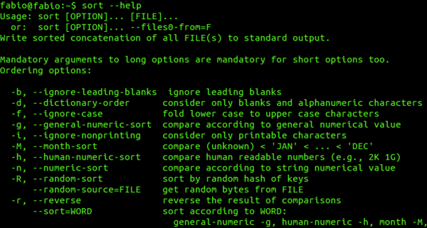

<!-- markdownlint-disable MD033 -->

很多读者抱怨计算操作系统的知识点比较繁杂，自己也没有多少耐心去看，但是面试的时候又经常会遇到。所以，我带着我整理好的操作系统的常见问题来啦！

这篇《操作系统常见面试题总结（上）》会先从操作系统基础讲起，再重点梳理 **用户态/内核态、系统调用、进程和线程、进程间通信、进程调度、死锁** 这些高频考点。它适合用来快速建立面试问题清单，也适合作为复习时查漏补缺的入口。

学习操作系统不只是为了背八股。缓存、调度、同步、内存映射、零拷贝、I/O 多路复用这些思想，在 Redis、Kafka、Nginx、Netty、JVM、数据库里都能看到影子。把底层机制想清楚，再理解上层框架和线上性能问题，会轻松很多。

本文偏“面试速查 + 核心概念串联”，深入学习还是建议搭配教材和专题文章一起看。文中部分内容参考了《现代操作系统》第三版，在此表示感谢。

## 操作系统基础


### 什么是操作系统？

通过以下四点可以概括操作系统到底是什么：

1. 操作系统（Operating System，简称 OS）是管理计算机硬件与软件资源的程序，是计算机的基石。
2. 操作系统本质上是一个运行在计算机上的软件程序，主要用于管理计算机硬件和软件资源。举例：运行在你电脑上的所有应用程序都通过操作系统来调用系统内存以及磁盘等等硬件。
3. 操作系统存在屏蔽了硬件层的复杂性。操作系统就像是硬件使用的负责人，统筹着各种相关事项。
4. 操作系统的内核（Kernel）是操作系统的核心部分，它负责系统的内存管理，硬件设备的管理，文件系统的管理以及应用程序的管理。内核是连接应用程序和硬件的桥梁，决定着系统的性能和稳定性。

很多人容易把操作系统的内核（Kernel）和中央处理器（CPU，Central Processing Unit）弄混。你可以简单从下面两点来区别：

1. 操作系统的内核（Kernel）属于操作系统层面，而 CPU 属于硬件。
2. CPU 主要提供运算，处理各种指令的能力。内核（Kernel）主要负责系统管理比如内存管理，它屏蔽了对硬件的操作。

下图清晰说明了应用程序、内核、CPU 这三者的关系。


### 操作系统主要有哪些功能？

从资源管理的角度来看，操作系统有 6 大功能：

1. **进程和线程的管理**：进程的创建、撤销、阻塞、唤醒，进程间的通信等。
2. **存储管理**：内存的分配和管理、外存（磁盘等）的分配和管理等。
3. **文件管理**：文件的读、写、创建及删除等。
4. **设备管理**：完成设备（输入输出设备和外部存储设备等）的请求或释放，以及设备启动等功能。
5. **网络管理**：操作系统负责管理计算机网络的使用。网络是计算机系统中连接不同计算机的方式，操作系统需要管理计算机网络的配置、连接、通信和安全等，以提供高效可靠的网络服务。
6. **安全管理**：用户的身份认证、访问控制、文件加密等，以防止非法用户对系统资源的访问和操作。

### 常见的操作系统有哪些？

#### Windows

目前最流行的个人桌面操作系统，不做多的介绍，大家都清楚。界面简单易操作，软件生态非常好。

_玩玩电脑游戏还是必须要有 Windows 的，所以我现在是一台 Windows 用于玩游戏，一台 Mac 用于平时日常开发和学习使用。_


#### Unix

最早的多用户、多任务操作系统。后面崛起的 Linux 在很多方面都参考了 Unix。

目前这款操作系统已经逐渐逐渐退出操作系统的舞台。



#### Linux

**Linux 是一套免费使用、开源的类 Unix 操作系统。** Linux 存在着许多不同的发行版本，但它们都使用了 **Linux 内核**。

> 严格来讲，Linux 这个词本身只表示 Linux 内核，在 GNU/Linux 系统中，Linux 实际就是 Linux 内核，而该系统的其余部分主要是由 GNU 工程编写和提供的程序组成。单独的 Linux 内核并不能成为一个可以正常工作的操作系统。
>
> **很多人更倾向使用 "GNU/Linux" 一词来表达人们通常所说的 "Linux"。**


#### Mac OS

苹果自家的操作系统，编程体验和 Linux 相当，但是界面、软件生态以及用户体验各方面都要比 Linux 操作系统更好。


### 用户态和内核态

#### 什么是用户态和内核态？

根据进程访问资源的特点，我们可以把进程在系统上的运行分为两个级别：


- **用户态（User Mode）**：用户态运行的进程可以直接读取用户程序的数据，拥有较低的权限。当应用程序需要执行某些需要特殊权限的操作，例如读写磁盘、网络通信等，就需要向操作系统发起系统调用请求，进入内核态。
- **内核态（Kernel Mode）**：内核态运行的进程几乎可以访问计算机的任何资源包括系统的内存空间、设备、驱动程序等，不受限制，拥有非常高的权限。当操作系统接收到进程的系统调用请求时，就会从用户态切换到内核态，执行相应的系统调用，并将结果返回给进程，最后再从内核态切换回用户态。

内核态相比用户态拥有更高的特权级别，因此能够执行更底层、更敏感的操作。不过，由于进入内核态需要付出较高的开销（需要进行一系列的上下文切换和权限检查），应该尽量减少进入内核态的次数，以提高系统的性能和稳定性。

#### 为什么要有用户态和内核态？只有一个内核态不行么？

这样设计主要是为了**安全**和**稳定**。

- 在 CPU 的所有指令中，有一些指令是比较危险的比如内存分配、设置时钟、IO 处理等，如果所有的程序都能使用这些指令的话，会对系统的正常运行造成灾难性地影响。因此，我们需要限制这些危险指令只能内核态运行。这些只能由操作系统内核态执行的指令也被叫做 **特权指令**。
- 如果计算机系统中只有一个内核态，那么所有程序或进程都必须共享系统资源，例如内存、CPU、硬盘等，这将导致系统资源的竞争和冲突，从而影响系统性能和效率。并且，这样也会让系统的安全性降低，毕竟所有程序或进程都具有相同的特权级别和访问权限。

因此，同时具有用户态和内核态主要是为了保证计算机系统的安全性、稳定性和性能。

#### 用户态和内核态是如何切换的？


用户态切换到内核态的 3 种方式：

1. **系统调用（Trap）**：这是最主要的方式，是应用程序**主动**发起的。比如，当我们的程序需要读取一个文件或者发送网络数据时，它无法直接操作磁盘或网卡，就必须调用操作系统提供的接口（如 `read()`、`send()`），这会触发一次从用户态到内核态的切换。
2. **中断（Interrupt）**：这是**被动**的，由外部硬件设备触发。比如，当硬盘完成了数据读取，会向 CPU 发送一个中断信号，CPU 会暂停当前用户态的程序，切换到内核态去处理这个中断。
3. **异常（Exception）**：这也是**被动**的，由程序自身错误引起。比如，我们的代码执行了一个除以零的操作，或者访问了一个非法的内存地址（缺页异常），CPU 会捕获这个异常，并切换到内核态去处理它。

在系统的处理上，中断和异常类似，都是通过中断向量表来找到相应的处理程序进行处理。区别在于，中断来自处理器外部，不是由任何一条专门的指令造成，而异常是执行当前指令的结果。

最后，需要强调的是，这种**状态切换是有性能开销的**。因为它涉及到保存用户态的上下文（寄存器等）、切换到内核态执行、再恢复用户态的上下文。因此，在高性能编程中，我们常常需要考虑如何减少这种切换次数，比如通过缓冲 I/O 来批量读写文件，就是一个典型的例子。

### 系统调用

#### 什么是系统调用？

我们运行的程序基本都是运行在用户态，如果我们调用操作系统提供的内核态级别的子功能咋办呢？那就需要系统调用了！

也就是说在我们运行的用户程序中，凡是与系统态级别的资源有关的操作（如文件管理、进程控制、内存管理等），都必须通过系统调用方式向操作系统提出服务请求，并由操作系统代为完成。


这些系统调用按功能大致可分为如下几类：

- 设备管理：完成设备（输入输出设备和外部存储设备等）的请求或释放，以及设备启动等功能。
- 文件管理：完成文件的读、写、创建及删除等功能。
- 进程管理：进程的创建、撤销、阻塞、唤醒，进程间的通信等功能。
- 内存管理：完成内存的分配、回收以及获取作业占用内存区大小及地址等功能。

系统调用和普通库函数调用非常相似，只是系统调用由操作系统内核提供，运行于内核态，而普通的库函数调用由函数库或用户自己提供，运行于用户态。

总结：系统调用是应用程序与操作系统之间进行交互的一种方式，通过系统调用，应用程序可以访问操作系统底层资源例如文件、设备、网络等。

#### 系统调用的过程了解吗？

系统调用的过程可以简单分为以下几个步骤：

1. 用户态的程序发起系统调用，因为系统调用中涉及一些特权指令（只能由操作系统内核态执行的指令），用户态程序权限不足，因此会中断执行，也就是 Trap（Trap 是一种中断）。
2. 发生中断后，当前 CPU 执行的程序会中断，跳转到中断处理程序。内核程序开始执行，也就是开始处理系统调用。
3. 当系统调用处理完成后，操作系统使用特权指令（如 `iret`、`sysret` 或 `eret`）切换回用户态，恢复用户态的上下文，继续执行用户程序。


## 进程和线程

进程和线程是操作系统面试里绕不开的一组概念。下面先给出高频问法的精简答案，想系统学习的话，可以继续阅读这两篇详细文章：

- [进程与线程详解：区别、状态、通信、上下文切换与虚拟线程](./process-and-thread.md)，路径：`./process-and-thread.md`
- [进程间通信（IPC）详解：管道、消息队列、共享内存、Socket 与 Binder](./ipc.md)，路径：`./ipc.md`

### 进程和线程的区别是什么？

进程和线程是操作系统中并发执行的两个核心概念，它们的关系可以理解为 **工厂和工人** 的关系。


**进程（Process）就像一个工厂**。操作系统在分配资源时，是以进程为基本单位的。比如，当我启动一个微信，操作系统就为它建立了一个独立的工厂，分配给它专属的内存空间、文件句柄等资源。这个工厂与其他工厂（比如我打开的浏览器进程）是严格隔离的。

**线程（Thread）则像是工厂里的工人**。一个工厂里可以有很多工人，他们共享这个工厂的资源，但每个工人有自己的工具箱和任务清单，让他们可以独立地执行不同的任务。比如微信这个工厂里，可以有一个工人（线程）负责接收消息，一个工人负责渲染界面。

这是我用 AI 绘制的一张图片，可以说是非常形象了：


下图是 Java 内存区域，我们从 JVM 的角度来说一下线程和进程之间的关系吧！


从上图可以看出：一个进程中可以有多个线程，多个线程共享进程的**堆**和**方法区（JDK1.8 之后的元空间）**资源，但是每个线程有自己的**程序计数器**、**虚拟机栈**和**本地方法栈**。


可以从资源、调度、通信、开销和可靠性这 5 个角度总结：

| 维度          | 进程                                               | 线程                                                    |
| ------------- | -------------------------------------------------- | ------------------------------------------------------- |
| 基本定位      | 资源分配和隔离的基本单位                           | CPU 调度和执行的基本单位                                |
| 地址空间      | 默认拥有独立虚拟地址空间                           | 同一进程内的线程共享进程地址空间                        |
| 私有内容      | PID、地址空间、打开文件表、权限信息等进程级资源    | 线程 ID、栈、寄存器、程序计数器、线程本地存储等执行现场 |
| 通信方式      | 需要 IPC，例如管道、消息队列、共享内存、Socket     | 可以直接读写共享内存，但必须处理同步和线程安全          |
| 创建/切换成本 | 通常更高，进程切换可能涉及地址空间切换、TLB 失效等 | 通常更低，同进程线程切换一般不需要切换整套地址空间      |
| 故障影响      | 隔离性更好，一个进程崩溃通常不影响其他进程         | 一个线程出错可能导致整个进程退出                        |

比较完整的面试回答可以这样组织：

> 进程是程序运行时的资源容器，拥有独立虚拟地址空间和文件、权限等资源；线程是进程内的执行流，多个线程共享进程资源，但各自保存栈、寄存器、程序计数器等执行现场。进程间隔离更强，通信和切换成本更高；线程间协作更方便，创建和切换通常更轻，但共享内存带来线程安全问题。

### 有了进程为什么还需要线程？

核心原因就是**为了在单个应用内实现低开销、高效率的并发**。

如果一个服务端要同时处理网络读写、业务计算、日志刷盘，用多个进程当然也能做，但进程之间共享状态麻烦，通信要走 IPC，资源占用也更高。改成多个线程后，它们能直接共享堆内存和打开的连接，只要同步写对，协作成本低很多。

线程也能提高资源利用率。单核 CPU 上，一个线程阻塞在磁盘或网络 I/O 时，其他线程可以继续运行；多核 CPU 上，多个线程有机会在不同核心上并行执行。不过，线程不是越多越好。线程过多会带来栈内存占用、调度开销、锁竞争和缓存失效等问题，CPU 密集型任务和 I/O 密集型任务的线程数配置也不一样。

### 为什么要使用多线程？

先从总体上来说：

- **从计算机底层来说：** 线程可以比作是轻量级的进程，是程序执行的最小单位，线程间的切换和调度的成本远远小于进程。另外，多核 CPU 时代意味着多个线程可以同时运行，这减少了线程上下文切换的开销。
- **从当代互联网发展趋势来说：** 现在的系统动不动就要求百万级甚至千万级的并发量，而多线程并发编程正是开发高并发系统的基础，利用好多线程机制可以大大提高系统整体的并发能力以及性能。

再深入到计算机底层来探讨：

- **单核时代**：在单核时代多线程主要是为了提高单进程利用 CPU 和 IO 系统的效率。假设只运行了一个 Java 进程的情况，当我们请求 IO 的时候，如果 Java 进程中只有一个线程，此线程被 IO 阻塞则整个进程被阻塞。CPU 和 IO 设备只有一个在运行，那么可以简单地说系统整体效率只有 50%。当使用多线程的时候，一个线程被 IO 阻塞，其他线程还可以继续使用 CPU。从而提高了 Java 进程利用系统资源的整体效率。
- **多核时代**：多核时代多线程主要是为了提高进程利用多核 CPU 的能力。举个例子：假如我们要计算一个复杂的任务，我们只用一个线程的话，不论系统有几个 CPU 核心，都只会有一个 CPU 核心被利用到。而创建多个线程，这些线程可以被映射到底层多个 CPU 上执行，在任务中的多个线程没有资源竞争的情况下，任务执行的效率会有显著性的提高，约等于（单核时执行时间 / CPU 核心数）。

### 线程间的同步的方式有哪些？

线程同步是两个或多个共享关键资源的线程的并发执行。应该同步线程以避免关键的资源使用冲突。

下面是几种常见的线程同步的方式：

1. **互斥锁（Mutex）**：采用互斥对象机制，只有拥有互斥对象的线程才有访问公共资源的权限。因为互斥对象只有一个，所以可以保证公共资源不会被多个线程同时访问。比如 Java 中的 `synchronized` 关键词和各种 `Lock` 都是这种机制。
2. **读写锁（Read-Write Lock）**：允许多个线程同时读取共享资源，但只有一个线程可以对共享资源进行写操作。
3. **信号量（Semaphore）**：它允许同一时刻多个线程访问同一资源，但是需要控制同一时刻访问此资源的最大线程数量。
4. **屏障（Barrier）**：屏障是一种同步原语，用于等待多个线程到达某个点再一起继续执行。当一个线程到达屏障时，它会停止执行并等待其他线程到达屏障，直到所有线程都到达屏障后，它们才会一起继续执行。比如 Java 中的 `CyclicBarrier` 是这种机制。
5. **条件变量（Condition Variable）/事件通知**：线程在条件不满足时等待，其他线程在条件变更后通知等待线程继续执行。它通常需要和互斥锁配合使用，避免“通知先发生、等待后发生”导致的丢通知问题。Java 中的 `Object.wait()/notify()`、`Condition.await()/signal()` 都属于这类思路；Windows 中的 Event 对象也可以看作事件通知类同步原语的一种实现。

### PCB 是什么？包含哪些信息？

**PCB（Process Control Block）** 即进程控制块，是操作系统中用来管理和跟踪进程的数据结构，每个进程都对应着一个独立的 PCB。你可以将 PCB 视为进程的大脑。

当操作系统创建一个新进程时，会为该进程分配一个唯一的进程 ID，并且为该进程创建一个对应的进程控制块。当进程执行时，PCB 中的信息会不断变化，操作系统会根据这些信息来管理和调度进程。

- **标识信息**：PID、父进程 ID、用户 ID 等。
- **进程状态和调度信息**：就绪、运行、阻塞、优先级、时间片、CPU 时间统计等。
- **CPU 上下文**：程序计数器、栈指针、通用寄存器、程序状态字 PSW 等，用于上下文切换后恢复执行。
- **内存管理信息**：虚拟地址空间、页表、内存映射等。
- **资源信息**：打开文件、文件描述符、I/O 状态、工作目录、信号处理信息等。
- ……

发生上下文切换时，操作系统会把当前进程的寄存器等现场保存到 PCB 中，再从下一个进程的 PCB 中恢复现场，让它能够从上次暂停的位置继续执行。

### TCB 是什么？和 PCB 有什么关系？

**TCB（Thread Control Block）** 即线程控制块，用来保存线程级别的控制信息，例如线程 ID、线程状态、寄存器现场、栈信息、调度优先级、线程本地存储等。

在一些教材或系统实现里，PCB 和 TCB 是分开的：PCB 更偏进程级资源，TCB 更偏线程级执行现场。Linux 的实现比较特殊，它把进程和线程都看成 task，用 `task_struct` 描述调度实体，再通过资源结构是否共享来区分进程和线程。理解时不用纠结名字，关键是分清：**地址空间、文件表等属于资源边界；栈、寄存器、程序计数器等属于执行现场**。

### 进程有哪几种状态？

我们一般把进程大致分为 5 种状态，这一点和线程很像：

- **创建状态（new）**：进程正在被创建，尚未到就绪状态。
- **就绪状态（ready）**：进程已处于准备运行状态，即进程获得了除了处理器之外的一切所需资源，一旦得到处理器资源（处理器分配的时间片）即可运行。
- **运行状态（running）**：进程正在处理器上运行（单核 CPU 下任意时刻只有一个进程处于运行状态）。
- **阻塞状态（waiting）**：又称为等待状态，进程正在等待某一事件而暂停运行如等待某资源为可用或等待 IO 操作完成。即使处理器空闲，该进程也不能运行。
- **结束状态（terminated）**：进程正在从系统中消失。可能是进程正常结束或其他原因中断退出运行。


状态转换要重点看触发原因：就绪态拿到 CPU 后进入运行态；运行态时间片用完，可能回到就绪态；运行中发起阻塞 I/O、等待锁或等待事件，会进入阻塞态；阻塞等待的事件完成后，通常先回到就绪态，等待下一次被调度。

有些教材还会加入**挂起状态**。挂起强调进程暂时不在内存中，或者被用户/系统暂停；阻塞强调进程在等待某个事件。二者不是一回事：进程可以阻塞但仍在内存里，也可以被换出到外存后处于阻塞挂起。

### 进程间的通信方式有哪些？

进程默认拥有独立虚拟地址空间，不能直接访问彼此的用户态内存，所以需要 **IPC（Inter-Process Communication，进程间通信）**。

面试里先按使用场景回答即可：

- 父子进程传少量字节流：匿名管道。
- 无亲缘关系进程做本机通信：命名管道、Unix Domain Socket。
- 小型结构化消息：消息队列。
- 本机大块数据交换：共享内存，但要配合信号量、互斥锁、`futex`、`eventfd` 等同步机制。
- 异步事件通知：信号。
- 跨机器通信：TCP/UDP Socket 或更上层的 RPC 框架。

更系统的分类、边界和选型可以看：[进程间通信（IPC）详解：管道、消息队列、共享内存、Socket 与 Binder](./ipc.md)，路径：`./ipc.md`。

### fork、exec、wait 分别做什么？

在 Unix/Linux 编程里，进程创建和程序替换常绕不开 `fork()`、`exec()`、`wait()` 这三个动作。这里先记面试短答，更多文件描述符继承、写时复制和多线程 `fork` 的细节可以看：[进程与线程详解](./process-and-thread.md)，路径：`./process-and-thread.md`。


- **`fork()`**：创建子进程。父子进程从同一个位置继续执行，但返回值不同。
- **`exec()`**：在当前进程中装入另一个程序。它不会新建进程，而是替换当前进程的用户态代码和数据。
- **`wait()`/`waitpid()`**：等待子进程状态变化，并回收子进程退出后留在内核里的状态信息。

Shell 启动外部命令时，常见链路就是：Shell 先 `fork()` 出子进程，子进程再 `exec()` 成目标程序，父进程用 `wait()` 或 `waitpid()` 等待并回收退出状态。如果父进程一直不回收已退出的子进程，就可能留下僵尸进程。

### 什么是上下文切换？

上下文切换指 CPU 从一个执行实体切到另一个执行实体。操作系统需要保存当前执行实体的寄存器、程序计数器、栈指针等现场，再恢复下一个执行实体的现场。


线程切换和进程切换都会有开销，但进程切换通常更重。原因是进程有独立地址空间，切换时可能涉及页表切换、TLB 失效、缓存局部性下降等成本；同一进程内的线程共享地址空间，切换时通常不需要换整套内存映射。

可以这样简化理解：同一进程内的线程切换，主要换线程自己的栈、寄存器、程序计数器等执行现场；跨进程切换除了换执行现场，还可能切换地址空间，并带来 TLB 和缓存局部性的影响。线上性能分析里，如果发现大量时间花在调度、锁等待、系统调用和上下文切换上，继续盲目加线程通常只会让情况更差。

### 进程的调度算法有哪些？


进程调度算法的核心目标是决定就绪队列中的哪个进程应该获得 CPU 资源，其设计目标通常是在**吞吐量、周转时间、响应时间**和**公平性**之间做权衡。

我习惯将这些算法分为两大类：**非抢占式**和**抢占式**。

**第一类：非抢占式调度（Non-Preemptive）**

这种方式下，一旦 CPU 分配给一个进程，它就会一直运行下去，直到任务完成或主动放弃（比如等待 I/O）。

1. **先到先服务调度算法（FCFS，First Come, First Served）**：这是最简单的，就像排队，谁先来谁先用。优点是公平、实现简单。但缺点很明显，如果一个很长的任务先到了，后面无数个短任务都得等着，这会导致平均等待时间很长，我们称之为“护航效应”。
2. **短作业优先的调度算法（SJF，Shortest Job First）**：从就绪队列中选出一个估计运行时间最短的进程为之分配资源。理论上，它的平均等待时间是最短的，吞吐量很高。但缺点是，它需要预测运行时间，这很难做到，而且可能会导致长作业“饿死”，永远得不到执行。

**第二类：抢占式调度（Preemptive）**

操作系统可以强制剥夺当前进程的 CPU 使用权，分配给其他更重要的进程。现代操作系统基本都采用这种方式。

- **时间片轮转调度算法（RR，Round-Robin）**：这是最经典、最公平的抢占式算法。它给每个进程分配一个固定的时间片，用完了就把它放到队尾，切换到下一个进程。它非常适合分时系统，保证了每个进程都能得到响应，但时间片的设置很关键：太长了退化成 FCFS，太短了则会导致过于频繁的上下文切换，增加系统开销。
- **优先级调度算法（Priority）**：每个进程都有一个优先级，进程调度器总是选择优先级最高的进程，具有相同优先级的进程以 FCFS 方式执行。这很灵活，可以根据内存要求、时间要求或任何其他资源要求来确定优先级，但同样可能导致低优先级进程“饿死”。

前面介绍的几种进程调度的算法都有一定的局限性，如：**短进程优先的调度算法，仅照顾了短进程而忽略了长进程**。那有没有一种结合了上面这些进程调度算法优点的呢？

**多级反馈队列调度算法（MFQ，Multi-level Feedback Queue）** 是现实世界中最常用的一种算法，比如早期的 UNIX。它非常聪明，结合了 RR 和优先级调度。它设置了多个不同优先级的队列，每个队列使用 RR 调度，时间片大小也不同。新进程先进入最高优先级队列；如果在一个时间片内没执行完，就会被降级到下一个队列。这样既照顾了短作业（在高优先级队列中快速完成），也保证了长作业不会饿死（最终会在低优先级队列中得到执行），是一种非常均衡的方案。

### 那究竟是谁来调度这个进程呢？

负责进程调度的核心是操作系统内核中的两个紧密协作的组件：**调度程序（Scheduler）** 和 **分派程序（Dispatcher）**。我们可以把它们理解成一个团队：

- **调度程序（Scheduler）**：可以看作是决策者。当需要进行调度时，调度程序会被激活，它会根据预设的调度算法（比如我们前面聊到的多级反馈队列），从就绪队列中挑选出下一个应该占用 CPU 的进程。
- **分派程序（Dispatcher）**：可以看作是执行者。它负责完成具体的“交接”工作，也就是**上下文切换**。这个过程非常底层，主要包括：
  - 保存当前进程的上下文（CPU 寄存器状态、程序计数器等）到其进程控制块（PCB）中。
  - 加载下一个被选中进程的上下文，从其 PCB 中读取状态，恢复到 CPU 寄存器。
  - 将 CPU 的控制权正式移交给新进程，让它开始运行。

## 死锁

### 什么是死锁？

死锁（Deadlock）描述的是这样一种情况：一组进程/线程互相等待对方释放资源或完成动作，等待关系形成闭环，导致所有参与者都无法自行继续执行。

更具体地说，死锁不是“等得久”这么简单。普通阻塞可能等锁释放、I/O 返回或事务提交后继续执行；死锁里的等待链绕成了环，如果没有外力介入，这个环不会自然解开。

关于死锁的形成过程、Java 线程死锁排查和数据库死锁处理，可以看这篇更完整的专题：[死锁详解：四个必要条件、Java 死锁排查与数据库死锁处理](./dead-lock.md)。

一个最经典的例子就是 **“交叉持锁”**。想象有两个线程和两个锁：

- 线程 1 先拿到了锁 A，然后尝试去获取锁 B。
- 几乎同时，线程 2 拿到了锁 B，然后尝试去获取锁 A。

这时，线程 1 等着线程 2 释放锁 B，线程 2 等着线程 1 释放锁 A，双方都持有对方需要的资源，并等待对方释放，就形成了一个等待环。


### 产生死锁的四个必要条件是什么？

死锁的发生并不是偶然的，它需要同时满足**四个必要条件**：

1. **互斥**：资源必须处于非共享模式，即一次只有一个进程可以使用。如果另一进程申请该资源，那么必须等待直到该资源被释放为止。
2. **占有并等待**：一个进程至少应该占有一个资源，并等待另一资源，而该资源被其他进程所占有。
3. **非抢占**：资源不能被抢占。只能在持有资源的进程完成任务后，该资源才会被释放。
4. **循环等待**：有一组等待进程 `{P0, P1, ..., Pn}`，`P0` 等待的资源被 `P1` 占有，`P1` 等待的资源被 `P2` 占有，...，`Pn-1` 等待的资源被 `Pn` 占有，`Pn` 等待的资源又被 `P0` 占有。


**注意**：这四个条件是产生死锁的必要条件，必须同时成立。只满足其中一两个条件不一定会死锁；反过来，只要能稳定破坏其中任意一个条件，就可以从结构上预防死锁。

### 能写一个模拟产生死锁的代码吗？

下面通过一个实际的例子来复现上面的交叉持锁场景：

```java
public class DeadLockDemo {
    private static final Object resource1 = new Object(); // 资源 1
    private static final Object resource2 = new Object(); // 资源 2

    public static void main(String[] args) {
        new Thread(() -> {
            synchronized (resource1) {
                System.out.println(Thread.currentThread() + "get resource1");
                try {
                    Thread.sleep(1000);
                } catch (InterruptedException e) {
                    Thread.currentThread().interrupt();
                }
                System.out.println(Thread.currentThread() + "waiting get resource2");
                synchronized (resource2) {
                    System.out.println(Thread.currentThread() + "get resource2");
                }
            }
        }, "线程 1").start();

        new Thread(() -> {
            synchronized (resource2) {
                System.out.println(Thread.currentThread() + "get resource2");
                try {
                    Thread.sleep(1000);
                } catch (InterruptedException e) {
                    Thread.currentThread().interrupt();
                }
                System.out.println(Thread.currentThread() + "waiting get resource1");
                synchronized (resource1) {
                    System.out.println(Thread.currentThread() + "get resource1");
                }
            }
        }, "线程 2").start();
    }
}
```

Output

```text
Thread[线程 1,5,main]get resource1
Thread[线程 2,5,main]get resource2
Thread[线程 1,5,main]waiting get resource2
Thread[线程 2,5,main]waiting get resource1
```

线程 1 通过 `synchronized (resource1)` 获得 `resource1` 的监视器锁，线程 2 通过 `synchronized (resource2)` 获得 `resource2` 的监视器锁。`Thread.sleep(1000)` 不是死锁的原因，它只是把两个线程交错执行的窗口拉大，让死锁更容易复现。休眠结束后，两个线程都开始申请对方持有的资源，于是陷入互相等待。

### 解决死锁的方法

面试里回答到这个程度即可：解决死锁一般有 **预防、避免、检测和解除/恢复** 四类思路。

- **预防**：提前破坏死锁四个必要条件之一。工程里最常见的是固定加锁顺序、缩小锁范围、避免持锁做慢操作。
- **避免**：分配资源前判断系统是否仍处于安全状态，典型代表是银行家算法。这个方法更偏教材理解，普通业务系统很少直接实现。
- **检测**：允许等待发生，再检查等待图或资源分配图里是否出现环。Java 里可以用 `jcmd <pid> Thread.print -l`、`jstack -l <pid>` 或 `ThreadMXBean.findDeadlockedThreads()` 辅助排查；数据库也会检测事务等待环。
- **解除/恢复**：发现死锁后打破等待环，例如终止进程、回滚事务、抢占资源或让应用层重试。数据库事务天然支持回滚，因此更适合采用检测和恢复。


这部分面试不必展开太细，抓住层次即可。想继续看资源分配图、等待图、Java 线程栈排查和数据库死锁重试，可以看：[死锁详解：四个必要条件、Java 死锁排查与数据库死锁处理](./dead-lock.md)。

## 参考

- 《计算机操作系统—汤小丹》第四版
- 《深入理解计算机系统》
- 《重学操作系统》
- 操作系统为什么要分用户态和内核态：<https://blog.csdn.net/chen134225/article/details/81783980>
- 从根上理解用户态与内核态：<https://juejin.cn/post/6923863670132850701>
- 什么是僵尸进程与孤儿进程：<https://blog.csdn.net/a745233700/article/details/120715371>

<!-- @include: @article-footer.snippet.md -->
