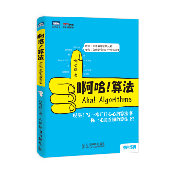
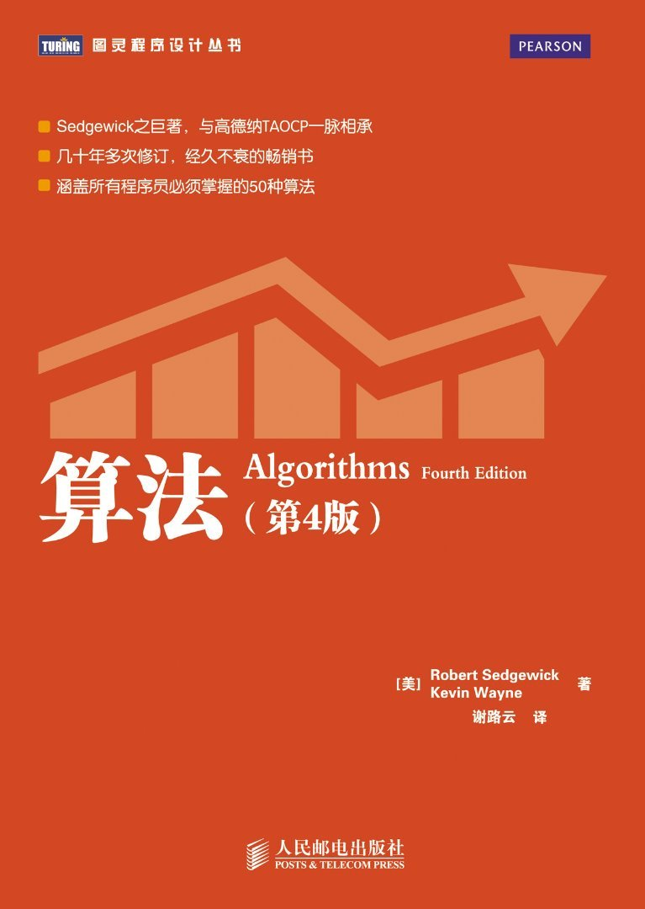
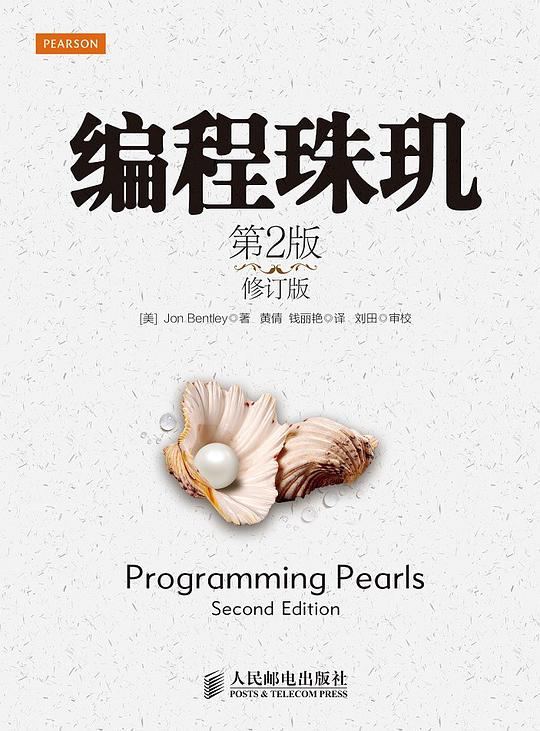
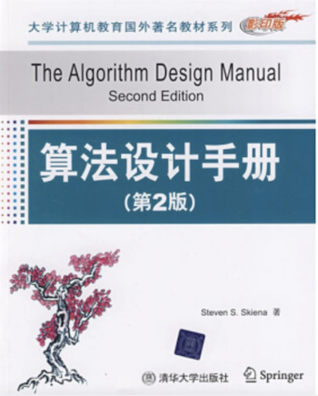
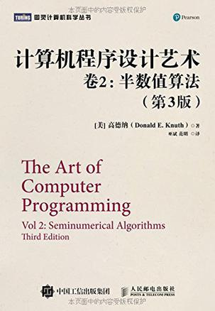
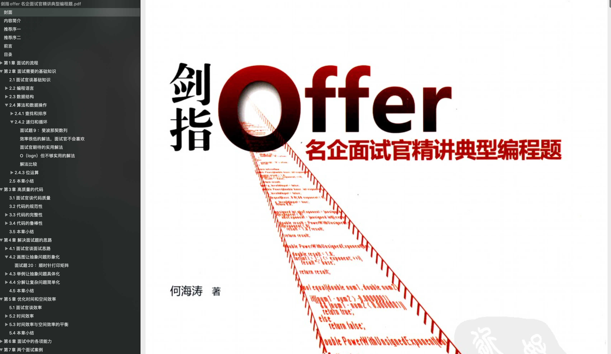
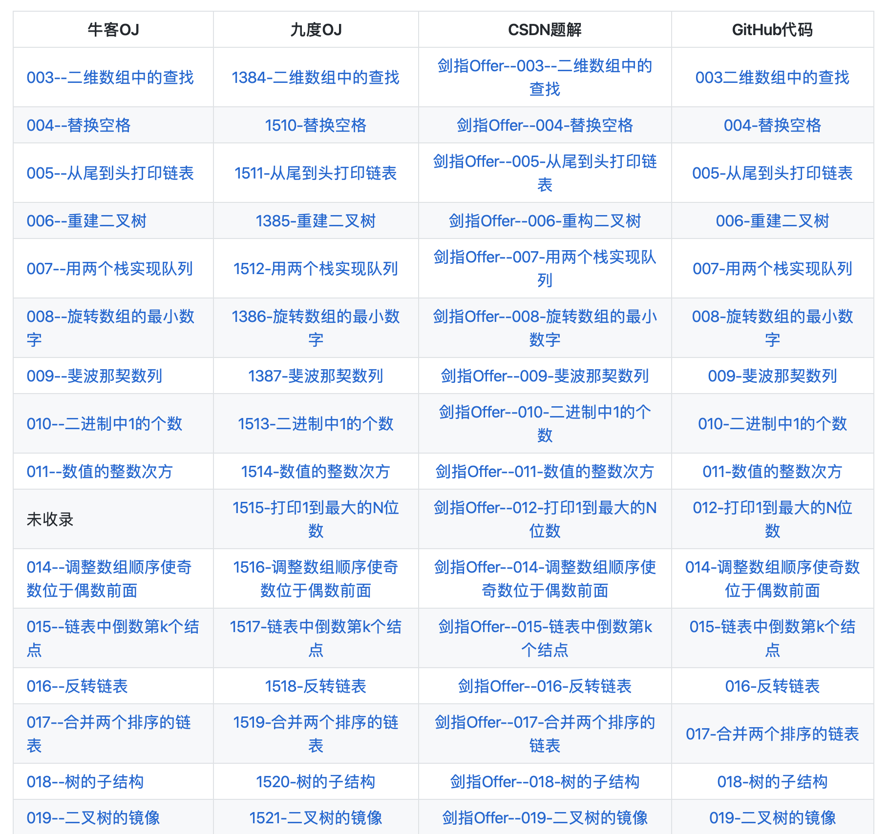
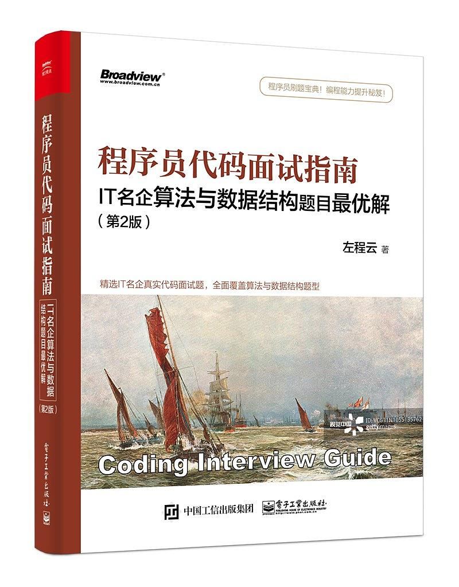
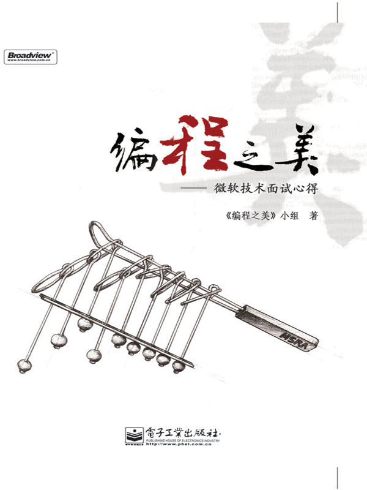

先占个坑，说一下我觉得算法这部分学习比较好的规划：

1. 未入门（对算法和基本数据结构不了解）之前建议先找一本入门书籍看；
2. 如果时间比较多可以看一下我推荐的经典部分的书籍，《算法》这本书是首要要看的，其他推荐的神书看自己时间和心情就好，不要太纠结。
3. 如果要准备面试，时间比较紧的话，就不需要再去看《算法》这本书了，时间来不及，当然你也可以选取其特定的章节查看。我也推荐了几本不错的专门为算法面试准备的书籍比如《剑指offer》和《程序员代码面试指南》。除了这两本书籍的话，我在下面推荐了 Leetcode  和牛客网这两个常用的刷题网站以及一些比较好的题目资源。

## 书籍推荐

>  以下提到的部分书籍的 PDF 高清阅读版本在我的公众号“JavaGuide”后台回复“书籍”即可获取。

先来看三本入门书籍，这三本入门书籍中的任何一本拿来作为入门学习都非常好。我个人比较倾向于 **《我的第一本算法书》** 这本书籍，虽然它相比于其他两本书集它的豆瓣评分略低一点。我觉得它的配图以及讲解是这三本书中最优秀，唯一比较明显的问题就是没有代码示例。但是，我觉得这不影响它是一本好的算法书籍。因为本身下面这三本入门书籍的目的就不是通过代码来让你的算法有多厉害，只是作为一本很好的入门书籍让你进入算法学习的大门。

### 入门

**[我的第一本算法书](https://book.douban.com/subject/30357170/) （豆瓣评分 7.1，0.2K+人评价）**

一本不那么“专业”的算法书籍。和下面两本推荐的算法书籍都是比较通俗易懂，“不那么深入”的算法书籍。我个人非常推荐，配图和讲解都非常不错！

**[《算法图解》](https://book.douban.com/subject/26979890/)（豆瓣评分 8.4，1.5K+人评价）**

入门类型的书籍，读起来比较浅显易懂，非常适合没有算法基础或者说算法没学好的小伙伴用来入门。示例丰富，图文并茂，以让人容易理解的方式阐释了算法.读起来比较快，内容不枯燥！

**[啊哈!算法](https://book.douban.com/subject/25894685/) （豆瓣评分 7.7，0.5K+人评价）**

和《算法图解》类似的算法趣味入门书籍。

### 经典

**[《算法 第四版》](https://book.douban.com/subject/10432347/)（豆瓣评分 9.3，0.4K+人评价）**

我在大二的时候被我们的一个老师强烈安利过！自己也在当时购买了一本放在宿舍，到离开大学的时候自己大概看了一半多一点。因为内容实在太多了！另外，这本书还提供了详细的Java代码，非常适合学习 Java 的朋友来看，可以说是 Java 程序员的必备书籍之一了。

再来介绍一下这本书籍吧！这本书籍算的上是算法领域经典的参考书，全面介绍了关于算法和数据结构的必备知识，并特别针对排序、搜索、图处理和字符串处理进行了论述。

> **下面这些书籍都是经典中的经典，但是阅读起来难度也比较大，不做太多阐述，神书就完事了！推荐先看 《算法》，然后再选下面的书籍进行进一步阅读。不需要都看，找一本好好看或者找某本书的某一个章节知识点好好看。** 

**[编程珠玑](https://book.douban.com/subject/3227098/)（豆瓣评分 9.1，2K+人评价）**

经典名著，被无数读者强烈推荐的书籍，几乎是顶级程序员必看的书籍之一了。这本书的作者也非常厉害，Java之父 James Gosling 就是他的学生。

很多人都说这本书不是教你具体的算法，而是教你一种编程的思考方式。这种思考方式不仅仅在编程领域适用，在其他同样适用。

**[《算法设计手册》](https://book.douban.com/subject/4048566/)（豆瓣评分9.1 ， 45人评价）**

被 [Teach Yourself Computer Science](https://teachyourselfcs.com/) 强烈推荐的一本算法书籍。

**[《算法导论》](https://book.douban.com/subject/20432061/) （豆瓣评分 9.2，0.4K+人评价）**

**[《计算机程序设计艺术（第1卷）》](https://book.douban.com/subject/1130500/)（豆瓣评分 9.4，0.4K+人评价）** 

### 面试

**[《剑指Offer》](https://book.douban.com/subject/6966465/)（豆瓣评分 8.3，0.7K+人评价）**

这本面试宝典上面涵盖了很多经典的算法面试题，如果你要准备大厂面试的话一定不要错过这本书。

《剑指Offer》 对应的算法编程题部分的开源项目解析：[CodingInterviews](https://github.com/gatieme/CodingInterviews)

**[程序员代码面试指南：IT名企算法与数据结构题目最优解（第2版）](https://book.douban.com/subject/30422021/) （豆瓣评分 8.7，0.2K+人评价）**

题目相比于《剑指 offer》 来说要难很多，题目涵盖面相比于《剑指 offer》也更加全面。全书一共有将近300道真实出现过的经典代码面试题。

**[编程之美](https://book.douban.com/subject/3004255/)（豆瓣评分 8.4，3K+人评价）**

这本书收集了约60道算法和程序设计题目，这些题目大部分在近年的笔试、面试中出现过，或者是被微软员工热烈讨论过。作者试图从书中各种有趣的问题出发，引导读者发现问题，分析问题，解决问题，寻找更优的解法。

## 网站推荐

我比较推荐大家可以刷一下 Leetcode ，我自己平时没事也会刷一下，我觉得刷 Leetcode 不仅是为了能让你更从容地面对面试中的手撕算法问题，更可以提高你的编程思维能力、解决问题的能力以及你对某门编程语言 API 的熟练度。当然牛客网也有一些算法题，我下面也整理了一些。

### [LeetCode](https://leetcode-cn.com/)                   

[如何高效地使用 LeetCode](https://leetcode-cn.com/articles/%E5%A6%82%E4%BD%95%E9%AB%98%E6%95%88%E5%9C%B0%E4%BD%BF%E7%94%A8-leetcode/)

- [《程序员代码面试指南》](https://leetcode-cn.com/problemset/lcci/)
- [《剑指offer》](https://leetcode-cn.com/problemset/lcof/)

### [牛客网](https://www.nowcoder.com)

**[在线编程](https://www.nowcoder.com/activity/oj)：**

- [《剑指offer》](https://www.nowcoder.com/ta/coding-interviews)
- [《程序员代码面试指南》](https://www.nowcoder.com/ta/programmer-code-interview-guide)
- [2019 校招真题](https://www.nowcoder.com/ta/2019test)
- [大一大二编程入门训练](https://www.nowcoder.com/ta/beginner-programmers)
- .......

**[大厂编程面试真题](https://www.nowcoder.com/contestRoom?filter=0&orderByHotValue=3&target=content&categories=-1&mutiTagIds=2491&page=1)**

