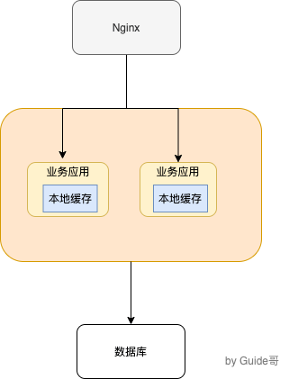
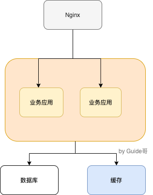
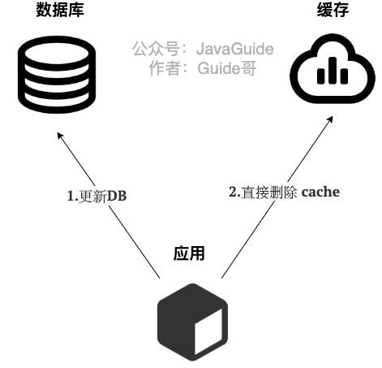
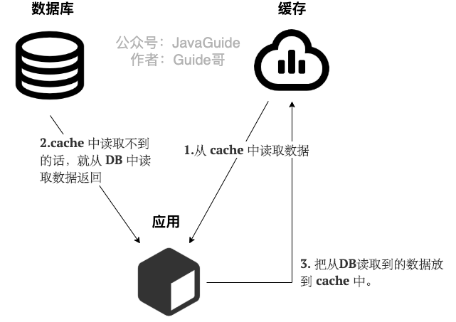
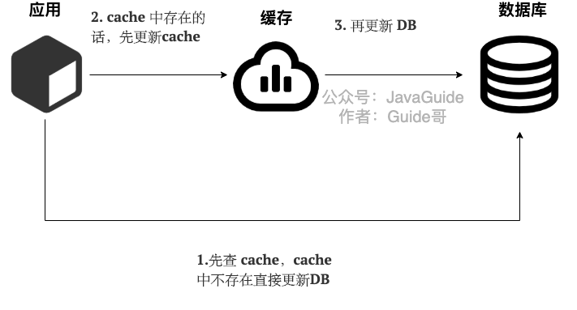
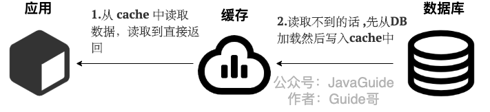

<!-- @import "[TOC]" {cmd="toc" depthFrom=1 depthTo=6 orderedList=false} -->

<!-- code_chunk_output -->

- [1. 缓存的基本思想](#1-缓存的基本思想)
- [2. 使用缓存为系统带来了什么问题](#2-使用缓存为系统带来了什么问题)
- [3. 本地缓存解决方案](#3-本地缓存解决方案)
- [4. 为什么要有分布式缓存?/为什么不直接用本地缓存?](#4-为什么要有分布式缓存为什么不直接用本地缓存)
- [5. 缓存读写模式/更新策略](#5-缓存读写模式更新策略)
  - [5.1. Cache Aside Pattern（旁路缓存模式）](#51-cache-aside-pattern旁路缓存模式)
  - [5.2. Read/Write Through Pattern（读写穿透）](#52-readwrite-through-pattern读写穿透)
  - [5.3. Write Behind Pattern（异步缓存写入）](#53-write-behind-pattern异步缓存写入)

<!-- /code_chunk_output -->

### 1. 缓存的基本思想

很多朋友，只知道缓存可以提高系统性能以及减少请求相应时间，但是，不太清楚缓存的本质思想是什么。

缓存的基本思想其实很简单，就是我们非常熟悉的空间换时间。不要把缓存想的太高大上，虽然，它的确对系统的性能提升的性价比非常高。

其实，我们在学习使用缓存的时候，你会发现缓存的思想实际在操作系统或者其他地方都被大量用到。 比如 **CPU Cache 缓存的是内存数据用于解决 CPU 处理速度和内存不匹配的问题，内存缓存的是硬盘数据用于解决硬盘访问速度过慢的问题。** **再比如操作系统在 页表方案 基础之上引入了 快表 来加速虚拟地址到物理地址的转换。我们可以把快表理解为一种特殊的高速缓冲存储器（Cache）。**

回归到业务系统来说：**我们为了避免用户在请求数据的时候获取速度过于缓慢，所以我们在数据库之上增加了缓存这一层来弥补。**

当别人再问你，缓存的基本思想的时候，就把上面 👆 这段话告诉他，我觉得会让别人对你刮目相看。

### 2. 使用缓存为系统带来了什么问题

**软件系统设计中没有银弹，往往任何技术的引入都像是把双刃剑。** 你使用的方式得当，就能为系统带来很大的收益。否则，只是费了精力不讨好。

简单来说，为系统引入缓存之后往往会带来下面这些问题：

_ps:其实我觉得引入本地缓存来做一些简单业务场景的话，实际带来的代价几乎可以忽略，下面 👇 主要是针对分布式缓存来说的。_

1. **系统复杂性增加** ：引入缓存之后，你要维护缓存和数据库的数据一致性、维护热点缓存等等。
2. **系统开发成本往往会增加** ：引入缓存意味着系统需要一个单独的缓存服务，这是需要花费相应的成本的，并且这个成本还是很贵的，毕竟耗费的是宝贵的内存。但是，如果你只是简单的使用一下本地缓存存储一下简单的数据，并且数据量不大的话，那么就不需要单独去弄一个缓存服务。

### 3. 本地缓存解决方案

_先来聊聊本地缓存，这个实际在很多项目中用的蛮多，特别是单体架构的时候。数据量不大，并且没有分布式要求的话，使用本地缓存还是可以的。_

常见的单体架构图如下，我们使用 **Nginx** 来做**负载均衡**，部署两个相同的服务到服务器，两个服务使用同一个数据库，并且使用的是本地缓存。

_那本地缓存的方案有哪些呢？且听 Guide 给你来说一说。_

**一：JDK 自带的 `HashMap` 和 `ConcurrentHashMap` 了。**

`ConcurrentHashMap` 可以看作是线程安全版本的 `HashMap` ，两者都是存放 key/value 形式的键值对。但是，大部分场景来说不会使用这两者当做缓存，因为只提供了缓存的功能，并没有提供其他诸如过期时间之类的功能。一个稍微完善一点的缓存框架至少要提供：**过期时间**、**淘汰机制**、**命中率统计**这三点。

**二： `Ehcache` 、 `Guava Cache` 、 `Spring Cache` 这三者是使用的比较多的本地缓存框架。**

- `Ehcache` 的话相比于其他两者更加重量。不过，相比于 `Guava Cache` 、 `Spring Cache` 来说， `Ehcache` 支持可以嵌入到 hibernate 和 mybatis 作为多级缓存，并且可以将缓存的数据持久化到本地磁盘中、同时也提供了集群方案（比较鸡肋，可忽略）。
- `Guava Cache` 和 `Spring Cache` 两者的话比较像。`Guava` 相比于 `Spring Cache` 的话使用的更多一点，它提供了 API 非常方便我们使用，同时也提供了设置缓存有效时间等功能。它的内部实现也比较干净，很多地方都和 `ConcurrentHashMap` 的思想有异曲同工之妙。
- 使用 `Spring Cache` 的注解实现缓存的话，代码会看着很干净和优雅，但是很容易出现问题比如缓存穿透、内存溢出。

**三： 后起之秀 Caffeine。**

相比于 `Guava` 来说 `Caffeine` 在各个方面比如性能要更加优秀，一般建议使用其来替代 `Guava` 。并且， `Guava` 和 `Caffeine` 的使用方式很像！

本地缓存固然好，但是缺陷也很明显，比如多个相同服务之间的本地缓存的数据无法共享。

### 4. 为什么要有分布式缓存?/为什么不直接用本地缓存?

本地的缓存的优势非常明显：**低依赖**、**轻量**、**简单**、**成本低**。

但是，本地缓存存在下面这些缺陷：

1. **本地缓存对分布式架构支持不友好**，比如同一个相同的服务部署在多台机器上的时候，各个服务之间的缓存是无法共享的，因为本地缓存只在当前机器上有。
2. **本地缓存容量受服务部署所在的机器限制明显。** 如果当前系统服务所耗费的内存多，那么本地缓存可用的容量就很少。

**我们可以把分布式缓存（Distributed Cache） 看作是一种内存数据库的服务，它的最终作用就是提供缓存数据的服务。**

如下图所示，就是一个简单的使用分布式缓存的架构图。我们使用 Nginx 来做负载均衡，部署两个相同的服务到服务器，两个服务使用同一个数据库和缓存。

使用分布式缓存之后，缓存部署在一台单独的服务器上，即使同一个相同的服务部署在再多机器上，也是使用的同一份缓存。 并且，单独的分布式缓存服务的性能、容量和提供的功能都要更加强大。

使用分布式缓存的缺点呢，也很显而易见，那就是你需要为分布式缓存引入额外的服务比如 Redis 或 Memcached，你需要单独保证 Redis 或 Memcached 服务的高可用。

### 5. 缓存读写模式/更新策略

**下面介绍到的三种模式各有优劣，不存在最佳模式，根据具体的业务场景选择适合自己的缓存读写模式。**

#### 5.1. Cache Aside Pattern（旁路缓存模式）

**Cache Aside Pattern 是我们平时使用比较多的一个缓存读写模式，比较适合读请求比较多的场景。**

Cache Aside Pattern 中服务端需要同时维系 DB 和 cache，并且是以 DB 的结果为准。

下面我们来看一下这个策略模式下的缓存读写步骤。

**写** ：

- 先更新 DB
- 然后直接删除 cache 。

简单画了一张图帮助大家理解写的步骤。

**读** :

- 从 cache 中读取数据，读取到就直接返回
- cache中读取不到的话，就从 DB 中读取数据返回
- 再把数据放到 cache 中。

简单画了一张图帮助大家理解读的步骤。

你仅仅了解了上面这些内容的话是远远不够的，我们还要搞懂其中的原理。

比如说面试官很可能会追问：“**在写数据的过程中，可以先删除 cache ，后更新 DB 么？**”

**答案：** 那肯定是不行的！因为这样可能会造成**数据库（DB）和缓存（Cache）数据不一致**的问题。为什么呢？比如说请求1 先写数据A，请求2随后读数据A的话就很有可能产生数据不一致性的问题。这个过程可以简单描述为：

> 请求1先把cache中的A数据删除 -> 请求2从DB中读取数据->请求1再把DB中的A数据更新。

当你这样回答之后，面试官可能会紧接着就追问：“**在写数据的过程中，先更新DB，后删除cache就没有问题了么？**”

**答案：** 理论上来说还是可能会出现数据不一致性的问题，不过概率非常小，因为缓存的写入速度是比数据库的写入速度快很多！

比如请求1先读数据 A，请求2随后写数据A，并且数据A不在缓存中的话也有可能产生数据不一致性的问题。这个过程可以简单描述为：

> 请求1从DB读数据A->请求2写更新数据 A 到数据库并把删除cache中的A数据->请求1将数据A写入cache。

现在我们再来分析一下 **Cache Aside Pattern 的缺陷**。

**缺陷1：首次请求数据一定不在 cache 的问题** 

解决办法：可以将热点数据可以提前放入cache 中。

**缺陷2：写操作比较频繁的话导致cache中的数据会被频繁被删除，这样会影响缓存命中率 。**

解决办法：

- 数据库和缓存数据强一致场景 ：更新DB的时候同样更新cache，不过我们需要加一个锁/分布式锁来保证更新cache的时候不存在线程安全问题。
- 可以短暂地允许数据库和缓存数据不一致的场景 ：更新DB的时候同样更新cache，但是给缓存加一个比较短的过期时间，这样的话就可以保证即使数据不一致的话影响也比较小。

#### 5.2. Read/Write Through Pattern（读写穿透）

Read/Write Through Pattern 中服务端把 cache 视为主要数据存储，从中读取数据并将数据写入其中。cache 服务负责将此数据读取和写入 DB，从而减轻了应用程序的职责。

这种缓存读写策略小伙伴们应该也发现了在平时在开发过程中非常少见。抛去性能方面的影响，大概率是因为我们经常使用的分布式缓存 Redis 并没有提供 cache 将数据写入DB的功能。

**写（Write Through）：**

- 先查 cache，cache 中不存在，直接更新 DB。
- cache 中存在，则先更新 cache，然后 cache 服务自己更新 DB（**同步更新 cache 和 DB**）。

简单画了一张图帮助大家理解写的步骤。

**读(Read Through)：** 

- 从 cache 中读取数据，读取到就直接返回 。
- 读取不到的话，先从 DB 加载，写入到 cache 后返回响应。

简单画了一张图帮助大家理解读的步骤。

Read-Through Pattern 实际只是在 Cache-Aside Pattern 之上进行了封装。在 Cache-Aside Pattern 下，发生读请求的时候，如果 cache 中不存在对应的数据，是由客户端自己负责把数据写入 cache，而 Read Through Pattern 则是 cache 服务自己来写入缓存的，这对客户端是透明的。

和 Cache Aside Pattern 一样， Read-Through Pattern 也有首次请求数据一定不再 cache 的问题，对于热点数据可以提前放入缓存中。

#### 5.3. Write Behind Pattern（异步缓存写入）

Write Behind Pattern 和 Read/Write Through Pattern 很相似，两者都是由 cache 服务来负责 cache 和 DB 的读写。

但是，两个又有很大的不同：**Read/Write Through 是同步更新 cache 和 DB，而 Write Behind Caching 则是只更新缓存，不直接更新 DB，而是改为异步批量的方式来更新 DB。**

很明显，这种方式对数据一致性带来了更大的挑战，比如cache数据可能还没异步更新DB的话，cache服务可能就就挂掉了。

这种策略在我们平时开发过程中也非常非常少见，但是不代表它的应用场景少，比如消息队列中消息的异步写入磁盘、MySQL 的 InnoDB Buffer Pool 机制都用到了这种策略。

Write Behind Pattern 下 DB 的写性能非常高，非常适合一些数据经常变化又对数据一致性要求没那么高的场景，比如浏览量、点赞量。

