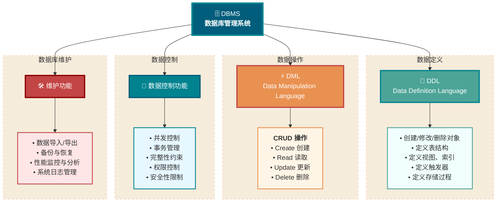
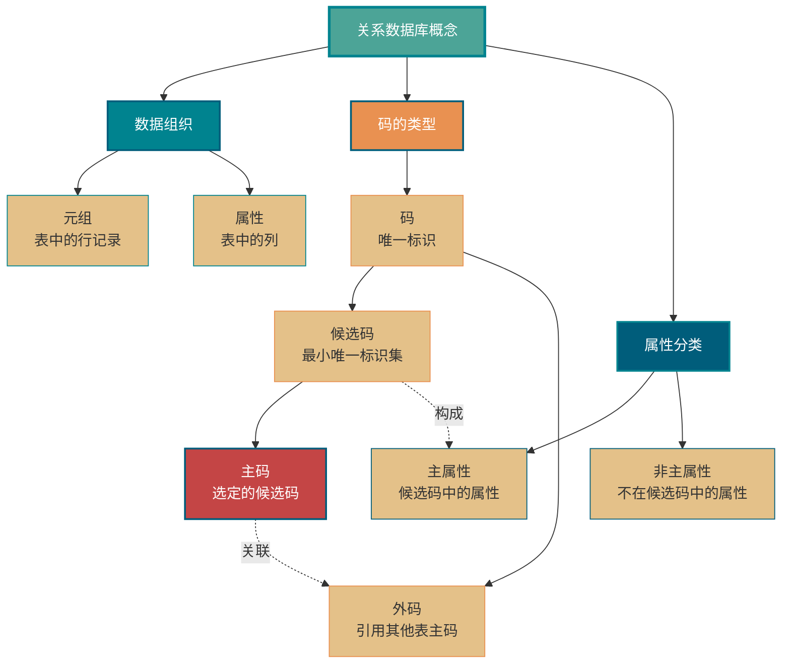
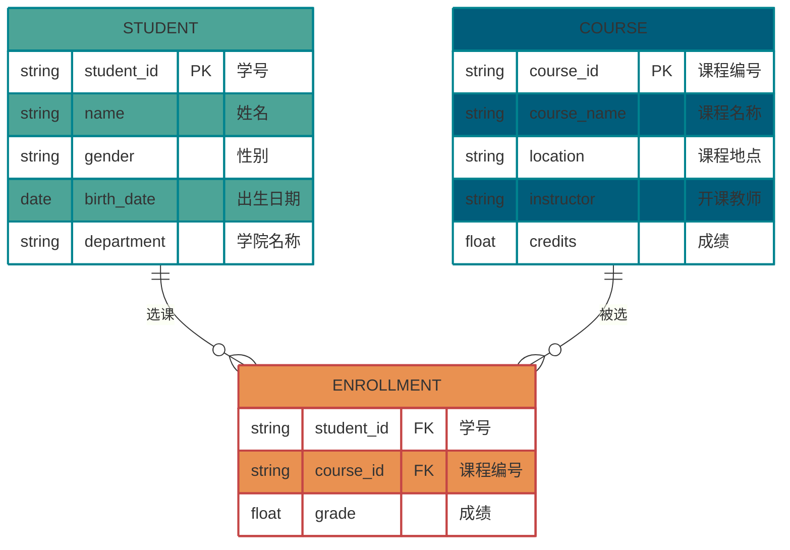
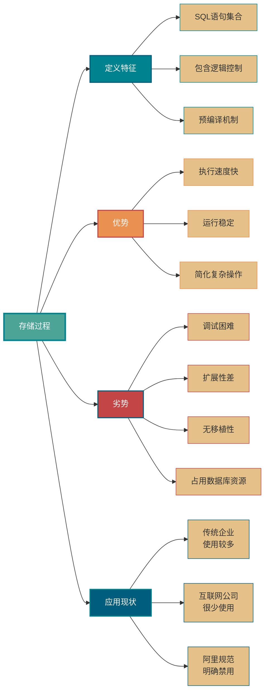
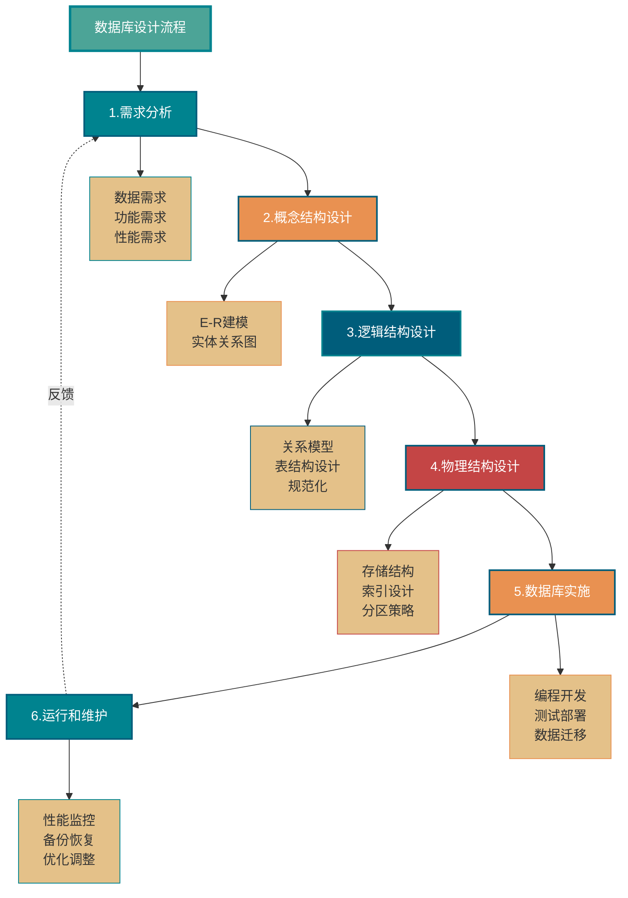

<!-- @include: @small-advertisement.snippet.md -->

数据库知识基础，这部分内容一定要理解记忆。虽然这部分内容只是理论知识，但是非常重要，这是后面学习 MySQL 数据库的基础。PS: 这部分内容由于涉及太多概念性内容，所以参考了维基百科和百度百科相应的介绍。

## 什么是数据库, 数据库管理系统, 数据库系统, 数据库管理员?

这四个概念描述了从数据本身到管理整个体系的不同层次，我们常用一个图书馆的例子来把它们串联起来理解。

- **数据库 (Database - DB):** 它就像是图书馆里，书架上存放的所有书籍和资料。从技术上讲，数据库就是按照一定数据模型组织、描述和储存起来的、可以被各种用户共享的结构化数据的集合。它就是我们最终要存取的核心——信息本身。
- **数据库管理系统 (Database Management System - DBMS):** 它就像是整个图书馆的管理系统，包括图书的分类编目规则、借阅归还流程、安全检查系统等等。从技术上讲，DBMS 是一种大型软件，比如我们常用的 MySQL、Oracle、PostgreSQL 软件。它的核心职责是科学地组织和存储数据、高效地获取和维护数据；为我们屏蔽了底层文件操作的复杂性，提供了一套标准接口（如 SQL）来操纵数据，并负责并发控制、事务管理、权限控制等复杂问题。
- **数据库系统 (Database System - DBS):** 它就是整个正常运转的图书馆。这是一个更大的概念，不仅包括书(DB)和管理系统(DBMS)，还包括了硬件、应用和使用的人。
- **数据库管理员 (Database Administrator - DBA ):** 他就是图书馆的馆长，负责整个数据库系统正常运行。他的职责非常广泛，包括数据库的设计、安装、监控、性能调优、备份与恢复、安全管理等等，确保整个系统的稳定、高效和安全。

DB 和 DBMS 我们通常会搞混，这里再简单提一下：**通常我们说“用 MySQL 数据库”，其实是用 MySQL（DBMS）来管理一个或多个数据库（DB）。**

## DBMS 有哪些主要的功能

DBMS 通常提供四大核心功能：

1. **数据定义：** 这是 DBMS 的基础。它提供了一套数据定义语言（Data Definition Language - DDL），让我们能够创建、修改和删除数据库中的各种对象。这不仅仅是定义表的结构（比如字段名、数据类型），还包括定义视图、索引、触发器、存储过程等。
2. **数据操作：** 这是我们作为开发者日常使用最多的功能。它提供了一套数据操作语言（Data Manipulation Language - DML），核心就是我们熟悉的增、删、改、查（CRUD）操作。它让我们能够方便地对数据库中的数据进行操作和检索。
3. **数据控制：** 这是保证数据正确、安全、可靠的关键。通常包含并发控制、事务管理、完整性约束、权限控制、安全性限制等功能。
4. **数据库维护：** 这部分功能是为了保障数据库系统的长期稳定运行。它包括了数据的导入导出、数据库的备份与恢复、性能监控与分析、以及系统日志管理等。

## 你知道哪些类型的 DBMS？

### 关系型数据库

除了我们最常用的关系型数据库（RDBMS），比如 MySQL（开源首选）、PostgreSQL（功能最全）、Oracle（企业级），它们基于严格的表结构和 SQL，非常适合结构化数据和需要事务保证的场景，例如银行交易、订单系统。

近年来，为了应对互联网应用带来的海量数据、高并发和多样化数据结构的需求，涌现出了一大批 NoSQL 和 NewSQL 数据库。

### NoSQL 数据库

它们的共同特点是为了极致的性能和水平扩展能力，在某些方面（通常是事务）做了妥协。

**1. 键值数据库，代表是 Redis。**

- **特点：** 数据模型极其简单，就是一个巨大的 Map，通过 Key 来存取 Value。内存操作，性能极高。
- **适用场景：** 非常适合做缓存、会话存储、计数器等对读写性能要求极高的场景。

**2. 文档数据库，代表是 MongoDB。**

- **特点：** 它存储的是半结构化的文档（比如 JSON/BSON），结构灵活，不需要预先定义表结构。
- **适用场景：** 特别适合那些数据结构多变、快速迭代的业务，比如用户画像、内容管理系统、日志存储等。

**3. 列式数据库，代表是 HBase, Cassandra。**

- **特点：** 数据是按列族而不是按行来存储的。这使得它在对大量行进行少量列的读取时，性能极高。
- **适用场景：** 专为海量数据存储和分析设计，非常适合做大数据分析、监控数据存储、推荐系统等需要高吞吐量写入和范围扫描的场景。

**4. 图形数据库，代表是 Neo4j。**

- **特点：** 数据模型是节点（Nodes）和边（Edges），专门用来存储和查询实体之间的复杂关系。
- **适用场景：** 在社交网络（好友关系）、推荐引擎（用户-商品关系）、知识图谱、欺诈检测（资金流动关系）等场景下，表现远超关系型数据库。

### NewSQL 数据库

由于 NoSQL 不支持事务，很多对于数据安全要求非常高的系统（比如财务系统、订单系统、交易系统）就不太适合使用了。不过，这类系统往往有存储大量数据的需求。

这些系统往往只能通过购买性能更强大的计算机，或者通过数据库中间件来提高存储能力。不过，前者的金钱成本太高，后者的开发成本太高。

于是，**NewSQL** 就来了！

简单来说，NewSQL 就是：**分布式存储+SQL+事务** 。NewSQL 不仅具有 NoSQL 对海量数据的存储管理能力，还保持了传统数据库支持 ACID 和 SQL 等特性。因此，NewSQL 也可以称为 **分布式关系型数据库**。

NewSQL 数据库设计的一些目标：

1. 横向扩展（Scale Out） ： 通过增加机器的方式来提高系统的负载能力。与之类似的是 Scale Up(纵向扩展)，升级硬件设备的方式来提高系统的负载能力。
2. 强一致性（Strict Consistency）：在任意时刻，所有节点中的数据是一样的。
3. 高可用（High Availability）：系统几乎可以一直提供服务。
4. 支持标准 SQL（Structured Query Language） ：PostgreSQL、MySQL、Oracle 等关系型数据库都支持 SQL 。
5. 事务（ACID） ： 原子性（Atomicity）、一致性（Consistency）、 隔离性（Isolation）; 持久性（Durability）。
6. 兼容主流关系型数据库 ： 兼容 MySQL、Oracle、PostgreSQL 等常用关系型数据库。
7. 云原生 （Cloud Native）：可在公有云、私有云、混合云中实现部署工具化、自动化。
8. HTAP（Hybrid Transactional/Analytical Processing） ：支持 OLTP 和 OLAP 混合处理。

NewSQL 数据库代表：Google 的 F1/Spanner、阿里的 [OceanBase](https://open.oceanbase.com/)、PingCAP 的 [TiDB](https://pingcap.com/zh/product-community/) 。

## 什么是元组, 码, 候选码, 主码, 外码, 主属性, 非主属性？

在关系型数据库理论中，理解元组、码、候选码、主码、外码、主属性和非主属性这些核心概念，对于数据库设计和规范化至关重要。这些概念构成了关系数据库的理论基础。

### 基础概念

- **元组（Tuple）：** 元组是关系数据库中的基本单位，在二维表中对应一行记录。每个元组包含了一个实体的完整信息。例如，在学生表中，每个学生的完整信息（学号、姓名、年龄等）构成一个元组。
- **码（Key）：** 码是能够唯一标识关系中元组的一个或多个属性的集合。码的主要作用是保证数据的唯一性和完整性。

### 码的分类

- **候选码（Candidate Key）：** 候选码是能够唯一标识元组的最小属性集合，其任何真子集都不能唯一标识元组。一个关系可能有多个候选码。例如，在学生表中，如果"学号"能唯一标识学生，同时"身份证号"也能唯一标识学生，那么{学号}和{身份证号}都是候选码。
- **主码/主键（Primary Key）：** 主码是从候选码中选择的一个，用于唯一标识关系中的元组。每个关系只能有一个主码，但可以有多个候选码。选择主码时通常考虑：简单性、稳定性、无业务含义等因素。
- **外码/外键（Foreign Key）：** 外码是一个关系中的属性或属性组，它对应另一个关系的主码。外码用于建立和维护两个关系之间的联系，是实现参照完整性的重要机制。例如，在选课表中的"学号"如果引用学生表的主码"学号"，则选课表中的"学号"就是外码。

### 属性分类

- **主属性（Prime Attribute）：** 主属性是包含在任何一个候选码中的属性。如果一个关系有多个候选码，那么这些候选码中出现的所有属性都是主属性。例如，工人关系（工号，身份证号，姓名，性别，部门）中，如果{工号}和{身份证号}都是候选码，那么"工号"和"身份证号"都是主属性。
- **非主属性（Non-prime Attribute）：** 非主属性是不包含在任何候选码中的属性。这些属性完全依赖于候选码来确定其值。在上述工人关系中，"姓名"、"性别"、"部门"都是非主属性。

## 什么是 ER 图？

我们做一个项目的时候一定要试着画 ER 图来捋清数据库设计，这个也是面试官问你项目的时候经常会被问到的。

**ER 图** 全称是 Entity Relationship Diagram（实体联系图），提供了表示实体类型、属性和联系的方法。

ER 图由下面 3 个要素组成：

- **实体**：通常是现实世界的业务对象，当然使用一些逻辑对象也可以。比如对于一个校园管理系统，会涉及学生、教师、课程、班级等等实体。在 ER 图中，实体使用矩形框表示。
- **属性**：即某个实体拥有的属性，属性用来描述组成实体的要素，对于产品设计来说可以理解为字段。在 ER 图中，属性使用椭圆形表示。
- **联系**：即实体与实体之间的关系，在 ER 图中用菱形表示，这个关系不仅有业务关联关系，还能通过数字表示实体之间的数量对照关系。例如，一个班级会有多个学生就是一种实体间的联系。

下图是一个学生选课的 ER 图，每个学生可以选若干门课程，同一门课程也可以被若干人选择，所以它们之间的关系是多对多（M: N）。另外，还有其他两种实体之间的关系是：1 对 1（1:1）、1 对多（1: N）。

## 数据库范式了解吗?

数据库范式有 3 种：

- 1NF(第一范式)：属性不可再分。
- 2NF(第二范式)：1NF 的基础之上，消除了非主属性对于码的部分函数依赖。
- 3NF(第三范式)：3NF 在 2NF 的基础之上，消除了非主属性对于码的传递函数依赖 。

### 1NF(第一范式)

属性（对应于表中的字段）不能再被分割，也就是这个字段只能是一个值，不能再分为多个其他的字段了。**1NF 是所有关系型数据库的最基本要求** ，也就是说关系型数据库中创建的表一定满足第一范式。

### 2NF(第二范式)

2NF 在 1NF 的基础之上，消除了非主属性对于码的部分函数依赖。如下图所示，展示了第一范式到第二范式的过渡。第二范式在第一范式的基础上增加了一个列，这个列称为主键，非主属性都依赖于主键。

一些重要的概念：

- **函数依赖（functional dependency）**：若在一张表中，在属性（或属性组）X 的值确定的情况下，必定能确定属性 Y 的值，那么就可以说 Y 函数依赖于 X，写作 X → Y。
- **部分函数依赖（partial functional dependency）**：如果 X→Y，并且存在 X 的一个真子集 X0，使得 X0→Y，则称 Y 对 X 部分函数依赖。比如学生基本信息表 R 中（学号，身份证号，姓名）当然学号属性取值是唯一的，在 R 关系中，（学号，身份证号）->（姓名），（学号）->（姓名），（身份证号）->（姓名）；所以姓名部分函数依赖于（学号，身份证号）；
- **完全函数依赖(Full functional dependency)**：在一个关系中，若某个非主属性数据项依赖于全部关键字称之为完全函数依赖。比如学生基本信息表 R（学号，班级，姓名）假设不同的班级学号有相同的，班级内学号不能相同，在 R 关系中，（学号，班级）->（姓名），但是（学号）->(姓名)不成立，（班级）->(姓名)不成立，所以姓名完全函数依赖与（学号，班级）；
- **传递函数依赖**：在关系模式 R(U)中，设 X，Y，Z 是 U 的不同的属性子集，如果 X 确定 Y、Y 确定 Z，且有 X 不包含 Y，Y 不确定 X，（X∪Y）∩Z=空集合，则称 Z 传递函数依赖(transitive functional dependency) 于 X。传递函数依赖会导致数据冗余和异常。传递函数依赖的 Y 和 Z 子集往往同属于某一个事物，因此可将其合并放到一个表中。比如在关系 R(学号 , 姓名, 系名，系主任)中，学号 → 系名，系名 → 系主任，所以存在非主属性系主任对于学号的传递函数依赖。

### 3NF(第三范式)

3NF 在 2NF 的基础之上，消除了非主属性对于码的传递函数依赖 。符合 3NF 要求的数据库设计，**基本**上解决了数据冗余过大，插入异常，修改异常，删除异常的问题。比如在关系 R(学号 , 姓名, 系名，系主任)中，学号 → 系名，系名 → 系主任，所以存在非主属性系主任对于学号的传递函数依赖，所以该表的设计，不符合 3NF 的要求。

## 主键和外键有什么区别?

从定义和属性上看，它们的区别是：

- **主键 (Primary Key):** 它的核心作用是唯一标识表中的每一行数据。因此，主键列的值必须是唯一的 (Unique) 且不能为空 (Not Null)。一张表只能有一个主键。主键保证了实体完整性。
- **外键 (Foreign Key):** 它的核心作用是建立并强制两张表之间的关联关系。一张表中的外键列，其值必须对应另一张表中某行的主键值（或者是一个 NULL 值）。因此，外键的值可以重复，也可以为空。一张表可以有多个外键，分别关联到不同的表。外键保证了引用完整性。

用一个简单的电商例子来说明：假设我们有两张表：`users` (用户表) 和 `orders` (订单表)。

- 在 `users` 表中，`user_id` 列是**主键**。每个用户的 `user_id` 都是独一无二的，我们用它来区分张三和李四。
- 在 `orders` 表中，`order_id` 是它自己的**主键**。同时，它会有一个 `user_id` 列，这个列就是一个**外键**，它引用了 `users` 表的 `user_id` 主键。

这个外键约束就保证了：

1. 你不能创建一个不属于任何已知用户的订单（ `user_id` 在 `users` 表中不存在）。
2. 你不能删除一个已经下了订单的用户（除非设置了级联删除等特殊规则）。

## 为什么不推荐使用外键与级联？

对于外键和级联，阿里巴巴开发手册这样说到：

> 【强制】不得使用外键与级联，一切外键概念必须在应用层解决。
>
> 说明: 以学生和成绩的关系为例，学生表中的 student_id 是主键，那么成绩表中的 student_id 则为外键。如果更新学生表中的 student_id，同时触发成绩表中的 student_id 更新，即为级联更新。外键与级联更新适用于单机低并发，不适合分布式、高并发集群；级联更新是强阻塞，存在数据库更新风暴的风险；外键影响数据库的插入速度

为什么不要用外键呢？大部分人可能会这样回答：

1. **增加了复杂性：** a. 每次做 DELETE 或者 UPDATE 都必须考虑外键约束，会导致开发的时候很痛苦, 测试数据极为不方便; b. 外键的主从关系是定的，假如哪天需求有变化，数据库中的这个字段根本不需要和其他表有关联的话就会增加很多麻烦。
2. **增加了额外工作**：数据库需要增加维护外键的工作，比如当我们做一些涉及外键字段的增，删，更新操作之后，需要触发相关操作去检查，保证数据的一致性和正确性，这样会不得不消耗数据库资源。如果在应用层面去维护的话，可以减小数据库压力；
3. **对分库分表不友好**：因为分库分表下外键是无法生效的。
4. ……

我个人觉得上面这种回答不是特别的全面，只是说了外键存在的一个常见的问题。实际上，我们知道外键也是有很多好处的，比如：

1. 保证了数据库数据的一致性和完整性；
2. 级联操作方便，减轻了程序代码量；
3. ……

所以说，不要一股脑的就抛弃了外键这个概念，既然它存在就有它存在的道理，如果系统不涉及分库分表，并发量不是很高的情况还是可以考虑使用外键的。

## 什么是存储过程?

存储过程是数据库中预编译的SQL语句集合，它将多条SQL语句和程序逻辑控制语句（如IF-ELSE、WHILE循环等）封装在一起，形成一个可重复调用的数据库对象。

**存储过程的优势：**

在传统企业级应用中，存储过程具有一定的实用价值。当业务逻辑复杂时，需要执行大量SQL语句才能完成一个业务操作，此时可以将这些语句封装成存储过程，简化调用过程。由于存储过程在创建时就已经编译并存储在数据库中，执行时无需重新编译，因此相比动态SQL语句具有更好的执行性能。同时，一旦存储过程调试完成，其运行相对稳定可靠。

**存储过程的局限性：**

然而，在现代互联网架构中，存储过程的使用越来越少。主要原因包括：调试困难，缺乏成熟的调试工具；扩展性差，修改业务逻辑需要直接修改数据库对象；移植性差，不同数据库系统的存储过程语法差异较大；占用数据库资源，增加数据库服务器负担；版本管理困难，不便于进行代码版本控制。

**行业规范：**

基于以上原因，许多互联网公司的开发规范中明确限制或禁止使用存储过程。例如，《阿里巴巴Java开发手册》中明确规定禁止使用存储过程，推荐将业务逻辑放在应用层实现，保持数据库的简单和高效。

## DROP、DELETE、TRUNCATE 有什么区别？

在数据库操作中，`DROP`、`DELETE` 和 `TRUNCATE` 是三个常用的数据删除命令，它们在功能、性能和使用场景上存在显著差异。

**DROP命令：**

- 语法：`DROP TABLE 表名`
- 作用：完全删除整个表，包括表结构、数据、索引、触发器、约束等所有相关对象
- 使用场景：当表不再需要时使用

**TRUNCATE命令：**

- 语法：`TRUNCATE TABLE 表名`
- 作用：清空表中所有数据，但保留表结构
- 特点：自增长字段（AUTO_INCREMENT）会重置为初始值（通常为1）
- 使用场景：需要快速清空表数据但保留表结构时使用

**DELETE命令：**

- 语法：`DELETE FROM 表名 WHERE 条件`
- 作用：删除满足条件的数据行，不带WHERE子句时删除所有数据
- 特点：自增长字段不会重置，继续从之前的值递增
- 使用场景：需要有选择地删除部分数据时使用

`TRUNCATE` 和不带 `WHERE`子句的 `DELETE`、以及 `DROP` 都会删除表内的数据，但是 **`TRUNCATE` 和 `DELETE` 只删除数据不删除表的结构(定义)，执行 `DROP` 语句，此表的结构也会删除，也就是执行`DROP` 之后对应的表不复存在。**

### 对表结构的影响

- `DROP`：删除表结构和所有数据，表将不复存在
- `TRUNCATE`：仅删除数据，保留表结构和定义
- `DELETE`：仅删除数据，保留表结构和定义

### 触发器

- `DELETE` 操作会触发相关的DELETE触发器
- `TRUNCATE` 和 `DROP` 不会触发DELETE触发器

### 事务和回滚

- `DROP` 和 `TRUNCATE` 属于DDL操作，执行后立即生效，不能回滚
- `DELETE` 属于DML操作，可以回滚（在事务中）

### 执行速度

一般来说：`DROP` > `TRUNCATE` > `DELETE`（这个我没有实际测试过）。

- `DELETE`命令执行的时候会产生数据库的`binlog`日志，而日志记录是需要消耗时间的，但是也有个好处方便数据回滚恢复。
- `TRUNCATE`命令执行的时候不会产生数据库日志，因此比`DELETE`要快。除此之外，还会把表的自增值重置和索引恢复到初始大小等。
- `DROP`命令会把表占用的空间全部释放掉。

Tips：你应该更多地关注在使用场景上，而不是执行效率。

## DML 语句和 DDL 语句区别是？

- DML 是数据库操作语言（Data Manipulation Language）的缩写，是指对数据库中表记录的操作，主要包括表记录的插入、更新、删除和查询，是开发人员日常使用最频繁的操作。
- DDL （Data Definition Language）是数据定义语言的缩写，简单来说，就是对数据库内部的对象进行创建、删除、修改的操作语言。它和 DML 语言的最大区别是 DML 只是对表内部数据的操作，而不涉及到表的定义、结构的修改，更不会涉及到其他对象。DDL 语句更多的被数据库管理员（DBA）所使用，一般的开发人员很少使用。

另外，由于`SELECT`不会对表进行破坏，所以有的地方也会把`SELECT`单独区分开叫做数据库查询语言 DQL（Data Query Language）。

## 数据库设计通常分为哪几步?

### 1. 需求分析阶段

**目标：** 深入了解和分析用户需求，明确系统边界
**主要工作：**

- 收集和分析数据需求：确定需要存储哪些数据，数据量大小，数据更新频率
- 明确功能需求：系统需要支持哪些业务操作，各操作的优先级
- 定义性能需求：响应时间要求，并发用户数，数据吞吐量
- 确定安全需求：数据访问权限，加密要求，审计要求
  **产出物：** 需求规格说明书、数据字典初稿

### 2. 概念结构设计阶段

**目标：** 将需求转化为信息世界的概念模型
**主要工作：**

- 识别实体：确定系统中的主要对象
- 定义属性：明确每个实体的特征
- 建立联系：确定实体之间的关系（一对一、一对多、多对多）
- 绘制E-R图（实体-关系图）
  **产出物：** E-R图、概念数据模型文档

### 3. 逻辑结构设计阶段

**目标：** 将概念模型转换为特定DBMS支持的逻辑模型
**主要工作：**

- E-R图向关系模型转换：将实体转换为表，属性转换为字段
- 规范化处理：通过范式化消除数据冗余和更新异常（通常达到3NF）
- 定义完整性约束：主键、外键、唯一性约束、检查约束
- 优化模型：根据性能需求进行适当的反规范化
  **产出物：** 逻辑数据模型、表结构设计文档

### 4. 物理结构设计阶段

**目标：** 确定数据的物理存储方案和访问方法
**主要工作：**

- 选择存储引擎：如MySQL的InnoDB、MyISAM等
- 设计索引策略：确定需要建立的索引类型和字段
- 分区设计：对大表进行分区以提高性能
- 确定存储参数：表空间大小、数据文件位置、缓冲区配置
- 制定备份策略：全量备份、增量备份的频率和方式
  **产出物：** 物理设计文档、索引设计方案

### 5. 数据库实施阶段

**目标：** 将设计转化为实际运行的数据库系统
**主要工作：**

- 创建数据库和表结构：编写和执行DDL语句
- 开发存储过程和触发器（如需要）
- 编写应用程序接口
- 导入初始数据
- 系统集成测试：功能测试、性能测试、压力测试
- 用户培训和文档编写
  **产出物：** 数据库脚本、测试报告、用户手册

### 6. 运行和维护阶段

**目标：** 确保数据库系统稳定高效运行
**主要工作：**

- 日常监控：性能监控、空间监控、错误日志分析
- 性能优化：查询优化、索引调整、参数调优
- 数据备份和恢复：定期备份、恢复演练
- 安全管理：权限管理、安全补丁更新、审计
- 容量规划：预测数据增长，提前扩容
- 变更管理：需求变更的评估和实施
  **产出物：** 运维报告、优化方案、变更记录

### 设计原则

在整个设计过程中应遵循：数据独立性原则、完整性原则、安全性原则、可扩展性原则和标准化原则。

## 参考

- <https://blog.csdn.net/rl529014/article/details/48391465>
- <https://www.zhihu.com/question/24696366/answer/29189700>
- <https://blog.csdn.net/bieleyang/article/details/77149954>

<!-- @include: @article-footer.snippet.md -->
