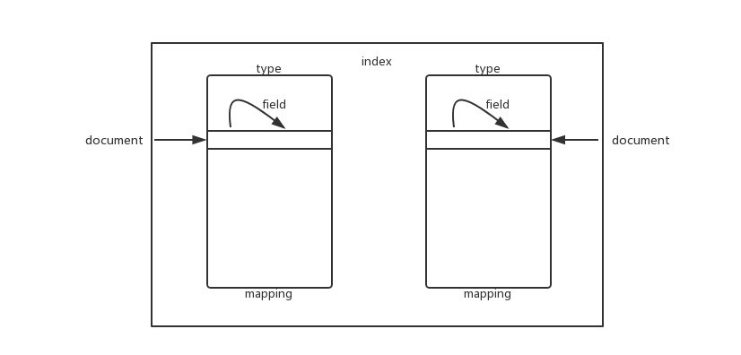
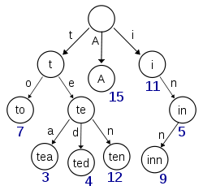
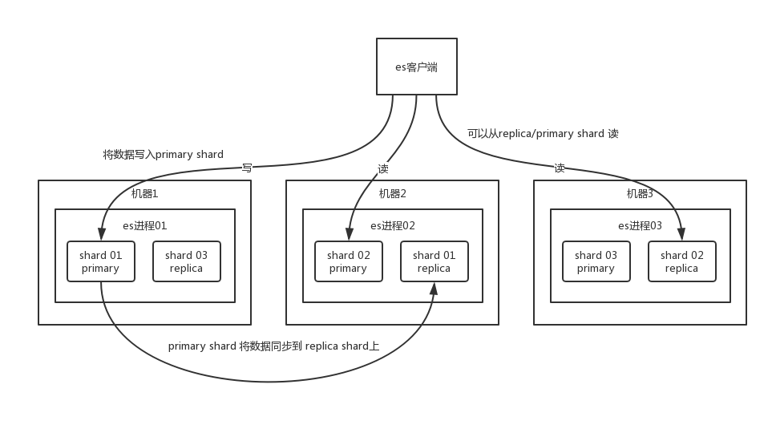
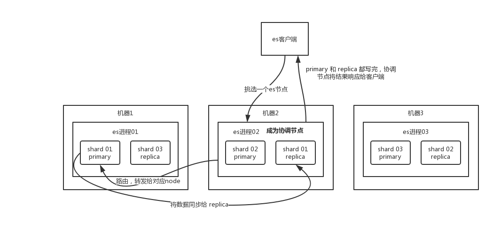
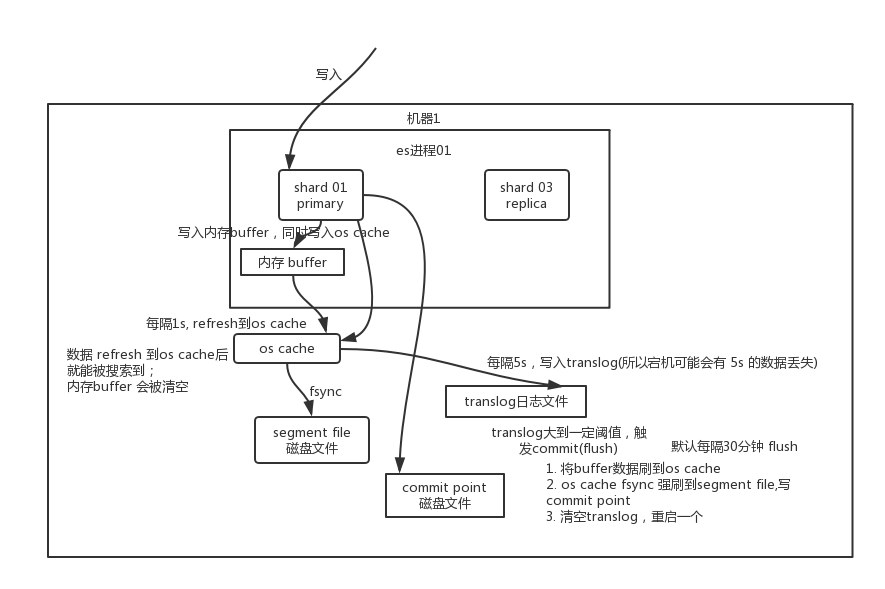

# 入门

## 基本概念

一个 es 集群可以包含多个索引（index），每个 index 可以包含多个类型（type，7.x 版本已被移除），每种 type 存储着多个文档（document），每个 document 有多种字段（field）。

```
index -> type -> document -> field
```

1. **index**：es 中存储数据的基本单位。
2. **type**：index 里可以划分不同的 type 存储不同类型的数据（如：order_index，划分两种 type：实物商品订单、虚拟商品订单），不同 type 里的字段大部分相同，少部分不一样。可以针对每个 type 建立不同的 mapping type。
3. **document**：索引里的一条数据，包含多个 field。
4. **field**：存储每个字段的值。




### 倒排索引

#### 构成

```
term index -> term dictionay -> posting list
```

每个 term 有自己的倒排索引结构，posting list 是一个 int 的数组，存储了所有符合某个 term 的文档 id。

term dictionary 存储排序后的 term 数据，这样可以使用二分查找的方式查找 term。有了 term dictionary 之后，可以用 logN 次磁盘查找得到目标。但是磁盘的随机读操作仍然是非常昂贵的（一次 random access 大概需要 10ms 的时间）。所以为了尽量少的读磁盘，有必要把一些数据缓存到内存里。但是整个 term dictionary 本身又太大了，无法完整地放到内存里。于是就有了 term index。term index 有点像一本字典的大的章节表。比如：

```
A 开头的 term ……………. Xxx 页
C 开头的 term ……………. Xxx 页
E 开头的 term ……………. Xxx 页
```

实际的 term index 是一棵 trie 树，缓存在内存中。从 term index 查到对应的 term dictionary 的 block 位置之后，再去磁盘上找 term，大大减少了磁盘的 random access 次数。：




例子是一个包含 "A", "to", "tea", "ted", "ten", "i", "in", 和 "inn" 的 trie 树。这棵树不会包含所有的 term，它包含的是 term 的一些前缀。通过 term index 可以快速地定位到 term dictionary 的某个 offset，然后从这个位置再往后顺序查找。再加上一些压缩技术（Lucene Finite State Transducers），term index 的尺寸可以只有所有 term 的尺寸的几十分之一，使得用内存缓存整个 term index 变成可能。整体上来说就是这样的效果。


## 集群

es 集群多个节点，会自动选举一个节点为 master 节点，这个 master 节点其实就是干一些管理的工作的，比如维护索引元数据、负责切换 primary shard 和 replica shard 身份等。要是 master 节点宕机了，那么会重新选举一个节点为 master 节点。

如果是非 master节点宕机了，那么会由 master 节点，让宕机节点上的 primary shard 转移到其他机器上的 replica shard。接着你要是修复了那个宕机机器，master 节点会控制将缺失的 replica shard 分配过去，同步后续修改的数据之类的，让集群恢复正常。

说得更简单一点，就是说如果某个非 master 节点宕机了。那么此节点上的 primary shard 不就没了。那好，master 会让 primary shard 对应的 replica shard（在其他机器上）切换为 primary shard。如果宕机的机器修复了，修复后的节点也不再是 primary shard，而是 replica shard。


### shard 与 replica

每个 index 被拆分成多个 `shard`，每个 shard 存储部分数据。拆分 shard 的好处是：1. **支持横向扩展**，每个 shard 存储到不同的节点上；2. **提搞性能**，数据分布在多个 shard，即多台服务器上，所有的操作，都会在多台机器上并行分布式执行，提高了吞吐量和性能。

每个 shard 有多个 `replica`，1 个 `primary shard` 和多个 `replica shard`。primary shard 写入数据之后，会将数据同步到其他几个 replica shard 上去。





## 数据读写

### 数据写入

* 客户端选择一个 node 发送请求过去，这个 node 就是 coordinating node（协调节点）。
* coordinating node 对 document 进行路由（可以自己指定_routing，也可以在 Mapping 指定文档中的 Field 值作为_routing。如果没有指定 _routing，则会把 _id 作为 _routing 进行计算），将请求转发给 primary shard 对应的 node。
* 实际的 node 上的 primary shard 处理请求，然后将数据同步到 replica node。
* coordinating node 如果发现 primary node 和所有 replica node 都搞定之后，就返回响应结果给客户端。

数据写入的底层原理，见 [数据写入底层原理](#数据写入底层原理)




### 数据读取

#### 单个 doc 查询

可以通过 doc id 来查询，会根据 doc id 进行 hash，判断出来当时把 doc id 分配到了哪个 shard 上面去，从那个 shard 去查询。

* 客户端发送请求到任意一个 node，这个 node 成为 coordinating node。
* coordinating node 对 doc id 进行哈希路由，将请求转发到对应的 node，此时会使用 `round-robin` 随机轮询算法，在 primary shard 以及其所有 replica 中随机选择一个，让读请求负载均衡。
* 接收请求的 node 返回 document 给 coordinating node。
* coordinating node 返回 document 给客户端。


#### 搜索数据

* 客户端发送请求到一个 coordinating node。
* coordinating node 将搜索请求转发到所有的 shard 对应的 primary shard 或 replica shard。
* query phase：每个 shard 将自己的搜索结果（其实就是一些 doc id）返回给 coordinating node，由 coordinating node 进行数据的合并、排序、分页等操作，产出最终结果。
* fetch phase：接着由 coordinating node 根据 doc id 去各个节点上拉取实际的 document 数据，最终返回给客户端。


也就是，搜索数据时，首先查询出所有符合查询条件的 doc id，然后再走 doc id 查询方式得到实际数据。这个思路和 mysql 的`辅助索引`类似。


#### 数据写入底层原理



primary shard 先将数据写入内存 `buffer`，此时数据是搜索不到的；同时将数据写入 `translog` 日志文件。

如果 buffer 快满了，或者到一定时间，就会将内存 buffer 数据 `refresh` 到一个新的 `segment file` 中，但是此时数据不是直接进入 segment file 磁盘文件，而是先进入 `os cache`。这个过程就是 refresh。

每隔 1 秒钟，es 将 buffer 中的数据写入一个新的 segment file，每秒钟会产生一个新的磁盘文件 segment file，这个 segment file 中就存储最近 1 秒内 buffer 中写入的数据。

但是如果 buffer 里面此时没有数据，那当然不会执行 refresh 操作，如果 buffer 里面有数据，默认 1 秒钟执行一次 refresh 操作，刷入一个新的 segment file 中。

操作系统里面，磁盘文件其实都有一个东西，叫做 os cache，即操作系统缓存，就是说数据写入磁盘文件之前，会先进入 os cache，先进入操作系统级别的一个内存缓存中去。只要 buffer 中的数据被 refresh 操作刷入 os cache 中，这个数据就可以被搜索到了。

为什么叫 es 是准实时的？ `NRT`，全称 `near real-time`。默认是每隔 1 秒 refresh 一次的，所以 es 是准实时的，因为写入的数据 1 秒之后才能被看到。可以通过 es 的 restful api 或者 java api，手动执行一次 refresh 操作，就是手动将 buffer 中的数据刷入 os cache中，让数据立马就可以被搜索到。只要数据被输入 os cache 中，buffer 就会被清空了，因为不需要保留 buffer 了，数据在 translog 里面已经持久化到磁盘去一份了。

重复上面的步骤，新的数据不断进入 buffer 和 translog，不断将 buffer 数据写入一个又一个新的 segment file 中去，每次 refresh 完 buffer 清空，translog 保留。随着这个过程推进，translog 会变得越来越大。当 translog 达到一定长度的时候，就会触发 `commit` 操作。

commit 操作发生第一步，就是将 buffer 中现有数据 refresh 到 os cache 中去，清空 buffer。然后，将一个 `commit point` 写入磁盘文件，里面标识着这个 commit point 对应的所有 segment file，同时强行将 os cache 中目前所有的数据都 `fsync` 到磁盘文件中去。最后清空现有 translog 日志文件，重启一个 translog，此时 commit 操作完成。

这个 commit 操作叫做 flush。默认 30 分钟自动执行一次 flush，但如果 translog 过大，也会触发 flush。flush 操作就对应着 commit 的全过程，我们可以通过 es api，手动执行 flush 操作，手动将 os cache 中的数据 fsync 强刷到磁盘上去。

translog 日志文件的作用是什么？你执行 commit 操作之前，数据要么是停留在 buffer 中，要么是停留在 os cache 中，无论是 buffer 还是 os cache 都是内存，一旦这台机器死了，内存中的数据就全丢了。所以需要将数据对应的操作写入一个专门的日志文件 translog 中，一旦此时机器宕机，再次重启的时候，es 会自动读取 translog 日志文件中的数据，恢复到内存 buffer 和 os cache 中去。

translog 其实也是先写入 os cache 的，默认每隔 5 秒刷一次到磁盘中去，所以默认情况下，可能有 5 秒的数据会仅仅停留在 buffer 或者 translog 文件的 os cache 中，如果此时机器挂了，会丢失 5 秒钟的数据。但是这样性能比较好，`最多丢 5 秒的数据`。也可以将 translog 设置成每次写操作必须是直接 fsync 到磁盘，但是性能会差很多。

总结一下，数据先写入内存 buffer，然后每隔 1s，将数据 refresh 到 os cache，到了 os cache 数据就能被搜索到（所以我们才说 es 从写入到能被搜索到，中间有 1s 的延迟）。每隔 5s，将数据写入 translog 文件（这样如果机器宕机，内存数据全没，最多会有 5s 的数据丢失），translog 大到一定程度，或者默认每隔 30 mins，会触发 commit 操作，将缓冲区的数据都 flush 到 segment file 磁盘文件中。

数据写入 segment file 之后，同时就建立好了倒排索引。


#### 删除/更新数据底层原理

如果是删除操作，commit 的时候会生成一个 .del 文件，里面将某个 doc 标识为 deleted 状态，那么搜索的时候根据 .del 文件就知道这个 doc 是否被删除了。

如果是更新操作，就是将原来的 doc 标识为 deleted 状态，然后新写入一条数据。

buffer 每 refresh 一次，就会产生一个 segment file，所以默认情况下是 1 秒钟一个 segment file，这样下来 segment file 会越来越多，此时会定期执行 merge。每次 merge 的时候，会将多个 segment file 合并成一个，同时这里会将标识为 deleted 的 doc 给物理删除掉，然后将新的 segment file 写入磁盘，这里会写一个 commit point，标识所有新的 segment file，然后打开 segment file 供搜索使用，同时删除旧的 segment file。