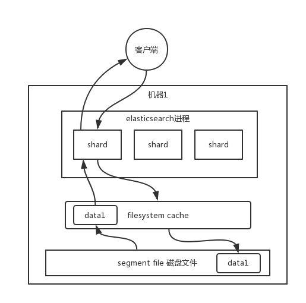

# 面试题

## 大数据量（数十亿级别）下如何提高查询效率？

摘录自：https://github.com/doocs/advanced-java/blob/master/docs/high-concurrency/es-optimizing-query-performance.md

### filesystem cache 优化

你往 es 里写的数据，实际上都写到磁盘文件里去了，查询的时候，操作系统会将磁盘文件里的数据自动缓存到 `filesystem cache` 里面去。

es 的搜索引擎严重依赖于底层的 filesystem cache，你如果给 filesystem cache 更多的内存，尽量让内存可以容纳所有的索引数据文件，那么你搜索的时候就基本都是走内存的，性能会非常高。

性能差距究竟可以有多大？我们之前很多的测试和压测，如果走磁盘一般肯定上秒，搜索性能绝对是秒级别的，1秒、5秒、10秒。但如果是走 filesystem cache，是走纯内存的，那么一般来说性能比走磁盘要高一个数量级，基本上就是毫秒级的，从几毫秒到几百毫秒不等。

最佳的情况下，就是你的机器的内存，至少可以容纳你的总数据量的一半。

索引里的字段，应尽可能是必要的。单条数据的数据量越少，会 filesystem cache 能缓存的数据量就越多。可采用 es + 辅助存储（hbase/mysql）的方案，从 es 查询查 doc id 结果集，然后到辅助存储里查询完整的数据。

### 数据预热

对于经常被访问的数据，可以提前加载到 filesystem cache 中。实际就是可以通过一些技术手段，触发热数据提前加载。

### 冷热分离

冷、热数据分别写入到不同的索引里，让热数据的索引尽可能保留在 filesystem cache 里。比如，可以使用 es 7，x 版本的 rollup 机制，将过期的索引数据迁移到冷节点机器上，或者直接删除索引。

### document 模型优化

尽量不要在 es 做复杂的关联查询，如果存在这种场景，尽量在应用层做好关联，将关联好的数据写入 es。join/nested/parent-child 搜索也要尽量避免。

### 分页优化

es 的分页是较坑的，为啥呢？举个例子吧，假如你每页是 10 条数据，你现在要查询第 100 页，实际上是会把每个 shard 上存储的前 1000 条数据都查到一个协调节点上，如果你有个 5 个 shard，那么就有 5000 条数据，接着协调节点对这 5000 条数据进行一些合并、处理，再获取到最终第 100 页的 10 条数据。

所以用 es 做分页的时候，你会发现越翻到后面，就越是慢。

解决办法就是，不要允许深度分页。可以使用 `scroll api`，一页一页地加载数据，而不允许随意跳转到任何一页。