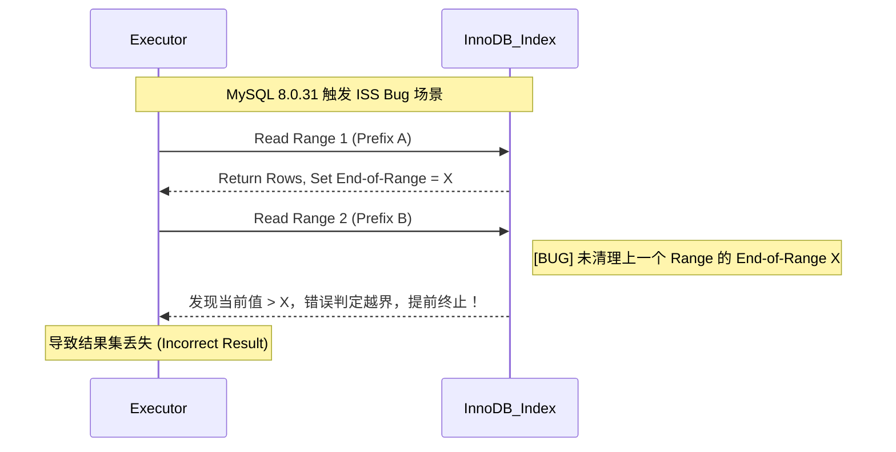

在数据库性能优化中，索引是最直接有效的优化手段之一。然而，**建了索引并不等于一定能用上索引**。实际开发中，我们经常遇到这样的困惑：明明在字段上建立了索引，查询却依然慢如蜗牛，通过 `EXPLAIN` 分析发现居然是全表扫描。

导致索引失效的原因多种多样，既有 SQL 语句写法问题，也有索引设计不当的因素。有些失效场景是显性的（如违背最左前缀原则），有些则非常隐蔽（如隐式类型转换）。如果不深入了解这些失效场景，很容易在生产环境中埋下性能隐患。

本文将系统总结 MySQL 索引失效的常见场景，分析失效背后的原理机制，并提供相应的优化建议，帮助你在日常开发和排查问题中快速定位并解决索引失效问题。

### SELECT \* 查询（成本权衡）

- **核心定义**：`SELECT *` 本身**不会直接导致索引失效**。它是一种“非覆盖索引”查询，如果 `WHERE` 条件命中了索引，索引依然会被初步考虑。
- **回表成本决策**：当查询需要的字段不在索引树中时，MySQL 必须拿着主键回聚簇索引查找整行数据（回表）。优化器会对比“索引扫描 + 回表”与“直接全表扫描”的成本。如果查询结果占总数据量的比例较高（通常阈值在 20%~30%），优化器会认为全表扫描的顺序 IO 效率高于回表的随机 IO，从而**主动放弃索引**。
- **落地建议**：严禁在生产环境无脑使用 `SELECT *`。应遵循**覆盖索引**原则，只查询必要的字段，将 `Extra` 列从空值优化为 `Using index`，从而彻底规避回表开销。

**注意**：后文使用 `SELECT *` 仅仅是为了演示方便。

### 违背最左前缀原则

- **核心定义**：最左前缀匹配原则指的是在使用联合索引时，MySQL 会根据索引中的字段顺序，从左到右依次匹配查询条件中的字段。如果查询条件与索引中的最左侧字段相匹配，那么 MySQL 就会使用索引来过滤数据。
- **范围查询的中断效应**：在联合索引中，如果某个字段使用了范围查询（例如 >、<、BETWEEN、前缀匹配 LIKE "abc%"），该字段本身以及其之前的列可以正常匹配并用于索引的精确定位，但该字段之后的列将无法利用
  索引进行快速定位（即无法使用 ref 类型的二分查找）。这是因为在 B+Tree 索引结构中，只有当前导列完全相等时，后续列才是有序的。一旦前导列变成一个范围，后续列在整个扫描区间内就呈现相对无序状态，从而中断了精准定位能力。不过，在 MySQL 5.6 及以上版本中，这些后续列并未完全失效，而是降级为使用**索引下推（Index Condition Pushdown, ICP）机制**，在范围扫描的过程中直接进行条件过滤，以此来减少回表次数。
- **索引跳跃扫描 (ISS)**：MySQL 8.0.13 引入了**索引跳跃扫描（Index Skip Scan）**，允许在缺失最左前缀时，通过枚举前导列的所有 Distinct 值来跳跃扫描后续索引树。

  - **版本避坑指南**：在 **MySQL 8.0.31** 中，ISS 存在严重 Bug（[[Bug #109145]](https://bugs.mysql.com/bug.php?id=109145)），在跨 Range 读取时未清理陈旧的边界值，会导致查询直接**丢失数据**。
  - **落地建议**：ISS 在前导列基数（Cardinality）极低（如性别、状态枚举）时性能最优，因为优化器需要枚举前导列的所有 distinct 值逐一跳跃扫描——distinct 值越少，跳跃次数越少。但"基数低"本身并非官方限制条件，优化器会综合评估成本决定是否触发 ISS。在生产环境中，**严禁依赖 ISS 来弥补糟糕的索引设计**，必须通过调整联合索引顺序或补齐前导列条件来满足最左前缀。

  **Index Skip Scan 失败路径图：**



失效示例：

```sql
-- 索引：(sname, s_code, address)
SELECT * FROM students WHERE s_code = 1;                  -- 跳过最左列 sname，索引失效
SELECT * FROM students WHERE sname = 'A' AND address = 'Shanghai'; -- 跳过中间列，仅 sname 走索引（索引下推 ICP 可优化过滤）
SELECT * FROM students WHERE sname = 'A' AND s_code > 1 AND address = 'Shanghai'; -- 范围查询后，address 无法用于定位，仅用于过滤
```

### 在索引列上进行计算、函数或类型转换

- **核心定义**：索引 B+Tree 存储的是字段的**原始值**。一旦在 `WHERE` 条件中对索引列应用了函数（如 `ABS()`、`DATE()`）或算术运算，该列的值在逻辑上发生了改变。
- **有序性破坏效应**：由于 B+Tree 是基于原始值排序的，经过函数处理后的结果在索引树中是**无序**的。数据库无法利用二分查找快速定位，只能被迫进行全表扫描。
- **函数索引**：MySQL 8.0 支持**函数索引**（Functional Index），可针对计算后的值建索引，但使用场景有限，首选还是优化 SQL 写法。

失效示例：

```sql
SELECT * FROM students WHERE height + 1 = 170;            -- 对索引列进行计算
SELECT * FROM students WHERE DATE(create_time) = '2022-01-01'; -- 对索引列使用函数
```

优化建议：

```sql
SELECT * FROM students WHERE height = 169;                -- 将计算移到等号右边
SELECT * FROM students WHERE create_time BETWEEN '2022-01-01 00:00:00' AND '2022-01-01 23:59:59';
```

### LIKE 模糊查询以通配符开头

- **核心定义**：`LIKE` 查询必须以具体字符开头才能利用索引有序性，例如 `WHERE sname LIKE 'Guide%';`。这是因为 B+ 树是从左到右排序的。前缀通配符（`%`）破坏了有序性，无法定位起始点。
- **前缀通配符的失效机制**：如果以 `%` 开头（如 `'%abc'`），由于索引是按字符从左到右排序的，前缀不确定意味着可能出现在索引树的任何位置，导致无法定位搜索区间的起始点。
- **落地建议**：
  - 如果必须进行全模糊查询，尽量只查询索引覆盖的列，此时 `EXPLAIN` 会显示 `type: index`（**Index Full Scan**），虽然扫描了整棵树，但无需回表，性能仍优于 `ALL`。
  - 核心业务的大规模模糊搜索应通过 **ElasticSearch** 或其他搜索引擎实现。

失效示例：

```sql
SELECT * FROM students WHERE sname LIKE '%Guide';          -- 前缀模糊，全表扫描
SELECT * FROM students WHERE sname LIKE '%Guide%';         -- 前后模糊，全表扫描
```

### OR 连接与 Index Merge

- **核心定义**：在 `OR` 连接的多个条件中，只要有**任意一列没有索引**，MySQL 就会放弃所有索引转而执行全表扫描。
- **Index Merge 机制**：若 `OR` 两侧都有索引，MySQL 5.1+ 可能会触发**索引合并（Index Merge）**优化，分别扫描两个索引后取并集。不过，如果两个索引过滤后的数据量都很大，合并结果集的成本可能高于全表扫描，依然会放弃索引。
- **落地建议**：
  - 优先将 `OR` 改写为 `UNION ALL`。`UNION ALL` 可以让每一段查询独立使用索引，且规避了优化器对 `OR` 成本估算不准的问题。
  - 注意：只有当确定结果集不重复时才用 `UNION ALL`，否则需用 `UNION`（涉及临时表去重，有额外开销）。

失效示例：

```sql
-- 假设 sname 和 address 都有索引，但各匹配 30%+ 数据
SELECT * FROM students WHERE sname = '学生 1' OR address = '上海'; -- 可能放弃索引，全表扫描

-- 建议改写为
SELECT * FROM students WHERE sname = '学生 1'
UNION ALL
SELECT * FROM students WHERE address = '上海'; -- 各自走索引
```

**验证方式**：`EXPLAIN` 中若出现 `type: index_merge` 和 `Extra: Using union; Using where`，说明使用了 Index Merge。

### IN / NOT IN 使用不当

**`IN` 列表长度**：

- `eq_range_index_dive_limit`（默认 **200**）并不直接导致索引失效，而是影响**行数估算策略**：
  - **<= 200**：MySQL 使用 **Index Dive**（深入索引树探测）精确估算行数，成本估算准确，索引大概率有效。
  - **> 200**：当 `IN` 列表长度超过 `eq_range_index_dive_limit`（MySQL 5.7.4+ 默认为 200）时，优化器从精确的 Index Dive 切换为基于 `index_statistics` 的估算。若表数据的基数（Cardinality）统计陈旧，可能导致估算成本异常，从而放弃走范围扫描（Range Scan）而选择全表扫描。
- 可通过调大 `eq_range_index_dive_limit` 或改写为 `JOIN` 临时表来规避。

**`NOT IN`** ：

- **常量列表**（如 `NOT IN (1,2,3)`）：通常全表扫描，因需遍历整个 B+ 树证明"不在集合中"。
- **子查询关联索引列**：`WHERE id NOT IN (SELECT user_id FROM orders WHERE user_id > 1000)` 可用 `orders` 表的 `user_id` 索引。
- **推荐替代**：优先使用 `NOT EXISTS` 或 `LEFT JOIN / IS NULL`，性能更优且语义更清晰。

失效示例：

```sql
SELECT * FROM students WHERE s_code IN (1, 2, 3, ..., 500); -- 列表过长，可能改用统计估算导致误判
SELECT * FROM students WHERE s_code NOT IN (1, 2, 3);     -- 常量列表，全表扫描
```

### 隐式类型转换

这是开发中最隐蔽的坑，**转换的方向决定了索引的生死**。

| 场景                  | 示例                | 转换方向                     | 索引是否有效 |
| --------------------- | ------------------- | ---------------------------- | ------------ |
| **字符串列 + 数字值** | `varchar_col = 123` | 字符串转数字（发生在索引列） | ❌ 失效      |
| **数字列 + 字符串值** | `int_col = '123'`   | 字符串转数字（发生在常量）   | ✅ 有效      |

**关键点**：

- 只有当**转换发生在索引列上**时，索引才会失效。
- 当字符串与数字进行比较时，MySQL 默认将字符串转换为**浮点数（DOUBLE）**进行比较（详见 [MySQL 官方文档规则 7](https://dev.mysql.com/doc/refman/8.0/en/type-conversion.html)）。对索引列发生隐式类型转换等同于在索引列上应用了不可逆的转换函数，破坏了 B+ 树的有序性，导致只能走全表扫描。
- `int_col = '123'` 会被转换为 `int_col = CAST('123' AS DOUBLE)`，转换发生在常量侧，不影响索引使用。

**详细介绍**：[MySQL隐式转换造成索引失效](https://javaguide.cn/database/mysql/index-invalidation-caused-by-implicit-conversion.html)

### ORDER BY 排序优化陷阱

即使 `WHERE` 条件精准，如果 `ORDER BY` 处理不好，依然会出现慢查询。

**触发 `Using filesort` 的条件**：

- 排序字段不在索引中
- 索引顺序与 `ORDER BY` 不一致（如索引 `(a,b)` 但 `ORDER BY b,a`）
- `WHERE` 与 `ORDER BY` 分别使用不同索引
- 排序列包含 `SELECT *` 中非索引列（需回表排序）

**优化方案**：

- 利用**覆盖索引**同时满足 `WHERE` 和 `ORDER BY`。例如索引为 `(name, age)`，查询 `SELECT name, age FROM users WHERE name = 'A' ORDER BY age`。
- 调整索引顺序以匹配 `ORDER BY`。

**验证方式**：`EXPLAIN` 中 `Extra` 列出现 `Using filesort` 即表示触发了排序。

### 总结

本文系统梳理了 MySQL 索引失效的常见场景，从底层机制上可归纳为以下两大核心类：

**1. SQL 写法与底层逻辑冲突（破坏 B+Tree 有序性）**

此类问题最为常见，本质是查询条件让底层的 B+Tree 失去了“二分查找”的快速定位能力。

- **违背最左前缀原则**：跳过联合索引前导列，或遇到范围查询（如 `>`、`<`、`BETWEEN`、`LIKE "abc%"`）导致后续列中断精确定位，降级为范围扫描加过滤。
- **对索引列进行加工**：在 `WHERE` 左侧对索引列进行数学计算或应用函数，导致原始数据发生逻辑改变，在索引树中呈现无序状态。
- **隐式类型转换（隐蔽且致命）**：当“字符串类型的列”去比较“数字类型的值”时，MySQL 会默认在列上套用转换函数，直接破坏树的有序性。
- **LIKE 模糊查询前置通配符**：如 `LIKE "%abc"`，前缀字符的不确定性使得优化器无法锁定扫描区间的起始点。
- **ORDER BY 排序陷阱**：排序列未命中索引、排序方向与索引结构不一致等触发额外的内存或磁盘排序（`Using filesort`）。

**2. 优化器的成本决策（基于 I/O 成本妥协）**

此类问题并非索引本身不可用，而是 MySQL 优化器经过计算后，认为“不走普通索引”整体开销反而更小。

- **无脑 `SELECT \*` 导致回表成本超载**：查询大量非索引覆盖列时，若命中数据量较大（通常超 20%~30%），优化器会判定全表扫描的顺序 I/O 优于频繁回表的随机 I/O，从而主动放弃索引。
- **`OR` 条件导致全表扫描**：只要 `OR` 连接的任意一侧条件没有对应索引，就会触发全表扫描。即使两侧都有索引，若 Index Merge（索引合并）的预期成本过高，依然会被放弃。
- **`IN` 列表过长引发估算失真**：当 `IN` 列表长度超过系统阈值（默认 200）时，优化器会从精准的深入探测（Index Dive）切换为粗略的统计估算，极易因统计信息陈旧而产生执行成本的误判。

**实战建议**：

1. **养成 `EXPLAIN` 分析习惯**：在编写复杂 SQL 后，务必使用 `EXPLAIN` 分析执行计划，重点关注 `type`、`key`、`rows`、`Extra` 字段。
2. **遵循覆盖索引原则**：尽量避免 `SELECT *`，只查询必要字段，让索引覆盖查询需求，减少回表开销。
3. **规范数据类型使用**：保持查询条件与字段类型一致，避免隐式类型转换。
4. **合理设计联合索引**：按照查询频率和选择性安排字段顺序，优先满足高频查询场景。
5. **大规模模糊搜索考虑 ES**：对于前后模糊查询（`%keyword%`），建议使用 Elasticsearch 等搜索引擎。

索引优化是数据库性能优化的基本功，但也需要结合实际业务场景和数据分布进行权衡。理解索引失效的根本原因，才能在遇到性能问题时快速定位并解决。

**延伸阅读**：

- [MySQL 索引详解](https://javaguide.cn/database/mysql/mysql-index.html)
- [MySQL 执行计划分析](https://javaguide.cn/database/mysql/mysql-query-execution-plan.html)
- [MySQL 隐式转换造成索引失效](https://javaguide.cn/database/mysql/index-invalidation-caused-by-implicit-conversion.html)
