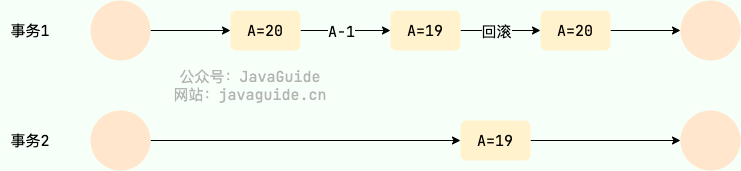
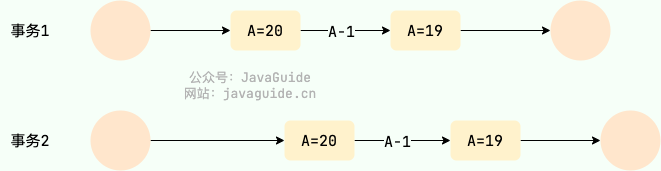
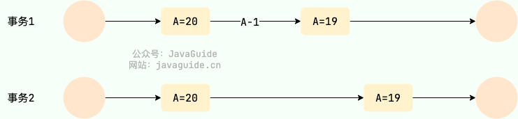
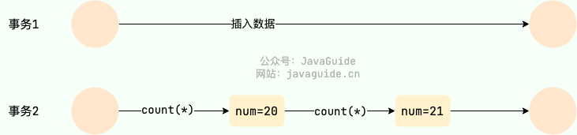

## MySQL 基础

### 关系型数据库介绍

顾名思义，关系型数据库就是一种建立在关系模型的基础上的数据库。关系模型表明了数据库中所存储的数据之间的联系（一对一、一对多、多对多）。

关系型数据库中，我们的数据都被存放在了各种表中（比如用户表），表中的每一行就存放着一条数据（比如一个用户的信息）。


大部分关系型数据库都使用 SQL 来操作数据库中的数据。并且，大部分关系型数据库都支持事务的四大特性(ACID)。

**有哪些常见的关系型数据库呢？**

MySQL、PostgreSQL、Oracle、SQL Server、SQLite（微信本地的聊天记录的存储就是用的 SQLite） ......。

### MySQL 介绍


**MySQL 是一种关系型数据库，主要用于持久化存储我们的系统中的一些数据比如用户信息。**

由于 MySQL 是开源免费并且比较成熟的数据库，因此，MySQL 被大量使用在各种系统中。任何人都可以在 GPL(General Public License) 的许可下下载并根据个性化的需要对其进行修改。MySQL 的默认端口号是**3306**。

## MySQL 基础架构

> 建议配合 [SQL 语句在 MySQL 中的执行过程](./how-sql-executed-in-mysql.md) 这篇文章来理解 MySQL 基础架构。另外，“一个 SQL 语句在 MySQL 中的执行流程”也是面试中比较常问的一个问题。

下图是 MySQL 的一个简要架构图，从下图你可以很清晰的看到客户端的一条 SQL 语句在 MySQL 内部是如何执行的。


从上图可以看出， MySQL 主要由下面几部分构成：

- **连接器：** 身份认证和权限相关(登录 MySQL 的时候)。
- **查询缓存：** 执行查询语句的时候，会先查询缓存（MySQL 8.0 版本后移除，因为这个功能不太实用）。
- **分析器：** 没有命中缓存的话，SQL 语句就会经过分析器，分析器说白了就是要先看你的 SQL 语句要干嘛，再检查你的 SQL 语句语法是否正确。
- **优化器：** 按照 MySQL 认为最优的方案去执行。
- **执行器：** 执行语句，然后从存储引擎返回数据。 执行语句之前会先判断是否有权限，如果没有权限的话，就会报错。
- **插件式存储引擎** ： 主要负责数据的存储和读取，采用的是插件式架构，支持 InnoDB、MyISAM、Memory 等多种存储引擎。

## MySQL 存储引擎

MySQL 核心在于存储引擎，想要深入学习 MySQL，必定要深入研究 MySQL 存储引擎。

### MySQL 支持哪些存储引擎？默认使用哪个？

MySQL 支持多种存储引擎，你可以通过 `show engines` 命令来查看 MySQL 支持的所有存储引擎。


从上图我们可以查看出， MySQL 当前默认的存储引擎是 InnoDB。并且，所有的存储引擎中只有 InnoDB 是事务性存储引擎，也就是说只有 InnoDB 支持事务。

我这里使用的 MySQL 版本是 8.x，不同的 MySQL 版本之间可能会有差别。

MySQL 5.5.5 之前，MyISAM 是 MySQL 的默认存储引擎。5.5.5 版本之后，InnoDB 是 MySQL 的默认存储引擎。

你可以通过 `select version()` 命令查看你的 MySQL 版本。

```bash
 mysql> select version();
+-----------+
| version() |
+-----------+
| 8.0.27    |
+-----------+
1 row in set (0.00 sec)
```

你也可以通过 `show variables like '%storage_engine%'` 命令直接查看 MySQL 当前默认的存储引擎。


如果你只想查看数据库中某个表使用的存储引擎的话，可以使用 `show table status from db_name where name='table_name'`命令。


如果你想要深入了解每个存储引擎以及它们之间的区别，推荐你去阅读以下 MySQL 官方文档对应的介绍(面试不会问这么细，了解即可)：

- InnoDB 存储引擎详细介绍：https://dev.mysql.com/doc/refman/8.0/en/innodb-storage-engine.html 。
- 其他存储引擎详细介绍：https://dev.mysql.com/doc/refman/8.0/en/storage-engines.html 。


### MySQL 存储引擎架构了解吗？

MySQL 存储引擎采用的是插件式架构，支持多种存储引擎，我们甚至可以为不同的数据库表设置不同的存储引擎以适应不同场景的需要。**存储引擎是基于表的，而不是数据库。**

并且，你还可以根据 MySQL 定义的存储引擎实现标准接口来编写一个属于自己的存储引擎。这些非官方提供的存储引擎可以称为第三方存储引擎，区别于官方存储引擎。像目前最常用的 InnoDB 其实刚开始就是一个第三方存储引擎，后面由于过于优秀，其被 Oracle 直接收购了。

MySQL 官方文档也有介绍到如何编写一个自定义存储引擎，地址：https://dev.mysql.com/doc/internals/en/custom-engine.html 。

### MyISAM 和 InnoDB 的区别是什么？


MySQL 5.5 之前，MyISAM 引擎是 MySQL 的默认存储引擎，可谓是风光一时。

虽然，MyISAM 的性能还行，各种特性也还不错（比如全文索引、压缩、空间函数等）。但是，MyISAM 不支持事务和行级锁，而且最大的缺陷就是崩溃后无法安全恢复。

MySQL 5.5.5 之前，MyISAM 是 MySQL 的默认存储引擎。5.5.5 版本之后，InnoDB 是 MySQL 的默认存储引擎。

言归正传！咱们下面还是来简单对比一下两者：

**1.是否支持行级锁**

MyISAM 只有表级锁(table-level locking)，而 InnoDB 支持行级锁(row-level locking)和表级锁,默认为行级锁。

也就说，MyISAM 一锁就是锁住了整张表，这在并发写的情况下是多么滴憨憨啊！这也是为什么 InnoDB 在并发写的时候，性能更牛皮了！

**2.是否支持事务**

MyISAM 不提供事务支持。

InnoDB 提供事务支持，实现了 SQL 标准定义了四个隔离级别，具有提交(commit)和回滚(rollback)事务的能力。并且，InnoDB 默认使用的 REPEATABLE-READ（可重读）隔离级别是可以解决幻读问题发生的（基于 MVCC 和 Next-Key Lock）。

关于 MySQL 事务的详细介绍，可以看看我写的这篇文章：[MySQL 事务隔离级别详解](https://javaguide.cn/database/mysql/transaction-isolation-level.html)。

**3.是否支持外键**

MyISAM 不支持，而 InnoDB 支持。

外键对于维护数据一致性非常有帮助，但是对性能有一定的损耗。因此，通常情况下，我们是不建议在实际生产项目中使用外键的，在业务代码中进行约束即可！

阿里的《Java 开发手册》也是明确规定禁止使用外键的。


不过，在代码中进行约束的话，对程序员的能力要求更高，具体是否要采用外键还是要根据你的项目实际情况而定。

总结：一般我们也是不建议在数据库层面使用外键的，应用层面可以解决。不过，这样会对数据的一致性造成威胁。具体要不要使用外键还是要根据你的项目来决定。

**4.是否支持数据库异常崩溃后的安全恢复**

MyISAM 不支持，而 InnoDB 支持。

使用 InnoDB 的数据库在异常崩溃后，数据库重新启动的时候会保证数据库恢复到崩溃前的状态。这个恢复的过程依赖于 `redo log` 。

**5.是否支持 MVCC**

MyISAM 不支持，而 InnoDB 支持。

讲真，这个对比有点废话，毕竟 MyISAM 连行级锁都不支持。MVCC 可以看作是行级锁的一个升级，可以有效减少加锁操作，提高性能。

**6.索引实现不一样。**

虽然 MyISAM 引擎和 InnoDB 引擎都是使用 B+Tree 作为索引结构，但是两者的实现方式不太一样。

InnoDB 引擎中，其数据文件本身就是索引文件。相比 MyISAM，索引文件和数据文件是分离的，其表数据文件本身就是按 B+Tree 组织的一个索引结构，树的叶节点 data 域保存了完整的数据记录。

详细区别，推荐你看看我写的这篇文章：[MySQL 索引详解](https://javaguide.cn/database/mysql/mysql-index.html)。

### MyISAM 和 InnoDB 如何选择？

大多数时候我们使用的都是 InnoDB 存储引擎，在某些读密集的情况下，使用 MyISAM 也是合适的。不过，前提是你的项目不介意 MyISAM 不支持事务、崩溃恢复等缺点（可是~我们一般都会介意啊！）。

《MySQL 高性能》上面有一句话这样写到:

> 不要轻易相信“MyISAM 比 InnoDB 快”之类的经验之谈，这个结论往往不是绝对的。在很多我们已知场景中，InnoDB 的速度都可以让 MyISAM 望尘莫及，尤其是用到了聚簇索引，或者需要访问的数据都可以放入内存的应用。

一般情况下我们选择 InnoDB 都是没有问题的，但是某些情况下你并不在乎可扩展能力和并发能力，也不需要事务支持，也不在乎崩溃后的安全恢复问题的话，选择 MyISAM 也是一个不错的选择。但是一般情况下，我们都是需要考虑到这些问题的。

因此，对于咱们日常开发的业务系统来说，你几乎找不到什么理由再使用 MyISAM 作为自己的 MySQL 数据库的存储引擎。

## MySQL 索引

MySQL 索引相关的问题比较多，对于面试和工作都比较重要，于是，我单独抽了一篇文章专门来总结 MySQL 索引相关的知识点和问题： [MySQL 索引详解](./mysql-index.md) 。

## MySQL 查询缓存

执行查询语句的时候，会先查询缓存。不过，MySQL 8.0 版本后移除，因为这个功能不太实用

`my.cnf` 加入以下配置，重启 MySQL 开启查询缓存

```properties
query_cache_type=1
query_cache_size=600000
```

MySQL 执行以下命令也可以开启查询缓存

```properties
set global  query_cache_type=1;
set global  query_cache_size=600000;
```

如上，**开启查询缓存后在同样的查询条件以及数据情况下，会直接在缓存中返回结果**。这里的查询条件包括查询本身、当前要查询的数据库、客户端协议版本号等一些可能影响结果的信息。（**查询缓存不命中的情况：（1）**）因此任何两个查询在任何字符上的不同都会导致缓存不命中。此外，（**查询缓存不命中的情况：（2）**）如果查询中包含任何用户自定义函数、存储函数、用户变量、临时表、MySQL 库中的系统表，其查询结果也不会被缓存。

（**查询缓存不命中的情况：（3）**）**缓存建立之后**，MySQL 的查询缓存系统会跟踪查询中涉及的每张表，如果这些表（数据或结构）发生变化，那么和这张表相关的所有缓存数据都将失效。

**缓存虽然能够提升数据库的查询性能，但是缓存同时也带来了额外的开销，每次查询后都要做一次缓存操作，失效后还要销毁。** 因此，开启查询缓存要谨慎，尤其对于写密集的应用来说更是如此。如果开启，要注意合理控制缓存空间大小，一般来说其大小设置为几十 MB 比较合适。此外，**还可以通过 sql_cache 和 sql_no_cache 来控制某个查询语句是否需要缓存：**

```sql
select sql_no_cache count(*) from usr;
```

## MySQL 事务

### 何谓事务？

我们设想一个场景，这个场景中我们需要插入多条相关联的数据到数据库，不幸的是，这个过程可能会遇到下面这些问题：

- 数据库中途突然因为某些原因挂掉了。
- 客户端突然因为网络原因连接不上数据库了。
- 并发访问数据库时，多个线程同时写入数据库，覆盖了彼此的更改。
- ......

上面的任何一个问题都可能会导致数据的不一致性。为了保证数据的一致性，系统必须能够处理这些问题。事务就是我们抽象出来简化这些问题的首选机制。事务的概念起源于数据库，目前，已经成为一个比较广泛的概念。

**何为事务？** 一言蔽之，**事务是逻辑上的一组操作，要么都执行，要么都不执行。**

事务最经典也经常被拿出来说例子就是转账了。假如小明要给小红转账 1000 元，这个转账会涉及到两个关键操作，这两个操作必须都成功或者都失败。

1. 将小明的余额减少 1000 元
2. 将小红的余额增加 1000 元。

事务会把这两个操作就可以看成逻辑上的一个整体，这个整体包含的操作要么都成功，要么都要失败。这样就不会出现小明余额减少而小红的余额却并没有增加的情况。


### 何谓数据库事务？

大多数情况下，我们在谈论事务的时候，如果没有特指**分布式事务**，往往指的就是**数据库事务**。

数据库事务在我们日常开发中接触的最多了。如果你的项目属于单体架构的话，你接触到的往往就是数据库事务了。

**那数据库事务有什么作用呢？**

简单来说，数据库事务可以保证多个对数据库的操作（也就是 SQL 语句）构成一个逻辑上的整体。构成这个逻辑上的整体的这些数据库操作遵循：**要么全部执行成功,要么全部不执行** 。

```sql
# 开启一个事务
START TRANSACTION;
# 多条 SQL 语句
SQL1,SQL2...
## 提交事务
COMMIT;
```


另外，关系型数据库（例如：`MySQL`、`SQL Server`、`Oracle` 等）事务都有 **ACID** 特性：


1. **原子性**（`Atomicity`） ： 事务是最小的执行单位，不允许分割。事务的原子性确保动作要么全部完成，要么完全不起作用；
2. **一致性**（`Consistency`）： 执行事务前后，数据保持一致，例如转账业务中，无论事务是否成功，转账者和收款人的总额应该是不变的；
3. **隔离性**（`Isolation`）： 并发访问数据库时，一个用户的事务不被其他事务所干扰，各并发事务之间数据库是独立的；
4. **持久性**（`Durability`）： 一个事务被提交之后。它对数据库中数据的改变是持久的，即使数据库发生故障也不应该对其有任何影响。

🌈 这里要额外补充一点：**只有保证了事务的持久性、原子性、隔离性之后，一致性才能得到保障。也就是说 A、I、D 是手段，C 是目的！** 想必大家也和我一样，被 ACID 这个概念被误导了很久! 我也是看周志明老师的公开课[《周志明的软件架构课》](https://time.geekbang.org/opencourse/intro/100064201)才搞清楚的（多看好书！！！）。


另外，DDIA 也就是 [《Designing Data-Intensive Application（数据密集型应用系统设计）》](https://book.douban.com/subject/30329536/) 的作者在他的这本书中如是说：

> Atomicity, isolation, and durability are properties of the database, whereas consis‐
> tency (in the ACID sense) is a property of the application. The application may rely
> on the database’s atomicity and isolation properties in order to achieve consistency,
> but it’s not up to the database alone.
>
> 翻译过来的意思是：原子性，隔离性和持久性是数据库的属性，而一致性（在 ACID 意义上）是应用程序的属性。应用可能依赖数据库的原子性和隔离属性来实现一致性，但这并不仅取决于数据库。因此，字母 C 不属于 ACID 。

《Designing Data-Intensive Application（数据密集型应用系统设计）》这本书强推一波，值得读很多遍！豆瓣有接近 90% 的人看了这本书之后给了五星好评。另外，中文翻译版本已经在 Github 开源，地址：[https://github.com/Vonng/ddia](https://github.com/Vonng/ddia) 。


### 并发事务带来了哪些问题?

在典型的应用程序中，多个事务并发运行，经常会操作相同的数据来完成各自的任务（多个用户对同一数据进行操作）。并发虽然是必须的，但可能会导致以下的问题。

#### 脏读（Dirty read）

一个事务读取数据并且对数据进行了修改，这个修改对其他事务来说是可见的，即使当前事务没有提交。这时另外一个事务读取了这个还未提交的数据，但第一个事务突然回滚，导致数据并没有被提交到数据库，那第二个事务读取到的就是脏数据，这也就是脏读的由来。

例如：事务 1 读取某表中的数据 A=20，事务 1 修改 A=A-1，事务 2 读取到 A = 19,事务 1 回滚导致对 A 的修改并为提交到数据库， A 的值还是 20。



#### 丢失修改（Lost to modify）

在一个事务读取一个数据时，另外一个事务也访问了该数据，那么在第一个事务中修改了这个数据后，第二个事务也修改了这个数据。这样第一个事务内的修改结果就被丢失，因此称为丢失修改。

例如：事务 1 读取某表中的数据 A=20，事务 2 也读取 A=20，事务 1 先修改 A=A-1，事务 2 后来也修改 A=A-1，最终结果 A=19，事务 1 的修改被丢失。



#### 不可重复读（Unrepeatable read）

指在一个事务内多次读同一数据。在这个事务还没有结束时，另一个事务也访问该数据。那么，在第一个事务中的两次读数据之间，由于第二个事务的修改导致第一个事务两次读取的数据可能不太一样。这就发生了在一个事务内两次读到的数据是不一样的情况，因此称为不可重复读。

例如：事务 1 读取某表中的数据 A=20，事务 2 也读取 A=20，事务 1 修改 A=A-1，事务 2 再次读取 A =19，此时读取的结果和第一次读取的结果不同。



#### 幻读（Phantom read）

幻读与不可重复读类似。它发生在一个事务读取了几行数据，接着另一个并发事务插入了一些数据时。在随后的查询中，第一个事务就会发现多了一些原本不存在的记录，就好像发生了幻觉一样，所以称为幻读。

例如：事务 2 读取某个范围的数据，事务 1 在这个范围插入了新的数据，事务 1 再次读取这个范围的数据发现相比于第一次读取的结果多了新的数据。



### 不可重复读和幻读有什么区别？

- 不可重复读的重点是内容修改或者记录减少比如多次读取一条记录发现其中某些记录的值被修改；
- 幻读的重点在于记录新增比如多次执行同一条查询语句（DQL）时，发现查到的记录增加了。

幻读其实可以看作是不可重复读的一种特殊情况，单独把区分幻读的原因主要是解决幻读和不可重复读的方案不一样。

举个例子：执行 `delete` 和 `update` 操作的时候，可以直接对记录加锁，保证事务安全。而执行 `insert` 操作的时候，由于记录锁（Record Lock）只能锁住已经存在的记录，为了避免插入新记录，需要依赖间隙锁（Gap Lock）。也就是说执行 `insert` 操作的时候需要依赖 Next-Key Lock（Record Lock+Gap Lock） 进行加锁来保证不出现幻读。

### SQL 标准定义了哪些事务隔离级别?

SQL 标准定义了四个隔离级别：

- **READ-UNCOMMITTED(读取未提交)** ： 最低的隔离级别，允许读取尚未提交的数据变更，可能会导致脏读、幻读或不可重复读。
- **READ-COMMITTED(读取已提交)** ： 允许读取并发事务已经提交的数据，可以阻止脏读，但是幻读或不可重复读仍有可能发生。
- **REPEATABLE-READ(可重复读)** ： 对同一字段的多次读取结果都是一致的，除非数据是被本身事务自己所修改，可以阻止脏读和不可重复读，但幻读仍有可能发生。
- **SERIALIZABLE(可串行化)** ： 最高的隔离级别，完全服从 ACID 的隔离级别。所有的事务依次逐个执行，这样事务之间就完全不可能产生干扰，也就是说，该级别可以防止脏读、不可重复读以及幻读。

---

|     隔离级别     | 脏读 | 不可重复读 | 幻读 |
| :--------------: | :--: | :--------: | :--: |
| READ-UNCOMMITTED |  √   |     √      |  √   |
|  READ-COMMITTED  |  ×   |     √      |  √   |
| REPEATABLE-READ  |  ×   |     ×      |  √   |
|   SERIALIZABLE   |  ×   |     ×      |  ×   |

### MySQL 的隔离级别是基于锁实现的吗？

MySQL 的隔离级别基于锁和 MVCC 机制共同实现的。

SERIALIZABLE 隔离级别，是通过锁来实现的。除了 SERIALIZABLE 隔离级别，其他的隔离级别都是基于 MVCC 实现。

不过， SERIALIZABLE 之外的其他隔离级别可能也需要用到锁机制，就比如 REPEATABLE-READ 在当前读情况下需要使用加锁读来保证不会出现幻读。

### MySQL 的默认隔离级别是什么?

MySQL InnoDB 存储引擎的默认支持的隔离级别是 **REPEATABLE-READ（可重读）**。我们可以通过`SELECT @@tx_isolation;`命令来查看，MySQL 8.0 该命令改为`SELECT @@transaction_isolation;`

```sql
mysql> SELECT @@tx_isolation;
+-----------------+
| @@tx_isolation  |
+-----------------+
| REPEATABLE-READ |
+-----------------+
```

关于 MySQL 事务隔离级别的详细介绍，可以看看我写的这篇文章：[MySQL 事务隔离级别详解](https://javaguide.cn/database/mysql/transaction-isolation-level.html)。

## MySQL 锁

### 表级锁和行级锁了解吗？有什么区别？

MyISAM 仅仅支持表级锁(table-level locking)，一锁就锁整张表，这在并发写的情况下性非常差。

InnoDB 不光支持表级锁(table-level locking)，还支持行级锁(row-level locking)，默认为行级锁。行级锁的粒度更小，仅对相关的记录上锁即可（对一行或者多行记录加锁），所以对于并发写入操作来说， InnoDB 的性能更高。

**表级锁和行级锁对比** ：

- **表级锁：** MySQL 中锁定粒度最大的一种锁，是针对非索引字段加的锁，对当前操作的整张表加锁，实现简单，资源消耗也比较少，加锁快，不会出现死锁。其锁定粒度最大，触发锁冲突的概率最高，并发度最低，MyISAM 和 InnoDB 引擎都支持表级锁。
- **行级锁：** MySQL 中锁定粒度最小的一种锁，是针对索引字段加的锁，只针对当前操作的行记录进行加锁。 行级锁能大大减少数据库操作的冲突。其加锁粒度最小，并发度高，但加锁的开销也最大，加锁慢，会出现死锁。

### 行级锁的使用有什么注意事项？

InnoDB 的行锁是针对索引字段加的锁，表级锁是针对非索引字段加的锁。当我们执行 `UPDATE`、`DELETE` 语句时，如果 `WHERE`条件中字段没有命中唯一索引或者索引失效的话，就会导致扫描全表对表中的所有行记录进行加锁。这个在我们日常工作开发中经常会遇到，一定要多多注意！！！

不过，很多时候即使用了索引也有可能会走全表扫描，这是因为 MySQL 优化器的原因。

### 共享锁和排他锁呢？

不论是表级锁还是行级锁，都存在共享锁（Share Lock，S 锁）和排他锁（Exclusive Lock，X 锁）这两类：

- **共享锁（S 锁）** ：又称读锁，事务在读取记录的时候获取共享锁，允许多个事务同时获取（锁兼容）。
- **排他锁（X 锁）** ：又称写锁/独占锁，事务在修改记录的时候获取排他锁，不允许多个事务同时获取。如果一个记录已经被加了排他锁，那其他事务不能再对这条事务加任何类型的锁（锁不兼容）。

排他锁与任何的锁都不兼容，共享锁仅和共享锁兼容。

|      | S 锁   | X 锁 |
| :--- | :----- | :--- |
| S 锁 | 不冲突 | 冲突 |
| X 锁 | 冲突   | 冲突 |

由于 MVCC 的存在，对于一般的 `SELECT` 语句，InnoDB 不会加任何锁。不过， 你可以通过以下语句显式加共享锁或排他锁。

```sql
# 共享锁
SELECT ... LOCK IN SHARE MODE;
# 排他锁
SELECT ... FOR UPDATE;
```

### 意向锁有什么作用？

如果需要用到表锁的话，如何判断表中的记录没有行锁呢？一行一行遍历肯定是不行，性能太差。我们需要用到一个叫做意向锁的东东来快速判断是否可以对某个表使用表锁。

意向锁是表级锁，共有两种：

- **意向共享锁（Intention Shared Lock，IS 锁）**：事务有意向对表中的某些记录加共享锁（S 锁），加共享锁前必须先取得该表的 IS 锁。
- **意向排他锁（Intention Exclusive Lock，IX 锁）**：事务有意向对表中的某些记录加排他锁（X 锁），加排他锁之前必须先取得该表的 IX 锁。

意向锁是有数据引擎自己维护的，用户无法手动操作意向锁，在为数据行加共享 / 排他锁之前，InooDB 会先获取该数据行所在在数据表的对应意向锁。

意向锁之间是互相兼容的。

|       | IS 锁 | IX 锁 |
| ----- | ----- | ----- |
| IS 锁 | 兼容  | 兼容  |
| IX 锁 | 兼容  | 兼容  |

意向锁和共享锁和排它锁互斥（这里指的是表级别的共享锁和排他锁，意向锁不会与行级的共享锁和排他锁互斥）。

|      | IS 锁 | IX 锁 |
| ---- | ----- | ----- |
| S 锁 | 兼容  | 互斥  |
| X 锁 | 互斥  | 互斥  |

《MySQL 技术内幕 InnoDB 存储引擎》这本书对应的描述应该是笔误了。


### InnoDB 有哪几类行锁？

MySQL InnoDB 支持三种行锁定方式：

- **记录锁（Record Lock）** ：也被称为记录锁，属于单个行记录上的锁。
- **间隙锁（Gap Lock）** ：锁定一个范围，不包括记录本身。
- **临键锁（Next-key Lock）** ：Record Lock+Gap Lock，锁定一个范围，包含记录本身。记录锁只能锁住已经存在的记录，为了避免插入新记录，需要依赖间隙锁。

InnoDB 的默认隔离级别 RR（可重读）是可以解决幻读问题发生的，主要有下面两种情况：

- **快照读**（一致性非锁定读） ：由 MVCC 机制来保证不出现幻读。
- **当前读** （一致性锁定读）： 使用 Next-Key Lock 进行加锁来保证不出现幻读。

### 当前读和快照读有什么区别？

**快照读**（一致性非锁定读）就是单纯的 `SELECT` 语句，但不包括下面这两类 `SELECT` 语句：

```sql
SELECT ... FOR UPDATE
SELECT ... LOCK IN SHARE MODE
```

快照即记录的历史版本，每行记录可能存在多个历史版本（多版本技术）。

快照读的情况下，如果读取的记录正在执行 UPDATE/DELETE 操作，读取操作不会因此去等待记录上 X 锁的释放，而是会去读取行的一个快照。

只有在事务隔离级别 RC(读取已提交) 和 RR（可重读）下，InnoDB 才会使用一致性非锁定读：

- 在 RC 级别下，对于快照数据，一致性非锁定读总是读取被锁定行的最新一份快照数据。
- 在 RR 级别下，对于快照数据，一致性非锁定读总是读取本事务开始时的行数据版本。

快照读比较适合对于数据一致性要求不是特别高且追求极致性能的业务场景。

**当前读** （一致性锁定读）就是给行记录加 X 锁或 S 锁。

当前读的一些常见 SQL 语句类型如下：

```sql
# 对读的记录加一个X锁
SELECT...FOR UPDATE
# 对读的记录加一个S锁
SELECT...LOCK IN SHARE MODE
# 对修改的记录加一个X锁
INSERT...
UPDATE...
DELETE...
```

## MySQL 性能优化

关于 MySQL 性能优化的建议总结，请看这篇文章：[MySQL 高性能优化规范建议总结](./mysql-high-performance-optimization-specification-recommendations.md) 。

### 能用 MySQL 直接存储文件（比如图片）吗？

可以是可以，直接存储文件对应的二进制数据即可。不过，还是建议不要在数据库中存储文件，会严重影响数据库性能，消耗过多存储空间。

可以选择使用云服务厂商提供的开箱即用的文件存储服务，成熟稳定，价格也比较低。


也可以选择自建文件存储服务，实现起来也不难，基于 FastDFS、MinIO（推荐） 等开源项目就可以实现分布式文件服务。

**数据库只存储文件地址信息，文件由文件存储服务负责存储。**

相关阅读：[Spring Boot 整合 MinIO 实现分布式文件服务，真香！](https://mp.weixin.qq.com/s/xfYCESLOuq3_0e3SFj6ZMQ) 。

### MySQL 如何存储 IP 地址？

可以将 IP 地址转换成整形数据存储，性能更好，占用空间也更小。

MySQL 提供了两个方法来处理 ip 地址

- `INET_ATON()` ： 把 ip 转为无符号整型 (4-8 位)
- `INET_NTOA()` :把整型的 ip 转为地址

插入数据前，先用 `INET_ATON()` 把 ip 地址转为整型，显示数据时，使用 `INET_NTOA()` 把整型的 ip 地址转为地址显示即可。

### 有哪些常见的 SQL 优化手段？

[《Java 面试指北》](https://www.yuque.com/docs/share/f37fc804-bfe6-4b0d-b373-9c462188fec7) 的「技术面试题篇」有一篇文章详细介绍了常见的 SQL 优化手段，非常全面，清晰易懂！


## 参考

- 《高性能 MySQL》第 7 章 MySQL 高级特性
- 《MySQL 技术内幕 InnoDB 存储引擎》第 6 章 锁
- Relational Database：https://www.omnisci.com/technical-glossary/relational-database
- 技术分享 | 隔离级别：正确理解幻读：https://opensource.actionsky.com/20210818-mysql/
- MySQL Server Logs - MySQL 5.7 Reference Manual：https://dev.mysql.com/doc/refman/5.7/en/server-logs.html
- Redo Log - MySQL 5.7 Reference Manual：https://dev.mysql.com/doc/refman/5.7/en/innodb-redo-log.html
- Locking Reads - MySQL 5.7 Reference Manual：https://dev.mysql.com/doc/refman/5.7/en/innodb-locking-reads.html
- 深入理解数据库行锁与表锁 https://zhuanlan.zhihu.com/p/52678870
- 详解 MySQL InnoDB 中意向锁的作用：https://juejin.cn/post/6844903666332368909
- 在数据库中不可重复读和幻读到底应该怎么分？：https://www.zhihu.com/question/392569386
