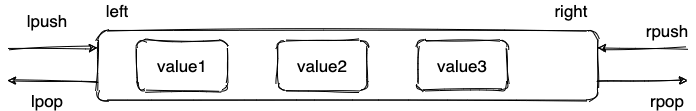

你可以在 Redis 官网上找到 Redis 数据结构非常详细的介绍：

- [Redis Data Structures](https://redis.com/redis-enterprise/data-structures/)
- [Redis Data types tutorial](https://redis.io/docs/manual/data-types/data-types-tutorial/)

未来随着 Redis 新版本的发布，可能会有新的数据结构出现，通过查阅 Redis 官网对应的介绍，你总能获取到最靠谱的信息。 


## String（字符串）

### 介绍

String 是 Redis 中最简单同时也是最常用的一个数据结构。

String 是一种二进制安全的数据结构，可以用来存储任何类型的数据比如字符串、整数、浮点数、图片（图片的 base64 编码或者解码或者图片的路径）、序列化后的对象。


虽然 Redis 是用 C 语言写的，但是 Redis 并没有使用 C 的字符串表示，而是自己构建了一种 **简单动态字符串**（Simple Dynamic String，**SDS**）。相比于 C 的原生字符串，Redis 的 SDS 不光可以保存文本数据还可以保存二进制数据，并且获取字符串长度复杂度为 O(1)（C 字符串为 O(N)）,除此之外，Redis 的 SDS API 是安全的，不会造成缓冲区溢出。

### 常用命令

| 命令                           | 介绍                             |
| ------------------------------ | -------------------------------- |
| SET key value                  | 设置指定 key 的值                |
| SETNX key value                | 只有在 key 不存在时设置 key 的值 |
| GET key                        | 获取指定 key 的值                |
| MSET key1 value1 key2 value2 … | 设置一个或多个指定 key 的值      |
| MGET key1 key2 ...             | 获取一个或多个指定 key 的值      |
| STRLEN key                     | 返回 key 所储存的字符串值的长度  |
| INCR key                       | 将 key 中储存的数字值增一        |
| DECR key                       | 将 key 中储存的数字值减一        |
| EXISTS key                     | 判断指定 key 是否存在            |
| DEL key（通用）                | 删除指定的 key                   |
| EXPIRE key seconds（通用）     | 给指定 key 设置过期时间          |

更多 Redis String 命令以及详细使用指南，请查看 Redis 官网对应的介绍：https://redis.io/commands/?group=string 。

**基本操作** ：

```bash
> SET key value
OK
> GET key
"value"
> EXISTS key
(integer) 1
> STRLEN key
(integer) 5
> DEL key
(integer) 1
> GET key
(nil)
```

**批量设置** ：

```bash
> MSET key1 value1 key2 value2
OK
> MGET key1 key2 # 批量获取多个 key 对应的 value
1) "value1"
2) "value2"
```

**计数器（字符串的内容为整数的时候可以使用）：**

```bash
> SET number 1
OK
> INCR number # 将 key 中储存的数字值增一
(integer) 2
> GET number
"2"
> DECR number # 将 key 中储存的数字值减一
(integer) 1
> GET number
"1"
```

**设置过期时间（默认为永不过期）**：

```bash
> EXPIRE key 60
(integer) 1
> SETNX key 60 value # 设置值并设置过期时间
OK
> TTL key
(integer) 56
```

### 应用场景

**需要存储常规数据的场景**

- 举例 ：缓存 session、token、图片地址、序列化后的对象(相比较于 Hash 存储更节省内存)。
- 相关命令 ： `SET`、`GET`。

**需要计数的场景**

- 举例 ：用户单位时间的请求数（简单限流可以用到）、页面单位时间的访问数。
- 相关命令 ：`SET`、`GET`、 `INCR`、`DECR` 。

**分布式锁**

利用 `SETNX key value` 命令可以实现一个最简易的分布式锁（存在一些缺陷，通常不建议这样实现分布式锁）。

## List（列表）

### 介绍

Redis 中的 List 其实就是链表数据结构的实现。我在 [线性数据结构 :数组、链表、栈、队列](https://javaguide.cn/cs-basics/data-structure/linear-data-structure.html) 这篇文章中详细介绍了链表这种数据结构，我这里就不多做介绍了。

许多高级编程语言都内置了链表的实现比如 Java 中的 `LinkedList`，但是 C 语言并没有实现链表，所以 Redis 实现了自己的链表数据结构。Redis 的 List 的实现为一个 **双向链表**，即可以支持反向查找和遍历，更方便操作，不过带来了部分额外的内存开销。


### 常用命令

| 命令                        | 介绍                                       |
| --------------------------- | ------------------------------------------ |
| RPUSH key value1 value2 ... | 在指定列表的尾部（右边）添加一个或多个元素 |
| LPUSH key value1 value2 ... | 在指定列表的头部（左边）添加一个或多个元素 |
| LSET key index value        | 将指定列表索引 index 位置的值设置为 value  |
| LPOP key                    | 移除并获取指定列表的第一个元素(最左边)     |
| RPOP key                    | 移除并获取指定列表的最后一个元素(最右边)   |
| LLEN key                    | 获取列表元素数量                           |
| LRANGE key start end        | 获取列表 start 和 end 之间 的元素          |

更多 Redis List 命令以及详细使用指南，请查看 Redis 官网对应的介绍：https://redis.io/commands/?group=list 。

**通过  `RPUSH/LPOP` 或者 ` LPUSH/RPOP`实现队列** ：

```bash
> RPUSH myList value1
(integer) 1
> RPUSH myList value2 value3
(integer) 3
> LPOP myList
"value1"
> LRANGE myList 0 1
1) "value2"
2) "value3"
> LRANGE myList 0 -1
1) "value2"
2) "value3"
```

**通过 `RPUSH/RPOP`或者`LPUSH/LPOP` 实现栈** ：

```bash
> RPUSH myList2 value1 value2 value3
(integer) 3
> RPOP myList2 # 将 list的头部(最右边)元素取出
"value3"
```

我专门画了一个图方便大家理解 `RPUSH` , `LPOP` , `lpush` , `RPOP` 命令：



**通过 `LRANGE` 查看对应下标范围的列表元素** ：

```bash
> RPUSH myList value1 value2 value3
(integer) 3
> LRANGE myList 0 1
1) "value1"
2) "value2"
> LRANGE myList 0 -1
1) "value1"
2) "value2"
3) "value3"
```

通过 `LRANGE` 命令，你可以基于 List 实现分页查询，性能非常高！

**通过 `LLEN` 查看链表长度** ：

```bash
> LLEN myList
(integer) 3
```

### 应用场景

**信息流展示**

- 举例 ：最新文章、最新动态。
- 相关命令 ： `LPUSH`、`LRANGE`。

**消息队列**

Redis List 数据结构可以用来做消息队列，只是功能过于简单且存在很多缺陷，不建议这样做。

相对来说，Redis 5.0 新增加的一个数据结构 `Stream` 更适合做消息队列一些，只是功能依然非常简陋。和专业的消息队列相比，还是有很多欠缺的地方比如消息丢失和堆积问题不好解决。

## Hash（哈希）

### 介绍

Redis 中的 Hash 是一个 String 类型的 field-value（键值对） 的映射表，特别适合用于存储对象，后续操作的时候，你可以直接修改这个对象中的某些字段的值。

Hash 类似于 JDK1.8 前的 `HashMap`，内部实现也差不多(数组 + 链表)。不过，Redis 的 Hash 做了更多优化。


### 常用命令

| 命令                                      | 介绍                                                     |
| ----------------------------------------- | -------------------------------------------------------- |
| HSET key field value                      | 设置指定哈希表中指定字段的值                             |
| HSETNX key field value                    | 只有指定字段不存在时设置指定字段的值                     |
| HMSET key field1 value1 field2 value2 ... | 同时将一个或多个 field-value (域-值)对设置到指定哈希表中 |
| HGET key field                            | 获取指定哈希表中指定字段的值                             |
| HMGET key field1 field2 ...               | 获取指定哈希表中一个或者多个指定字段的值                 |
| HGETALL key                               | 获取指定哈希表中所有的键值对                             |
| HEXISTS key field                         | 查看指定哈希表中指定的字段是否存在                       |
| HDEL key field1 field2 ...                | 删除一个或多个哈希表字段                                 |
| HLEN key                                  | 获取指定哈希表中字段的数量                               |

更多 Redis Hash 命令以及详细使用指南，请查看 Redis 官网对应的介绍：https://redis.io/commands/?group=hash 。

**模拟对象数据存储** ：

```bash
> HMSET userInfoKey name "guide" description "dev" age "24"
OK
> HEXISTS userInfoKey name # 查看 key 对应的 value中指定的字段是否存在。
(integer) 1
> HGET userInfoKey name # 获取存储在哈希表中指定字段的值。
"guide"
> HGET userInfoKey age
"24"
> HGETALL userInfoKey # 获取在哈希表中指定 key 的所有字段和值
1) "name"
2) "guide"
3) "description"
4) "dev"
5) "age"
6) "24"
> HSET userInfoKey name "GuideGeGe"
> HGET userInfoKey name
"GuideGeGe"
```

### 应用场景

**对象数据存储场景**

- 举例 ：用户信息、商品信息、文章信息、购物车信息。
- 相关命令 ：`HSET` （设置单个字段的值）、`HMSET`（设置多个字段的值）、`HGET`（获取单个字段的值）、`HMGET`（获取多个字段的值）。

## Set（集合）

### 介绍

Redis 中的 Set 类型是一种无序集合，集合中的元素没有先后顺序但都唯一，有点类似于 Java 中的 `HashSet` 。当你需要存储一个列表数据，又不希望出现重复数据时，Set 是一个很好的选择，并且 Set 提供了判断某个元素是否在一个 Set 集合内的重要接口，这个也是 List 所不能提供的。

你可以基于 Set 轻易实现交集、并集、差集的操作，比如你可以将一个用户所有的关注人存在一个集合中，将其所有粉丝存在一个集合。这样的话，Set 可以非常方便的实现如共同关注、共同粉丝、共同喜好等功能。这个过程也就是求交集的过程。


### 常用命令

| 命令                                  | 介绍                                      |
| ------------------------------------- | ----------------------------------------- |
| SADD key member1 member2 ...          | 向指定集合添加一个或多个元素              |
| SMEMBERS key                          | 获取指定集合中的所有元素                  |
| SCARD key                             | 获取指定集合的元素数量                    |
| SISMEMBER key member                  | 判断指定元素是否在指定集合中              |
| SINTER key1 key2 ...                  | 获取给定所有集合的交集                    |
| SINTERSTORE destination key1 key2 ... | 将给定所有集合的交集存储在 destination 中 |
| SUNION key1 key2 ...                  | 获取给定所有集合的并集                    |
| SUNIONSTORE destination key1 key2 ... | 将给定所有集合的并集存储在 destination 中 |
| SDIFF key1 key2 ...                   | 获取给定所有集合的差集                    |
| SDIFFSTORE destination key1 key2 ...  | 将给定所有集合的差集存储在 destination 中 |
| SPOP key count                        | 随机移除并获取指定集合中一个或多个元素    |
| SRANDMEMBER key count                 | 随机获取指定集合中指定数量的元素          |

更多 Redis Set 命令以及详细使用指南，请查看 Redis 官网对应的介绍：https://redis.io/commands/?group=set 。

**基本操作** ：

```bash
> SADD mySet value1 value2
(integer) 2
> SADD mySet value1 # 不允许有重复元素，因此添加失败
(integer) 0
> SMEMBERS mySet
1) "value1"
2) "value2"
> SCARD mySet
(integer) 2
> SISMEMBER mySet value1
(integer) 1
> SADD mySet2 value2 value3
(integer) 2
```

- `mySet` : `value1`、`value2` 。
- `mySet2` ： `value2` 、`value3` 。

**求交集** ：

```bash
> SINTERSTORE mySet3 mySet mySet2
(integer) 1
> SMEMBERS mySet3
1) "value2"
```

**求并集** ：

```bash
> SUNION mySet mySet2
1) "value3"
2) "value2"
3) "value1"
```

**求差集** ：

```bash
> SDIFF mySet mySet2 # 差集是由所有属于 mySet 但不属于 A 的元素组成的集合
1) "value1"
```

### 应用场景

**需要存放的数据不能重复的场景**

- 举例：网站 UV 统计（数据量巨大的场景还是 `HyperLogLog`更适合一些）、文章点赞、动态点赞等场景。
- 相关命令：`SCARD`（获取集合数量） 。


**需要获取多个数据源交集、并集和差集的场景**

- 举例 ：共同好友(交集)、共同粉丝(交集)、共同关注(交集)、好友推荐（差集）、音乐推荐（差集） 、订阅号推荐（差集+交集） 等场景。
- 相关命令：`SINTER`（交集）、`SINTERSTORE` （交集）、`SUNION` （并集）、`SUNIONSTORE`（并集）、`SDIFF`（交集）、`SDIFFSTORE` （交集）。


**需要随机获取数据源中的元素的场景**

- 举例 ：抽奖系统、随机。
- 相关命令：`SPOP`（随机获取集合中的元素并移除，适合不允许重复中奖的场景）、`SRANDMEMBER`（随机获取集合中的元素，适合允许重复中奖的场景）。

## Sorted Set（有序集合）

### 介绍

Sorted Set 类似于 Set，但和 Set 相比，Sorted Set 增加了一个权重参数 `score`，使得集合中的元素能够按 `score` 进行有序排列，还可以通过 `score` 的范围来获取元素的列表。有点像是 Java 中 `HashMap` 和 `TreeSet` 的结合体。


### 常用命令

| 命令                                          | 介绍                                                         |
| --------------------------------------------- | ------------------------------------------------------------ |
| ZADD key score1 member1 score2 member2 ...    | 向指定有序集合添加一个或多个元素                             |
| ZCARD KEY                                     | 获取指定有序集合的元素数量                                   |
| ZSCORE key member                             | 获取指定有序集合中指定元素的 score 值                        |
| ZINTERSTORE destination numkeys key1 key2 ... | 将给定所有有序集合的交集存储在 destination 中，对相同元素对应的 score 值进行 SUM 聚合操作，numkeys 为集合数量 |
| ZUNIONSTORE destination numkeys key1 key2 ... | 求并集，其它和 ZINTERSTORE 类似                              |
| ZDIFF destination numkeys key1 key2 ...       | 求差集，其它和 ZINTERSTORE 类似                              |
| ZRANGE key start end                          | 获取指定有序集合 start 和 end 之间的元素（score 从低到高）   |
| ZREVRANGE key start end                       | 获取指定有序集合 start 和 end 之间的元素（score 从高到底）   |
| ZREVRANK key member                           | 获取指定有序集合中指定元素的排名(score 从大到小排序)         |

更多 Redis Sorted Set 命令以及详细使用指南，请查看 Redis 官网对应的介绍：https://redis.io/commands/?group=sorted-set 。

**基本操作** ：

```bash
> ZADD myZset 2.0 value1 1.0 value2
(integer) 2
> ZCARD myZset
2
> ZSCORE myZset value1
2.0
> ZRANGE myZset 0 1
1) "value2"
2) "value1"
> ZREVRANGE myZset 0 1
1) "value1"
2) "value2"
> ZADD myZset2 4.0 value2 3.0 value3
(integer) 2

```

- `myZset` : `value1`(2.0)、`value2`(1.0) 。
- `myZset2` ： `value2` （4.0）、`value3`(3.0) 。

**获取指定元素的排名** ：

```bash
> ZREVRANK myZset value1
0
> ZREVRANK myZset value2
1
```

**求交集** ：

```bash
> ZINTERSTORE myZset3 2 myZset myZset2
1
> ZRANGE myZset3 0 1 WITHSCORES
value2
5
```

**求并集** ：

```bash
> ZUNIONSTORE myZset4 2 myZset myZset2
3
> ZRANGE myZset4 0 2 WITHSCORES
value1
2
value3
3
value2
5
```

**求差集** ：

```bash
> ZDIFF 2 myZset myZset2 WITHSCORES
value1
2
```

### 应用场景

**需要随机获取数据源中的元素根据某个权重进行排序的场景**

- 举例 ：各种排行榜比如直播间送礼物的排行榜、朋友圈的微信步数排行榜、王者荣耀中的段位排行榜、话题热度排行榜等等。
- 相关命令 ：`ZRANGE` (从小到大排序) 、 `ZREVRANGE` （从大到小排序）、`ZREVRANK` (指定元素排名)。


[《Java 面试指北》](https://www.yuque.com/docs/share/f37fc804-bfe6-4b0d-b373-9c462188fec7) 的「技术面试题篇」就有一篇文章详细介绍如何使用 Sorted Set 来设计制作一个排行榜。


**需要存储的数据有优先级或者重要程度的场景** 比如优先级任务队列。

- 举例 ：优先级任务队列。
- 相关命令 ：`ZRANGE` (从小到大排序) 、 `ZREVRANGE` （从大到小排序）、`ZREVRANK` (指定元素排名)。

## 参考

- Redis Data Structures ：https://redis.com/redis-enterprise/data-structures/ 。
- Redis Commands ： https://redis.io/commands/ 。
- Redis Data types tutorial：https://redis.io/docs/manual/data-types/data-types-tutorial/ 。
- Redis 存储对象信息是用 Hash 还是 String : https://segmentfault.com/a/1190000040032006