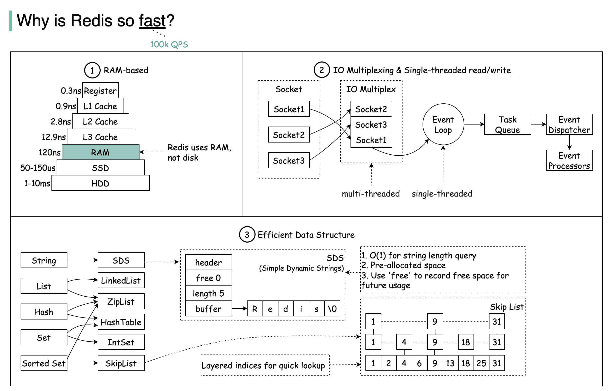
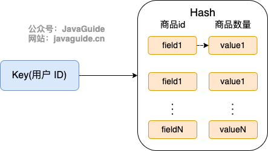
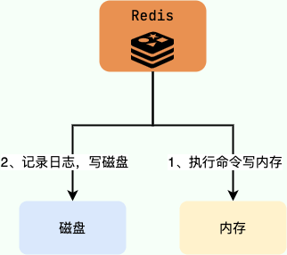

## Redis 基础

### 什么是 Redis？

[Redis](https://redis.io/) 是一个基于 C 语言开发的开源数据库（BSD 许可），与传统数据库不同的是 Redis 的数据是存在内存中的（内存数据库），读写速度非常快，被广泛应用于缓存方向。并且，Redis 存储的是 KV 键值对数据。

为了满足不同的业务场景，Redis 内置了多种数据类型实现（比如 String、Hash、Sorted Set、Bitmap）。并且，Redis 还支持事务 、持久化、Lua 脚本、多种开箱即用的集群方案（Redis Sentinel、Redis Cluster）。

Redis 没有外部依赖，Linux 和 OS X 是 Redis 开发和测试最多的两个操作系统，官方推荐生产环境使用  Linux 部署 Redis。

个人学习的话，你可以自己本机安装 Redis 或者通过 Redis 官网提供的[在线 Redis 环境](https://try.redis.io/)来实际体验 Redis。


全世界有非常多的网站使用到了 Redis ，[techstacks.io](https://techstacks.io/) 专门维护了一个[使用 Redis 的热门站点列表](https://techstacks.io/tech/redis) ，感兴趣的话可以看看。

### Redis 为什么这么快？

Redis 内部做了非常多的性能优化，比较重要的主要有下面 3 点：

- Redis 基于内存，内存的访问速度是磁盘的上千倍；
- Redis 基于 Reactor 模式设计开发了一套高效的事件处理模型，主要是单线程事件循环和 IO 多路复用（Redis 线程模式后面会详细介绍到）；
- Redis 内置了多种优化过后的数据结构实现，性能非常高。

下面这张图片总结的挺不错的，分享一下，出自 [Why is Redis so fast?](https://twitter.com/alexxubyte/status/1498703822528544770)  。



### 分布式缓存常见的技术选型方案有哪些？

分布式缓存的话，比较老牌同时也是使用的比较多的还是 **Memcached** 和 **Redis**。不过，现在基本没有看过还有项目使用 **Memcached** 来做缓存，都是直接用 **Redis**。

Memcached 是分布式缓存最开始兴起的那会，比较常用的。后来，随着 Redis 的发展，大家慢慢都转而使用更加强大的 Redis 了。

另外，腾讯也开源了一款类似于 Redis 的分布式高性能 KV 存储数据库，基于知名的开源项目 [RocksDB](https://github.com/facebook/rocksdb) 作为存储引擎 ，100% 兼容 Redis 协议和 Redis4.0 所有数据模型，名为 [Tendis](https://github.com/Tencent/Tendis)。

关于 Redis 和 Tendis 的对比，腾讯官方曾经发过一篇文章：[Redis vs Tendis：冷热混合存储版架构揭秘](https://mp.weixin.qq.com/s/MeYkfOIdnU6LYlsGb24KjQ) ，可以简单参考一下。

从这个项目的 Github 提交记录可以看出，Tendis 开源版几乎已经没有被维护更新了，加上其关注度并不高，使用的公司也比较少。因此，不建议你使用 Tendis 来实现分布式缓存。

### 说一下 Redis 和 Memcached 的区别和共同点

现在公司一般都是用 Redis 来实现缓存，而且 Redis 自身也越来越强大了！不过，了解 Redis 和 Memcached 的区别和共同点，有助于我们在做相应的技术选型的时候，能够做到有理有据！

**共同点** ：

1. 都是基于内存的数据库，一般都用来当做缓存使用。
2. 都有过期策略。
3. 两者的性能都非常高。

**区别** ：

1. **Redis 支持更丰富的数据类型（支持更复杂的应用场景）**。Redis 不仅仅支持简单的 k/v 类型的数据，同时还提供 list，set，zset，hash 等数据结构的存储。Memcached 只支持最简单的 k/v 数据类型。
2. **Redis 支持数据的持久化，可以将内存中的数据保持在磁盘中，重启的时候可以再次加载进行使用,而 Memcached 把数据全部存在内存之中。**
3. **Redis 有灾难恢复机制。** 因为可以把缓存中的数据持久化到磁盘上。
4. **Redis 在服务器内存使用完之后，可以将不用的数据放到磁盘上。但是，Memcached 在服务器内存使用完之后，就会直接报异常。**
5. **Memcached 没有原生的集群模式，需要依靠客户端来实现往集群中分片写入数据；但是 Redis 目前是原生支持 cluster 模式的。**
6. **Memcached 是多线程，非阻塞 IO 复用的网络模型；Redis 使用单线程的多路 IO 复用模型。** （Redis 6.0 引入了多线程 IO ）
7. **Redis 支持发布订阅模型、Lua 脚本、事务等功能，而 Memcached 不支持。并且，Redis 支持更多的编程语言。**
8. **Memcached 过期数据的删除策略只用了惰性删除，而 Redis 同时使用了惰性删除与定期删除。**

相信看了上面的对比之后，我们已经没有什么理由可以选择使用 Memcached 来作为自己项目的分布式缓存了。

### 为什么要用 Redis/为什么要用缓存？

下面我们主要从“高性能”和“高并发”这两点来回答这个问题。

**高性能**

假如用户第一次访问数据库中的某些数据的话，这个过程是比较慢，毕竟是从硬盘中读取的。但是，如果说，用户访问的数据属于高频数据并且不会经常改变的话，那么我们就可以很放心地将该用户访问的数据存在缓存中。

**这样有什么好处呢？** 那就是保证用户下一次再访问这些数据的时候就可以直接从缓存中获取了。操作缓存就是直接操作内存，所以速度相当快。

**高并发**

一般像 MySQL 这类的数据库的 QPS 大概都在 1w 左右（4 核 8g） ，但是使用 Redis 缓存之后很容易达到 10w+，甚至最高能达到 30w+（就单机 Redis 的情况，Redis 集群的话会更高）。

> QPS（Query Per Second）：服务器每秒可以执行的查询次数；

由此可见，直接操作缓存能够承受的数据库请求数量是远远大于直接访问数据库的，所以我们可以考虑把数据库中的部分数据转移到缓存中去，这样用户的一部分请求会直接到缓存这里而不用经过数据库。进而，我们也就提高了系统整体的并发。

### Redis 除了做缓存，还能做什么？

- **分布式锁** ： 通过 Redis 来做分布式锁是一种比较常见的方式。通常情况下，我们都是基于 Redisson 来实现分布式锁。相关阅读：[《分布式锁中的王者方案 - Redisson》](https://mp.weixin.qq.com/s/CbnPRfvq4m1sqo2uKI6qQw)。
- **限流** ：一般是通过 Redis + Lua 脚本的方式来实现限流。相关阅读：[《我司用了 6 年的 Redis 分布式限流器，可以说是非常厉害了！》](https://mp.weixin.qq.com/s/kyFAWH3mVNJvurQDt4vchA)。
- **消息队列** ：Redis 自带的 list 数据结构可以作为一个简单的队列使用。Redis 5.0 中增加的 Stream 类型的数据结构更加适合用来做消息队列。它比较类似于 Kafka，有主题和消费组的概念，支持消息持久化以及 ACK 机制。
- **复杂业务场景** ：通过 Redis 以及 Redis 扩展（比如 Redisson）提供的数据结构，我们可以很方便地完成很多复杂的业务场景比如通过 bitmap 统计活跃用户、通过 sorted set 维护排行榜。
- ......

### Redis 可以做消息队列么？

Redis 5.0 新增加的一个数据结构 `Stream` 可以用来做消息队列，`Stream` 支持：

- 发布 / 订阅模式
- 按照消费者组进行消费
- 消息持久化（ RDB 和 AOF）

不过，和专业的消息队列相比，还是有很多欠缺的地方比如消息丢失和堆积问题不好解决。因此，我们通常建议是不使用 Redis 来做消息队列的，你完全可以选择市面上比较成熟的一些消息队列比如 RocketMQ、Kafka。

相关文章推荐：[Redis 消息队列的三种方案（List、Streams、Pub/Sub）](https://javakeeper.starfish.ink/data-management/Redis/Redis-MQ.html)。

## Redis 数据结构

### Redis 常用的数据结构有哪些？

- **5 种基础数据结构** ：String（字符串）、List（列表）、Set（集合）、Hash（散列）、Zset（有序集合）。
- **3 种特殊数据结构** ：HyperLogLogs（基数统计）、Bitmap （位存储）、Geospatial (地理位置)。

关于 5 种基础数据结构的详细介绍请看这篇文章：[Redis 5 种基本数据结构详解](./redis-data-structures-01.md)。

关于 3 种特殊数据结构的详细介绍请看这篇文章：[Redis 3 种特殊数据结构详解](./redis-data-structures-02.md)。

### String 的应用场景有哪些？

- 常规数据（比如 session、token、、序列化后的对象）的缓存；
- 计数比如用户单位时间的请求数（简单限流可以用到）、页面单位时间的访问数；
- 分布式锁(利用 `SETNX key value` 命令可以实现一个最简易的分布式锁)；
- ......

关于 String 的详细介绍请看这篇文章：[Redis 5 种基本数据结构详解](./redis-data-structures-01.md)。

### String 还是 Hash 存储对象数据更好呢？

- String 存储的是序列化后的对象数据，存放的是整个对象。Hash 是对对象的每个字段单独存储，可以获取部分字段的信息，也可以修改或者添加部分字段，节省网络流量。如果对象中某些字段需要经常变动或者经常需要单独查询对象中的个别字段信息，Hash 就非常适合。
- String 存储相对来说更加节省内存，缓存相同数量的对象数据，String 消耗的内存约是 Hash 的一半。并且，存储具有多层嵌套的对象时也方便很多。如果系统对性能和资源消耗非常敏感的话，String 就非常适合。

在绝大部分情况，我们建议使用 String 来存储对象数据即可！

### 购物车信息用 String 还是 Hash 存储更好呢?

由于购物车中的商品频繁修改和变动，购物车信息建议使用 Hash 存储：

- 用户 id 为 key
- 商品 id 为 field，商品数量为 value



那用户购物车信息的维护具体应该怎么操作呢？

- 用户添加商品就是往 Hash 里面增加新的 field 与 value；
- 查询购物车信息就是遍历对应的 Hash；
- 更改商品数量直接修改对应的 value 值（直接 set 或者做运算皆可）；
- 删除商品就是删除 Hash 中对应的 field；
- 清空购物车直接删除对应的 key 即可。

这里只是以业务比较简单的购物车场景举例，实际电商场景下，field 只保存一个商品 id 是没办法满足需求的。

### 使用 Redis 实现一个排行榜怎么做？

Redis 中有一个叫做 `sorted set` 的数据结构经常被用在各种排行榜的场景，比如直播间送礼物的排行榜、朋友圈的微信步数排行榜、王者荣耀中的段位排行榜、话题热度排行榜等等。

相关的一些 Redis 命令: `ZRANGE` (从小到大排序) 、 `ZREVRANGE` （从大到小排序）、`ZREVRANK` (指定元素排名)。


[《Java 面试指北》](https://www.yuque.com/docs/share/f37fc804-bfe6-4b0d-b373-9c462188fec7) 的「技术面试题篇」就有一篇文章详细介绍如何使用 Sorted Set 来设计制作一个排行榜。


### 使用 Set 实现抽奖系统需要用到什么命令？

- `SPOP key count` ： 随机移除并获取指定集合中一个或多个元素，适合不允许重复中奖的场景。
- `SRANDMEMBER key count` : 随机获取指定集合中指定数量的元素，适合允许重复中奖的场景。

### 使用 Bitmap 统计活跃用户怎么做？

使用日期（精确到天）作为 key，然后用户 ID 为 offset，如果当日活跃过就设置为 1。

初始化数据：

```bash
> SETBIT 20210308 1 1
(integer) 0
> SETBIT 20210308 2 1
(integer) 0
> SETBIT 20210309 1 1
(integer) 0
```

统计 20210308~20210309 总活跃用户数:

```bash
> BITOP and desk1 20210308 20210309
(integer) 1
> BITCOUNT desk1
(integer) 1
```

统计 20210308~20210309 在线活跃用户数:

```bash
> BITOP or desk2 20210308 20210309
(integer) 1
> BITCOUNT desk2
(integer) 2
```

### 使用 HyperLogLog 统计页面 UV 怎么做？

1、将访问指定页面的每个用户 ID 添加到 `HyperLogLog` 中。

```bash
PFADD PAGE_1:UV USER1 USER2 ...... USERn
```

2、统计指定页面的 UV。

```bash
PFCOUNT PAGE_1:UV
```

## Redis 线程模型

对于读写命令来说，Redis 一直是单线程模型。不过，在 Redis 4.0 版本之后引入了多线程来执行一些大键值对的异步删除操作， Redis 6.0 版本之后引入了多线程来处理网络请求（提高网络 IO 读写性能）。

### Redis 单线程模型了解吗？

**Redis 基于 Reactor 模式设计开发了一套高效的事件处理模型** （Netty 的线程模型也基于 Reactor 模式，Reactor 模式不愧是高性能 IO 的基石），这套事件处理模型对应的是 Redis 中的文件事件处理器（file event handler）。由于文件事件处理器（file event handler）是单线程方式运行的，所以我们一般都说 Redis 是单线程模型。

《Redis 设计与实现》有一段话是如是介绍文件事件处理器的，我觉得写得挺不错。

> Redis 基于 Reactor 模式开发了自己的网络事件处理器：这个处理器被称为文件事件处理器（file event handler）。
>
> - 文件事件处理器使用 I/O 多路复用（multiplexing）程序来同时监听多个套接字，并根据套接字目前执行的任务来为套接字关联不同的事件处理器。
> - 当被监听的套接字准备好执行连接应答（accept）、读取（read）、写入（write）、关 闭（close）等操作时，与操作相对应的文件事件就会产生，这时文件事件处理器就会调用套接字之前关联好的事件处理器来处理这些事件。
>
> **虽然文件事件处理器以单线程方式运行，但通过使用 I/O 多路复用程序来监听多个套接字**，文件事件处理器既实现了高性能的网络通信模型，又可以很好地与 Redis 服务器中其他同样以单线程方式运行的模块进行对接，这保持了 Redis 内部单线程设计的简单性。

**既然是单线程，那怎么监听大量的客户端连接呢？**

Redis 通过 **IO 多路复用程序** 来监听来自客户端的大量连接（或者说是监听多个 socket），它会将感兴趣的事件及类型（读、写）注册到内核中并监听每个事件是否发生。

这样的好处非常明显： **I/O 多路复用技术的使用让 Redis 不需要额外创建多余的线程来监听客户端的大量连接，降低了资源的消耗**（和 NIO 中的 `Selector` 组件很像）。

文件事件处理器（file event handler）主要是包含 4 个部分：

- 多个 socket（客户端连接）
- IO 多路复用程序（支持多个客户端连接的关键）
- 文件事件分派器（将 socket 关联到相应的事件处理器）
- 事件处理器（连接应答处理器、命令请求处理器、命令回复处理器）


相关阅读：[Redis 事件机制详解](http://remcarpediem.net/article/1aa2da89/) 。

### Redis6.0 之前为什么不使用多线程？

虽然说 Redis 是单线程模型，但是，实际上，**Redis 在 4.0 之后的版本中就已经加入了对多线程的支持。**

不过，Redis 4.0 增加的多线程主要是针对一些大键值对的删除操作的命令，使用这些命令就会使用主线程之外的其他线程来“异步处理”。

为此，Redis 4.0 之后新增了`UNLINK`（可以看作是 `DEL` 的异步版本）、`FLUSHALL ASYNC`（清空所有数据库的所有 key，不仅仅是当前 `SELECT` 的数据库）、`FLUSHDB ASYNC`（清空当前 `SELECT` 数据库中的所有 key）等异步命令。


大体上来说，Redis 6.0 之前主要还是单线程处理。

**那 Redis6.0 之前为什么不使用多线程？** 我觉得主要原因有 3 点：

- 单线程编程容易并且更容易维护；
- Redis 的性能瓶颈不在 CPU ，主要在内存和网络；
- 多线程就会存在死锁、线程上下文切换等问题，甚至会影响性能。

相关阅读：[为什么 Redis 选择单线程模型](https://draveness.me/whys-the-design-redis-single-thread/) 。

### Redis6.0 之后为何引入了多线程？

**Redis6.0 引入多线程主要是为了提高网络 IO 读写性能**，因为这个算是 Redis 中的一个性能瓶颈（Redis 的瓶颈主要受限于内存和网络）。

虽然，Redis6.0 引入了多线程，但是 Redis 的多线程只是在网络数据的读写这类耗时操作上使用了，执行命令仍然是单线程顺序执行。因此，你也不需要担心线程安全问题。

Redis6.0 的多线程默认是禁用的，只使用主线程。如需开启需要修改 redis 配置文件 `redis.conf` ：

```bash
io-threads-do-reads yes
```

开启多线程后，还需要设置线程数，否则是不生效的。同样需要修改 redis 配置文件 `redis.conf` :

```bash
io-threads 4 #官网建议4核的机器建议设置为2或3个线程，8核的建议设置为6个线程
```

相关阅读：

- [Redis 6.0 新特性-多线程连环 13 问！](https://mp.weixin.qq.com/s/FZu3acwK6zrCBZQ_3HoUgw)
- [Redis 多线程网络模型全面揭秘](https://segmentfault.com/a/1190000039223696)（推荐）

## Redis 内存管理

### Redis 给缓存数据设置过期时间有啥用？

一般情况下，我们设置保存的缓存数据的时候都会设置一个过期时间。为什么呢？

因为内存是有限的，如果缓存中的所有数据都是一直保存的话，分分钟直接 Out of memory。

Redis 自带了给缓存数据设置过期时间的功能，比如：

```bash
127.0.0.1:6379> expire key 60 # 数据在 60s 后过期
(integer) 1
127.0.0.1:6379> setex key 60 value # 数据在 60s 后过期 (setex:[set] + [ex]pire)
OK
127.0.0.1:6379> ttl key # 查看数据还有多久过期
(integer) 56
```

注意：**Redis 中除了字符串类型有自己独有设置过期时间的命令 `setex` 外，其他方法都需要依靠 `expire` 命令来设置过期时间 。另外， `persist` 命令可以移除一个键的过期时间。**

**过期时间除了有助于缓解内存的消耗，还有什么其他用么？**

很多时候，我们的业务场景就是需要某个数据只在某一时间段内存在，比如我们的短信验证码可能只在 1 分钟内有效，用户登录的 token 可能只在 1 天内有效。

如果使用传统的数据库来处理的话，一般都是自己判断过期，这样更麻烦并且性能要差很多。

### Redis 是如何判断数据是否过期的呢？

Redis 通过一个叫做过期字典（可以看作是 hash 表）来保存数据过期的时间。过期字典的键指向 Redis 数据库中的某个 key(键)，过期字典的值是一个 long long 类型的整数，这个整数保存了 key 所指向的数据库键的过期时间（毫秒精度的 UNIX 时间戳）。


过期字典是存储在 redisDb 这个结构里的：

```c
typedef struct redisDb {
    ...

    dict *dict;     //数据库键空间,保存着数据库中所有键值对
    dict *expires   // 过期字典,保存着键的过期时间
    ...
} redisDb;
```

### 过期的数据的删除策略了解么？

如果假设你设置了一批 key 只能存活 1 分钟，那么 1 分钟后，Redis 是怎么对这批 key 进行删除的呢？

常用的过期数据的删除策略就两个（重要！自己造缓存轮子的时候需要格外考虑的东西）：

1. **惰性删除** ：只会在取出 key 的时候才对数据进行过期检查。这样对 CPU 最友好，但是可能会造成太多过期 key 没有被删除。
2. **定期删除** ： 每隔一段时间抽取一批 key 执行删除过期 key 操作。并且，Redis 底层会通过限制删除操作执行的时长和频率来减少删除操作对 CPU 时间的影响。

定期删除对内存更加友好，惰性删除对 CPU 更加友好。两者各有千秋，所以 Redis 采用的是 **定期删除+惰性/懒汉式删除** 。

但是，仅仅通过给 key 设置过期时间还是有问题的。因为还是可能存在定期删除和惰性删除漏掉了很多过期 key 的情况。这样就导致大量过期 key 堆积在内存里，然后就 Out of memory 了。

怎么解决这个问题呢？答案就是：**Redis 内存淘汰机制。**

### Redis 内存淘汰机制了解么？

> 相关问题：MySQL 里有 2000w 数据，Redis 中只存 20w 的数据，如何保证 Redis 中的数据都是热点数据?

Redis 提供 6 种数据淘汰策略：

1. **volatile-lru（least recently used）**：从已设置过期时间的数据集（server.db[i].expires）中挑选最近最少使用的数据淘汰
2. **volatile-ttl**：从已设置过期时间的数据集（server.db[i].expires）中挑选将要过期的数据淘汰
3. **volatile-random**：从已设置过期时间的数据集（server.db[i].expires）中任意选择数据淘汰
4. **allkeys-lru（least recently used）**：当内存不足以容纳新写入数据时，在键空间中，移除最近最少使用的 key（这个是最常用的）
5. **allkeys-random**：从数据集（server.db[i].dict）中任意选择数据淘汰
6. **no-eviction**：禁止驱逐数据，也就是说当内存不足以容纳新写入数据时，新写入操作会报错。这个应该没人使用吧！

4.0 版本后增加以下两种：

7. **volatile-lfu（least frequently used）**：从已设置过期时间的数据集（server.db[i].expires）中挑选最不经常使用的数据淘汰
8. **allkeys-lfu（least frequently used）**：当内存不足以容纳新写入数据时，在键空间中，移除最不经常使用的 key

## Redis 持久化机制

### 怎么保证 Redis 挂掉之后再重启数据可以进行恢复？

很多时候我们需要持久化数据也就是将内存中的数据写入到硬盘里面，大部分原因是为了之后重用数据（比如重启机器、机器故障之后恢复数据），或者是为了防止系统故障而将数据备份到一个远程位置。

Redis 不同于 Memcached 的很重要一点就是，Redis 支持持久化，而且支持两种不同的持久化操作。**Redis 的一种持久化方式叫快照（snapshotting，RDB），另一种方式是只追加文件（append-only file, AOF）**。这两种方法各有千秋，下面我会详细这两种持久化方法是什么，怎么用，如何选择适合自己的持久化方法。

### 什么是 RDB 持久化？

Redis 可以通过创建快照来获得存储在内存里面的数据在某个时间点上的副本。Redis 创建快照之后，可以对快照进行备份，可以将快照复制到其他服务器从而创建具有相同数据的服务器副本（Redis 主从结构，主要用来提高 Redis 性能），还可以将快照留在原地以便重启服务器的时候使用。

快照持久化是 Redis 默认采用的持久化方式，在 `redis.conf` 配置文件中默认有此下配置：

```clojure
save 900 1           #在900秒(15分钟)之后，如果至少有1个key发生变化，Redis就会自动触发bgsave命令创建快照。

save 300 10          #在300秒(5分钟)之后，如果至少有10个key发生变化，Redis就会自动触发bgsave命令创建快照。

save 60 10000        #在60秒(1分钟)之后，如果至少有10000个key发生变化，Redis就会自动触发bgsave命令创建快照。
```

### RDB 创建快照时会阻塞主线程吗？

Redis 提供了两个命令来生成 RDB 快照文件：

- `save` : 主线程执行，会阻塞主线程；
- `bgsave` : 子线程执行，不会阻塞主线程，默认选项。

### 什么是 AOF 持久化？

与快照持久化相比，AOF 持久化的实时性更好，因此已成为主流的持久化方案。默认情况下 Redis 没有开启 AOF（append only file）方式的持久化，可以通过 appendonly 参数开启：

```bash
appendonly yes
```

开启 AOF 持久化后每执行一条会更改 Redis 中的数据的命令，Redis 就会将该命令写入到内存缓存 `server.aof_buf` 中，然后再根据 `appendfsync` 配置来决定何时将其同步到硬盘中的 AOF 文件。

AOF 文件的保存位置和 RDB 文件的位置相同，都是通过 dir 参数设置的，默认的文件名是 `appendonly.aof`。

在 Redis 的配置文件中存在三种不同的 AOF 持久化方式，它们分别是：

```bash
appendfsync always    #每次有数据修改发生时都会写入AOF文件,这样会严重降低Redis的速度
appendfsync everysec  #每秒钟同步一次，显式地将多个写命令同步到硬盘
appendfsync no        #让操作系统决定何时进行同步
```

为了兼顾数据和写入性能，用户可以考虑 `appendfsync everysec` 选项 ，让 Redis 每秒同步一次 AOF 文件，Redis 性能几乎没受到任何影响。而且这样即使出现系统崩溃，用户最多只会丢失一秒之内产生的数据。当硬盘忙于执行写入操作的时候，Redis 还会优雅的放慢自己的速度以便适应硬盘的最大写入速度。

**相关 issue** ：

- [Redis 的 AOF 方式 #783](https://github.com/Snailclimb/JavaGuide/issues/783)
- [Redis AOF 重写描述不准确 #1439](https://github.com/Snailclimb/JavaGuide/issues/1439)

### AOF 日志是如何实现的？

关系型数据库（如 MySQL）通常都是执行命令之前记录日志（方便故障恢复），而 Redis AOF 持久化机制是在执行完命令之后再记录日志。



**为什么是在执行完命令之后记录日志呢？**

- 避免额外的检查开销，AOF 记录日志不会对命令进行语法检查；
- 在命令执行完之后再记录，不会阻塞当前的命令执行。

这样也带来了风险（我在前面介绍 AOF 持久化的时候也提到过）：

- 如果刚执行完命令 Redis 就宕机会导致对应的修改丢失；
- 可能会阻塞后续其他命令的执行（AOF 记录日志是在 Redis 主线程中进行的）。

### AOF 重写了解吗？

当 AOF 变得太大时，Redis 能够在后台自动重写 AOF 产生一个新的 AOF 文件，这个新的 AOF 文件和原有的 AOF 文件所保存的数据库状态一样，但体积更小。

AOF 重写是一个有歧义的名字，该功能是通过读取数据库中的键值对来实现的，程序无须对现有 AOF 文件进行任何读入、分析或者写入操作。

在执行 `BGREWRITEAOF` 命令时，Redis 服务器会维护一个 AOF 重写缓冲区，该缓冲区会在子进程创建新 AOF 文件期间，记录服务器执行的所有写命令。当子进程完成创建新 AOF 文件的工作之后，服务器会将重写缓冲区中的所有内容追加到新 AOF 文件的末尾，使得新的 AOF 文件保存的数据库状态与现有的数据库状态一致。最后，服务器用新的 AOF 文件替换旧的 AOF 文件，以此来完成 AOF 文件重写操作。

Redis 7.0 版本之前，如果在重写期间有写入命令，AOF 可能会使用大量内存，重写期间到达的所有写入命令都会写入磁盘两次。

### 如何选择 RDB 和 AOF？

关于 RDB 和 AOF 的优缺点，官网上面也给了比较详细的说明[Redis persistence](https://redis.io/docs/manual/persistence/)，这里结合自己的理解简单总结一下。

**RDB 比 AOF 优秀的地方** ：

- RDB 文件存储的内容是经过压缩的二进制数据， 保存着某个时间点的数据集，文件很小，适合做数据的备份，灾难恢复。AOF 文件存储的是每一次写命令，类似于 MySQL 的 binlog 日志，通常会必 RDB 文件大很多。当 AOF 变得太大时，Redis 能够在后台自动重写 AOF。新的 AOF 文件和原有的 AOF 文件所保存的数据库状态一样，但体积更小。不过， Redis 7.0 版本之前，如果在重写期间有写入命令，AOF 可能会使用大量内存，重写期间到达的所有写入命令都会写入磁盘两次。
- 使用 RDB 文件恢复数据，直接解析还原数据即可，不需要一条一条地执行命令，速度非常快。而 AOF 则需要依次执行每个写命令，速度非常慢。也就是说，与 AOF 相比，恢复大数据集的时候，RDB 速度更快。

**AOF 比 RDB 优秀的地方** ：

- RDB 的数据安全性不如 AOF，没有办法实时或者秒级持久化数据。生成 RDB 文件的过程是比繁重的， 虽然 BGSAVE 子进程写入 RDB 文件的工作不会阻塞主线程，但会对机器的 CPU 资源和内存资源产生影响，严重的情况下甚至会直接把 Redis 服务干宕机。AOF 支持秒级数据丢失（取决 fsync 策略，如果是 everysec，最多丢失 1 秒的数据），仅仅是追加命令到 AOF 文件，操作轻量。
- RDB 文件是以特定的二进制格式保存的，并且在 Redis 版本演进中有多个版本的 RDB，所以存在老版本的 Redis 服务不兼容新版本的 RDB 格式的问题。
- AOF 以一种易于理解和解析的格式包含所有操作的日志。你可以轻松地导出 AOF 文件进行分析，你也可以直接操作 AOF 文件来解决一些问题。比如，如果执行`FLUSHALL`命令意外地刷新了所有内容后，只要 AOF 文件没有被重写，删除最新命令并重启即可恢复之前的状态。

### Redis 4.0 对于持久化机制做了什么优化？

由于 RDB 和 AOF 各有优势，于是，Redis 4.0 开始支持 RDB 和 AOF 的混合持久化（默认关闭，可以通过配置项 `aof-use-rdb-preamble` 开启）。

如果把混合持久化打开，AOF 重写的时候就直接把 RDB 的内容写到 AOF 文件开头。这样做的好处是可以结合 RDB 和 AOF 的优点, 快速加载同时避免丢失过多的数据。当然缺点也是有的， AOF 里面的 RDB 部分是压缩格式不再是 AOF 格式，可读性较差。

官方文档地址：https://redis.io/topics/persistence


## 参考

- 《Redis 开发与运维》
- 《Redis 设计与实现》
- Redis 命令手册：https://www.redis.com.cn/commands.html
- WHY Redis choose single thread (vs multi threads): [https://medium.com/@jychen7/sharing-redis-single-thread-vs-multi-threads-5870bd44d153](https://medium.com/@jychen7/sharing-redis-single-thread-vs-multi-threads-5870bd44d153)
- The difference between AOF and RDB persistence：https://www.sobyte.net/post/2022-04/redis-rdb-and-aof/
