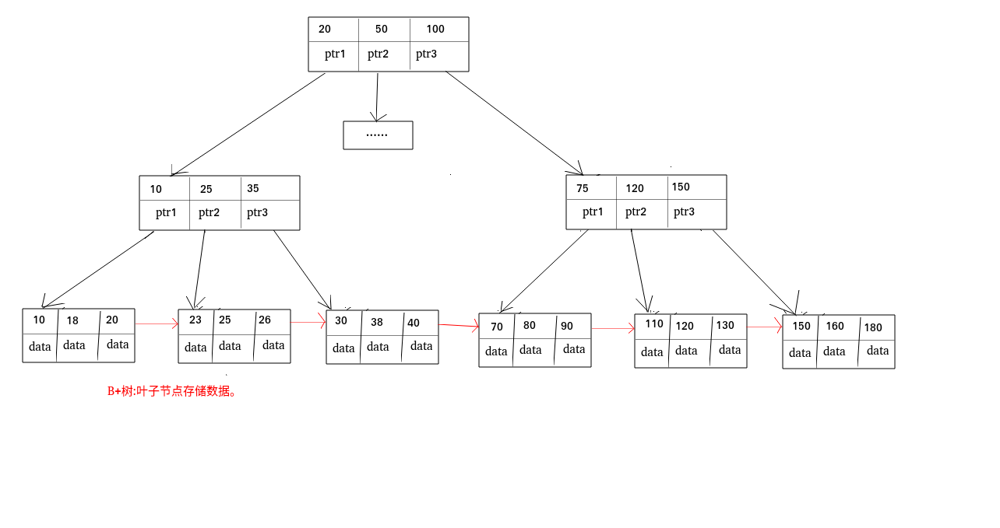
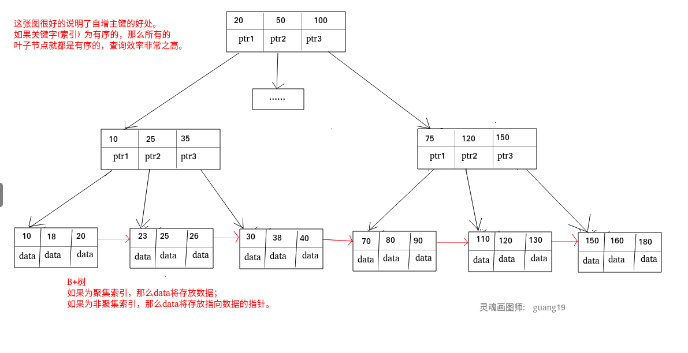
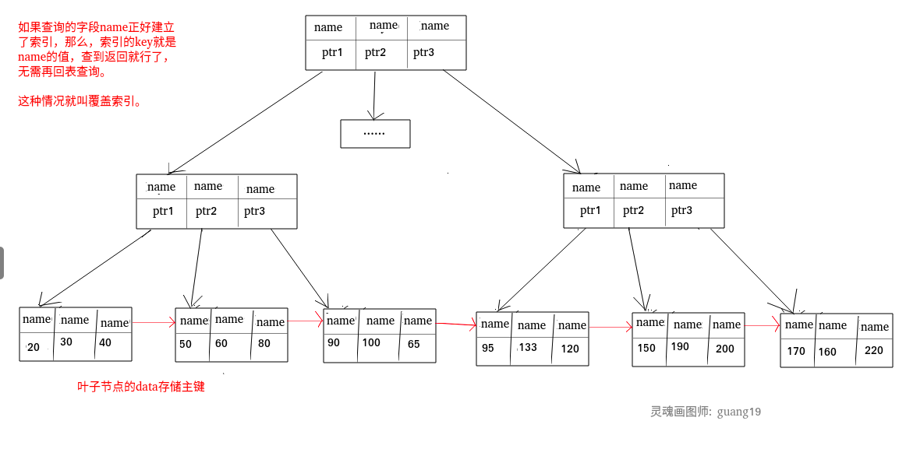

## 什么是索引?

**索引是一种用于快速查询和检索数据的数据结构。常见的索引结构有: B 树， B+树和 Hash。**

索引的作用就相当于目录的作用。打个比方: 我们在查字典的时候，如果没有目录，那我们就只能一页一页的去找我们需要查的那个字，速度很慢。如果有目录了，我们只需要先去目录里查找字的位置，然后直接翻到那一页就行了。

## 为什么要用索引?索引的优缺点分析

### 索引的优点

**可以大大加快 数据的检索速度（大大减少的检索的数据量）, 这也是创建索引的最主要的原因。毕竟大部分系统的读请求总是大于写请求的。** 另外，通过创建唯一性索引，可以保证数据库表中每一行数据的唯一性。

### 索引的缺点

1. **创建索引和维护索引需要耗费许多时间**：当对表中的数据进行增删改的时候，如果数据有索引，那么索引也需要动态的修改，会降低 SQL 执行效率。
2. **占用物理存储空间** ：索引需要使用物理文件存储，也会耗费一定空间。

## B 树和 B+树区别

- B 树的所有节点既存放 键(key) 也存放 数据(data);而 B+树只有叶子节点存放 key 和 data，其他内节点只存放 key。
- B 树的叶子节点都是独立的;B+树的叶子节点有一条引用链指向与它相邻的叶子节点。
- B 树的检索的过程相当于对范围内的每个节点的关键字做二分查找，可能还没有到达叶子节点，检索就结束了。而 B+树的检索效率就很稳定了，任何查找都是从根节点到叶子节点的过程，叶子节点的顺序检索很明显。



## Hash 索引和 B+树索引优劣分析

**Hash 索引定位快**

Hash 索引指的就是 Hash 表，最大的优点就是能够在很短的时间内，根据 Hash 函数定位到数据所在的位置，这是 B+树所不能比的。

**Hash 冲突问题**

知道 HashMap 或 HashTable 的同学，相信都知道它们最大的缺点就是 Hash 冲突了。不过对于数据库来说这还不算最大的缺点。

**Hash 索引不支持顺序和范围查询(Hash 索引不支持顺序和范围查询是它最大的缺点。**

试想一种情况:

```text
SELECT * FROM tb1 WHERE id < 500;
```

B+树是有序的，在这种范围查询中，优势非常大，直接遍历比 500 小的叶子节点就够了。而 Hash 索引是根据 hash 算法来定位的，难不成还要把 1 - 499 的数据，每个都进行一次 hash 计算来定位吗?这就是 Hash 最大的缺点了。

---

## 索引类型

### 主键索引(Primary Key)

**数据表的主键列使用的就是主键索引。**

**一张数据表有只能有一个主键，并且主键不能为 null，不能重复。**

**在 mysql 的 InnoDB 的表中，当没有显示的指定表的主键时，InnoDB 会自动先检查表中是否有唯一索引的字段，如果有，则选择该字段为默认的主键，否则 InnoDB 将会自动创建一个 6Byte 的自增主键。**

### 二级索引(辅助索引)

**二级索引又称为辅助索引，是因为二级索引的叶子节点存储的数据是主键。也就是说，通过二级索引，可以定位主键的位置。**

唯一索引，普通索引，前缀索引等索引属于二级索引。

**PS:不懂的同学可以暂存疑，慢慢往下看，后面会有答案的，也可以自行搜索。**

1. **唯一索引(Unique Key)** ：唯一索引也是一种约束。**唯一索引的属性列不能出现重复的数据，但是允许数据为 NULL，一张表允许创建多个唯一索引。** 建立唯一索引的目的大部分时候都是为了该属性列的数据的唯一性，而不是为了查询效率。
2. **普通索引(Index)** ：**普通索引的唯一作用就是为了快速查询数据，一张表允许创建多个普通索引，并允许数据重复和 NULL。**
3. **前缀索引(Prefix)** ：前缀索引只适用于字符串类型的数据。前缀索引是对文本的前几个字符创建索引，相比普通索引建立的数据更小，
   因为只取前几个字符。
4. **全文索引(Full Text)** ：全文索引主要是为了检索大文本数据中的关键字的信息，是目前搜索引擎数据库使用的一种技术。Mysql5.6 之前只有 MYISAM 引擎支持全文索引，5.6 之后 InnoDB 也支持了全文索引。

二级索引:
.png>)

## 聚集索引与非聚集索引

### 聚集索引

**聚集索引即索引结构和数据一起存放的索引。主键索引属于聚集索引。**

在 Mysql 中，InnoDB 引擎的表的 `.ibd`文件就包含了该表的索引和数据，对于 InnoDB 引擎表来说，该表的索引(B+树)的每个非叶子节点存储索引，叶子节点存储索引和索引对应的数据。

#### 聚集索引的优点

聚集索引的查询速度非常的快，因为整个 B+树本身就是一颗多叉平衡树，叶子节点也都是有序的，定位到索引的节点，就相当于定位到了数据。

#### 聚集索引的缺点

1. **依赖于有序的数据** ：因为 B+树是多路平衡树，如果索引的数据不是有序的，那么就需要在插入时排序，如果数据是整型还好，否则类似于字符串或 UUID 这种又长又难比较的数据，插入或查找的速度肯定比较慢。
2. **更新代价大** ： 如果对索引列的数据被修改时，那么对应的索引也将会被修改，
   而且况聚集索引的叶子节点还存放着数据，修改代价肯定是较大的，
   所以对于主键索引来说，主键一般都是不可被修改的。

### 非聚集索引

**非聚集索引即索引结构和数据分开存放的索引。**

**二级索引属于非聚集索引。**

> MYISAM 引擎的表的.MYI 文件包含了表的索引，
> 该表的索引(B+树)的每个叶子非叶子节点存储索引，
> 叶子节点存储索引和索引对应数据的指针，指向.MYD 文件的数据。
>
> **非聚集索引的叶子节点并不一定存放数据的指针，
> 因为二级索引的叶子节点就存放的是主键，根据主键再回表查数据。**

#### 非聚集索引的优点

**更新代价比聚集索引要小** 。非聚集索引的更新代价就没有聚集索引那么大了，非聚集索引的叶子节点是不存放数据的

#### 非聚集索引的缺点

1. 跟聚集索引一样，非聚集索引也依赖于有序的数据
2. **可能会二次查询(回表)** :这应该是非聚集索引最大的缺点了。 当查到索引对应的指针或主键后，可能还需要根据指针或主键再到数据文件或表中查询。

这是 Mysql 的表的文件截图:


聚集索引和非聚集索引:



### 非聚集索引一定回表查询吗(覆盖索引)?

**非聚集索引不一定回表查询。**

> 试想一种情况，用户准备使用 SQL 查询用户名，而用户名字段正好建立了索引。

```text
 SELECT name FROM table WHERE name='guang19';
```

> 那么这个索引的 key 本身就是 name，查到对应的 name 直接返回就行了，无需回表查询。

**即使是 MYISAM 也是这样，虽然 MYISAM 的主键索引确实需要回表，
因为它的主键索引的叶子节点存放的是指针。但是如果 SQL 查的就是主键呢?**

```text
SELECT id FROM table WHERE id=1;
```

主键索引本身的 key 就是主键，查到返回就行了。这种情况就称之为覆盖索引了。

## 覆盖索引

如果一个索引包含（或者说覆盖）所有需要查询的字段的值，我们就称之为“覆盖索引”。我们知道在 InnoDB 存储引擎中，如果不是主键索引，叶子节点存储的是主键+列值。最终还是要“回表”，也就是要通过主键再查找一次。这样就会比较慢覆盖索引就是把要查询出的列和索引是对应的，不做回表操作！

**覆盖索引即需要查询的字段正好是索引的字段，那么直接根据该索引，就可以查到数据了，
而无需回表查询。**

> 如主键索引，如果一条 SQL 需要查询主键，那么正好根据主键索引就可以查到主键。
>
> 再如普通索引，如果一条 SQL 需要查询 name，name 字段正好有索引，
> 那么直接根据这个索引就可以查到数据，也无需回表。

覆盖索引:


---

## 索引创建原则

### 单列索引

单列索引即由一列属性组成的索引。

### 联合索引(多列索引)

联合索引即由多列属性组成索引。

### 最左前缀原则

假设创建的联合索引由三个字段组成:

```text
ALTER TABLE table ADD INDEX index_name (num,name,age)
```

那么当查询的条件有为:num / (num AND name) / (num AND name AND age)时，索引才生效。所以在创建联合索引时，尽量把查询最频繁的那个字段作为最左(第一个)字段。查询的时候也尽量以这个字段为第一条件。


## 索引创建注意点

### 最左前缀原则

虽然我目前的 Mysql 版本较高，好像不遵守最左前缀原则，索引也会生效。
但是我们仍应遵守最左前缀原则，以免版本更迭带来的麻烦。

### 选择合适的字段

#### 1.不为 NULL 的字段

索引字段的数据应该尽量不为 NULL，因为对于数据为 NULL 的字段，数据库较难优化。如果字段频繁被查询，但又避免不了为 NULL，建议使用 0,1,true,false 这样语义较为清晰的短值或短字符作为替代。

#### 2.被频繁查询的字段

我们创建索引的字段应该是查询操作非常频繁的字段。

#### 3.被作为条件查询的字段

被作为 WHERE 条件查询的字段，应该被考虑建立索引。

#### 4.被经常频繁用于连接的字段

经常用于连接的字段可能是一些外键列，对于外键列并不一定要建立外键，只是说该列涉及到表与表的关系。对于频繁被连接查询的字段，可以考虑建立索引，提高多表连接查询的效率。

### 不合适创建索引的字段

#### 1.被频繁更新的字段应该慎重建立索引

虽然索引能带来查询上的效率，但是维护索引的成本也是不小的。
如果一个字段不被经常查询，反而被经常修改，那么就更不应该在这种字段上建立索引了。

#### 2.不被经常查询的字段没有必要建立索引

#### 3.尽可能的考虑建立联合索引而不是单列索引

因为索引是需要占用磁盘空间的，可以简单理解为每个索引都对应着一颗 B+树。如果一个表的字段过多，索引过多，那么当这个表的数据达到一个体量后，索引占用的空间也是很多的，且修改索引时，耗费的时间也是较多的。如果是联合索引，多个字段在一个索引上，那么将会节约很大磁盘空间，且修改数据的操作效率也会提升。

#### 4.注意避免冗余索引

冗余索引指的是索引的功能相同，能够命中索引(a, b)就肯定能命中索引(a) ，那么索引(a)就是冗余索引。如（name,city ）和（name ）这两个索引就是冗余索引，能够命中前者的查询肯定是能够命中后者的 在大多数情况下，都应该尽量扩展已有的索引而不是创建新索引。


#### 5.考虑在字符串类型的字段上使用前缀索引代替普通索引

前缀索引仅限于字符串类型，较普通索引会占用更小的空间，所以可以考虑使用前缀索引带替普通索引。

### 使用索引一定能提高查询性能吗?

大多数情况下，索引查询都是比全表扫描要快的。但是如果数据库的数据量不大，那么使用索引也不一定能够带来很大提升。
