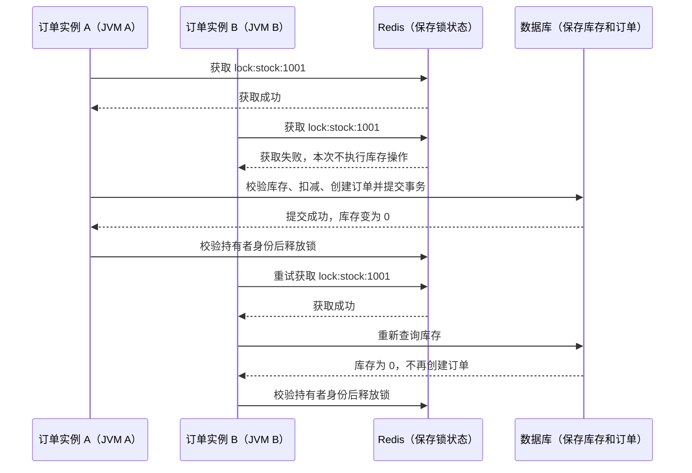

这篇文章从同一个服务部署多个实例的场景出发，介绍本地锁的作用范围、分布式锁解决的问题，以及使用时需要注意的边界。

## 为什么需要分布式锁？

**当多个进程需要互斥地操作同一份外部共享资源时，本地锁无法协调这些进程，分布式锁可以提供跨进程的互斥能力。**

这里的“共享资源”可以是数据库中同一件商品的库存记录、Redis 中同一个缓存条目等。**不同 JVM 通常不共享 Java 堆内存，但可以通过网络访问同一份外部数据。** 需要协调的是这些进程对外部数据的操作。

### 本地锁为什么管不住多个服务实例？

假设订单服务通过“查询库存 → 判断是否有货 → 扣减库存 → 创建订单”处理购买请求。这里先假设库存查询是普通查询，扣减时也没有 `count > 0` 条件或版本号校验。

只部署一个实例时，如果所有购买请求都使用同一个 `synchronized` 锁对象或 `ReentrantLock` 实例，并在锁内完成上述操作及事务提交，这些请求就能串行执行。锁内这段需要互斥执行的代码就是**临界区**。本地锁限制的是当前 JVM 中使用同一把锁的线程；锁内操作的数据也可以存放在数据库中。

现在把订单服务部署成 A、B 两个实例，各运行在一个 JVM 中，连接同一个数据库。即使代码完全相同，**A、B 中的本地锁也是两个独立的锁对象**，互相感知不到对方是否持锁。即使用 `static` 修饰锁字段，也只是各自 JVM 内共享。

当数据库中商品 `sku_id = 1001` 只剩 1 件库存时，就可能出现下面的执行顺序：

| 顺序 | 实例 A（JVM A）                            | 实例 B（JVM B）                            |
| ---- | ------------------------------------------ | ------------------------------------------ |
| 1    | 获取 A 内的本地锁，成功                    |                                            |
| 2    |                                            | 获取 B 内的本地锁，也成功                  |
| 3    | 查询库存为 1，通过校验                     |                                            |
| 4    |                                            | 查询库存也为 1，通过校验                   |
| 5    | 执行无条件扣减，创建订单并提交，释放本地锁 |                                            |
| 6    |                                            | 执行无条件扣减，创建订单并提交，释放本地锁 |

两个请求都成功了，但实际只有 1 件商品，于是发生超卖。这里本地锁仍然能约束各自 JVM 内的线程，却无法让另一个 JVM 中的请求等待。

### 分布式锁如何让多个实例互斥？

要让 A、B 竞争同一把锁，就需要把锁状态放到它们都能访问的外部系统中，例如 Redis、ZooKeeper 或数据库，并由这个系统原子地决定谁能获得锁。

以 Redis 锁为例，两个实例约定操作商品 `1001` 前，都先获取 `lock:stock:1001` 这把锁。下面展示 A 先获得锁、且锁在业务执行期间始终有效的情况：



图中的 Redis 保存的是**锁状态**，数据库保存的是**业务数据**。实例获取锁后，仍然由自己访问数据库。Redis 锁不会自动锁住数据库记录，所有需要互斥的访问方都必须遵守同一套加锁约定；绕过锁直接修改库存的请求不受它约束。

锁要覆盖完整的临界区：从库存校验到扣减、创建订单及事务提交，而不能只锁住查询。拿不到锁的请求可以等待、失败或重试；后续拿到锁时，需要重新检查业务状态。锁过期和客户端故障会影响互斥保证，下一节会介绍这些边界。

### 多实例部署就一定需要分布式锁吗？

不一定。**需要跨进程互斥，不代表必须额外引入 Redis 等分布式锁服务。** 如果数据库本身就能保证业务约束，通常可以直接利用数据库的能力。

例如，防止库存扣成负数，可以使用条件更新：

```sql
UPDATE stock SET count = count - 1 WHERE sku_id = ? AND count > 0;
```

以 MySQL InnoDB 为例，并发更新同一行时会通过行锁协调。只有受影响行数为 1 才表示扣减成功，才继续创建订单；扣减和订单写入应放在同一个本地事务中，失败时一起回滚。这样，即使有多个服务实例，也不需要为这次库存扣减额外加 Redis 锁。

同理，每个用户在同一活动限购 1 件，可以用 `user_id + activity_id` 的唯一约束保证；重复提交订单可以用幂等键处理。这些约束要分别设计，不能只靠一把库存锁解决。

当业务确实需要让多个进程中的某段逻辑串行执行，而数据库条件更新、唯一约束等手段又不适合时，再考虑分布式锁。它会增加网络请求和故障处理的复杂度，也会限制同一资源上的并发度。

## 分布式锁应该具备哪些条件？

一个最基本的分布式锁需要满足：

- **互斥**：对同一个资源对应的同一个 lock key，同一时刻只能有一个有效持有者。lock key 要按资源粒度设计，例如 `stock:{skuId}`、`order:{orderId}`，避免把无关资源都塞进一把全局大锁。
- **高可用和防死锁**：锁服务本身要尽量可用；同时要有过期时间、会话机制或租约机制，避免客户端崩溃后锁永久不释放。但过期时间必须和业务执行时间、续约机制一起设计，否则可能出现锁提前过期、两个客户端同时进入临界区的问题。
- **安全释放**：释放锁时必须校验锁持有者身份，只能释放自己持有的锁。以 Redis 为例，获取锁时写入随机 value，释放时用 Lua 脚本先比较 value，再删除 key。

除了上面这三个基本条件之外，一个好的分布式锁还需要满足下面这些条件：

- **可重入**：不是所有场景都必须具备，但如果同一线程/请求链路可能重复进入同一临界区，就需要记录锁持有者和重入次数，避免自己把自己阻塞。
- **高性能**：获取和释放锁的操作应该快速完成，并且不应该对整个系统的性能造成过大影响。
- **获取语义明确**：获取锁可以是阻塞等待、限时等待，也可以是立即失败。生产中通常要设置最大等待时间和重试退避，不能无限等待。
- **续约机制**：锁 TTL 要结合业务临界区的 P99 执行时间设置；临界区可能超过 TTL 时，需要看门狗/租约续约，或者缩短临界区。
- **Fencing Token**：更严格的场景还需要 Fencing Token。每次成功获取锁时生成一个单调递增 token，下游资源只接受 token 更大的写入，用来拦截锁过期后旧持有者的迟到写。

## 分布式锁的常见实现方式有哪些？

常见分布式锁实现方案如下：

- 基于关系型数据库比如 MySQL 实现分布式锁。
- 基于分布式协调服务 ZooKeeper 实现分布式锁。
- 基于 Redis 这类高性能键值存储（Key-Value Store），或 etcd 这类分布式一致性键值存储实现分布式锁。

数据库实现大致有三类：唯一索引插入锁表、基于事务的 `SELECT ... FOR UPDATE` 行锁、MySQL `GET_LOCK()` 这类命名锁。它们都能实现一定程度的互斥，但性能、释放时机、超时语义和故障恢复方式不同。

数据库方案不是不能做失效，而是失效语义和性能通常不如 Redis/ZooKeeper/etcd 这类方案自然。比如锁表可以加过期时间字段，但要处理过期锁抢占、时钟一致性、清理任务和事务隔离；`GET_LOCK()` 依赖 MySQL 连接/session 语义，不适合所有业务链路。

Redis 锁更常用于高性能、短临界区、允许通过业务幂等兜底的场景；ZooKeeper/etcd 更适合需要会话语义、顺序节点、租约和更强一致性的协调场景，但吞吐、延迟和运维成本通常更高。我专门写了一篇文章来详细介绍 Redis 和 ZooKeeper 这两种方案：[分布式锁常见实现方案总结](./distributed-lock-implementations.md)。

最后提醒一句：**分布式锁不是分布式事务。锁只能控制临界区并发进入，不保证数据库提交一定成功，也不保证消息发送和订单写入原子一致。业务一致性仍要依赖本地事务、幂等、状态机、补偿任务等机制。**

如果想进一步了解 Leader/Quorum、Lease 和 Fencing Token 之间的关系，可以阅读 [分布式协调详解](./protocol/centralized-and-decentralized.md)。

## 总结

这篇文章我们主要介绍了：

- 分布式锁的用途：协调多个进程对同一份外部共享资源的互斥访问。本地锁只能协调当前 JVM 内使用同一把锁的线程；如果数据库条件更新、唯一约束等已经能保证业务约束，就不必额外引入分布式锁服务。
- 分布式锁应该具备的条件：互斥、高可用和防死锁、安全释放、可重入、高性能、获取语义明确、续约机制。更严格的场景还要配合 Fencing Token。
- 分布式锁的常见实现方式：关系型数据库比如 MySQL、分布式协调服务 ZooKeeper、Redis 这类高性能键值存储、etcd 这类分布式一致性键值存储。

<!-- @include: @article-footer.snippet.md -->
