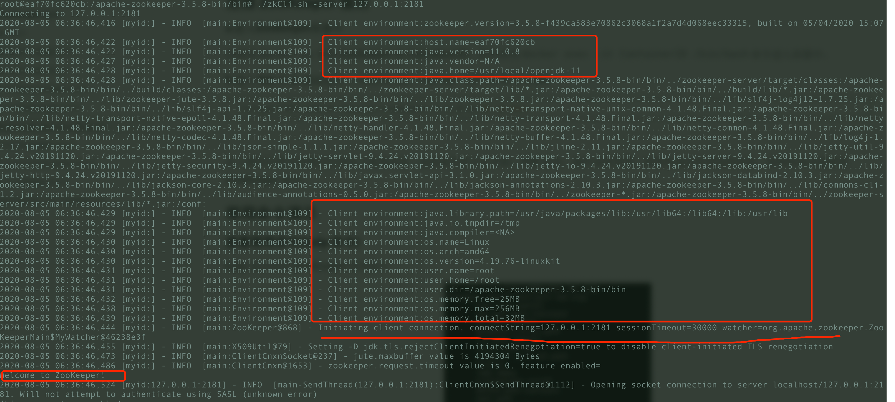
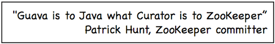

# ZooKeeper 实战

## 1. 前言

这篇文章简单给演示一下 ZooKeeper 常见命令的使用以及 ZooKeeper Java客户端 Curator 的基本使用。介绍到的内容都是最基本的操作，能满足日常工作的基本需要。

如果文章有任何需要改善和完善的地方，欢迎在评论区指出，共同进步！

## 2. ZooKeeper 安装和使用

### 2.1. 使用Docker 安装 zookeeper

**a.使用 Docker 下载 ZooKeeper**

```shell
docker pull zookeeper:3.5.8
```

**b.运行 ZooKeeper**

```shell
docker run -d --name zookeeper -p 2181:2181 zookeeper:3.5.8
```

### 2.2. 连接 ZooKeeper 服务

**a.进入ZooKeeper容器中**

先使用 `docker ps` 查看 ZooKeeper 的 ContainerID，然后使用 `docker exec -it ContainerID /bin/bash` 命令进入容器中。

**b.先进入 bin 目录,然后通过  `./zkCli.sh -server 127.0.0.1:2181`命令连接ZooKeeper 服务**

```bash
root@eaf70fc620cb:/apache-zookeeper-3.5.8-bin# cd bin
```

如果你看到控制台成功打印出如下信息的话，说明你已经成功连接 ZooKeeper 服务。



### 2.3. 常用命令演示

#### 2.3.1. 查看常用命令(help 命令)

通过 `help` 命令查看 ZooKeeper 常用命令

#### 2.3.2. 创建节点(create 命令)

通过 `create` 命令在根目录创建了 node1 节点，与它关联的字符串是"node1"

```shell
[zk: 127.0.0.1:2181(CONNECTED) 34] create /node1 “node1”
```

通过 `create` 命令在根目录创建了 node1 节点，与它关联的内容是数字 123

```shell
[zk: 127.0.0.1:2181(CONNECTED) 1] create /node1/node1.1 123
Created /node1/node1.1
```

#### 2.3.3. 更新节点数据内容(set 命令)

```shell
[zk: 127.0.0.1:2181(CONNECTED) 11] set /node1 "set node1"
```

#### 2.3.4. 获取节点的数据(get 命令)

`get` 命令可以获取指定节点的数据内容和节点的状态,可以看出我们通过 `set` 命令已经将节点数据内容改为 "set node1"。

```shell
set node1
cZxid = 0x47
ctime = Sun Jan 20 10:22:59 CST 2019
mZxid = 0x4b
mtime = Sun Jan 20 10:41:10 CST 2019
pZxid = 0x4a
cversion = 1
dataVersion = 1
aclVersion = 0
ephemeralOwner = 0x0
dataLength = 9
numChildren = 1

```

#### 2.3.5. 查看某个目录下的子节点(ls 命令)

通过 `ls` 命令查看根目录下的节点

```shell
[zk: 127.0.0.1:2181(CONNECTED) 37] ls /
[dubbo, ZooKeeper, node1]
```

通过 `ls` 命令查看 node1 目录下的节点

```shell
[zk: 127.0.0.1:2181(CONNECTED) 5] ls /node1
[node1.1]
```

ZooKeeper 中的 ls 命令和 linux 命令中的 ls 类似， 这个命令将列出绝对路径 path 下的所有子节点信息（列出 1 级，并不递归）

#### 2.3.6. 查看节点状态(stat 命令)

通过 `stat` 命令查看节点状态

```shell
[zk: 127.0.0.1:2181(CONNECTED) 10] stat /node1
cZxid = 0x47
ctime = Sun Jan 20 10:22:59 CST 2019
mZxid = 0x47
mtime = Sun Jan 20 10:22:59 CST 2019
pZxid = 0x4a
cversion = 1
dataVersion = 0
aclVersion = 0
ephemeralOwner = 0x0
dataLength = 11
numChildren = 1
```

上面显示的一些信息比如 cversion、aclVersion、numChildren 等等，我在上面 “znode(数据节点)的结构” 这部分已经介绍到。

#### 2.3.7. 查看节点信息和状态(ls2 命令)

`ls2` 命令更像是  `ls` 命令和 `stat` 命令的结合。 `ls2` 命令返回的信息包括 2 部分：

1. 子节点列表 
2. 当前节点的 stat 信息。

```shell
[zk: 127.0.0.1:2181(CONNECTED) 7] ls2 /node1
[node1.1]
cZxid = 0x47
ctime = Sun Jan 20 10:22:59 CST 2019
mZxid = 0x47
mtime = Sun Jan 20 10:22:59 CST 2019
pZxid = 0x4a
cversion = 1
dataVersion = 0
aclVersion = 0
ephemeralOwner = 0x0
dataLength = 11
numChildren = 1

```

#### 2.3.8. 删除节点(delete 命令)

这个命令很简单，但是需要注意的一点是如果你要删除某一个节点，那么这个节点必须无子节点才行。

```shell
[zk: 127.0.0.1:2181(CONNECTED) 3] delete /node1/node1.1
```

在后面我会介绍到 Java 客户端 API 的使用以及开源 ZooKeeper 客户端 ZkClient 和 Curator 的使用。

## 3. ZooKeeper Java客户端 Curator简单使用

Curator 是Netflix公司开源的一套 ZooKeeper Java客户端框架，相比于 Zookeeper 自带的客户端 zookeeper 来说，Curator 的封装更加完善，各种 API 都可以比较方便地使用。



下面我们就来简单地演示一下 Curator 的使用吧！

Curator4.0+版本对ZooKeeper 3.5.x支持比较好。开始之前，请先将下面的依赖添加进你的项目。

```xml
<dependency>
    <groupId>org.apache.curator</groupId>
    <artifactId>curator-framework</artifactId>
    <version>4.2.0</version>
</dependency>
<dependency>
    <groupId>org.apache.curator</groupId>
    <artifactId>curator-recipes</artifactId>
    <version>4.2.0</version>
</dependency>
```

### 3.1. 连接 ZooKeeper 客户端

通过 `CuratorFrameworkFactory` 创建 `CuratorFramework` 对象，然后再调用  `CuratorFramework` 对象的 `start()` 方法即可！

```java
private static final int BASE_SLEEP_TIME = 1000;
private static final int MAX_RETRIES = 3;

// Retry strategy. Retry 3 times, and will increase the sleep time between retries.
RetryPolicy retryPolicy = new ExponentialBackoffRetry(BASE_SLEEP_TIME, MAX_RETRIES);
CuratorFramework zkClient = CuratorFrameworkFactory.builder()
    // the server to connect to (can be a server list)
    .connectString("127.0.0.1:2181")
    .retryPolicy(retryPolicy)
    .build();
zkClient.start();
```

对于一些基本参数的说明：

- `baseSleepTimeMs`：重试之间等待的初始时间
- `maxRetries` ：最大重试次数
- `connectString` ：要连接的服务器列表
- `retryPolicy` ：重试策略

### 3.2. 数据节点的增删改查

#### 3.2.1. 创建节点

我们在 [ZooKeeper常见概念解读](./zookeeper-intro.md) 中介绍到，我们通常是将 znode 分为 4 大类：

- **持久（PERSISTENT）节点** ：一旦创建就一直存在即使 ZooKeeper 集群宕机，直到将其删除。
- **临时（EPHEMERAL）节点** ：临时节点的生命周期是与 **客户端会话（session）** 绑定的，**会话消失则节点消失** 。并且，临时节点 **只能做叶子节点** ，不能创建子节点。
- **持久顺序（PERSISTENT_SEQUENTIAL）节点** ：除了具有持久（PERSISTENT）节点的特性之外， 子节点的名称还具有顺序性。比如 `/node1/app0000000001` 、`/node1/app0000000002` 。
- **临时顺序（EPHEMERAL_SEQUENTIAL）节点** ：除了具备临时（EPHEMERAL）节点的特性之外，子节点的名称还具有顺序性。

你在使用的ZooKeeper 的时候，会发现  `CreateMode` 类中实际有 7种 znode 类型 ，但是用的最多的还是上面介绍的 4 种。

**a.创建持久化节点**

你可以通过下面两种方式创建持久化的节点。

```java
//注意:下面的代码会报错，下文说了具体原因
zkClient.create().forPath("/node1/00001");
zkClient.create().withMode(CreateMode.PERSISTENT).forPath("/node1/00002");
```

但是，你运行上面的代码会报错，这是因为的父节点`node1`还未创建。

你可以先创建父节点 `node1` ，然后再执行上面的代码就不会报错了。

```java
zkClient.create().forPath("/node1");
```

更推荐的方式是通过下面这行代码， **`creatingParentsIfNeeded()` 可以保证父节点不存在的时候自动创建父节点，这是非常有用的。**

```java
zkClient.create().creatingParentsIfNeeded().withMode(CreateMode.PERSISTENT).forPath("/node1/00001");
```

**b.创建临时节点**

```java
zkClient.create().creatingParentsIfNeeded().withMode(CreateMode.EPHEMERAL).forPath("/node1/00001");
```

**c.创建节点并指定数据内容**

```java
zkClient.create().creatingParentsIfNeeded().withMode(CreateMode.EPHEMERAL).forPath("/node1/00001","java".getBytes());
zkClient.getData().forPath("/node1/00001");//获取节点的数据内容，获取到的是 byte数组
```

**d.检测节点是否创建成功**

```java
zkClient.checkExists().forPath("/node1/00001");//不为null的话，说明节点创建成功
```

#### 3.2.2. 删除节点

**a.删除一个子节点**

```java
zkClient.delete().forPath("/node1/00001");
```

**b.删除一个节点以及其下的所有子节点**

```java
zkClient.delete().deletingChildrenIfNeeded().forPath("/node1");
```

#### 3.2.3. 获取/更新节点数据内容

```java
zkClient.create().creatingParentsIfNeeded().withMode(CreateMode.EPHEMERAL).forPath("/node1/00001","java".getBytes());
zkClient.getData().forPath("/node1/00001");//获取节点的数据内容
zkClient.setData().forPath("/node1/00001","c++".getBytes());//更新节点数据内容
```

#### 3.2.4. 获取某个节点的所有子节点路径

```java
List<String> childrenPaths = zkClient.getChildren().forPath("/node1");
```


