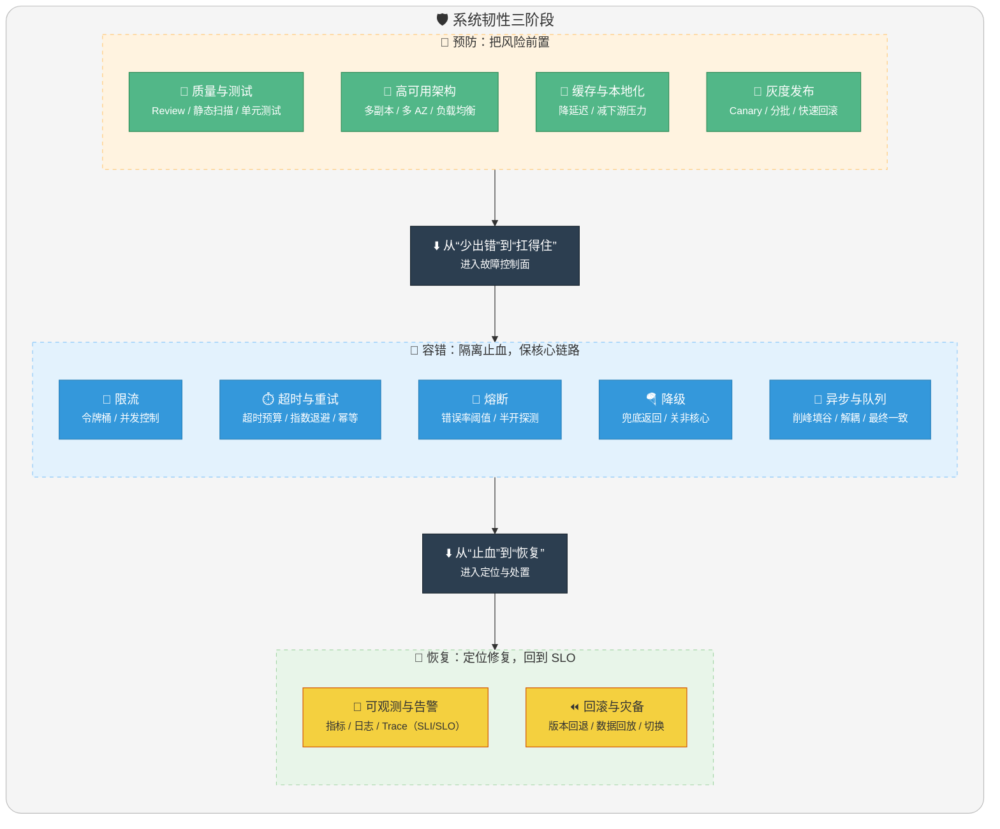

## 什么是高可用？可用性的判断标准是啥？

**高可用（High Availability，简称 HA）** 描述的是一个系统在大部分时间都是可用的，可以为我们提供服务的。高可用代表系统即使在发生硬件故障或者系统升级的时候，服务仍然是可用的。

一般情况下，我们使用 **多少个 9** 来评判一个系统的可用性，比如 99.9999% 就是代表该系统在所有的运行时间中只有 0.0001% 的时间是不可用的，这样的系统就是非常非常高可用的了！当然，也会有系统如果可用性不太好的话，可能连 9 都上不了。

| 可用性等级 | 可用性百分比 | 年度停机时间 | 典型场景     |
| ---------- | ------------ | ------------ | ------------ |
| 1 个 9     | 90%          | 36.5 天      | 个人博客     |
| 2 个 9     | 99%          | 3.65 天      | 普通企业系统 |
| 3 个 9     | 99.9%        | 8.76 小时    | 在线服务     |
| 4 个 9     | 99.99%       | 52.6 分钟    | 金融交易系统 |
| 5 个 9     | 99.999%      | 5.26 分钟    | 电信级系统   |

除此之外，系统的可用性还可以用 **某功能的失败次数与总的请求次数之比** 来衡量，比如对网站请求 1000 次，其中有 10 次请求失败，那么可用性就是 99%。

**SLA（Service Level Agreement，服务级别协议）** 是服务提供商与客户之间的正式承诺，通常会明确规定可用性目标。例如，云服务商承诺 99.95% 的 SLA，意味着每月最多允许约 22 分钟的停机时间。

## 哪些情况会导致系统不可用？

导致系统不可用的原因可以从 **内部因素** 和 **外部因素** 两个维度来分析：

**内部因素：**

1. **代码缺陷**：比如内存泄漏、死锁、循环依赖、空指针异常等代码质量问题，是导致线上故障的最常见原因之一。
2. **架构设计缺陷**：单点故障、缺少限流保护、服务间强耦合等架构问题，会在流量高峰时暴露出来。
3. **资源耗尽**：CPU、内存、磁盘、连接池等资源耗尽会直接导致服务不可用。
4. **配置错误**：错误的配置变更（如数据库连接串、超时时间配置不当）可能导致服务异常。

**外部因素：**

1. **硬件故障**：服务器宕机、磁盘损坏、网络设备故障等。
2. **流量激增**：突发的用户请求量（如秒杀活动）超过系统承载能力。
3. **网络攻击**：DDoS 攻击、CC 攻击等恶意攻击会耗尽系统资源。
4. **依赖服务故障**：数据库、缓存、消息队列、第三方 API 等依赖服务不可用。
5. **自然灾害**：机房停电、火灾、地震等不可抗力因素。

## 有哪些提高系统可用性的方法？

提高系统可用性的方法可以从 **预防**、**容错**、**恢复** 三个阶段来考虑：

### 注重代码质量，测试严格把关

**代码质量是系统可用性的根基**。代码质量有问题比如比较常见的内存泄漏、循环依赖都是对系统可用性极大的损害。大家都喜欢谈限流、降级、熔断，但是从代码质量这个源头把关是首先要做好的一件很重要的事情。

如何提高代码质量？比较实际可用的就是 **Code Review**，不要在乎每天多花的那 1 个小时左右的时间，作用可大着呢！

另外，安利几个对提高代码质量有实际效果的工具：

- [Sonarqube](https://www.sonarqube.org/)：静态代码分析平台，可检测代码坏味道、安全漏洞和 Bug。
- Alibaba 开源的 Java 诊断工具 [Arthas](https://arthas.aliyun.com/doc/)：可在线排查 JVM 问题，支持热更新代码。
- [阿里巴巴 Java 代码规范](https://github.com/alibaba/p3c)（Alibaba Java Code Guidelines）：配套 IDEA 插件，实时检查代码规范。
- IDEA 自带的代码分析等工具。

### 使用集群，减少单点故障

**单点故障（Single Point of Failure，SPOF）** 是高可用的大敌。先拿常用的 Redis 举个例子！我们如何保证我们的 Redis 缓存高可用呢？答案就是使用集群，避免单点故障。

当我们使用一个 Redis 实例作为缓存的时候，这个 Redis 实例挂了之后，整个缓存服务可能就挂了。使用了集群之后，即使一台 Redis 实例挂了，不到一秒就会有另外一台 Redis 实例顶上。

常见的集群模式：

- **主从复制（Master-Slave）**：一主多从，主节点负责写，从节点负责读，主节点故障时需要手动或借助哨兵进行故障转移。
- **哨兵模式（Sentinel）**：在主从复制基础上增加哨兵节点，实现自动故障检测和转移。
- **分布式集群（Cluster）**：数据分片存储在多个节点，每个分片有主从副本，兼顾高可用和水平扩展。

### 限流

**限流（Rate Limiting）** 是保护系统的第一道防线。其原理是监控应用流量的 QPS 或并发线程数等指标，当达到指定的阈值时对流量进行控制，以避免被瞬时的流量高峰冲垮，从而保障应用的高可用性。——来自 [alibaba-Sentinel](https://github.com/alibaba/Sentinel "Sentinel") 的 wiki。

常见的限流算法包括：

- **固定窗口计数器**：实现简单，但存在临界点突刺问题。
- **滑动窗口计数器**：解决了固定窗口的临界问题，更加平滑。
- **漏桶算法**：以固定速率处理请求，适合流量整形。
- **令牌桶算法**：允许一定程度的突发流量，更加灵活。

### 超时和重试机制设置

一旦用户请求超过某个时间的得不到响应，就抛出异常。这个是非常重要的，很多线上系统故障都是因为 **没有进行超时设置或者超时设置的方式不对** 导致的。

我们在读取第三方服务的时候，尤其适合设置超时和重试机制。一般我们使用一些 RPC 框架的时候，这些框架都自带的超时重试的配置。如果不进行超时设置可能会导致请求响应速度慢，甚至导致请求堆积进而让系统无法再处理请求。

**重试的次数一般设为 3 次**，再多次的重试没有好处，反而会加重服务器压力（部分场景使用失败重试机制会不太适合）。同时，重试需要配合 **指数退避** 策略，避免重试风暴。

### 熔断机制

超时和重试机制设置之外，**熔断机制** 也是很重要的。熔断机制说的是系统自动收集所依赖服务的资源使用情况和性能指标，当所依赖的服务恶化或者调用失败次数达到某个阈值的时候就迅速失败，让当前系统立即切换依赖其他备用服务。

熔断器有三种状态：

- **关闭（Closed）**：正常状态，请求正常通过。
- **打开（Open）**：熔断状态，请求直接失败，不调用下游服务。
- **半开（Half-Open）**：尝试恢复状态，放行少量请求探测下游服务是否恢复。

比较常用的流量控制和熔断降级框架是 Netflix 的 Hystrix 和 alibaba 的 Sentinel。

### 降级

**降级（Degradation）** 是在系统压力过大或部分服务不可用时，暂时关闭一些非核心功能，保证核心功能的可用性。

降级策略包括：

- **功能降级**：关闭推荐、评论等非核心功能。
- **数据降级**：返回缓存数据或默认数据，而非实时查询。
- **页面降级**：返回静态页面或简化版页面。

### 异步调用

异步调用的话我们不需要关心最后的结果，这样我们就可以用户请求完成之后就立即返回结果，具体处理我们可以后续再做，秒杀场景用这个还是蛮多的。

但是，使用异步之后我们可能需要 **适当修改业务流程进行配合**，比如 **用户在提交订单之后，不能立即返回用户订单提交成功，需要在消息队列的订单消费者进程真正处理完该订单之后，甚至出库后，再通过电子邮件或短信通知用户订单成功**。

除了可以在程序中实现异步之外，我们常常还使用 **消息队列**，消息队列可以通过异步处理提高系统性能（削峰、减少响应所需时间）并且可以降低系统耦合性。

### 使用缓存

如果我们的系统属于并发量比较高的话，如果我们单纯使用数据库的话，当大量请求直接落到数据库可能数据库就会直接挂掉。使用缓存缓存热点数据，因为缓存存储在内存中，所以速度相当地快！

缓存的典型应用场景：

- **热点数据缓存**：将访问频繁的数据放入 Redis 等缓存中。
- **页面缓存**：将渲染后的页面缓存起来，减少服务器压力。
- **本地缓存**：使用 Caffeine、Guava Cache 等本地缓存，减少网络开销。

### 其他

- **核心应用和服务优先使用更好的硬件**：核心服务使用更高配置的服务器、SSD 硬盘等。
- **监控系统资源使用情况增加报警设置**：使用 Prometheus + Grafana 等监控方案，设置合理的告警阈值。
- **注意备份，必要时候回滚**：数据库定期备份，代码版本可追溯，支持快速回滚。
- **灰度发布**：将服务器集群分成若干部分，每天只发布一部分机器，观察运行稳定没有故障，第二天继续发布一部分机器，持续几天才把整个集群全部发布完毕，期间如果发现问题，只需要回滚已发布的一部分服务器即可。
- **定期检查/更换硬件**：如果不是购买的云服务的话，定期还是需要对硬件进行一波检查的，对于一些需要更换或者升级的硬件，要及时更换或者升级。

<!-- @include: @article-footer.snippet.md -->
