这部分内容摘自 [JavaGuide](https://javaguide.cn/) 下面几篇文章的重点：

高可用设计：

- [高可用系统设计指南](https://javaguide.cn/high-availability/high-availability-system-design.html)
- [冗余设计详解](https://javaguide.cn/high-availability/redundancy.html)
- [性能测试入门](https://javaguide.cn/high-availability/performance-test.html)

限流、降级、熔断：

- [服务限流详解](https://javaguide.cn/high-availability/limit-request.html)
- [降级&熔断详解](https://javaguide.cn/high-availability/fallback-and-circuit-breaker.html)

超时、重试、幂等：

- [超时&重试详解](https://javaguide.cn/high-availability/timeout-and-retry.html)
- [接口幂等方案总结](https://javaguide.cn/high-availability/idempotency.html)

## 高可用基础

### ⭐️什么是高可用？

高可用（High Availability）指系统在面对机器故障、网络抖动、依赖异常、流量突增等情况时，仍然能够尽可能持续提供服务。

它不是追求系统永远不出故障，而是关注 3 件事：

1. **故障尽量少发生**：通过测试、评审、容量规划、灰度发布降低故障概率。
2. **故障发生后影响尽量小**：通过隔离、限流、降级、熔断控制故障范围。
3. **故障发生后恢复尽量快**：通过监控、告警、预案、自动故障转移缩短恢复时间。

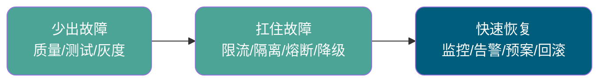

面试里不要把高可用理解成“多部署几台机器”。多副本只能减少单点故障，但真正的高可用还要覆盖流量控制、依赖保护、数据安全、故障发现和恢复闭环。

### 可用性 99.9%、99.99% 分别意味着什么？

可用性通常用一段时间内系统可正常服务的比例衡量。

粗略换算：

| 可用性  | 年不可用时间量级 |
| ------- | ---------------- |
| 99%     | 约 3.65 天       |
| 99.9%   | 约 8.76 小时     |
| 99.99%  | 约 52.56 分钟    |
| 99.999% | 约 5.26 分钟     |

可用性小数点后每多一个 9，背后都意味着更高的架构复杂度、运维成本和故障治理能力。

### 哪些情况会导致系统不可用？

常见原因包括：

- 代码 Bug。
- 服务器宕机。
- 网络故障。
- 数据库、缓存、MQ 等中间件故障。
- 外部依赖接口异常。
- 流量突增导致资源耗尽。
- 慢 SQL、大事务、线程池打满。
- 发布变更引入问题。

高可用设计的关键，是假设这些问题一定会发生，然后提前设计隔离和恢复机制。

### ⭐️提高系统可用性的常见方法有哪些？

常见方法包括：

- 提高代码质量，严格测试和 Code Review。
- 使用集群，减少单点故障。
- 做好限流，避免瞬时流量打垮系统。
- 设置合理超时和重试，避免请求无限堆积。
- 使用熔断机制，防止下游故障拖垮上游。
- 做好服务降级，优先保证核心链路。
- 使用异步调用和消息队列削峰。
- 使用缓存降低核心依赖压力。
- 建立监控、告警、压测和故障演练体系。

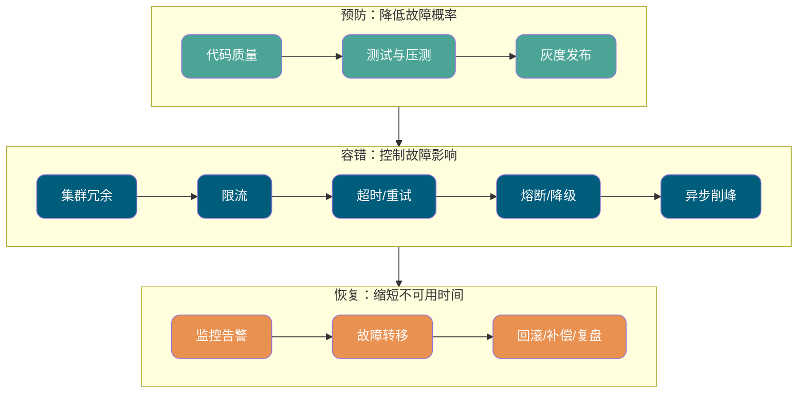

一个比较完整的回答方式是：先按 **预防、容错、恢复** 三层讲方法，再结合系统实际说明哪些链路是核心链路，哪些功能可以牺牲。

## 冗余与容灾

### 什么是冗余？

冗余就是为系统关键组件准备备用能力。当某个节点、机房或链路出现故障时，系统可以切换到备用资源继续服务。

常见冗余对象包括：

- 服务实例冗余。
- 数据库主从或多副本冗余。
- 缓存集群冗余。
- MQ 多副本冗余。
- 机房和地域冗余。

冗余不是简单“多部署几台机器”，还要考虑流量切换、数据一致性、故障检测、恢复验证和成本。

### ⭐️RTO 和 RPO 分别是什么？

RTO 和 RPO 是容灾设计里非常重要的两个指标：

- **RTO（Recovery Time Objective）**：恢复时间目标。系统故障后，最多可以多久恢复服务。
- **RPO（Recovery Point Objective）**：恢复点目标。系统故障后，最多允许丢失多少数据。

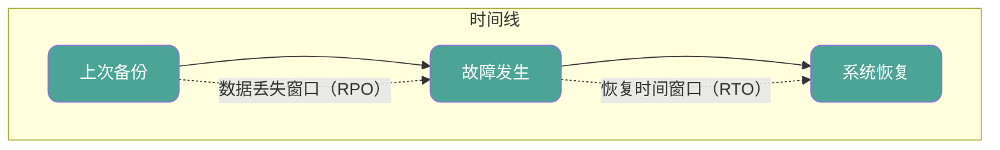

举例来说：

- RTO = 5 分钟：故障后 5 分钟内要恢复。
- RPO = 0：不能丢数据。
- RPO = 5 分钟：最多允许丢失最近 5 分钟数据。

RTO 和 RPO 要求越高，架构成本越高。不是所有系统都需要异地多活，核心交易链路和普通后台报表的要求通常完全不同。

### 常见冗余架构有哪些？

常见方案包括：

| 方案       | 特点                     | 适用场景                       |
| ---------- | ------------------------ | ------------------------------ |
| 高可用集群 | 多实例部署，故障自动转移 | 大多数在线服务                 |
| 同城灾备   | 同城不同机房之间做备份   | 对延迟敏感，又需要机房容灾     |
| 异地灾备   | 异地准备备份系统         | 容忍一定恢复时间的灾备场景     |
| 同城多活   | 同城多机房同时承接流量   | 可用性要求较高的核心系统       |
| 异地多活   | 多地域同时承接流量       | 金融、支付、大型互联网核心链路 |

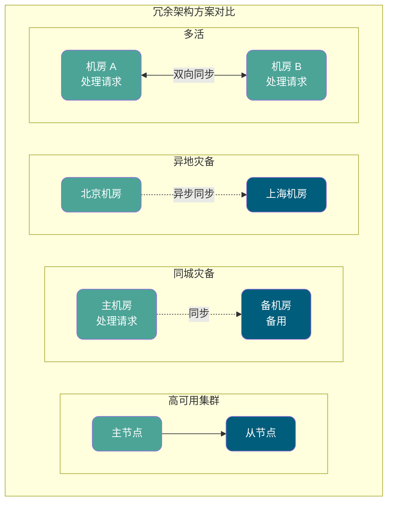

越靠后的方案越复杂，尤其是异地多活，需要解决数据一致性、流量调度、跨地域延迟、故障切换和回切等问题。

### 什么是故障转移？

故障转移是指主节点或主链路不可用时，系统自动或手动切换到备用节点继续服务。

常见例子：

- Redis Sentinel 检测主节点不可用后，选举新的主节点。
- Nginx + Keepalived 通过 VIP 漂移实现入口高可用。
- 数据库主从切换，让从库提升为主库。

故障转移要特别关注误判和脑裂问题。检测太敏感可能误切，检测太迟又会延长故障时间。

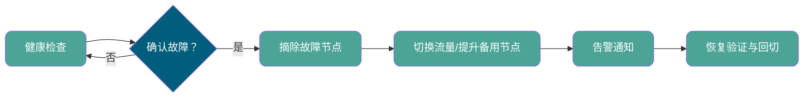

## 限流

### ⭐️为什么要做限流？

限流是为了控制进入系统的请求速率，防止瞬时流量超过系统处理能力。

它解决的问题是：**系统资源有限，不能让所有请求无条件进入核心链路**。

常见场景：

- 秒杀、大促、热点活动。
- 接口被刷。
- 下游服务能力有限。
- 保护数据库、缓存、第三方接口。

限流会牺牲部分请求体验，但换来的是系统整体稳定。

### 常见限流算法有哪些？

常见算法包括：

| 算法     | 特点                     | 问题或适用场景         |
| -------- | ------------------------ | ---------------------- |
| 固定窗口 | 实现简单                 | 临界点可能出现流量突刺 |
| 滑动窗口 | 比固定窗口更平滑         | 实现复杂度更高         |
| 漏桶     | 按固定速率处理请求       | 不适合突发流量         |
| 令牌桶   | 平均限速，也允许短暂突发 | 实际业务中更常用       |

令牌桶比漏桶更灵活，因为它允许桶里积累一定令牌，短时间内可以处理突发请求。

如果面试官追问“网关限流、接口限流、用户维度限流怎么选”，可以这样答：网关适合统一入口保护，接口维度适合保护高成本接口，用户/IP/租户维度适合防刷和防单个调用方拖垮系统。

### ⭐️固定窗口算法有什么问题？

固定窗口的问题是 **临界突刺**。

比如限制每分钟 100 次请求，如果用户在第 1 分钟最后 1 秒发了 100 次，又在第 2 分钟第 1 秒发了 100 次，从窗口统计看都没超限，但实际上 2 秒内进入了 200 次请求。

这就是固定窗口不够平滑的地方。滑动窗口通过把时间切成更小粒度，可以缓解这个问题。

### 单机限流和分布式限流有什么区别？

单机限流只统计当前实例上的请求，适合单体应用或每个节点独立保护自己的场景。

分布式限流需要多个实例共享限流状态，常见实现方式包括 Redis、网关限流、Sentinel 集群限流等。

区别在于：

- 单机限流简单，但无法控制全局总 QPS。
- 分布式限流能控制全局流量，但会引入网络开销和一致性问题。

Redis + Lua 是分布式限流里很常见的实现方式，原因是 Lua 脚本可以把“读取计数、判断阈值、更新计数”放到一次原子执行里，避免并发下计数不准。

## 降级与熔断

### ⭐️什么是服务降级？

服务降级是当系统负载过高或部分依赖异常时，主动降低非核心功能的服务质量，优先保证核心链路可用。

典型例子：

- 大促时关闭商品推荐，保留下单和支付。
- 评论、排行榜、广告位返回默认值。
- 非核心写操作先写入 MQ，后续异步处理。

降级的核心思想是：**保核心，弃非核心**。

### 常见降级方式有哪些？

常见方式包括：

- 页面片段降级：关闭推荐区、广告位等非核心模块。
- 读降级：只读缓存，后端不可用时返回默认值。
- 写降级：先写缓存或 MQ，后续补偿同步。
- 异步降级：非实时操作改为异步处理。
- 页面跳转降级：跳转到静态页或简版页。

降级预案需要提前设计，不应该等故障发生时临时拍脑袋。

### ⭐️什么是熔断？它解决什么问题？

熔断是当下游服务异常或响应过慢时，调用方暂时停止调用下游，直接返回失败或兜底结果，防止故障沿调用链扩散。

它解决的是 **雪崩效应**。

比如服务 A 调用服务 B，服务 B 调用服务 C。服务 C 变慢后，B 的线程被拖住，A 的请求也开始堆积，最终整个链路都被拖垮。熔断就是在发现 C 明显异常后，主动切断对 C 的调用，保护 A 和 B。

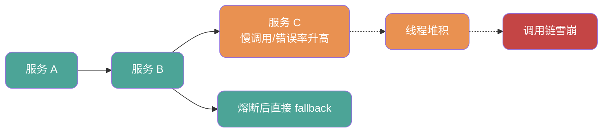

### 熔断器有哪些状态？

常见状态有 3 个：

- **Closed**：正常状态，请求正常通过。
- **Open**：熔断打开，请求不再调用下游，直接走 fallback。
- **HalfOpen**：半开状态，放少量探测请求检查下游是否恢复。

如果 HalfOpen 探测成功，熔断器回到 Closed；如果失败，继续 Open。

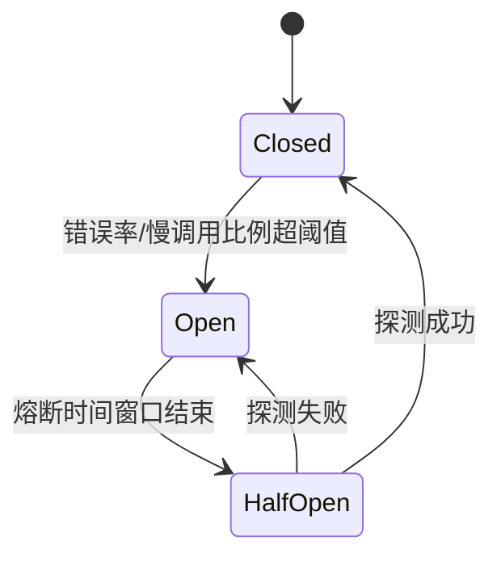

Closed 不是“永远安全”，它只是正常放行；Open 不是“下游一定挂了”，它代表调用方基于阈值判断继续调用风险太高；HalfOpen 是恢复探测窗口，不能一下子把全量流量放回去。

### ⭐️降级和熔断有什么区别？

区别如下：

| 维度     | 降级                       | 熔断                         |
| -------- | -------------------------- | ---------------------------- |
| 关注点   | 主动牺牲非核心功能         | 阻断异常依赖                 |
| 触发方式 | 可以人工触发，也可自动触发 | 通常由失败率、慢调用比例触发 |
| 目标     | 保核心链路                 | 防止故障扩散                 |
| 恢复方式 | 手动恢复或自动恢复         | 通过 HalfOpen 探测恢复       |

一句话区分：**降级是主动降低服务质量，熔断是被下游故障逼出来的链路保护**。

### Hystrix、Sentinel、Resilience4j 怎么选？

简单建议：

- 新项目使用 Spring Cloud Alibaba，优先考虑 Sentinel。
- 响应式或轻量级项目，可以考虑 Resilience4j。
- 老项目已经使用 Hystrix，可以继续维护，但要规划迁移，因为 Hystrix 已经停止维护。

Sentinel 的优势是限流、熔断、降级、系统自适应保护能力比较完整，并且有控制台支持。

选型时还要看项目栈：Spring Cloud Alibaba 体系下 Sentinel 接入成本低；轻量服务或响应式链路可以考虑 Resilience4j；已经历史使用 Hystrix 的系统通常不建议继续大规模扩展新能力。

## 超时、重试与幂等

### ⭐️为什么所有远程调用都要设置超时？

远程调用可能因为网络抖动、下游慢、连接池耗尽、服务故障等原因一直不返回。如果不设置超时，请求线程会长期阻塞，最终导致连接数、线程数、队列全部被打满。

超时机制的作用是让失败尽快暴露，避免慢请求无限堆积。

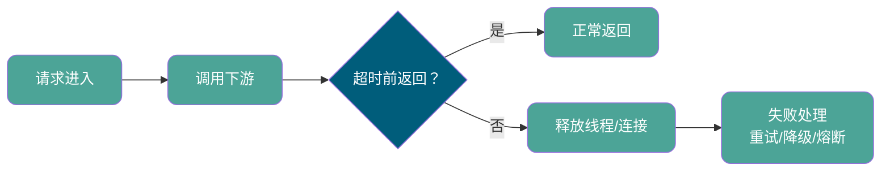

常见超时类型：

- **连接超时**：建立连接的最长等待时间。
- **读取超时**：连接建立后等待响应的最长时间。
- **获取连接超时**：从连接池拿连接的最长等待时间。

### 超时时间应该如何设置？

超时时间太短，正常慢请求也会被误杀；太长，又无法及时释放资源。

一般建议：

- 根据接口 P95、P99 延迟设置。
- 结合业务可接受等待时间。
- 区分核心链路和非核心链路。
- 放到配置中心，支持动态调整。

不要所有接口都用同一个超时时间。查缓存、查数据库、调用第三方支付接口，它们的延迟特征不一样。

### ⭐️为什么重试可能导致故障放大？

重试的本意是解决瞬态故障，但如果下游已经过载，大量上游同时重试，会让下游压力更大，形成 **重试风暴**。

重试风险包括：

- 放大下游流量。
- 增加请求延迟。
- 导致重复操作。
- 触发雪崩效应。

所以，重试必须配合超时、限流、熔断、幂等和退避策略一起使用。

### 常见重试策略有哪些？

常见策略：

- 固定间隔重试。
- 线性退避重试。
- 指数退避重试。
- 指数退避 + 随机抖动。

分布式系统里更推荐 **指数退避 + 随机抖动**。指数退避能逐步降低重试频率，随机抖动能避免大量客户端在同一时间点一起重试。

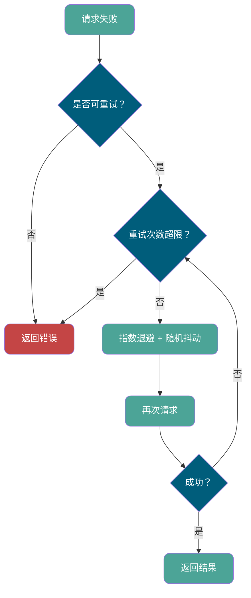

### ⭐️哪些请求可以重试？哪些不适合重试？

适合重试：

- 网络瞬断。
- 连接超时。
- 临时 5xx。
- 限流后明确提示稍后重试。

不适合直接重试：

- 参数错误。
- 权限错误。
- 余额不足。
- 非幂等写操作。
- 下游已经明确处理失败且不可恢复。

写操作如果要重试，必须先做好幂等。

### 什么是幂等？

幂等指同一个操作执行一次和执行多次，最终结果一致。

比如查询接口天然接近幂等，但创建订单、扣款、发券、发消息这类操作如果重复执行，就可能产生严重问题。

常见幂等方案：

- 请求唯一 ID。
- 数据库唯一索引。
- Redis 去重。
- 乐观锁版本号。
- 状态机流转控制。
- 业务防重表。

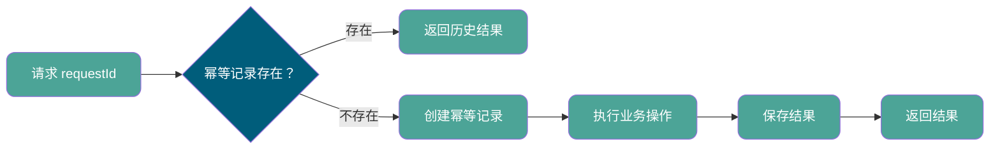

幂等的难点不在“识别重复请求”这句话，而在并发下第一次请求和重复请求同时到达时，如何保证只有一个请求真正执行副作用操作。

### ⭐️支付接口如何保证幂等？

可以这样设计：

1. 客户端或服务端生成唯一支付请求号。
2. 服务端用请求号建立唯一索引或幂等记录。
3. 第一次请求执行支付流程。
4. 重复请求直接返回第一次处理结果。
5. 支付状态通过状态机控制，只允许合法状态流转。

核心原则是：**扣款、入账、发券这类副作用操作，必须能识别重复请求**。

状态机也很重要。比如支付单只能从 `INIT` 流转到 `PAYING`，再流转到 `SUCCESS` 或 `FAILED`，不能让重复通知把已经成功的支付单再次扣款，也不能让失败状态覆盖成功状态。

## 性能测试与故障治理

### 性能测试常见指标有哪些？

常见指标包括：

- **响应时间 RT**：请求从发出到收到响应的时间。
- **QPS**：每秒查询数。
- **TPS**：每秒事务数。
- **并发数**：同一时间正在处理的请求数量。
- **吞吐量**：单位时间内系统处理的数据量。
- **错误率**：失败请求占比。
- **资源使用率**：CPU、内存、磁盘、网络、连接池、线程池等。

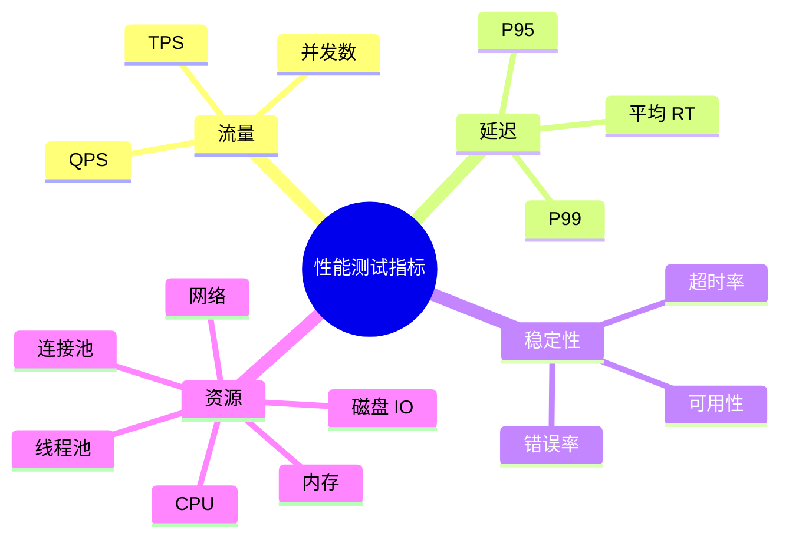

面试里不要只说平均 RT，P95、P99 更能反映长尾延迟。

### ⭐️性能测试、负载测试、压力测试、稳定性测试有什么区别？

区别如下：

| 类型       | 目标                           |
| ---------- | ------------------------------ |
| 性能测试   | 评估系统在预期负载下的性能表现 |
| 负载测试   | 逐步增加负载，观察性能变化     |
| 压力测试   | 找到系统极限和崩溃点           |
| 稳定性测试 | 长时间运行，观察是否有资源泄漏 |

如果面试官问“怎么证明系统能扛住大促”，只回答压测工具不够，还要说明压测模型、流量比例、数据准备、监控指标和瓶颈定位方法。

### 如何做容量评估？

容量评估一般需要：

1. 估算峰值 QPS、TPS、并发数。
2. 梳理核心接口和流量比例。
3. 准备接近真实的数据量。
4. 通过压测得到单机能力和集群能力。
5. 预留安全水位，比如只使用 60% 到 70% 的容量。
6. 对数据库、缓存、MQ、第三方接口分别评估瓶颈。

容量评估不是只看应用服务器，很多系统真正的瓶颈在数据库、缓存热点、连接池或下游接口。

### ⭐️如何设计一个高可用系统？

可以按这条主线回答：

1. **识别核心链路**：明确哪些功能必须可用，哪些功能可以降级。
2. **消除单点故障**：服务、数据库、缓存、MQ、入口网关都要考虑冗余。
3. **控制入口流量**：限流、排队、削峰，避免流量打穿系统。
4. **保护下游依赖**：超时、重试、熔断、隔离，避免故障扩散。
5. **保证写操作安全**：幂等、防重、状态机，避免重复执行。
6. **准备降级预案**：非核心功能可关闭，核心链路优先保障。
7. **建立观测体系**：监控、日志、Trace、告警、压测和故障演练。

高可用设计的核心不是承诺系统不会挂，而是让故障发生时影响可控、恢复可控、数据风险可控。

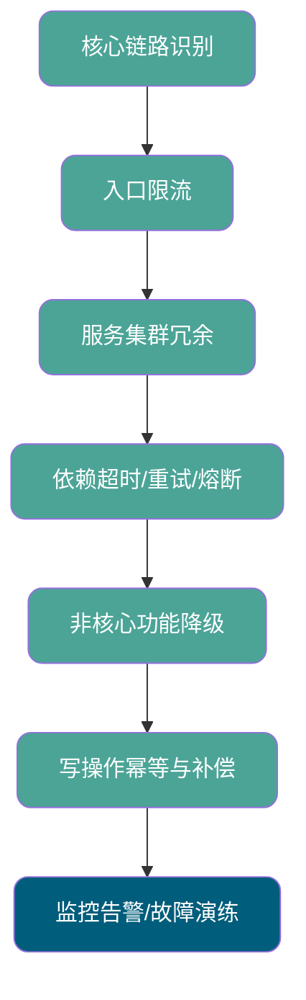
