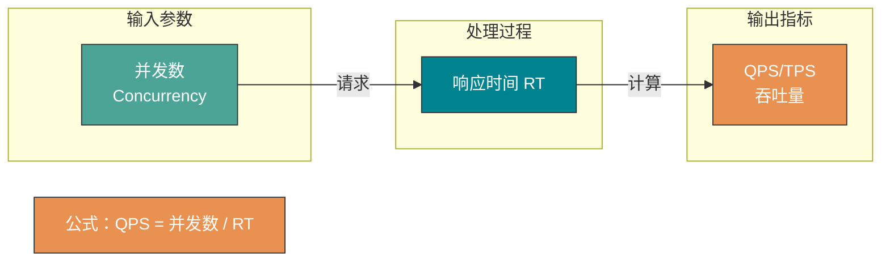

性能测试一般情况下都是由测试这个职位去做的，那还需要我们开发学这个干嘛呢？了解性能测试的指标、分类以及工具等知识有助于我们更好地去写出性能更好的程序，另外作为开发这个角色，如果你会性能测试的话，相信也会为你的履历加分不少。

这篇文章是我会结合自己的实际经历以及在测试这里取的经所得，除此之外，我还借鉴了一些优秀书籍，希望对你有帮助。

## 不同角色看网站性能

### 用户

当用户打开一个网站的时候，最关注的是什么？当然是 **网站响应速度的快慢**。比如我们点击了淘宝的主页，淘宝需要多久将首页的内容呈现在我的面前，我点击了提交订单按钮需要多久返回结果等等。

所以，用户在体验我们系统的时候往往根据你的响应速度的快慢来评判你的网站的性能。

### 开发人员

用户与开发人员都关注速度，这个速度实际上就是我们的系统 **处理用户请求的速度**。

开发人员一般情况下很难直观的去评判自己网站的性能，我们往往会根据网站当前的架构以及基础设施情况给一个大概的值，比如：

1. 项目架构是分布式的吗？
2. 用到了缓存和消息队列没有？
3. 高并发的业务有没有特殊处理？
4. 数据库设计是否合理？
5. 系统用到的算法是否还需要优化？
6. 系统是否存在内存泄漏的问题？
7. 项目使用的 Redis 缓存多大？服务器性能如何？用的是机械硬盘还是固态硬盘？
8. ……

### 测试人员

测试人员一般会根据性能测试工具来测试，然后一般会做出一个表格。这个表格可能会涵盖下面这些重要的内容：

1. 响应时间；
2. 请求成功率；
3. 吞吐量；
4. ……

### 运维人员

运维人员会倾向于根据 **基础设施和资源的利用率** 来判断网站的性能，比如我们的服务器资源使用是否合理、数据库资源是否存在滥用的情况、当然，这是传统的运维人员，现在 Devops 火起来后，单纯干运维的很少了。我们这里暂且还保留有这个角色。

## 性能测试需要注意的点

几乎没有文章在讲性能测试的时候提到这个问题，大家都会讲如何去性能测试，有哪些性能测试指标这些东西。

### 了解系统的业务场景

**性能测试之前更需要你了解当前的系统的业务场景。** 对系统业务了解的不够深刻，我们很容易犯测试方向偏执的错误，从而导致我们忽略了对系统某些更需要性能测试的地方进行测试。

比如我们的系统可以为用户提供发送邮件的功能，用户配置成功邮箱后只需输入相应的邮箱之后就能发送，系统每天大概能处理上万次发邮件的请求。很多人看到这个可能就直接开始使用相关工具测试邮箱发送接口，但是，发送邮件这个场景可能不是当前系统的性能瓶颈，这么多人用我们的系统发邮件，还可能有很多人一起发邮件，单单这个场景就这么人用，那用户管理可能才是性能瓶颈吧！

### 历史数据非常有用

当前系统所留下的历史数据非常重要，一般情况下，我们可以通过相应的些历史数据初步判定这个系统哪些接口调用的比较多、哪些服务承受的压力最大，这样的话，我们就可以针对这些地方进行更细致的性能测试与分析。

另外，这些地方也就像这个系统的一个短板一样，优化好了这些地方会为我们的系统带来质的提升。

## 常见性能指标

性能指标是衡量系统性能的核心度量标准，理解各指标之间的关系对于性能分析至关重要。

### 响应时间

**响应时间 RT（Response Time）就是用户发出请求到用户收到系统处理结果所需要的时间。**

RT 是一个非常重要且直观的指标，RT 数值大小直接反应了系统处理用户请求速度的快慢。

响应时间通常包括以下几个部分：

- **网络传输时间**：请求和响应在网络中传输的时间。
- **服务端处理时间**：服务器接收请求到返回响应的时间。
- **客户端渲染时间**：浏览器解析和渲染页面的时间（前端性能）。

一般来说，响应时间的参考标准如下：

| RT 范围    | 用户体验               |
| ---------- | ---------------------- |
| < 200ms    | 优秀，用户几乎无感知   |
| 200ms ~ 1s | 良好，用户可接受       |
| 1s ~ 3s    | 一般，用户会感觉到等待 |
| > 3s       | 较差，用户可能会放弃   |

### 并发数

**并发数可以简单理解为系统能够同时供多少人访问使用，也就是说系统同时能处理的请求数量。**

并发数反应了系统的 **负载能力**。需要注意区分以下概念：

- **并发用户数**：同时在线的用户数量。
- **并发请求数**：同一时刻系统正在处理的请求数量。
- **最大并发数**：系统能够承受的最大并发请求数，超过此值系统可能出现性能下降或崩溃。

### QPS 和 TPS

- **QPS（Query Per Second）**：服务器每秒可以执行的查询次数；
- **TPS（Transaction Per Second）**：服务器每秒处理的事务数（这里的一个事务可以理解为客户发出请求到收到服务器的过程）；

书中是这样描述 QPS 和 TPS 的区别的：

> QPS vs TPS：QPS 基本类似于 TPS，但是不同的是，对于一个页面的一次访问，形成一个 TPS；但一次页面请求，可能产生多次对服务器的请求，服务器对这些请求，就可计入"QPS"之中。如，访问一个页面会请求服务器 2 次，一次访问，产生一个"T"，产生 2 个"Q"。

简单来说：**TPS 偏向业务视角（用户完成一次完整操作），QPS 偏向技术视角（服务器处理的请求数）**。

### 吞吐量

**吞吐量指的是系统单位时间内处理的请求数量。**

一个系统的吞吐量与请求对系统的资源消耗等紧密关联。请求对系统资源消耗越多，系统吞吐能力越低，反之则越高。

TPS、QPS 都是吞吐量的常用量化指标。核心公式如下：

- **QPS（TPS）= 并发数 / 平均响应时间（RT）**
- **并发数 = QPS × 平均响应时间（RT）**

> 举例：如果平均响应时间 RT = 0.1s，并发数 = 100，则 QPS = 100 / 0.1 = 1000。

## 系统活跃度指标

### PV（Page View）

**访问量**，即页面浏览量或点击量，衡量网站用户访问的网页数量；在一定统计周期内用户每打开或刷新一个页面就记录 1 次，多次打开或刷新同一页面则浏览量累计。PV 从网页打开的数量/刷新的次数的角度来统计的。

### UV（Unique Visitor）

**独立访客**，统计 1 天内访问某站点的用户数。1 天内相同访客多次访问网站，只计算为 1 个独立访客。UV 是从用户个体的角度来统计的。

### DAU（Daily Active User）

**日活跃用户数量**，指一天内登录或使用产品的用户数（去重）。

### MAU（Monthly Active Users）

**月活跃用户人数**，指一个月内登录或使用产品的用户数（去重）。

### 实战计算示例

> **举例**：某网站 DAU 为 1200w，用户日均使用时长 1 小时，RT 为 0.5s，求并发量和 QPS。

**平均并发量** = DAU（1200w）× 日均使用时长（1 小时，3600 秒）/ 一天的秒数（86400）= 1200w / 24 = **50w**

**真实并发量**（考虑到某些时间段使用人数比较少）= DAU（1200w）× 日均使用时长（1 小时，3600 秒）/ 一天的秒数 - 访问量比较小的时间段假设为 8 小时（57600）= 1200w / 16 = **75w**

**峰值并发量** = 平均并发量 × 6 = **300w**

**QPS** = 真实并发量 / RT = 75W / 0.5 = **150w/s**

## 性能测试分类

| 测试类型       | 目的                       | 测试方法             |
| -------------- | -------------------------- | -------------------- |
| **性能测试**   | 验证系统性能是否满足预期   | 在已知性能指标下验证 |
| **负载测试**   | 找到系统的性能上限         | 逐步加压直到资源饱和 |
| **压力测试**   | 测试系统的极限和崩溃点     | 持续加压直到系统崩溃 |
| **稳定性测试** | 验证系统长时间运行的稳定性 | 模拟真实场景持续运行 |

### 性能测试

性能测试方法是通过测试工具模拟用户请求系统，目的主要是为了测试系统的性能是否满足要求。通俗地说，这种方法就是要在特定的运行条件下验证系统的能力状态。

性能测试是你在 **对系统性能已经有了解的前提之后** 进行的，并且有明确的性能指标。

### 负载测试

对被测试的系统继续加大请求压力，直到服务器的某个资源已经达到饱和了，比如系统的缓存已经不够用了或者系统的响应时间已经不满足要求了。

**负载测试说白点就是测试系统的上限。**

### 压力测试

不去管系统资源的使用情况，对系统继续加大请求压力，**直到服务器崩溃无法再继续提供服务**。

压力测试的目的是找到系统的崩溃点，以及在崩溃后的恢复能力。

### 稳定性测试

模拟真实场景，给系统一定压力，看看业务是否能稳定运行。稳定性测试通常需要运行较长时间（如 7×24 小时），观察系统是否存在 **内存泄漏、连接泄漏** 等问题。

## 常用性能测试工具

### 后端常用

既然系统设计涉及到系统性能方面的问题，那在面试的时候，面试官就很可能会问：**你是如何进行性能测试的？**

推荐 4 个比较常用的性能测试工具：

| 工具           | 开发语言 | 特点                                  | 适用场景                 |
| -------------- | -------- | ------------------------------------- | ------------------------ |
| **JMeter**     | Java     | 功能全面，支持 GUI 和命令行，插件丰富 | 复杂场景测试、企业级应用 |
| **Gatling**    | Scala    | 基于 Akka，代码驱动，报告美观         | 高并发场景、CI/CD 集成   |
| **ab**         | C        | 轻量简单，Apache 自带                 | 快速接口测试、基准测试   |
| **LoadRunner** | -        | 商业软件，功能强大                    | 企业级大规模测试         |

没记错的话，除了 **LoadRunner** 其他几款性能测试工具都是开源免费的。

**选型建议：**

- **快速验证**：使用 `ab` 或 `wrk` 进行简单的接口压测。
- **复杂场景**：使用 `JMeter`，支持录制脚本、参数化、断言等功能。
- **代码驱动**：使用 `Gatling`，适合开发人员，易于版本控制和 CI 集成。

### 前端常用

1. **Fiddler**：抓包工具，它可以修改请求的数据，甚至可以修改服务器返回的数据，功能非常强大，是 Web 调试的利器。
2. **HttpWatch**：可用于录制 HTTP 请求信息的工具。

## 常见的性能优化策略

性能优化之前我们需要对请求经历的各个环节进行分析，排查出可能出现性能瓶颈的地方，定位问题。

下面是一些性能优化时，我经常拿来自问的一些问题：

| 优化方向   | 检查项                                                   |
| ---------- | -------------------------------------------------------- |
| **缓存**   | 系统是否需要缓存？热点数据是否已缓存？                   |
| **架构**   | 系统架构本身是不是就有问题？是否需要读写分离、分库分表？ |
| **并发**   | 系统是否存在死锁的地方？锁的粒度是否合理？               |
| **内存**   | 系统是否存在内存泄漏？GC 是否频繁？                      |
| **数据库** | 数据库索引使用是否合理？是否存在慢 SQL？                 |
| **算法**   | 核心算法的时间复杂度是否可以优化？                       |
| **IO**     | 是否存在不必要的网络调用？是否可以批量操作？             |

<!-- @include: @article-footer.snippet.md -->
