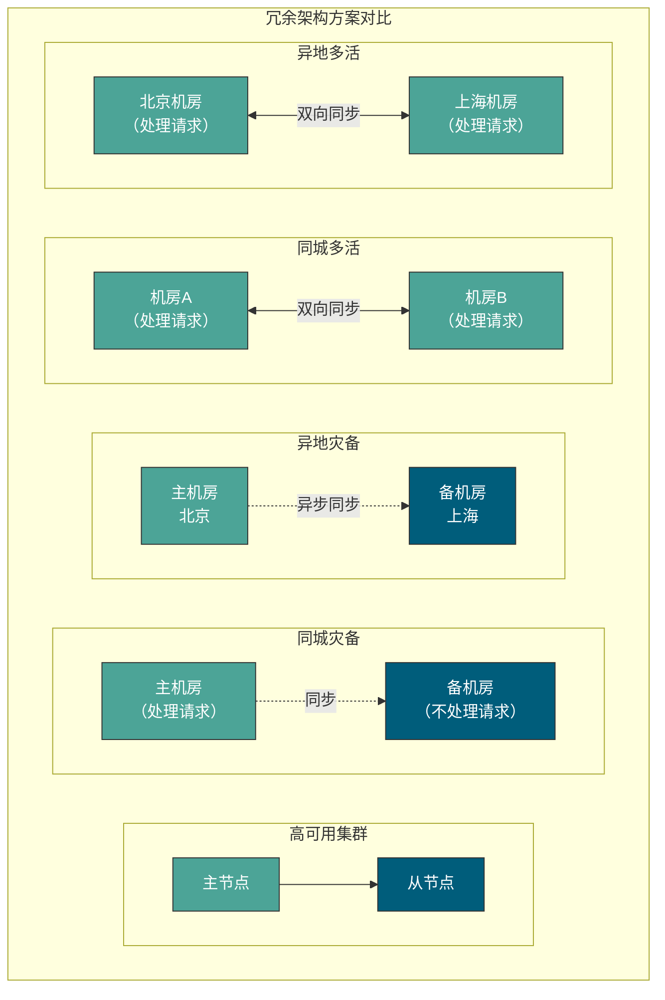

## 什么是冗余？

**冗余（Redundancy）** 是保证系统和数据高可用的最常用手段，其核心思想是 **通过部署多份相同的资源，当某一份资源出现故障时，其他资源可以接管其工作，从而保证系统的持续可用**。

冗余设计可以从以下几个维度来理解：

| 冗余类型     | 说明                   | 典型实现                         |
| ------------ | ---------------------- | -------------------------------- |
| **硬件冗余** | 关键硬件设备部署多份   | 双电源、双网卡、RAID 磁盘阵列    |
| **软件冗余** | 应用服务部署多个实例   | 集群部署、容器化多副本           |
| **数据冗余** | 数据存储多份副本       | 数据库主从复制、分布式存储多副本 |
| **网络冗余** | 网络链路和设备冗余     | 多运营商接入、双活负载均衡       |
| **地域冗余** | 在不同地理位置部署系统 | 同城灾备、异地多活               |

对于 **服务** 来说，冗余的思想就是相同的服务部署多份，如果正在使用的服务突然挂掉的话，系统可以很快切换到备份服务上，大大减少系统的不可用时间，提高系统的可用性。

对于 **数据** 来说，冗余的思想就是相同的数据备份多份，这样就可以很简单地提高数据的安全性。

实际上，日常生活中就有非常多的冗余思想的应用。拿我自己来说，我对于重要文件的保存方法就是冗余思想的应用。我日常所使用的重要文件都会同步一份在 GitHub 以及个人云盘上，这样就可以保证即使电脑硬盘损坏，我也可以通过 GitHub 或者个人云盘找回自己的重要文件。

## 容灾核心指标：RTO 和 RPO

在讨论容灾架构之前，需要先理解两个核心指标：

- **RPO（Recovery Point Objective，恢复点目标）**：可容忍的 **最大数据丢失量**，即从上次备份到故障发生之间的数据。RPO = 0 表示不允许丢失任何数据。
- **RTO（Recovery Time Objective，恢复时间目标）**：可容忍的 **最大恢复时间**，即从故障发生到系统恢复正常服务的时间。RTO = 0 表示服务不能中断。

| 架构方案   | RPO            | RTO         | 成本 |
| ---------- | -------------- | ----------- | ---- |
| 单机无备份 | 可能全部丢失   | 不可预估    | 低   |
| 本地备份   | 取决于备份周期 | 小时级      | 低   |
| 同城灾备   | 分钟级         | 分钟~小时级 | 中   |
| 异地灾备   | 分钟~小时级    | 小时级      | 中高 |
| 同城多活   | 秒级           | 秒级        | 高   |
| 异地多活   | 秒级           | 秒级        | 很高 |

## 冗余架构方案对比

高可用集群（High Availability Cluster，简称 HA Cluster）、同城灾备、异地灾备、同城多活和异地多活是冗余思想在高可用系统设计中最典型的应用。

### 高可用集群

**高可用集群** 是指同一份服务部署两份或者多份，当正在使用的服务突然挂掉的话，可以切换到另外一台服务，从而保证服务的高可用。

高可用集群有两种常见模式：

| 模式                           | 说明                       | 优点                     | 缺点                           |
| ------------------------------ | -------------------------- | ------------------------ | ------------------------------ |
| **主备模式（Active-Standby）** | 主节点提供服务，备节点待命 | 实现简单，数据一致性好   | 资源利用率低，备节点闲置       |
| **主主模式（Active-Active）**  | 多个节点同时提供服务       | 资源利用率高，无单点故障 | 数据同步复杂，可能有一致性问题 |

高可用集群单纯是服务的冗余，**并没有强调地域**。同城灾备、异地灾备、同城多活和异地多活实现了地域上的冗余。

### 同城灾备

**同城灾备** 是指一整个集群可以部署在同一个机房，而同城灾备中相同服务部署在 **同一个城市的不同机房** 中。并且，**备用服务不处理请求**。这样可以避免机房出现意外情况比如停电、火灾。

- **适用场景**：对 RTO 要求较高（分钟级），成本有限的企业。
- **典型配置**：两个机房距离 30~100 公里，通过专线连接。

### 异地灾备

**异地灾备** 类似于同城灾备，不同的是，相同服务部署在 **异地（通常距离较远，甚至是在不同的城市或者国家）的不同机房中**。

- **适用场景**：需要防范区域性灾难（地震、洪水）的核心业务系统。
- **挑战**：网络延迟较大，数据同步通常采用异步方式，可能存在数据丢失。

### 同城多活

**同城多活** 类似于同城灾备，但 **备用服务可以处理请求**，这样可以充分利用系统资源，提高系统的并发。

- **适用场景**：对性能和可用性都有较高要求的系统。
- **技术要点**：需要解决数据同步、流量调度、会话管理等问题。

### 异地多活

**异地多活** 将服务部署在 **异地的不同机房** 中，并且，它们可以 **同时对外提供服务**。

和传统的灾备设计相比，同城多活和异地多活最明显的改变在于 **"多活"**，即所有站点都是同时在对外提供服务的。异地多活是为了应对突发状况比如火灾、地震等自然或者人为灾害。

同城和异地的主要区别在于 **机房之间的距离**。异地通常距离较远，甚至是在不同的城市或者国家。

## 故障转移机制

光做好冗余还不够，必须要配合上 **故障转移（Failover）** 才可以！所谓故障转移，简单来说就是 **实现不可用服务快速且自动地切换到可用服务，整个过程不需要人为干涉**。

故障转移通常包含以下几个步骤：

1. **故障检测**：通过心跳检测、健康检查等机制发现故障节点。
2. **故障确认**：避免误判，通常需要多次检测确认。
3. **故障切换**：将流量切换到备用节点。
4. **故障通知**：发送告警通知运维人员。
5. **故障恢复**：故障节点恢复后重新加入集群。

### Redis 哨兵模式示例

哨兵模式的 Redis 集群中，如果 Sentinel（哨兵）检测到 master 节点出现故障的话，它就会帮助我们实现故障转移，自动将某一台 slave 升级为 master，确保整个 Redis 系统的可用性。整个过程完全自动，不需要人工介入。

### Nginx + Keepalived 示例

Nginx 可以结合 Keepalived 来实现高可用。如果 Nginx 主服务器宕机的话，Keepalived 可以自动进行故障转移，备用 Nginx 主服务器升级为主服务。并且，这个切换对外是透明的，因为使用的 **虚拟 IP（VIP）**，虚拟 IP 不会改变。

## 异地多活的挑战

异地多活架构实施起来非常难，需要考虑的因素非常多：

| 挑战           | 说明                           | 解决思路                 |
| -------------- | ------------------------------ | ------------------------ |
| **数据一致性** | 多个机房数据如何保持一致       | 最终一致性、冲突解决机制 |
| **网络延迟**   | 异地机房之间网络延迟较大       | 就近接入、数据分区       |
| **流量调度**   | 如何将用户请求分配到合适的机房 | DNS 智能解析、GSLB       |
| **会话管理**   | 用户会话如何在多机房之间共享   | 分布式会话、无状态设计   |
| **成本**       | 多机房建设和运维成本高         | 按业务重要性分级部署     |

如果你想要深入学习异地多活相关的知识，推荐以下资料：

- [搞懂异地多活，看这篇就够了 - 水滴与银弹 - 2021](https://mp.weixin.qq.com/s/T6mMDdtTfBuIiEowCpqu6Q)
- [四步构建异地多活](https://mp.weixin.qq.com/s/hMD-IS__4JE5_nQhYPYSTg)
- [《从零开始学架构》— 28 | 业务高可用的保障：异地多活架构](http://gk.link/a/10pKZ)

<!-- @include: @article-footer.snippet.md -->
