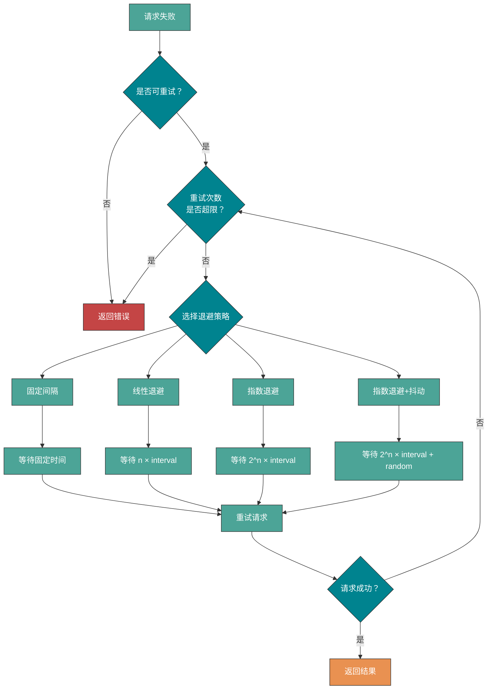

由于网络问题、系统或者服务内部的 Bug、服务器宕机、操作系统崩溃等问题的不确定性，我们的系统或者服务永远不可能保证时刻都是可用的状态。

为了最大限度的减小系统或者服务出现故障之后带来的影响，我们需要用到的 **超时（Timeout）** 和 **重试（Retry）** 机制。

想要把超时和重试机制讲清楚其实很简单，因为它俩本身就不是什么高深的概念。

虽然超时和重试机制的思想很简单，但是它俩是真的非常实用。你平时接触到的绝大部分涉及到远程调用的系统或者服务都会应用超时和重试机制。尤其是对于微服务系统来说，正确设置超时和重试非常重要。单体服务通常只涉及数据库、缓存、第三方 API、中间件等的网络调用，而微服务系统内部各个服务之间还存在着网络调用。

## 超时机制

### 什么是超时机制？

**超时机制** 说的是当一个请求超过指定的时间（比如 1s）还没有被处理的话，这个请求就会直接被取消并抛出指定的异常或者错误（比如 `504 Gateway Timeout`）。

我们平时接触到的超时可以简单分为下面 2 种：

| 超时类型                       | 说明                                                       | 建议值          |
| ------------------------------ | ---------------------------------------------------------- | --------------- |
| **连接超时（ConnectTimeout）** | 客户端与服务端建立连接的最长等待时间                       | 1000ms ~ 5000ms |
| **读取超时（ReadTimeout）**    | 客户端和服务端已建立连接后，等待服务端处理完请求的最长时间 | 1000ms ~ 3000ms |

实际项目中，我们关注比较多的还是 **读取超时**。一些连接池客户端框架中可能还会有 **获取连接超时** 和 **空闲连接清理超时**。

### 为什么需要超时机制？

如果没有设置超时的话，就可能会导致 **服务端连接数爆炸** 和 **大量请求堆积** 的问题。

这些堆积的连接和请求会消耗系统资源，影响新收到的请求的处理。严重的情况下，甚至会拖垮整个系统或者服务。

> 我之前在实际项目就遇到过类似的问题，整个网站无法正常处理请求，服务器负载直接快被拉满。后面发现原因是项目超时设置错误加上客户端请求处理异常，导致服务端连接数直接接近 40w+，这么多堆积的连接直接把系统干趴了。

### 超时时间应该如何设置？

超时到底设置多长时间是一个难题！**超时值设置太高或者太低都有风险**：

| 设置方式     | 风险                                                                                 |
| ------------ | ------------------------------------------------------------------------------------ |
| **设置太高** | 降低超时机制的有效性，系统依然可能出现大量慢请求堆积的问题                           |
| **设置太低** | 在系统处理速度变慢时（如请求突然增多），大量请求超时重试，加重系统压力，可能导致雪崩 |

通常情况下，我们建议：

- **读取超时**：设置为 **1500ms**，这是一个比较普适的值。如果系统对延迟比较敏感，可以适当缩短；反之也可以加长，但尽量不要超过 **3000ms**。
- **连接超时**：可以适当设置长一些，建议在 **1000ms ~ 5000ms** 之内。

**没有银弹！** 超时值具体该设置多大，还是要根据实际项目的需求和情况慢慢调整优化得到。

更上一层，参考 [美团的 Java 线程池参数动态配置](https://tech.meituan.com/2020/04/02/java-pooling-pratice-in-meituan.html) 思想，我们也可以将超时弄成 **可配置化的参数** 而不是固定的，比较简单的一种办法就是将超时的值放在配置中心中。这样的话，我们就可以根据系统或者服务的状态动态调整超时值了。

## 重试机制

### 什么是重试机制？

**重试机制** 一般配合超时机制一起使用，指的是 **多次发送相同的请求来避免瞬态故障和偶然性故障**。

- **瞬态故障**：某一瞬间系统偶然出现的故障，并不会持久。
- **偶然性故障**：在某些情况下偶尔出现的故障，频率通常较低。

重试的核心思想是 **通过消耗服务器的资源来尽可能获得请求更大概率被成功处理**。由于瞬态故障和偶然性故障是很少发生的，因此，重试对于服务器的资源消耗几乎是可以被忽略的。

### 常见的重试策略有哪些？



常见的重试策略对比如下：

| 策略              | 说明                              | 优点                   | 缺点             | 适用场景                       |
| ----------------- | --------------------------------- | ---------------------- | ---------------- | ------------------------------ |
| **固定间隔重试**  | 每次重试间隔相同（如每隔 1s）     | 实现简单               | 可能造成重试风暴 | 目标系统恢复时间稳定可预测     |
| **线性退避重试**  | 间隔线性增长（如 1s、2s、3s）     | 比固定间隔更温和       | 增长速度较慢     | 一般场景                       |
| **指数退避重试**  | 间隔指数增长（如 1s、2s、4s、8s） | 能有效避免重试风暴     | 等待时间可能过长 | 目标系统恢复时间较长或不可预测 |
| **指数退避+抖动** | 指数退避基础上加随机抖动          | 避免多个客户端同时重试 | 实现稍复杂       | 分布式系统推荐                 |

**大部分情况下，我们更建议使用指数退避+抖动策略**，可以有效避免重试风暴。

### 重试的次数如何设置？

重试的次数不宜过多，否则依然会对系统负载造成比较大的压力。

**重试的次数通常建议设为 3 次**。比如说我们要重试 3 次的话：

- 第 1 次请求失败后，等待 1 秒再进行重试
- 第 2 次请求失败后，等待 2 秒再进行重试
- 第 3 次请求失败后，等待 4 秒再进行重试

### 重试的风险有哪些？

重试机制虽然能提高系统的可用性，但使用不当也会带来风险：

| 风险         | 说明                                         | 规避方法                     |
| ------------ | -------------------------------------------- | ---------------------------- |
| **重试风暴** | 大量客户端同时重试，进一步压垮下游服务       | 使用指数退避+抖动策略        |
| **雪崩效应** | 重试导致上游服务也开始超时重试，形成连锁反应 | 设置重试预算、熔断机制       |
| **重复操作** | 非幂等操作被重复执行，导致数据不一致         | 确保操作幂等性               |
| **资源浪费** | 对永久性故障进行无意义的重试                 | 区分可重试错误和不可重试错误 |

**重试预算（Retry Budget）** 是一种有效的规避策略：限制在一定时间窗口内的重试次数占总请求数的比例，如不超过 10%。

### 什么是重试幂等？

超时和重试机制在实际项目中使用的话，需要注意保证 **同一个请求没有被多次执行**。

什么情况下会出现一个请求被多次执行呢？客户端等待服务端完成请求完成超时但此时服务端已经执行了请求，只是由于短暂的网络波动导致响应在发送给客户端的过程中延迟了。

> 举个例子：用户支付购买某个课程，结果用户支付的请求由于重试的问题导致用户购买同一门课程支付了两次。对于这种情况，我们在执行用户购买课程的请求的时候需要判断一下用户是否已经购买过。这样的话，就不会因为重试的问题导致重复购买了。

实现幂等的常见方法：

| 方法               | 说明                                   | 适用场景         |
| ------------------ | -------------------------------------- | ---------------- |
| **唯一请求 ID**    | 每个请求携带唯一 ID，服务端去重        | 通用场景         |
| **数据库唯一约束** | 利用数据库唯一索引防止重复插入         | 创建类操作       |
| **乐观锁**         | 通过版本号控制更新                     | 更新类操作       |
| **状态机**         | 通过状态流转控制，已处理的状态不再处理 | 订单、支付等场景 |

### Java 中如何实现重试？

如果要手动编写代码实现重试逻辑的话，可以通过循环（例如 while 或 for 循环）或者递归实现。不过，一般不建议自己动手实现，有很多第三方开源库提供了更完善的重试机制实现：

| 框架               | 特点                                 | 适用场景             |
| ------------------ | ------------------------------------ | -------------------- |
| **Spring Retry**   | Spring 生态，注解驱动，配置简单      | Spring 项目          |
| **Resilience4j**   | 轻量级，函数式风格，支持熔断、限流等 | 微服务项目           |
| **Guava Retrying** | 灵活的重试策略配置                   | 通用 Java 项目       |
| **Failsafe**       | 支持异步重试、超时、熔断等           | 需要细粒度控制的场景 |

使用 Spring Retry 的简单示例：

```java
@Retryable(
    value = {RemoteAccessException.class},
    maxAttempts = 3,
    backoff = @Backoff(delay = 1000, multiplier = 2)
)
public String callRemoteService() {
    // 调用远程服务
}

@Recover
public String recover(RemoteAccessException e) {
    // 重试失败后的兜底逻辑
    return "fallback";
}
```

## 参考

- 微服务之间调用超时的设置治理：<https://www.infoq.cn/article/eyrslar53l6hjm5yjgyx>
- 超时、重试和抖动回退：<https://aws.amazon.com/cn/builders-library/timeouts-retries-and-backoff-with-jitter/>

<!-- @include: @article-footer.snippet.md -->
