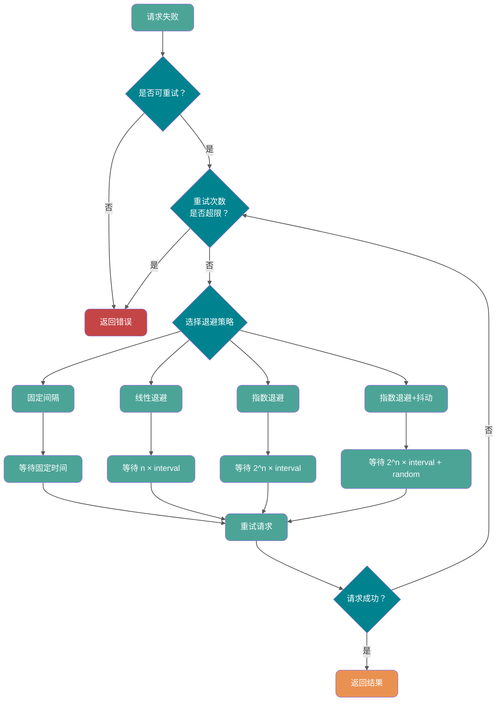

由于网络抖动、硬件故障、进程异常、依赖服务不可用等问题的不确定性，我们的系统或者服务永远不可能保证时刻都是可用的状态。

为了最大限度的减小系统或者服务出现故障之后带来的影响，我们需要用到的 **超时（Timeout）** 和 **重试（Retry）** 机制。

超时和重试的核心思想确实不难理解，但在生产环境中正确使用它们却有不少门道。你平时接触到的绝大部分涉及远程调用的系统或者服务都会应用超时和重试机制。尤其是对于微服务系统来说，正确设置超时和重试非常重要。单体服务通常只涉及数据库、缓存、第三方 API、中间件等的网络调用，而微服务系统内部各个服务之间还存在着网络调用。

## 超时机制

### 什么是超时机制？

**超时机制** 说的是当一个请求超过指定的时间（比如 1s）还没有被处理的话，这个请求就会直接被取消并抛出指定的异常或者错误（比如 `504 Gateway Timeout`）。

我们平时接触到的超时可以简单分为下面 2 种：

| 超时类型                       | 说明                                                       | 建议值          |
| ------------------------------ | ---------------------------------------------------------- | --------------- |
| **连接超时（ConnectTimeout）** | 客户端与服务端建立连接的最长等待时间                       | 1000ms ~ 5000ms |
| **读取超时（ReadTimeout）**    | 客户端和服务端已建立连接后，等待服务端处理完请求的最长时间 | 1000ms ~ 3000ms |

实际项目中，我们关注比较多的还是 **读取超时**。一些连接池客户端框架中可能还会有 **获取连接超时** 和 **空闲连接清理超时**。

### 为什么需要超时机制？

如果没有设置超时的话，就可能会导致 **服务端连接数爆炸** 和 **大量请求堆积** 的问题。

这些堆积的连接和请求会消耗系统资源，影响新收到的请求的处理。严重的情况下，甚至会拖垮整个系统或者服务。

> 我之前在实际项目就遇到过类似的问题，整个网站无法正常处理请求，服务器负载直接快被拉满。后面发现原因是项目超时设置错误加上客户端请求处理异常，导致服务端连接数接近 40 万，这么多堆积的连接直接拖垮了整个系统。

### 超时时间应该如何设置？

超时到底设置多长时间是一个难题！**超时值设置太高或者太低都有风险**：

| 设置方式     | 风险                                                                                 |
| ------------ | ------------------------------------------------------------------------------------ |
| **设置太高** | 降低超时机制的有效性，系统依然可能出现大量慢请求堆积的问题                           |
| **设置太低** | 在系统处理速度变慢时（如请求突然增多），大量请求超时重试，加重系统压力，可能导致雪崩 |

通常情况下，我们建议：

- **读取超时**：对于延迟敏感型在线服务的内部 RPC 调用，可以先参考 **1500ms** 作为起点。如果系统对延迟比较敏感，可以适当缩短；反之也可以加长，但尽量不要超过 **3000ms**。
- **连接超时**：可以适当设置长一些，建议在 **1000ms ~ 5000ms** 之内。

**没有银弹！** 超时值具体该设置多大，还是要根据实际项目的需求和情况慢慢调整优化得到。

在微服务调用链中，还要遵循一个原则：**下游超时要小于上游超时**，并给网络开销和本地处理预留余量。例如 A → B → C 三层调用，如果 A 的读取超时是 3s，B 可以设置为 2s 左右，C 可以设置为 1s 左右。否则上游已经超时返回，下游还在继续执行无效请求，容易放大资源浪费。

更进一步，参考 [美团的 Java 线程池参数动态配置](https://tech.meituan.com/2020/04/02/java-pooling-pratice-in-meituan.html) 思想，我们也可以将超时弄成 **可配置化的参数** 而不是固定的，比较简单的一种办法就是将超时的值放在配置中心中。这样的话，我们就可以根据系统或者服务的状态动态调整超时值了。

## 重试机制

### 什么是重试机制？

**重试机制** 一般配合超时机制一起使用，指的是 **多次发送相同的请求来避免瞬态故障和偶然性故障**。

- **瞬态故障**：某一瞬间系统偶然出现的故障，并不会持久。
- **偶然性故障**：在某些情况下偶尔出现的故障，频率通常较低。

重试的核心思想是 **通过消耗额外资源来尽可能提高请求被成功处理的概率**。在瞬态故障频率很低、客户端数量有限的场景下，重试带来的额外负载通常可控；但当故障率升高或大量客户端同时触发重试时，重试流量可能成为压垮下游系统的最后一击，也就是后文要讨论的 **重试风暴**。

### 常见的重试策略有哪些？


```mermaid
flowchart TB
    A["请求失败"] --> B{"是否可重试？"}
    B -->|"否"| C["返回错误"]
    B -->|"是"| D{"重试次数<br/>是否超限？"}
    D -->|"是"| C
    D -->|"否"| E{"选择退避策略"}

    E --> F["固定间隔"]
    E --> G["线性退避"]
    E --> H["指数退避"]
    E --> I["指数退避+抖动"]

    F --> J["等待固定时间"]
    G --> K["等待 n × interval"]
    H --> L["等待 2^n × interval"]
    I --> M["等待 2^n × interval + random"]

    J --> N["重试请求"]
    K --> N
    L --> N
    M --> N

    N --> O{"请求成功？"}
    O -->|"是"| P["返回结果"]
    O -->|"否"| D

    classDef core fill:#4CA497,color:#fff,rx:10,ry:10
    classDef decision fill:#00838F,color:#fff,rx:10,ry:10
    classDef alert fill:#C44545,color:#fff,rx:10,ry:10
    classDef highlight fill:#E99151,color:#fff,rx:10,ry:10

    class A,N core
    class B,D,E,O decision
    class C alert
    class P highlight
    class F,G,H,I,J,K,L,M core

    linkStyle default stroke-width:1.5px,opacity:0.8
```

常见的重试策略对比如下：

| 策略              | 说明                              | 优点                   | 缺点                                     | 适用场景                       |
| ----------------- | --------------------------------- | ---------------------- | ---------------------------------------- | ------------------------------ |
| **固定间隔重试**  | 每次重试间隔相同（如每隔 1s）     | 实现简单               | 可能造成重试风暴                         | 目标系统恢复时间稳定可预测     |
| **线性退避重试**  | 间隔线性增长（如 1s、2s、3s）     | 比固定间隔更温和       | 增长速度较慢                             | 一般场景                       |
| **指数退避重试**  | 间隔指数增长（如 1s、2s、4s、8s） | 比固定间隔更温和       | 多客户端仍可能同步重试，等待时间可能过长 | 目标系统恢复时间较长或不可预测 |
| **指数退避+抖动** | 指数退避基础上加随机抖动          | 避免多个客户端同时重试 | 实现稍复杂                               | 分布式系统推荐                 |

**大部分情况下，我们更建议使用指数退避+抖动策略**，可以有效避免重试风暴。

### 重试的次数如何设置？

重试的次数不宜过多，否则依然会对系统负载造成比较大的压力。

**重试的次数通常建议控制在 3 次以内**。比如说我们要重试 3 次的话：

- 第 1 次请求失败后，等待 1 秒再进行重试
- 第 2 次请求失败后，等待 2 秒再进行重试
- 第 3 次请求失败后，等待 4 秒再进行重试

重试次数不是越多越好。假设读取超时为 1.5s，重试 3 次，并使用 1s、2s、4s 的指数退避，最坏情况下总耗时约为 `1.5s × 4 + 1s + 2s + 4s = 13s`。对于在线请求，这个尾部延迟可能已经不可接受。因此，读操作可以相对积极地重试，写操作必须配合幂等设计，非关键链路也可以选择快速失败。

### 重试的风险有哪些？

重试机制虽然能提高系统的可用性，但使用不当也会带来风险：

| 风险         | 说明                                         | 规避方法                     |
| ------------ | -------------------------------------------- | ---------------------------- |
| **重试风暴** | 大量客户端同时重试，进一步压垮下游服务       | 使用指数退避+抖动策略        |
| **雪崩效应** | 重试导致上游服务也开始超时重试，形成连锁反应 | 设置重试预算、熔断机制       |
| **重复操作** | 非幂等操作被重复执行，导致数据不一致         | 确保操作幂等性               |
| **资源浪费** | 对永久性故障进行无意义的重试                 | 区分可重试错误和不可重试错误 |

**重试预算（Retry Budget）** 是一种有效的规避策略：限制在一定时间窗口内的重试次数占总请求数的比例，如不超过 10%。

### 什么是重试幂等？

超时和重试机制在实际项目中使用的话，需要注意保证 **同一操作执行一次和执行多次对系统状态产生的影响相同**，这就是幂等性。去重是防止重复执行，幂等是允许重复请求到达但保证结果一致，二者经常配合使用。

什么情况下会出现一个请求被多次执行呢？客户端等待服务端完成请求超时，但此时服务端已经执行了请求，只是由于短暂的网络波动导致响应在发送给客户端的过程中延迟了。

> 举个例子：用户支付购买某个课程，结果用户支付的请求由于重试的问题导致用户购买同一门课程支付了两次。对于这种情况，我们在执行用户购买课程的请求的时候需要判断一下用户是否已经购买过。这样的话，就不会因为重试的问题导致重复购买了。

实现幂等的常见方法：

| 方法               | 说明                                   | 适用场景         |
| ------------------ | -------------------------------------- | ---------------- |
| **唯一请求 ID**    | 每个请求携带唯一 ID，服务端去重        | 通用场景         |
| **数据库唯一约束** | 利用数据库唯一索引防止重复插入         | 创建类操作       |
| **乐观锁**         | 通过版本号控制更新                     | 更新类操作       |
| **状态机**         | 通过状态流转控制，已处理的状态不再处理 | 订单、支付等场景 |

从 HTTP 语义上看，GET、PUT、DELETE 通常被认为是幂等方法，POST 默认不是幂等的。但协议语义不等于服务端实现一定安全，涉及创建订单、扣款、发券、发消息等副作用操作时，服务端仍然需要显式设计幂等。

### Java 中如何实现重试？

如果要手动编写代码实现重试逻辑的话，可以通过循环（例如 while 或 for 循环）或者递归实现。不过，一般不建议自己动手实现，有很多第三方开源库提供了更完善的重试机制实现：

| 框架               | 特点                                 | 适用场景             |
| ------------------ | ------------------------------------ | -------------------- |
| **Spring Retry**   | Spring 生态，注解驱动，配置简单      | Spring 项目          |
| **Resilience4j**   | 轻量级，函数式风格，支持熔断、限流等 | 微服务项目           |
| **Guava Retrying** | 灵活的重试策略配置                   | 通用 Java 项目       |
| **Failsafe**       | 支持异步重试、超时、熔断等           | 需要细粒度控制的场景 |

使用 Spring Retry 的简单示例：

```java
@Configuration
@EnableRetry
public class RetryConfig {
}

@Retryable(
    retryFor = {RestClientException.class},
    maxAttempts = 3,
    backoff = @Backoff(delay = 1000, multiplier = 2)
)
public String callRemoteService() {
    // 调用远程服务
}

@Recover
public String recover(RestClientException e) {
    // 重试失败后的兜底逻辑
    return "fallback";
}
```

需要注意的是，`@Retryable` 基于 Spring AOP 代理，同一个类内部通过 `this.method()` 调用不会触发重试，必须通过 Spring 管理的代理对象调用。Spring Boot 3.x 项目建议使用 Spring Retry 2.x，并显式区分可重试异常和不可重试异常。

## 参考

- 微服务之间调用超时的设置治理：<https://www.infoq.cn/article/eyrslar53l6hjm5yjgyx>
- 超时、重试和抖动回退：<https://aws.amazon.com/cn/builders-library/timeouts-retries-and-backoff-with-jitter/>

<!-- @include: @article-footer.snippet.md -->
