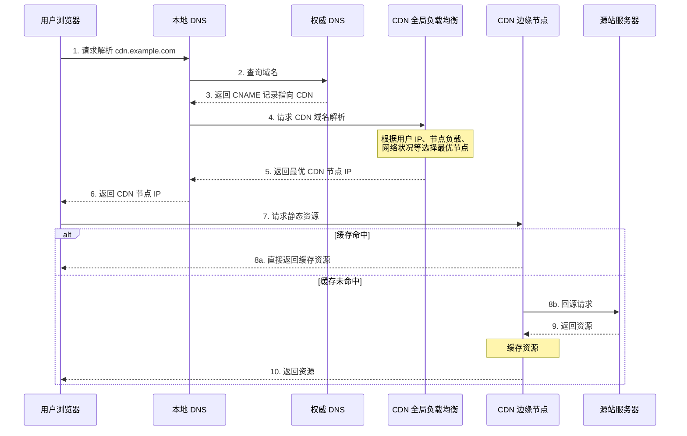

## 什么是 CDN ？

**CDN** 全称是 Content Delivery Network/Content Distribution Network，翻译过的意思是 **内容分发网络** 。

我们可以将内容分发网络拆开来看：

- **内容**：指的是静态资源，包括图片、视频、文档、JS、CSS、HTML 等。
- **分发网络**：指的是将这些静态资源分发到位于多个不同地理位置机房中的服务器上，从而实现**就近访问**——例如北京的用户直接访问北京机房的数据。

简单来说，**CDN 就是将静态资源分发到多个不同的地方以实现就近访问，进而加快静态资源的访问速度，减轻源站服务器以及带宽的负担。**

类似于京东建立的庞大仓储运输体系，京东物流在全国拥有非常多的仓库，仓储网络几乎覆盖全国所有区县。这样的话，用户下单的第一时间，商品就从距离用户最近的仓库直接发往对应的配送站，再由京东小哥送到你家。


你可以将 CDN 看作是服务上一层的**特殊缓存服务**，分布在全国各地，主要用来处理静态资源的请求。


我们经常拿全站加速和内容分发网络做对比，不要把两者搞混了！**全站加速**（不同云服务商叫法不同，腾讯云叫 ECDN、阿里云叫 DCDN）既可以加速静态资源又可以加速动态资源，而**内容分发网络（CDN）** 主要针对的是 **静态资源** 。


绝大部分公司都会在项目开发中使用 CDN 服务，但很少会有自建 CDN 服务的公司。基于成本、稳定性和易用性考虑，建议直接选择专业的云厂商（比如阿里云、腾讯云、华为云、青云）或者 CDN 厂商（比如网宿、蓝汛）提供的开箱即用的 CDN 服务。

### 为什么不直接将服务部署在多个不同的地方？

很多朋友可能要问了：**既然是就近访问，为什么不直接将服务部署在多个不同的地方呢？**

这涉及到**静态资源与动态请求的架构分离**问题：

1. **成本问题**：多地部署完整服务需要部署多套应用、数据库、中间件，成本极高；而 CDN 只需存储静态资源，成本可控。
2. **资源特性不同**：静态资源（图片、JS、CSS）具有**体积大、访问频繁、内容不变**的特点，非常适合缓存分发；动态请求需要实时计算，必须回源处理。
3. **系统资源消耗**：如果用应用服务器直接处理静态资源请求，会大量占用 CPU、内存和带宽资源，可能影响核心业务的正常运行。
4. **专业优化**：CDN 针对静态资源传输进行了大量优化（如智能压缩、协议优化、边缘计算），这些能力是普通应用服务器不具备的。

> **注意**：同一个服务在多个不同地方部署多份（比如同城灾备、异地灾备、同城多活、异地多活）是为了实现系统的**高可用**，而不是就近访问。

## CDN 工作原理是什么？

理解 CDN 的工作原理，需要搞懂以下三个核心问题：

1. 静态资源是如何被缓存到 CDN 节点中的？
2. 如何找到最合适的 CDN 节点？
3. 如何防止静态资源被盗用？

### 静态资源是如何被缓存到 CDN 节点中的？

CDN 缓存静态资源的方式主要有两种：**预热**和**回源**。

- **预热（Prefetch）**：主动将源站的资源推送到 CDN 节点中。这样用户首次请求资源时可以直接从 CDN 节点获取，无需回源，适用于大促活动、热点内容发布等场景。

- **回源（Origin Pull）**：当 CDN 节点上没有用户请求的资源或该资源的缓存已过期时，CDN 节点需要从源站获取最新的资源内容。

> **注意**：当用户请求触发回源时，该请求的响应速度会比未使用 CDN 还慢，因为相比于直接访问源站，多了一层 CDN 节点的调用流程。因此，提高**缓存命中率**是 CDN 优化的关键目标。

CDN 缓存的完整生命周期如下图所示：


如果资源有更新，可以对其进行**刷新（Purge）**操作，删除 CDN 节点上缓存的旧资源，并强制 CDN 节点在下次请求时回源获取最新资源。

几乎所有云厂商提供的 CDN 服务都具备缓存的刷新和预热功能（下图是阿里云 CDN 服务提供的相应功能）：


**命中率**和**回源率**是衡量 CDN 服务质量的两个核心指标：

- **命中率**：用户请求直接由 CDN 节点响应的比例，**越高越好**。
- **回源率**：用户请求需要回源站获取的比例，**越低越好**。

### 如何找到最合适的 CDN 节点？

**GSLB（Global Server Load Balance，全局负载均衡）** 是 CDN 的大脑，负责多个 CDN 节点之间的协调调度，最常用的实现方式是**基于 DNS 的 GSLB**。

CDN 请求的完整调度流程如下图所示：



**详细流程说明**：

1. 用户浏览器向本地 DNS 服务器发送域名解析请求。
2. 本地 DNS 向权威 DNS 查询，发现该域名配置了 **CNAME（Canonical Name）别名记录**，指向 CDN 服务商的域名。
3. 本地 DNS 继续向 CDN 的 **GSLB** 发起解析请求。
4. GSLB 根据**用户 IP 地址、CDN 节点状态（负载、性能、响应时间、带宽）** 等指标，综合判断并返回最优 CDN 节点的 IP 地址。
5. 用户浏览器直接向该 CDN 节点（边缘服务器）发起资源请求。
6. CDN 节点检查本地缓存，若命中则直接返回；若未命中或已过期，则回源获取后再返回给用户。

> **补充说明**：上图做了一定简化。实际上，GSLB 内部可以看作是 **CDN 专用 DNS 服务器**和**负载均衡系统**的组合。CDN 专用 DNS 服务器会返回负载均衡系统的 IP 地址，浏览器通过该 IP 请求负载均衡系统，进而找到对应的 CDN 节点。

### 如何防止资源被盗刷？

如果静态资源被其他用户或网站非法盗刷，将会产生大量额外的带宽费用。常见的防盗链机制有以下几种：

| 防盗链机制         | 原理                                          | 安全强度 | 实现成本 | 绕过难度                   |
| ------------------ | --------------------------------------------- | -------- | -------- | -------------------------- |
| **Referer 防盗链** | 根据 HTTP 请求头中的 Referer 字段判断请求来源 | 低       | 低       | 低（可伪造或置空 Referer） |
| **时间戳防盗链**   | URL 中携带签名和过期时间，过期后 URL 失效     | 中       | 中       | 中（需要获取签名算法）     |
| **IP 黑白名单**    | 限制或允许特定 IP 地址访问                    | 中       | 低       | 中（可通过代理绕过）       |
| **Token 鉴权**     | 业务服务器生成 Token，CDN 节点校验            | 高       | 高       | 高                         |

#### Referer 防盗链

通过检查 HTTP 请求头中的 **Referer** 字段来判断请求来源是否合法。可以配置允许访问的域名白名单，非白名单来源的请求将被拒绝。

CDN 服务提供商几乎都支持这种基础的防盗链机制：


> **注意**：如果防盗链配置允许 Referer 为空，攻击者可以通过隐藏 Referer 的方式绕过防盗链检查。因此，Referer 防盗链通常需要配合其他机制一起使用。

#### 时间戳防盗链

**时间戳防盗链**的安全性更强，其核心原理是：URL 中携带**签名字符串**和**过期时间**，CDN 节点在处理请求时会校验签名并检查是否过期，过期的 URL 将被拒绝访问。

签名字符串通常通过对**加密密钥 + 请求路径 + 过期时间**进行 MD5 哈希计算得到。

时间戳防盗链 URL 示例：

```plain
http://cdn.example.com/video/123.mp4?wsSecret=79aead3bd7b5db4adeffb93a010298b5&wsTime=1601026312
```

- `wsSecret`：签名字符串，由服务端根据密钥和请求信息计算生成。
- `wsTime`：过期时间戳（Unix 时间戳格式）。


绝大部分 CDN 服务提供商都支持开箱即用的时间戳防盗链机制：


> **推荐实践**：生产环境建议采用 **Referer 防盗链 + 时间戳防盗链**的组合方案，兼顾安全性与实现成本。对于安全性要求极高的场景（如付费内容），可进一步引入 Token 鉴权机制。

## 总结

- **CDN 的核心价值**：将静态资源分发到多个不同的地方以实现**就近访问**，加快静态资源的访问速度，减轻源站服务器及带宽的负担。
- **CDN 服务选型**：基于成本、稳定性和易用性考虑，建议直接选择专业的云厂商（如阿里云、腾讯云、华为云）或 CDN 厂商（如网宿、蓝汛）提供的开箱即用服务。
- **GSLB 的作用**：GSLB（全局负载均衡）是 CDN 的大脑，负责根据用户位置、节点状态等因素，将用户请求调度到**最优的 CDN 节点**。
- **核心指标**：**命中率**越高越好，**回源率**越低越好。
- **防盗链机制**：推荐采用 **Referer 防盗链 + 时间戳防盗链**的组合方案，平衡安全性与实现成本。

## 参考

- 时间戳防盗链 - 七牛云 CDN：<https://developer.qiniu.com/fusion/kb/1670/timestamp-hotlinking-prevention>
- CDN 是个啥玩意？一文说个明白：<https://mp.weixin.qq.com/s/Pp0C8ALUXsmYCUkM5QnkQw>
- 《透视 HTTP 协议》- 37 | CDN：加速我们的网络服务：<http://gk.link/a/11yOG>

<!-- @include: @article-footer.snippet.md -->
