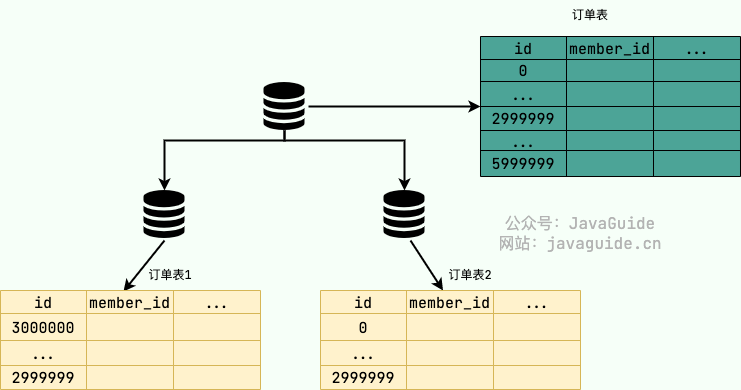
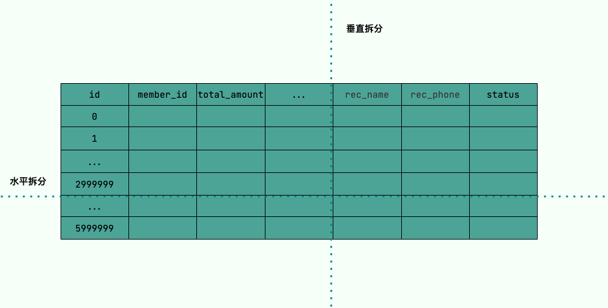
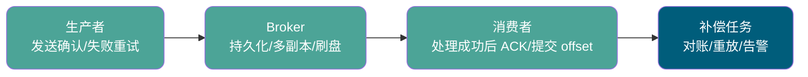
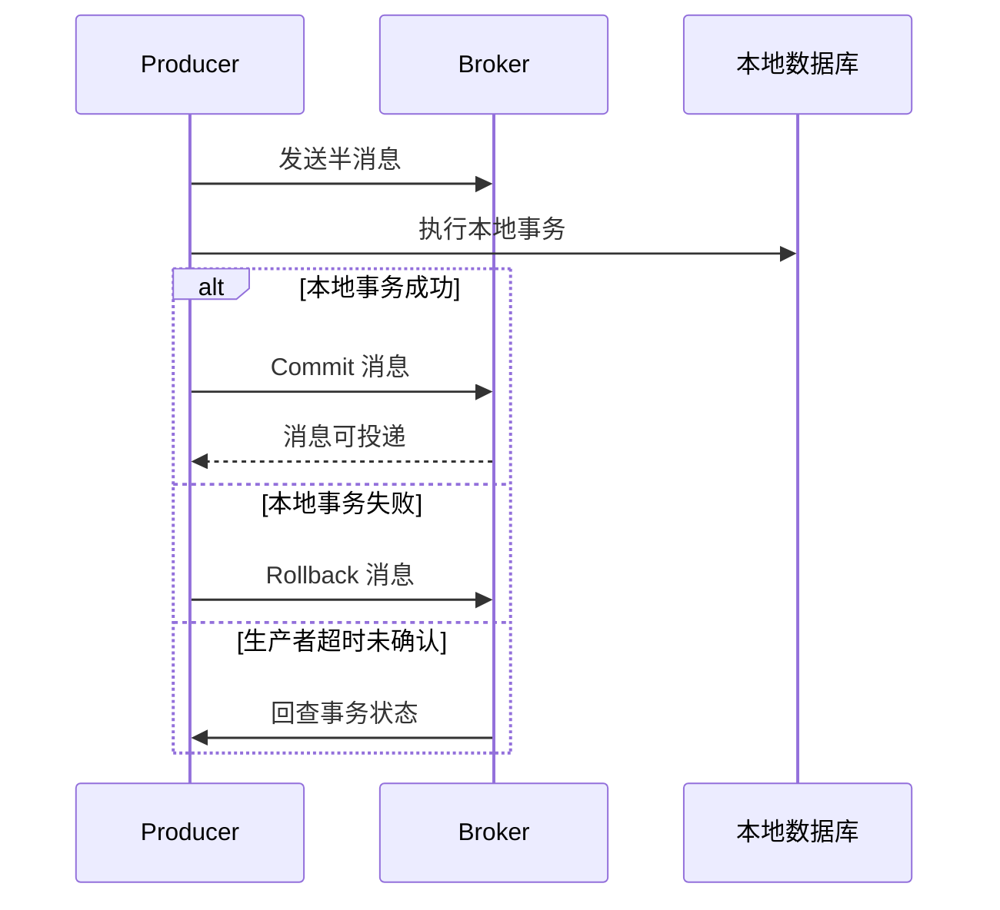

这部分内容摘自 [JavaGuide](https://javaguide.cn/) 高性能专题的重点文章，适合在系统复习之后用来查漏补缺。

高性能面试题通常不会只考一个概念。面试官更关心你能不能把问题放回真实链路里：请求从入口进来，经过负载均衡、应用服务、缓存、数据库、消息队列之后，哪个环节慢了，哪个环节扛不住，哪个方案能解决，方案又会带来什么新问题。

建议按“是什么 -> 解决什么问题 -> 核心原理 -> 适用边界 -> 生产落地”这 5 个角度准备答案。这样既能回答基础概念，也能应对继续追问。

高性能基础：

- [CDN 工作原理详解](https://javaguide.cn/high-performance/cdn.html)
- [负载均衡原理及算法详解](https://javaguide.cn/high-performance/load-balancing.html)

数据库性能优化：

- [读写分离和分库分表详解](https://javaguide.cn/high-performance/read-and-write-separation-and-library-subtable.html)
- [数据冷热分离详解](https://javaguide.cn/high-performance/data-cold-hot-separation.html)
- [常见 SQL 优化手段总结](https://javaguide.cn/high-performance/sql-optimization.html)
- [深度分页介绍及优化建议](https://javaguide.cn/high-performance/deep-pagination-optimization.html)

消息队列：

- [消息队列基础常见问题总结](https://javaguide.cn/high-performance/message-queue/message-queue.html)
- [Kafka 常见面试题总结](https://javaguide.cn/high-performance/message-queue/kafka-questions-01.html)
- [RocketMQ 常见面试题总结](https://javaguide.cn/high-performance/message-queue/rocketmq-questions.html)
- [RabbitMQ 常见面试题总结](https://javaguide.cn/high-performance/message-queue/rabbitmq-questions.html)
- [Disruptor 常见面试题总结](https://javaguide.cn/high-performance/message-queue/disruptor-questions.html)

## 回答高性能问题的通用思路

遇到高性能系统设计题，可以先按下面几个问题拆开：

1. **目标是什么**：优化平均响应时间、P99、吞吐量、数据库压力，还是用户感知速度？
2. **瓶颈在哪里**：入口带宽、应用线程池、缓存命中率、慢 SQL、锁竞争、下游依赖、MQ 积压？
3. **方案放在哪一层**：CDN/负载均衡解决入口问题，缓存/限流/异步化解决应用压力，索引/读写分离/分库分表解决数据层压力，MQ 解决削峰和异步协作。
4. **代价是什么**：缓存一致性、主从延迟、分片路由、重复消费、顺序性下降、运维复杂度都会跟着来。
5. **怎么验证**：压测、灰度、监控、告警、回滚和容量预估必须一起讲。

如果题目没有给具体指标，不要急着报方案。先追问或主动假设业务量级，再说明在这个假设下怎么做。

## 高性能基础

### ⭐️什么是 CDN？为什么 CDN 能提升访问速度？

CDN（Content Delivery Network，内容分发网络）本质上是把静态资源缓存到离用户更近的边缘节点，用户访问资源时不一定回源站，而是优先从附近 CDN 节点获取。


它能提升访问速度，主要靠两点：

1. **距离更近**：用户不需要跨地域访问源站，网络时延更低。
2. **缓存命中**：静态资源在 CDN 节点命中后，可以直接返回，源站压力也会下降。

典型适合 CDN 缓存的内容包括图片、CSS、JS、字体、下载文件等。HTML 是否缓存要谨慎，尤其是 VuePress/Vite 这类带 hash 静态资源的站点，HTML 长期缓存可能引用到已经不存在的旧资源。

面试里如果继续追问“CDN 为什么一定能更快”，可以从 **就近接入、边缘缓存、跨运营商优化、源站减压** 这 4 个角度回答。它不是让源站本身变快，而是把大量重复请求拦在离用户更近的位置。

### CDN 回源是什么意思？

当 CDN 节点没有缓存用户请求的资源，或者缓存过期时，CDN 节点会向源站请求资源，这个过程叫 **回源**。

回源后，CDN 会根据缓存规则决定是否把资源缓存到边缘节点。后续用户再访问同一个资源时，如果缓存命中，就不需要再访问源站。


面试里可以这样总结：

- **命中缓存**：用户 -> CDN 节点 -> 用户。
- **未命中缓存**：用户 -> CDN 节点 -> 源站 -> CDN 节点 -> 用户。

回源并不是坏事，但回源量过大通常说明缓存策略、资源 URL 设计或刷新预热策略有问题。比如资源没有设置合理 `Cache-Control`、静态资源文件名没有 hash、部署后没有预热热点资源，都可能让 CDN 边缘节点频繁回源。

### ⭐️HTML、JS、CSS、图片的缓存策略有什么区别？

推荐策略如下：

| 资源类型    | 推荐缓存策略                         | 原因                                      |
| ----------- | ------------------------------------ | ----------------------------------------- |
| HTML        | 不长期缓存，或很短时间缓存           | HTML 是入口文件，可能引用新的 JS/CSS      |
| hash JS/CSS | 长期缓存，如一年，并设置 `immutable` | 文件名带内容 hash，内容变了文件名也会变   |
| 图片        | 较长缓存，如 30 天                   | 图片通常更新频率较低                      |
| sitemap     | 不缓存或短缓存                       | 搜索引擎需要尽快拿到最新 URL 和更新时间   |
| robots      | 不缓存或短缓存                       | 抓取规则和 sitemap 地址变化后需要尽快生效 |


一个常见坑是：部署时清空旧 `/assets/`，但 CDN 或浏览器里还有旧 HTML，旧 HTML 再去请求旧 hash chunk 就会 404，表现为白屏或路由跳转失败。

所以静态站点部署时建议保留旧 assets 一段时间，HTML、sitemap、robots 这类入口文件走短缓存，带内容 hash 的 JS/CSS 才适合长缓存。

### 什么是负载均衡？

负载均衡是把请求分发到多个后端节点，避免所有流量都打到单台机器上。它的核心目标是提升系统的吞吐能力、可用性和扩展能力。


常见类型：

- **服务端负载均衡**：客户端请求先到负载均衡器，再由负载均衡器转发到后端服务。
- **客户端负载均衡**：客户端本地拿到服务实例列表，自己决定请求哪个实例。


服务端负载均衡更常见于入口网关、Nginx、LVS、云负载均衡等场景；客户端负载均衡更常见于微服务内部调用，比如客户端从注册中心拿到服务列表后本地选择实例。

### ⭐️常见负载均衡算法有哪些？

常见算法如下：

| 算法         | 思路                       | 适用场景                   |
| ------------ | -------------------------- | -------------------------- |
| 随机         | 随机选择一个节点           | 节点性能差异不大           |
| 轮询         | 按顺序分发请求             | 节点配置接近，请求成本接近 |
| 加权轮询     | 配置高的节点分配更多请求   | 后端机器配置不同           |
| 最小连接     | 优先选择连接数少的节点     | 请求耗时差异较大           |
| 最快响应时间 | 优先选择响应更快的节点     | 更关注延迟体验             |
| 一致性哈希   | 同一类请求尽量落到同一节点 | 缓存、会话、分片类场景     |

一致性哈希的价值在于扩缩容时只迁移少量数据或请求映射，适合缓存节点扩容、分片路由等场景。


补充一点：负载均衡不是只看“分得均不均”，还要看后端节点是否健康、慢节点是否被剔除、是否有预热机制、是否存在会话粘滞、是否会把热点请求集中到少数节点上。

## 数据库性能优化

### ⭐️什么是读写分离？它解决了什么问题？

读写分离是把写请求交给主库，把读请求分散到从库。它主要解决的是 **读多写少场景下主库读压力过大** 的问题。


典型流程：

1. 主库处理写请求。
2. 主库通过 binlog 将数据同步到从库。
3. 应用或代理层把读请求路由到从库。


读写分离能提升读吞吐，但会引入主从延迟问题。写完立刻读的强一致场景，通常需要读主库、延迟读取或业务上接受短暂不一致。

### 主从复制的基本原理是什么？

MySQL 主从复制依赖 binlog。主库把数据变更写入 binlog，从库通过 I/O 线程拉取 binlog 写入 relay log，再由 SQL 线程重放 relay log。


可以简单拆成 3 个时间点：

1. 主库提交事务并写入 binlog。
2. 从库 I/O 线程接收 binlog 并写入 relay log。
3. 从库 SQL 线程执行 relay log，把数据同步到本地。

主从延迟通常就出现在网络传输、从库 I/O 写入、从库 SQL 重放这几个环节。

### ⭐️什么情况下会出现主从延迟？

常见原因包括：

- 从库机器性能比主库差。
- 从库承担了过多读请求。
- 主库执行了大事务，从库重放耗时很长。
- 从库数量太多，主库同步压力变大。
- 主从之间网络延迟较高。
- 从库复制线程并行度不足。

解决思路包括提升从库规格、减少慢 SQL 和大事务、开启并行复制、读请求扩容、核心链路强制读主库等。

### 什么是分库分表？

分库分表是把数据拆散到多个库或多张表里，解决单库单表数据量过大、读写压力过高的问题。

常见拆分方式：

- **垂直分库**：按业务拆库，比如用户库、订单库、商品库。
- **水平分库**：同一张表按规则分散到多个库。
- **垂直分表**：按字段拆表，把大字段或低频字段拆出去。
- **水平分表**：同一张表按行拆成多张表。






### ⭐️什么时候需要分库分表？

分库分表不是性能优化的第一选择，只有当常规优化扛不住时才考虑。

典型场景：

- 单表数据量很大，查询和写入明显变慢。
- 单库容量或连接数接近瓶颈。
- 单库写入压力过高，无法继续扩容。
- 业务天然有明确分片维度，比如用户 ID、租户 ID、订单 ID。

在分库分表前，应该优先做索引优化、SQL 优化、缓存、读写分离、冷热分离等成本更低的方案。

### 分库分表会带来哪些问题？

常见问题包括：

- 跨库 Join 变复杂。
- 分布式事务变复杂。
- 全局唯一 ID 需要单独设计。
- 跨分片聚合、排序、分页变复杂。
- 扩容和数据迁移成本高。
- 分片键选错会导致数据倾斜或热点。

所以，分库分表的本质不是“性能银弹”，而是用更高的系统复杂度换取更强的容量和吞吐上限。


实际落地时通常会借助 ShardingSphere、MyCat 或自研中间层来处理路由、归并、分页、分布式主键等问题。面试里要强调：中间件能降低接入成本，但不会消灭分片带来的业务复杂度。

### ⭐️分片键应该如何选择？

分片键要尽量满足 4 个要求：

1. **覆盖主要查询场景**：避免一次查询扫多个分片。
2. **足够离散**：避免大量数据集中到少数分片。
3. **稳定不变**：避免后续数据迁移。
4. **便于扩展**：方便未来扩容。

比如订单系统常用用户 ID、商家 ID、订单 ID 作为候选分片键，但具体选哪个，要看最核心的查询路径。

### SQL 优化有哪些常见手段？

常见手段包括：

- 避免 `SELECT *`，只查需要的字段。
- 尽量减少大表 Join。
- 为高频查询条件建立合适索引。
- 避免索引失效。
- 使用覆盖索引减少回表。
- 使用批量操作减少网络往返。
- 用 `UNION ALL` 替代不必要的 `UNION`。
- 通过慢查询日志、执行计划、Profile 分析瓶颈。

SQL 优化不要只背规则，面试时最好结合执行计划说明是否走索引、扫描行数多少、是否回表、是否需要排序和临时表。


一个比较稳的回答顺序是：先看慢查询日志定位 SQL，再用 `EXPLAIN` 看访问类型、命中索引、扫描行数、Extra 信息，最后结合业务改索引、改 SQL 或调整表结构。不要一上来就说“加索引”，因为不合适的索引也会拖慢写入、占用空间，甚至误导优化器。

### ⭐️哪些情况会导致索引失效？

常见原因包括：

- 对索引列使用函数或表达式。
- 隐式类型转换。
- 使用前导模糊匹配，比如 `LIKE "%abc"`。
- 联合索引不满足最左前缀原则。
- 范围查询后面的联合索引列无法继续用于有序匹配。
- 查询条件选择性太差，优化器认为全表扫描更划算。

面试回答时可以补一句：索引是否失效不要靠猜，最终要看 `EXPLAIN` 和真实执行计划。

### 什么是深度分页？为什么会慢？

深度分页指页码非常靠后，比如：

```sql
SELECT * FROM orders ORDER BY id LIMIT 1000000, 10;
```

MySQL 需要先扫描并跳过前 1000000 条记录，再返回 10 条。偏移量越大，扫描成本越高。


深度分页慢的关键不是“只返回 10 条”，而是数据库为了找到这 10 条，可能已经扫描、排序、回表了大量无用记录。偏移越大，浪费越严重。

### ⭐️深度分页如何优化？

常见优化方式：

| 方案     | 思路                         | 适用场景                   |
| -------- | ---------------------------- | -------------------------- |
| 游标分页 | 记录上一页最后一条记录的 ID  | 无限滚动、下一页场景       |
| 子查询   | 先查主键，再回表查完整数据   | 能通过索引快速定位主键     |
| 延迟关联 | 先在索引上分页，再关联原表   | 大偏移分页                 |
| 覆盖索引 | 查询字段都在索引里，避免回表 | 查询字段较少、索引设计合理 |

如果产品必须支持跳到任意页，优化空间会小很多；如果可以改成“下一页”模式，游标分页通常更稳。


面试中可以补一句：深度分页优化往往需要产品形态配合。后台管理系统可能必须跳页，移动端信息流通常可以改成游标分页，两者优化策略不一样。

### 什么是数据冷热分离？

数据冷热分离是把高频访问的热数据和低频访问的冷数据分开存储。热数据保留在主业务库或高性能存储中，冷数据迁移到成本更低的存储里。

典型场景：

- 订单系统：近 3 个月订单是热数据，历史订单是冷数据。
- 日志系统：近期日志用于检索，历史日志归档。
- 内容系统：热门内容和历史低频内容分层存储。


冷热分离解决的是“历史数据拖慢核心库”的问题。它和分库分表不同：分库分表更偏容量和并发扩展，冷热分离更偏生命周期管理和存储成本控制。

### ⭐️冷热分离迁移时如何保证一致性？

常见方案是分批迁移 + 双写校验 + 对账补偿：

1. 按时间或 ID 范围分批迁移冷数据。
2. 迁移过程中避免大事务，降低对线上库影响。
3. 迁移后校验数量、主键范围、关键字段摘要。
4. 查询层根据时间、状态或路由表决定访问热库还是冷库。
5. 出现不一致时通过补偿任务修复。

冷热分离的核心难点不是搬数据，而是迁移期间的查询路由、一致性校验和回滚策略。

## 消息队列

### ⭐️消息队列有什么用？

消息队列常见作用：

- **异步处理**：把非核心同步流程改为异步。
- **削峰填谷**：高峰流量先写入 MQ，消费者按能力处理。
- **系统解耦**：生产者不直接依赖消费者。
- **顺序处理**：某些业务按消息顺序消费。
- **延时处理**：实现延时任务或定时任务。
- **分布式事务**：通过事务消息、本地消息表等方式实现最终一致。


面试里要注意，MQ 不是只有优点。它会引入消息丢失、重复消费、顺序消费、消息积压、运维复杂度等问题。

### 使用消息队列会带来哪些问题？

常见问题包括：

- 系统可用性降低：MQ 挂了会影响链路。
- 系统复杂度增加：要处理消息丢失、重复、乱序、积压。
- 数据一致性问题：异步处理会引入最终一致性。
- 排查链路变长：问题定位需要结合日志、Trace、消息状态。

所以，是否引入 MQ 要看业务是否真的需要异步、削峰或解耦。


一个判断标准是：如果调用方必须立即拿到下游处理结果，MQ 不一定合适；如果下游处理可以延后，且允许最终一致，MQ 才能发挥价值。

### ⭐️如何保证消息不丢失？

要从生产、Broker、消费三个阶段考虑：

1. **生产者阶段**：开启发送确认机制，失败重试，必要时记录本地消息表。
2. **Broker 阶段**：开启持久化，多副本复制，合理配置刷盘策略。
3. **消费者阶段**：业务处理成功后再提交消费位点或 ACK。



不同 MQ 细节不同，但思路一样：消息必须有确认、有持久化、有重试、有补偿。

### 如何避免重复消费？

MQ 通常很难保证“绝对只消费一次”，生产上更常见的是 **至少一次投递 + 消费端幂等**。

常见幂等手段：

- 业务唯一键去重。
- 数据库唯一索引。
- Redis 去重表。
- 状态机控制流转。
- 消费日志表记录处理状态。

比如订单支付成功消息，消费者可以用订单号作为唯一键，确保同一订单不会重复入账。

### ⭐️如何保证消息顺序消费？

常见思路：

1. 同一业务键的消息发送到同一个队列或分区。
2. 同一个队列或分区只由一个消费者线程按顺序消费。
3. 消费失败时不能直接跳过，否则后续消息可能乱序。

顺序消费的代价是并发能力下降，所以只应该对确实有顺序要求的业务使用，比如同一订单的状态流转。


### 消息积压怎么办？

处理思路：

- 先判断是生产突增、消费者变慢，还是 Broker 本身异常。
- 临时扩容消费者实例或线程数。
- 如果单分区顺序消费限制并发，需要增加分区并调整路由。
- 排查消费者慢 SQL、外部接口慢、锁竞争等问题。
- 对历史积压可以用临时消费程序快速导出或批处理。

不要一上来只说“加消费者”。如果队列分区数不足，或者消费逻辑本身串行，加消费者也没用。

### Kafka 为什么吞吐量高？

Kafka 吞吐高主要来自这些设计：

- 顺序写磁盘，减少随机 IO。
- Page Cache 利用操作系统缓存。
- 零拷贝减少数据拷贝。
- 分区机制支持并行读写。
- 批量发送和压缩降低网络开销。


Kafka 更适合日志、埋点、流式数据、削峰等高吞吐场景。

### ⭐️Kafka 如何保证消息不丢失？

常见配置和实践：

- Producer 设置 `acks=all`。
- 配置合理的 `retries` 和幂等生产者。
- Topic 设置多副本。
- Broker 端配置 `min.insync.replicas`。
- Consumer 处理成功后再提交 offset。

如果 `acks=0`，生产者发出去就不管了，性能高但可靠性最低；如果 `acks=all`，需要 ISR 中足够副本确认，可靠性更高但延迟也会增加。


消费者侧还要注意 offset 提交时机：如果先提交 offset 再处理业务，处理失败可能丢消息；如果业务处理成功后再提交 offset，消费者重启时可能重复消费，所以消费端幂等仍然必不可少。

### RocketMQ 的事务消息解决什么问题？

RocketMQ 事务消息主要解决本地事务和消息发送之间的一致性问题。

典型流程：

1. 发送半消息。
2. 执行本地事务。
3. 根据本地事务结果提交或回滚消息。
4. 如果 Broker 长时间拿不到确认，会回查生产者事务状态。



它适合“本地事务成功后必须可靠触发下游动作”的场景，比如创建订单后发送后续处理消息。

### RabbitMQ 的 Exchange、Queue、Routing Key 分别是什么？

RabbitMQ 基于 AMQP 模型：

- **Producer**：发送消息。
- **Exchange**：接收生产者消息，并按规则路由。
- **Queue**：存储消息，等待消费者消费。
- **Routing Key**：路由键，Exchange 根据它决定消息进入哪些队列。
- **Consumer**：消费队列中的消息。


常见 Exchange 类型包括 Direct、Fanout、Topic、Headers，其中 Direct 精确匹配，Fanout 广播，Topic 支持通配符匹配。


RabbitMQ 面试经常会继续追问消息可靠性，回答时可以按“生产者确认、交换机到队列路由、队列持久化、消费者 ACK、死信队列”这条链路来讲。


### Disruptor 和消息队列有什么区别？

Disruptor 是本地内存中的高性能并发框架，不是分布式消息队列。它通过 RingBuffer、无锁设计、缓存行填充等方式减少锁竞争和伪共享，适合单进程内的高性能事件处理。


Kafka、RocketMQ、RabbitMQ 则是分布式消息中间件，关注跨进程、跨机器的消息传递、持久化、可靠性和消费模型。

简单说：

- Disruptor 解决进程内高性能事件传递。
- MQ 解决分布式系统之间的异步通信。


如果面试官追问“为什么 Disruptor 快”，可以补充 RingBuffer 顺序写、减少锁竞争、减少 GC、避免伪共享、通过不同 WaitStrategy 在延迟和 CPU 消耗之间取舍。

## 系统设计综合题

### ⭐️如何设计一个高性能订单系统？

可以按链路拆：

1. **入口层**：CDN 承接静态资源，负载均衡分发 API 请求。
2. **应用层**：热点接口加缓存，核心写接口做好限流和幂等。
3. **数据库层**：读写分离提升读能力，订单表按用户或订单维度分库分表。
4. **查询层**：历史订单做冷热分离，深度分页改游标分页。
5. **异步层**：订单创建后的通知、积分、风控等非核心动作写入 MQ。
6. **稳定性**：监控 QPS、RT、错误率、慢 SQL、消息积压和数据库连接数。

```mermaid
flowchart LR
  U["用户"] --> CDN["CDN<br/>静态资源加速"]
  U --> LB["负载均衡<br/>API 流量分发"]
  LB --> APP["订单服务集群<br/>限流/幂等/缓存"]
  APP --> DBM["主库<br/>写订单"]
  DBM --> DBS["从库<br/>读订单"]
  APP --> MQ["消息队列<br/>削峰/异步解耦"]
  MQ --> C1["库存/积分/通知/风控"]
  APP --> COLD["冷热分离<br/>历史订单归档"]

  classDef core fill:#4CA497,color:#fff,rx:10,ry:10
  classDef infra fill:#005D7B,color:#fff,rx:10,ry:10
  class U core
  class CDN,LB,APP,DBM,DBS,MQ,C1,COLD infra
```



面试里不要只堆技术名词，要先说明业务量级和一致性要求，再给方案。

### 高性能优化的核心思路是什么？

高性能优化可以概括为 6 个方向：

1. **减少请求距离**：CDN、就近访问。
2. **分散流量压力**：负载均衡、水平扩容。
3. **减少重复计算**：缓存、预计算。
4. **降低数据库压力**：索引、SQL 优化、读写分离、分库分表。
5. **削峰和异步化**：消息队列、批处理。
6. **持续观测和压测**：通过指标发现瓶颈，而不是凭感觉优化。

真正的高性能优化不是某个单点技巧，而是围绕整条请求链路持续定位瓶颈、拆解瓶颈和验证效果。
